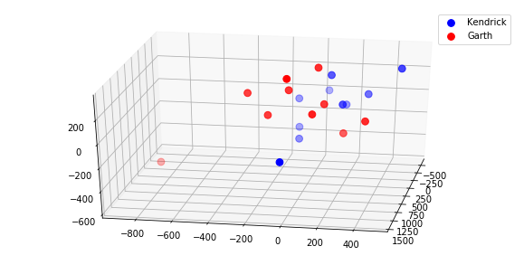
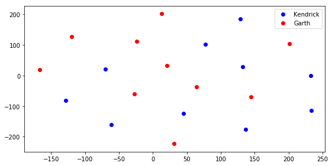

# Word Vectorization Lab

## Problem Statement

In this lab, we'll learn how totokenize and vectorize text documents, create an use a Bag of Words, and identify words unique to individual documents using TF-IDF Vectorization.

## Objectives

* Tokenize a corpus of words and identify the different choices to be made while parsing them.
* Use a Count Vectorization strategy to create a Bag of Words
* Use TF-IDF Vectorization with multiple documents to identify words that are important/unique to certain documents.


Run the cell below to import everything necessary for this lab.  


```python
import pandas as pd
import numpy as np
from mpl_toolkits.mplot3d import Axes3D
import matplotlib.pyplot as plt
%matplotlib inline
from sklearn.manifold import TSNE
from nltk.tokenize import word_tokenize
```

### Our Corpus

In this lab, we'll be working with 20 different documents, each containing song lyrics from either Garth Brooks or Kendrick Lamar albums.  

The songs are contained within the `data` subdirectory, contained within the same folder as this lab.  Each song is stored in a single file, with files ranging from `song1.txt` to `song20.txt`.  

To make it easy to read in all of the documents, use a list comprehension to create a list containing the name of every single song file in the cell below.


```python
filenames = ['song' + str(i) + '.txt' for i in range(1, 21)]
# filenames
```

Next, create an empty DataFrame called `songs_df`.  As we read in the songs and store and clean them, we'll store them in this DataFrame.


```python
songs_df = pd.DataFrame()
```

Next, let's import a single song to see what our text looks like so that we can make sure we clean and tokenize it correctly.

In the cell below, read in and print out the lyrics from `song11.txt`.  Use vanilla python, no pandas needed.  


```python
with open('data/song11.txt') as f:
    test_song = f.readlines()
    print(test_song)
```

    ['[Kendrick Lamar:]\n', "Love, let's talk about love\n", 'Is it anything and everything you hoped for?\n', 'Or do the feeling haunt you?\n', 'I know the feeling haunt you\n', '[SZA:]\n', 'This may be the night that my dreams might let me know\n', 'All the stars approach you, all the stars approach you, all the stars approach you\n', 'This may be the night that my dreams might let me know\n', 'All the stars are closer, all the stars are closer, all the stars are closer\n', '[Kendrick Lamar:]\n', "Tell me what you gon' do to me\n", "Confrontation ain't nothin' new to me\n", 'You can bring a bullet, bring a sword, bring a morgue\n', "But you can't bring the truth to me\n", 'Fuck you and all your expectations\n', "I don't even want your congratulations\n", 'I recognize your false confidence\n', 'And calculated promises all in your conversation\n', 'I hate people that feel entitled\n', "Look at me crazy 'cause I ain't invite you\n", 'Oh, you important?\n', "You the moral to the story? You endorsin'?\n", "Motherfucker, I don't even like you\n", "Corrupt a man's heart with a gift\n", "That's how you find out who you dealin' with\n", "A small percentage who I'm buildin' with\n", "I want the credit if I'm losin' or I'm winnin'\n", "On my momma, that's the realest shit\n", "Love, let's talk about love\n", 'Is it anything and everything you hoped for?\n', 'Or do the feeling haunt you?\n', 'I know the feeling haunt you\n', '[SZA:]\n', 'This may be the night that my dreams might let me know\n', 'All the stars approach you, all the stars approach you, all the stars approach you\n', 'This may be the night that my dreams might let me know\n', 'All the stars are closer, all the stars are closer, all the stars are closer\n', 'Skin covered in ego\n', "Get to talkin' like ya involved, like a rebound\n", 'Got no end game, got no reason\n', "Got to stay down, it's the way that you making me feel\n", 'Like nobody ever loved me like you do, you do\n', "You kinda feeling like you're tryna get away from me\n", "If you do, I won't move\n", "I ain't just cryin' for no reason\n", "I ain't just prayin' for no reason\n", 'I give thanks for the days, for the hours\n', "And another way, another life breathin'\n", "I did it all 'cause it feel good\n", "I wouldn't do it at all if it feel bad\n", "Better live your life, we're runnin' out of time\n", '[Kendrick Lamar & SZA:]\n', "Love, let's talk about love\n", 'Is it anything and everything you hoped for?\n', 'Or do the feeling haunt you?\n', 'I know the feeling haunt you\n', '[SZA:]\n', 'This may be the night that my dreams might let me know\n', 'All the stars approach you, all the stars approach you, all the stars approach you\n', 'This may be the night that my dreams might let me know\n', 'All the stars are closer, all the stars are closer, all the stars are closer\n']


### Tokenizing our Data

Before we can create a Bag of Words or vectorize each document, we need to clean it up and split each song into an array of individual words.  Computers are very particular about strings. If we tokenized our data in it's current state, we would run into the following problems:

1. Counting things that aren't actually words.  In the example above, `"[Kendrick]"` is a note specifying who is speaking, not a lyric contained in the actual song, so it should be removed.  
1. Punctuation and capitalization would mess up our word counts.  To the python interpreter, `love`, `Love`, `Love?`, and `Love\n` are all unique words, and would all be counted separately.  We need to remove punctuation and capitalization, so that all words will be counted correctly.

Consider the following sentences from the example above:

`"Love, let's talk about love\n", 'Is it anything and everything you hoped for?\n'`

After tokenization, this should look like:

`['love', 'let's', 'talk', 'about', 'love', 'is', 'it', 'anything', 'and', 'everything', 'you', 'hoped', 'for']`

Tokenization is pretty tedious if we handle it manually, and would probably make use of Regular Expressions, which is outside the scope of this lab.  In order to keep this lab moving, we'll use a library function to clean and tokenize our data so that we can move onto vectorization.  

Tokenization is a required task for just about any Natural Language Processing (NLP) task, so great industry-standard tools exist to tokenize things for us, so that we can spend our time on more important tasks without getting bogged down hunting every special symbol or punctuation in a massive dataset. For this lab, we'll make use of the tokenizer in the amazing `nltk` library, which is short for _Natural Language Tool Kit_.

**_NOTE:_** NLTK requires extra installation methods to be run the first time certain methods are used.  If `nltk` throws you an error about needing to install additional packages, follow the instructions in the error message to install the dependencies, and then rerun the cell.  

Before we tokenize our songs, we'll do only a small manual bit of cleaning.  In the cell below, write a function that allows us to remove lines that have `['artist names']` in it, to ensure that our song files contain only lyrics that are actually in the song. For the lines that remain, make every word lowercase, remove newline characters `\n`, and any of the following punctuation marks: `",.'?!"`

Test the function on `test_song` to show that it has successfully removed `'[Kendrick Lamar:]'` and other instances of artist names from the song and returned it.  


```python
def clean_song(song):
    cleaned_song = []
    for line in song:
        if not '[' in line and  not ']' in line:
            for symbol in ",.?!''\n":
                line = line.replace(symbol, '').lower()
            cleaned_song.append(line)

    return cleaned_song

song_without_brackets = clean_song(test_song)
song_without_brackets
```


    ['love lets talk about love',
     'is it anything and everything you hoped for',
     'or do the feeling haunt you',
     'i know the feeling haunt you',
     'this may be the night that my dreams might let me know',
     'all the stars approach you all the stars approach you all the stars approach you',
     'this may be the night that my dreams might let me know',
     'all the stars are closer all the stars are closer all the stars are closer',
     'tell me what you gon do to me',
     'confrontation aint nothin new to me',
     'you can bring a bullet bring a sword bring a morgue',
     'but you cant bring the truth to me',
     'fuck you and all your expectations',
     'i dont even want your congratulations',
     'i recognize your false confidence',
     'and calculated promises all in your conversation',
     'i hate people that feel entitled',
     'look at me crazy cause i aint invite you',
     'oh you important',
     'you the moral to the story you endorsin',
     'motherfucker i dont even like you',
     'corrupt a mans heart with a gift',
     'thats how you find out who you dealin with',
     'a small percentage who im buildin with',
     'i want the credit if im losin or im winnin',
     'on my momma thats the realest shit',
     'love lets talk about love',
     'is it anything and everything you hoped for',
     'or do the feeling haunt you',
     'i know the feeling haunt you',
     'this may be the night that my dreams might let me know',
     'all the stars approach you all the stars approach you all the stars approach you',
     'this may be the night that my dreams might let me know',
     'all the stars are closer all the stars are closer all the stars are closer',
     'skin covered in ego',
     'get to talkin like ya involved like a rebound',
     'got no end game got no reason',
     'got to stay down its the way that you making me feel',
     'like nobody ever loved me like you do you do',
     'you kinda feeling like youre tryna get away from me',
     'if you do i wont move',
     'i aint just cryin for no reason',
     'i aint just prayin for no reason',
     'i give thanks for the days for the hours',
     'and another way another life breathin',
     'i did it all cause it feel good',
     'i wouldnt do it at all if it feel bad',
     'better live your life were runnin out of time',
     'love lets talk about love',
     'is it anything and everything you hoped for',
     'or do the feeling haunt you',
     'i know the feeling haunt you',
     'this may be the night that my dreams might let me know',
     'all the stars approach you all the stars approach you all the stars approach you',
     'this may be the night that my dreams might let me know',
     'all the stars are closer all the stars are closer all the stars are closer']


Great. Now, write a function that takes in songs that have had their brackets removed, joins all of the lines into a single string, and then uses `tokenize()` on it to get a fully tokenized version of the song.  Test this funtion on `song_without_brackets` to ensure that the function works.


```python
def tokenize(song):
    joined_song = ' '.join(song)
    tokenized_song = word_tokenize(joined_song)

    return tokenized_song

tokenized_test_song = tokenize(song_without_brackets)
tokenized_test_song
```


    ['love',
     'lets',
     'talk',
     'about',
     'love',
     'is',
     'it',
     'anything',
     'and',
     'everything',
     'you',
     'hoped',
     'for',
     'or',
     'do',
     'the',
     'feeling',
     'haunt',
     'you',
     'i',
     'know',
     'the',
     'feeling',
     'haunt',
     'you',
     'this',
     'may',
     'be',
     'the',
     'night',
     'that',
     'my',
     'dreams',
     'might',
     'let',
     'me',
     'know',
     'all',
     'the',
     'stars',
     'approach',
     'you',
     'all',
     'the',
     'stars',
     'approach',
     'you',
     'all',
     'the',
     'stars',
     'approach',
     'you',
     'this',
     'may',
     'be',
     'the',
     'night',
     'that',
     'my',
     'dreams',
     'might',
     'let',
     'me',
     'know',
     'all',
     'the',
     'stars',
     'are',
     'closer',
     'all',
     'the',
     'stars',
     'are',
     'closer',
     'all',
     'the',
     'stars',
     'are',
     'closer',
     'tell',
     'me',
     'what',
     'you',
     'gon',
     'do',
     'to',
     'me',
     'confrontation',
     'aint',
     'nothin',
     'new',
     'to',
     'me',
     'you',
     'can',
     'bring',
     'a',
     'bullet',
     'bring',
     'a',
     'sword',
     'bring',
     'a',
     'morgue',
     'but',
     'you',
     'cant',
     'bring',
     'the',
     'truth',
     'to',
     'me',
     'fuck',
     'you',
     'and',
     'all',
     'your',
     'expectations',
     'i',
     'dont',
     'even',
     'want',
     'your',
     'congratulations',
     'i',
     'recognize',
     'your',
     'false',
     'confidence',
     'and',
     'calculated',
     'promises',
     'all',
     'in',
     'your',
     'conversation',
     'i',
     'hate',
     'people',
     'that',
     'feel',
     'entitled',
     'look',
     'at',
     'me',
     'crazy',
     'cause',
     'i',
     'aint',
     'invite',
     'you',
     'oh',
     'you',
     'important',
     'you',
     'the',
     'moral',
     'to',
     'the',
     'story',
     'you',
     'endorsin',
     'motherfucker',
     'i',
     'dont',
     'even',
     'like',
     'you',
     'corrupt',
     'a',
     'mans',
     'heart',
     'with',
     'a',
     'gift',
     'thats',
     'how',
     'you',
     'find',
     'out',
     'who',
     'you',
     'dealin',
     'with',
     'a',
     'small',
     'percentage',
     'who',
     'im',
     'buildin',
     'with',
     'i',
     'want',
     'the',
     'credit',
     'if',
     'im',
     'losin',
     'or',
     'im',
     'winnin',
     'on',
     'my',
     'momma',
     'thats',
     'the',
     'realest',
     'shit',
     'love',
     'lets',
     'talk',
     'about',
     'love',
     'is',
     'it',
     'anything',
     'and',
     'everything',
     'you',
     'hoped',
     'for',
     'or',
     'do',
     'the',
     'feeling',
     'haunt',
     'you',
     'i',
     'know',
     'the',
     'feeling',
     'haunt',
     'you',
     'this',
     'may',
     'be',
     'the',
     'night',
     'that',
     'my',
     'dreams',
     'might',
     'let',
     'me',
     'know',
     'all',
     'the',
     'stars',
     'approach',
     'you',
     'all',
     'the',
     'stars',
     'approach',
     'you',
     'all',
     'the',
     'stars',
     'approach',
     'you',
     'this',
     'may',
     'be',
     'the',
     'night',
     'that',
     'my',
     'dreams',
     'might',
     'let',
     'me',
     'know',
     'all',
     'the',
     'stars',
     'are',
     'closer',
     'all',
     'the',
     'stars',
     'are',
     'closer',
     'all',
     'the',
     'stars',
     'are',
     'closer',
     'skin',
     'covered',
     'in',
     'ego',
     'get',
     'to',
     'talkin',
     'like',
     'ya',
     'involved',
     'like',
     'a',
     'rebound',
     'got',
     'no',
     'end',
     'game',
     'got',
     'no',
     'reason',
     'got',
     'to',
     'stay',
     'down',
     'its',
     'the',
     'way',
     'that',
     'you',
     'making',
     'me',
     'feel',
     'like',
     'nobody',
     'ever',
     'loved',
     'me',
     'like',
     'you',
     'do',
     'you',
     'do',
     'you',
     'kinda',
     'feeling',
     'like',
     'youre',
     'tryna',
     'get',
     'away',
     'from',
     'me',
     'if',
     'you',
     'do',
     'i',
     'wont',
     'move',
     'i',
     'aint',
     'just',
     'cryin',
     'for',
     'no',
     'reason',
     'i',
     'aint',
     'just',
     'prayin',
     'for',
     'no',
     'reason',
     'i',
     'give',
     'thanks',
     'for',
     'the',
     'days',
     'for',
     'the',
     'hours',
     'and',
     'another',
     'way',
     'another',
     'life',
     'breathin',
     'i',
     'did',
     'it',
     'all',
     'cause',
     'it',
     'feel',
     'good',
     'i',
     'wouldnt',
     'do',
     'it',
     'at',
     'all',
     'if',
     'it',
     'feel',
     'bad',
     'better',
     'live',
     'your',
     'life',
     'were',
     'runnin',
     'out',
     'of',
     'time',
     'love',
     'lets',
     'talk',
     'about',
     'love',
     'is',
     'it',
     'anything',
     'and',
     'everything',
     'you',
     'hoped',
     'for',
     'or',
     'do',
     'the',
     'feeling',
     'haunt',
     'you',
     'i',
     'know',
     'the',
     'feeling',
     'haunt',
     'you',
     'this',
     'may',
     'be',
     'the',
     'night',
     'that',
     'my',
     'dreams',
     'might',
     'let',
     'me',
     'know',
     'all',
     'the',
     'stars',
     'approach',
     'you',
     'all',
     'the',
     'stars',
     'approach',
     'you',
     'all',
     'the',
     'stars',
     'approach',
     'you',
     'this',
     'may',
     'be',
     'the',
     'night',
     'that',
     'my',
     'dreams',
     'might',
     'let',
     'me',
     'know',
     'all',
     'the',
     'stars',
     'are',
     'closer',
     'all',
     'the',
     'stars',
     'are',
     'closer',
     'all',
     'the',
     'stars',
     'are',
     'closer']


Great! Now that we know the ability to tokenize our songs, we can move onto Vectorization.

### Count Vectorization

Machine Learning algorithms don't understand strings.  However, they do understand math, which means they understand vectors and matrices.  By **_Vectorizing_** the text, we just convert the entire text into a vector, where each element in the vector represents a different word.  The vector is the length of the entire vocabulary--usually, every word that occurs in the English language, or at least every word that appears in our corpus.  Any given sentence can then be represented as a vector where all the vector is 1 (or some other value) for each time that word appears in the sentence.

Consider the following example:

<center>"I scream, you scream, we all scream for ice cream."</center>

| 'aardvark' | 'apple' | [...] | 'I' | 'you' | 'scream' | 'we' | 'all' | 'for' | 'ice' | 'cream' | [...] | 'xylophone' | 'zebra' |
|:----------:|:-------:|:-----:|:---:|:-----:|:--------:|:----:|:-----:|:-----:|:-----:|:-------:|:-----:|:-----------:|:-------:|
|      0     |    0    |   0   |  1  |   1   |     3    |   1  |   1   |   1   |   1   |    1    |   0   |      0      |    0    |

This is called a **_Sparse Representation_**, since the strong majority of the columns will have a value of 0.  Note that elements corresponding to words that do not occur in the sentence have a value of 0, while words that do appear in the sentence have a value of 1 (or 1 for each time it appears in the sentence).

Alternatively, we can represent this sentence as a plain old python dictionary of word frequency counts:

```python
BoW = {
    'I':1,
    'you':1,
    'scream':3,
    'we':1,
    'all':1,
    'for':1,
    'ice':1,
    'cream':1
}
```

Both of these are examples of **_Count Vectorization_**. They allow us to represent a sentence as a vector, with each element in the vector corresponding to how many times that word is used.

#### Positional Information and Bag of Words

Notice that when we vectorize a sentence this way, we lose the order that the words were in.  This is the **_Bag of Words_** approach mentioned earlier.  Note that sentences that contain the same words will create the same vectors, even if they mean different things--e.g. `'cats are scared of dogs'` and `'dogs are scared of cats'` would both produce the exact same vector, since they contain the same words.  

In the cell below, create a function that takes in a tokenized, cleaned song and returns a Count Vectorized representation of it as a python dictionary. Add in an optional parameter called `vocab` that defaults to `None`. This way, if we are using a vocabulary that contains words not seen in the song, we can still use this function by passing it in to the `vocab` parameter.

**_Hint:_**  Consider using a `set` object to make this easier!


```python
def count_vectorize(song, vocab=None):
    if vocab:
        unique_words = vocab
    else:
        unique_words = list(set(song))

    song_dict = {i:0 for i in unique_words}

    for word in song:
        song_dict[word] += 1

    return song_dict

test_vectorized = count_vectorize(tokenized_test_song)
print(test_vectorized)
```

    {'ego': 1, 'fuck': 1, 'might': 6, 'haunt': 6, 'just': 2, 'to': 6, 'sword': 1, 'realest': 1, 'talkin': 1, 'runnin': 1, 'oh': 1, 'wont': 1, 'for': 7, 'hoped': 3, 'credit': 1, 'invite': 1, 'breathin': 1, 'endorsin': 1, 'prayin': 1, 'in': 2, 'is': 3, 'were': 1, 'making': 1, 'promises': 1, 'morgue': 1, 'approach': 9, 'give': 1, 'the': 38, 'its': 1, 'tryna': 1, 'thats': 2, 'with': 3, 'days': 1, 'your': 5, 'cryin': 1, 'hours': 1, 'of': 1, 'dont': 2, 'cause': 2, 'or': 4, 'closer': 9, 'who': 2, 'hate': 1, 'are': 9, 'down': 1, 'kinda': 1, 'talk': 3, 'know': 9, 'bullet': 1, 'tell': 1, 'confrontation': 1, 'out': 2, 'motherfucker': 1, 'away': 1, 'important': 1, 'dealin': 1, 'that': 8, 'shit': 1, 'and': 6, 'how': 1, 'let': 6, 'move': 1, 'crazy': 1, 'good': 1, 'bad': 1, 'loved': 1, 'from': 1, 'did': 1, 'time': 1, 'another': 2, 'heart': 1, 'aint': 4, 'buildin': 1, 'it': 7, 'got': 3, 'lets': 3, 'story': 1, 'may': 6, 'confidence': 1, 'all': 22, 'losin': 1, 'can': 1, 'but': 1, 'percentage': 1, 'expectations': 1, 'anything': 3, 'gon': 1, 'stars': 18, 'you': 34, 'like': 6, 'if': 3, 'skin': 1, 'youre': 1, 'find': 1, 'stay': 1, 'feeling': 7, 'on': 1, 'cant': 1, 'entitled': 1, 'conversation': 1, 'do': 8, 'get': 2, 'corrupt': 1, 'im': 3, 'at': 2, 'night': 6, 'gift': 1, 'momma': 1, 'bring': 4, 'people': 1, 'reason': 3, 'calculated': 1, 'mans': 1, 'new': 1, 'dreams': 6, 'want': 2, 'ever': 1, 'love': 6, 'ya': 1, 'rebound': 1, 'better': 1, 'truth': 1, 'involved': 1, 'me': 14, 'small': 1, 'game': 1, 'moral': 1, 'recognize': 1, 'end': 1, 'this': 6, 'be': 6, 'life': 2, 'look': 1, 'false': 1, 'covered': 1, 'thanks': 1, 'live': 1, 'nothin': 1, 'even': 2, 'congratulations': 1, 'about': 3, 'everything': 3, 'no': 4, 'my': 7, 'feel': 4, 'i': 15, 'winnin': 1, 'wouldnt': 1, 'a': 7, 'nobody': 1, 'way': 2, 'what': 1}


Great! You've just successfully vectorized your first text document! Now, let's look at a more advanced type of vectorization, TF-IDF!

### TF-IDF Vectorization

TF-IDF stands for **_Term Frequency, Inverse Document Frequency_**.  This is a more advanced form of vectorization that weights each term in a document by how unique it is to the given document it is contained in, which allows us to summarize the contents of a document using a few key words.  If the word is used often in many other documents, it is not unique, and therefore probably not too useful if we wanted to figure out how this document is unique in relation to other documents.  Conversely, if a word is used many times in a document, but rarely in all the other documents we are considering, then it is likely a good indicator for telling us that this word is important to the document in question.  

The formula TF-IDF uses to determine the weights of each term in a document is **_Term Frequency_** multipled by **_Inverse Document Frequency_**, where the formula for Term Frequency is:

$$\large Term\ Frequency(t) = \frac{number\ of\ times\ t\ appears\ in\ a\ document} {total\ number\ of\ terms\ in\ the\ document} $$
<br>
<br>
Complete the following function below to calculate term frequency for every term in a document.  


```python
def term_frequency(BoW_dict):
    total_word_count = sum(BoW_dict.values())

    for ind, val in BoW_dict.items():
        BoW_dict[ind] = val/ total_word_count

    return BoW_dict

term_frequency(test_vectorized)
```


    {'ego': 0.0020833333333333333,
     'fuck': 0.0020833333333333333,
     'might': 0.0125,
     'haunt': 0.0125,
     'just': 0.004166666666666667,
     'to': 0.0125,
     'sword': 0.0020833333333333333,
     'realest': 0.0020833333333333333,
     'talkin': 0.0020833333333333333,
     'runnin': 0.0020833333333333333,
     'oh': 0.0020833333333333333,
     'wont': 0.0020833333333333333,
     'for': 0.014583333333333334,
     'hoped': 0.00625,
     'credit': 0.0020833333333333333,
     'invite': 0.0020833333333333333,
     'breathin': 0.0020833333333333333,
     'endorsin': 0.0020833333333333333,
     'prayin': 0.0020833333333333333,
     'in': 0.004166666666666667,
     'is': 0.00625,
     'were': 0.0020833333333333333,
     'making': 0.0020833333333333333,
     'promises': 0.0020833333333333333,
     'morgue': 0.0020833333333333333,
     'approach': 0.01875,
     'give': 0.0020833333333333333,
     'the': 0.07916666666666666,
     'its': 0.0020833333333333333,
     'tryna': 0.0020833333333333333,
     'thats': 0.004166666666666667,
     'with': 0.00625,
     'days': 0.0020833333333333333,
     'your': 0.010416666666666666,
     'cryin': 0.0020833333333333333,
     'hours': 0.0020833333333333333,
     'of': 0.0020833333333333333,
     'dont': 0.004166666666666667,
     'cause': 0.004166666666666667,
     'or': 0.008333333333333333,
     'closer': 0.01875,
     'who': 0.004166666666666667,
     'hate': 0.0020833333333333333,
     'are': 0.01875,
     'down': 0.0020833333333333333,
     'kinda': 0.0020833333333333333,
     'talk': 0.00625,
     'know': 0.01875,
     'bullet': 0.0020833333333333333,
     'tell': 0.0020833333333333333,
     'confrontation': 0.0020833333333333333,
     'out': 0.004166666666666667,
     'motherfucker': 0.0020833333333333333,
     'away': 0.0020833333333333333,
     'important': 0.0020833333333333333,
     'dealin': 0.0020833333333333333,
     'that': 0.016666666666666666,
     'shit': 0.0020833333333333333,
     'and': 0.0125,
     'how': 0.0020833333333333333,
     'let': 0.0125,
     'move': 0.0020833333333333333,
     'crazy': 0.0020833333333333333,
     'good': 0.0020833333333333333,
     'bad': 0.0020833333333333333,
     'loved': 0.0020833333333333333,
     'from': 0.0020833333333333333,
     'did': 0.0020833333333333333,
     'time': 0.0020833333333333333,
     'another': 0.004166666666666667,
     'heart': 0.0020833333333333333,
     'aint': 0.008333333333333333,
     'buildin': 0.0020833333333333333,
     'it': 0.014583333333333334,
     'got': 0.00625,
     'lets': 0.00625,
     'story': 0.0020833333333333333,
     'may': 0.0125,
     'confidence': 0.0020833333333333333,
     'all': 0.04583333333333333,
     'losin': 0.0020833333333333333,
     'can': 0.0020833333333333333,
     'but': 0.0020833333333333333,
     'percentage': 0.0020833333333333333,
     'expectations': 0.0020833333333333333,
     'anything': 0.00625,
     'gon': 0.0020833333333333333,
     'stars': 0.0375,
     'you': 0.07083333333333333,
     'like': 0.0125,
     'if': 0.00625,
     'skin': 0.0020833333333333333,
     'youre': 0.0020833333333333333,
     'find': 0.0020833333333333333,
     'stay': 0.0020833333333333333,
     'feeling': 0.014583333333333334,
     'on': 0.0020833333333333333,
     'cant': 0.0020833333333333333,
     'entitled': 0.0020833333333333333,
     'conversation': 0.0020833333333333333,
     'do': 0.016666666666666666,
     'get': 0.004166666666666667,
     'corrupt': 0.0020833333333333333,
     'im': 0.00625,
     'at': 0.004166666666666667,
     'night': 0.0125,
     'gift': 0.0020833333333333333,
     'momma': 0.0020833333333333333,
     'bring': 0.008333333333333333,
     'people': 0.0020833333333333333,
     'reason': 0.00625,
     'calculated': 0.0020833333333333333,
     'mans': 0.0020833333333333333,
     'new': 0.0020833333333333333,
     'dreams': 0.0125,
     'want': 0.004166666666666667,
     'ever': 0.0020833333333333333,
     'love': 0.0125,
     'ya': 0.0020833333333333333,
     'rebound': 0.0020833333333333333,
     'better': 0.0020833333333333333,
     'truth': 0.0020833333333333333,
     'involved': 0.0020833333333333333,
     'me': 0.029166666666666667,
     'small': 0.0020833333333333333,
     'game': 0.0020833333333333333,
     'moral': 0.0020833333333333333,
     'recognize': 0.0020833333333333333,
     'end': 0.0020833333333333333,
     'this': 0.0125,
     'be': 0.0125,
     'life': 0.004166666666666667,
     'look': 0.0020833333333333333,
     'false': 0.0020833333333333333,
     'covered': 0.0020833333333333333,
     'thanks': 0.0020833333333333333,
     'live': 0.0020833333333333333,
     'nothin': 0.0020833333333333333,
     'even': 0.004166666666666667,
     'congratulations': 0.0020833333333333333,
     'about': 0.00625,
     'everything': 0.00625,
     'no': 0.008333333333333333,
     'my': 0.014583333333333334,
     'feel': 0.008333333333333333,
     'i': 0.03125,
     'winnin': 0.0020833333333333333,
     'wouldnt': 0.0020833333333333333,
     'a': 0.014583333333333334,
     'nobody': 0.0020833333333333333,
     'way': 0.004166666666666667,
     'what': 0.0020833333333333333}


The formula for Inverse Document Frequency is:  
<br>  
<br>
$$\large  IDF(t) =  log_e(\frac{Total\ Number\ of\ Documents}{Number\ of\ Documents\ with\ t\ in\ it})$$

Now that we have this, we can easily calculate _Inverse Document Frequency_.  In the cell below, complete the following function.  this function should take in the list of dictionaries, with each item in the list being a Bag of Words representing the words in a different song. The function should return a dictionary containing the inverse document frequency values for each word.  


```python
def inverse_document_frequency(list_of_dicts):
    vocab_set = set()
    # Iterate through list of dfs and add index to vocab_set
    for d in list_of_dicts:
        for word in d.keys():
            vocab_set.add(word)

    # Once vocab set is complete, create an empty dictionary with a key for each word and value of 0.
    full_vocab_dict = {i:0 for i in vocab_set}

    # Loop through each word in full_vocab_dict
    for word, val in full_vocab_dict.items():
        docs = 0

        # Loop through list of dicts.  Each time a dictionary contains the word, increment docs by 1
        for d in list_of_dicts:
            if word in d:
                docs += 1

        # Now that we know denominator for equation, compute and set IDF value for word

        full_vocab_dict[word] = np.log((len(list_of_dicts)/ float(docs)))

    return full_vocab_dict


```

### Computing TF-IDF

Now that we can compute both Term Frequency and Inverse Document Frequency, computing an overall TF-IDF value is simple! All we need to do is multiply the two values.  

In the cell below, complete the `tf_idf()` function.  This function should take in a list of dictionaries, just as the `inverse_document_frequency()` function did.  This function return a new list of dictionaries, with each dictionary containing the tf-idf vectorized representation of a corresponding song document.

**_NOTE:_** Each document should contain the full vocabulary of the entire combined corpus.  


```python
def tf_idf(list_of_dicts):
    # Create empty dictionary containing full vocabulary of entire corpus
    doc_tf_idf = {}
    idf = inverse_document_frequency(list_of_dicts)
    full_vocab_list = {i:0 for i in list(idf.keys())}

    # Create tf-idf list of dictionaries, containing a dictionary that will be updated for each document
    tf_idf_list_of_dicts = []

    # Now, compute tf and then use this to compute and set tf-idf values for each document
    for doc in list_of_dicts:
        doc_tf = term_frequency(doc)
        for word in doc_tf:
            doc_tf_idf[word] = doc_tf[word] * idf[word]
        tf_idf_list_of_dicts.append(doc_tf_idf)

    return tf_idf_list_of_dicts
```

### Vectorizing All Documents

Now that we've created all the necessary helper functions, we can load in all of our documents and run each through the vectorization pipeline we've just created.

In the cell below, complete the `main` function.  This function should take in a list of file names (provided for you in the `filenames` list we created at the start), and then:

1. Read in each document
1. Tokenize each document
1. Convert each document to a Bag of Words (dictionary representation)
1. Return a list of dictionaries vectorized using tf-idf, where each dictionary is a vectorized representation of a document.  


```python
def main(filenames):
    # Iterate through list of filenames and read each in
    count_vectorized_all_documents = []
    for file in filenames:
        with open('data/' + file) as f:
            raw_data = f.readlines()
        # Clean and tokenize raw text
        cleaned = clean_song(raw_data)
        tokenized = tokenize(cleaned)

        # Get count vectorized representation and store in count_vectorized_all_documents  
        count_vectorized_document = count_vectorize(tokenized)
        count_vectorized_all_documents.append(count_vectorized_document)

    # Now that we have a list of BoW respresentations of each song, create a tf-idf representation of everything
    tf_idf_all_docs = tf_idf(count_vectorized_all_documents)

    return tf_idf_all_docs

tf_idf_all_docs = main(filenames)
tf_idf_all_docs
```


    [{'rode': 0.009133330102298753,
      'big': 0.03400344659350675,
      'walked': 0.009133330102298753,
      'born': 0.0026496951587963702,
      'team': 0.00794908547638911,
      'bed': 0.009133330102298753,
      'to': 0.00012855462252518916,
      'teach': 0.027399990306896257,
      'could': 0.007558246951736579,
      'hands': 0.0029141628032041188,
      'hold': 0.009260287183165135,
      'together': 0.023985261385354645,
      'runnin': 0.0026156497379620576,
      'vincent': 0.009133330102298753,
      'free': 0.0058283256064082375,
      'oh': 0.05284081645524247,
      'enshrined': 0.009133330102298753,
      'for': 0.021593128626188188,
      'state': 0.009133330102298753,
      'leaf': 0.009133330102298753,
      'words': 0.018266660204597506,
      'highway': 0.010372004923396603,
      'now': 0.008339056541109328,
      'in': 0.0010562457710057778,
      'the': 0.005295102966092918,
      'nimbus': 0.009133330102298753,
      'heard': 0.006998738884480383,
      'spent': 0.009133330102298753,
      'of': 0.002163023101141209,
      'made': 0.013098642013021043,
      'or': 0.0021294844256833957,
      'passage': 0.027399990306896257,
      'heaven': 0.0026496951587963702,
      'know': 0.0017878443305199617,
      'lent': 0.009133330102298753,
      'bullet': 0.004797052277070929,
      'through': 0.0019807964613182596,
      'miracle': 0.009133330102298753,
      'up': 0.005383772738697848,
      'though': 0.0035369970706513763,
      'out': 0.001345943184674462,
      'strings': 0.009133330102298753,
      'that': 0.00040731561277637825,
      'sunshine': 0.009133330102298753,
      'and': 0.0005142184901007566,
      'how': 0.0014983383477584471,
      'forever': 0.023985261385354645,
      'day': 0.002416161391251272,
      'ore': 0.027399990306896257,
      'raised': 0.009133330102298753,
      '9': 0.0035369970706513763,
      'we': 0.0015541416604483078,
      'passed': 0.009133330102298753,
      'beside': 0.009133330102298753,
      'as': 0.009247102951812105,
      'pristine': 0.009133330102298753,
      'green': 0.01589817095277822,
      'from': 0.003474421957693961,
      'gates': 0.027399990306896257,
      'every': 0.002190038485181502,
      'never': 0.005272098572348419,
      'time': 0.0011279943410483404,
      'it': 0.0005592570208376184,
      'six': 0.009133330102298753,
      'rodeo': 0.009133330102298753,
      'song': 0.012548147645744119,
      'all': 0.002796285104188092,
      'adds': 0.03653332040919501,
      'runneth': 0.027399990306896257,
      'an': 0.0018520574366330269,
      'theres': 0.03538726262355093,
      'sea': 0.027399990306896257,
      'moves': 0.009133330102298753,
      'frozen': 0.009133330102298753,
      'queens': 0.009133330102298753,
      'his': 0.0021831070021701743,
      'you': 0.0020568739604030265,
      'there': 0.0030174757000650024,
      'underlined': 0.009133330102298753,
      'where': 0.007416764573429034,
      'trinity': 0.027399990306896257,
      'scenes': 0.009133330102298753,
      'blessing': 0.027399990306896257,
      'each': 0.018873648303229885,
      'on': 0.0005142184901007566,
      '8teen': 0.10046663112528628,
      'fourteen': 0.009133330102298753,
      'valentines': 0.009133330102298753,
      'ride': 0.004754686678911983,
      'herb': 0.009133330102298753,
      'her': 0.004543293601229947,
      'wild': 0.004366214004340349,
      'jc': 0.009133330102298753,
      'they': 0.0011279943410483404,
      'forget': 0.004344500175460464,
      'rolled': 0.006998738884480383,
      'sad': 0.009133330102298753,
      'night': 0.07459879970151878,
      'everyone': 0.010372004923396603,
      'she': 0.005231299475924115,
      'gift': 0.004797052277070929,
      'cross': 0.009133330102298753,
      'mind': 0.0018520574366330269,
      'water': 0.010610991211954128,
      'red': 0.013098642013021043,
      'hummed': 0.009133330102298753,
      'pearly': 0.027399990306896257,
      'new': 0.003952333301845586,
      'dreams': 0.023713999811073517,
      'luck': 0.027399990306896257,
      'such': 0.009133330102298753,
      'signed': 0.009133330102298753,
      'said': 0.017988946039015984,
      'fiery': 0.027399990306896257,
      'took': 0.0026496951587963702,
      'me': 0.007829598291726659,
      'when': 0.0017878443305199617,
      'occurred': 0.009133330102298753,
      'letters': 0.009133330102298753,
      'was': 0.006381101777306746,
      'so': 0.0015066182947505126,
      'will': 0.007558246951736579,
      'be': 0.0021593128626188184,
      'plate': 0.0026496951587963702,
      'he': 0.004258968851366791,
      'japan': 0.009133330102298753,
      'maple': 0.009133330102298753,
      'girl': 0.04332477894354695,
      'call': 0.0025425559438137443,
      'silver': 0.009133330102298753,
      'beneath': 0.0036375751864044957,
      'their': 0.00854558551750397,
      'borderline': 0.009133330102298753,
      'about': 0.0022716468006149736,
      'my': 0.017274502900950547,
      'thunder': 0.009133330102298753,
      'jesus': 0.009133330102298753,
      'a': 0.0024438936766582697,
      'ear': 0.009133330102298753,
      'cup': 0.027399990306896257,
      'uncle': 0.009133330102298753,
      'ventura': 0.009133330102298753,
      'gods': 0.027399990306896257,
      'kept': 0.0035369970706513763,
      'fun': 0.033102014072419784,
      'have': 0.0012265863229151638,
      'wait': 0.010738415008788006,
      'just': 0.003238969293928228,
      'work': 0.008689000350920928,
      'threatening': 0.016551007036209892,
      'say': 0.009415445062768408,
      'ends': 0.0026496951587963702,
      'were': 0.0028881132523331052,
      'is': 0.0011185140416752368,
      'its': 0.003238969293928228,
      'thats': 0.0017372109788469806,
      'with': 0.0017372109788469806,
      'road': 0.004754686678911983,
      'sleep': 0.0026496951587963702,
      'cause': 0.005211632936540942,
      'who': 0.010006362107992125,
      'are': 0.003225259983098856,
      'busting': 0.016551007036209892,
      'foreman': 0.016551007036209892,
      'nightstand': 0.016551007036209892,
      'working': 0.016551007036209892,
      'jack': 0.007073994141302753,
      'should': 0.004366214004340349,
      'been': 0.0019807964613182596,
      'going': 0.006286866845445704,
      'yes': 0.0035369970706513763,
      'keep': 0.06230536454471418,
      'soon': 0.033102014072419784,
      'guess': 0.016551007036209892,
      'leave': 0.018822221468616177,
      'late': 0.033102014072419784,
      'beer': 0.016551007036209892,
      'head': 0.0018520574366330269,
      'begins': 0.013997477768960766,
      'cowboys': 0.08275503518104947,
      'shes': 0.014372121097620313,
      'theyre': 0.041695282705546635,
      'ive': 0.0015952754443266865,
      'goes': 0.033102014072419784,
      'lane': 0.016551007036209892,
      'kitchen': 0.016551007036209892,
      'friends': 0.0018520574366330269,
      'morning': 0.016551007036209892,
      'im': 0.01403553360702232,
      'doesnt': 0.006274073822872059,
      'yeah': 0.04357752214900171,
      'wanting': 0.016551007036209892,
      'back': 0.0030174757000650024,
      'party': 0.004253632253107357,
      'aching': 0.016551007036209892,
      'starts': 0.006597665022905576,
      'shirt': 0.016551007036209892,
      'buddies': 0.033102014072419784,
      'this': 0.005398282156547047,
      'two': 0.0026156497379620576,
      'over': 0.0015952754443266865,
      'breakfast': 0.016551007036209892,
      'again': 0.020168394892657898,
      'talking': 0.016551007036209892,
      'home': 0.009829637227387986,
      'wearing': 0.016551007036209892,
      'way': 0.001385469280006831,
      'play': 0.0035794716695960026,
      'afternoon': 0.009105569220528848,
      'pick-up': 0.018211138441057696,
      'once': 0.009105569220528848,
      'amen': 0.042631909772716435,
      'doors': 0.01193049270981371,
      'would': 0.0029141628032041188,
      '``': 0.00555617230989908,
      "''": 0.00555617230989908,
      'times': 0.004033678978531579,
      'knocks': 0.018211138441057696,
      'four': 0.0030366753064794347,
      'master': 0.009105569220528848,
      'open': 0.0015952754443266865,
      'meet': 0.007416764573429034,
      'flash': 0.009105569220528848,
      'worked': 0.009105569220528848,
      'last': 0.0091736457888209,
      'down': 0.0012802647212180219,
      'thousand': 0.0052993903175927405,
      'asks': 0.009105569220528848,
      'evening': 0.009105569220528848,
      'away': 0.005398981185318099,
      'swing': 0.009105569220528848,
      'need': 0.004592935999369198,
      'house': 0.009105569220528848,
      'let': 0.002625557502121005,
      'desert': 0.009105569220528848,
      'sleight': 0.009105569220528848,
      'seen': 0.0035369970706513763,
      'heading': 0.009105569220528848,
      'problem': 0.011992630692677322,
      'ways': 0.004944509715619356,
      'crime': 0.009105569220528848,
      'guards': 0.009105569220528848,
      'good': 0.003474421957693961,
      'conniving': 0.009105569220528848,
      'clyde': 0.018211138441057696,
      'seems': 0.009105569220528848,
      'petty': 0.009105569220528848,
      'complete': 0.009105569220528848,
      'plan': 0.0035369970706513763,
      'lets': 0.004258968851366791,
      'says': 0.009436824151614943,
      'grabs': 0.009105569220528848,
      'monday': 0.009105569220528848,
      'but': 0.000672971592337231,
      'someday': 0.009105569220528848,
      'gifted': 0.009105569220528848,
      'beach': 0.009105569220528848,
      'hand': 0.0036375751864044957,
      'him': 0.010372004923396603,
      'gon': 0.022013996637582675,
      'shows': 0.009105569220528848,
      ')': 0.005211632936540942,
      'perfect': 0.009105569220528848,
      'ill': 0.03328280675238388,
      'more': 0.0030366753064794347,
      'like': 0.009753575458697079,
      'run': 0.004754686678911983,
      'somethings': 0.004253632253107357,
      'if': 0.016075275997792193,
      'hes': 0.03110032762108002,
      'youre': 0.0010544197144696837,
      'right': 0.0022716468006149736,
      'find': 0.0033529956509043756,
      'must': 0.009105569220528848,
      'man': 0.009889019431238712,
      'feeling': 0.02347096955633063,
      'armored': 0.009105569220528848,
      'thieving': 0.009105569220528848,
      'cash': 0.02731670766158654,
      'both': 0.009105569220528848,
      'guard': 0.04552784610264424,
      'car': 0.0018520574366330269,
      'get': 0.0013078248689810288,
      'face': 0.01808357204982135,
      'switch': 0.0036375751864044957,
      'bout': 0.0035369970706513763,
      'at': 0.0026311331441069615,
      'not': 0.016539860220851424,
      'west': 0.009105569220528848,
      'jo-ann': 0.018211138441057696,
      'window': 0.009105569220528848,
      'clydes': 0.009105569220528848,
      'happy': 0.009105569220528848,
      'jump': 0.01193049270981371,
      'friday': 0.0091736457888209,
      'door': 0.02731670766158654,
      'score': 0.007073994141302753,
      'turns': 0.018211138441057696,
      'dinner': 0.009105569220528848,
      'floor': 0.004344500175460464,
      'em': 0.0030366753064794347,
      'knows': 0.009829637227387986,
      'hit': 0.0030366753064794347,
      'gets': 0.008994473019507992,
      'hiding': 0.009105569220528848,
      'na': 0.03698034343886725,
      'end': 0.0025425559438137443,
      'money': 0.0021831070021701743,
      'sands': 0.009105569220528848,
      'something': 0.001208080695625636,
      'sees': 0.018873648303229885,
      'swaps': 0.009105569220528848,
      'before': 0.007073994141302753,
      'standing': 0.0036375751864044957,
      'stopping': 0.009105569220528848,
      'gone': 0.009105569220528848,
      'set': 0.007416764573429034,
      '(': 0.005211632936540942,
      'happened': 0.009105569220528848,
      'dealer': 0.009105569220528848,
      'see': 0.005211632936540942,
      'light': 0.026197284026042086,
      'dessert': 0.009105569220528848,
      'bags': 0.018211138441057696,
      'bang': 0.0026496951587963702,
      'bangs': 0.009105569220528848,
      'hustle': 0.009105569220528848,
      'probably': 0.0035369970706513763,
      'same': 0.009509373357823966,
      'desire': 0.031205544516187404,
      'dont': 0.0008939221652599808,
      'after': 0.0035369970706513763,
      'talk': 0.007186060548810156,
      'listens': 0.015602772258093702,
      'driving': 0.015602772258093702,
      'hoping': 0.015602772258093702,
      'crazy': 0.002190038485181502,
      'loved': 0.004797052277070929,
      'lady': 0.0091736457888209,
      'rejoin': 0.015602772258093702,
      'burning': 0.0036375751864044957,
      'best': 0.006274073822872059,
      'high': 0.08260394952445008,
      'fire': 0.025521793518644146,
      'pretty': 0.015602772258093702,
      'sure': 0.004360956615519026,
      'refined': 0.015602772258093702,
      'rest': 0.015602772258093702,
      'wine': 0.10921940580665593,
      'handsome': 0.015602772258093702,
      'hell': 0.011541779914757121,
      'fought': 0.031205544516187404,
      'patient': 0.015602772258093702,
      'damn': 0.007073994141302753,
      'walking': 0.015602772258093702,
      'whiskey': 0.10921940580665593,
      'always': 0.006948843915387922,
      'nice': 0.015602772258093702,
      'romantic': 0.015602772258093702,
      'try': 0.002472254857809678,
      'than': 0.006597665022905576,
      'mans': 0.004797052277070929,
      'show': 0.0018494205903624211,
      'miss': 0.00794908547638911,
      'better': 0.0021294844256833957,
      'showing': 0.015602772258093702,
      'knowing': 0.009436824151614943,
      'no': 0.004519854884251537,
      'i': 0.006151827229213803,
      'hope': 0.006549321006510522,
      'polite': 0.015602772258093702,
      'what': 0.0014983383477584471,
      'missing': 0.015602772258093702,
      'chance': 0.03597789207803197,
      'has': 0.04048286856154042,
      'inside': 0.008991089975762472,
      'stretch': 0.013494289520513472,
      'them': 0.0030366753064794347,
      'give': 0.0030481778644585234,
      'byway': 0.013494289520513472,
      'your': 0.0012802647212180219,
      'god': 0.0030174757000650024,
      'multitudes': 0.04048286856154042,
      'one': 0.0022716468006149736,
      'chosen': 0.04048286856154042,
      'standin': 0.04048286856154042,
      'makin': 0.004360956615519026,
      'fates': 0.013494289520513472,
      'pass': 0.0026496951587963702,
      'move': 0.008517937702733583,
      'coming': 0.013494289520513472,
      'different': 0.013494289520513472,
      'got': 0.0029966766955168943,
      'unleash': 0.026988579041026944,
      'done': 0.013494289520513472,
      'prove': 0.013494289520513472,
      'storm': 0.013494289520513472,
      'running': 0.009436824151614943,
      'kickin': 0.04048286856154042,
      'young': 0.0035794716695960026,
      'dial': 0.05397715808205389,
      'some': 0.0018520574366330269,
      'ones': 0.04048286856154042,
      'pissed': 0.013494289520513472,
      'lift': 0.013494289520513472,
      'beast': 0.026988579041026944,
      'hear': 0.0025425559438137443,
      'ready': 0.008067357957063159,
      'kill': 0.017312669872135682,
      'dance': 0.0035794716695960026,
      'drummer': 0.013494289520513472,
      'ever': 0.004797052277070929,
      'want': 0.0161969435559543,
      'forgotten': 0.013494289520513472,
      'youve': 0.026988579041026944,
      'adrenaline': 0.13494289520513472,
      'world': 0.003474421957693961,
      'drumming': 0.013494289520513472,
      'life': 0.009052427100195009,
      'off': 0.011358234003074869,
      'whole': 0.013494289520513472,
      'nowhere': 0.009436824151614943,
      'long': 0.0091736457888209,
      'pure': 0.13494289520513472,
      'hide': 0.026988579041026944,
      'waited': 0.013494289520513472,
      'traffic': 0.01227759128505734,
      'tonight': 0.01227759128505734,
      'nothings': 0.01227759128505734,
      'then': 0.016134715914126317,
      'knew': 0.02455518257011468,
      'finally': 0.01227759128505734,
      'crash': 0.01227759128505734,
      'simply': 0.01227759128505734,
      'true': 0.036832773855172016,
      'us': 0.004253632253107357,
      'model': 0.01227759128505734,
      'realize': 0.02455518257011468,
      'five': 0.0091736457888209,
      'tell': 0.009052427100195009,
      'shoulder': 0.01227759128505734,
      'youd': 0.018822221468616177,
      'today': 0.0057708899573785605,
      'oclock': 0.01227759128505734,
      'sitting': 0.01227759128505734,
      'desperate': 0.01227759128505734,
      'close': 0.01227759128505734,
      'hers': 0.01227759128505734,
      'falls': 0.01227759128505734,
      'changes': 0.0026496951587963702,
      'fast': 0.013248475793981853,
      'isnt': 0.01227759128505734,
      'alright': 0.004344500175460464,
      'knees': 0.01227759128505734,
      'hed': 0.04911036514022936,
      'crawl': 0.01227759128505734,
      'much': 0.006597665022905576,
      'can': 0.004944509715619356,
      'really': 0.004366214004340349,
      'hard': 0.004754686678911983,
      'worse': 0.01227759128505734,
      'second': 0.017988946039015984,
      'whoever': 0.01227759128505734,
      'do': 0.0015066182947505126,
      'take': 0.010524532576427846,
      'looks': 0.01227759128505734,
      'color': 0.01227759128505734,
      'loves': 0.061387956425286695,
      'changed': 0.01227759128505734,
      'lanes': 0.01227759128505734,
      'guys': 0.02455518257011468,
      'prayer': 0.01227759128505734,
      'truly': 0.01227759128505734,
      'dying': 0.0091736457888209,
      'wreck': 0.02455518257011468,
      'everything': 0.0037041148732660538,
      'come': 0.006274073822872059,
      'romance': 0.023404158387140554,
      'go': 0.009185871998738396,
      'trance': 0.011702079193570277,
      'explain': 0.011702079193570277,
      'kind': 0.011702079193570277,
      'drive': 0.0026496951587963702,
      'blind': 0.013195330045811152,
      'hazy': 0.011702079193570277,
      'counting': 0.023404158387140554,
      'heart': 0.004033678978531579,
      'circumstance': 0.011702079193570277,
      'blue': 0.023404158387140554,
      'may': 0.028782313662425577,
      'brand': 0.004344500175460464,
      'comes': 0.0035369970706513763,
      'save': 0.028854449786892805,
      'swore': 0.018822221468616177,
      'black': 0.02587174261791063,
      'name': 0.0035794716695960026,
      'known': 0.011702079193570277,
      'victim': 0.011702079193570277,
      'cant': 0.0026156497379620576,
      'moving': 0.011702079193570277,
      'smile': 0.011702079193570277,
      'whoa': 0.023404158387140554,
      'love': 0.013527784318268945,
      'lay': 0.05851039596785138,
      'thinking': 0.023404158387140554,
      'quite': 0.011702079193570277,
      'pray': 0.017312669872135682,
      'baby': 0.004543293601229947,
      'style': 0.0036375751864044957,
      'wont': 0.014570814016020594,
      'maybe': 0.0183472915776418,
      'stubborn': 0.008162758238566731,
      'put': 0.0037041148732660538,
      'stick': 0.0035369970706513763,
      'settle': 0.008162758238566731,
      'wrong': 0.00516274684527813,
      'fall': 0.021315954886358218,
      'make': 0.0026156497379620576,
      'another': 0.0058283256064082375,
      'push': 0.024488274715700194,
      'ta': 0.006948843915387922,
      'anything': 0.011856999905536758,
      'around': 0.20697394094328503,
      'am': 0.0021831070021701743,
      'start': 0.0734648241471006,
      'repeat': 0.008162758238566731,
      'pride': 0.024488274715700194,
      'building': 0.0057708899573785605,
      'felt': 0.024488274715700194,
      'trying': 0.0029141628032041188,
      'space': 0.004344500175460464,
      'rules': 0.008162758238566731,
      'things': 0.0036375751864044957,
      'beg': 0.024488274715700194,
      'id': 0.004360956615519026,
      'figure': 0.024488274715700194,
      'freedom': 0.0026496951587963702,
      'walls': 0.024488274715700194,
      'ask': 0.032651032954266926,
      'youll': 0.08979034062423405,
      'fool': 0.008162758238566731,
      'spending': 0.024488274715700194,
      'shell': 0.024488274715700194,
      'shake': 0.008162758238566731,
      'onto': 0.024488274715700194,
      'guyana': 0.015521928878518087,
      'western': 0.015521928878518087,
      'siena': 0.015521928878518087,
      'rocking': 0.015521928878518087,
      'rockin': 0.015521928878518087,
      'havana': 0.031043857757036174,
      'well': 0.0026496951587963702,
      'our': 0.004253632253107357,
      'indiana': 0.031043857757036174,
      'sweet': 0.004344500175460464,
      'cabanas': 0.015521928878518087,
      'chantin': 0.015521928878518087,
      'savannah': 0.015521928878518087,
      'pajamas': 0.015521928878518087,
      'swear': 0.0035794716695960026,
      'south': 0.015521928878518087,
      'loving': 0.015521928878518087,
      'snakin': 0.015521928878518087,
      'somewhere': 0.0733891663105672,
      'wake': 0.015521928878518087,
      'champaign-urbana': 0.015521928878518087,
      'still': 0.015576341136178545,
      'atlanta': 0.031043857757036174,
      'bet': 0.017443826462076106,
      'vienna': 0.015521928878518087,
      'wherever': 0.015521928878518087,
      'louisiana': 0.015521928878518087,
      'alabama': 0.015521928878518087,
      'rollin': 0.0036375751864044957,
      'needs': 0.015521928878518087,
      'montana': 0.015521928878518087,
      'track': 0.015521928878518087,
      'singing': 0.015521928878518087,
      'weekend': 0.01589817095277822,
      'muncie': 0.015521928878518087,
      'dancing': 0.015521928878518087,
      'sun': 0.015521928878518087,
      'here': 0.004543293601229947,
      'wan': 0.05594909977613908,
      'lord': 0.0035369970706513763,
      'laughing': 0.015521928878518087,
      'means': 0.015521928878518087,
      'sundown': 0.015521928878518087,
      'even': 0.004754686678911983,
      'unwind': 0.015521928878518087,
      'enough': 0.015521928878518087,
      'thumpin': 0.011935188340852552,
      'country': 0.011935188340852552,
      'week': 0.011935188340852552,
      'jukejoint': 0.011935188340852552,
      'operater': 0.011935188340852552,
      'jumpin': 0.011935188340852552,
      'mercy': 0.011935188340852552,
      'help': 0.011935188340852552,
      'red-head': 0.011935188340852552,
      'sign': 0.011935188340852552,
      'angel': 0.0026496951587963702,
      '911': 0.0036375751864044957,
      'glowin': 0.011935188340852552,
      'hopin': 0.011935188340852552,
      'phone': 0.023870376681705104,
      'answer': 0.011935188340852552,
      'band': 0.011935188340852552,
      'hang': 0.0035369970706513763,
      'aint': 0.002296467999684599,
      'mapped': 0.023870376681705104,
      'afraid': 0.011935188340852552,
      'karaoke': 0.011935188340852552,
      'neon': 0.011935188340852552,
      'emergency': 0.011935188340852552,
      'remedy': 0.011935188340852552,
      'brunette': 0.011935188340852552,
      'n': 0.011935188340852552,
      'sound': 0.011935188340852552,
      'dirt': 0.011935188340852552,
      'promised': 0.011935188340852552,
      'honky-tonk': 0.11935188340852552,
      'little': 0.011935188340852552,
      'thirstin': 0.011935188340852552,
      'tried': 0.007073994141302753,
      'land': 0.0026496951587963702,
      'broken': 0.011935188340852552,
      'nursin': 0.011935188340852552,
      'care': 0.0035794716695960026,
      'anywhere': 0.004360956615519026,
      'blonde': 0.011935188340852552,
      'piece': 0.0029141628032041188,
      'workin': 0.004360956615519026,
      'operator': 0.011935188340852552,
      'wheres': 0.023870376681705104,
      'siri': 0.023870376681705104,
      'later': 0.011935188340852552,
      'swingin': 0.011935188340852552,
      'thinkin': 0.011935188340852552,
      'intensive': 0.011935188340852552,
      'hurtin': 0.011935188340852552,
      'ego': 0.006241108903237481,
      'fuck': 0.0030366753064794347,
      'might': 0.0035369970706513763,
      'haunt': 0.03744665341942489,
      'sword': 0.0036375751864044957,
      'realest': 0.006241108903237481,
      'talkin': 0.006241108903237481,
      'hoped': 0.018723326709712444,
      'credit': 0.006241108903237481,
      'invite': 0.006241108903237481,
      'breathin': 0.006241108903237481,
      'endorsin': 0.006241108903237481,
      'prayin': 0.006241108903237481,
      'making': 0.006241108903237481,
      'promises': 0.006241108903237481,
      'morgue': 0.006241108903237481,
      'approach': 0.05616998012913733,
      'tryna': 0.004754686678911983,
      'days': 0.007073994141302753,
      'cryin': 0.006241108903237481,
      'hours': 0.006241108903237481,
      'closer': 0.05616998012913733,
      'hate': 0.006241108903237481,
      'kinda': 0.006241108903237481,
      'confrontation': 0.006241108903237481,
      'motherfucker': 0.006241108903237481,
      'important': 0.006241108903237481,
      'dealin': 0.006241108903237481,
      'shit': 0.014550300745617983,
      'bad': 0.006241108903237481,
      'did': 0.006241108903237481,
      'buildin': 0.006241108903237481,
      'story': 0.006241108903237481,
      'confidence': 0.006241108903237481,
      'losin': 0.006241108903237481,
      'percentage': 0.006241108903237481,
      'expectations': 0.006241108903237481,
      'stars': 0.11233996025827465,
      'skin': 0.006241108903237481,
      'stay': 0.006241108903237481,
      'entitled': 0.006241108903237481,
      'conversation': 0.006241108903237481,
      'corrupt': 0.006241108903237481,
      'momma': 0.006241108903237481,
      'bring': 0.0036375751864044957,
      'people': 0.0026496951587963702,
      'reason': 0.0026496951587963702,
      'calculated': 0.006241108903237481,
      'ya': 0.0021831070021701743,
      'rebound': 0.006241108903237481,
      'truth': 0.006241108903237481,
      'involved': 0.006241108903237481,
      'small': 0.006597665022905576,
      'game': 0.0035369970706513763,
      'moral': 0.006241108903237481,
      'recognize': 0.006241108903237481,
      'look': 0.003474421957693961,
      'false': 0.006241108903237481,
      'covered': 0.006241108903237481,
      'thanks': 0.006241108903237481,
      'live': 0.0285281200734719,
      'nothin': 0.006241108903237481,
      'congratulations': 0.006241108903237481,
      'feel': 0.0021831070021701743,
      'winnin': 0.006241108903237481,
      'wouldnt': 0.006241108903237481,
      'nobody': 0.006241108903237481,
      'castin': 0.005673735366579528,
      'radion': 0.005673735366579528,
      'brother': 0.0026496951587963702,
      'contribution': 0.005673735366579528,
      'alone': 0.019018746715647933,
      'section': 0.017021206099738586,
      'easy': 0.005673735366579528,
      'vibrant': 0.005673735366579528,
      'movin': 0.005673735366579528,
      'why': 0.042953660035152025,
      'power': 0.07943229513211339,
      'views': 0.005673735366579528,
      'somethin': 0.005673735366579528,
      'everywhere': 0.017021206099738586,
      'know-ow-ow': 0.011347470733159056,
      'fucked': 0.005673735366579528,
      'most': 0.004344500175460464,
      'carryin': 0.005673735366579528,
      'many': 0.0057708899573785605,
      'uh': 0.017021206099738586,
      'fly': 0.005673735366579528,
      'niggas': 0.004344500175460464,
      'safe': 0.0036375751864044957,
      'city': 0.007158943339192005,
      'travel': 0.005673735366579528,
      'nigga': 0.007846949213886173,
      'goin': 0.0026496951587963702,
      'only': 0.008689000350920928,
      'know-ow': 0.011347470733159056,
      'doin': 0.011347470733159056,
      'pick': 0.005673735366579528,
      'lose': 0.011347470733159056,
      'had': 0.00555617230989908,
      'beams': 0.005673735366579528,
      'body': 0.004754686678911983,
      'ayy': 0.005673735366579528,
      'dust': 0.005673735366579528,
      'turned': 0.011347470733159056,
      '”': 0.004732594428995246,
      'bars': 0.004732594428995246,
      '20': 0.02839556657397148,
      'pity': 0.004732594428995246,
      'drawn': 0.004732594428995246,
      'crushing': 0.004732594428995246,
      'subliminal': 0.004732594428995246,
      'aura': 0.004732594428995246,
      'dead': 0.11831486072488116,
      'clean': 0.0035369970706513763,
      'sin': 0.004732594428995246,
      'ground': 0.011541779914757121,
      'seasoned': 0.004732594428995246,
      'shoot': 0.006597665022905576,
      'tend': 0.004732594428995246,
      'judge': 0.004732594428995246,
      'hurts': 0.004732594428995246,
      'butterflies': 0.004732594428995246,
      'turn': 0.07761522785373189,
      'taxi': 0.004732594428995246,
      'gave': 0.0035369970706513763,
      'millie': 0.004732594428995246,
      'toâ€': 0.004732594428995246,
      'coons': 0.004732594428995246,
      'brothers': 0.004732594428995246,
      'jackson': 0.004732594428995246,
      'thatll': 0.009465188857990492,
      'mouth': 0.004732594428995246,
      'bodies': 0.009465188857990492,
      'yall': 0.006549321006510522,
      'check': 0.004732594428995246,
      'girls': 0.004732594428995246,
      'alive': 0.007073994141302753,
      'trapped': 0.004732594428995246,
      'finesse': 0.004732594428995246,
      'colours': 0.004732594428995246,
      'hey': 0.06347978953116416,
      'genocide': 0.004732594428995246,
      'zoom': 0.03312816100296673,
      'stack': 0.004732594428995246,
      'attack': 0.004732594428995246,
      'ward': 0.004732594428995246,
      'brown': 0.004732594428995246,
      'lioness': 0.004732594428995246,
      'belittles': 0.004732594428995246,
      'any': 0.004732594428995246,
      'die': 0.017312669872135682,
      'freeze': 0.004732594428995246,
      'submarine': 0.004732594428995246,
      'machine': 0.004732594428995246,
      'own': 0.0285281200734719,
      'system': 0.004732594428995246,
      'size': 0.004732594428995246,
      'watch': 0.01419778328698574,
      'beam': 0.004732594428995246,
      'benz': 0.004732594428995246,
      'thing': 0.004732594428995246,
      'rhymes': 0.004732594428995246,
      'cover': 0.004732594428995246,
      'radar': 0.01419778328698574,
      'rover': 0.004732594428995246,
      'roar': 0.004732594428995246,
      'speed': 0.004732594428995246,
      'flex': 0.004344500175460464,
      'sittin': 0.004732594428995246,
      'drown': 0.0035369970706513763,
      'bleeding': 0.004732594428995246,
      'thought': 0.004732594428995246,
      'kathleen': 0.004732594428995246,
      'hi-rez': 0.004732594428995246,
      'committing': 0.004732594428995246,
      'scarface': 0.0057708899573785605,
      'break': 0.004732594428995246,
      'rubber': 0.004732594428995246,
      'cab': 0.004732594428995246,
      'flowers': 0.004732594428995246,
      'raw': 0.004732594428995246,
      'tendons': 0.004732594428995246,
      'obscene': 0.004732594428995246,
      'signatures': 0.004732594428995246,
      'spitting': 0.004732594428995246,
      'millipede': 0.004732594428995246,
      'chords': 0.004732594428995246,
      'antidote': 0.004732594428995246,
      'livin': 0.0057708899573785605,
      'other': 0.004732594428995246,
      'roll': 0.006549321006510522,
      'mines': 0.004732594428995246,
      'dog': 0.0026496951587963702,
      'trees': 0.004344500175460464,
      'figurines': 0.004732594428995246,
      'perimeter': 0.004732594428995246,
      'coupe': 0.004732594428995246,
      'church': 0.004732594428995246,
      'nothing': 0.004732594428995246,
      'spinning': 0.004732594428995246,
      'lemons': 0.004732594428995246,
      'stand': 0.004732594428995246,
      'punch': 0.004732594428995246,
      'surface': 0.004732594428995246,
      'blues': 0.004732594428995246,
      'bend': 0.004732594428995246,
      'rims': 0.004732594428995246,
      'eyes': 0.004732594428995246,
      'crimes': 0.004732594428995246,
      'bought': 0.00794908547638911,
      'defeat': 0.004732594428995246,
      'lasers': 0.004732594428995246,
      'lime': 0.004732594428995246,
      'brain': 0.004732594428995246,
      'spit': 0.004732594428995246,
      'chase': 0.004732594428995246,
      'cleaver': 0.004732594428995246,
      'blades': 0.004732594428995246,
      'criminal': 0.0035369970706513763,
      'tangle': 0.004732594428995246,
      'keys': 0.004732594428995246,
      'ball': 0.01419778328698574,
      'until': 0.004732594428995246,
      'armory': 0.004732594428995246,
      'half': 0.004732594428995246,
      'weaver': 0.004732594428995246,
      'worth': 0.006597665022905576,
      'opps': 0.01419778328698574,
      'verbal': 0.004732594428995246,
      'zone': 0.01419778328698574,
      'swimming': 0.004732594428995246,
      'debt': 0.004732594428995246,
      'behind': 0.004732594428995246,
      'poison': 0.004732594428995246,
      'side': 0.009465188857990492,
      'friend': 0.004732594428995246,
      'psych': 0.004732594428995246,
      'getting': 0.004732594428995246,
      'cyborg': 0.004732594428995246,
      'sinister': 0.004732594428995246,
      'top': 0.004033678978531579,
      'wide': 0.004732594428995246,
      'administer': 0.004732594428995246,
      'gettin': 0.008689000350920928,
      'rhyme': 0.004732594428995246,
      'strength': 0.004732594428995246,
      'slick': 0.004732594428995246,
      'part': 0.0035369970706513763,
      'subject': 0.00858376009614324,
      'opinion': 0.00858376009614324,
      'ohh': 0.01716752019228648,
      'margin': 0.00858376009614324,
      'sacrifice': 0.03433504038457296,
      'meant': 0.03433504038457296,
      'triggering': 0.00858376009614324,
      'indifferent': 0.00858376009614324,
      'asked': 0.01716752019228648,
      'letter': 0.00858376009614324,
      'change': 0.007073994141302753,
      'somebody': 0.00858376009614324,
      'shame': 0.01716752019228648,
      'homecoming': 0.00858376009614324,
      'fears': 0.01716752019228648,
      'feels': 0.01716752019228648,
      'offends': 0.00858376009614324,
      'satisfied': 0.00858376009614324,
      'anymore': 0.00858376009614324,
      'real': 0.008689000350920928,
      'scared': 0.01716752019228648,
      'too': 0.004344500175460464,
      'loss': 0.00858376009614324,
      'sorry': 0.025751280288429722,
      'course': 0.00858376009614324,
      'stop': 0.0858376009614324,
      'yah': 0.00858376009614324,
      'depending': 0.03433504038457296,
      'sometimes': 0.03433504038457296,
      'voicing': 0.00858376009614324,
      'tryin': 0.01716752019228648,
      'wins': 0.00858376009614324,
      'nerve': 0.004601739283493073,
      'air': 0.004601739283493073,
      'lox': 0.004601739283493073,
      'sand': 0.004601739283493073,
      'fair': 0.023008696417465366,
      'raging': 0.004601739283493073,
      'channel': 0.004601739283493073,
      'sweating': 0.004601739283493073,
      'pow': 0.009203478566986147,
      'told': 0.004601739283493073,
      'amo': 0.004601739283493073,
      'pulled': 0.004601739283493073,
      'games': 0.004601739283493073,
      'passengers': 0.004601739283493073,
      'herby': 0.004601739283493073,
      'mask': 0.009203478566986147,
      'russians': 0.004601739283493073,
      'stealing': 0.004601739283493073,
      'gas': 0.004601739283493073,
      'survive': 0.009203478566986147,
      'lick': 0.004601739283493073,
      'prowl': 0.004601739283493073,
      'everlasting': 0.004601739283493073,
      'hot': 0.004601739283493073,
      'juggin': 0.004601739283493073,
      'ship': 0.004601739283493073,
      'motion': 0.004601739283493073,
      'general': 0.009203478566986147,
      'warfare': 0.004601739283493073,
      'his-': 0.004601739283493073,
      'taping': 0.004601739283493073,
      'strike': 0.004601739283493073,
      'kalashnikov': 0.004601739283493073,
      'lows': 0.004601739283493073,
      'knock': 0.004601739283493073,
      'ralphs': 0.004601739283493073,
      'shotgun': 0.004601739283493073,
      'lawless': 0.018406957133972293,
      'by': 0.034625339744271365,
      'low': 0.004601739283493073,
      'blood': 0.023083559829514242,
      'disagreement': 0.004601739283493073,
      'squad': 0.004601739283493073,
      'del': 0.004601739283493073,
      'metaphor': 0.004601739283493073,
      'jury': 0.004601739283493073,
      'buried': 0.009203478566986147,
      'devoted': 0.004601739283493073,
      'kings': 0.009203478566986147,
      'understand': 0.004601739283493073,
      'genitals': 0.004601739283493073,
      'sho': 0.004601739283493073,
      'role': 0.004601739283493073,
      'college': 0.004601739283493073,
      'double': 0.004601739283493073,
      'partner': 0.004601739283493073,
      'throne': 0.009203478566986147,
      'eyy': 0.004601739283493073,
      'blah': 0.009203478566986147,
      'pictures': 0.004601739283493073,
      '4': 0.004601739283493073,
      'dirty': 0.004601739283493073,
      'marys': 0.009203478566986147,
      'hoe': 0.004601739283493073,
      'mayhem': 0.004601739283493073,
      'casualty': 0.004601739283493073,
      'walk': 0.004601739283493073,
      'soulo': 0.004601739283493073,
      'sailing': 0.004601739283493073,
      'machinery': 0.004601739283493073,
      'riding': 0.004601739283493073,
      'moat': 0.004601739283493073,
      'target': 0.004601739283493073,
      'everybody': 0.02065098738111252,
      'huh': 0.004601739283493073,
      'agua': 0.004601739283493073,
      'fee': 0.004601739283493073,
      'mando': 0.004601739283493073,
      ...},
     {'rode': 0.009133330102298753,
      'big': 0.03400344659350675,
      'walked': 0.009133330102298753,
      'born': 0.0026496951587963702,
      'team': 0.00794908547638911,
      'bed': 0.009133330102298753,
      'to': 0.00012855462252518916,
      'teach': 0.027399990306896257,
      'could': 0.007558246951736579,
      'hands': 0.0029141628032041188,
      'hold': 0.009260287183165135,
      'together': 0.023985261385354645,
      'runnin': 0.0026156497379620576,
      'vincent': 0.009133330102298753,
      'free': 0.0058283256064082375,
      'oh': 0.05284081645524247,
      'enshrined': 0.009133330102298753,
      'for': 0.021593128626188188,
      'state': 0.009133330102298753,
      'leaf': 0.009133330102298753,
      'words': 0.018266660204597506,
      'highway': 0.010372004923396603,
      'now': 0.008339056541109328,
      'in': 0.0010562457710057778,
      'the': 0.005295102966092918,
      'nimbus': 0.009133330102298753,
      'heard': 0.006998738884480383,
      'spent': 0.009133330102298753,
      'of': 0.002163023101141209,
      'made': 0.013098642013021043,
      'or': 0.0021294844256833957,
      'passage': 0.027399990306896257,
      'heaven': 0.0026496951587963702,
      'know': 0.0017878443305199617,
      'lent': 0.009133330102298753,
      'bullet': 0.004797052277070929,
      'through': 0.0019807964613182596,
      'miracle': 0.009133330102298753,
      'up': 0.005383772738697848,
      'though': 0.0035369970706513763,
      'out': 0.001345943184674462,
      'strings': 0.009133330102298753,
      'that': 0.00040731561277637825,
      'sunshine': 0.009133330102298753,
      'and': 0.0005142184901007566,
      'how': 0.0014983383477584471,
      'forever': 0.023985261385354645,
      'day': 0.002416161391251272,
      'ore': 0.027399990306896257,
      'raised': 0.009133330102298753,
      '9': 0.0035369970706513763,
      'we': 0.0015541416604483078,
      'passed': 0.009133330102298753,
      'beside': 0.009133330102298753,
      'as': 0.009247102951812105,
      'pristine': 0.009133330102298753,
      'green': 0.01589817095277822,
      'from': 0.003474421957693961,
      'gates': 0.027399990306896257,
      'every': 0.002190038485181502,
      'never': 0.005272098572348419,
      'time': 0.0011279943410483404,
      'it': 0.0005592570208376184,
      'six': 0.009133330102298753,
      'rodeo': 0.009133330102298753,
      'song': 0.012548147645744119,
      'all': 0.002796285104188092,
      'adds': 0.03653332040919501,
      'runneth': 0.027399990306896257,
      'an': 0.0018520574366330269,
      'theres': 0.03538726262355093,
      'sea': 0.027399990306896257,
      'moves': 0.009133330102298753,
      'frozen': 0.009133330102298753,
      'queens': 0.009133330102298753,
      'his': 0.0021831070021701743,
      'you': 0.0020568739604030265,
      'there': 0.0030174757000650024,
      'underlined': 0.009133330102298753,
      'where': 0.007416764573429034,
      'trinity': 0.027399990306896257,
      'scenes': 0.009133330102298753,
      'blessing': 0.027399990306896257,
      'each': 0.018873648303229885,
      'on': 0.0005142184901007566,
      '8teen': 0.10046663112528628,
      'fourteen': 0.009133330102298753,
      'valentines': 0.009133330102298753,
      'ride': 0.004754686678911983,
      'herb': 0.009133330102298753,
      'her': 0.004543293601229947,
      'wild': 0.004366214004340349,
      'jc': 0.009133330102298753,
      'they': 0.0011279943410483404,
      'forget': 0.004344500175460464,
      'rolled': 0.006998738884480383,
      'sad': 0.009133330102298753,
      'night': 0.07459879970151878,
      'everyone': 0.010372004923396603,
      'she': 0.005231299475924115,
      'gift': 0.004797052277070929,
      'cross': 0.009133330102298753,
      'mind': 0.0018520574366330269,
      'water': 0.010610991211954128,
      'red': 0.013098642013021043,
      'hummed': 0.009133330102298753,
      'pearly': 0.027399990306896257,
      'new': 0.003952333301845586,
      'dreams': 0.023713999811073517,
      'luck': 0.027399990306896257,
      'such': 0.009133330102298753,
      'signed': 0.009133330102298753,
      'said': 0.017988946039015984,
      'fiery': 0.027399990306896257,
      'took': 0.0026496951587963702,
      'me': 0.007829598291726659,
      'when': 0.0017878443305199617,
      'occurred': 0.009133330102298753,
      'letters': 0.009133330102298753,
      'was': 0.006381101777306746,
      'so': 0.0015066182947505126,
      'will': 0.007558246951736579,
      'be': 0.0021593128626188184,
      'plate': 0.0026496951587963702,
      'he': 0.004258968851366791,
      'japan': 0.009133330102298753,
      'maple': 0.009133330102298753,
      'girl': 0.04332477894354695,
      'call': 0.0025425559438137443,
      'silver': 0.009133330102298753,
      'beneath': 0.0036375751864044957,
      'their': 0.00854558551750397,
      'borderline': 0.009133330102298753,
      'about': 0.0022716468006149736,
      'my': 0.017274502900950547,
      'thunder': 0.009133330102298753,
      'jesus': 0.009133330102298753,
      'a': 0.0024438936766582697,
      'ear': 0.009133330102298753,
      'cup': 0.027399990306896257,
      'uncle': 0.009133330102298753,
      'ventura': 0.009133330102298753,
      'gods': 0.027399990306896257,
      'kept': 0.0035369970706513763,
      'fun': 0.033102014072419784,
      'have': 0.0012265863229151638,
      'wait': 0.010738415008788006,
      'just': 0.003238969293928228,
      'work': 0.008689000350920928,
      'threatening': 0.016551007036209892,
      'say': 0.009415445062768408,
      'ends': 0.0026496951587963702,
      'were': 0.0028881132523331052,
      'is': 0.0011185140416752368,
      'its': 0.003238969293928228,
      'thats': 0.0017372109788469806,
      'with': 0.0017372109788469806,
      'road': 0.004754686678911983,
      'sleep': 0.0026496951587963702,
      'cause': 0.005211632936540942,
      'who': 0.010006362107992125,
      'are': 0.003225259983098856,
      'busting': 0.016551007036209892,
      'foreman': 0.016551007036209892,
      'nightstand': 0.016551007036209892,
      'working': 0.016551007036209892,
      'jack': 0.007073994141302753,
      'should': 0.004366214004340349,
      'been': 0.0019807964613182596,
      'going': 0.006286866845445704,
      'yes': 0.0035369970706513763,
      'keep': 0.06230536454471418,
      'soon': 0.033102014072419784,
      'guess': 0.016551007036209892,
      'leave': 0.018822221468616177,
      'late': 0.033102014072419784,
      'beer': 0.016551007036209892,
      'head': 0.0018520574366330269,
      'begins': 0.013997477768960766,
      'cowboys': 0.08275503518104947,
      'shes': 0.014372121097620313,
      'theyre': 0.041695282705546635,
      'ive': 0.0015952754443266865,
      'goes': 0.033102014072419784,
      'lane': 0.016551007036209892,
      'kitchen': 0.016551007036209892,
      'friends': 0.0018520574366330269,
      'morning': 0.016551007036209892,
      'im': 0.01403553360702232,
      'doesnt': 0.006274073822872059,
      'yeah': 0.04357752214900171,
      'wanting': 0.016551007036209892,
      'back': 0.0030174757000650024,
      'party': 0.004253632253107357,
      'aching': 0.016551007036209892,
      'starts': 0.006597665022905576,
      'shirt': 0.016551007036209892,
      'buddies': 0.033102014072419784,
      'this': 0.005398282156547047,
      'two': 0.0026156497379620576,
      'over': 0.0015952754443266865,
      'breakfast': 0.016551007036209892,
      'again': 0.020168394892657898,
      'talking': 0.016551007036209892,
      'home': 0.009829637227387986,
      'wearing': 0.016551007036209892,
      'way': 0.001385469280006831,
      'play': 0.0035794716695960026,
      'afternoon': 0.009105569220528848,
      'pick-up': 0.018211138441057696,
      'once': 0.009105569220528848,
      'amen': 0.042631909772716435,
      'doors': 0.01193049270981371,
      'would': 0.0029141628032041188,
      '``': 0.00555617230989908,
      "''": 0.00555617230989908,
      'times': 0.004033678978531579,
      'knocks': 0.018211138441057696,
      'four': 0.0030366753064794347,
      'master': 0.009105569220528848,
      'open': 0.0015952754443266865,
      'meet': 0.007416764573429034,
      'flash': 0.009105569220528848,
      'worked': 0.009105569220528848,
      'last': 0.0091736457888209,
      'down': 0.0012802647212180219,
      'thousand': 0.0052993903175927405,
      'asks': 0.009105569220528848,
      'evening': 0.009105569220528848,
      'away': 0.005398981185318099,
      'swing': 0.009105569220528848,
      'need': 0.004592935999369198,
      'house': 0.009105569220528848,
      'let': 0.002625557502121005,
      'desert': 0.009105569220528848,
      'sleight': 0.009105569220528848,
      'seen': 0.0035369970706513763,
      'heading': 0.009105569220528848,
      'problem': 0.011992630692677322,
      'ways': 0.004944509715619356,
      'crime': 0.009105569220528848,
      'guards': 0.009105569220528848,
      'good': 0.003474421957693961,
      'conniving': 0.009105569220528848,
      'clyde': 0.018211138441057696,
      'seems': 0.009105569220528848,
      'petty': 0.009105569220528848,
      'complete': 0.009105569220528848,
      'plan': 0.0035369970706513763,
      'lets': 0.004258968851366791,
      'says': 0.009436824151614943,
      'grabs': 0.009105569220528848,
      'monday': 0.009105569220528848,
      'but': 0.000672971592337231,
      'someday': 0.009105569220528848,
      'gifted': 0.009105569220528848,
      'beach': 0.009105569220528848,
      'hand': 0.0036375751864044957,
      'him': 0.010372004923396603,
      'gon': 0.022013996637582675,
      'shows': 0.009105569220528848,
      ')': 0.005211632936540942,
      'perfect': 0.009105569220528848,
      'ill': 0.03328280675238388,
      'more': 0.0030366753064794347,
      'like': 0.009753575458697079,
      'run': 0.004754686678911983,
      'somethings': 0.004253632253107357,
      'if': 0.016075275997792193,
      'hes': 0.03110032762108002,
      'youre': 0.0010544197144696837,
      'right': 0.0022716468006149736,
      'find': 0.0033529956509043756,
      'must': 0.009105569220528848,
      'man': 0.009889019431238712,
      'feeling': 0.02347096955633063,
      'armored': 0.009105569220528848,
      'thieving': 0.009105569220528848,
      'cash': 0.02731670766158654,
      'both': 0.009105569220528848,
      'guard': 0.04552784610264424,
      'car': 0.0018520574366330269,
      'get': 0.0013078248689810288,
      'face': 0.01808357204982135,
      'switch': 0.0036375751864044957,
      'bout': 0.0035369970706513763,
      'at': 0.0026311331441069615,
      'not': 0.016539860220851424,
      'west': 0.009105569220528848,
      'jo-ann': 0.018211138441057696,
      'window': 0.009105569220528848,
      'clydes': 0.009105569220528848,
      'happy': 0.009105569220528848,
      'jump': 0.01193049270981371,
      'friday': 0.0091736457888209,
      'door': 0.02731670766158654,
      'score': 0.007073994141302753,
      'turns': 0.018211138441057696,
      'dinner': 0.009105569220528848,
      'floor': 0.004344500175460464,
      'em': 0.0030366753064794347,
      'knows': 0.009829637227387986,
      'hit': 0.0030366753064794347,
      'gets': 0.008994473019507992,
      'hiding': 0.009105569220528848,
      'na': 0.03698034343886725,
      'end': 0.0025425559438137443,
      'money': 0.0021831070021701743,
      'sands': 0.009105569220528848,
      'something': 0.001208080695625636,
      'sees': 0.018873648303229885,
      'swaps': 0.009105569220528848,
      'before': 0.007073994141302753,
      'standing': 0.0036375751864044957,
      'stopping': 0.009105569220528848,
      'gone': 0.009105569220528848,
      'set': 0.007416764573429034,
      '(': 0.005211632936540942,
      'happened': 0.009105569220528848,
      'dealer': 0.009105569220528848,
      'see': 0.005211632936540942,
      'light': 0.026197284026042086,
      'dessert': 0.009105569220528848,
      'bags': 0.018211138441057696,
      'bang': 0.0026496951587963702,
      'bangs': 0.009105569220528848,
      'hustle': 0.009105569220528848,
      'probably': 0.0035369970706513763,
      'same': 0.009509373357823966,
      'desire': 0.031205544516187404,
      'dont': 0.0008939221652599808,
      'after': 0.0035369970706513763,
      'talk': 0.007186060548810156,
      'listens': 0.015602772258093702,
      'driving': 0.015602772258093702,
      'hoping': 0.015602772258093702,
      'crazy': 0.002190038485181502,
      'loved': 0.004797052277070929,
      'lady': 0.0091736457888209,
      'rejoin': 0.015602772258093702,
      'burning': 0.0036375751864044957,
      'best': 0.006274073822872059,
      'high': 0.08260394952445008,
      'fire': 0.025521793518644146,
      'pretty': 0.015602772258093702,
      'sure': 0.004360956615519026,
      'refined': 0.015602772258093702,
      'rest': 0.015602772258093702,
      'wine': 0.10921940580665593,
      'handsome': 0.015602772258093702,
      'hell': 0.011541779914757121,
      'fought': 0.031205544516187404,
      'patient': 0.015602772258093702,
      'damn': 0.007073994141302753,
      'walking': 0.015602772258093702,
      'whiskey': 0.10921940580665593,
      'always': 0.006948843915387922,
      'nice': 0.015602772258093702,
      'romantic': 0.015602772258093702,
      'try': 0.002472254857809678,
      'than': 0.006597665022905576,
      'mans': 0.004797052277070929,
      'show': 0.0018494205903624211,
      'miss': 0.00794908547638911,
      'better': 0.0021294844256833957,
      'showing': 0.015602772258093702,
      'knowing': 0.009436824151614943,
      'no': 0.004519854884251537,
      'i': 0.006151827229213803,
      'hope': 0.006549321006510522,
      'polite': 0.015602772258093702,
      'what': 0.0014983383477584471,
      'missing': 0.015602772258093702,
      'chance': 0.03597789207803197,
      'has': 0.04048286856154042,
      'inside': 0.008991089975762472,
      'stretch': 0.013494289520513472,
      'them': 0.0030366753064794347,
      'give': 0.0030481778644585234,
      'byway': 0.013494289520513472,
      'your': 0.0012802647212180219,
      'god': 0.0030174757000650024,
      'multitudes': 0.04048286856154042,
      'one': 0.0022716468006149736,
      'chosen': 0.04048286856154042,
      'standin': 0.04048286856154042,
      'makin': 0.004360956615519026,
      'fates': 0.013494289520513472,
      'pass': 0.0026496951587963702,
      'move': 0.008517937702733583,
      'coming': 0.013494289520513472,
      'different': 0.013494289520513472,
      'got': 0.0029966766955168943,
      'unleash': 0.026988579041026944,
      'done': 0.013494289520513472,
      'prove': 0.013494289520513472,
      'storm': 0.013494289520513472,
      'running': 0.009436824151614943,
      'kickin': 0.04048286856154042,
      'young': 0.0035794716695960026,
      'dial': 0.05397715808205389,
      'some': 0.0018520574366330269,
      'ones': 0.04048286856154042,
      'pissed': 0.013494289520513472,
      'lift': 0.013494289520513472,
      'beast': 0.026988579041026944,
      'hear': 0.0025425559438137443,
      'ready': 0.008067357957063159,
      'kill': 0.017312669872135682,
      'dance': 0.0035794716695960026,
      'drummer': 0.013494289520513472,
      'ever': 0.004797052277070929,
      'want': 0.0161969435559543,
      'forgotten': 0.013494289520513472,
      'youve': 0.026988579041026944,
      'adrenaline': 0.13494289520513472,
      'world': 0.003474421957693961,
      'drumming': 0.013494289520513472,
      'life': 0.009052427100195009,
      'off': 0.011358234003074869,
      'whole': 0.013494289520513472,
      'nowhere': 0.009436824151614943,
      'long': 0.0091736457888209,
      'pure': 0.13494289520513472,
      'hide': 0.026988579041026944,
      'waited': 0.013494289520513472,
      'traffic': 0.01227759128505734,
      'tonight': 0.01227759128505734,
      'nothings': 0.01227759128505734,
      'then': 0.016134715914126317,
      'knew': 0.02455518257011468,
      'finally': 0.01227759128505734,
      'crash': 0.01227759128505734,
      'simply': 0.01227759128505734,
      'true': 0.036832773855172016,
      'us': 0.004253632253107357,
      'model': 0.01227759128505734,
      'realize': 0.02455518257011468,
      'five': 0.0091736457888209,
      'tell': 0.009052427100195009,
      'shoulder': 0.01227759128505734,
      'youd': 0.018822221468616177,
      'today': 0.0057708899573785605,
      'oclock': 0.01227759128505734,
      'sitting': 0.01227759128505734,
      'desperate': 0.01227759128505734,
      'close': 0.01227759128505734,
      'hers': 0.01227759128505734,
      'falls': 0.01227759128505734,
      'changes': 0.0026496951587963702,
      'fast': 0.013248475793981853,
      'isnt': 0.01227759128505734,
      'alright': 0.004344500175460464,
      'knees': 0.01227759128505734,
      'hed': 0.04911036514022936,
      'crawl': 0.01227759128505734,
      'much': 0.006597665022905576,
      'can': 0.004944509715619356,
      'really': 0.004366214004340349,
      'hard': 0.004754686678911983,
      'worse': 0.01227759128505734,
      'second': 0.017988946039015984,
      'whoever': 0.01227759128505734,
      'do': 0.0015066182947505126,
      'take': 0.010524532576427846,
      'looks': 0.01227759128505734,
      'color': 0.01227759128505734,
      'loves': 0.061387956425286695,
      'changed': 0.01227759128505734,
      'lanes': 0.01227759128505734,
      'guys': 0.02455518257011468,
      'prayer': 0.01227759128505734,
      'truly': 0.01227759128505734,
      'dying': 0.0091736457888209,
      'wreck': 0.02455518257011468,
      'everything': 0.0037041148732660538,
      'come': 0.006274073822872059,
      'romance': 0.023404158387140554,
      'go': 0.009185871998738396,
      'trance': 0.011702079193570277,
      'explain': 0.011702079193570277,
      'kind': 0.011702079193570277,
      'drive': 0.0026496951587963702,
      'blind': 0.013195330045811152,
      'hazy': 0.011702079193570277,
      'counting': 0.023404158387140554,
      'heart': 0.004033678978531579,
      'circumstance': 0.011702079193570277,
      'blue': 0.023404158387140554,
      'may': 0.028782313662425577,
      'brand': 0.004344500175460464,
      'comes': 0.0035369970706513763,
      'save': 0.028854449786892805,
      'swore': 0.018822221468616177,
      'black': 0.02587174261791063,
      'name': 0.0035794716695960026,
      'known': 0.011702079193570277,
      'victim': 0.011702079193570277,
      'cant': 0.0026156497379620576,
      'moving': 0.011702079193570277,
      'smile': 0.011702079193570277,
      'whoa': 0.023404158387140554,
      'love': 0.013527784318268945,
      'lay': 0.05851039596785138,
      'thinking': 0.023404158387140554,
      'quite': 0.011702079193570277,
      'pray': 0.017312669872135682,
      'baby': 0.004543293601229947,
      'style': 0.0036375751864044957,
      'wont': 0.014570814016020594,
      'maybe': 0.0183472915776418,
      'stubborn': 0.008162758238566731,
      'put': 0.0037041148732660538,
      'stick': 0.0035369970706513763,
      'settle': 0.008162758238566731,
      'wrong': 0.00516274684527813,
      'fall': 0.021315954886358218,
      'make': 0.0026156497379620576,
      'another': 0.0058283256064082375,
      'push': 0.024488274715700194,
      'ta': 0.006948843915387922,
      'anything': 0.011856999905536758,
      'around': 0.20697394094328503,
      'am': 0.0021831070021701743,
      'start': 0.0734648241471006,
      'repeat': 0.008162758238566731,
      'pride': 0.024488274715700194,
      'building': 0.0057708899573785605,
      'felt': 0.024488274715700194,
      'trying': 0.0029141628032041188,
      'space': 0.004344500175460464,
      'rules': 0.008162758238566731,
      'things': 0.0036375751864044957,
      'beg': 0.024488274715700194,
      'id': 0.004360956615519026,
      'figure': 0.024488274715700194,
      'freedom': 0.0026496951587963702,
      'walls': 0.024488274715700194,
      'ask': 0.032651032954266926,
      'youll': 0.08979034062423405,
      'fool': 0.008162758238566731,
      'spending': 0.024488274715700194,
      'shell': 0.024488274715700194,
      'shake': 0.008162758238566731,
      'onto': 0.024488274715700194,
      'guyana': 0.015521928878518087,
      'western': 0.015521928878518087,
      'siena': 0.015521928878518087,
      'rocking': 0.015521928878518087,
      'rockin': 0.015521928878518087,
      'havana': 0.031043857757036174,
      'well': 0.0026496951587963702,
      'our': 0.004253632253107357,
      'indiana': 0.031043857757036174,
      'sweet': 0.004344500175460464,
      'cabanas': 0.015521928878518087,
      'chantin': 0.015521928878518087,
      'savannah': 0.015521928878518087,
      'pajamas': 0.015521928878518087,
      'swear': 0.0035794716695960026,
      'south': 0.015521928878518087,
      'loving': 0.015521928878518087,
      'snakin': 0.015521928878518087,
      'somewhere': 0.0733891663105672,
      'wake': 0.015521928878518087,
      'champaign-urbana': 0.015521928878518087,
      'still': 0.015576341136178545,
      'atlanta': 0.031043857757036174,
      'bet': 0.017443826462076106,
      'vienna': 0.015521928878518087,
      'wherever': 0.015521928878518087,
      'louisiana': 0.015521928878518087,
      'alabama': 0.015521928878518087,
      'rollin': 0.0036375751864044957,
      'needs': 0.015521928878518087,
      'montana': 0.015521928878518087,
      'track': 0.015521928878518087,
      'singing': 0.015521928878518087,
      'weekend': 0.01589817095277822,
      'muncie': 0.015521928878518087,
      'dancing': 0.015521928878518087,
      'sun': 0.015521928878518087,
      'here': 0.004543293601229947,
      'wan': 0.05594909977613908,
      'lord': 0.0035369970706513763,
      'laughing': 0.015521928878518087,
      'means': 0.015521928878518087,
      'sundown': 0.015521928878518087,
      'even': 0.004754686678911983,
      'unwind': 0.015521928878518087,
      'enough': 0.015521928878518087,
      'thumpin': 0.011935188340852552,
      'country': 0.011935188340852552,
      'week': 0.011935188340852552,
      'jukejoint': 0.011935188340852552,
      'operater': 0.011935188340852552,
      'jumpin': 0.011935188340852552,
      'mercy': 0.011935188340852552,
      'help': 0.011935188340852552,
      'red-head': 0.011935188340852552,
      'sign': 0.011935188340852552,
      'angel': 0.0026496951587963702,
      '911': 0.0036375751864044957,
      'glowin': 0.011935188340852552,
      'hopin': 0.011935188340852552,
      'phone': 0.023870376681705104,
      'answer': 0.011935188340852552,
      'band': 0.011935188340852552,
      'hang': 0.0035369970706513763,
      'aint': 0.002296467999684599,
      'mapped': 0.023870376681705104,
      'afraid': 0.011935188340852552,
      'karaoke': 0.011935188340852552,
      'neon': 0.011935188340852552,
      'emergency': 0.011935188340852552,
      'remedy': 0.011935188340852552,
      'brunette': 0.011935188340852552,
      'n': 0.011935188340852552,
      'sound': 0.011935188340852552,
      'dirt': 0.011935188340852552,
      'promised': 0.011935188340852552,
      'honky-tonk': 0.11935188340852552,
      'little': 0.011935188340852552,
      'thirstin': 0.011935188340852552,
      'tried': 0.007073994141302753,
      'land': 0.0026496951587963702,
      'broken': 0.011935188340852552,
      'nursin': 0.011935188340852552,
      'care': 0.0035794716695960026,
      'anywhere': 0.004360956615519026,
      'blonde': 0.011935188340852552,
      'piece': 0.0029141628032041188,
      'workin': 0.004360956615519026,
      'operator': 0.011935188340852552,
      'wheres': 0.023870376681705104,
      'siri': 0.023870376681705104,
      'later': 0.011935188340852552,
      'swingin': 0.011935188340852552,
      'thinkin': 0.011935188340852552,
      'intensive': 0.011935188340852552,
      'hurtin': 0.011935188340852552,
      'ego': 0.006241108903237481,
      'fuck': 0.0030366753064794347,
      'might': 0.0035369970706513763,
      'haunt': 0.03744665341942489,
      'sword': 0.0036375751864044957,
      'realest': 0.006241108903237481,
      'talkin': 0.006241108903237481,
      'hoped': 0.018723326709712444,
      'credit': 0.006241108903237481,
      'invite': 0.006241108903237481,
      'breathin': 0.006241108903237481,
      'endorsin': 0.006241108903237481,
      'prayin': 0.006241108903237481,
      'making': 0.006241108903237481,
      'promises': 0.006241108903237481,
      'morgue': 0.006241108903237481,
      'approach': 0.05616998012913733,
      'tryna': 0.004754686678911983,
      'days': 0.007073994141302753,
      'cryin': 0.006241108903237481,
      'hours': 0.006241108903237481,
      'closer': 0.05616998012913733,
      'hate': 0.006241108903237481,
      'kinda': 0.006241108903237481,
      'confrontation': 0.006241108903237481,
      'motherfucker': 0.006241108903237481,
      'important': 0.006241108903237481,
      'dealin': 0.006241108903237481,
      'shit': 0.014550300745617983,
      'bad': 0.006241108903237481,
      'did': 0.006241108903237481,
      'buildin': 0.006241108903237481,
      'story': 0.006241108903237481,
      'confidence': 0.006241108903237481,
      'losin': 0.006241108903237481,
      'percentage': 0.006241108903237481,
      'expectations': 0.006241108903237481,
      'stars': 0.11233996025827465,
      'skin': 0.006241108903237481,
      'stay': 0.006241108903237481,
      'entitled': 0.006241108903237481,
      'conversation': 0.006241108903237481,
      'corrupt': 0.006241108903237481,
      'momma': 0.006241108903237481,
      'bring': 0.0036375751864044957,
      'people': 0.0026496951587963702,
      'reason': 0.0026496951587963702,
      'calculated': 0.006241108903237481,
      'ya': 0.0021831070021701743,
      'rebound': 0.006241108903237481,
      'truth': 0.006241108903237481,
      'involved': 0.006241108903237481,
      'small': 0.006597665022905576,
      'game': 0.0035369970706513763,
      'moral': 0.006241108903237481,
      'recognize': 0.006241108903237481,
      'look': 0.003474421957693961,
      'false': 0.006241108903237481,
      'covered': 0.006241108903237481,
      'thanks': 0.006241108903237481,
      'live': 0.0285281200734719,
      'nothin': 0.006241108903237481,
      'congratulations': 0.006241108903237481,
      'feel': 0.0021831070021701743,
      'winnin': 0.006241108903237481,
      'wouldnt': 0.006241108903237481,
      'nobody': 0.006241108903237481,
      'castin': 0.005673735366579528,
      'radion': 0.005673735366579528,
      'brother': 0.0026496951587963702,
      'contribution': 0.005673735366579528,
      'alone': 0.019018746715647933,
      'section': 0.017021206099738586,
      'easy': 0.005673735366579528,
      'vibrant': 0.005673735366579528,
      'movin': 0.005673735366579528,
      'why': 0.042953660035152025,
      'power': 0.07943229513211339,
      'views': 0.005673735366579528,
      'somethin': 0.005673735366579528,
      'everywhere': 0.017021206099738586,
      'know-ow-ow': 0.011347470733159056,
      'fucked': 0.005673735366579528,
      'most': 0.004344500175460464,
      'carryin': 0.005673735366579528,
      'many': 0.0057708899573785605,
      'uh': 0.017021206099738586,
      'fly': 0.005673735366579528,
      'niggas': 0.004344500175460464,
      'safe': 0.0036375751864044957,
      'city': 0.007158943339192005,
      'travel': 0.005673735366579528,
      'nigga': 0.007846949213886173,
      'goin': 0.0026496951587963702,
      'only': 0.008689000350920928,
      'know-ow': 0.011347470733159056,
      'doin': 0.011347470733159056,
      'pick': 0.005673735366579528,
      'lose': 0.011347470733159056,
      'had': 0.00555617230989908,
      'beams': 0.005673735366579528,
      'body': 0.004754686678911983,
      'ayy': 0.005673735366579528,
      'dust': 0.005673735366579528,
      'turned': 0.011347470733159056,
      '”': 0.004732594428995246,
      'bars': 0.004732594428995246,
      '20': 0.02839556657397148,
      'pity': 0.004732594428995246,
      'drawn': 0.004732594428995246,
      'crushing': 0.004732594428995246,
      'subliminal': 0.004732594428995246,
      'aura': 0.004732594428995246,
      'dead': 0.11831486072488116,
      'clean': 0.0035369970706513763,
      'sin': 0.004732594428995246,
      'ground': 0.011541779914757121,
      'seasoned': 0.004732594428995246,
      'shoot': 0.006597665022905576,
      'tend': 0.004732594428995246,
      'judge': 0.004732594428995246,
      'hurts': 0.004732594428995246,
      'butterflies': 0.004732594428995246,
      'turn': 0.07761522785373189,
      'taxi': 0.004732594428995246,
      'gave': 0.0035369970706513763,
      'millie': 0.004732594428995246,
      'toâ€': 0.004732594428995246,
      'coons': 0.004732594428995246,
      'brothers': 0.004732594428995246,
      'jackson': 0.004732594428995246,
      'thatll': 0.009465188857990492,
      'mouth': 0.004732594428995246,
      'bodies': 0.009465188857990492,
      'yall': 0.006549321006510522,
      'check': 0.004732594428995246,
      'girls': 0.004732594428995246,
      'alive': 0.007073994141302753,
      'trapped': 0.004732594428995246,
      'finesse': 0.004732594428995246,
      'colours': 0.004732594428995246,
      'hey': 0.06347978953116416,
      'genocide': 0.004732594428995246,
      'zoom': 0.03312816100296673,
      'stack': 0.004732594428995246,
      'attack': 0.004732594428995246,
      'ward': 0.004732594428995246,
      'brown': 0.004732594428995246,
      'lioness': 0.004732594428995246,
      'belittles': 0.004732594428995246,
      'any': 0.004732594428995246,
      'die': 0.017312669872135682,
      'freeze': 0.004732594428995246,
      'submarine': 0.004732594428995246,
      'machine': 0.004732594428995246,
      'own': 0.0285281200734719,
      'system': 0.004732594428995246,
      'size': 0.004732594428995246,
      'watch': 0.01419778328698574,
      'beam': 0.004732594428995246,
      'benz': 0.004732594428995246,
      'thing': 0.004732594428995246,
      'rhymes': 0.004732594428995246,
      'cover': 0.004732594428995246,
      'radar': 0.01419778328698574,
      'rover': 0.004732594428995246,
      'roar': 0.004732594428995246,
      'speed': 0.004732594428995246,
      'flex': 0.004344500175460464,
      'sittin': 0.004732594428995246,
      'drown': 0.0035369970706513763,
      'bleeding': 0.004732594428995246,
      'thought': 0.004732594428995246,
      'kathleen': 0.004732594428995246,
      'hi-rez': 0.004732594428995246,
      'committing': 0.004732594428995246,
      'scarface': 0.0057708899573785605,
      'break': 0.004732594428995246,
      'rubber': 0.004732594428995246,
      'cab': 0.004732594428995246,
      'flowers': 0.004732594428995246,
      'raw': 0.004732594428995246,
      'tendons': 0.004732594428995246,
      'obscene': 0.004732594428995246,
      'signatures': 0.004732594428995246,
      'spitting': 0.004732594428995246,
      'millipede': 0.004732594428995246,
      'chords': 0.004732594428995246,
      'antidote': 0.004732594428995246,
      'livin': 0.0057708899573785605,
      'other': 0.004732594428995246,
      'roll': 0.006549321006510522,
      'mines': 0.004732594428995246,
      'dog': 0.0026496951587963702,
      'trees': 0.004344500175460464,
      'figurines': 0.004732594428995246,
      'perimeter': 0.004732594428995246,
      'coupe': 0.004732594428995246,
      'church': 0.004732594428995246,
      'nothing': 0.004732594428995246,
      'spinning': 0.004732594428995246,
      'lemons': 0.004732594428995246,
      'stand': 0.004732594428995246,
      'punch': 0.004732594428995246,
      'surface': 0.004732594428995246,
      'blues': 0.004732594428995246,
      'bend': 0.004732594428995246,
      'rims': 0.004732594428995246,
      'eyes': 0.004732594428995246,
      'crimes': 0.004732594428995246,
      'bought': 0.00794908547638911,
      'defeat': 0.004732594428995246,
      'lasers': 0.004732594428995246,
      'lime': 0.004732594428995246,
      'brain': 0.004732594428995246,
      'spit': 0.004732594428995246,
      'chase': 0.004732594428995246,
      'cleaver': 0.004732594428995246,
      'blades': 0.004732594428995246,
      'criminal': 0.0035369970706513763,
      'tangle': 0.004732594428995246,
      'keys': 0.004732594428995246,
      'ball': 0.01419778328698574,
      'until': 0.004732594428995246,
      'armory': 0.004732594428995246,
      'half': 0.004732594428995246,
      'weaver': 0.004732594428995246,
      'worth': 0.006597665022905576,
      'opps': 0.01419778328698574,
      'verbal': 0.004732594428995246,
      'zone': 0.01419778328698574,
      'swimming': 0.004732594428995246,
      'debt': 0.004732594428995246,
      'behind': 0.004732594428995246,
      'poison': 0.004732594428995246,
      'side': 0.009465188857990492,
      'friend': 0.004732594428995246,
      'psych': 0.004732594428995246,
      'getting': 0.004732594428995246,
      'cyborg': 0.004732594428995246,
      'sinister': 0.004732594428995246,
      'top': 0.004033678978531579,
      'wide': 0.004732594428995246,
      'administer': 0.004732594428995246,
      'gettin': 0.008689000350920928,
      'rhyme': 0.004732594428995246,
      'strength': 0.004732594428995246,
      'slick': 0.004732594428995246,
      'part': 0.0035369970706513763,
      'subject': 0.00858376009614324,
      'opinion': 0.00858376009614324,
      'ohh': 0.01716752019228648,
      'margin': 0.00858376009614324,
      'sacrifice': 0.03433504038457296,
      'meant': 0.03433504038457296,
      'triggering': 0.00858376009614324,
      'indifferent': 0.00858376009614324,
      'asked': 0.01716752019228648,
      'letter': 0.00858376009614324,
      'change': 0.007073994141302753,
      'somebody': 0.00858376009614324,
      'shame': 0.01716752019228648,
      'homecoming': 0.00858376009614324,
      'fears': 0.01716752019228648,
      'feels': 0.01716752019228648,
      'offends': 0.00858376009614324,
      'satisfied': 0.00858376009614324,
      'anymore': 0.00858376009614324,
      'real': 0.008689000350920928,
      'scared': 0.01716752019228648,
      'too': 0.004344500175460464,
      'loss': 0.00858376009614324,
      'sorry': 0.025751280288429722,
      'course': 0.00858376009614324,
      'stop': 0.0858376009614324,
      'yah': 0.00858376009614324,
      'depending': 0.03433504038457296,
      'sometimes': 0.03433504038457296,
      'voicing': 0.00858376009614324,
      'tryin': 0.01716752019228648,
      'wins': 0.00858376009614324,
      'nerve': 0.004601739283493073,
      'air': 0.004601739283493073,
      'lox': 0.004601739283493073,
      'sand': 0.004601739283493073,
      'fair': 0.023008696417465366,
      'raging': 0.004601739283493073,
      'channel': 0.004601739283493073,
      'sweating': 0.004601739283493073,
      'pow': 0.009203478566986147,
      'told': 0.004601739283493073,
      'amo': 0.004601739283493073,
      'pulled': 0.004601739283493073,
      'games': 0.004601739283493073,
      'passengers': 0.004601739283493073,
      'herby': 0.004601739283493073,
      'mask': 0.009203478566986147,
      'russians': 0.004601739283493073,
      'stealing': 0.004601739283493073,
      'gas': 0.004601739283493073,
      'survive': 0.009203478566986147,
      'lick': 0.004601739283493073,
      'prowl': 0.004601739283493073,
      'everlasting': 0.004601739283493073,
      'hot': 0.004601739283493073,
      'juggin': 0.004601739283493073,
      'ship': 0.004601739283493073,
      'motion': 0.004601739283493073,
      'general': 0.009203478566986147,
      'warfare': 0.004601739283493073,
      'his-': 0.004601739283493073,
      'taping': 0.004601739283493073,
      'strike': 0.004601739283493073,
      'kalashnikov': 0.004601739283493073,
      'lows': 0.004601739283493073,
      'knock': 0.004601739283493073,
      'ralphs': 0.004601739283493073,
      'shotgun': 0.004601739283493073,
      'lawless': 0.018406957133972293,
      'by': 0.034625339744271365,
      'low': 0.004601739283493073,
      'blood': 0.023083559829514242,
      'disagreement': 0.004601739283493073,
      'squad': 0.004601739283493073,
      'del': 0.004601739283493073,
      'metaphor': 0.004601739283493073,
      'jury': 0.004601739283493073,
      'buried': 0.009203478566986147,
      'devoted': 0.004601739283493073,
      'kings': 0.009203478566986147,
      'understand': 0.004601739283493073,
      'genitals': 0.004601739283493073,
      'sho': 0.004601739283493073,
      'role': 0.004601739283493073,
      'college': 0.004601739283493073,
      'double': 0.004601739283493073,
      'partner': 0.004601739283493073,
      'throne': 0.009203478566986147,
      'eyy': 0.004601739283493073,
      'blah': 0.009203478566986147,
      'pictures': 0.004601739283493073,
      '4': 0.004601739283493073,
      'dirty': 0.004601739283493073,
      'marys': 0.009203478566986147,
      'hoe': 0.004601739283493073,
      'mayhem': 0.004601739283493073,
      'casualty': 0.004601739283493073,
      'walk': 0.004601739283493073,
      'soulo': 0.004601739283493073,
      'sailing': 0.004601739283493073,
      'machinery': 0.004601739283493073,
      'riding': 0.004601739283493073,
      'moat': 0.004601739283493073,
      'target': 0.004601739283493073,
      'everybody': 0.02065098738111252,
      'huh': 0.004601739283493073,
      'agua': 0.004601739283493073,
      'fee': 0.004601739283493073,
      'mando': 0.004601739283493073,
      ...},
     {'rode': 0.009133330102298753,
      'big': 0.03400344659350675,
      'walked': 0.009133330102298753,
      'born': 0.0026496951587963702,
      'team': 0.00794908547638911,
      'bed': 0.009133330102298753,
      'to': 0.00012855462252518916,
      'teach': 0.027399990306896257,
      'could': 0.007558246951736579,
      'hands': 0.0029141628032041188,
      'hold': 0.009260287183165135,
      'together': 0.023985261385354645,
      'runnin': 0.0026156497379620576,
      'vincent': 0.009133330102298753,
      'free': 0.0058283256064082375,
      'oh': 0.05284081645524247,
      'enshrined': 0.009133330102298753,
      'for': 0.021593128626188188,
      'state': 0.009133330102298753,
      'leaf': 0.009133330102298753,
      'words': 0.018266660204597506,
      'highway': 0.010372004923396603,
      'now': 0.008339056541109328,
      'in': 0.0010562457710057778,
      'the': 0.005295102966092918,
      'nimbus': 0.009133330102298753,
      'heard': 0.006998738884480383,
      'spent': 0.009133330102298753,
      'of': 0.002163023101141209,
      'made': 0.013098642013021043,
      'or': 0.0021294844256833957,
      'passage': 0.027399990306896257,
      'heaven': 0.0026496951587963702,
      'know': 0.0017878443305199617,
      'lent': 0.009133330102298753,
      'bullet': 0.004797052277070929,
      'through': 0.0019807964613182596,
      'miracle': 0.009133330102298753,
      'up': 0.005383772738697848,
      'though': 0.0035369970706513763,
      'out': 0.001345943184674462,
      'strings': 0.009133330102298753,
      'that': 0.00040731561277637825,
      'sunshine': 0.009133330102298753,
      'and': 0.0005142184901007566,
      'how': 0.0014983383477584471,
      'forever': 0.023985261385354645,
      'day': 0.002416161391251272,
      'ore': 0.027399990306896257,
      'raised': 0.009133330102298753,
      '9': 0.0035369970706513763,
      'we': 0.0015541416604483078,
      'passed': 0.009133330102298753,
      'beside': 0.009133330102298753,
      'as': 0.009247102951812105,
      'pristine': 0.009133330102298753,
      'green': 0.01589817095277822,
      'from': 0.003474421957693961,
      'gates': 0.027399990306896257,
      'every': 0.002190038485181502,
      'never': 0.005272098572348419,
      'time': 0.0011279943410483404,
      'it': 0.0005592570208376184,
      'six': 0.009133330102298753,
      'rodeo': 0.009133330102298753,
      'song': 0.012548147645744119,
      'all': 0.002796285104188092,
      'adds': 0.03653332040919501,
      'runneth': 0.027399990306896257,
      'an': 0.0018520574366330269,
      'theres': 0.03538726262355093,
      'sea': 0.027399990306896257,
      'moves': 0.009133330102298753,
      'frozen': 0.009133330102298753,
      'queens': 0.009133330102298753,
      'his': 0.0021831070021701743,
      'you': 0.0020568739604030265,
      'there': 0.0030174757000650024,
      'underlined': 0.009133330102298753,
      'where': 0.007416764573429034,
      'trinity': 0.027399990306896257,
      'scenes': 0.009133330102298753,
      'blessing': 0.027399990306896257,
      'each': 0.018873648303229885,
      'on': 0.0005142184901007566,
      '8teen': 0.10046663112528628,
      'fourteen': 0.009133330102298753,
      'valentines': 0.009133330102298753,
      'ride': 0.004754686678911983,
      'herb': 0.009133330102298753,
      'her': 0.004543293601229947,
      'wild': 0.004366214004340349,
      'jc': 0.009133330102298753,
      'they': 0.0011279943410483404,
      'forget': 0.004344500175460464,
      'rolled': 0.006998738884480383,
      'sad': 0.009133330102298753,
      'night': 0.07459879970151878,
      'everyone': 0.010372004923396603,
      'she': 0.005231299475924115,
      'gift': 0.004797052277070929,
      'cross': 0.009133330102298753,
      'mind': 0.0018520574366330269,
      'water': 0.010610991211954128,
      'red': 0.013098642013021043,
      'hummed': 0.009133330102298753,
      'pearly': 0.027399990306896257,
      'new': 0.003952333301845586,
      'dreams': 0.023713999811073517,
      'luck': 0.027399990306896257,
      'such': 0.009133330102298753,
      'signed': 0.009133330102298753,
      'said': 0.017988946039015984,
      'fiery': 0.027399990306896257,
      'took': 0.0026496951587963702,
      'me': 0.007829598291726659,
      'when': 0.0017878443305199617,
      'occurred': 0.009133330102298753,
      'letters': 0.009133330102298753,
      'was': 0.006381101777306746,
      'so': 0.0015066182947505126,
      'will': 0.007558246951736579,
      'be': 0.0021593128626188184,
      'plate': 0.0026496951587963702,
      'he': 0.004258968851366791,
      'japan': 0.009133330102298753,
      'maple': 0.009133330102298753,
      'girl': 0.04332477894354695,
      'call': 0.0025425559438137443,
      'silver': 0.009133330102298753,
      'beneath': 0.0036375751864044957,
      'their': 0.00854558551750397,
      'borderline': 0.009133330102298753,
      'about': 0.0022716468006149736,
      'my': 0.017274502900950547,
      'thunder': 0.009133330102298753,
      'jesus': 0.009133330102298753,
      'a': 0.0024438936766582697,
      'ear': 0.009133330102298753,
      'cup': 0.027399990306896257,
      'uncle': 0.009133330102298753,
      'ventura': 0.009133330102298753,
      'gods': 0.027399990306896257,
      'kept': 0.0035369970706513763,
      'fun': 0.033102014072419784,
      'have': 0.0012265863229151638,
      'wait': 0.010738415008788006,
      'just': 0.003238969293928228,
      'work': 0.008689000350920928,
      'threatening': 0.016551007036209892,
      'say': 0.009415445062768408,
      'ends': 0.0026496951587963702,
      'were': 0.0028881132523331052,
      'is': 0.0011185140416752368,
      'its': 0.003238969293928228,
      'thats': 0.0017372109788469806,
      'with': 0.0017372109788469806,
      'road': 0.004754686678911983,
      'sleep': 0.0026496951587963702,
      'cause': 0.005211632936540942,
      'who': 0.010006362107992125,
      'are': 0.003225259983098856,
      'busting': 0.016551007036209892,
      'foreman': 0.016551007036209892,
      'nightstand': 0.016551007036209892,
      'working': 0.016551007036209892,
      'jack': 0.007073994141302753,
      'should': 0.004366214004340349,
      'been': 0.0019807964613182596,
      'going': 0.006286866845445704,
      'yes': 0.0035369970706513763,
      'keep': 0.06230536454471418,
      'soon': 0.033102014072419784,
      'guess': 0.016551007036209892,
      'leave': 0.018822221468616177,
      'late': 0.033102014072419784,
      'beer': 0.016551007036209892,
      'head': 0.0018520574366330269,
      'begins': 0.013997477768960766,
      'cowboys': 0.08275503518104947,
      'shes': 0.014372121097620313,
      'theyre': 0.041695282705546635,
      'ive': 0.0015952754443266865,
      'goes': 0.033102014072419784,
      'lane': 0.016551007036209892,
      'kitchen': 0.016551007036209892,
      'friends': 0.0018520574366330269,
      'morning': 0.016551007036209892,
      'im': 0.01403553360702232,
      'doesnt': 0.006274073822872059,
      'yeah': 0.04357752214900171,
      'wanting': 0.016551007036209892,
      'back': 0.0030174757000650024,
      'party': 0.004253632253107357,
      'aching': 0.016551007036209892,
      'starts': 0.006597665022905576,
      'shirt': 0.016551007036209892,
      'buddies': 0.033102014072419784,
      'this': 0.005398282156547047,
      'two': 0.0026156497379620576,
      'over': 0.0015952754443266865,
      'breakfast': 0.016551007036209892,
      'again': 0.020168394892657898,
      'talking': 0.016551007036209892,
      'home': 0.009829637227387986,
      'wearing': 0.016551007036209892,
      'way': 0.001385469280006831,
      'play': 0.0035794716695960026,
      'afternoon': 0.009105569220528848,
      'pick-up': 0.018211138441057696,
      'once': 0.009105569220528848,
      'amen': 0.042631909772716435,
      'doors': 0.01193049270981371,
      'would': 0.0029141628032041188,
      '``': 0.00555617230989908,
      "''": 0.00555617230989908,
      'times': 0.004033678978531579,
      'knocks': 0.018211138441057696,
      'four': 0.0030366753064794347,
      'master': 0.009105569220528848,
      'open': 0.0015952754443266865,
      'meet': 0.007416764573429034,
      'flash': 0.009105569220528848,
      'worked': 0.009105569220528848,
      'last': 0.0091736457888209,
      'down': 0.0012802647212180219,
      'thousand': 0.0052993903175927405,
      'asks': 0.009105569220528848,
      'evening': 0.009105569220528848,
      'away': 0.005398981185318099,
      'swing': 0.009105569220528848,
      'need': 0.004592935999369198,
      'house': 0.009105569220528848,
      'let': 0.002625557502121005,
      'desert': 0.009105569220528848,
      'sleight': 0.009105569220528848,
      'seen': 0.0035369970706513763,
      'heading': 0.009105569220528848,
      'problem': 0.011992630692677322,
      'ways': 0.004944509715619356,
      'crime': 0.009105569220528848,
      'guards': 0.009105569220528848,
      'good': 0.003474421957693961,
      'conniving': 0.009105569220528848,
      'clyde': 0.018211138441057696,
      'seems': 0.009105569220528848,
      'petty': 0.009105569220528848,
      'complete': 0.009105569220528848,
      'plan': 0.0035369970706513763,
      'lets': 0.004258968851366791,
      'says': 0.009436824151614943,
      'grabs': 0.009105569220528848,
      'monday': 0.009105569220528848,
      'but': 0.000672971592337231,
      'someday': 0.009105569220528848,
      'gifted': 0.009105569220528848,
      'beach': 0.009105569220528848,
      'hand': 0.0036375751864044957,
      'him': 0.010372004923396603,
      'gon': 0.022013996637582675,
      'shows': 0.009105569220528848,
      ')': 0.005211632936540942,
      'perfect': 0.009105569220528848,
      'ill': 0.03328280675238388,
      'more': 0.0030366753064794347,
      'like': 0.009753575458697079,
      'run': 0.004754686678911983,
      'somethings': 0.004253632253107357,
      'if': 0.016075275997792193,
      'hes': 0.03110032762108002,
      'youre': 0.0010544197144696837,
      'right': 0.0022716468006149736,
      'find': 0.0033529956509043756,
      'must': 0.009105569220528848,
      'man': 0.009889019431238712,
      'feeling': 0.02347096955633063,
      'armored': 0.009105569220528848,
      'thieving': 0.009105569220528848,
      'cash': 0.02731670766158654,
      'both': 0.009105569220528848,
      'guard': 0.04552784610264424,
      'car': 0.0018520574366330269,
      'get': 0.0013078248689810288,
      'face': 0.01808357204982135,
      'switch': 0.0036375751864044957,
      'bout': 0.0035369970706513763,
      'at': 0.0026311331441069615,
      'not': 0.016539860220851424,
      'west': 0.009105569220528848,
      'jo-ann': 0.018211138441057696,
      'window': 0.009105569220528848,
      'clydes': 0.009105569220528848,
      'happy': 0.009105569220528848,
      'jump': 0.01193049270981371,
      'friday': 0.0091736457888209,
      'door': 0.02731670766158654,
      'score': 0.007073994141302753,
      'turns': 0.018211138441057696,
      'dinner': 0.009105569220528848,
      'floor': 0.004344500175460464,
      'em': 0.0030366753064794347,
      'knows': 0.009829637227387986,
      'hit': 0.0030366753064794347,
      'gets': 0.008994473019507992,
      'hiding': 0.009105569220528848,
      'na': 0.03698034343886725,
      'end': 0.0025425559438137443,
      'money': 0.0021831070021701743,
      'sands': 0.009105569220528848,
      'something': 0.001208080695625636,
      'sees': 0.018873648303229885,
      'swaps': 0.009105569220528848,
      'before': 0.007073994141302753,
      'standing': 0.0036375751864044957,
      'stopping': 0.009105569220528848,
      'gone': 0.009105569220528848,
      'set': 0.007416764573429034,
      '(': 0.005211632936540942,
      'happened': 0.009105569220528848,
      'dealer': 0.009105569220528848,
      'see': 0.005211632936540942,
      'light': 0.026197284026042086,
      'dessert': 0.009105569220528848,
      'bags': 0.018211138441057696,
      'bang': 0.0026496951587963702,
      'bangs': 0.009105569220528848,
      'hustle': 0.009105569220528848,
      'probably': 0.0035369970706513763,
      'same': 0.009509373357823966,
      'desire': 0.031205544516187404,
      'dont': 0.0008939221652599808,
      'after': 0.0035369970706513763,
      'talk': 0.007186060548810156,
      'listens': 0.015602772258093702,
      'driving': 0.015602772258093702,
      'hoping': 0.015602772258093702,
      'crazy': 0.002190038485181502,
      'loved': 0.004797052277070929,
      'lady': 0.0091736457888209,
      'rejoin': 0.015602772258093702,
      'burning': 0.0036375751864044957,
      'best': 0.006274073822872059,
      'high': 0.08260394952445008,
      'fire': 0.025521793518644146,
      'pretty': 0.015602772258093702,
      'sure': 0.004360956615519026,
      'refined': 0.015602772258093702,
      'rest': 0.015602772258093702,
      'wine': 0.10921940580665593,
      'handsome': 0.015602772258093702,
      'hell': 0.011541779914757121,
      'fought': 0.031205544516187404,
      'patient': 0.015602772258093702,
      'damn': 0.007073994141302753,
      'walking': 0.015602772258093702,
      'whiskey': 0.10921940580665593,
      'always': 0.006948843915387922,
      'nice': 0.015602772258093702,
      'romantic': 0.015602772258093702,
      'try': 0.002472254857809678,
      'than': 0.006597665022905576,
      'mans': 0.004797052277070929,
      'show': 0.0018494205903624211,
      'miss': 0.00794908547638911,
      'better': 0.0021294844256833957,
      'showing': 0.015602772258093702,
      'knowing': 0.009436824151614943,
      'no': 0.004519854884251537,
      'i': 0.006151827229213803,
      'hope': 0.006549321006510522,
      'polite': 0.015602772258093702,
      'what': 0.0014983383477584471,
      'missing': 0.015602772258093702,
      'chance': 0.03597789207803197,
      'has': 0.04048286856154042,
      'inside': 0.008991089975762472,
      'stretch': 0.013494289520513472,
      'them': 0.0030366753064794347,
      'give': 0.0030481778644585234,
      'byway': 0.013494289520513472,
      'your': 0.0012802647212180219,
      'god': 0.0030174757000650024,
      'multitudes': 0.04048286856154042,
      'one': 0.0022716468006149736,
      'chosen': 0.04048286856154042,
      'standin': 0.04048286856154042,
      'makin': 0.004360956615519026,
      'fates': 0.013494289520513472,
      'pass': 0.0026496951587963702,
      'move': 0.008517937702733583,
      'coming': 0.013494289520513472,
      'different': 0.013494289520513472,
      'got': 0.0029966766955168943,
      'unleash': 0.026988579041026944,
      'done': 0.013494289520513472,
      'prove': 0.013494289520513472,
      'storm': 0.013494289520513472,
      'running': 0.009436824151614943,
      'kickin': 0.04048286856154042,
      'young': 0.0035794716695960026,
      'dial': 0.05397715808205389,
      'some': 0.0018520574366330269,
      'ones': 0.04048286856154042,
      'pissed': 0.013494289520513472,
      'lift': 0.013494289520513472,
      'beast': 0.026988579041026944,
      'hear': 0.0025425559438137443,
      'ready': 0.008067357957063159,
      'kill': 0.017312669872135682,
      'dance': 0.0035794716695960026,
      'drummer': 0.013494289520513472,
      'ever': 0.004797052277070929,
      'want': 0.0161969435559543,
      'forgotten': 0.013494289520513472,
      'youve': 0.026988579041026944,
      'adrenaline': 0.13494289520513472,
      'world': 0.003474421957693961,
      'drumming': 0.013494289520513472,
      'life': 0.009052427100195009,
      'off': 0.011358234003074869,
      'whole': 0.013494289520513472,
      'nowhere': 0.009436824151614943,
      'long': 0.0091736457888209,
      'pure': 0.13494289520513472,
      'hide': 0.026988579041026944,
      'waited': 0.013494289520513472,
      'traffic': 0.01227759128505734,
      'tonight': 0.01227759128505734,
      'nothings': 0.01227759128505734,
      'then': 0.016134715914126317,
      'knew': 0.02455518257011468,
      'finally': 0.01227759128505734,
      'crash': 0.01227759128505734,
      'simply': 0.01227759128505734,
      'true': 0.036832773855172016,
      'us': 0.004253632253107357,
      'model': 0.01227759128505734,
      'realize': 0.02455518257011468,
      'five': 0.0091736457888209,
      'tell': 0.009052427100195009,
      'shoulder': 0.01227759128505734,
      'youd': 0.018822221468616177,
      'today': 0.0057708899573785605,
      'oclock': 0.01227759128505734,
      'sitting': 0.01227759128505734,
      'desperate': 0.01227759128505734,
      'close': 0.01227759128505734,
      'hers': 0.01227759128505734,
      'falls': 0.01227759128505734,
      'changes': 0.0026496951587963702,
      'fast': 0.013248475793981853,
      'isnt': 0.01227759128505734,
      'alright': 0.004344500175460464,
      'knees': 0.01227759128505734,
      'hed': 0.04911036514022936,
      'crawl': 0.01227759128505734,
      'much': 0.006597665022905576,
      'can': 0.004944509715619356,
      'really': 0.004366214004340349,
      'hard': 0.004754686678911983,
      'worse': 0.01227759128505734,
      'second': 0.017988946039015984,
      'whoever': 0.01227759128505734,
      'do': 0.0015066182947505126,
      'take': 0.010524532576427846,
      'looks': 0.01227759128505734,
      'color': 0.01227759128505734,
      'loves': 0.061387956425286695,
      'changed': 0.01227759128505734,
      'lanes': 0.01227759128505734,
      'guys': 0.02455518257011468,
      'prayer': 0.01227759128505734,
      'truly': 0.01227759128505734,
      'dying': 0.0091736457888209,
      'wreck': 0.02455518257011468,
      'everything': 0.0037041148732660538,
      'come': 0.006274073822872059,
      'romance': 0.023404158387140554,
      'go': 0.009185871998738396,
      'trance': 0.011702079193570277,
      'explain': 0.011702079193570277,
      'kind': 0.011702079193570277,
      'drive': 0.0026496951587963702,
      'blind': 0.013195330045811152,
      'hazy': 0.011702079193570277,
      'counting': 0.023404158387140554,
      'heart': 0.004033678978531579,
      'circumstance': 0.011702079193570277,
      'blue': 0.023404158387140554,
      'may': 0.028782313662425577,
      'brand': 0.004344500175460464,
      'comes': 0.0035369970706513763,
      'save': 0.028854449786892805,
      'swore': 0.018822221468616177,
      'black': 0.02587174261791063,
      'name': 0.0035794716695960026,
      'known': 0.011702079193570277,
      'victim': 0.011702079193570277,
      'cant': 0.0026156497379620576,
      'moving': 0.011702079193570277,
      'smile': 0.011702079193570277,
      'whoa': 0.023404158387140554,
      'love': 0.013527784318268945,
      'lay': 0.05851039596785138,
      'thinking': 0.023404158387140554,
      'quite': 0.011702079193570277,
      'pray': 0.017312669872135682,
      'baby': 0.004543293601229947,
      'style': 0.0036375751864044957,
      'wont': 0.014570814016020594,
      'maybe': 0.0183472915776418,
      'stubborn': 0.008162758238566731,
      'put': 0.0037041148732660538,
      'stick': 0.0035369970706513763,
      'settle': 0.008162758238566731,
      'wrong': 0.00516274684527813,
      'fall': 0.021315954886358218,
      'make': 0.0026156497379620576,
      'another': 0.0058283256064082375,
      'push': 0.024488274715700194,
      'ta': 0.006948843915387922,
      'anything': 0.011856999905536758,
      'around': 0.20697394094328503,
      'am': 0.0021831070021701743,
      'start': 0.0734648241471006,
      'repeat': 0.008162758238566731,
      'pride': 0.024488274715700194,
      'building': 0.0057708899573785605,
      'felt': 0.024488274715700194,
      'trying': 0.0029141628032041188,
      'space': 0.004344500175460464,
      'rules': 0.008162758238566731,
      'things': 0.0036375751864044957,
      'beg': 0.024488274715700194,
      'id': 0.004360956615519026,
      'figure': 0.024488274715700194,
      'freedom': 0.0026496951587963702,
      'walls': 0.024488274715700194,
      'ask': 0.032651032954266926,
      'youll': 0.08979034062423405,
      'fool': 0.008162758238566731,
      'spending': 0.024488274715700194,
      'shell': 0.024488274715700194,
      'shake': 0.008162758238566731,
      'onto': 0.024488274715700194,
      'guyana': 0.015521928878518087,
      'western': 0.015521928878518087,
      'siena': 0.015521928878518087,
      'rocking': 0.015521928878518087,
      'rockin': 0.015521928878518087,
      'havana': 0.031043857757036174,
      'well': 0.0026496951587963702,
      'our': 0.004253632253107357,
      'indiana': 0.031043857757036174,
      'sweet': 0.004344500175460464,
      'cabanas': 0.015521928878518087,
      'chantin': 0.015521928878518087,
      'savannah': 0.015521928878518087,
      'pajamas': 0.015521928878518087,
      'swear': 0.0035794716695960026,
      'south': 0.015521928878518087,
      'loving': 0.015521928878518087,
      'snakin': 0.015521928878518087,
      'somewhere': 0.0733891663105672,
      'wake': 0.015521928878518087,
      'champaign-urbana': 0.015521928878518087,
      'still': 0.015576341136178545,
      'atlanta': 0.031043857757036174,
      'bet': 0.017443826462076106,
      'vienna': 0.015521928878518087,
      'wherever': 0.015521928878518087,
      'louisiana': 0.015521928878518087,
      'alabama': 0.015521928878518087,
      'rollin': 0.0036375751864044957,
      'needs': 0.015521928878518087,
      'montana': 0.015521928878518087,
      'track': 0.015521928878518087,
      'singing': 0.015521928878518087,
      'weekend': 0.01589817095277822,
      'muncie': 0.015521928878518087,
      'dancing': 0.015521928878518087,
      'sun': 0.015521928878518087,
      'here': 0.004543293601229947,
      'wan': 0.05594909977613908,
      'lord': 0.0035369970706513763,
      'laughing': 0.015521928878518087,
      'means': 0.015521928878518087,
      'sundown': 0.015521928878518087,
      'even': 0.004754686678911983,
      'unwind': 0.015521928878518087,
      'enough': 0.015521928878518087,
      'thumpin': 0.011935188340852552,
      'country': 0.011935188340852552,
      'week': 0.011935188340852552,
      'jukejoint': 0.011935188340852552,
      'operater': 0.011935188340852552,
      'jumpin': 0.011935188340852552,
      'mercy': 0.011935188340852552,
      'help': 0.011935188340852552,
      'red-head': 0.011935188340852552,
      'sign': 0.011935188340852552,
      'angel': 0.0026496951587963702,
      '911': 0.0036375751864044957,
      'glowin': 0.011935188340852552,
      'hopin': 0.011935188340852552,
      'phone': 0.023870376681705104,
      'answer': 0.011935188340852552,
      'band': 0.011935188340852552,
      'hang': 0.0035369970706513763,
      'aint': 0.002296467999684599,
      'mapped': 0.023870376681705104,
      'afraid': 0.011935188340852552,
      'karaoke': 0.011935188340852552,
      'neon': 0.011935188340852552,
      'emergency': 0.011935188340852552,
      'remedy': 0.011935188340852552,
      'brunette': 0.011935188340852552,
      'n': 0.011935188340852552,
      'sound': 0.011935188340852552,
      'dirt': 0.011935188340852552,
      'promised': 0.011935188340852552,
      'honky-tonk': 0.11935188340852552,
      'little': 0.011935188340852552,
      'thirstin': 0.011935188340852552,
      'tried': 0.007073994141302753,
      'land': 0.0026496951587963702,
      'broken': 0.011935188340852552,
      'nursin': 0.011935188340852552,
      'care': 0.0035794716695960026,
      'anywhere': 0.004360956615519026,
      'blonde': 0.011935188340852552,
      'piece': 0.0029141628032041188,
      'workin': 0.004360956615519026,
      'operator': 0.011935188340852552,
      'wheres': 0.023870376681705104,
      'siri': 0.023870376681705104,
      'later': 0.011935188340852552,
      'swingin': 0.011935188340852552,
      'thinkin': 0.011935188340852552,
      'intensive': 0.011935188340852552,
      'hurtin': 0.011935188340852552,
      'ego': 0.006241108903237481,
      'fuck': 0.0030366753064794347,
      'might': 0.0035369970706513763,
      'haunt': 0.03744665341942489,
      'sword': 0.0036375751864044957,
      'realest': 0.006241108903237481,
      'talkin': 0.006241108903237481,
      'hoped': 0.018723326709712444,
      'credit': 0.006241108903237481,
      'invite': 0.006241108903237481,
      'breathin': 0.006241108903237481,
      'endorsin': 0.006241108903237481,
      'prayin': 0.006241108903237481,
      'making': 0.006241108903237481,
      'promises': 0.006241108903237481,
      'morgue': 0.006241108903237481,
      'approach': 0.05616998012913733,
      'tryna': 0.004754686678911983,
      'days': 0.007073994141302753,
      'cryin': 0.006241108903237481,
      'hours': 0.006241108903237481,
      'closer': 0.05616998012913733,
      'hate': 0.006241108903237481,
      'kinda': 0.006241108903237481,
      'confrontation': 0.006241108903237481,
      'motherfucker': 0.006241108903237481,
      'important': 0.006241108903237481,
      'dealin': 0.006241108903237481,
      'shit': 0.014550300745617983,
      'bad': 0.006241108903237481,
      'did': 0.006241108903237481,
      'buildin': 0.006241108903237481,
      'story': 0.006241108903237481,
      'confidence': 0.006241108903237481,
      'losin': 0.006241108903237481,
      'percentage': 0.006241108903237481,
      'expectations': 0.006241108903237481,
      'stars': 0.11233996025827465,
      'skin': 0.006241108903237481,
      'stay': 0.006241108903237481,
      'entitled': 0.006241108903237481,
      'conversation': 0.006241108903237481,
      'corrupt': 0.006241108903237481,
      'momma': 0.006241108903237481,
      'bring': 0.0036375751864044957,
      'people': 0.0026496951587963702,
      'reason': 0.0026496951587963702,
      'calculated': 0.006241108903237481,
      'ya': 0.0021831070021701743,
      'rebound': 0.006241108903237481,
      'truth': 0.006241108903237481,
      'involved': 0.006241108903237481,
      'small': 0.006597665022905576,
      'game': 0.0035369970706513763,
      'moral': 0.006241108903237481,
      'recognize': 0.006241108903237481,
      'look': 0.003474421957693961,
      'false': 0.006241108903237481,
      'covered': 0.006241108903237481,
      'thanks': 0.006241108903237481,
      'live': 0.0285281200734719,
      'nothin': 0.006241108903237481,
      'congratulations': 0.006241108903237481,
      'feel': 0.0021831070021701743,
      'winnin': 0.006241108903237481,
      'wouldnt': 0.006241108903237481,
      'nobody': 0.006241108903237481,
      'castin': 0.005673735366579528,
      'radion': 0.005673735366579528,
      'brother': 0.0026496951587963702,
      'contribution': 0.005673735366579528,
      'alone': 0.019018746715647933,
      'section': 0.017021206099738586,
      'easy': 0.005673735366579528,
      'vibrant': 0.005673735366579528,
      'movin': 0.005673735366579528,
      'why': 0.042953660035152025,
      'power': 0.07943229513211339,
      'views': 0.005673735366579528,
      'somethin': 0.005673735366579528,
      'everywhere': 0.017021206099738586,
      'know-ow-ow': 0.011347470733159056,
      'fucked': 0.005673735366579528,
      'most': 0.004344500175460464,
      'carryin': 0.005673735366579528,
      'many': 0.0057708899573785605,
      'uh': 0.017021206099738586,
      'fly': 0.005673735366579528,
      'niggas': 0.004344500175460464,
      'safe': 0.0036375751864044957,
      'city': 0.007158943339192005,
      'travel': 0.005673735366579528,
      'nigga': 0.007846949213886173,
      'goin': 0.0026496951587963702,
      'only': 0.008689000350920928,
      'know-ow': 0.011347470733159056,
      'doin': 0.011347470733159056,
      'pick': 0.005673735366579528,
      'lose': 0.011347470733159056,
      'had': 0.00555617230989908,
      'beams': 0.005673735366579528,
      'body': 0.004754686678911983,
      'ayy': 0.005673735366579528,
      'dust': 0.005673735366579528,
      'turned': 0.011347470733159056,
      '”': 0.004732594428995246,
      'bars': 0.004732594428995246,
      '20': 0.02839556657397148,
      'pity': 0.004732594428995246,
      'drawn': 0.004732594428995246,
      'crushing': 0.004732594428995246,
      'subliminal': 0.004732594428995246,
      'aura': 0.004732594428995246,
      'dead': 0.11831486072488116,
      'clean': 0.0035369970706513763,
      'sin': 0.004732594428995246,
      'ground': 0.011541779914757121,
      'seasoned': 0.004732594428995246,
      'shoot': 0.006597665022905576,
      'tend': 0.004732594428995246,
      'judge': 0.004732594428995246,
      'hurts': 0.004732594428995246,
      'butterflies': 0.004732594428995246,
      'turn': 0.07761522785373189,
      'taxi': 0.004732594428995246,
      'gave': 0.0035369970706513763,
      'millie': 0.004732594428995246,
      'toâ€': 0.004732594428995246,
      'coons': 0.004732594428995246,
      'brothers': 0.004732594428995246,
      'jackson': 0.004732594428995246,
      'thatll': 0.009465188857990492,
      'mouth': 0.004732594428995246,
      'bodies': 0.009465188857990492,
      'yall': 0.006549321006510522,
      'check': 0.004732594428995246,
      'girls': 0.004732594428995246,
      'alive': 0.007073994141302753,
      'trapped': 0.004732594428995246,
      'finesse': 0.004732594428995246,
      'colours': 0.004732594428995246,
      'hey': 0.06347978953116416,
      'genocide': 0.004732594428995246,
      'zoom': 0.03312816100296673,
      'stack': 0.004732594428995246,
      'attack': 0.004732594428995246,
      'ward': 0.004732594428995246,
      'brown': 0.004732594428995246,
      'lioness': 0.004732594428995246,
      'belittles': 0.004732594428995246,
      'any': 0.004732594428995246,
      'die': 0.017312669872135682,
      'freeze': 0.004732594428995246,
      'submarine': 0.004732594428995246,
      'machine': 0.004732594428995246,
      'own': 0.0285281200734719,
      'system': 0.004732594428995246,
      'size': 0.004732594428995246,
      'watch': 0.01419778328698574,
      'beam': 0.004732594428995246,
      'benz': 0.004732594428995246,
      'thing': 0.004732594428995246,
      'rhymes': 0.004732594428995246,
      'cover': 0.004732594428995246,
      'radar': 0.01419778328698574,
      'rover': 0.004732594428995246,
      'roar': 0.004732594428995246,
      'speed': 0.004732594428995246,
      'flex': 0.004344500175460464,
      'sittin': 0.004732594428995246,
      'drown': 0.0035369970706513763,
      'bleeding': 0.004732594428995246,
      'thought': 0.004732594428995246,
      'kathleen': 0.004732594428995246,
      'hi-rez': 0.004732594428995246,
      'committing': 0.004732594428995246,
      'scarface': 0.0057708899573785605,
      'break': 0.004732594428995246,
      'rubber': 0.004732594428995246,
      'cab': 0.004732594428995246,
      'flowers': 0.004732594428995246,
      'raw': 0.004732594428995246,
      'tendons': 0.004732594428995246,
      'obscene': 0.004732594428995246,
      'signatures': 0.004732594428995246,
      'spitting': 0.004732594428995246,
      'millipede': 0.004732594428995246,
      'chords': 0.004732594428995246,
      'antidote': 0.004732594428995246,
      'livin': 0.0057708899573785605,
      'other': 0.004732594428995246,
      'roll': 0.006549321006510522,
      'mines': 0.004732594428995246,
      'dog': 0.0026496951587963702,
      'trees': 0.004344500175460464,
      'figurines': 0.004732594428995246,
      'perimeter': 0.004732594428995246,
      'coupe': 0.004732594428995246,
      'church': 0.004732594428995246,
      'nothing': 0.004732594428995246,
      'spinning': 0.004732594428995246,
      'lemons': 0.004732594428995246,
      'stand': 0.004732594428995246,
      'punch': 0.004732594428995246,
      'surface': 0.004732594428995246,
      'blues': 0.004732594428995246,
      'bend': 0.004732594428995246,
      'rims': 0.004732594428995246,
      'eyes': 0.004732594428995246,
      'crimes': 0.004732594428995246,
      'bought': 0.00794908547638911,
      'defeat': 0.004732594428995246,
      'lasers': 0.004732594428995246,
      'lime': 0.004732594428995246,
      'brain': 0.004732594428995246,
      'spit': 0.004732594428995246,
      'chase': 0.004732594428995246,
      'cleaver': 0.004732594428995246,
      'blades': 0.004732594428995246,
      'criminal': 0.0035369970706513763,
      'tangle': 0.004732594428995246,
      'keys': 0.004732594428995246,
      'ball': 0.01419778328698574,
      'until': 0.004732594428995246,
      'armory': 0.004732594428995246,
      'half': 0.004732594428995246,
      'weaver': 0.004732594428995246,
      'worth': 0.006597665022905576,
      'opps': 0.01419778328698574,
      'verbal': 0.004732594428995246,
      'zone': 0.01419778328698574,
      'swimming': 0.004732594428995246,
      'debt': 0.004732594428995246,
      'behind': 0.004732594428995246,
      'poison': 0.004732594428995246,
      'side': 0.009465188857990492,
      'friend': 0.004732594428995246,
      'psych': 0.004732594428995246,
      'getting': 0.004732594428995246,
      'cyborg': 0.004732594428995246,
      'sinister': 0.004732594428995246,
      'top': 0.004033678978531579,
      'wide': 0.004732594428995246,
      'administer': 0.004732594428995246,
      'gettin': 0.008689000350920928,
      'rhyme': 0.004732594428995246,
      'strength': 0.004732594428995246,
      'slick': 0.004732594428995246,
      'part': 0.0035369970706513763,
      'subject': 0.00858376009614324,
      'opinion': 0.00858376009614324,
      'ohh': 0.01716752019228648,
      'margin': 0.00858376009614324,
      'sacrifice': 0.03433504038457296,
      'meant': 0.03433504038457296,
      'triggering': 0.00858376009614324,
      'indifferent': 0.00858376009614324,
      'asked': 0.01716752019228648,
      'letter': 0.00858376009614324,
      'change': 0.007073994141302753,
      'somebody': 0.00858376009614324,
      'shame': 0.01716752019228648,
      'homecoming': 0.00858376009614324,
      'fears': 0.01716752019228648,
      'feels': 0.01716752019228648,
      'offends': 0.00858376009614324,
      'satisfied': 0.00858376009614324,
      'anymore': 0.00858376009614324,
      'real': 0.008689000350920928,
      'scared': 0.01716752019228648,
      'too': 0.004344500175460464,
      'loss': 0.00858376009614324,
      'sorry': 0.025751280288429722,
      'course': 0.00858376009614324,
      'stop': 0.0858376009614324,
      'yah': 0.00858376009614324,
      'depending': 0.03433504038457296,
      'sometimes': 0.03433504038457296,
      'voicing': 0.00858376009614324,
      'tryin': 0.01716752019228648,
      'wins': 0.00858376009614324,
      'nerve': 0.004601739283493073,
      'air': 0.004601739283493073,
      'lox': 0.004601739283493073,
      'sand': 0.004601739283493073,
      'fair': 0.023008696417465366,
      'raging': 0.004601739283493073,
      'channel': 0.004601739283493073,
      'sweating': 0.004601739283493073,
      'pow': 0.009203478566986147,
      'told': 0.004601739283493073,
      'amo': 0.004601739283493073,
      'pulled': 0.004601739283493073,
      'games': 0.004601739283493073,
      'passengers': 0.004601739283493073,
      'herby': 0.004601739283493073,
      'mask': 0.009203478566986147,
      'russians': 0.004601739283493073,
      'stealing': 0.004601739283493073,
      'gas': 0.004601739283493073,
      'survive': 0.009203478566986147,
      'lick': 0.004601739283493073,
      'prowl': 0.004601739283493073,
      'everlasting': 0.004601739283493073,
      'hot': 0.004601739283493073,
      'juggin': 0.004601739283493073,
      'ship': 0.004601739283493073,
      'motion': 0.004601739283493073,
      'general': 0.009203478566986147,
      'warfare': 0.004601739283493073,
      'his-': 0.004601739283493073,
      'taping': 0.004601739283493073,
      'strike': 0.004601739283493073,
      'kalashnikov': 0.004601739283493073,
      'lows': 0.004601739283493073,
      'knock': 0.004601739283493073,
      'ralphs': 0.004601739283493073,
      'shotgun': 0.004601739283493073,
      'lawless': 0.018406957133972293,
      'by': 0.034625339744271365,
      'low': 0.004601739283493073,
      'blood': 0.023083559829514242,
      'disagreement': 0.004601739283493073,
      'squad': 0.004601739283493073,
      'del': 0.004601739283493073,
      'metaphor': 0.004601739283493073,
      'jury': 0.004601739283493073,
      'buried': 0.009203478566986147,
      'devoted': 0.004601739283493073,
      'kings': 0.009203478566986147,
      'understand': 0.004601739283493073,
      'genitals': 0.004601739283493073,
      'sho': 0.004601739283493073,
      'role': 0.004601739283493073,
      'college': 0.004601739283493073,
      'double': 0.004601739283493073,
      'partner': 0.004601739283493073,
      'throne': 0.009203478566986147,
      'eyy': 0.004601739283493073,
      'blah': 0.009203478566986147,
      'pictures': 0.004601739283493073,
      '4': 0.004601739283493073,
      'dirty': 0.004601739283493073,
      'marys': 0.009203478566986147,
      'hoe': 0.004601739283493073,
      'mayhem': 0.004601739283493073,
      'casualty': 0.004601739283493073,
      'walk': 0.004601739283493073,
      'soulo': 0.004601739283493073,
      'sailing': 0.004601739283493073,
      'machinery': 0.004601739283493073,
      'riding': 0.004601739283493073,
      'moat': 0.004601739283493073,
      'target': 0.004601739283493073,
      'everybody': 0.02065098738111252,
      'huh': 0.004601739283493073,
      'agua': 0.004601739283493073,
      'fee': 0.004601739283493073,
      'mando': 0.004601739283493073,
      ...},
     {'rode': 0.009133330102298753,
      'big': 0.03400344659350675,
      'walked': 0.009133330102298753,
      'born': 0.0026496951587963702,
      'team': 0.00794908547638911,
      'bed': 0.009133330102298753,
      'to': 0.00012855462252518916,
      'teach': 0.027399990306896257,
      'could': 0.007558246951736579,
      'hands': 0.0029141628032041188,
      'hold': 0.009260287183165135,
      'together': 0.023985261385354645,
      'runnin': 0.0026156497379620576,
      'vincent': 0.009133330102298753,
      'free': 0.0058283256064082375,
      'oh': 0.05284081645524247,
      'enshrined': 0.009133330102298753,
      'for': 0.021593128626188188,
      'state': 0.009133330102298753,
      'leaf': 0.009133330102298753,
      'words': 0.018266660204597506,
      'highway': 0.010372004923396603,
      'now': 0.008339056541109328,
      'in': 0.0010562457710057778,
      'the': 0.005295102966092918,
      'nimbus': 0.009133330102298753,
      'heard': 0.006998738884480383,
      'spent': 0.009133330102298753,
      'of': 0.002163023101141209,
      'made': 0.013098642013021043,
      'or': 0.0021294844256833957,
      'passage': 0.027399990306896257,
      'heaven': 0.0026496951587963702,
      'know': 0.0017878443305199617,
      'lent': 0.009133330102298753,
      'bullet': 0.004797052277070929,
      'through': 0.0019807964613182596,
      'miracle': 0.009133330102298753,
      'up': 0.005383772738697848,
      'though': 0.0035369970706513763,
      'out': 0.001345943184674462,
      'strings': 0.009133330102298753,
      'that': 0.00040731561277637825,
      'sunshine': 0.009133330102298753,
      'and': 0.0005142184901007566,
      'how': 0.0014983383477584471,
      'forever': 0.023985261385354645,
      'day': 0.002416161391251272,
      'ore': 0.027399990306896257,
      'raised': 0.009133330102298753,
      '9': 0.0035369970706513763,
      'we': 0.0015541416604483078,
      'passed': 0.009133330102298753,
      'beside': 0.009133330102298753,
      'as': 0.009247102951812105,
      'pristine': 0.009133330102298753,
      'green': 0.01589817095277822,
      'from': 0.003474421957693961,
      'gates': 0.027399990306896257,
      'every': 0.002190038485181502,
      'never': 0.005272098572348419,
      'time': 0.0011279943410483404,
      'it': 0.0005592570208376184,
      'six': 0.009133330102298753,
      'rodeo': 0.009133330102298753,
      'song': 0.012548147645744119,
      'all': 0.002796285104188092,
      'adds': 0.03653332040919501,
      'runneth': 0.027399990306896257,
      'an': 0.0018520574366330269,
      'theres': 0.03538726262355093,
      'sea': 0.027399990306896257,
      'moves': 0.009133330102298753,
      'frozen': 0.009133330102298753,
      'queens': 0.009133330102298753,
      'his': 0.0021831070021701743,
      'you': 0.0020568739604030265,
      'there': 0.0030174757000650024,
      'underlined': 0.009133330102298753,
      'where': 0.007416764573429034,
      'trinity': 0.027399990306896257,
      'scenes': 0.009133330102298753,
      'blessing': 0.027399990306896257,
      'each': 0.018873648303229885,
      'on': 0.0005142184901007566,
      '8teen': 0.10046663112528628,
      'fourteen': 0.009133330102298753,
      'valentines': 0.009133330102298753,
      'ride': 0.004754686678911983,
      'herb': 0.009133330102298753,
      'her': 0.004543293601229947,
      'wild': 0.004366214004340349,
      'jc': 0.009133330102298753,
      'they': 0.0011279943410483404,
      'forget': 0.004344500175460464,
      'rolled': 0.006998738884480383,
      'sad': 0.009133330102298753,
      'night': 0.07459879970151878,
      'everyone': 0.010372004923396603,
      'she': 0.005231299475924115,
      'gift': 0.004797052277070929,
      'cross': 0.009133330102298753,
      'mind': 0.0018520574366330269,
      'water': 0.010610991211954128,
      'red': 0.013098642013021043,
      'hummed': 0.009133330102298753,
      'pearly': 0.027399990306896257,
      'new': 0.003952333301845586,
      'dreams': 0.023713999811073517,
      'luck': 0.027399990306896257,
      'such': 0.009133330102298753,
      'signed': 0.009133330102298753,
      'said': 0.017988946039015984,
      'fiery': 0.027399990306896257,
      'took': 0.0026496951587963702,
      'me': 0.007829598291726659,
      'when': 0.0017878443305199617,
      'occurred': 0.009133330102298753,
      'letters': 0.009133330102298753,
      'was': 0.006381101777306746,
      'so': 0.0015066182947505126,
      'will': 0.007558246951736579,
      'be': 0.0021593128626188184,
      'plate': 0.0026496951587963702,
      'he': 0.004258968851366791,
      'japan': 0.009133330102298753,
      'maple': 0.009133330102298753,
      'girl': 0.04332477894354695,
      'call': 0.0025425559438137443,
      'silver': 0.009133330102298753,
      'beneath': 0.0036375751864044957,
      'their': 0.00854558551750397,
      'borderline': 0.009133330102298753,
      'about': 0.0022716468006149736,
      'my': 0.017274502900950547,
      'thunder': 0.009133330102298753,
      'jesus': 0.009133330102298753,
      'a': 0.0024438936766582697,
      'ear': 0.009133330102298753,
      'cup': 0.027399990306896257,
      'uncle': 0.009133330102298753,
      'ventura': 0.009133330102298753,
      'gods': 0.027399990306896257,
      'kept': 0.0035369970706513763,
      'fun': 0.033102014072419784,
      'have': 0.0012265863229151638,
      'wait': 0.010738415008788006,
      'just': 0.003238969293928228,
      'work': 0.008689000350920928,
      'threatening': 0.016551007036209892,
      'say': 0.009415445062768408,
      'ends': 0.0026496951587963702,
      'were': 0.0028881132523331052,
      'is': 0.0011185140416752368,
      'its': 0.003238969293928228,
      'thats': 0.0017372109788469806,
      'with': 0.0017372109788469806,
      'road': 0.004754686678911983,
      'sleep': 0.0026496951587963702,
      'cause': 0.005211632936540942,
      'who': 0.010006362107992125,
      'are': 0.003225259983098856,
      'busting': 0.016551007036209892,
      'foreman': 0.016551007036209892,
      'nightstand': 0.016551007036209892,
      'working': 0.016551007036209892,
      'jack': 0.007073994141302753,
      'should': 0.004366214004340349,
      'been': 0.0019807964613182596,
      'going': 0.006286866845445704,
      'yes': 0.0035369970706513763,
      'keep': 0.06230536454471418,
      'soon': 0.033102014072419784,
      'guess': 0.016551007036209892,
      'leave': 0.018822221468616177,
      'late': 0.033102014072419784,
      'beer': 0.016551007036209892,
      'head': 0.0018520574366330269,
      'begins': 0.013997477768960766,
      'cowboys': 0.08275503518104947,
      'shes': 0.014372121097620313,
      'theyre': 0.041695282705546635,
      'ive': 0.0015952754443266865,
      'goes': 0.033102014072419784,
      'lane': 0.016551007036209892,
      'kitchen': 0.016551007036209892,
      'friends': 0.0018520574366330269,
      'morning': 0.016551007036209892,
      'im': 0.01403553360702232,
      'doesnt': 0.006274073822872059,
      'yeah': 0.04357752214900171,
      'wanting': 0.016551007036209892,
      'back': 0.0030174757000650024,
      'party': 0.004253632253107357,
      'aching': 0.016551007036209892,
      'starts': 0.006597665022905576,
      'shirt': 0.016551007036209892,
      'buddies': 0.033102014072419784,
      'this': 0.005398282156547047,
      'two': 0.0026156497379620576,
      'over': 0.0015952754443266865,
      'breakfast': 0.016551007036209892,
      'again': 0.020168394892657898,
      'talking': 0.016551007036209892,
      'home': 0.009829637227387986,
      'wearing': 0.016551007036209892,
      'way': 0.001385469280006831,
      'play': 0.0035794716695960026,
      'afternoon': 0.009105569220528848,
      'pick-up': 0.018211138441057696,
      'once': 0.009105569220528848,
      'amen': 0.042631909772716435,
      'doors': 0.01193049270981371,
      'would': 0.0029141628032041188,
      '``': 0.00555617230989908,
      "''": 0.00555617230989908,
      'times': 0.004033678978531579,
      'knocks': 0.018211138441057696,
      'four': 0.0030366753064794347,
      'master': 0.009105569220528848,
      'open': 0.0015952754443266865,
      'meet': 0.007416764573429034,
      'flash': 0.009105569220528848,
      'worked': 0.009105569220528848,
      'last': 0.0091736457888209,
      'down': 0.0012802647212180219,
      'thousand': 0.0052993903175927405,
      'asks': 0.009105569220528848,
      'evening': 0.009105569220528848,
      'away': 0.005398981185318099,
      'swing': 0.009105569220528848,
      'need': 0.004592935999369198,
      'house': 0.009105569220528848,
      'let': 0.002625557502121005,
      'desert': 0.009105569220528848,
      'sleight': 0.009105569220528848,
      'seen': 0.0035369970706513763,
      'heading': 0.009105569220528848,
      'problem': 0.011992630692677322,
      'ways': 0.004944509715619356,
      'crime': 0.009105569220528848,
      'guards': 0.009105569220528848,
      'good': 0.003474421957693961,
      'conniving': 0.009105569220528848,
      'clyde': 0.018211138441057696,
      'seems': 0.009105569220528848,
      'petty': 0.009105569220528848,
      'complete': 0.009105569220528848,
      'plan': 0.0035369970706513763,
      'lets': 0.004258968851366791,
      'says': 0.009436824151614943,
      'grabs': 0.009105569220528848,
      'monday': 0.009105569220528848,
      'but': 0.000672971592337231,
      'someday': 0.009105569220528848,
      'gifted': 0.009105569220528848,
      'beach': 0.009105569220528848,
      'hand': 0.0036375751864044957,
      'him': 0.010372004923396603,
      'gon': 0.022013996637582675,
      'shows': 0.009105569220528848,
      ')': 0.005211632936540942,
      'perfect': 0.009105569220528848,
      'ill': 0.03328280675238388,
      'more': 0.0030366753064794347,
      'like': 0.009753575458697079,
      'run': 0.004754686678911983,
      'somethings': 0.004253632253107357,
      'if': 0.016075275997792193,
      'hes': 0.03110032762108002,
      'youre': 0.0010544197144696837,
      'right': 0.0022716468006149736,
      'find': 0.0033529956509043756,
      'must': 0.009105569220528848,
      'man': 0.009889019431238712,
      'feeling': 0.02347096955633063,
      'armored': 0.009105569220528848,
      'thieving': 0.009105569220528848,
      'cash': 0.02731670766158654,
      'both': 0.009105569220528848,
      'guard': 0.04552784610264424,
      'car': 0.0018520574366330269,
      'get': 0.0013078248689810288,
      'face': 0.01808357204982135,
      'switch': 0.0036375751864044957,
      'bout': 0.0035369970706513763,
      'at': 0.0026311331441069615,
      'not': 0.016539860220851424,
      'west': 0.009105569220528848,
      'jo-ann': 0.018211138441057696,
      'window': 0.009105569220528848,
      'clydes': 0.009105569220528848,
      'happy': 0.009105569220528848,
      'jump': 0.01193049270981371,
      'friday': 0.0091736457888209,
      'door': 0.02731670766158654,
      'score': 0.007073994141302753,
      'turns': 0.018211138441057696,
      'dinner': 0.009105569220528848,
      'floor': 0.004344500175460464,
      'em': 0.0030366753064794347,
      'knows': 0.009829637227387986,
      'hit': 0.0030366753064794347,
      'gets': 0.008994473019507992,
      'hiding': 0.009105569220528848,
      'na': 0.03698034343886725,
      'end': 0.0025425559438137443,
      'money': 0.0021831070021701743,
      'sands': 0.009105569220528848,
      'something': 0.001208080695625636,
      'sees': 0.018873648303229885,
      'swaps': 0.009105569220528848,
      'before': 0.007073994141302753,
      'standing': 0.0036375751864044957,
      'stopping': 0.009105569220528848,
      'gone': 0.009105569220528848,
      'set': 0.007416764573429034,
      '(': 0.005211632936540942,
      'happened': 0.009105569220528848,
      'dealer': 0.009105569220528848,
      'see': 0.005211632936540942,
      'light': 0.026197284026042086,
      'dessert': 0.009105569220528848,
      'bags': 0.018211138441057696,
      'bang': 0.0026496951587963702,
      'bangs': 0.009105569220528848,
      'hustle': 0.009105569220528848,
      'probably': 0.0035369970706513763,
      'same': 0.009509373357823966,
      'desire': 0.031205544516187404,
      'dont': 0.0008939221652599808,
      'after': 0.0035369970706513763,
      'talk': 0.007186060548810156,
      'listens': 0.015602772258093702,
      'driving': 0.015602772258093702,
      'hoping': 0.015602772258093702,
      'crazy': 0.002190038485181502,
      'loved': 0.004797052277070929,
      'lady': 0.0091736457888209,
      'rejoin': 0.015602772258093702,
      'burning': 0.0036375751864044957,
      'best': 0.006274073822872059,
      'high': 0.08260394952445008,
      'fire': 0.025521793518644146,
      'pretty': 0.015602772258093702,
      'sure': 0.004360956615519026,
      'refined': 0.015602772258093702,
      'rest': 0.015602772258093702,
      'wine': 0.10921940580665593,
      'handsome': 0.015602772258093702,
      'hell': 0.011541779914757121,
      'fought': 0.031205544516187404,
      'patient': 0.015602772258093702,
      'damn': 0.007073994141302753,
      'walking': 0.015602772258093702,
      'whiskey': 0.10921940580665593,
      'always': 0.006948843915387922,
      'nice': 0.015602772258093702,
      'romantic': 0.015602772258093702,
      'try': 0.002472254857809678,
      'than': 0.006597665022905576,
      'mans': 0.004797052277070929,
      'show': 0.0018494205903624211,
      'miss': 0.00794908547638911,
      'better': 0.0021294844256833957,
      'showing': 0.015602772258093702,
      'knowing': 0.009436824151614943,
      'no': 0.004519854884251537,
      'i': 0.006151827229213803,
      'hope': 0.006549321006510522,
      'polite': 0.015602772258093702,
      'what': 0.0014983383477584471,
      'missing': 0.015602772258093702,
      'chance': 0.03597789207803197,
      'has': 0.04048286856154042,
      'inside': 0.008991089975762472,
      'stretch': 0.013494289520513472,
      'them': 0.0030366753064794347,
      'give': 0.0030481778644585234,
      'byway': 0.013494289520513472,
      'your': 0.0012802647212180219,
      'god': 0.0030174757000650024,
      'multitudes': 0.04048286856154042,
      'one': 0.0022716468006149736,
      'chosen': 0.04048286856154042,
      'standin': 0.04048286856154042,
      'makin': 0.004360956615519026,
      'fates': 0.013494289520513472,
      'pass': 0.0026496951587963702,
      'move': 0.008517937702733583,
      'coming': 0.013494289520513472,
      'different': 0.013494289520513472,
      'got': 0.0029966766955168943,
      'unleash': 0.026988579041026944,
      'done': 0.013494289520513472,
      'prove': 0.013494289520513472,
      'storm': 0.013494289520513472,
      'running': 0.009436824151614943,
      'kickin': 0.04048286856154042,
      'young': 0.0035794716695960026,
      'dial': 0.05397715808205389,
      'some': 0.0018520574366330269,
      'ones': 0.04048286856154042,
      'pissed': 0.013494289520513472,
      'lift': 0.013494289520513472,
      'beast': 0.026988579041026944,
      'hear': 0.0025425559438137443,
      'ready': 0.008067357957063159,
      'kill': 0.017312669872135682,
      'dance': 0.0035794716695960026,
      'drummer': 0.013494289520513472,
      'ever': 0.004797052277070929,
      'want': 0.0161969435559543,
      'forgotten': 0.013494289520513472,
      'youve': 0.026988579041026944,
      'adrenaline': 0.13494289520513472,
      'world': 0.003474421957693961,
      'drumming': 0.013494289520513472,
      'life': 0.009052427100195009,
      'off': 0.011358234003074869,
      'whole': 0.013494289520513472,
      'nowhere': 0.009436824151614943,
      'long': 0.0091736457888209,
      'pure': 0.13494289520513472,
      'hide': 0.026988579041026944,
      'waited': 0.013494289520513472,
      'traffic': 0.01227759128505734,
      'tonight': 0.01227759128505734,
      'nothings': 0.01227759128505734,
      'then': 0.016134715914126317,
      'knew': 0.02455518257011468,
      'finally': 0.01227759128505734,
      'crash': 0.01227759128505734,
      'simply': 0.01227759128505734,
      'true': 0.036832773855172016,
      'us': 0.004253632253107357,
      'model': 0.01227759128505734,
      'realize': 0.02455518257011468,
      'five': 0.0091736457888209,
      'tell': 0.009052427100195009,
      'shoulder': 0.01227759128505734,
      'youd': 0.018822221468616177,
      'today': 0.0057708899573785605,
      'oclock': 0.01227759128505734,
      'sitting': 0.01227759128505734,
      'desperate': 0.01227759128505734,
      'close': 0.01227759128505734,
      'hers': 0.01227759128505734,
      'falls': 0.01227759128505734,
      'changes': 0.0026496951587963702,
      'fast': 0.013248475793981853,
      'isnt': 0.01227759128505734,
      'alright': 0.004344500175460464,
      'knees': 0.01227759128505734,
      'hed': 0.04911036514022936,
      'crawl': 0.01227759128505734,
      'much': 0.006597665022905576,
      'can': 0.004944509715619356,
      'really': 0.004366214004340349,
      'hard': 0.004754686678911983,
      'worse': 0.01227759128505734,
      'second': 0.017988946039015984,
      'whoever': 0.01227759128505734,
      'do': 0.0015066182947505126,
      'take': 0.010524532576427846,
      'looks': 0.01227759128505734,
      'color': 0.01227759128505734,
      'loves': 0.061387956425286695,
      'changed': 0.01227759128505734,
      'lanes': 0.01227759128505734,
      'guys': 0.02455518257011468,
      'prayer': 0.01227759128505734,
      'truly': 0.01227759128505734,
      'dying': 0.0091736457888209,
      'wreck': 0.02455518257011468,
      'everything': 0.0037041148732660538,
      'come': 0.006274073822872059,
      'romance': 0.023404158387140554,
      'go': 0.009185871998738396,
      'trance': 0.011702079193570277,
      'explain': 0.011702079193570277,
      'kind': 0.011702079193570277,
      'drive': 0.0026496951587963702,
      'blind': 0.013195330045811152,
      'hazy': 0.011702079193570277,
      'counting': 0.023404158387140554,
      'heart': 0.004033678978531579,
      'circumstance': 0.011702079193570277,
      'blue': 0.023404158387140554,
      'may': 0.028782313662425577,
      'brand': 0.004344500175460464,
      'comes': 0.0035369970706513763,
      'save': 0.028854449786892805,
      'swore': 0.018822221468616177,
      'black': 0.02587174261791063,
      'name': 0.0035794716695960026,
      'known': 0.011702079193570277,
      'victim': 0.011702079193570277,
      'cant': 0.0026156497379620576,
      'moving': 0.011702079193570277,
      'smile': 0.011702079193570277,
      'whoa': 0.023404158387140554,
      'love': 0.013527784318268945,
      'lay': 0.05851039596785138,
      'thinking': 0.023404158387140554,
      'quite': 0.011702079193570277,
      'pray': 0.017312669872135682,
      'baby': 0.004543293601229947,
      'style': 0.0036375751864044957,
      'wont': 0.014570814016020594,
      'maybe': 0.0183472915776418,
      'stubborn': 0.008162758238566731,
      'put': 0.0037041148732660538,
      'stick': 0.0035369970706513763,
      'settle': 0.008162758238566731,
      'wrong': 0.00516274684527813,
      'fall': 0.021315954886358218,
      'make': 0.0026156497379620576,
      'another': 0.0058283256064082375,
      'push': 0.024488274715700194,
      'ta': 0.006948843915387922,
      'anything': 0.011856999905536758,
      'around': 0.20697394094328503,
      'am': 0.0021831070021701743,
      'start': 0.0734648241471006,
      'repeat': 0.008162758238566731,
      'pride': 0.024488274715700194,
      'building': 0.0057708899573785605,
      'felt': 0.024488274715700194,
      'trying': 0.0029141628032041188,
      'space': 0.004344500175460464,
      'rules': 0.008162758238566731,
      'things': 0.0036375751864044957,
      'beg': 0.024488274715700194,
      'id': 0.004360956615519026,
      'figure': 0.024488274715700194,
      'freedom': 0.0026496951587963702,
      'walls': 0.024488274715700194,
      'ask': 0.032651032954266926,
      'youll': 0.08979034062423405,
      'fool': 0.008162758238566731,
      'spending': 0.024488274715700194,
      'shell': 0.024488274715700194,
      'shake': 0.008162758238566731,
      'onto': 0.024488274715700194,
      'guyana': 0.015521928878518087,
      'western': 0.015521928878518087,
      'siena': 0.015521928878518087,
      'rocking': 0.015521928878518087,
      'rockin': 0.015521928878518087,
      'havana': 0.031043857757036174,
      'well': 0.0026496951587963702,
      'our': 0.004253632253107357,
      'indiana': 0.031043857757036174,
      'sweet': 0.004344500175460464,
      'cabanas': 0.015521928878518087,
      'chantin': 0.015521928878518087,
      'savannah': 0.015521928878518087,
      'pajamas': 0.015521928878518087,
      'swear': 0.0035794716695960026,
      'south': 0.015521928878518087,
      'loving': 0.015521928878518087,
      'snakin': 0.015521928878518087,
      'somewhere': 0.0733891663105672,
      'wake': 0.015521928878518087,
      'champaign-urbana': 0.015521928878518087,
      'still': 0.015576341136178545,
      'atlanta': 0.031043857757036174,
      'bet': 0.017443826462076106,
      'vienna': 0.015521928878518087,
      'wherever': 0.015521928878518087,
      'louisiana': 0.015521928878518087,
      'alabama': 0.015521928878518087,
      'rollin': 0.0036375751864044957,
      'needs': 0.015521928878518087,
      'montana': 0.015521928878518087,
      'track': 0.015521928878518087,
      'singing': 0.015521928878518087,
      'weekend': 0.01589817095277822,
      'muncie': 0.015521928878518087,
      'dancing': 0.015521928878518087,
      'sun': 0.015521928878518087,
      'here': 0.004543293601229947,
      'wan': 0.05594909977613908,
      'lord': 0.0035369970706513763,
      'laughing': 0.015521928878518087,
      'means': 0.015521928878518087,
      'sundown': 0.015521928878518087,
      'even': 0.004754686678911983,
      'unwind': 0.015521928878518087,
      'enough': 0.015521928878518087,
      'thumpin': 0.011935188340852552,
      'country': 0.011935188340852552,
      'week': 0.011935188340852552,
      'jukejoint': 0.011935188340852552,
      'operater': 0.011935188340852552,
      'jumpin': 0.011935188340852552,
      'mercy': 0.011935188340852552,
      'help': 0.011935188340852552,
      'red-head': 0.011935188340852552,
      'sign': 0.011935188340852552,
      'angel': 0.0026496951587963702,
      '911': 0.0036375751864044957,
      'glowin': 0.011935188340852552,
      'hopin': 0.011935188340852552,
      'phone': 0.023870376681705104,
      'answer': 0.011935188340852552,
      'band': 0.011935188340852552,
      'hang': 0.0035369970706513763,
      'aint': 0.002296467999684599,
      'mapped': 0.023870376681705104,
      'afraid': 0.011935188340852552,
      'karaoke': 0.011935188340852552,
      'neon': 0.011935188340852552,
      'emergency': 0.011935188340852552,
      'remedy': 0.011935188340852552,
      'brunette': 0.011935188340852552,
      'n': 0.011935188340852552,
      'sound': 0.011935188340852552,
      'dirt': 0.011935188340852552,
      'promised': 0.011935188340852552,
      'honky-tonk': 0.11935188340852552,
      'little': 0.011935188340852552,
      'thirstin': 0.011935188340852552,
      'tried': 0.007073994141302753,
      'land': 0.0026496951587963702,
      'broken': 0.011935188340852552,
      'nursin': 0.011935188340852552,
      'care': 0.0035794716695960026,
      'anywhere': 0.004360956615519026,
      'blonde': 0.011935188340852552,
      'piece': 0.0029141628032041188,
      'workin': 0.004360956615519026,
      'operator': 0.011935188340852552,
      'wheres': 0.023870376681705104,
      'siri': 0.023870376681705104,
      'later': 0.011935188340852552,
      'swingin': 0.011935188340852552,
      'thinkin': 0.011935188340852552,
      'intensive': 0.011935188340852552,
      'hurtin': 0.011935188340852552,
      'ego': 0.006241108903237481,
      'fuck': 0.0030366753064794347,
      'might': 0.0035369970706513763,
      'haunt': 0.03744665341942489,
      'sword': 0.0036375751864044957,
      'realest': 0.006241108903237481,
      'talkin': 0.006241108903237481,
      'hoped': 0.018723326709712444,
      'credit': 0.006241108903237481,
      'invite': 0.006241108903237481,
      'breathin': 0.006241108903237481,
      'endorsin': 0.006241108903237481,
      'prayin': 0.006241108903237481,
      'making': 0.006241108903237481,
      'promises': 0.006241108903237481,
      'morgue': 0.006241108903237481,
      'approach': 0.05616998012913733,
      'tryna': 0.004754686678911983,
      'days': 0.007073994141302753,
      'cryin': 0.006241108903237481,
      'hours': 0.006241108903237481,
      'closer': 0.05616998012913733,
      'hate': 0.006241108903237481,
      'kinda': 0.006241108903237481,
      'confrontation': 0.006241108903237481,
      'motherfucker': 0.006241108903237481,
      'important': 0.006241108903237481,
      'dealin': 0.006241108903237481,
      'shit': 0.014550300745617983,
      'bad': 0.006241108903237481,
      'did': 0.006241108903237481,
      'buildin': 0.006241108903237481,
      'story': 0.006241108903237481,
      'confidence': 0.006241108903237481,
      'losin': 0.006241108903237481,
      'percentage': 0.006241108903237481,
      'expectations': 0.006241108903237481,
      'stars': 0.11233996025827465,
      'skin': 0.006241108903237481,
      'stay': 0.006241108903237481,
      'entitled': 0.006241108903237481,
      'conversation': 0.006241108903237481,
      'corrupt': 0.006241108903237481,
      'momma': 0.006241108903237481,
      'bring': 0.0036375751864044957,
      'people': 0.0026496951587963702,
      'reason': 0.0026496951587963702,
      'calculated': 0.006241108903237481,
      'ya': 0.0021831070021701743,
      'rebound': 0.006241108903237481,
      'truth': 0.006241108903237481,
      'involved': 0.006241108903237481,
      'small': 0.006597665022905576,
      'game': 0.0035369970706513763,
      'moral': 0.006241108903237481,
      'recognize': 0.006241108903237481,
      'look': 0.003474421957693961,
      'false': 0.006241108903237481,
      'covered': 0.006241108903237481,
      'thanks': 0.006241108903237481,
      'live': 0.0285281200734719,
      'nothin': 0.006241108903237481,
      'congratulations': 0.006241108903237481,
      'feel': 0.0021831070021701743,
      'winnin': 0.006241108903237481,
      'wouldnt': 0.006241108903237481,
      'nobody': 0.006241108903237481,
      'castin': 0.005673735366579528,
      'radion': 0.005673735366579528,
      'brother': 0.0026496951587963702,
      'contribution': 0.005673735366579528,
      'alone': 0.019018746715647933,
      'section': 0.017021206099738586,
      'easy': 0.005673735366579528,
      'vibrant': 0.005673735366579528,
      'movin': 0.005673735366579528,
      'why': 0.042953660035152025,
      'power': 0.07943229513211339,
      'views': 0.005673735366579528,
      'somethin': 0.005673735366579528,
      'everywhere': 0.017021206099738586,
      'know-ow-ow': 0.011347470733159056,
      'fucked': 0.005673735366579528,
      'most': 0.004344500175460464,
      'carryin': 0.005673735366579528,
      'many': 0.0057708899573785605,
      'uh': 0.017021206099738586,
      'fly': 0.005673735366579528,
      'niggas': 0.004344500175460464,
      'safe': 0.0036375751864044957,
      'city': 0.007158943339192005,
      'travel': 0.005673735366579528,
      'nigga': 0.007846949213886173,
      'goin': 0.0026496951587963702,
      'only': 0.008689000350920928,
      'know-ow': 0.011347470733159056,
      'doin': 0.011347470733159056,
      'pick': 0.005673735366579528,
      'lose': 0.011347470733159056,
      'had': 0.00555617230989908,
      'beams': 0.005673735366579528,
      'body': 0.004754686678911983,
      'ayy': 0.005673735366579528,
      'dust': 0.005673735366579528,
      'turned': 0.011347470733159056,
      '”': 0.004732594428995246,
      'bars': 0.004732594428995246,
      '20': 0.02839556657397148,
      'pity': 0.004732594428995246,
      'drawn': 0.004732594428995246,
      'crushing': 0.004732594428995246,
      'subliminal': 0.004732594428995246,
      'aura': 0.004732594428995246,
      'dead': 0.11831486072488116,
      'clean': 0.0035369970706513763,
      'sin': 0.004732594428995246,
      'ground': 0.011541779914757121,
      'seasoned': 0.004732594428995246,
      'shoot': 0.006597665022905576,
      'tend': 0.004732594428995246,
      'judge': 0.004732594428995246,
      'hurts': 0.004732594428995246,
      'butterflies': 0.004732594428995246,
      'turn': 0.07761522785373189,
      'taxi': 0.004732594428995246,
      'gave': 0.0035369970706513763,
      'millie': 0.004732594428995246,
      'toâ€': 0.004732594428995246,
      'coons': 0.004732594428995246,
      'brothers': 0.004732594428995246,
      'jackson': 0.004732594428995246,
      'thatll': 0.009465188857990492,
      'mouth': 0.004732594428995246,
      'bodies': 0.009465188857990492,
      'yall': 0.006549321006510522,
      'check': 0.004732594428995246,
      'girls': 0.004732594428995246,
      'alive': 0.007073994141302753,
      'trapped': 0.004732594428995246,
      'finesse': 0.004732594428995246,
      'colours': 0.004732594428995246,
      'hey': 0.06347978953116416,
      'genocide': 0.004732594428995246,
      'zoom': 0.03312816100296673,
      'stack': 0.004732594428995246,
      'attack': 0.004732594428995246,
      'ward': 0.004732594428995246,
      'brown': 0.004732594428995246,
      'lioness': 0.004732594428995246,
      'belittles': 0.004732594428995246,
      'any': 0.004732594428995246,
      'die': 0.017312669872135682,
      'freeze': 0.004732594428995246,
      'submarine': 0.004732594428995246,
      'machine': 0.004732594428995246,
      'own': 0.0285281200734719,
      'system': 0.004732594428995246,
      'size': 0.004732594428995246,
      'watch': 0.01419778328698574,
      'beam': 0.004732594428995246,
      'benz': 0.004732594428995246,
      'thing': 0.004732594428995246,
      'rhymes': 0.004732594428995246,
      'cover': 0.004732594428995246,
      'radar': 0.01419778328698574,
      'rover': 0.004732594428995246,
      'roar': 0.004732594428995246,
      'speed': 0.004732594428995246,
      'flex': 0.004344500175460464,
      'sittin': 0.004732594428995246,
      'drown': 0.0035369970706513763,
      'bleeding': 0.004732594428995246,
      'thought': 0.004732594428995246,
      'kathleen': 0.004732594428995246,
      'hi-rez': 0.004732594428995246,
      'committing': 0.004732594428995246,
      'scarface': 0.0057708899573785605,
      'break': 0.004732594428995246,
      'rubber': 0.004732594428995246,
      'cab': 0.004732594428995246,
      'flowers': 0.004732594428995246,
      'raw': 0.004732594428995246,
      'tendons': 0.004732594428995246,
      'obscene': 0.004732594428995246,
      'signatures': 0.004732594428995246,
      'spitting': 0.004732594428995246,
      'millipede': 0.004732594428995246,
      'chords': 0.004732594428995246,
      'antidote': 0.004732594428995246,
      'livin': 0.0057708899573785605,
      'other': 0.004732594428995246,
      'roll': 0.006549321006510522,
      'mines': 0.004732594428995246,
      'dog': 0.0026496951587963702,
      'trees': 0.004344500175460464,
      'figurines': 0.004732594428995246,
      'perimeter': 0.004732594428995246,
      'coupe': 0.004732594428995246,
      'church': 0.004732594428995246,
      'nothing': 0.004732594428995246,
      'spinning': 0.004732594428995246,
      'lemons': 0.004732594428995246,
      'stand': 0.004732594428995246,
      'punch': 0.004732594428995246,
      'surface': 0.004732594428995246,
      'blues': 0.004732594428995246,
      'bend': 0.004732594428995246,
      'rims': 0.004732594428995246,
      'eyes': 0.004732594428995246,
      'crimes': 0.004732594428995246,
      'bought': 0.00794908547638911,
      'defeat': 0.004732594428995246,
      'lasers': 0.004732594428995246,
      'lime': 0.004732594428995246,
      'brain': 0.004732594428995246,
      'spit': 0.004732594428995246,
      'chase': 0.004732594428995246,
      'cleaver': 0.004732594428995246,
      'blades': 0.004732594428995246,
      'criminal': 0.0035369970706513763,
      'tangle': 0.004732594428995246,
      'keys': 0.004732594428995246,
      'ball': 0.01419778328698574,
      'until': 0.004732594428995246,
      'armory': 0.004732594428995246,
      'half': 0.004732594428995246,
      'weaver': 0.004732594428995246,
      'worth': 0.006597665022905576,
      'opps': 0.01419778328698574,
      'verbal': 0.004732594428995246,
      'zone': 0.01419778328698574,
      'swimming': 0.004732594428995246,
      'debt': 0.004732594428995246,
      'behind': 0.004732594428995246,
      'poison': 0.004732594428995246,
      'side': 0.009465188857990492,
      'friend': 0.004732594428995246,
      'psych': 0.004732594428995246,
      'getting': 0.004732594428995246,
      'cyborg': 0.004732594428995246,
      'sinister': 0.004732594428995246,
      'top': 0.004033678978531579,
      'wide': 0.004732594428995246,
      'administer': 0.004732594428995246,
      'gettin': 0.008689000350920928,
      'rhyme': 0.004732594428995246,
      'strength': 0.004732594428995246,
      'slick': 0.004732594428995246,
      'part': 0.0035369970706513763,
      'subject': 0.00858376009614324,
      'opinion': 0.00858376009614324,
      'ohh': 0.01716752019228648,
      'margin': 0.00858376009614324,
      'sacrifice': 0.03433504038457296,
      'meant': 0.03433504038457296,
      'triggering': 0.00858376009614324,
      'indifferent': 0.00858376009614324,
      'asked': 0.01716752019228648,
      'letter': 0.00858376009614324,
      'change': 0.007073994141302753,
      'somebody': 0.00858376009614324,
      'shame': 0.01716752019228648,
      'homecoming': 0.00858376009614324,
      'fears': 0.01716752019228648,
      'feels': 0.01716752019228648,
      'offends': 0.00858376009614324,
      'satisfied': 0.00858376009614324,
      'anymore': 0.00858376009614324,
      'real': 0.008689000350920928,
      'scared': 0.01716752019228648,
      'too': 0.004344500175460464,
      'loss': 0.00858376009614324,
      'sorry': 0.025751280288429722,
      'course': 0.00858376009614324,
      'stop': 0.0858376009614324,
      'yah': 0.00858376009614324,
      'depending': 0.03433504038457296,
      'sometimes': 0.03433504038457296,
      'voicing': 0.00858376009614324,
      'tryin': 0.01716752019228648,
      'wins': 0.00858376009614324,
      'nerve': 0.004601739283493073,
      'air': 0.004601739283493073,
      'lox': 0.004601739283493073,
      'sand': 0.004601739283493073,
      'fair': 0.023008696417465366,
      'raging': 0.004601739283493073,
      'channel': 0.004601739283493073,
      'sweating': 0.004601739283493073,
      'pow': 0.009203478566986147,
      'told': 0.004601739283493073,
      'amo': 0.004601739283493073,
      'pulled': 0.004601739283493073,
      'games': 0.004601739283493073,
      'passengers': 0.004601739283493073,
      'herby': 0.004601739283493073,
      'mask': 0.009203478566986147,
      'russians': 0.004601739283493073,
      'stealing': 0.004601739283493073,
      'gas': 0.004601739283493073,
      'survive': 0.009203478566986147,
      'lick': 0.004601739283493073,
      'prowl': 0.004601739283493073,
      'everlasting': 0.004601739283493073,
      'hot': 0.004601739283493073,
      'juggin': 0.004601739283493073,
      'ship': 0.004601739283493073,
      'motion': 0.004601739283493073,
      'general': 0.009203478566986147,
      'warfare': 0.004601739283493073,
      'his-': 0.004601739283493073,
      'taping': 0.004601739283493073,
      'strike': 0.004601739283493073,
      'kalashnikov': 0.004601739283493073,
      'lows': 0.004601739283493073,
      'knock': 0.004601739283493073,
      'ralphs': 0.004601739283493073,
      'shotgun': 0.004601739283493073,
      'lawless': 0.018406957133972293,
      'by': 0.034625339744271365,
      'low': 0.004601739283493073,
      'blood': 0.023083559829514242,
      'disagreement': 0.004601739283493073,
      'squad': 0.004601739283493073,
      'del': 0.004601739283493073,
      'metaphor': 0.004601739283493073,
      'jury': 0.004601739283493073,
      'buried': 0.009203478566986147,
      'devoted': 0.004601739283493073,
      'kings': 0.009203478566986147,
      'understand': 0.004601739283493073,
      'genitals': 0.004601739283493073,
      'sho': 0.004601739283493073,
      'role': 0.004601739283493073,
      'college': 0.004601739283493073,
      'double': 0.004601739283493073,
      'partner': 0.004601739283493073,
      'throne': 0.009203478566986147,
      'eyy': 0.004601739283493073,
      'blah': 0.009203478566986147,
      'pictures': 0.004601739283493073,
      '4': 0.004601739283493073,
      'dirty': 0.004601739283493073,
      'marys': 0.009203478566986147,
      'hoe': 0.004601739283493073,
      'mayhem': 0.004601739283493073,
      'casualty': 0.004601739283493073,
      'walk': 0.004601739283493073,
      'soulo': 0.004601739283493073,
      'sailing': 0.004601739283493073,
      'machinery': 0.004601739283493073,
      'riding': 0.004601739283493073,
      'moat': 0.004601739283493073,
      'target': 0.004601739283493073,
      'everybody': 0.02065098738111252,
      'huh': 0.004601739283493073,
      'agua': 0.004601739283493073,
      'fee': 0.004601739283493073,
      'mando': 0.004601739283493073,
      ...},
     {'rode': 0.009133330102298753,
      'big': 0.03400344659350675,
      'walked': 0.009133330102298753,
      'born': 0.0026496951587963702,
      'team': 0.00794908547638911,
      'bed': 0.009133330102298753,
      'to': 0.00012855462252518916,
      'teach': 0.027399990306896257,
      'could': 0.007558246951736579,
      'hands': 0.0029141628032041188,
      'hold': 0.009260287183165135,
      'together': 0.023985261385354645,
      'runnin': 0.0026156497379620576,
      'vincent': 0.009133330102298753,
      'free': 0.0058283256064082375,
      'oh': 0.05284081645524247,
      'enshrined': 0.009133330102298753,
      'for': 0.021593128626188188,
      'state': 0.009133330102298753,
      'leaf': 0.009133330102298753,
      'words': 0.018266660204597506,
      'highway': 0.010372004923396603,
      'now': 0.008339056541109328,
      'in': 0.0010562457710057778,
      'the': 0.005295102966092918,
      'nimbus': 0.009133330102298753,
      'heard': 0.006998738884480383,
      'spent': 0.009133330102298753,
      'of': 0.002163023101141209,
      'made': 0.013098642013021043,
      'or': 0.0021294844256833957,
      'passage': 0.027399990306896257,
      'heaven': 0.0026496951587963702,
      'know': 0.0017878443305199617,
      'lent': 0.009133330102298753,
      'bullet': 0.004797052277070929,
      'through': 0.0019807964613182596,
      'miracle': 0.009133330102298753,
      'up': 0.005383772738697848,
      'though': 0.0035369970706513763,
      'out': 0.001345943184674462,
      'strings': 0.009133330102298753,
      'that': 0.00040731561277637825,
      'sunshine': 0.009133330102298753,
      'and': 0.0005142184901007566,
      'how': 0.0014983383477584471,
      'forever': 0.023985261385354645,
      'day': 0.002416161391251272,
      'ore': 0.027399990306896257,
      'raised': 0.009133330102298753,
      '9': 0.0035369970706513763,
      'we': 0.0015541416604483078,
      'passed': 0.009133330102298753,
      'beside': 0.009133330102298753,
      'as': 0.009247102951812105,
      'pristine': 0.009133330102298753,
      'green': 0.01589817095277822,
      'from': 0.003474421957693961,
      'gates': 0.027399990306896257,
      'every': 0.002190038485181502,
      'never': 0.005272098572348419,
      'time': 0.0011279943410483404,
      'it': 0.0005592570208376184,
      'six': 0.009133330102298753,
      'rodeo': 0.009133330102298753,
      'song': 0.012548147645744119,
      'all': 0.002796285104188092,
      'adds': 0.03653332040919501,
      'runneth': 0.027399990306896257,
      'an': 0.0018520574366330269,
      'theres': 0.03538726262355093,
      'sea': 0.027399990306896257,
      'moves': 0.009133330102298753,
      'frozen': 0.009133330102298753,
      'queens': 0.009133330102298753,
      'his': 0.0021831070021701743,
      'you': 0.0020568739604030265,
      'there': 0.0030174757000650024,
      'underlined': 0.009133330102298753,
      'where': 0.007416764573429034,
      'trinity': 0.027399990306896257,
      'scenes': 0.009133330102298753,
      'blessing': 0.027399990306896257,
      'each': 0.018873648303229885,
      'on': 0.0005142184901007566,
      '8teen': 0.10046663112528628,
      'fourteen': 0.009133330102298753,
      'valentines': 0.009133330102298753,
      'ride': 0.004754686678911983,
      'herb': 0.009133330102298753,
      'her': 0.004543293601229947,
      'wild': 0.004366214004340349,
      'jc': 0.009133330102298753,
      'they': 0.0011279943410483404,
      'forget': 0.004344500175460464,
      'rolled': 0.006998738884480383,
      'sad': 0.009133330102298753,
      'night': 0.07459879970151878,
      'everyone': 0.010372004923396603,
      'she': 0.005231299475924115,
      'gift': 0.004797052277070929,
      'cross': 0.009133330102298753,
      'mind': 0.0018520574366330269,
      'water': 0.010610991211954128,
      'red': 0.013098642013021043,
      'hummed': 0.009133330102298753,
      'pearly': 0.027399990306896257,
      'new': 0.003952333301845586,
      'dreams': 0.023713999811073517,
      'luck': 0.027399990306896257,
      'such': 0.009133330102298753,
      'signed': 0.009133330102298753,
      'said': 0.017988946039015984,
      'fiery': 0.027399990306896257,
      'took': 0.0026496951587963702,
      'me': 0.007829598291726659,
      'when': 0.0017878443305199617,
      'occurred': 0.009133330102298753,
      'letters': 0.009133330102298753,
      'was': 0.006381101777306746,
      'so': 0.0015066182947505126,
      'will': 0.007558246951736579,
      'be': 0.0021593128626188184,
      'plate': 0.0026496951587963702,
      'he': 0.004258968851366791,
      'japan': 0.009133330102298753,
      'maple': 0.009133330102298753,
      'girl': 0.04332477894354695,
      'call': 0.0025425559438137443,
      'silver': 0.009133330102298753,
      'beneath': 0.0036375751864044957,
      'their': 0.00854558551750397,
      'borderline': 0.009133330102298753,
      'about': 0.0022716468006149736,
      'my': 0.017274502900950547,
      'thunder': 0.009133330102298753,
      'jesus': 0.009133330102298753,
      'a': 0.0024438936766582697,
      'ear': 0.009133330102298753,
      'cup': 0.027399990306896257,
      'uncle': 0.009133330102298753,
      'ventura': 0.009133330102298753,
      'gods': 0.027399990306896257,
      'kept': 0.0035369970706513763,
      'fun': 0.033102014072419784,
      'have': 0.0012265863229151638,
      'wait': 0.010738415008788006,
      'just': 0.003238969293928228,
      'work': 0.008689000350920928,
      'threatening': 0.016551007036209892,
      'say': 0.009415445062768408,
      'ends': 0.0026496951587963702,
      'were': 0.0028881132523331052,
      'is': 0.0011185140416752368,
      'its': 0.003238969293928228,
      'thats': 0.0017372109788469806,
      'with': 0.0017372109788469806,
      'road': 0.004754686678911983,
      'sleep': 0.0026496951587963702,
      'cause': 0.005211632936540942,
      'who': 0.010006362107992125,
      'are': 0.003225259983098856,
      'busting': 0.016551007036209892,
      'foreman': 0.016551007036209892,
      'nightstand': 0.016551007036209892,
      'working': 0.016551007036209892,
      'jack': 0.007073994141302753,
      'should': 0.004366214004340349,
      'been': 0.0019807964613182596,
      'going': 0.006286866845445704,
      'yes': 0.0035369970706513763,
      'keep': 0.06230536454471418,
      'soon': 0.033102014072419784,
      'guess': 0.016551007036209892,
      'leave': 0.018822221468616177,
      'late': 0.033102014072419784,
      'beer': 0.016551007036209892,
      'head': 0.0018520574366330269,
      'begins': 0.013997477768960766,
      'cowboys': 0.08275503518104947,
      'shes': 0.014372121097620313,
      'theyre': 0.041695282705546635,
      'ive': 0.0015952754443266865,
      'goes': 0.033102014072419784,
      'lane': 0.016551007036209892,
      'kitchen': 0.016551007036209892,
      'friends': 0.0018520574366330269,
      'morning': 0.016551007036209892,
      'im': 0.01403553360702232,
      'doesnt': 0.006274073822872059,
      'yeah': 0.04357752214900171,
      'wanting': 0.016551007036209892,
      'back': 0.0030174757000650024,
      'party': 0.004253632253107357,
      'aching': 0.016551007036209892,
      'starts': 0.006597665022905576,
      'shirt': 0.016551007036209892,
      'buddies': 0.033102014072419784,
      'this': 0.005398282156547047,
      'two': 0.0026156497379620576,
      'over': 0.0015952754443266865,
      'breakfast': 0.016551007036209892,
      'again': 0.020168394892657898,
      'talking': 0.016551007036209892,
      'home': 0.009829637227387986,
      'wearing': 0.016551007036209892,
      'way': 0.001385469280006831,
      'play': 0.0035794716695960026,
      'afternoon': 0.009105569220528848,
      'pick-up': 0.018211138441057696,
      'once': 0.009105569220528848,
      'amen': 0.042631909772716435,
      'doors': 0.01193049270981371,
      'would': 0.0029141628032041188,
      '``': 0.00555617230989908,
      "''": 0.00555617230989908,
      'times': 0.004033678978531579,
      'knocks': 0.018211138441057696,
      'four': 0.0030366753064794347,
      'master': 0.009105569220528848,
      'open': 0.0015952754443266865,
      'meet': 0.007416764573429034,
      'flash': 0.009105569220528848,
      'worked': 0.009105569220528848,
      'last': 0.0091736457888209,
      'down': 0.0012802647212180219,
      'thousand': 0.0052993903175927405,
      'asks': 0.009105569220528848,
      'evening': 0.009105569220528848,
      'away': 0.005398981185318099,
      'swing': 0.009105569220528848,
      'need': 0.004592935999369198,
      'house': 0.009105569220528848,
      'let': 0.002625557502121005,
      'desert': 0.009105569220528848,
      'sleight': 0.009105569220528848,
      'seen': 0.0035369970706513763,
      'heading': 0.009105569220528848,
      'problem': 0.011992630692677322,
      'ways': 0.004944509715619356,
      'crime': 0.009105569220528848,
      'guards': 0.009105569220528848,
      'good': 0.003474421957693961,
      'conniving': 0.009105569220528848,
      'clyde': 0.018211138441057696,
      'seems': 0.009105569220528848,
      'petty': 0.009105569220528848,
      'complete': 0.009105569220528848,
      'plan': 0.0035369970706513763,
      'lets': 0.004258968851366791,
      'says': 0.009436824151614943,
      'grabs': 0.009105569220528848,
      'monday': 0.009105569220528848,
      'but': 0.000672971592337231,
      'someday': 0.009105569220528848,
      'gifted': 0.009105569220528848,
      'beach': 0.009105569220528848,
      'hand': 0.0036375751864044957,
      'him': 0.010372004923396603,
      'gon': 0.022013996637582675,
      'shows': 0.009105569220528848,
      ')': 0.005211632936540942,
      'perfect': 0.009105569220528848,
      'ill': 0.03328280675238388,
      'more': 0.0030366753064794347,
      'like': 0.009753575458697079,
      'run': 0.004754686678911983,
      'somethings': 0.004253632253107357,
      'if': 0.016075275997792193,
      'hes': 0.03110032762108002,
      'youre': 0.0010544197144696837,
      'right': 0.0022716468006149736,
      'find': 0.0033529956509043756,
      'must': 0.009105569220528848,
      'man': 0.009889019431238712,
      'feeling': 0.02347096955633063,
      'armored': 0.009105569220528848,
      'thieving': 0.009105569220528848,
      'cash': 0.02731670766158654,
      'both': 0.009105569220528848,
      'guard': 0.04552784610264424,
      'car': 0.0018520574366330269,
      'get': 0.0013078248689810288,
      'face': 0.01808357204982135,
      'switch': 0.0036375751864044957,
      'bout': 0.0035369970706513763,
      'at': 0.0026311331441069615,
      'not': 0.016539860220851424,
      'west': 0.009105569220528848,
      'jo-ann': 0.018211138441057696,
      'window': 0.009105569220528848,
      'clydes': 0.009105569220528848,
      'happy': 0.009105569220528848,
      'jump': 0.01193049270981371,
      'friday': 0.0091736457888209,
      'door': 0.02731670766158654,
      'score': 0.007073994141302753,
      'turns': 0.018211138441057696,
      'dinner': 0.009105569220528848,
      'floor': 0.004344500175460464,
      'em': 0.0030366753064794347,
      'knows': 0.009829637227387986,
      'hit': 0.0030366753064794347,
      'gets': 0.008994473019507992,
      'hiding': 0.009105569220528848,
      'na': 0.03698034343886725,
      'end': 0.0025425559438137443,
      'money': 0.0021831070021701743,
      'sands': 0.009105569220528848,
      'something': 0.001208080695625636,
      'sees': 0.018873648303229885,
      'swaps': 0.009105569220528848,
      'before': 0.007073994141302753,
      'standing': 0.0036375751864044957,
      'stopping': 0.009105569220528848,
      'gone': 0.009105569220528848,
      'set': 0.007416764573429034,
      '(': 0.005211632936540942,
      'happened': 0.009105569220528848,
      'dealer': 0.009105569220528848,
      'see': 0.005211632936540942,
      'light': 0.026197284026042086,
      'dessert': 0.009105569220528848,
      'bags': 0.018211138441057696,
      'bang': 0.0026496951587963702,
      'bangs': 0.009105569220528848,
      'hustle': 0.009105569220528848,
      'probably': 0.0035369970706513763,
      'same': 0.009509373357823966,
      'desire': 0.031205544516187404,
      'dont': 0.0008939221652599808,
      'after': 0.0035369970706513763,
      'talk': 0.007186060548810156,
      'listens': 0.015602772258093702,
      'driving': 0.015602772258093702,
      'hoping': 0.015602772258093702,
      'crazy': 0.002190038485181502,
      'loved': 0.004797052277070929,
      'lady': 0.0091736457888209,
      'rejoin': 0.015602772258093702,
      'burning': 0.0036375751864044957,
      'best': 0.006274073822872059,
      'high': 0.08260394952445008,
      'fire': 0.025521793518644146,
      'pretty': 0.015602772258093702,
      'sure': 0.004360956615519026,
      'refined': 0.015602772258093702,
      'rest': 0.015602772258093702,
      'wine': 0.10921940580665593,
      'handsome': 0.015602772258093702,
      'hell': 0.011541779914757121,
      'fought': 0.031205544516187404,
      'patient': 0.015602772258093702,
      'damn': 0.007073994141302753,
      'walking': 0.015602772258093702,
      'whiskey': 0.10921940580665593,
      'always': 0.006948843915387922,
      'nice': 0.015602772258093702,
      'romantic': 0.015602772258093702,
      'try': 0.002472254857809678,
      'than': 0.006597665022905576,
      'mans': 0.004797052277070929,
      'show': 0.0018494205903624211,
      'miss': 0.00794908547638911,
      'better': 0.0021294844256833957,
      'showing': 0.015602772258093702,
      'knowing': 0.009436824151614943,
      'no': 0.004519854884251537,
      'i': 0.006151827229213803,
      'hope': 0.006549321006510522,
      'polite': 0.015602772258093702,
      'what': 0.0014983383477584471,
      'missing': 0.015602772258093702,
      'chance': 0.03597789207803197,
      'has': 0.04048286856154042,
      'inside': 0.008991089975762472,
      'stretch': 0.013494289520513472,
      'them': 0.0030366753064794347,
      'give': 0.0030481778644585234,
      'byway': 0.013494289520513472,
      'your': 0.0012802647212180219,
      'god': 0.0030174757000650024,
      'multitudes': 0.04048286856154042,
      'one': 0.0022716468006149736,
      'chosen': 0.04048286856154042,
      'standin': 0.04048286856154042,
      'makin': 0.004360956615519026,
      'fates': 0.013494289520513472,
      'pass': 0.0026496951587963702,
      'move': 0.008517937702733583,
      'coming': 0.013494289520513472,
      'different': 0.013494289520513472,
      'got': 0.0029966766955168943,
      'unleash': 0.026988579041026944,
      'done': 0.013494289520513472,
      'prove': 0.013494289520513472,
      'storm': 0.013494289520513472,
      'running': 0.009436824151614943,
      'kickin': 0.04048286856154042,
      'young': 0.0035794716695960026,
      'dial': 0.05397715808205389,
      'some': 0.0018520574366330269,
      'ones': 0.04048286856154042,
      'pissed': 0.013494289520513472,
      'lift': 0.013494289520513472,
      'beast': 0.026988579041026944,
      'hear': 0.0025425559438137443,
      'ready': 0.008067357957063159,
      'kill': 0.017312669872135682,
      'dance': 0.0035794716695960026,
      'drummer': 0.013494289520513472,
      'ever': 0.004797052277070929,
      'want': 0.0161969435559543,
      'forgotten': 0.013494289520513472,
      'youve': 0.026988579041026944,
      'adrenaline': 0.13494289520513472,
      'world': 0.003474421957693961,
      'drumming': 0.013494289520513472,
      'life': 0.009052427100195009,
      'off': 0.011358234003074869,
      'whole': 0.013494289520513472,
      'nowhere': 0.009436824151614943,
      'long': 0.0091736457888209,
      'pure': 0.13494289520513472,
      'hide': 0.026988579041026944,
      'waited': 0.013494289520513472,
      'traffic': 0.01227759128505734,
      'tonight': 0.01227759128505734,
      'nothings': 0.01227759128505734,
      'then': 0.016134715914126317,
      'knew': 0.02455518257011468,
      'finally': 0.01227759128505734,
      'crash': 0.01227759128505734,
      'simply': 0.01227759128505734,
      'true': 0.036832773855172016,
      'us': 0.004253632253107357,
      'model': 0.01227759128505734,
      'realize': 0.02455518257011468,
      'five': 0.0091736457888209,
      'tell': 0.009052427100195009,
      'shoulder': 0.01227759128505734,
      'youd': 0.018822221468616177,
      'today': 0.0057708899573785605,
      'oclock': 0.01227759128505734,
      'sitting': 0.01227759128505734,
      'desperate': 0.01227759128505734,
      'close': 0.01227759128505734,
      'hers': 0.01227759128505734,
      'falls': 0.01227759128505734,
      'changes': 0.0026496951587963702,
      'fast': 0.013248475793981853,
      'isnt': 0.01227759128505734,
      'alright': 0.004344500175460464,
      'knees': 0.01227759128505734,
      'hed': 0.04911036514022936,
      'crawl': 0.01227759128505734,
      'much': 0.006597665022905576,
      'can': 0.004944509715619356,
      'really': 0.004366214004340349,
      'hard': 0.004754686678911983,
      'worse': 0.01227759128505734,
      'second': 0.017988946039015984,
      'whoever': 0.01227759128505734,
      'do': 0.0015066182947505126,
      'take': 0.010524532576427846,
      'looks': 0.01227759128505734,
      'color': 0.01227759128505734,
      'loves': 0.061387956425286695,
      'changed': 0.01227759128505734,
      'lanes': 0.01227759128505734,
      'guys': 0.02455518257011468,
      'prayer': 0.01227759128505734,
      'truly': 0.01227759128505734,
      'dying': 0.0091736457888209,
      'wreck': 0.02455518257011468,
      'everything': 0.0037041148732660538,
      'come': 0.006274073822872059,
      'romance': 0.023404158387140554,
      'go': 0.009185871998738396,
      'trance': 0.011702079193570277,
      'explain': 0.011702079193570277,
      'kind': 0.011702079193570277,
      'drive': 0.0026496951587963702,
      'blind': 0.013195330045811152,
      'hazy': 0.011702079193570277,
      'counting': 0.023404158387140554,
      'heart': 0.004033678978531579,
      'circumstance': 0.011702079193570277,
      'blue': 0.023404158387140554,
      'may': 0.028782313662425577,
      'brand': 0.004344500175460464,
      'comes': 0.0035369970706513763,
      'save': 0.028854449786892805,
      'swore': 0.018822221468616177,
      'black': 0.02587174261791063,
      'name': 0.0035794716695960026,
      'known': 0.011702079193570277,
      'victim': 0.011702079193570277,
      'cant': 0.0026156497379620576,
      'moving': 0.011702079193570277,
      'smile': 0.011702079193570277,
      'whoa': 0.023404158387140554,
      'love': 0.013527784318268945,
      'lay': 0.05851039596785138,
      'thinking': 0.023404158387140554,
      'quite': 0.011702079193570277,
      'pray': 0.017312669872135682,
      'baby': 0.004543293601229947,
      'style': 0.0036375751864044957,
      'wont': 0.014570814016020594,
      'maybe': 0.0183472915776418,
      'stubborn': 0.008162758238566731,
      'put': 0.0037041148732660538,
      'stick': 0.0035369970706513763,
      'settle': 0.008162758238566731,
      'wrong': 0.00516274684527813,
      'fall': 0.021315954886358218,
      'make': 0.0026156497379620576,
      'another': 0.0058283256064082375,
      'push': 0.024488274715700194,
      'ta': 0.006948843915387922,
      'anything': 0.011856999905536758,
      'around': 0.20697394094328503,
      'am': 0.0021831070021701743,
      'start': 0.0734648241471006,
      'repeat': 0.008162758238566731,
      'pride': 0.024488274715700194,
      'building': 0.0057708899573785605,
      'felt': 0.024488274715700194,
      'trying': 0.0029141628032041188,
      'space': 0.004344500175460464,
      'rules': 0.008162758238566731,
      'things': 0.0036375751864044957,
      'beg': 0.024488274715700194,
      'id': 0.004360956615519026,
      'figure': 0.024488274715700194,
      'freedom': 0.0026496951587963702,
      'walls': 0.024488274715700194,
      'ask': 0.032651032954266926,
      'youll': 0.08979034062423405,
      'fool': 0.008162758238566731,
      'spending': 0.024488274715700194,
      'shell': 0.024488274715700194,
      'shake': 0.008162758238566731,
      'onto': 0.024488274715700194,
      'guyana': 0.015521928878518087,
      'western': 0.015521928878518087,
      'siena': 0.015521928878518087,
      'rocking': 0.015521928878518087,
      'rockin': 0.015521928878518087,
      'havana': 0.031043857757036174,
      'well': 0.0026496951587963702,
      'our': 0.004253632253107357,
      'indiana': 0.031043857757036174,
      'sweet': 0.004344500175460464,
      'cabanas': 0.015521928878518087,
      'chantin': 0.015521928878518087,
      'savannah': 0.015521928878518087,
      'pajamas': 0.015521928878518087,
      'swear': 0.0035794716695960026,
      'south': 0.015521928878518087,
      'loving': 0.015521928878518087,
      'snakin': 0.015521928878518087,
      'somewhere': 0.0733891663105672,
      'wake': 0.015521928878518087,
      'champaign-urbana': 0.015521928878518087,
      'still': 0.015576341136178545,
      'atlanta': 0.031043857757036174,
      'bet': 0.017443826462076106,
      'vienna': 0.015521928878518087,
      'wherever': 0.015521928878518087,
      'louisiana': 0.015521928878518087,
      'alabama': 0.015521928878518087,
      'rollin': 0.0036375751864044957,
      'needs': 0.015521928878518087,
      'montana': 0.015521928878518087,
      'track': 0.015521928878518087,
      'singing': 0.015521928878518087,
      'weekend': 0.01589817095277822,
      'muncie': 0.015521928878518087,
      'dancing': 0.015521928878518087,
      'sun': 0.015521928878518087,
      'here': 0.004543293601229947,
      'wan': 0.05594909977613908,
      'lord': 0.0035369970706513763,
      'laughing': 0.015521928878518087,
      'means': 0.015521928878518087,
      'sundown': 0.015521928878518087,
      'even': 0.004754686678911983,
      'unwind': 0.015521928878518087,
      'enough': 0.015521928878518087,
      'thumpin': 0.011935188340852552,
      'country': 0.011935188340852552,
      'week': 0.011935188340852552,
      'jukejoint': 0.011935188340852552,
      'operater': 0.011935188340852552,
      'jumpin': 0.011935188340852552,
      'mercy': 0.011935188340852552,
      'help': 0.011935188340852552,
      'red-head': 0.011935188340852552,
      'sign': 0.011935188340852552,
      'angel': 0.0026496951587963702,
      '911': 0.0036375751864044957,
      'glowin': 0.011935188340852552,
      'hopin': 0.011935188340852552,
      'phone': 0.023870376681705104,
      'answer': 0.011935188340852552,
      'band': 0.011935188340852552,
      'hang': 0.0035369970706513763,
      'aint': 0.002296467999684599,
      'mapped': 0.023870376681705104,
      'afraid': 0.011935188340852552,
      'karaoke': 0.011935188340852552,
      'neon': 0.011935188340852552,
      'emergency': 0.011935188340852552,
      'remedy': 0.011935188340852552,
      'brunette': 0.011935188340852552,
      'n': 0.011935188340852552,
      'sound': 0.011935188340852552,
      'dirt': 0.011935188340852552,
      'promised': 0.011935188340852552,
      'honky-tonk': 0.11935188340852552,
      'little': 0.011935188340852552,
      'thirstin': 0.011935188340852552,
      'tried': 0.007073994141302753,
      'land': 0.0026496951587963702,
      'broken': 0.011935188340852552,
      'nursin': 0.011935188340852552,
      'care': 0.0035794716695960026,
      'anywhere': 0.004360956615519026,
      'blonde': 0.011935188340852552,
      'piece': 0.0029141628032041188,
      'workin': 0.004360956615519026,
      'operator': 0.011935188340852552,
      'wheres': 0.023870376681705104,
      'siri': 0.023870376681705104,
      'later': 0.011935188340852552,
      'swingin': 0.011935188340852552,
      'thinkin': 0.011935188340852552,
      'intensive': 0.011935188340852552,
      'hurtin': 0.011935188340852552,
      'ego': 0.006241108903237481,
      'fuck': 0.0030366753064794347,
      'might': 0.0035369970706513763,
      'haunt': 0.03744665341942489,
      'sword': 0.0036375751864044957,
      'realest': 0.006241108903237481,
      'talkin': 0.006241108903237481,
      'hoped': 0.018723326709712444,
      'credit': 0.006241108903237481,
      'invite': 0.006241108903237481,
      'breathin': 0.006241108903237481,
      'endorsin': 0.006241108903237481,
      'prayin': 0.006241108903237481,
      'making': 0.006241108903237481,
      'promises': 0.006241108903237481,
      'morgue': 0.006241108903237481,
      'approach': 0.05616998012913733,
      'tryna': 0.004754686678911983,
      'days': 0.007073994141302753,
      'cryin': 0.006241108903237481,
      'hours': 0.006241108903237481,
      'closer': 0.05616998012913733,
      'hate': 0.006241108903237481,
      'kinda': 0.006241108903237481,
      'confrontation': 0.006241108903237481,
      'motherfucker': 0.006241108903237481,
      'important': 0.006241108903237481,
      'dealin': 0.006241108903237481,
      'shit': 0.014550300745617983,
      'bad': 0.006241108903237481,
      'did': 0.006241108903237481,
      'buildin': 0.006241108903237481,
      'story': 0.006241108903237481,
      'confidence': 0.006241108903237481,
      'losin': 0.006241108903237481,
      'percentage': 0.006241108903237481,
      'expectations': 0.006241108903237481,
      'stars': 0.11233996025827465,
      'skin': 0.006241108903237481,
      'stay': 0.006241108903237481,
      'entitled': 0.006241108903237481,
      'conversation': 0.006241108903237481,
      'corrupt': 0.006241108903237481,
      'momma': 0.006241108903237481,
      'bring': 0.0036375751864044957,
      'people': 0.0026496951587963702,
      'reason': 0.0026496951587963702,
      'calculated': 0.006241108903237481,
      'ya': 0.0021831070021701743,
      'rebound': 0.006241108903237481,
      'truth': 0.006241108903237481,
      'involved': 0.006241108903237481,
      'small': 0.006597665022905576,
      'game': 0.0035369970706513763,
      'moral': 0.006241108903237481,
      'recognize': 0.006241108903237481,
      'look': 0.003474421957693961,
      'false': 0.006241108903237481,
      'covered': 0.006241108903237481,
      'thanks': 0.006241108903237481,
      'live': 0.0285281200734719,
      'nothin': 0.006241108903237481,
      'congratulations': 0.006241108903237481,
      'feel': 0.0021831070021701743,
      'winnin': 0.006241108903237481,
      'wouldnt': 0.006241108903237481,
      'nobody': 0.006241108903237481,
      'castin': 0.005673735366579528,
      'radion': 0.005673735366579528,
      'brother': 0.0026496951587963702,
      'contribution': 0.005673735366579528,
      'alone': 0.019018746715647933,
      'section': 0.017021206099738586,
      'easy': 0.005673735366579528,
      'vibrant': 0.005673735366579528,
      'movin': 0.005673735366579528,
      'why': 0.042953660035152025,
      'power': 0.07943229513211339,
      'views': 0.005673735366579528,
      'somethin': 0.005673735366579528,
      'everywhere': 0.017021206099738586,
      'know-ow-ow': 0.011347470733159056,
      'fucked': 0.005673735366579528,
      'most': 0.004344500175460464,
      'carryin': 0.005673735366579528,
      'many': 0.0057708899573785605,
      'uh': 0.017021206099738586,
      'fly': 0.005673735366579528,
      'niggas': 0.004344500175460464,
      'safe': 0.0036375751864044957,
      'city': 0.007158943339192005,
      'travel': 0.005673735366579528,
      'nigga': 0.007846949213886173,
      'goin': 0.0026496951587963702,
      'only': 0.008689000350920928,
      'know-ow': 0.011347470733159056,
      'doin': 0.011347470733159056,
      'pick': 0.005673735366579528,
      'lose': 0.011347470733159056,
      'had': 0.00555617230989908,
      'beams': 0.005673735366579528,
      'body': 0.004754686678911983,
      'ayy': 0.005673735366579528,
      'dust': 0.005673735366579528,
      'turned': 0.011347470733159056,
      '”': 0.004732594428995246,
      'bars': 0.004732594428995246,
      '20': 0.02839556657397148,
      'pity': 0.004732594428995246,
      'drawn': 0.004732594428995246,
      'crushing': 0.004732594428995246,
      'subliminal': 0.004732594428995246,
      'aura': 0.004732594428995246,
      'dead': 0.11831486072488116,
      'clean': 0.0035369970706513763,
      'sin': 0.004732594428995246,
      'ground': 0.011541779914757121,
      'seasoned': 0.004732594428995246,
      'shoot': 0.006597665022905576,
      'tend': 0.004732594428995246,
      'judge': 0.004732594428995246,
      'hurts': 0.004732594428995246,
      'butterflies': 0.004732594428995246,
      'turn': 0.07761522785373189,
      'taxi': 0.004732594428995246,
      'gave': 0.0035369970706513763,
      'millie': 0.004732594428995246,
      'toâ€': 0.004732594428995246,
      'coons': 0.004732594428995246,
      'brothers': 0.004732594428995246,
      'jackson': 0.004732594428995246,
      'thatll': 0.009465188857990492,
      'mouth': 0.004732594428995246,
      'bodies': 0.009465188857990492,
      'yall': 0.006549321006510522,
      'check': 0.004732594428995246,
      'girls': 0.004732594428995246,
      'alive': 0.007073994141302753,
      'trapped': 0.004732594428995246,
      'finesse': 0.004732594428995246,
      'colours': 0.004732594428995246,
      'hey': 0.06347978953116416,
      'genocide': 0.004732594428995246,
      'zoom': 0.03312816100296673,
      'stack': 0.004732594428995246,
      'attack': 0.004732594428995246,
      'ward': 0.004732594428995246,
      'brown': 0.004732594428995246,
      'lioness': 0.004732594428995246,
      'belittles': 0.004732594428995246,
      'any': 0.004732594428995246,
      'die': 0.017312669872135682,
      'freeze': 0.004732594428995246,
      'submarine': 0.004732594428995246,
      'machine': 0.004732594428995246,
      'own': 0.0285281200734719,
      'system': 0.004732594428995246,
      'size': 0.004732594428995246,
      'watch': 0.01419778328698574,
      'beam': 0.004732594428995246,
      'benz': 0.004732594428995246,
      'thing': 0.004732594428995246,
      'rhymes': 0.004732594428995246,
      'cover': 0.004732594428995246,
      'radar': 0.01419778328698574,
      'rover': 0.004732594428995246,
      'roar': 0.004732594428995246,
      'speed': 0.004732594428995246,
      'flex': 0.004344500175460464,
      'sittin': 0.004732594428995246,
      'drown': 0.0035369970706513763,
      'bleeding': 0.004732594428995246,
      'thought': 0.004732594428995246,
      'kathleen': 0.004732594428995246,
      'hi-rez': 0.004732594428995246,
      'committing': 0.004732594428995246,
      'scarface': 0.0057708899573785605,
      'break': 0.004732594428995246,
      'rubber': 0.004732594428995246,
      'cab': 0.004732594428995246,
      'flowers': 0.004732594428995246,
      'raw': 0.004732594428995246,
      'tendons': 0.004732594428995246,
      'obscene': 0.004732594428995246,
      'signatures': 0.004732594428995246,
      'spitting': 0.004732594428995246,
      'millipede': 0.004732594428995246,
      'chords': 0.004732594428995246,
      'antidote': 0.004732594428995246,
      'livin': 0.0057708899573785605,
      'other': 0.004732594428995246,
      'roll': 0.006549321006510522,
      'mines': 0.004732594428995246,
      'dog': 0.0026496951587963702,
      'trees': 0.004344500175460464,
      'figurines': 0.004732594428995246,
      'perimeter': 0.004732594428995246,
      'coupe': 0.004732594428995246,
      'church': 0.004732594428995246,
      'nothing': 0.004732594428995246,
      'spinning': 0.004732594428995246,
      'lemons': 0.004732594428995246,
      'stand': 0.004732594428995246,
      'punch': 0.004732594428995246,
      'surface': 0.004732594428995246,
      'blues': 0.004732594428995246,
      'bend': 0.004732594428995246,
      'rims': 0.004732594428995246,
      'eyes': 0.004732594428995246,
      'crimes': 0.004732594428995246,
      'bought': 0.00794908547638911,
      'defeat': 0.004732594428995246,
      'lasers': 0.004732594428995246,
      'lime': 0.004732594428995246,
      'brain': 0.004732594428995246,
      'spit': 0.004732594428995246,
      'chase': 0.004732594428995246,
      'cleaver': 0.004732594428995246,
      'blades': 0.004732594428995246,
      'criminal': 0.0035369970706513763,
      'tangle': 0.004732594428995246,
      'keys': 0.004732594428995246,
      'ball': 0.01419778328698574,
      'until': 0.004732594428995246,
      'armory': 0.004732594428995246,
      'half': 0.004732594428995246,
      'weaver': 0.004732594428995246,
      'worth': 0.006597665022905576,
      'opps': 0.01419778328698574,
      'verbal': 0.004732594428995246,
      'zone': 0.01419778328698574,
      'swimming': 0.004732594428995246,
      'debt': 0.004732594428995246,
      'behind': 0.004732594428995246,
      'poison': 0.004732594428995246,
      'side': 0.009465188857990492,
      'friend': 0.004732594428995246,
      'psych': 0.004732594428995246,
      'getting': 0.004732594428995246,
      'cyborg': 0.004732594428995246,
      'sinister': 0.004732594428995246,
      'top': 0.004033678978531579,
      'wide': 0.004732594428995246,
      'administer': 0.004732594428995246,
      'gettin': 0.008689000350920928,
      'rhyme': 0.004732594428995246,
      'strength': 0.004732594428995246,
      'slick': 0.004732594428995246,
      'part': 0.0035369970706513763,
      'subject': 0.00858376009614324,
      'opinion': 0.00858376009614324,
      'ohh': 0.01716752019228648,
      'margin': 0.00858376009614324,
      'sacrifice': 0.03433504038457296,
      'meant': 0.03433504038457296,
      'triggering': 0.00858376009614324,
      'indifferent': 0.00858376009614324,
      'asked': 0.01716752019228648,
      'letter': 0.00858376009614324,
      'change': 0.007073994141302753,
      'somebody': 0.00858376009614324,
      'shame': 0.01716752019228648,
      'homecoming': 0.00858376009614324,
      'fears': 0.01716752019228648,
      'feels': 0.01716752019228648,
      'offends': 0.00858376009614324,
      'satisfied': 0.00858376009614324,
      'anymore': 0.00858376009614324,
      'real': 0.008689000350920928,
      'scared': 0.01716752019228648,
      'too': 0.004344500175460464,
      'loss': 0.00858376009614324,
      'sorry': 0.025751280288429722,
      'course': 0.00858376009614324,
      'stop': 0.0858376009614324,
      'yah': 0.00858376009614324,
      'depending': 0.03433504038457296,
      'sometimes': 0.03433504038457296,
      'voicing': 0.00858376009614324,
      'tryin': 0.01716752019228648,
      'wins': 0.00858376009614324,
      'nerve': 0.004601739283493073,
      'air': 0.004601739283493073,
      'lox': 0.004601739283493073,
      'sand': 0.004601739283493073,
      'fair': 0.023008696417465366,
      'raging': 0.004601739283493073,
      'channel': 0.004601739283493073,
      'sweating': 0.004601739283493073,
      'pow': 0.009203478566986147,
      'told': 0.004601739283493073,
      'amo': 0.004601739283493073,
      'pulled': 0.004601739283493073,
      'games': 0.004601739283493073,
      'passengers': 0.004601739283493073,
      'herby': 0.004601739283493073,
      'mask': 0.009203478566986147,
      'russians': 0.004601739283493073,
      'stealing': 0.004601739283493073,
      'gas': 0.004601739283493073,
      'survive': 0.009203478566986147,
      'lick': 0.004601739283493073,
      'prowl': 0.004601739283493073,
      'everlasting': 0.004601739283493073,
      'hot': 0.004601739283493073,
      'juggin': 0.004601739283493073,
      'ship': 0.004601739283493073,
      'motion': 0.004601739283493073,
      'general': 0.009203478566986147,
      'warfare': 0.004601739283493073,
      'his-': 0.004601739283493073,
      'taping': 0.004601739283493073,
      'strike': 0.004601739283493073,
      'kalashnikov': 0.004601739283493073,
      'lows': 0.004601739283493073,
      'knock': 0.004601739283493073,
      'ralphs': 0.004601739283493073,
      'shotgun': 0.004601739283493073,
      'lawless': 0.018406957133972293,
      'by': 0.034625339744271365,
      'low': 0.004601739283493073,
      'blood': 0.023083559829514242,
      'disagreement': 0.004601739283493073,
      'squad': 0.004601739283493073,
      'del': 0.004601739283493073,
      'metaphor': 0.004601739283493073,
      'jury': 0.004601739283493073,
      'buried': 0.009203478566986147,
      'devoted': 0.004601739283493073,
      'kings': 0.009203478566986147,
      'understand': 0.004601739283493073,
      'genitals': 0.004601739283493073,
      'sho': 0.004601739283493073,
      'role': 0.004601739283493073,
      'college': 0.004601739283493073,
      'double': 0.004601739283493073,
      'partner': 0.004601739283493073,
      'throne': 0.009203478566986147,
      'eyy': 0.004601739283493073,
      'blah': 0.009203478566986147,
      'pictures': 0.004601739283493073,
      '4': 0.004601739283493073,
      'dirty': 0.004601739283493073,
      'marys': 0.009203478566986147,
      'hoe': 0.004601739283493073,
      'mayhem': 0.004601739283493073,
      'casualty': 0.004601739283493073,
      'walk': 0.004601739283493073,
      'soulo': 0.004601739283493073,
      'sailing': 0.004601739283493073,
      'machinery': 0.004601739283493073,
      'riding': 0.004601739283493073,
      'moat': 0.004601739283493073,
      'target': 0.004601739283493073,
      'everybody': 0.02065098738111252,
      'huh': 0.004601739283493073,
      'agua': 0.004601739283493073,
      'fee': 0.004601739283493073,
      'mando': 0.004601739283493073,
      ...},
     {'rode': 0.009133330102298753,
      'big': 0.03400344659350675,
      'walked': 0.009133330102298753,
      'born': 0.0026496951587963702,
      'team': 0.00794908547638911,
      'bed': 0.009133330102298753,
      'to': 0.00012855462252518916,
      'teach': 0.027399990306896257,
      'could': 0.007558246951736579,
      'hands': 0.0029141628032041188,
      'hold': 0.009260287183165135,
      'together': 0.023985261385354645,
      'runnin': 0.0026156497379620576,
      'vincent': 0.009133330102298753,
      'free': 0.0058283256064082375,
      'oh': 0.05284081645524247,
      'enshrined': 0.009133330102298753,
      'for': 0.021593128626188188,
      'state': 0.009133330102298753,
      'leaf': 0.009133330102298753,
      'words': 0.018266660204597506,
      'highway': 0.010372004923396603,
      'now': 0.008339056541109328,
      'in': 0.0010562457710057778,
      'the': 0.005295102966092918,
      'nimbus': 0.009133330102298753,
      'heard': 0.006998738884480383,
      'spent': 0.009133330102298753,
      'of': 0.002163023101141209,
      'made': 0.013098642013021043,
      'or': 0.0021294844256833957,
      'passage': 0.027399990306896257,
      'heaven': 0.0026496951587963702,
      'know': 0.0017878443305199617,
      'lent': 0.009133330102298753,
      'bullet': 0.004797052277070929,
      'through': 0.0019807964613182596,
      'miracle': 0.009133330102298753,
      'up': 0.005383772738697848,
      'though': 0.0035369970706513763,
      'out': 0.001345943184674462,
      'strings': 0.009133330102298753,
      'that': 0.00040731561277637825,
      'sunshine': 0.009133330102298753,
      'and': 0.0005142184901007566,
      'how': 0.0014983383477584471,
      'forever': 0.023985261385354645,
      'day': 0.002416161391251272,
      'ore': 0.027399990306896257,
      'raised': 0.009133330102298753,
      '9': 0.0035369970706513763,
      'we': 0.0015541416604483078,
      'passed': 0.009133330102298753,
      'beside': 0.009133330102298753,
      'as': 0.009247102951812105,
      'pristine': 0.009133330102298753,
      'green': 0.01589817095277822,
      'from': 0.003474421957693961,
      'gates': 0.027399990306896257,
      'every': 0.002190038485181502,
      'never': 0.005272098572348419,
      'time': 0.0011279943410483404,
      'it': 0.0005592570208376184,
      'six': 0.009133330102298753,
      'rodeo': 0.009133330102298753,
      'song': 0.012548147645744119,
      'all': 0.002796285104188092,
      'adds': 0.03653332040919501,
      'runneth': 0.027399990306896257,
      'an': 0.0018520574366330269,
      'theres': 0.03538726262355093,
      'sea': 0.027399990306896257,
      'moves': 0.009133330102298753,
      'frozen': 0.009133330102298753,
      'queens': 0.009133330102298753,
      'his': 0.0021831070021701743,
      'you': 0.0020568739604030265,
      'there': 0.0030174757000650024,
      'underlined': 0.009133330102298753,
      'where': 0.007416764573429034,
      'trinity': 0.027399990306896257,
      'scenes': 0.009133330102298753,
      'blessing': 0.027399990306896257,
      'each': 0.018873648303229885,
      'on': 0.0005142184901007566,
      '8teen': 0.10046663112528628,
      'fourteen': 0.009133330102298753,
      'valentines': 0.009133330102298753,
      'ride': 0.004754686678911983,
      'herb': 0.009133330102298753,
      'her': 0.004543293601229947,
      'wild': 0.004366214004340349,
      'jc': 0.009133330102298753,
      'they': 0.0011279943410483404,
      'forget': 0.004344500175460464,
      'rolled': 0.006998738884480383,
      'sad': 0.009133330102298753,
      'night': 0.07459879970151878,
      'everyone': 0.010372004923396603,
      'she': 0.005231299475924115,
      'gift': 0.004797052277070929,
      'cross': 0.009133330102298753,
      'mind': 0.0018520574366330269,
      'water': 0.010610991211954128,
      'red': 0.013098642013021043,
      'hummed': 0.009133330102298753,
      'pearly': 0.027399990306896257,
      'new': 0.003952333301845586,
      'dreams': 0.023713999811073517,
      'luck': 0.027399990306896257,
      'such': 0.009133330102298753,
      'signed': 0.009133330102298753,
      'said': 0.017988946039015984,
      'fiery': 0.027399990306896257,
      'took': 0.0026496951587963702,
      'me': 0.007829598291726659,
      'when': 0.0017878443305199617,
      'occurred': 0.009133330102298753,
      'letters': 0.009133330102298753,
      'was': 0.006381101777306746,
      'so': 0.0015066182947505126,
      'will': 0.007558246951736579,
      'be': 0.0021593128626188184,
      'plate': 0.0026496951587963702,
      'he': 0.004258968851366791,
      'japan': 0.009133330102298753,
      'maple': 0.009133330102298753,
      'girl': 0.04332477894354695,
      'call': 0.0025425559438137443,
      'silver': 0.009133330102298753,
      'beneath': 0.0036375751864044957,
      'their': 0.00854558551750397,
      'borderline': 0.009133330102298753,
      'about': 0.0022716468006149736,
      'my': 0.017274502900950547,
      'thunder': 0.009133330102298753,
      'jesus': 0.009133330102298753,
      'a': 0.0024438936766582697,
      'ear': 0.009133330102298753,
      'cup': 0.027399990306896257,
      'uncle': 0.009133330102298753,
      'ventura': 0.009133330102298753,
      'gods': 0.027399990306896257,
      'kept': 0.0035369970706513763,
      'fun': 0.033102014072419784,
      'have': 0.0012265863229151638,
      'wait': 0.010738415008788006,
      'just': 0.003238969293928228,
      'work': 0.008689000350920928,
      'threatening': 0.016551007036209892,
      'say': 0.009415445062768408,
      'ends': 0.0026496951587963702,
      'were': 0.0028881132523331052,
      'is': 0.0011185140416752368,
      'its': 0.003238969293928228,
      'thats': 0.0017372109788469806,
      'with': 0.0017372109788469806,
      'road': 0.004754686678911983,
      'sleep': 0.0026496951587963702,
      'cause': 0.005211632936540942,
      'who': 0.010006362107992125,
      'are': 0.003225259983098856,
      'busting': 0.016551007036209892,
      'foreman': 0.016551007036209892,
      'nightstand': 0.016551007036209892,
      'working': 0.016551007036209892,
      'jack': 0.007073994141302753,
      'should': 0.004366214004340349,
      'been': 0.0019807964613182596,
      'going': 0.006286866845445704,
      'yes': 0.0035369970706513763,
      'keep': 0.06230536454471418,
      'soon': 0.033102014072419784,
      'guess': 0.016551007036209892,
      'leave': 0.018822221468616177,
      'late': 0.033102014072419784,
      'beer': 0.016551007036209892,
      'head': 0.0018520574366330269,
      'begins': 0.013997477768960766,
      'cowboys': 0.08275503518104947,
      'shes': 0.014372121097620313,
      'theyre': 0.041695282705546635,
      'ive': 0.0015952754443266865,
      'goes': 0.033102014072419784,
      'lane': 0.016551007036209892,
      'kitchen': 0.016551007036209892,
      'friends': 0.0018520574366330269,
      'morning': 0.016551007036209892,
      'im': 0.01403553360702232,
      'doesnt': 0.006274073822872059,
      'yeah': 0.04357752214900171,
      'wanting': 0.016551007036209892,
      'back': 0.0030174757000650024,
      'party': 0.004253632253107357,
      'aching': 0.016551007036209892,
      'starts': 0.006597665022905576,
      'shirt': 0.016551007036209892,
      'buddies': 0.033102014072419784,
      'this': 0.005398282156547047,
      'two': 0.0026156497379620576,
      'over': 0.0015952754443266865,
      'breakfast': 0.016551007036209892,
      'again': 0.020168394892657898,
      'talking': 0.016551007036209892,
      'home': 0.009829637227387986,
      'wearing': 0.016551007036209892,
      'way': 0.001385469280006831,
      'play': 0.0035794716695960026,
      'afternoon': 0.009105569220528848,
      'pick-up': 0.018211138441057696,
      'once': 0.009105569220528848,
      'amen': 0.042631909772716435,
      'doors': 0.01193049270981371,
      'would': 0.0029141628032041188,
      '``': 0.00555617230989908,
      "''": 0.00555617230989908,
      'times': 0.004033678978531579,
      'knocks': 0.018211138441057696,
      'four': 0.0030366753064794347,
      'master': 0.009105569220528848,
      'open': 0.0015952754443266865,
      'meet': 0.007416764573429034,
      'flash': 0.009105569220528848,
      'worked': 0.009105569220528848,
      'last': 0.0091736457888209,
      'down': 0.0012802647212180219,
      'thousand': 0.0052993903175927405,
      'asks': 0.009105569220528848,
      'evening': 0.009105569220528848,
      'away': 0.005398981185318099,
      'swing': 0.009105569220528848,
      'need': 0.004592935999369198,
      'house': 0.009105569220528848,
      'let': 0.002625557502121005,
      'desert': 0.009105569220528848,
      'sleight': 0.009105569220528848,
      'seen': 0.0035369970706513763,
      'heading': 0.009105569220528848,
      'problem': 0.011992630692677322,
      'ways': 0.004944509715619356,
      'crime': 0.009105569220528848,
      'guards': 0.009105569220528848,
      'good': 0.003474421957693961,
      'conniving': 0.009105569220528848,
      'clyde': 0.018211138441057696,
      'seems': 0.009105569220528848,
      'petty': 0.009105569220528848,
      'complete': 0.009105569220528848,
      'plan': 0.0035369970706513763,
      'lets': 0.004258968851366791,
      'says': 0.009436824151614943,
      'grabs': 0.009105569220528848,
      'monday': 0.009105569220528848,
      'but': 0.000672971592337231,
      'someday': 0.009105569220528848,
      'gifted': 0.009105569220528848,
      'beach': 0.009105569220528848,
      'hand': 0.0036375751864044957,
      'him': 0.010372004923396603,
      'gon': 0.022013996637582675,
      'shows': 0.009105569220528848,
      ')': 0.005211632936540942,
      'perfect': 0.009105569220528848,
      'ill': 0.03328280675238388,
      'more': 0.0030366753064794347,
      'like': 0.009753575458697079,
      'run': 0.004754686678911983,
      'somethings': 0.004253632253107357,
      'if': 0.016075275997792193,
      'hes': 0.03110032762108002,
      'youre': 0.0010544197144696837,
      'right': 0.0022716468006149736,
      'find': 0.0033529956509043756,
      'must': 0.009105569220528848,
      'man': 0.009889019431238712,
      'feeling': 0.02347096955633063,
      'armored': 0.009105569220528848,
      'thieving': 0.009105569220528848,
      'cash': 0.02731670766158654,
      'both': 0.009105569220528848,
      'guard': 0.04552784610264424,
      'car': 0.0018520574366330269,
      'get': 0.0013078248689810288,
      'face': 0.01808357204982135,
      'switch': 0.0036375751864044957,
      'bout': 0.0035369970706513763,
      'at': 0.0026311331441069615,
      'not': 0.016539860220851424,
      'west': 0.009105569220528848,
      'jo-ann': 0.018211138441057696,
      'window': 0.009105569220528848,
      'clydes': 0.009105569220528848,
      'happy': 0.009105569220528848,
      'jump': 0.01193049270981371,
      'friday': 0.0091736457888209,
      'door': 0.02731670766158654,
      'score': 0.007073994141302753,
      'turns': 0.018211138441057696,
      'dinner': 0.009105569220528848,
      'floor': 0.004344500175460464,
      'em': 0.0030366753064794347,
      'knows': 0.009829637227387986,
      'hit': 0.0030366753064794347,
      'gets': 0.008994473019507992,
      'hiding': 0.009105569220528848,
      'na': 0.03698034343886725,
      'end': 0.0025425559438137443,
      'money': 0.0021831070021701743,
      'sands': 0.009105569220528848,
      'something': 0.001208080695625636,
      'sees': 0.018873648303229885,
      'swaps': 0.009105569220528848,
      'before': 0.007073994141302753,
      'standing': 0.0036375751864044957,
      'stopping': 0.009105569220528848,
      'gone': 0.009105569220528848,
      'set': 0.007416764573429034,
      '(': 0.005211632936540942,
      'happened': 0.009105569220528848,
      'dealer': 0.009105569220528848,
      'see': 0.005211632936540942,
      'light': 0.026197284026042086,
      'dessert': 0.009105569220528848,
      'bags': 0.018211138441057696,
      'bang': 0.0026496951587963702,
      'bangs': 0.009105569220528848,
      'hustle': 0.009105569220528848,
      'probably': 0.0035369970706513763,
      'same': 0.009509373357823966,
      'desire': 0.031205544516187404,
      'dont': 0.0008939221652599808,
      'after': 0.0035369970706513763,
      'talk': 0.007186060548810156,
      'listens': 0.015602772258093702,
      'driving': 0.015602772258093702,
      'hoping': 0.015602772258093702,
      'crazy': 0.002190038485181502,
      'loved': 0.004797052277070929,
      'lady': 0.0091736457888209,
      'rejoin': 0.015602772258093702,
      'burning': 0.0036375751864044957,
      'best': 0.006274073822872059,
      'high': 0.08260394952445008,
      'fire': 0.025521793518644146,
      'pretty': 0.015602772258093702,
      'sure': 0.004360956615519026,
      'refined': 0.015602772258093702,
      'rest': 0.015602772258093702,
      'wine': 0.10921940580665593,
      'handsome': 0.015602772258093702,
      'hell': 0.011541779914757121,
      'fought': 0.031205544516187404,
      'patient': 0.015602772258093702,
      'damn': 0.007073994141302753,
      'walking': 0.015602772258093702,
      'whiskey': 0.10921940580665593,
      'always': 0.006948843915387922,
      'nice': 0.015602772258093702,
      'romantic': 0.015602772258093702,
      'try': 0.002472254857809678,
      'than': 0.006597665022905576,
      'mans': 0.004797052277070929,
      'show': 0.0018494205903624211,
      'miss': 0.00794908547638911,
      'better': 0.0021294844256833957,
      'showing': 0.015602772258093702,
      'knowing': 0.009436824151614943,
      'no': 0.004519854884251537,
      'i': 0.006151827229213803,
      'hope': 0.006549321006510522,
      'polite': 0.015602772258093702,
      'what': 0.0014983383477584471,
      'missing': 0.015602772258093702,
      'chance': 0.03597789207803197,
      'has': 0.04048286856154042,
      'inside': 0.008991089975762472,
      'stretch': 0.013494289520513472,
      'them': 0.0030366753064794347,
      'give': 0.0030481778644585234,
      'byway': 0.013494289520513472,
      'your': 0.0012802647212180219,
      'god': 0.0030174757000650024,
      'multitudes': 0.04048286856154042,
      'one': 0.0022716468006149736,
      'chosen': 0.04048286856154042,
      'standin': 0.04048286856154042,
      'makin': 0.004360956615519026,
      'fates': 0.013494289520513472,
      'pass': 0.0026496951587963702,
      'move': 0.008517937702733583,
      'coming': 0.013494289520513472,
      'different': 0.013494289520513472,
      'got': 0.0029966766955168943,
      'unleash': 0.026988579041026944,
      'done': 0.013494289520513472,
      'prove': 0.013494289520513472,
      'storm': 0.013494289520513472,
      'running': 0.009436824151614943,
      'kickin': 0.04048286856154042,
      'young': 0.0035794716695960026,
      'dial': 0.05397715808205389,
      'some': 0.0018520574366330269,
      'ones': 0.04048286856154042,
      'pissed': 0.013494289520513472,
      'lift': 0.013494289520513472,
      'beast': 0.026988579041026944,
      'hear': 0.0025425559438137443,
      'ready': 0.008067357957063159,
      'kill': 0.017312669872135682,
      'dance': 0.0035794716695960026,
      'drummer': 0.013494289520513472,
      'ever': 0.004797052277070929,
      'want': 0.0161969435559543,
      'forgotten': 0.013494289520513472,
      'youve': 0.026988579041026944,
      'adrenaline': 0.13494289520513472,
      'world': 0.003474421957693961,
      'drumming': 0.013494289520513472,
      'life': 0.009052427100195009,
      'off': 0.011358234003074869,
      'whole': 0.013494289520513472,
      'nowhere': 0.009436824151614943,
      'long': 0.0091736457888209,
      'pure': 0.13494289520513472,
      'hide': 0.026988579041026944,
      'waited': 0.013494289520513472,
      'traffic': 0.01227759128505734,
      'tonight': 0.01227759128505734,
      'nothings': 0.01227759128505734,
      'then': 0.016134715914126317,
      'knew': 0.02455518257011468,
      'finally': 0.01227759128505734,
      'crash': 0.01227759128505734,
      'simply': 0.01227759128505734,
      'true': 0.036832773855172016,
      'us': 0.004253632253107357,
      'model': 0.01227759128505734,
      'realize': 0.02455518257011468,
      'five': 0.0091736457888209,
      'tell': 0.009052427100195009,
      'shoulder': 0.01227759128505734,
      'youd': 0.018822221468616177,
      'today': 0.0057708899573785605,
      'oclock': 0.01227759128505734,
      'sitting': 0.01227759128505734,
      'desperate': 0.01227759128505734,
      'close': 0.01227759128505734,
      'hers': 0.01227759128505734,
      'falls': 0.01227759128505734,
      'changes': 0.0026496951587963702,
      'fast': 0.013248475793981853,
      'isnt': 0.01227759128505734,
      'alright': 0.004344500175460464,
      'knees': 0.01227759128505734,
      'hed': 0.04911036514022936,
      'crawl': 0.01227759128505734,
      'much': 0.006597665022905576,
      'can': 0.004944509715619356,
      'really': 0.004366214004340349,
      'hard': 0.004754686678911983,
      'worse': 0.01227759128505734,
      'second': 0.017988946039015984,
      'whoever': 0.01227759128505734,
      'do': 0.0015066182947505126,
      'take': 0.010524532576427846,
      'looks': 0.01227759128505734,
      'color': 0.01227759128505734,
      'loves': 0.061387956425286695,
      'changed': 0.01227759128505734,
      'lanes': 0.01227759128505734,
      'guys': 0.02455518257011468,
      'prayer': 0.01227759128505734,
      'truly': 0.01227759128505734,
      'dying': 0.0091736457888209,
      'wreck': 0.02455518257011468,
      'everything': 0.0037041148732660538,
      'come': 0.006274073822872059,
      'romance': 0.023404158387140554,
      'go': 0.009185871998738396,
      'trance': 0.011702079193570277,
      'explain': 0.011702079193570277,
      'kind': 0.011702079193570277,
      'drive': 0.0026496951587963702,
      'blind': 0.013195330045811152,
      'hazy': 0.011702079193570277,
      'counting': 0.023404158387140554,
      'heart': 0.004033678978531579,
      'circumstance': 0.011702079193570277,
      'blue': 0.023404158387140554,
      'may': 0.028782313662425577,
      'brand': 0.004344500175460464,
      'comes': 0.0035369970706513763,
      'save': 0.028854449786892805,
      'swore': 0.018822221468616177,
      'black': 0.02587174261791063,
      'name': 0.0035794716695960026,
      'known': 0.011702079193570277,
      'victim': 0.011702079193570277,
      'cant': 0.0026156497379620576,
      'moving': 0.011702079193570277,
      'smile': 0.011702079193570277,
      'whoa': 0.023404158387140554,
      'love': 0.013527784318268945,
      'lay': 0.05851039596785138,
      'thinking': 0.023404158387140554,
      'quite': 0.011702079193570277,
      'pray': 0.017312669872135682,
      'baby': 0.004543293601229947,
      'style': 0.0036375751864044957,
      'wont': 0.014570814016020594,
      'maybe': 0.0183472915776418,
      'stubborn': 0.008162758238566731,
      'put': 0.0037041148732660538,
      'stick': 0.0035369970706513763,
      'settle': 0.008162758238566731,
      'wrong': 0.00516274684527813,
      'fall': 0.021315954886358218,
      'make': 0.0026156497379620576,
      'another': 0.0058283256064082375,
      'push': 0.024488274715700194,
      'ta': 0.006948843915387922,
      'anything': 0.011856999905536758,
      'around': 0.20697394094328503,
      'am': 0.0021831070021701743,
      'start': 0.0734648241471006,
      'repeat': 0.008162758238566731,
      'pride': 0.024488274715700194,
      'building': 0.0057708899573785605,
      'felt': 0.024488274715700194,
      'trying': 0.0029141628032041188,
      'space': 0.004344500175460464,
      'rules': 0.008162758238566731,
      'things': 0.0036375751864044957,
      'beg': 0.024488274715700194,
      'id': 0.004360956615519026,
      'figure': 0.024488274715700194,
      'freedom': 0.0026496951587963702,
      'walls': 0.024488274715700194,
      'ask': 0.032651032954266926,
      'youll': 0.08979034062423405,
      'fool': 0.008162758238566731,
      'spending': 0.024488274715700194,
      'shell': 0.024488274715700194,
      'shake': 0.008162758238566731,
      'onto': 0.024488274715700194,
      'guyana': 0.015521928878518087,
      'western': 0.015521928878518087,
      'siena': 0.015521928878518087,
      'rocking': 0.015521928878518087,
      'rockin': 0.015521928878518087,
      'havana': 0.031043857757036174,
      'well': 0.0026496951587963702,
      'our': 0.004253632253107357,
      'indiana': 0.031043857757036174,
      'sweet': 0.004344500175460464,
      'cabanas': 0.015521928878518087,
      'chantin': 0.015521928878518087,
      'savannah': 0.015521928878518087,
      'pajamas': 0.015521928878518087,
      'swear': 0.0035794716695960026,
      'south': 0.015521928878518087,
      'loving': 0.015521928878518087,
      'snakin': 0.015521928878518087,
      'somewhere': 0.0733891663105672,
      'wake': 0.015521928878518087,
      'champaign-urbana': 0.015521928878518087,
      'still': 0.015576341136178545,
      'atlanta': 0.031043857757036174,
      'bet': 0.017443826462076106,
      'vienna': 0.015521928878518087,
      'wherever': 0.015521928878518087,
      'louisiana': 0.015521928878518087,
      'alabama': 0.015521928878518087,
      'rollin': 0.0036375751864044957,
      'needs': 0.015521928878518087,
      'montana': 0.015521928878518087,
      'track': 0.015521928878518087,
      'singing': 0.015521928878518087,
      'weekend': 0.01589817095277822,
      'muncie': 0.015521928878518087,
      'dancing': 0.015521928878518087,
      'sun': 0.015521928878518087,
      'here': 0.004543293601229947,
      'wan': 0.05594909977613908,
      'lord': 0.0035369970706513763,
      'laughing': 0.015521928878518087,
      'means': 0.015521928878518087,
      'sundown': 0.015521928878518087,
      'even': 0.004754686678911983,
      'unwind': 0.015521928878518087,
      'enough': 0.015521928878518087,
      'thumpin': 0.011935188340852552,
      'country': 0.011935188340852552,
      'week': 0.011935188340852552,
      'jukejoint': 0.011935188340852552,
      'operater': 0.011935188340852552,
      'jumpin': 0.011935188340852552,
      'mercy': 0.011935188340852552,
      'help': 0.011935188340852552,
      'red-head': 0.011935188340852552,
      'sign': 0.011935188340852552,
      'angel': 0.0026496951587963702,
      '911': 0.0036375751864044957,
      'glowin': 0.011935188340852552,
      'hopin': 0.011935188340852552,
      'phone': 0.023870376681705104,
      'answer': 0.011935188340852552,
      'band': 0.011935188340852552,
      'hang': 0.0035369970706513763,
      'aint': 0.002296467999684599,
      'mapped': 0.023870376681705104,
      'afraid': 0.011935188340852552,
      'karaoke': 0.011935188340852552,
      'neon': 0.011935188340852552,
      'emergency': 0.011935188340852552,
      'remedy': 0.011935188340852552,
      'brunette': 0.011935188340852552,
      'n': 0.011935188340852552,
      'sound': 0.011935188340852552,
      'dirt': 0.011935188340852552,
      'promised': 0.011935188340852552,
      'honky-tonk': 0.11935188340852552,
      'little': 0.011935188340852552,
      'thirstin': 0.011935188340852552,
      'tried': 0.007073994141302753,
      'land': 0.0026496951587963702,
      'broken': 0.011935188340852552,
      'nursin': 0.011935188340852552,
      'care': 0.0035794716695960026,
      'anywhere': 0.004360956615519026,
      'blonde': 0.011935188340852552,
      'piece': 0.0029141628032041188,
      'workin': 0.004360956615519026,
      'operator': 0.011935188340852552,
      'wheres': 0.023870376681705104,
      'siri': 0.023870376681705104,
      'later': 0.011935188340852552,
      'swingin': 0.011935188340852552,
      'thinkin': 0.011935188340852552,
      'intensive': 0.011935188340852552,
      'hurtin': 0.011935188340852552,
      'ego': 0.006241108903237481,
      'fuck': 0.0030366753064794347,
      'might': 0.0035369970706513763,
      'haunt': 0.03744665341942489,
      'sword': 0.0036375751864044957,
      'realest': 0.006241108903237481,
      'talkin': 0.006241108903237481,
      'hoped': 0.018723326709712444,
      'credit': 0.006241108903237481,
      'invite': 0.006241108903237481,
      'breathin': 0.006241108903237481,
      'endorsin': 0.006241108903237481,
      'prayin': 0.006241108903237481,
      'making': 0.006241108903237481,
      'promises': 0.006241108903237481,
      'morgue': 0.006241108903237481,
      'approach': 0.05616998012913733,
      'tryna': 0.004754686678911983,
      'days': 0.007073994141302753,
      'cryin': 0.006241108903237481,
      'hours': 0.006241108903237481,
      'closer': 0.05616998012913733,
      'hate': 0.006241108903237481,
      'kinda': 0.006241108903237481,
      'confrontation': 0.006241108903237481,
      'motherfucker': 0.006241108903237481,
      'important': 0.006241108903237481,
      'dealin': 0.006241108903237481,
      'shit': 0.014550300745617983,
      'bad': 0.006241108903237481,
      'did': 0.006241108903237481,
      'buildin': 0.006241108903237481,
      'story': 0.006241108903237481,
      'confidence': 0.006241108903237481,
      'losin': 0.006241108903237481,
      'percentage': 0.006241108903237481,
      'expectations': 0.006241108903237481,
      'stars': 0.11233996025827465,
      'skin': 0.006241108903237481,
      'stay': 0.006241108903237481,
      'entitled': 0.006241108903237481,
      'conversation': 0.006241108903237481,
      'corrupt': 0.006241108903237481,
      'momma': 0.006241108903237481,
      'bring': 0.0036375751864044957,
      'people': 0.0026496951587963702,
      'reason': 0.0026496951587963702,
      'calculated': 0.006241108903237481,
      'ya': 0.0021831070021701743,
      'rebound': 0.006241108903237481,
      'truth': 0.006241108903237481,
      'involved': 0.006241108903237481,
      'small': 0.006597665022905576,
      'game': 0.0035369970706513763,
      'moral': 0.006241108903237481,
      'recognize': 0.006241108903237481,
      'look': 0.003474421957693961,
      'false': 0.006241108903237481,
      'covered': 0.006241108903237481,
      'thanks': 0.006241108903237481,
      'live': 0.0285281200734719,
      'nothin': 0.006241108903237481,
      'congratulations': 0.006241108903237481,
      'feel': 0.0021831070021701743,
      'winnin': 0.006241108903237481,
      'wouldnt': 0.006241108903237481,
      'nobody': 0.006241108903237481,
      'castin': 0.005673735366579528,
      'radion': 0.005673735366579528,
      'brother': 0.0026496951587963702,
      'contribution': 0.005673735366579528,
      'alone': 0.019018746715647933,
      'section': 0.017021206099738586,
      'easy': 0.005673735366579528,
      'vibrant': 0.005673735366579528,
      'movin': 0.005673735366579528,
      'why': 0.042953660035152025,
      'power': 0.07943229513211339,
      'views': 0.005673735366579528,
      'somethin': 0.005673735366579528,
      'everywhere': 0.017021206099738586,
      'know-ow-ow': 0.011347470733159056,
      'fucked': 0.005673735366579528,
      'most': 0.004344500175460464,
      'carryin': 0.005673735366579528,
      'many': 0.0057708899573785605,
      'uh': 0.017021206099738586,
      'fly': 0.005673735366579528,
      'niggas': 0.004344500175460464,
      'safe': 0.0036375751864044957,
      'city': 0.007158943339192005,
      'travel': 0.005673735366579528,
      'nigga': 0.007846949213886173,
      'goin': 0.0026496951587963702,
      'only': 0.008689000350920928,
      'know-ow': 0.011347470733159056,
      'doin': 0.011347470733159056,
      'pick': 0.005673735366579528,
      'lose': 0.011347470733159056,
      'had': 0.00555617230989908,
      'beams': 0.005673735366579528,
      'body': 0.004754686678911983,
      'ayy': 0.005673735366579528,
      'dust': 0.005673735366579528,
      'turned': 0.011347470733159056,
      '”': 0.004732594428995246,
      'bars': 0.004732594428995246,
      '20': 0.02839556657397148,
      'pity': 0.004732594428995246,
      'drawn': 0.004732594428995246,
      'crushing': 0.004732594428995246,
      'subliminal': 0.004732594428995246,
      'aura': 0.004732594428995246,
      'dead': 0.11831486072488116,
      'clean': 0.0035369970706513763,
      'sin': 0.004732594428995246,
      'ground': 0.011541779914757121,
      'seasoned': 0.004732594428995246,
      'shoot': 0.006597665022905576,
      'tend': 0.004732594428995246,
      'judge': 0.004732594428995246,
      'hurts': 0.004732594428995246,
      'butterflies': 0.004732594428995246,
      'turn': 0.07761522785373189,
      'taxi': 0.004732594428995246,
      'gave': 0.0035369970706513763,
      'millie': 0.004732594428995246,
      'toâ€': 0.004732594428995246,
      'coons': 0.004732594428995246,
      'brothers': 0.004732594428995246,
      'jackson': 0.004732594428995246,
      'thatll': 0.009465188857990492,
      'mouth': 0.004732594428995246,
      'bodies': 0.009465188857990492,
      'yall': 0.006549321006510522,
      'check': 0.004732594428995246,
      'girls': 0.004732594428995246,
      'alive': 0.007073994141302753,
      'trapped': 0.004732594428995246,
      'finesse': 0.004732594428995246,
      'colours': 0.004732594428995246,
      'hey': 0.06347978953116416,
      'genocide': 0.004732594428995246,
      'zoom': 0.03312816100296673,
      'stack': 0.004732594428995246,
      'attack': 0.004732594428995246,
      'ward': 0.004732594428995246,
      'brown': 0.004732594428995246,
      'lioness': 0.004732594428995246,
      'belittles': 0.004732594428995246,
      'any': 0.004732594428995246,
      'die': 0.017312669872135682,
      'freeze': 0.004732594428995246,
      'submarine': 0.004732594428995246,
      'machine': 0.004732594428995246,
      'own': 0.0285281200734719,
      'system': 0.004732594428995246,
      'size': 0.004732594428995246,
      'watch': 0.01419778328698574,
      'beam': 0.004732594428995246,
      'benz': 0.004732594428995246,
      'thing': 0.004732594428995246,
      'rhymes': 0.004732594428995246,
      'cover': 0.004732594428995246,
      'radar': 0.01419778328698574,
      'rover': 0.004732594428995246,
      'roar': 0.004732594428995246,
      'speed': 0.004732594428995246,
      'flex': 0.004344500175460464,
      'sittin': 0.004732594428995246,
      'drown': 0.0035369970706513763,
      'bleeding': 0.004732594428995246,
      'thought': 0.004732594428995246,
      'kathleen': 0.004732594428995246,
      'hi-rez': 0.004732594428995246,
      'committing': 0.004732594428995246,
      'scarface': 0.0057708899573785605,
      'break': 0.004732594428995246,
      'rubber': 0.004732594428995246,
      'cab': 0.004732594428995246,
      'flowers': 0.004732594428995246,
      'raw': 0.004732594428995246,
      'tendons': 0.004732594428995246,
      'obscene': 0.004732594428995246,
      'signatures': 0.004732594428995246,
      'spitting': 0.004732594428995246,
      'millipede': 0.004732594428995246,
      'chords': 0.004732594428995246,
      'antidote': 0.004732594428995246,
      'livin': 0.0057708899573785605,
      'other': 0.004732594428995246,
      'roll': 0.006549321006510522,
      'mines': 0.004732594428995246,
      'dog': 0.0026496951587963702,
      'trees': 0.004344500175460464,
      'figurines': 0.004732594428995246,
      'perimeter': 0.004732594428995246,
      'coupe': 0.004732594428995246,
      'church': 0.004732594428995246,
      'nothing': 0.004732594428995246,
      'spinning': 0.004732594428995246,
      'lemons': 0.004732594428995246,
      'stand': 0.004732594428995246,
      'punch': 0.004732594428995246,
      'surface': 0.004732594428995246,
      'blues': 0.004732594428995246,
      'bend': 0.004732594428995246,
      'rims': 0.004732594428995246,
      'eyes': 0.004732594428995246,
      'crimes': 0.004732594428995246,
      'bought': 0.00794908547638911,
      'defeat': 0.004732594428995246,
      'lasers': 0.004732594428995246,
      'lime': 0.004732594428995246,
      'brain': 0.004732594428995246,
      'spit': 0.004732594428995246,
      'chase': 0.004732594428995246,
      'cleaver': 0.004732594428995246,
      'blades': 0.004732594428995246,
      'criminal': 0.0035369970706513763,
      'tangle': 0.004732594428995246,
      'keys': 0.004732594428995246,
      'ball': 0.01419778328698574,
      'until': 0.004732594428995246,
      'armory': 0.004732594428995246,
      'half': 0.004732594428995246,
      'weaver': 0.004732594428995246,
      'worth': 0.006597665022905576,
      'opps': 0.01419778328698574,
      'verbal': 0.004732594428995246,
      'zone': 0.01419778328698574,
      'swimming': 0.004732594428995246,
      'debt': 0.004732594428995246,
      'behind': 0.004732594428995246,
      'poison': 0.004732594428995246,
      'side': 0.009465188857990492,
      'friend': 0.004732594428995246,
      'psych': 0.004732594428995246,
      'getting': 0.004732594428995246,
      'cyborg': 0.004732594428995246,
      'sinister': 0.004732594428995246,
      'top': 0.004033678978531579,
      'wide': 0.004732594428995246,
      'administer': 0.004732594428995246,
      'gettin': 0.008689000350920928,
      'rhyme': 0.004732594428995246,
      'strength': 0.004732594428995246,
      'slick': 0.004732594428995246,
      'part': 0.0035369970706513763,
      'subject': 0.00858376009614324,
      'opinion': 0.00858376009614324,
      'ohh': 0.01716752019228648,
      'margin': 0.00858376009614324,
      'sacrifice': 0.03433504038457296,
      'meant': 0.03433504038457296,
      'triggering': 0.00858376009614324,
      'indifferent': 0.00858376009614324,
      'asked': 0.01716752019228648,
      'letter': 0.00858376009614324,
      'change': 0.007073994141302753,
      'somebody': 0.00858376009614324,
      'shame': 0.01716752019228648,
      'homecoming': 0.00858376009614324,
      'fears': 0.01716752019228648,
      'feels': 0.01716752019228648,
      'offends': 0.00858376009614324,
      'satisfied': 0.00858376009614324,
      'anymore': 0.00858376009614324,
      'real': 0.008689000350920928,
      'scared': 0.01716752019228648,
      'too': 0.004344500175460464,
      'loss': 0.00858376009614324,
      'sorry': 0.025751280288429722,
      'course': 0.00858376009614324,
      'stop': 0.0858376009614324,
      'yah': 0.00858376009614324,
      'depending': 0.03433504038457296,
      'sometimes': 0.03433504038457296,
      'voicing': 0.00858376009614324,
      'tryin': 0.01716752019228648,
      'wins': 0.00858376009614324,
      'nerve': 0.004601739283493073,
      'air': 0.004601739283493073,
      'lox': 0.004601739283493073,
      'sand': 0.004601739283493073,
      'fair': 0.023008696417465366,
      'raging': 0.004601739283493073,
      'channel': 0.004601739283493073,
      'sweating': 0.004601739283493073,
      'pow': 0.009203478566986147,
      'told': 0.004601739283493073,
      'amo': 0.004601739283493073,
      'pulled': 0.004601739283493073,
      'games': 0.004601739283493073,
      'passengers': 0.004601739283493073,
      'herby': 0.004601739283493073,
      'mask': 0.009203478566986147,
      'russians': 0.004601739283493073,
      'stealing': 0.004601739283493073,
      'gas': 0.004601739283493073,
      'survive': 0.009203478566986147,
      'lick': 0.004601739283493073,
      'prowl': 0.004601739283493073,
      'everlasting': 0.004601739283493073,
      'hot': 0.004601739283493073,
      'juggin': 0.004601739283493073,
      'ship': 0.004601739283493073,
      'motion': 0.004601739283493073,
      'general': 0.009203478566986147,
      'warfare': 0.004601739283493073,
      'his-': 0.004601739283493073,
      'taping': 0.004601739283493073,
      'strike': 0.004601739283493073,
      'kalashnikov': 0.004601739283493073,
      'lows': 0.004601739283493073,
      'knock': 0.004601739283493073,
      'ralphs': 0.004601739283493073,
      'shotgun': 0.004601739283493073,
      'lawless': 0.018406957133972293,
      'by': 0.034625339744271365,
      'low': 0.004601739283493073,
      'blood': 0.023083559829514242,
      'disagreement': 0.004601739283493073,
      'squad': 0.004601739283493073,
      'del': 0.004601739283493073,
      'metaphor': 0.004601739283493073,
      'jury': 0.004601739283493073,
      'buried': 0.009203478566986147,
      'devoted': 0.004601739283493073,
      'kings': 0.009203478566986147,
      'understand': 0.004601739283493073,
      'genitals': 0.004601739283493073,
      'sho': 0.004601739283493073,
      'role': 0.004601739283493073,
      'college': 0.004601739283493073,
      'double': 0.004601739283493073,
      'partner': 0.004601739283493073,
      'throne': 0.009203478566986147,
      'eyy': 0.004601739283493073,
      'blah': 0.009203478566986147,
      'pictures': 0.004601739283493073,
      '4': 0.004601739283493073,
      'dirty': 0.004601739283493073,
      'marys': 0.009203478566986147,
      'hoe': 0.004601739283493073,
      'mayhem': 0.004601739283493073,
      'casualty': 0.004601739283493073,
      'walk': 0.004601739283493073,
      'soulo': 0.004601739283493073,
      'sailing': 0.004601739283493073,
      'machinery': 0.004601739283493073,
      'riding': 0.004601739283493073,
      'moat': 0.004601739283493073,
      'target': 0.004601739283493073,
      'everybody': 0.02065098738111252,
      'huh': 0.004601739283493073,
      'agua': 0.004601739283493073,
      'fee': 0.004601739283493073,
      'mando': 0.004601739283493073,
      ...},
     {'rode': 0.009133330102298753,
      'big': 0.03400344659350675,
      'walked': 0.009133330102298753,
      'born': 0.0026496951587963702,
      'team': 0.00794908547638911,
      'bed': 0.009133330102298753,
      'to': 0.00012855462252518916,
      'teach': 0.027399990306896257,
      'could': 0.007558246951736579,
      'hands': 0.0029141628032041188,
      'hold': 0.009260287183165135,
      'together': 0.023985261385354645,
      'runnin': 0.0026156497379620576,
      'vincent': 0.009133330102298753,
      'free': 0.0058283256064082375,
      'oh': 0.05284081645524247,
      'enshrined': 0.009133330102298753,
      'for': 0.021593128626188188,
      'state': 0.009133330102298753,
      'leaf': 0.009133330102298753,
      'words': 0.018266660204597506,
      'highway': 0.010372004923396603,
      'now': 0.008339056541109328,
      'in': 0.0010562457710057778,
      'the': 0.005295102966092918,
      'nimbus': 0.009133330102298753,
      'heard': 0.006998738884480383,
      'spent': 0.009133330102298753,
      'of': 0.002163023101141209,
      'made': 0.013098642013021043,
      'or': 0.0021294844256833957,
      'passage': 0.027399990306896257,
      'heaven': 0.0026496951587963702,
      'know': 0.0017878443305199617,
      'lent': 0.009133330102298753,
      'bullet': 0.004797052277070929,
      'through': 0.0019807964613182596,
      'miracle': 0.009133330102298753,
      'up': 0.005383772738697848,
      'though': 0.0035369970706513763,
      'out': 0.001345943184674462,
      'strings': 0.009133330102298753,
      'that': 0.00040731561277637825,
      'sunshine': 0.009133330102298753,
      'and': 0.0005142184901007566,
      'how': 0.0014983383477584471,
      'forever': 0.023985261385354645,
      'day': 0.002416161391251272,
      'ore': 0.027399990306896257,
      'raised': 0.009133330102298753,
      '9': 0.0035369970706513763,
      'we': 0.0015541416604483078,
      'passed': 0.009133330102298753,
      'beside': 0.009133330102298753,
      'as': 0.009247102951812105,
      'pristine': 0.009133330102298753,
      'green': 0.01589817095277822,
      'from': 0.003474421957693961,
      'gates': 0.027399990306896257,
      'every': 0.002190038485181502,
      'never': 0.005272098572348419,
      'time': 0.0011279943410483404,
      'it': 0.0005592570208376184,
      'six': 0.009133330102298753,
      'rodeo': 0.009133330102298753,
      'song': 0.012548147645744119,
      'all': 0.002796285104188092,
      'adds': 0.03653332040919501,
      'runneth': 0.027399990306896257,
      'an': 0.0018520574366330269,
      'theres': 0.03538726262355093,
      'sea': 0.027399990306896257,
      'moves': 0.009133330102298753,
      'frozen': 0.009133330102298753,
      'queens': 0.009133330102298753,
      'his': 0.0021831070021701743,
      'you': 0.0020568739604030265,
      'there': 0.0030174757000650024,
      'underlined': 0.009133330102298753,
      'where': 0.007416764573429034,
      'trinity': 0.027399990306896257,
      'scenes': 0.009133330102298753,
      'blessing': 0.027399990306896257,
      'each': 0.018873648303229885,
      'on': 0.0005142184901007566,
      '8teen': 0.10046663112528628,
      'fourteen': 0.009133330102298753,
      'valentines': 0.009133330102298753,
      'ride': 0.004754686678911983,
      'herb': 0.009133330102298753,
      'her': 0.004543293601229947,
      'wild': 0.004366214004340349,
      'jc': 0.009133330102298753,
      'they': 0.0011279943410483404,
      'forget': 0.004344500175460464,
      'rolled': 0.006998738884480383,
      'sad': 0.009133330102298753,
      'night': 0.07459879970151878,
      'everyone': 0.010372004923396603,
      'she': 0.005231299475924115,
      'gift': 0.004797052277070929,
      'cross': 0.009133330102298753,
      'mind': 0.0018520574366330269,
      'water': 0.010610991211954128,
      'red': 0.013098642013021043,
      'hummed': 0.009133330102298753,
      'pearly': 0.027399990306896257,
      'new': 0.003952333301845586,
      'dreams': 0.023713999811073517,
      'luck': 0.027399990306896257,
      'such': 0.009133330102298753,
      'signed': 0.009133330102298753,
      'said': 0.017988946039015984,
      'fiery': 0.027399990306896257,
      'took': 0.0026496951587963702,
      'me': 0.007829598291726659,
      'when': 0.0017878443305199617,
      'occurred': 0.009133330102298753,
      'letters': 0.009133330102298753,
      'was': 0.006381101777306746,
      'so': 0.0015066182947505126,
      'will': 0.007558246951736579,
      'be': 0.0021593128626188184,
      'plate': 0.0026496951587963702,
      'he': 0.004258968851366791,
      'japan': 0.009133330102298753,
      'maple': 0.009133330102298753,
      'girl': 0.04332477894354695,
      'call': 0.0025425559438137443,
      'silver': 0.009133330102298753,
      'beneath': 0.0036375751864044957,
      'their': 0.00854558551750397,
      'borderline': 0.009133330102298753,
      'about': 0.0022716468006149736,
      'my': 0.017274502900950547,
      'thunder': 0.009133330102298753,
      'jesus': 0.009133330102298753,
      'a': 0.0024438936766582697,
      'ear': 0.009133330102298753,
      'cup': 0.027399990306896257,
      'uncle': 0.009133330102298753,
      'ventura': 0.009133330102298753,
      'gods': 0.027399990306896257,
      'kept': 0.0035369970706513763,
      'fun': 0.033102014072419784,
      'have': 0.0012265863229151638,
      'wait': 0.010738415008788006,
      'just': 0.003238969293928228,
      'work': 0.008689000350920928,
      'threatening': 0.016551007036209892,
      'say': 0.009415445062768408,
      'ends': 0.0026496951587963702,
      'were': 0.0028881132523331052,
      'is': 0.0011185140416752368,
      'its': 0.003238969293928228,
      'thats': 0.0017372109788469806,
      'with': 0.0017372109788469806,
      'road': 0.004754686678911983,
      'sleep': 0.0026496951587963702,
      'cause': 0.005211632936540942,
      'who': 0.010006362107992125,
      'are': 0.003225259983098856,
      'busting': 0.016551007036209892,
      'foreman': 0.016551007036209892,
      'nightstand': 0.016551007036209892,
      'working': 0.016551007036209892,
      'jack': 0.007073994141302753,
      'should': 0.004366214004340349,
      'been': 0.0019807964613182596,
      'going': 0.006286866845445704,
      'yes': 0.0035369970706513763,
      'keep': 0.06230536454471418,
      'soon': 0.033102014072419784,
      'guess': 0.016551007036209892,
      'leave': 0.018822221468616177,
      'late': 0.033102014072419784,
      'beer': 0.016551007036209892,
      'head': 0.0018520574366330269,
      'begins': 0.013997477768960766,
      'cowboys': 0.08275503518104947,
      'shes': 0.014372121097620313,
      'theyre': 0.041695282705546635,
      'ive': 0.0015952754443266865,
      'goes': 0.033102014072419784,
      'lane': 0.016551007036209892,
      'kitchen': 0.016551007036209892,
      'friends': 0.0018520574366330269,
      'morning': 0.016551007036209892,
      'im': 0.01403553360702232,
      'doesnt': 0.006274073822872059,
      'yeah': 0.04357752214900171,
      'wanting': 0.016551007036209892,
      'back': 0.0030174757000650024,
      'party': 0.004253632253107357,
      'aching': 0.016551007036209892,
      'starts': 0.006597665022905576,
      'shirt': 0.016551007036209892,
      'buddies': 0.033102014072419784,
      'this': 0.005398282156547047,
      'two': 0.0026156497379620576,
      'over': 0.0015952754443266865,
      'breakfast': 0.016551007036209892,
      'again': 0.020168394892657898,
      'talking': 0.016551007036209892,
      'home': 0.009829637227387986,
      'wearing': 0.016551007036209892,
      'way': 0.001385469280006831,
      'play': 0.0035794716695960026,
      'afternoon': 0.009105569220528848,
      'pick-up': 0.018211138441057696,
      'once': 0.009105569220528848,
      'amen': 0.042631909772716435,
      'doors': 0.01193049270981371,
      'would': 0.0029141628032041188,
      '``': 0.00555617230989908,
      "''": 0.00555617230989908,
      'times': 0.004033678978531579,
      'knocks': 0.018211138441057696,
      'four': 0.0030366753064794347,
      'master': 0.009105569220528848,
      'open': 0.0015952754443266865,
      'meet': 0.007416764573429034,
      'flash': 0.009105569220528848,
      'worked': 0.009105569220528848,
      'last': 0.0091736457888209,
      'down': 0.0012802647212180219,
      'thousand': 0.0052993903175927405,
      'asks': 0.009105569220528848,
      'evening': 0.009105569220528848,
      'away': 0.005398981185318099,
      'swing': 0.009105569220528848,
      'need': 0.004592935999369198,
      'house': 0.009105569220528848,
      'let': 0.002625557502121005,
      'desert': 0.009105569220528848,
      'sleight': 0.009105569220528848,
      'seen': 0.0035369970706513763,
      'heading': 0.009105569220528848,
      'problem': 0.011992630692677322,
      'ways': 0.004944509715619356,
      'crime': 0.009105569220528848,
      'guards': 0.009105569220528848,
      'good': 0.003474421957693961,
      'conniving': 0.009105569220528848,
      'clyde': 0.018211138441057696,
      'seems': 0.009105569220528848,
      'petty': 0.009105569220528848,
      'complete': 0.009105569220528848,
      'plan': 0.0035369970706513763,
      'lets': 0.004258968851366791,
      'says': 0.009436824151614943,
      'grabs': 0.009105569220528848,
      'monday': 0.009105569220528848,
      'but': 0.000672971592337231,
      'someday': 0.009105569220528848,
      'gifted': 0.009105569220528848,
      'beach': 0.009105569220528848,
      'hand': 0.0036375751864044957,
      'him': 0.010372004923396603,
      'gon': 0.022013996637582675,
      'shows': 0.009105569220528848,
      ')': 0.005211632936540942,
      'perfect': 0.009105569220528848,
      'ill': 0.03328280675238388,
      'more': 0.0030366753064794347,
      'like': 0.009753575458697079,
      'run': 0.004754686678911983,
      'somethings': 0.004253632253107357,
      'if': 0.016075275997792193,
      'hes': 0.03110032762108002,
      'youre': 0.0010544197144696837,
      'right': 0.0022716468006149736,
      'find': 0.0033529956509043756,
      'must': 0.009105569220528848,
      'man': 0.009889019431238712,
      'feeling': 0.02347096955633063,
      'armored': 0.009105569220528848,
      'thieving': 0.009105569220528848,
      'cash': 0.02731670766158654,
      'both': 0.009105569220528848,
      'guard': 0.04552784610264424,
      'car': 0.0018520574366330269,
      'get': 0.0013078248689810288,
      'face': 0.01808357204982135,
      'switch': 0.0036375751864044957,
      'bout': 0.0035369970706513763,
      'at': 0.0026311331441069615,
      'not': 0.016539860220851424,
      'west': 0.009105569220528848,
      'jo-ann': 0.018211138441057696,
      'window': 0.009105569220528848,
      'clydes': 0.009105569220528848,
      'happy': 0.009105569220528848,
      'jump': 0.01193049270981371,
      'friday': 0.0091736457888209,
      'door': 0.02731670766158654,
      'score': 0.007073994141302753,
      'turns': 0.018211138441057696,
      'dinner': 0.009105569220528848,
      'floor': 0.004344500175460464,
      'em': 0.0030366753064794347,
      'knows': 0.009829637227387986,
      'hit': 0.0030366753064794347,
      'gets': 0.008994473019507992,
      'hiding': 0.009105569220528848,
      'na': 0.03698034343886725,
      'end': 0.0025425559438137443,
      'money': 0.0021831070021701743,
      'sands': 0.009105569220528848,
      'something': 0.001208080695625636,
      'sees': 0.018873648303229885,
      'swaps': 0.009105569220528848,
      'before': 0.007073994141302753,
      'standing': 0.0036375751864044957,
      'stopping': 0.009105569220528848,
      'gone': 0.009105569220528848,
      'set': 0.007416764573429034,
      '(': 0.005211632936540942,
      'happened': 0.009105569220528848,
      'dealer': 0.009105569220528848,
      'see': 0.005211632936540942,
      'light': 0.026197284026042086,
      'dessert': 0.009105569220528848,
      'bags': 0.018211138441057696,
      'bang': 0.0026496951587963702,
      'bangs': 0.009105569220528848,
      'hustle': 0.009105569220528848,
      'probably': 0.0035369970706513763,
      'same': 0.009509373357823966,
      'desire': 0.031205544516187404,
      'dont': 0.0008939221652599808,
      'after': 0.0035369970706513763,
      'talk': 0.007186060548810156,
      'listens': 0.015602772258093702,
      'driving': 0.015602772258093702,
      'hoping': 0.015602772258093702,
      'crazy': 0.002190038485181502,
      'loved': 0.004797052277070929,
      'lady': 0.0091736457888209,
      'rejoin': 0.015602772258093702,
      'burning': 0.0036375751864044957,
      'best': 0.006274073822872059,
      'high': 0.08260394952445008,
      'fire': 0.025521793518644146,
      'pretty': 0.015602772258093702,
      'sure': 0.004360956615519026,
      'refined': 0.015602772258093702,
      'rest': 0.015602772258093702,
      'wine': 0.10921940580665593,
      'handsome': 0.015602772258093702,
      'hell': 0.011541779914757121,
      'fought': 0.031205544516187404,
      'patient': 0.015602772258093702,
      'damn': 0.007073994141302753,
      'walking': 0.015602772258093702,
      'whiskey': 0.10921940580665593,
      'always': 0.006948843915387922,
      'nice': 0.015602772258093702,
      'romantic': 0.015602772258093702,
      'try': 0.002472254857809678,
      'than': 0.006597665022905576,
      'mans': 0.004797052277070929,
      'show': 0.0018494205903624211,
      'miss': 0.00794908547638911,
      'better': 0.0021294844256833957,
      'showing': 0.015602772258093702,
      'knowing': 0.009436824151614943,
      'no': 0.004519854884251537,
      'i': 0.006151827229213803,
      'hope': 0.006549321006510522,
      'polite': 0.015602772258093702,
      'what': 0.0014983383477584471,
      'missing': 0.015602772258093702,
      'chance': 0.03597789207803197,
      'has': 0.04048286856154042,
      'inside': 0.008991089975762472,
      'stretch': 0.013494289520513472,
      'them': 0.0030366753064794347,
      'give': 0.0030481778644585234,
      'byway': 0.013494289520513472,
      'your': 0.0012802647212180219,
      'god': 0.0030174757000650024,
      'multitudes': 0.04048286856154042,
      'one': 0.0022716468006149736,
      'chosen': 0.04048286856154042,
      'standin': 0.04048286856154042,
      'makin': 0.004360956615519026,
      'fates': 0.013494289520513472,
      'pass': 0.0026496951587963702,
      'move': 0.008517937702733583,
      'coming': 0.013494289520513472,
      'different': 0.013494289520513472,
      'got': 0.0029966766955168943,
      'unleash': 0.026988579041026944,
      'done': 0.013494289520513472,
      'prove': 0.013494289520513472,
      'storm': 0.013494289520513472,
      'running': 0.009436824151614943,
      'kickin': 0.04048286856154042,
      'young': 0.0035794716695960026,
      'dial': 0.05397715808205389,
      'some': 0.0018520574366330269,
      'ones': 0.04048286856154042,
      'pissed': 0.013494289520513472,
      'lift': 0.013494289520513472,
      'beast': 0.026988579041026944,
      'hear': 0.0025425559438137443,
      'ready': 0.008067357957063159,
      'kill': 0.017312669872135682,
      'dance': 0.0035794716695960026,
      'drummer': 0.013494289520513472,
      'ever': 0.004797052277070929,
      'want': 0.0161969435559543,
      'forgotten': 0.013494289520513472,
      'youve': 0.026988579041026944,
      'adrenaline': 0.13494289520513472,
      'world': 0.003474421957693961,
      'drumming': 0.013494289520513472,
      'life': 0.009052427100195009,
      'off': 0.011358234003074869,
      'whole': 0.013494289520513472,
      'nowhere': 0.009436824151614943,
      'long': 0.0091736457888209,
      'pure': 0.13494289520513472,
      'hide': 0.026988579041026944,
      'waited': 0.013494289520513472,
      'traffic': 0.01227759128505734,
      'tonight': 0.01227759128505734,
      'nothings': 0.01227759128505734,
      'then': 0.016134715914126317,
      'knew': 0.02455518257011468,
      'finally': 0.01227759128505734,
      'crash': 0.01227759128505734,
      'simply': 0.01227759128505734,
      'true': 0.036832773855172016,
      'us': 0.004253632253107357,
      'model': 0.01227759128505734,
      'realize': 0.02455518257011468,
      'five': 0.0091736457888209,
      'tell': 0.009052427100195009,
      'shoulder': 0.01227759128505734,
      'youd': 0.018822221468616177,
      'today': 0.0057708899573785605,
      'oclock': 0.01227759128505734,
      'sitting': 0.01227759128505734,
      'desperate': 0.01227759128505734,
      'close': 0.01227759128505734,
      'hers': 0.01227759128505734,
      'falls': 0.01227759128505734,
      'changes': 0.0026496951587963702,
      'fast': 0.013248475793981853,
      'isnt': 0.01227759128505734,
      'alright': 0.004344500175460464,
      'knees': 0.01227759128505734,
      'hed': 0.04911036514022936,
      'crawl': 0.01227759128505734,
      'much': 0.006597665022905576,
      'can': 0.004944509715619356,
      'really': 0.004366214004340349,
      'hard': 0.004754686678911983,
      'worse': 0.01227759128505734,
      'second': 0.017988946039015984,
      'whoever': 0.01227759128505734,
      'do': 0.0015066182947505126,
      'take': 0.010524532576427846,
      'looks': 0.01227759128505734,
      'color': 0.01227759128505734,
      'loves': 0.061387956425286695,
      'changed': 0.01227759128505734,
      'lanes': 0.01227759128505734,
      'guys': 0.02455518257011468,
      'prayer': 0.01227759128505734,
      'truly': 0.01227759128505734,
      'dying': 0.0091736457888209,
      'wreck': 0.02455518257011468,
      'everything': 0.0037041148732660538,
      'come': 0.006274073822872059,
      'romance': 0.023404158387140554,
      'go': 0.009185871998738396,
      'trance': 0.011702079193570277,
      'explain': 0.011702079193570277,
      'kind': 0.011702079193570277,
      'drive': 0.0026496951587963702,
      'blind': 0.013195330045811152,
      'hazy': 0.011702079193570277,
      'counting': 0.023404158387140554,
      'heart': 0.004033678978531579,
      'circumstance': 0.011702079193570277,
      'blue': 0.023404158387140554,
      'may': 0.028782313662425577,
      'brand': 0.004344500175460464,
      'comes': 0.0035369970706513763,
      'save': 0.028854449786892805,
      'swore': 0.018822221468616177,
      'black': 0.02587174261791063,
      'name': 0.0035794716695960026,
      'known': 0.011702079193570277,
      'victim': 0.011702079193570277,
      'cant': 0.0026156497379620576,
      'moving': 0.011702079193570277,
      'smile': 0.011702079193570277,
      'whoa': 0.023404158387140554,
      'love': 0.013527784318268945,
      'lay': 0.05851039596785138,
      'thinking': 0.023404158387140554,
      'quite': 0.011702079193570277,
      'pray': 0.017312669872135682,
      'baby': 0.004543293601229947,
      'style': 0.0036375751864044957,
      'wont': 0.014570814016020594,
      'maybe': 0.0183472915776418,
      'stubborn': 0.008162758238566731,
      'put': 0.0037041148732660538,
      'stick': 0.0035369970706513763,
      'settle': 0.008162758238566731,
      'wrong': 0.00516274684527813,
      'fall': 0.021315954886358218,
      'make': 0.0026156497379620576,
      'another': 0.0058283256064082375,
      'push': 0.024488274715700194,
      'ta': 0.006948843915387922,
      'anything': 0.011856999905536758,
      'around': 0.20697394094328503,
      'am': 0.0021831070021701743,
      'start': 0.0734648241471006,
      'repeat': 0.008162758238566731,
      'pride': 0.024488274715700194,
      'building': 0.0057708899573785605,
      'felt': 0.024488274715700194,
      'trying': 0.0029141628032041188,
      'space': 0.004344500175460464,
      'rules': 0.008162758238566731,
      'things': 0.0036375751864044957,
      'beg': 0.024488274715700194,
      'id': 0.004360956615519026,
      'figure': 0.024488274715700194,
      'freedom': 0.0026496951587963702,
      'walls': 0.024488274715700194,
      'ask': 0.032651032954266926,
      'youll': 0.08979034062423405,
      'fool': 0.008162758238566731,
      'spending': 0.024488274715700194,
      'shell': 0.024488274715700194,
      'shake': 0.008162758238566731,
      'onto': 0.024488274715700194,
      'guyana': 0.015521928878518087,
      'western': 0.015521928878518087,
      'siena': 0.015521928878518087,
      'rocking': 0.015521928878518087,
      'rockin': 0.015521928878518087,
      'havana': 0.031043857757036174,
      'well': 0.0026496951587963702,
      'our': 0.004253632253107357,
      'indiana': 0.031043857757036174,
      'sweet': 0.004344500175460464,
      'cabanas': 0.015521928878518087,
      'chantin': 0.015521928878518087,
      'savannah': 0.015521928878518087,
      'pajamas': 0.015521928878518087,
      'swear': 0.0035794716695960026,
      'south': 0.015521928878518087,
      'loving': 0.015521928878518087,
      'snakin': 0.015521928878518087,
      'somewhere': 0.0733891663105672,
      'wake': 0.015521928878518087,
      'champaign-urbana': 0.015521928878518087,
      'still': 0.015576341136178545,
      'atlanta': 0.031043857757036174,
      'bet': 0.017443826462076106,
      'vienna': 0.015521928878518087,
      'wherever': 0.015521928878518087,
      'louisiana': 0.015521928878518087,
      'alabama': 0.015521928878518087,
      'rollin': 0.0036375751864044957,
      'needs': 0.015521928878518087,
      'montana': 0.015521928878518087,
      'track': 0.015521928878518087,
      'singing': 0.015521928878518087,
      'weekend': 0.01589817095277822,
      'muncie': 0.015521928878518087,
      'dancing': 0.015521928878518087,
      'sun': 0.015521928878518087,
      'here': 0.004543293601229947,
      'wan': 0.05594909977613908,
      'lord': 0.0035369970706513763,
      'laughing': 0.015521928878518087,
      'means': 0.015521928878518087,
      'sundown': 0.015521928878518087,
      'even': 0.004754686678911983,
      'unwind': 0.015521928878518087,
      'enough': 0.015521928878518087,
      'thumpin': 0.011935188340852552,
      'country': 0.011935188340852552,
      'week': 0.011935188340852552,
      'jukejoint': 0.011935188340852552,
      'operater': 0.011935188340852552,
      'jumpin': 0.011935188340852552,
      'mercy': 0.011935188340852552,
      'help': 0.011935188340852552,
      'red-head': 0.011935188340852552,
      'sign': 0.011935188340852552,
      'angel': 0.0026496951587963702,
      '911': 0.0036375751864044957,
      'glowin': 0.011935188340852552,
      'hopin': 0.011935188340852552,
      'phone': 0.023870376681705104,
      'answer': 0.011935188340852552,
      'band': 0.011935188340852552,
      'hang': 0.0035369970706513763,
      'aint': 0.002296467999684599,
      'mapped': 0.023870376681705104,
      'afraid': 0.011935188340852552,
      'karaoke': 0.011935188340852552,
      'neon': 0.011935188340852552,
      'emergency': 0.011935188340852552,
      'remedy': 0.011935188340852552,
      'brunette': 0.011935188340852552,
      'n': 0.011935188340852552,
      'sound': 0.011935188340852552,
      'dirt': 0.011935188340852552,
      'promised': 0.011935188340852552,
      'honky-tonk': 0.11935188340852552,
      'little': 0.011935188340852552,
      'thirstin': 0.011935188340852552,
      'tried': 0.007073994141302753,
      'land': 0.0026496951587963702,
      'broken': 0.011935188340852552,
      'nursin': 0.011935188340852552,
      'care': 0.0035794716695960026,
      'anywhere': 0.004360956615519026,
      'blonde': 0.011935188340852552,
      'piece': 0.0029141628032041188,
      'workin': 0.004360956615519026,
      'operator': 0.011935188340852552,
      'wheres': 0.023870376681705104,
      'siri': 0.023870376681705104,
      'later': 0.011935188340852552,
      'swingin': 0.011935188340852552,
      'thinkin': 0.011935188340852552,
      'intensive': 0.011935188340852552,
      'hurtin': 0.011935188340852552,
      'ego': 0.006241108903237481,
      'fuck': 0.0030366753064794347,
      'might': 0.0035369970706513763,
      'haunt': 0.03744665341942489,
      'sword': 0.0036375751864044957,
      'realest': 0.006241108903237481,
      'talkin': 0.006241108903237481,
      'hoped': 0.018723326709712444,
      'credit': 0.006241108903237481,
      'invite': 0.006241108903237481,
      'breathin': 0.006241108903237481,
      'endorsin': 0.006241108903237481,
      'prayin': 0.006241108903237481,
      'making': 0.006241108903237481,
      'promises': 0.006241108903237481,
      'morgue': 0.006241108903237481,
      'approach': 0.05616998012913733,
      'tryna': 0.004754686678911983,
      'days': 0.007073994141302753,
      'cryin': 0.006241108903237481,
      'hours': 0.006241108903237481,
      'closer': 0.05616998012913733,
      'hate': 0.006241108903237481,
      'kinda': 0.006241108903237481,
      'confrontation': 0.006241108903237481,
      'motherfucker': 0.006241108903237481,
      'important': 0.006241108903237481,
      'dealin': 0.006241108903237481,
      'shit': 0.014550300745617983,
      'bad': 0.006241108903237481,
      'did': 0.006241108903237481,
      'buildin': 0.006241108903237481,
      'story': 0.006241108903237481,
      'confidence': 0.006241108903237481,
      'losin': 0.006241108903237481,
      'percentage': 0.006241108903237481,
      'expectations': 0.006241108903237481,
      'stars': 0.11233996025827465,
      'skin': 0.006241108903237481,
      'stay': 0.006241108903237481,
      'entitled': 0.006241108903237481,
      'conversation': 0.006241108903237481,
      'corrupt': 0.006241108903237481,
      'momma': 0.006241108903237481,
      'bring': 0.0036375751864044957,
      'people': 0.0026496951587963702,
      'reason': 0.0026496951587963702,
      'calculated': 0.006241108903237481,
      'ya': 0.0021831070021701743,
      'rebound': 0.006241108903237481,
      'truth': 0.006241108903237481,
      'involved': 0.006241108903237481,
      'small': 0.006597665022905576,
      'game': 0.0035369970706513763,
      'moral': 0.006241108903237481,
      'recognize': 0.006241108903237481,
      'look': 0.003474421957693961,
      'false': 0.006241108903237481,
      'covered': 0.006241108903237481,
      'thanks': 0.006241108903237481,
      'live': 0.0285281200734719,
      'nothin': 0.006241108903237481,
      'congratulations': 0.006241108903237481,
      'feel': 0.0021831070021701743,
      'winnin': 0.006241108903237481,
      'wouldnt': 0.006241108903237481,
      'nobody': 0.006241108903237481,
      'castin': 0.005673735366579528,
      'radion': 0.005673735366579528,
      'brother': 0.0026496951587963702,
      'contribution': 0.005673735366579528,
      'alone': 0.019018746715647933,
      'section': 0.017021206099738586,
      'easy': 0.005673735366579528,
      'vibrant': 0.005673735366579528,
      'movin': 0.005673735366579528,
      'why': 0.042953660035152025,
      'power': 0.07943229513211339,
      'views': 0.005673735366579528,
      'somethin': 0.005673735366579528,
      'everywhere': 0.017021206099738586,
      'know-ow-ow': 0.011347470733159056,
      'fucked': 0.005673735366579528,
      'most': 0.004344500175460464,
      'carryin': 0.005673735366579528,
      'many': 0.0057708899573785605,
      'uh': 0.017021206099738586,
      'fly': 0.005673735366579528,
      'niggas': 0.004344500175460464,
      'safe': 0.0036375751864044957,
      'city': 0.007158943339192005,
      'travel': 0.005673735366579528,
      'nigga': 0.007846949213886173,
      'goin': 0.0026496951587963702,
      'only': 0.008689000350920928,
      'know-ow': 0.011347470733159056,
      'doin': 0.011347470733159056,
      'pick': 0.005673735366579528,
      'lose': 0.011347470733159056,
      'had': 0.00555617230989908,
      'beams': 0.005673735366579528,
      'body': 0.004754686678911983,
      'ayy': 0.005673735366579528,
      'dust': 0.005673735366579528,
      'turned': 0.011347470733159056,
      '”': 0.004732594428995246,
      'bars': 0.004732594428995246,
      '20': 0.02839556657397148,
      'pity': 0.004732594428995246,
      'drawn': 0.004732594428995246,
      'crushing': 0.004732594428995246,
      'subliminal': 0.004732594428995246,
      'aura': 0.004732594428995246,
      'dead': 0.11831486072488116,
      'clean': 0.0035369970706513763,
      'sin': 0.004732594428995246,
      'ground': 0.011541779914757121,
      'seasoned': 0.004732594428995246,
      'shoot': 0.006597665022905576,
      'tend': 0.004732594428995246,
      'judge': 0.004732594428995246,
      'hurts': 0.004732594428995246,
      'butterflies': 0.004732594428995246,
      'turn': 0.07761522785373189,
      'taxi': 0.004732594428995246,
      'gave': 0.0035369970706513763,
      'millie': 0.004732594428995246,
      'toâ€': 0.004732594428995246,
      'coons': 0.004732594428995246,
      'brothers': 0.004732594428995246,
      'jackson': 0.004732594428995246,
      'thatll': 0.009465188857990492,
      'mouth': 0.004732594428995246,
      'bodies': 0.009465188857990492,
      'yall': 0.006549321006510522,
      'check': 0.004732594428995246,
      'girls': 0.004732594428995246,
      'alive': 0.007073994141302753,
      'trapped': 0.004732594428995246,
      'finesse': 0.004732594428995246,
      'colours': 0.004732594428995246,
      'hey': 0.06347978953116416,
      'genocide': 0.004732594428995246,
      'zoom': 0.03312816100296673,
      'stack': 0.004732594428995246,
      'attack': 0.004732594428995246,
      'ward': 0.004732594428995246,
      'brown': 0.004732594428995246,
      'lioness': 0.004732594428995246,
      'belittles': 0.004732594428995246,
      'any': 0.004732594428995246,
      'die': 0.017312669872135682,
      'freeze': 0.004732594428995246,
      'submarine': 0.004732594428995246,
      'machine': 0.004732594428995246,
      'own': 0.0285281200734719,
      'system': 0.004732594428995246,
      'size': 0.004732594428995246,
      'watch': 0.01419778328698574,
      'beam': 0.004732594428995246,
      'benz': 0.004732594428995246,
      'thing': 0.004732594428995246,
      'rhymes': 0.004732594428995246,
      'cover': 0.004732594428995246,
      'radar': 0.01419778328698574,
      'rover': 0.004732594428995246,
      'roar': 0.004732594428995246,
      'speed': 0.004732594428995246,
      'flex': 0.004344500175460464,
      'sittin': 0.004732594428995246,
      'drown': 0.0035369970706513763,
      'bleeding': 0.004732594428995246,
      'thought': 0.004732594428995246,
      'kathleen': 0.004732594428995246,
      'hi-rez': 0.004732594428995246,
      'committing': 0.004732594428995246,
      'scarface': 0.0057708899573785605,
      'break': 0.004732594428995246,
      'rubber': 0.004732594428995246,
      'cab': 0.004732594428995246,
      'flowers': 0.004732594428995246,
      'raw': 0.004732594428995246,
      'tendons': 0.004732594428995246,
      'obscene': 0.004732594428995246,
      'signatures': 0.004732594428995246,
      'spitting': 0.004732594428995246,
      'millipede': 0.004732594428995246,
      'chords': 0.004732594428995246,
      'antidote': 0.004732594428995246,
      'livin': 0.0057708899573785605,
      'other': 0.004732594428995246,
      'roll': 0.006549321006510522,
      'mines': 0.004732594428995246,
      'dog': 0.0026496951587963702,
      'trees': 0.004344500175460464,
      'figurines': 0.004732594428995246,
      'perimeter': 0.004732594428995246,
      'coupe': 0.004732594428995246,
      'church': 0.004732594428995246,
      'nothing': 0.004732594428995246,
      'spinning': 0.004732594428995246,
      'lemons': 0.004732594428995246,
      'stand': 0.004732594428995246,
      'punch': 0.004732594428995246,
      'surface': 0.004732594428995246,
      'blues': 0.004732594428995246,
      'bend': 0.004732594428995246,
      'rims': 0.004732594428995246,
      'eyes': 0.004732594428995246,
      'crimes': 0.004732594428995246,
      'bought': 0.00794908547638911,
      'defeat': 0.004732594428995246,
      'lasers': 0.004732594428995246,
      'lime': 0.004732594428995246,
      'brain': 0.004732594428995246,
      'spit': 0.004732594428995246,
      'chase': 0.004732594428995246,
      'cleaver': 0.004732594428995246,
      'blades': 0.004732594428995246,
      'criminal': 0.0035369970706513763,
      'tangle': 0.004732594428995246,
      'keys': 0.004732594428995246,
      'ball': 0.01419778328698574,
      'until': 0.004732594428995246,
      'armory': 0.004732594428995246,
      'half': 0.004732594428995246,
      'weaver': 0.004732594428995246,
      'worth': 0.006597665022905576,
      'opps': 0.01419778328698574,
      'verbal': 0.004732594428995246,
      'zone': 0.01419778328698574,
      'swimming': 0.004732594428995246,
      'debt': 0.004732594428995246,
      'behind': 0.004732594428995246,
      'poison': 0.004732594428995246,
      'side': 0.009465188857990492,
      'friend': 0.004732594428995246,
      'psych': 0.004732594428995246,
      'getting': 0.004732594428995246,
      'cyborg': 0.004732594428995246,
      'sinister': 0.004732594428995246,
      'top': 0.004033678978531579,
      'wide': 0.004732594428995246,
      'administer': 0.004732594428995246,
      'gettin': 0.008689000350920928,
      'rhyme': 0.004732594428995246,
      'strength': 0.004732594428995246,
      'slick': 0.004732594428995246,
      'part': 0.0035369970706513763,
      'subject': 0.00858376009614324,
      'opinion': 0.00858376009614324,
      'ohh': 0.01716752019228648,
      'margin': 0.00858376009614324,
      'sacrifice': 0.03433504038457296,
      'meant': 0.03433504038457296,
      'triggering': 0.00858376009614324,
      'indifferent': 0.00858376009614324,
      'asked': 0.01716752019228648,
      'letter': 0.00858376009614324,
      'change': 0.007073994141302753,
      'somebody': 0.00858376009614324,
      'shame': 0.01716752019228648,
      'homecoming': 0.00858376009614324,
      'fears': 0.01716752019228648,
      'feels': 0.01716752019228648,
      'offends': 0.00858376009614324,
      'satisfied': 0.00858376009614324,
      'anymore': 0.00858376009614324,
      'real': 0.008689000350920928,
      'scared': 0.01716752019228648,
      'too': 0.004344500175460464,
      'loss': 0.00858376009614324,
      'sorry': 0.025751280288429722,
      'course': 0.00858376009614324,
      'stop': 0.0858376009614324,
      'yah': 0.00858376009614324,
      'depending': 0.03433504038457296,
      'sometimes': 0.03433504038457296,
      'voicing': 0.00858376009614324,
      'tryin': 0.01716752019228648,
      'wins': 0.00858376009614324,
      'nerve': 0.004601739283493073,
      'air': 0.004601739283493073,
      'lox': 0.004601739283493073,
      'sand': 0.004601739283493073,
      'fair': 0.023008696417465366,
      'raging': 0.004601739283493073,
      'channel': 0.004601739283493073,
      'sweating': 0.004601739283493073,
      'pow': 0.009203478566986147,
      'told': 0.004601739283493073,
      'amo': 0.004601739283493073,
      'pulled': 0.004601739283493073,
      'games': 0.004601739283493073,
      'passengers': 0.004601739283493073,
      'herby': 0.004601739283493073,
      'mask': 0.009203478566986147,
      'russians': 0.004601739283493073,
      'stealing': 0.004601739283493073,
      'gas': 0.004601739283493073,
      'survive': 0.009203478566986147,
      'lick': 0.004601739283493073,
      'prowl': 0.004601739283493073,
      'everlasting': 0.004601739283493073,
      'hot': 0.004601739283493073,
      'juggin': 0.004601739283493073,
      'ship': 0.004601739283493073,
      'motion': 0.004601739283493073,
      'general': 0.009203478566986147,
      'warfare': 0.004601739283493073,
      'his-': 0.004601739283493073,
      'taping': 0.004601739283493073,
      'strike': 0.004601739283493073,
      'kalashnikov': 0.004601739283493073,
      'lows': 0.004601739283493073,
      'knock': 0.004601739283493073,
      'ralphs': 0.004601739283493073,
      'shotgun': 0.004601739283493073,
      'lawless': 0.018406957133972293,
      'by': 0.034625339744271365,
      'low': 0.004601739283493073,
      'blood': 0.023083559829514242,
      'disagreement': 0.004601739283493073,
      'squad': 0.004601739283493073,
      'del': 0.004601739283493073,
      'metaphor': 0.004601739283493073,
      'jury': 0.004601739283493073,
      'buried': 0.009203478566986147,
      'devoted': 0.004601739283493073,
      'kings': 0.009203478566986147,
      'understand': 0.004601739283493073,
      'genitals': 0.004601739283493073,
      'sho': 0.004601739283493073,
      'role': 0.004601739283493073,
      'college': 0.004601739283493073,
      'double': 0.004601739283493073,
      'partner': 0.004601739283493073,
      'throne': 0.009203478566986147,
      'eyy': 0.004601739283493073,
      'blah': 0.009203478566986147,
      'pictures': 0.004601739283493073,
      '4': 0.004601739283493073,
      'dirty': 0.004601739283493073,
      'marys': 0.009203478566986147,
      'hoe': 0.004601739283493073,
      'mayhem': 0.004601739283493073,
      'casualty': 0.004601739283493073,
      'walk': 0.004601739283493073,
      'soulo': 0.004601739283493073,
      'sailing': 0.004601739283493073,
      'machinery': 0.004601739283493073,
      'riding': 0.004601739283493073,
      'moat': 0.004601739283493073,
      'target': 0.004601739283493073,
      'everybody': 0.02065098738111252,
      'huh': 0.004601739283493073,
      'agua': 0.004601739283493073,
      'fee': 0.004601739283493073,
      'mando': 0.004601739283493073,
      ...},
     {'rode': 0.009133330102298753,
      'big': 0.03400344659350675,
      'walked': 0.009133330102298753,
      'born': 0.0026496951587963702,
      'team': 0.00794908547638911,
      'bed': 0.009133330102298753,
      'to': 0.00012855462252518916,
      'teach': 0.027399990306896257,
      'could': 0.007558246951736579,
      'hands': 0.0029141628032041188,
      'hold': 0.009260287183165135,
      'together': 0.023985261385354645,
      'runnin': 0.0026156497379620576,
      'vincent': 0.009133330102298753,
      'free': 0.0058283256064082375,
      'oh': 0.05284081645524247,
      'enshrined': 0.009133330102298753,
      'for': 0.021593128626188188,
      'state': 0.009133330102298753,
      'leaf': 0.009133330102298753,
      'words': 0.018266660204597506,
      'highway': 0.010372004923396603,
      'now': 0.008339056541109328,
      'in': 0.0010562457710057778,
      'the': 0.005295102966092918,
      'nimbus': 0.009133330102298753,
      'heard': 0.006998738884480383,
      'spent': 0.009133330102298753,
      'of': 0.002163023101141209,
      'made': 0.013098642013021043,
      'or': 0.0021294844256833957,
      'passage': 0.027399990306896257,
      'heaven': 0.0026496951587963702,
      'know': 0.0017878443305199617,
      'lent': 0.009133330102298753,
      'bullet': 0.004797052277070929,
      'through': 0.0019807964613182596,
      'miracle': 0.009133330102298753,
      'up': 0.005383772738697848,
      'though': 0.0035369970706513763,
      'out': 0.001345943184674462,
      'strings': 0.009133330102298753,
      'that': 0.00040731561277637825,
      'sunshine': 0.009133330102298753,
      'and': 0.0005142184901007566,
      'how': 0.0014983383477584471,
      'forever': 0.023985261385354645,
      'day': 0.002416161391251272,
      'ore': 0.027399990306896257,
      'raised': 0.009133330102298753,
      '9': 0.0035369970706513763,
      'we': 0.0015541416604483078,
      'passed': 0.009133330102298753,
      'beside': 0.009133330102298753,
      'as': 0.009247102951812105,
      'pristine': 0.009133330102298753,
      'green': 0.01589817095277822,
      'from': 0.003474421957693961,
      'gates': 0.027399990306896257,
      'every': 0.002190038485181502,
      'never': 0.005272098572348419,
      'time': 0.0011279943410483404,
      'it': 0.0005592570208376184,
      'six': 0.009133330102298753,
      'rodeo': 0.009133330102298753,
      'song': 0.012548147645744119,
      'all': 0.002796285104188092,
      'adds': 0.03653332040919501,
      'runneth': 0.027399990306896257,
      'an': 0.0018520574366330269,
      'theres': 0.03538726262355093,
      'sea': 0.027399990306896257,
      'moves': 0.009133330102298753,
      'frozen': 0.009133330102298753,
      'queens': 0.009133330102298753,
      'his': 0.0021831070021701743,
      'you': 0.0020568739604030265,
      'there': 0.0030174757000650024,
      'underlined': 0.009133330102298753,
      'where': 0.007416764573429034,
      'trinity': 0.027399990306896257,
      'scenes': 0.009133330102298753,
      'blessing': 0.027399990306896257,
      'each': 0.018873648303229885,
      'on': 0.0005142184901007566,
      '8teen': 0.10046663112528628,
      'fourteen': 0.009133330102298753,
      'valentines': 0.009133330102298753,
      'ride': 0.004754686678911983,
      'herb': 0.009133330102298753,
      'her': 0.004543293601229947,
      'wild': 0.004366214004340349,
      'jc': 0.009133330102298753,
      'they': 0.0011279943410483404,
      'forget': 0.004344500175460464,
      'rolled': 0.006998738884480383,
      'sad': 0.009133330102298753,
      'night': 0.07459879970151878,
      'everyone': 0.010372004923396603,
      'she': 0.005231299475924115,
      'gift': 0.004797052277070929,
      'cross': 0.009133330102298753,
      'mind': 0.0018520574366330269,
      'water': 0.010610991211954128,
      'red': 0.013098642013021043,
      'hummed': 0.009133330102298753,
      'pearly': 0.027399990306896257,
      'new': 0.003952333301845586,
      'dreams': 0.023713999811073517,
      'luck': 0.027399990306896257,
      'such': 0.009133330102298753,
      'signed': 0.009133330102298753,
      'said': 0.017988946039015984,
      'fiery': 0.027399990306896257,
      'took': 0.0026496951587963702,
      'me': 0.007829598291726659,
      'when': 0.0017878443305199617,
      'occurred': 0.009133330102298753,
      'letters': 0.009133330102298753,
      'was': 0.006381101777306746,
      'so': 0.0015066182947505126,
      'will': 0.007558246951736579,
      'be': 0.0021593128626188184,
      'plate': 0.0026496951587963702,
      'he': 0.004258968851366791,
      'japan': 0.009133330102298753,
      'maple': 0.009133330102298753,
      'girl': 0.04332477894354695,
      'call': 0.0025425559438137443,
      'silver': 0.009133330102298753,
      'beneath': 0.0036375751864044957,
      'their': 0.00854558551750397,
      'borderline': 0.009133330102298753,
      'about': 0.0022716468006149736,
      'my': 0.017274502900950547,
      'thunder': 0.009133330102298753,
      'jesus': 0.009133330102298753,
      'a': 0.0024438936766582697,
      'ear': 0.009133330102298753,
      'cup': 0.027399990306896257,
      'uncle': 0.009133330102298753,
      'ventura': 0.009133330102298753,
      'gods': 0.027399990306896257,
      'kept': 0.0035369970706513763,
      'fun': 0.033102014072419784,
      'have': 0.0012265863229151638,
      'wait': 0.010738415008788006,
      'just': 0.003238969293928228,
      'work': 0.008689000350920928,
      'threatening': 0.016551007036209892,
      'say': 0.009415445062768408,
      'ends': 0.0026496951587963702,
      'were': 0.0028881132523331052,
      'is': 0.0011185140416752368,
      'its': 0.003238969293928228,
      'thats': 0.0017372109788469806,
      'with': 0.0017372109788469806,
      'road': 0.004754686678911983,
      'sleep': 0.0026496951587963702,
      'cause': 0.005211632936540942,
      'who': 0.010006362107992125,
      'are': 0.003225259983098856,
      'busting': 0.016551007036209892,
      'foreman': 0.016551007036209892,
      'nightstand': 0.016551007036209892,
      'working': 0.016551007036209892,
      'jack': 0.007073994141302753,
      'should': 0.004366214004340349,
      'been': 0.0019807964613182596,
      'going': 0.006286866845445704,
      'yes': 0.0035369970706513763,
      'keep': 0.06230536454471418,
      'soon': 0.033102014072419784,
      'guess': 0.016551007036209892,
      'leave': 0.018822221468616177,
      'late': 0.033102014072419784,
      'beer': 0.016551007036209892,
      'head': 0.0018520574366330269,
      'begins': 0.013997477768960766,
      'cowboys': 0.08275503518104947,
      'shes': 0.014372121097620313,
      'theyre': 0.041695282705546635,
      'ive': 0.0015952754443266865,
      'goes': 0.033102014072419784,
      'lane': 0.016551007036209892,
      'kitchen': 0.016551007036209892,
      'friends': 0.0018520574366330269,
      'morning': 0.016551007036209892,
      'im': 0.01403553360702232,
      'doesnt': 0.006274073822872059,
      'yeah': 0.04357752214900171,
      'wanting': 0.016551007036209892,
      'back': 0.0030174757000650024,
      'party': 0.004253632253107357,
      'aching': 0.016551007036209892,
      'starts': 0.006597665022905576,
      'shirt': 0.016551007036209892,
      'buddies': 0.033102014072419784,
      'this': 0.005398282156547047,
      'two': 0.0026156497379620576,
      'over': 0.0015952754443266865,
      'breakfast': 0.016551007036209892,
      'again': 0.020168394892657898,
      'talking': 0.016551007036209892,
      'home': 0.009829637227387986,
      'wearing': 0.016551007036209892,
      'way': 0.001385469280006831,
      'play': 0.0035794716695960026,
      'afternoon': 0.009105569220528848,
      'pick-up': 0.018211138441057696,
      'once': 0.009105569220528848,
      'amen': 0.042631909772716435,
      'doors': 0.01193049270981371,
      'would': 0.0029141628032041188,
      '``': 0.00555617230989908,
      "''": 0.00555617230989908,
      'times': 0.004033678978531579,
      'knocks': 0.018211138441057696,
      'four': 0.0030366753064794347,
      'master': 0.009105569220528848,
      'open': 0.0015952754443266865,
      'meet': 0.007416764573429034,
      'flash': 0.009105569220528848,
      'worked': 0.009105569220528848,
      'last': 0.0091736457888209,
      'down': 0.0012802647212180219,
      'thousand': 0.0052993903175927405,
      'asks': 0.009105569220528848,
      'evening': 0.009105569220528848,
      'away': 0.005398981185318099,
      'swing': 0.009105569220528848,
      'need': 0.004592935999369198,
      'house': 0.009105569220528848,
      'let': 0.002625557502121005,
      'desert': 0.009105569220528848,
      'sleight': 0.009105569220528848,
      'seen': 0.0035369970706513763,
      'heading': 0.009105569220528848,
      'problem': 0.011992630692677322,
      'ways': 0.004944509715619356,
      'crime': 0.009105569220528848,
      'guards': 0.009105569220528848,
      'good': 0.003474421957693961,
      'conniving': 0.009105569220528848,
      'clyde': 0.018211138441057696,
      'seems': 0.009105569220528848,
      'petty': 0.009105569220528848,
      'complete': 0.009105569220528848,
      'plan': 0.0035369970706513763,
      'lets': 0.004258968851366791,
      'says': 0.009436824151614943,
      'grabs': 0.009105569220528848,
      'monday': 0.009105569220528848,
      'but': 0.000672971592337231,
      'someday': 0.009105569220528848,
      'gifted': 0.009105569220528848,
      'beach': 0.009105569220528848,
      'hand': 0.0036375751864044957,
      'him': 0.010372004923396603,
      'gon': 0.022013996637582675,
      'shows': 0.009105569220528848,
      ')': 0.005211632936540942,
      'perfect': 0.009105569220528848,
      'ill': 0.03328280675238388,
      'more': 0.0030366753064794347,
      'like': 0.009753575458697079,
      'run': 0.004754686678911983,
      'somethings': 0.004253632253107357,
      'if': 0.016075275997792193,
      'hes': 0.03110032762108002,
      'youre': 0.0010544197144696837,
      'right': 0.0022716468006149736,
      'find': 0.0033529956509043756,
      'must': 0.009105569220528848,
      'man': 0.009889019431238712,
      'feeling': 0.02347096955633063,
      'armored': 0.009105569220528848,
      'thieving': 0.009105569220528848,
      'cash': 0.02731670766158654,
      'both': 0.009105569220528848,
      'guard': 0.04552784610264424,
      'car': 0.0018520574366330269,
      'get': 0.0013078248689810288,
      'face': 0.01808357204982135,
      'switch': 0.0036375751864044957,
      'bout': 0.0035369970706513763,
      'at': 0.0026311331441069615,
      'not': 0.016539860220851424,
      'west': 0.009105569220528848,
      'jo-ann': 0.018211138441057696,
      'window': 0.009105569220528848,
      'clydes': 0.009105569220528848,
      'happy': 0.009105569220528848,
      'jump': 0.01193049270981371,
      'friday': 0.0091736457888209,
      'door': 0.02731670766158654,
      'score': 0.007073994141302753,
      'turns': 0.018211138441057696,
      'dinner': 0.009105569220528848,
      'floor': 0.004344500175460464,
      'em': 0.0030366753064794347,
      'knows': 0.009829637227387986,
      'hit': 0.0030366753064794347,
      'gets': 0.008994473019507992,
      'hiding': 0.009105569220528848,
      'na': 0.03698034343886725,
      'end': 0.0025425559438137443,
      'money': 0.0021831070021701743,
      'sands': 0.009105569220528848,
      'something': 0.001208080695625636,
      'sees': 0.018873648303229885,
      'swaps': 0.009105569220528848,
      'before': 0.007073994141302753,
      'standing': 0.0036375751864044957,
      'stopping': 0.009105569220528848,
      'gone': 0.009105569220528848,
      'set': 0.007416764573429034,
      '(': 0.005211632936540942,
      'happened': 0.009105569220528848,
      'dealer': 0.009105569220528848,
      'see': 0.005211632936540942,
      'light': 0.026197284026042086,
      'dessert': 0.009105569220528848,
      'bags': 0.018211138441057696,
      'bang': 0.0026496951587963702,
      'bangs': 0.009105569220528848,
      'hustle': 0.009105569220528848,
      'probably': 0.0035369970706513763,
      'same': 0.009509373357823966,
      'desire': 0.031205544516187404,
      'dont': 0.0008939221652599808,
      'after': 0.0035369970706513763,
      'talk': 0.007186060548810156,
      'listens': 0.015602772258093702,
      'driving': 0.015602772258093702,
      'hoping': 0.015602772258093702,
      'crazy': 0.002190038485181502,
      'loved': 0.004797052277070929,
      'lady': 0.0091736457888209,
      'rejoin': 0.015602772258093702,
      'burning': 0.0036375751864044957,
      'best': 0.006274073822872059,
      'high': 0.08260394952445008,
      'fire': 0.025521793518644146,
      'pretty': 0.015602772258093702,
      'sure': 0.004360956615519026,
      'refined': 0.015602772258093702,
      'rest': 0.015602772258093702,
      'wine': 0.10921940580665593,
      'handsome': 0.015602772258093702,
      'hell': 0.011541779914757121,
      'fought': 0.031205544516187404,
      'patient': 0.015602772258093702,
      'damn': 0.007073994141302753,
      'walking': 0.015602772258093702,
      'whiskey': 0.10921940580665593,
      'always': 0.006948843915387922,
      'nice': 0.015602772258093702,
      'romantic': 0.015602772258093702,
      'try': 0.002472254857809678,
      'than': 0.006597665022905576,
      'mans': 0.004797052277070929,
      'show': 0.0018494205903624211,
      'miss': 0.00794908547638911,
      'better': 0.0021294844256833957,
      'showing': 0.015602772258093702,
      'knowing': 0.009436824151614943,
      'no': 0.004519854884251537,
      'i': 0.006151827229213803,
      'hope': 0.006549321006510522,
      'polite': 0.015602772258093702,
      'what': 0.0014983383477584471,
      'missing': 0.015602772258093702,
      'chance': 0.03597789207803197,
      'has': 0.04048286856154042,
      'inside': 0.008991089975762472,
      'stretch': 0.013494289520513472,
      'them': 0.0030366753064794347,
      'give': 0.0030481778644585234,
      'byway': 0.013494289520513472,
      'your': 0.0012802647212180219,
      'god': 0.0030174757000650024,
      'multitudes': 0.04048286856154042,
      'one': 0.0022716468006149736,
      'chosen': 0.04048286856154042,
      'standin': 0.04048286856154042,
      'makin': 0.004360956615519026,
      'fates': 0.013494289520513472,
      'pass': 0.0026496951587963702,
      'move': 0.008517937702733583,
      'coming': 0.013494289520513472,
      'different': 0.013494289520513472,
      'got': 0.0029966766955168943,
      'unleash': 0.026988579041026944,
      'done': 0.013494289520513472,
      'prove': 0.013494289520513472,
      'storm': 0.013494289520513472,
      'running': 0.009436824151614943,
      'kickin': 0.04048286856154042,
      'young': 0.0035794716695960026,
      'dial': 0.05397715808205389,
      'some': 0.0018520574366330269,
      'ones': 0.04048286856154042,
      'pissed': 0.013494289520513472,
      'lift': 0.013494289520513472,
      'beast': 0.026988579041026944,
      'hear': 0.0025425559438137443,
      'ready': 0.008067357957063159,
      'kill': 0.017312669872135682,
      'dance': 0.0035794716695960026,
      'drummer': 0.013494289520513472,
      'ever': 0.004797052277070929,
      'want': 0.0161969435559543,
      'forgotten': 0.013494289520513472,
      'youve': 0.026988579041026944,
      'adrenaline': 0.13494289520513472,
      'world': 0.003474421957693961,
      'drumming': 0.013494289520513472,
      'life': 0.009052427100195009,
      'off': 0.011358234003074869,
      'whole': 0.013494289520513472,
      'nowhere': 0.009436824151614943,
      'long': 0.0091736457888209,
      'pure': 0.13494289520513472,
      'hide': 0.026988579041026944,
      'waited': 0.013494289520513472,
      'traffic': 0.01227759128505734,
      'tonight': 0.01227759128505734,
      'nothings': 0.01227759128505734,
      'then': 0.016134715914126317,
      'knew': 0.02455518257011468,
      'finally': 0.01227759128505734,
      'crash': 0.01227759128505734,
      'simply': 0.01227759128505734,
      'true': 0.036832773855172016,
      'us': 0.004253632253107357,
      'model': 0.01227759128505734,
      'realize': 0.02455518257011468,
      'five': 0.0091736457888209,
      'tell': 0.009052427100195009,
      'shoulder': 0.01227759128505734,
      'youd': 0.018822221468616177,
      'today': 0.0057708899573785605,
      'oclock': 0.01227759128505734,
      'sitting': 0.01227759128505734,
      'desperate': 0.01227759128505734,
      'close': 0.01227759128505734,
      'hers': 0.01227759128505734,
      'falls': 0.01227759128505734,
      'changes': 0.0026496951587963702,
      'fast': 0.013248475793981853,
      'isnt': 0.01227759128505734,
      'alright': 0.004344500175460464,
      'knees': 0.01227759128505734,
      'hed': 0.04911036514022936,
      'crawl': 0.01227759128505734,
      'much': 0.006597665022905576,
      'can': 0.004944509715619356,
      'really': 0.004366214004340349,
      'hard': 0.004754686678911983,
      'worse': 0.01227759128505734,
      'second': 0.017988946039015984,
      'whoever': 0.01227759128505734,
      'do': 0.0015066182947505126,
      'take': 0.010524532576427846,
      'looks': 0.01227759128505734,
      'color': 0.01227759128505734,
      'loves': 0.061387956425286695,
      'changed': 0.01227759128505734,
      'lanes': 0.01227759128505734,
      'guys': 0.02455518257011468,
      'prayer': 0.01227759128505734,
      'truly': 0.01227759128505734,
      'dying': 0.0091736457888209,
      'wreck': 0.02455518257011468,
      'everything': 0.0037041148732660538,
      'come': 0.006274073822872059,
      'romance': 0.023404158387140554,
      'go': 0.009185871998738396,
      'trance': 0.011702079193570277,
      'explain': 0.011702079193570277,
      'kind': 0.011702079193570277,
      'drive': 0.0026496951587963702,
      'blind': 0.013195330045811152,
      'hazy': 0.011702079193570277,
      'counting': 0.023404158387140554,
      'heart': 0.004033678978531579,
      'circumstance': 0.011702079193570277,
      'blue': 0.023404158387140554,
      'may': 0.028782313662425577,
      'brand': 0.004344500175460464,
      'comes': 0.0035369970706513763,
      'save': 0.028854449786892805,
      'swore': 0.018822221468616177,
      'black': 0.02587174261791063,
      'name': 0.0035794716695960026,
      'known': 0.011702079193570277,
      'victim': 0.011702079193570277,
      'cant': 0.0026156497379620576,
      'moving': 0.011702079193570277,
      'smile': 0.011702079193570277,
      'whoa': 0.023404158387140554,
      'love': 0.013527784318268945,
      'lay': 0.05851039596785138,
      'thinking': 0.023404158387140554,
      'quite': 0.011702079193570277,
      'pray': 0.017312669872135682,
      'baby': 0.004543293601229947,
      'style': 0.0036375751864044957,
      'wont': 0.014570814016020594,
      'maybe': 0.0183472915776418,
      'stubborn': 0.008162758238566731,
      'put': 0.0037041148732660538,
      'stick': 0.0035369970706513763,
      'settle': 0.008162758238566731,
      'wrong': 0.00516274684527813,
      'fall': 0.021315954886358218,
      'make': 0.0026156497379620576,
      'another': 0.0058283256064082375,
      'push': 0.024488274715700194,
      'ta': 0.006948843915387922,
      'anything': 0.011856999905536758,
      'around': 0.20697394094328503,
      'am': 0.0021831070021701743,
      'start': 0.0734648241471006,
      'repeat': 0.008162758238566731,
      'pride': 0.024488274715700194,
      'building': 0.0057708899573785605,
      'felt': 0.024488274715700194,
      'trying': 0.0029141628032041188,
      'space': 0.004344500175460464,
      'rules': 0.008162758238566731,
      'things': 0.0036375751864044957,
      'beg': 0.024488274715700194,
      'id': 0.004360956615519026,
      'figure': 0.024488274715700194,
      'freedom': 0.0026496951587963702,
      'walls': 0.024488274715700194,
      'ask': 0.032651032954266926,
      'youll': 0.08979034062423405,
      'fool': 0.008162758238566731,
      'spending': 0.024488274715700194,
      'shell': 0.024488274715700194,
      'shake': 0.008162758238566731,
      'onto': 0.024488274715700194,
      'guyana': 0.015521928878518087,
      'western': 0.015521928878518087,
      'siena': 0.015521928878518087,
      'rocking': 0.015521928878518087,
      'rockin': 0.015521928878518087,
      'havana': 0.031043857757036174,
      'well': 0.0026496951587963702,
      'our': 0.004253632253107357,
      'indiana': 0.031043857757036174,
      'sweet': 0.004344500175460464,
      'cabanas': 0.015521928878518087,
      'chantin': 0.015521928878518087,
      'savannah': 0.015521928878518087,
      'pajamas': 0.015521928878518087,
      'swear': 0.0035794716695960026,
      'south': 0.015521928878518087,
      'loving': 0.015521928878518087,
      'snakin': 0.015521928878518087,
      'somewhere': 0.0733891663105672,
      'wake': 0.015521928878518087,
      'champaign-urbana': 0.015521928878518087,
      'still': 0.015576341136178545,
      'atlanta': 0.031043857757036174,
      'bet': 0.017443826462076106,
      'vienna': 0.015521928878518087,
      'wherever': 0.015521928878518087,
      'louisiana': 0.015521928878518087,
      'alabama': 0.015521928878518087,
      'rollin': 0.0036375751864044957,
      'needs': 0.015521928878518087,
      'montana': 0.015521928878518087,
      'track': 0.015521928878518087,
      'singing': 0.015521928878518087,
      'weekend': 0.01589817095277822,
      'muncie': 0.015521928878518087,
      'dancing': 0.015521928878518087,
      'sun': 0.015521928878518087,
      'here': 0.004543293601229947,
      'wan': 0.05594909977613908,
      'lord': 0.0035369970706513763,
      'laughing': 0.015521928878518087,
      'means': 0.015521928878518087,
      'sundown': 0.015521928878518087,
      'even': 0.004754686678911983,
      'unwind': 0.015521928878518087,
      'enough': 0.015521928878518087,
      'thumpin': 0.011935188340852552,
      'country': 0.011935188340852552,
      'week': 0.011935188340852552,
      'jukejoint': 0.011935188340852552,
      'operater': 0.011935188340852552,
      'jumpin': 0.011935188340852552,
      'mercy': 0.011935188340852552,
      'help': 0.011935188340852552,
      'red-head': 0.011935188340852552,
      'sign': 0.011935188340852552,
      'angel': 0.0026496951587963702,
      '911': 0.0036375751864044957,
      'glowin': 0.011935188340852552,
      'hopin': 0.011935188340852552,
      'phone': 0.023870376681705104,
      'answer': 0.011935188340852552,
      'band': 0.011935188340852552,
      'hang': 0.0035369970706513763,
      'aint': 0.002296467999684599,
      'mapped': 0.023870376681705104,
      'afraid': 0.011935188340852552,
      'karaoke': 0.011935188340852552,
      'neon': 0.011935188340852552,
      'emergency': 0.011935188340852552,
      'remedy': 0.011935188340852552,
      'brunette': 0.011935188340852552,
      'n': 0.011935188340852552,
      'sound': 0.011935188340852552,
      'dirt': 0.011935188340852552,
      'promised': 0.011935188340852552,
      'honky-tonk': 0.11935188340852552,
      'little': 0.011935188340852552,
      'thirstin': 0.011935188340852552,
      'tried': 0.007073994141302753,
      'land': 0.0026496951587963702,
      'broken': 0.011935188340852552,
      'nursin': 0.011935188340852552,
      'care': 0.0035794716695960026,
      'anywhere': 0.004360956615519026,
      'blonde': 0.011935188340852552,
      'piece': 0.0029141628032041188,
      'workin': 0.004360956615519026,
      'operator': 0.011935188340852552,
      'wheres': 0.023870376681705104,
      'siri': 0.023870376681705104,
      'later': 0.011935188340852552,
      'swingin': 0.011935188340852552,
      'thinkin': 0.011935188340852552,
      'intensive': 0.011935188340852552,
      'hurtin': 0.011935188340852552,
      'ego': 0.006241108903237481,
      'fuck': 0.0030366753064794347,
      'might': 0.0035369970706513763,
      'haunt': 0.03744665341942489,
      'sword': 0.0036375751864044957,
      'realest': 0.006241108903237481,
      'talkin': 0.006241108903237481,
      'hoped': 0.018723326709712444,
      'credit': 0.006241108903237481,
      'invite': 0.006241108903237481,
      'breathin': 0.006241108903237481,
      'endorsin': 0.006241108903237481,
      'prayin': 0.006241108903237481,
      'making': 0.006241108903237481,
      'promises': 0.006241108903237481,
      'morgue': 0.006241108903237481,
      'approach': 0.05616998012913733,
      'tryna': 0.004754686678911983,
      'days': 0.007073994141302753,
      'cryin': 0.006241108903237481,
      'hours': 0.006241108903237481,
      'closer': 0.05616998012913733,
      'hate': 0.006241108903237481,
      'kinda': 0.006241108903237481,
      'confrontation': 0.006241108903237481,
      'motherfucker': 0.006241108903237481,
      'important': 0.006241108903237481,
      'dealin': 0.006241108903237481,
      'shit': 0.014550300745617983,
      'bad': 0.006241108903237481,
      'did': 0.006241108903237481,
      'buildin': 0.006241108903237481,
      'story': 0.006241108903237481,
      'confidence': 0.006241108903237481,
      'losin': 0.006241108903237481,
      'percentage': 0.006241108903237481,
      'expectations': 0.006241108903237481,
      'stars': 0.11233996025827465,
      'skin': 0.006241108903237481,
      'stay': 0.006241108903237481,
      'entitled': 0.006241108903237481,
      'conversation': 0.006241108903237481,
      'corrupt': 0.006241108903237481,
      'momma': 0.006241108903237481,
      'bring': 0.0036375751864044957,
      'people': 0.0026496951587963702,
      'reason': 0.0026496951587963702,
      'calculated': 0.006241108903237481,
      'ya': 0.0021831070021701743,
      'rebound': 0.006241108903237481,
      'truth': 0.006241108903237481,
      'involved': 0.006241108903237481,
      'small': 0.006597665022905576,
      'game': 0.0035369970706513763,
      'moral': 0.006241108903237481,
      'recognize': 0.006241108903237481,
      'look': 0.003474421957693961,
      'false': 0.006241108903237481,
      'covered': 0.006241108903237481,
      'thanks': 0.006241108903237481,
      'live': 0.0285281200734719,
      'nothin': 0.006241108903237481,
      'congratulations': 0.006241108903237481,
      'feel': 0.0021831070021701743,
      'winnin': 0.006241108903237481,
      'wouldnt': 0.006241108903237481,
      'nobody': 0.006241108903237481,
      'castin': 0.005673735366579528,
      'radion': 0.005673735366579528,
      'brother': 0.0026496951587963702,
      'contribution': 0.005673735366579528,
      'alone': 0.019018746715647933,
      'section': 0.017021206099738586,
      'easy': 0.005673735366579528,
      'vibrant': 0.005673735366579528,
      'movin': 0.005673735366579528,
      'why': 0.042953660035152025,
      'power': 0.07943229513211339,
      'views': 0.005673735366579528,
      'somethin': 0.005673735366579528,
      'everywhere': 0.017021206099738586,
      'know-ow-ow': 0.011347470733159056,
      'fucked': 0.005673735366579528,
      'most': 0.004344500175460464,
      'carryin': 0.005673735366579528,
      'many': 0.0057708899573785605,
      'uh': 0.017021206099738586,
      'fly': 0.005673735366579528,
      'niggas': 0.004344500175460464,
      'safe': 0.0036375751864044957,
      'city': 0.007158943339192005,
      'travel': 0.005673735366579528,
      'nigga': 0.007846949213886173,
      'goin': 0.0026496951587963702,
      'only': 0.008689000350920928,
      'know-ow': 0.011347470733159056,
      'doin': 0.011347470733159056,
      'pick': 0.005673735366579528,
      'lose': 0.011347470733159056,
      'had': 0.00555617230989908,
      'beams': 0.005673735366579528,
      'body': 0.004754686678911983,
      'ayy': 0.005673735366579528,
      'dust': 0.005673735366579528,
      'turned': 0.011347470733159056,
      '”': 0.004732594428995246,
      'bars': 0.004732594428995246,
      '20': 0.02839556657397148,
      'pity': 0.004732594428995246,
      'drawn': 0.004732594428995246,
      'crushing': 0.004732594428995246,
      'subliminal': 0.004732594428995246,
      'aura': 0.004732594428995246,
      'dead': 0.11831486072488116,
      'clean': 0.0035369970706513763,
      'sin': 0.004732594428995246,
      'ground': 0.011541779914757121,
      'seasoned': 0.004732594428995246,
      'shoot': 0.006597665022905576,
      'tend': 0.004732594428995246,
      'judge': 0.004732594428995246,
      'hurts': 0.004732594428995246,
      'butterflies': 0.004732594428995246,
      'turn': 0.07761522785373189,
      'taxi': 0.004732594428995246,
      'gave': 0.0035369970706513763,
      'millie': 0.004732594428995246,
      'toâ€': 0.004732594428995246,
      'coons': 0.004732594428995246,
      'brothers': 0.004732594428995246,
      'jackson': 0.004732594428995246,
      'thatll': 0.009465188857990492,
      'mouth': 0.004732594428995246,
      'bodies': 0.009465188857990492,
      'yall': 0.006549321006510522,
      'check': 0.004732594428995246,
      'girls': 0.004732594428995246,
      'alive': 0.007073994141302753,
      'trapped': 0.004732594428995246,
      'finesse': 0.004732594428995246,
      'colours': 0.004732594428995246,
      'hey': 0.06347978953116416,
      'genocide': 0.004732594428995246,
      'zoom': 0.03312816100296673,
      'stack': 0.004732594428995246,
      'attack': 0.004732594428995246,
      'ward': 0.004732594428995246,
      'brown': 0.004732594428995246,
      'lioness': 0.004732594428995246,
      'belittles': 0.004732594428995246,
      'any': 0.004732594428995246,
      'die': 0.017312669872135682,
      'freeze': 0.004732594428995246,
      'submarine': 0.004732594428995246,
      'machine': 0.004732594428995246,
      'own': 0.0285281200734719,
      'system': 0.004732594428995246,
      'size': 0.004732594428995246,
      'watch': 0.01419778328698574,
      'beam': 0.004732594428995246,
      'benz': 0.004732594428995246,
      'thing': 0.004732594428995246,
      'rhymes': 0.004732594428995246,
      'cover': 0.004732594428995246,
      'radar': 0.01419778328698574,
      'rover': 0.004732594428995246,
      'roar': 0.004732594428995246,
      'speed': 0.004732594428995246,
      'flex': 0.004344500175460464,
      'sittin': 0.004732594428995246,
      'drown': 0.0035369970706513763,
      'bleeding': 0.004732594428995246,
      'thought': 0.004732594428995246,
      'kathleen': 0.004732594428995246,
      'hi-rez': 0.004732594428995246,
      'committing': 0.004732594428995246,
      'scarface': 0.0057708899573785605,
      'break': 0.004732594428995246,
      'rubber': 0.004732594428995246,
      'cab': 0.004732594428995246,
      'flowers': 0.004732594428995246,
      'raw': 0.004732594428995246,
      'tendons': 0.004732594428995246,
      'obscene': 0.004732594428995246,
      'signatures': 0.004732594428995246,
      'spitting': 0.004732594428995246,
      'millipede': 0.004732594428995246,
      'chords': 0.004732594428995246,
      'antidote': 0.004732594428995246,
      'livin': 0.0057708899573785605,
      'other': 0.004732594428995246,
      'roll': 0.006549321006510522,
      'mines': 0.004732594428995246,
      'dog': 0.0026496951587963702,
      'trees': 0.004344500175460464,
      'figurines': 0.004732594428995246,
      'perimeter': 0.004732594428995246,
      'coupe': 0.004732594428995246,
      'church': 0.004732594428995246,
      'nothing': 0.004732594428995246,
      'spinning': 0.004732594428995246,
      'lemons': 0.004732594428995246,
      'stand': 0.004732594428995246,
      'punch': 0.004732594428995246,
      'surface': 0.004732594428995246,
      'blues': 0.004732594428995246,
      'bend': 0.004732594428995246,
      'rims': 0.004732594428995246,
      'eyes': 0.004732594428995246,
      'crimes': 0.004732594428995246,
      'bought': 0.00794908547638911,
      'defeat': 0.004732594428995246,
      'lasers': 0.004732594428995246,
      'lime': 0.004732594428995246,
      'brain': 0.004732594428995246,
      'spit': 0.004732594428995246,
      'chase': 0.004732594428995246,
      'cleaver': 0.004732594428995246,
      'blades': 0.004732594428995246,
      'criminal': 0.0035369970706513763,
      'tangle': 0.004732594428995246,
      'keys': 0.004732594428995246,
      'ball': 0.01419778328698574,
      'until': 0.004732594428995246,
      'armory': 0.004732594428995246,
      'half': 0.004732594428995246,
      'weaver': 0.004732594428995246,
      'worth': 0.006597665022905576,
      'opps': 0.01419778328698574,
      'verbal': 0.004732594428995246,
      'zone': 0.01419778328698574,
      'swimming': 0.004732594428995246,
      'debt': 0.004732594428995246,
      'behind': 0.004732594428995246,
      'poison': 0.004732594428995246,
      'side': 0.009465188857990492,
      'friend': 0.004732594428995246,
      'psych': 0.004732594428995246,
      'getting': 0.004732594428995246,
      'cyborg': 0.004732594428995246,
      'sinister': 0.004732594428995246,
      'top': 0.004033678978531579,
      'wide': 0.004732594428995246,
      'administer': 0.004732594428995246,
      'gettin': 0.008689000350920928,
      'rhyme': 0.004732594428995246,
      'strength': 0.004732594428995246,
      'slick': 0.004732594428995246,
      'part': 0.0035369970706513763,
      'subject': 0.00858376009614324,
      'opinion': 0.00858376009614324,
      'ohh': 0.01716752019228648,
      'margin': 0.00858376009614324,
      'sacrifice': 0.03433504038457296,
      'meant': 0.03433504038457296,
      'triggering': 0.00858376009614324,
      'indifferent': 0.00858376009614324,
      'asked': 0.01716752019228648,
      'letter': 0.00858376009614324,
      'change': 0.007073994141302753,
      'somebody': 0.00858376009614324,
      'shame': 0.01716752019228648,
      'homecoming': 0.00858376009614324,
      'fears': 0.01716752019228648,
      'feels': 0.01716752019228648,
      'offends': 0.00858376009614324,
      'satisfied': 0.00858376009614324,
      'anymore': 0.00858376009614324,
      'real': 0.008689000350920928,
      'scared': 0.01716752019228648,
      'too': 0.004344500175460464,
      'loss': 0.00858376009614324,
      'sorry': 0.025751280288429722,
      'course': 0.00858376009614324,
      'stop': 0.0858376009614324,
      'yah': 0.00858376009614324,
      'depending': 0.03433504038457296,
      'sometimes': 0.03433504038457296,
      'voicing': 0.00858376009614324,
      'tryin': 0.01716752019228648,
      'wins': 0.00858376009614324,
      'nerve': 0.004601739283493073,
      'air': 0.004601739283493073,
      'lox': 0.004601739283493073,
      'sand': 0.004601739283493073,
      'fair': 0.023008696417465366,
      'raging': 0.004601739283493073,
      'channel': 0.004601739283493073,
      'sweating': 0.004601739283493073,
      'pow': 0.009203478566986147,
      'told': 0.004601739283493073,
      'amo': 0.004601739283493073,
      'pulled': 0.004601739283493073,
      'games': 0.004601739283493073,
      'passengers': 0.004601739283493073,
      'herby': 0.004601739283493073,
      'mask': 0.009203478566986147,
      'russians': 0.004601739283493073,
      'stealing': 0.004601739283493073,
      'gas': 0.004601739283493073,
      'survive': 0.009203478566986147,
      'lick': 0.004601739283493073,
      'prowl': 0.004601739283493073,
      'everlasting': 0.004601739283493073,
      'hot': 0.004601739283493073,
      'juggin': 0.004601739283493073,
      'ship': 0.004601739283493073,
      'motion': 0.004601739283493073,
      'general': 0.009203478566986147,
      'warfare': 0.004601739283493073,
      'his-': 0.004601739283493073,
      'taping': 0.004601739283493073,
      'strike': 0.004601739283493073,
      'kalashnikov': 0.004601739283493073,
      'lows': 0.004601739283493073,
      'knock': 0.004601739283493073,
      'ralphs': 0.004601739283493073,
      'shotgun': 0.004601739283493073,
      'lawless': 0.018406957133972293,
      'by': 0.034625339744271365,
      'low': 0.004601739283493073,
      'blood': 0.023083559829514242,
      'disagreement': 0.004601739283493073,
      'squad': 0.004601739283493073,
      'del': 0.004601739283493073,
      'metaphor': 0.004601739283493073,
      'jury': 0.004601739283493073,
      'buried': 0.009203478566986147,
      'devoted': 0.004601739283493073,
      'kings': 0.009203478566986147,
      'understand': 0.004601739283493073,
      'genitals': 0.004601739283493073,
      'sho': 0.004601739283493073,
      'role': 0.004601739283493073,
      'college': 0.004601739283493073,
      'double': 0.004601739283493073,
      'partner': 0.004601739283493073,
      'throne': 0.009203478566986147,
      'eyy': 0.004601739283493073,
      'blah': 0.009203478566986147,
      'pictures': 0.004601739283493073,
      '4': 0.004601739283493073,
      'dirty': 0.004601739283493073,
      'marys': 0.009203478566986147,
      'hoe': 0.004601739283493073,
      'mayhem': 0.004601739283493073,
      'casualty': 0.004601739283493073,
      'walk': 0.004601739283493073,
      'soulo': 0.004601739283493073,
      'sailing': 0.004601739283493073,
      'machinery': 0.004601739283493073,
      'riding': 0.004601739283493073,
      'moat': 0.004601739283493073,
      'target': 0.004601739283493073,
      'everybody': 0.02065098738111252,
      'huh': 0.004601739283493073,
      'agua': 0.004601739283493073,
      'fee': 0.004601739283493073,
      'mando': 0.004601739283493073,
      ...},
     {'rode': 0.009133330102298753,
      'big': 0.03400344659350675,
      'walked': 0.009133330102298753,
      'born': 0.0026496951587963702,
      'team': 0.00794908547638911,
      'bed': 0.009133330102298753,
      'to': 0.00012855462252518916,
      'teach': 0.027399990306896257,
      'could': 0.007558246951736579,
      'hands': 0.0029141628032041188,
      'hold': 0.009260287183165135,
      'together': 0.023985261385354645,
      'runnin': 0.0026156497379620576,
      'vincent': 0.009133330102298753,
      'free': 0.0058283256064082375,
      'oh': 0.05284081645524247,
      'enshrined': 0.009133330102298753,
      'for': 0.021593128626188188,
      'state': 0.009133330102298753,
      'leaf': 0.009133330102298753,
      'words': 0.018266660204597506,
      'highway': 0.010372004923396603,
      'now': 0.008339056541109328,
      'in': 0.0010562457710057778,
      'the': 0.005295102966092918,
      'nimbus': 0.009133330102298753,
      'heard': 0.006998738884480383,
      'spent': 0.009133330102298753,
      'of': 0.002163023101141209,
      'made': 0.013098642013021043,
      'or': 0.0021294844256833957,
      'passage': 0.027399990306896257,
      'heaven': 0.0026496951587963702,
      'know': 0.0017878443305199617,
      'lent': 0.009133330102298753,
      'bullet': 0.004797052277070929,
      'through': 0.0019807964613182596,
      'miracle': 0.009133330102298753,
      'up': 0.005383772738697848,
      'though': 0.0035369970706513763,
      'out': 0.001345943184674462,
      'strings': 0.009133330102298753,
      'that': 0.00040731561277637825,
      'sunshine': 0.009133330102298753,
      'and': 0.0005142184901007566,
      'how': 0.0014983383477584471,
      'forever': 0.023985261385354645,
      'day': 0.002416161391251272,
      'ore': 0.027399990306896257,
      'raised': 0.009133330102298753,
      '9': 0.0035369970706513763,
      'we': 0.0015541416604483078,
      'passed': 0.009133330102298753,
      'beside': 0.009133330102298753,
      'as': 0.009247102951812105,
      'pristine': 0.009133330102298753,
      'green': 0.01589817095277822,
      'from': 0.003474421957693961,
      'gates': 0.027399990306896257,
      'every': 0.002190038485181502,
      'never': 0.005272098572348419,
      'time': 0.0011279943410483404,
      'it': 0.0005592570208376184,
      'six': 0.009133330102298753,
      'rodeo': 0.009133330102298753,
      'song': 0.012548147645744119,
      'all': 0.002796285104188092,
      'adds': 0.03653332040919501,
      'runneth': 0.027399990306896257,
      'an': 0.0018520574366330269,
      'theres': 0.03538726262355093,
      'sea': 0.027399990306896257,
      'moves': 0.009133330102298753,
      'frozen': 0.009133330102298753,
      'queens': 0.009133330102298753,
      'his': 0.0021831070021701743,
      'you': 0.0020568739604030265,
      'there': 0.0030174757000650024,
      'underlined': 0.009133330102298753,
      'where': 0.007416764573429034,
      'trinity': 0.027399990306896257,
      'scenes': 0.009133330102298753,
      'blessing': 0.027399990306896257,
      'each': 0.018873648303229885,
      'on': 0.0005142184901007566,
      '8teen': 0.10046663112528628,
      'fourteen': 0.009133330102298753,
      'valentines': 0.009133330102298753,
      'ride': 0.004754686678911983,
      'herb': 0.009133330102298753,
      'her': 0.004543293601229947,
      'wild': 0.004366214004340349,
      'jc': 0.009133330102298753,
      'they': 0.0011279943410483404,
      'forget': 0.004344500175460464,
      'rolled': 0.006998738884480383,
      'sad': 0.009133330102298753,
      'night': 0.07459879970151878,
      'everyone': 0.010372004923396603,
      'she': 0.005231299475924115,
      'gift': 0.004797052277070929,
      'cross': 0.009133330102298753,
      'mind': 0.0018520574366330269,
      'water': 0.010610991211954128,
      'red': 0.013098642013021043,
      'hummed': 0.009133330102298753,
      'pearly': 0.027399990306896257,
      'new': 0.003952333301845586,
      'dreams': 0.023713999811073517,
      'luck': 0.027399990306896257,
      'such': 0.009133330102298753,
      'signed': 0.009133330102298753,
      'said': 0.017988946039015984,
      'fiery': 0.027399990306896257,
      'took': 0.0026496951587963702,
      'me': 0.007829598291726659,
      'when': 0.0017878443305199617,
      'occurred': 0.009133330102298753,
      'letters': 0.009133330102298753,
      'was': 0.006381101777306746,
      'so': 0.0015066182947505126,
      'will': 0.007558246951736579,
      'be': 0.0021593128626188184,
      'plate': 0.0026496951587963702,
      'he': 0.004258968851366791,
      'japan': 0.009133330102298753,
      'maple': 0.009133330102298753,
      'girl': 0.04332477894354695,
      'call': 0.0025425559438137443,
      'silver': 0.009133330102298753,
      'beneath': 0.0036375751864044957,
      'their': 0.00854558551750397,
      'borderline': 0.009133330102298753,
      'about': 0.0022716468006149736,
      'my': 0.017274502900950547,
      'thunder': 0.009133330102298753,
      'jesus': 0.009133330102298753,
      'a': 0.0024438936766582697,
      'ear': 0.009133330102298753,
      'cup': 0.027399990306896257,
      'uncle': 0.009133330102298753,
      'ventura': 0.009133330102298753,
      'gods': 0.027399990306896257,
      'kept': 0.0035369970706513763,
      'fun': 0.033102014072419784,
      'have': 0.0012265863229151638,
      'wait': 0.010738415008788006,
      'just': 0.003238969293928228,
      'work': 0.008689000350920928,
      'threatening': 0.016551007036209892,
      'say': 0.009415445062768408,
      'ends': 0.0026496951587963702,
      'were': 0.0028881132523331052,
      'is': 0.0011185140416752368,
      'its': 0.003238969293928228,
      'thats': 0.0017372109788469806,
      'with': 0.0017372109788469806,
      'road': 0.004754686678911983,
      'sleep': 0.0026496951587963702,
      'cause': 0.005211632936540942,
      'who': 0.010006362107992125,
      'are': 0.003225259983098856,
      'busting': 0.016551007036209892,
      'foreman': 0.016551007036209892,
      'nightstand': 0.016551007036209892,
      'working': 0.016551007036209892,
      'jack': 0.007073994141302753,
      'should': 0.004366214004340349,
      'been': 0.0019807964613182596,
      'going': 0.006286866845445704,
      'yes': 0.0035369970706513763,
      'keep': 0.06230536454471418,
      'soon': 0.033102014072419784,
      'guess': 0.016551007036209892,
      'leave': 0.018822221468616177,
      'late': 0.033102014072419784,
      'beer': 0.016551007036209892,
      'head': 0.0018520574366330269,
      'begins': 0.013997477768960766,
      'cowboys': 0.08275503518104947,
      'shes': 0.014372121097620313,
      'theyre': 0.041695282705546635,
      'ive': 0.0015952754443266865,
      'goes': 0.033102014072419784,
      'lane': 0.016551007036209892,
      'kitchen': 0.016551007036209892,
      'friends': 0.0018520574366330269,
      'morning': 0.016551007036209892,
      'im': 0.01403553360702232,
      'doesnt': 0.006274073822872059,
      'yeah': 0.04357752214900171,
      'wanting': 0.016551007036209892,
      'back': 0.0030174757000650024,
      'party': 0.004253632253107357,
      'aching': 0.016551007036209892,
      'starts': 0.006597665022905576,
      'shirt': 0.016551007036209892,
      'buddies': 0.033102014072419784,
      'this': 0.005398282156547047,
      'two': 0.0026156497379620576,
      'over': 0.0015952754443266865,
      'breakfast': 0.016551007036209892,
      'again': 0.020168394892657898,
      'talking': 0.016551007036209892,
      'home': 0.009829637227387986,
      'wearing': 0.016551007036209892,
      'way': 0.001385469280006831,
      'play': 0.0035794716695960026,
      'afternoon': 0.009105569220528848,
      'pick-up': 0.018211138441057696,
      'once': 0.009105569220528848,
      'amen': 0.042631909772716435,
      'doors': 0.01193049270981371,
      'would': 0.0029141628032041188,
      '``': 0.00555617230989908,
      "''": 0.00555617230989908,
      'times': 0.004033678978531579,
      'knocks': 0.018211138441057696,
      'four': 0.0030366753064794347,
      'master': 0.009105569220528848,
      'open': 0.0015952754443266865,
      'meet': 0.007416764573429034,
      'flash': 0.009105569220528848,
      'worked': 0.009105569220528848,
      'last': 0.0091736457888209,
      'down': 0.0012802647212180219,
      'thousand': 0.0052993903175927405,
      'asks': 0.009105569220528848,
      'evening': 0.009105569220528848,
      'away': 0.005398981185318099,
      'swing': 0.009105569220528848,
      'need': 0.004592935999369198,
      'house': 0.009105569220528848,
      'let': 0.002625557502121005,
      'desert': 0.009105569220528848,
      'sleight': 0.009105569220528848,
      'seen': 0.0035369970706513763,
      'heading': 0.009105569220528848,
      'problem': 0.011992630692677322,
      'ways': 0.004944509715619356,
      'crime': 0.009105569220528848,
      'guards': 0.009105569220528848,
      'good': 0.003474421957693961,
      'conniving': 0.009105569220528848,
      'clyde': 0.018211138441057696,
      'seems': 0.009105569220528848,
      'petty': 0.009105569220528848,
      'complete': 0.009105569220528848,
      'plan': 0.0035369970706513763,
      'lets': 0.004258968851366791,
      'says': 0.009436824151614943,
      'grabs': 0.009105569220528848,
      'monday': 0.009105569220528848,
      'but': 0.000672971592337231,
      'someday': 0.009105569220528848,
      'gifted': 0.009105569220528848,
      'beach': 0.009105569220528848,
      'hand': 0.0036375751864044957,
      'him': 0.010372004923396603,
      'gon': 0.022013996637582675,
      'shows': 0.009105569220528848,
      ')': 0.005211632936540942,
      'perfect': 0.009105569220528848,
      'ill': 0.03328280675238388,
      'more': 0.0030366753064794347,
      'like': 0.009753575458697079,
      'run': 0.004754686678911983,
      'somethings': 0.004253632253107357,
      'if': 0.016075275997792193,
      'hes': 0.03110032762108002,
      'youre': 0.0010544197144696837,
      'right': 0.0022716468006149736,
      'find': 0.0033529956509043756,
      'must': 0.009105569220528848,
      'man': 0.009889019431238712,
      'feeling': 0.02347096955633063,
      'armored': 0.009105569220528848,
      'thieving': 0.009105569220528848,
      'cash': 0.02731670766158654,
      'both': 0.009105569220528848,
      'guard': 0.04552784610264424,
      'car': 0.0018520574366330269,
      'get': 0.0013078248689810288,
      'face': 0.01808357204982135,
      'switch': 0.0036375751864044957,
      'bout': 0.0035369970706513763,
      'at': 0.0026311331441069615,
      'not': 0.016539860220851424,
      'west': 0.009105569220528848,
      'jo-ann': 0.018211138441057696,
      'window': 0.009105569220528848,
      'clydes': 0.009105569220528848,
      'happy': 0.009105569220528848,
      'jump': 0.01193049270981371,
      'friday': 0.0091736457888209,
      'door': 0.02731670766158654,
      'score': 0.007073994141302753,
      'turns': 0.018211138441057696,
      'dinner': 0.009105569220528848,
      'floor': 0.004344500175460464,
      'em': 0.0030366753064794347,
      'knows': 0.009829637227387986,
      'hit': 0.0030366753064794347,
      'gets': 0.008994473019507992,
      'hiding': 0.009105569220528848,
      'na': 0.03698034343886725,
      'end': 0.0025425559438137443,
      'money': 0.0021831070021701743,
      'sands': 0.009105569220528848,
      'something': 0.001208080695625636,
      'sees': 0.018873648303229885,
      'swaps': 0.009105569220528848,
      'before': 0.007073994141302753,
      'standing': 0.0036375751864044957,
      'stopping': 0.009105569220528848,
      'gone': 0.009105569220528848,
      'set': 0.007416764573429034,
      '(': 0.005211632936540942,
      'happened': 0.009105569220528848,
      'dealer': 0.009105569220528848,
      'see': 0.005211632936540942,
      'light': 0.026197284026042086,
      'dessert': 0.009105569220528848,
      'bags': 0.018211138441057696,
      'bang': 0.0026496951587963702,
      'bangs': 0.009105569220528848,
      'hustle': 0.009105569220528848,
      'probably': 0.0035369970706513763,
      'same': 0.009509373357823966,
      'desire': 0.031205544516187404,
      'dont': 0.0008939221652599808,
      'after': 0.0035369970706513763,
      'talk': 0.007186060548810156,
      'listens': 0.015602772258093702,
      'driving': 0.015602772258093702,
      'hoping': 0.015602772258093702,
      'crazy': 0.002190038485181502,
      'loved': 0.004797052277070929,
      'lady': 0.0091736457888209,
      'rejoin': 0.015602772258093702,
      'burning': 0.0036375751864044957,
      'best': 0.006274073822872059,
      'high': 0.08260394952445008,
      'fire': 0.025521793518644146,
      'pretty': 0.015602772258093702,
      'sure': 0.004360956615519026,
      'refined': 0.015602772258093702,
      'rest': 0.015602772258093702,
      'wine': 0.10921940580665593,
      'handsome': 0.015602772258093702,
      'hell': 0.011541779914757121,
      'fought': 0.031205544516187404,
      'patient': 0.015602772258093702,
      'damn': 0.007073994141302753,
      'walking': 0.015602772258093702,
      'whiskey': 0.10921940580665593,
      'always': 0.006948843915387922,
      'nice': 0.015602772258093702,
      'romantic': 0.015602772258093702,
      'try': 0.002472254857809678,
      'than': 0.006597665022905576,
      'mans': 0.004797052277070929,
      'show': 0.0018494205903624211,
      'miss': 0.00794908547638911,
      'better': 0.0021294844256833957,
      'showing': 0.015602772258093702,
      'knowing': 0.009436824151614943,
      'no': 0.004519854884251537,
      'i': 0.006151827229213803,
      'hope': 0.006549321006510522,
      'polite': 0.015602772258093702,
      'what': 0.0014983383477584471,
      'missing': 0.015602772258093702,
      'chance': 0.03597789207803197,
      'has': 0.04048286856154042,
      'inside': 0.008991089975762472,
      'stretch': 0.013494289520513472,
      'them': 0.0030366753064794347,
      'give': 0.0030481778644585234,
      'byway': 0.013494289520513472,
      'your': 0.0012802647212180219,
      'god': 0.0030174757000650024,
      'multitudes': 0.04048286856154042,
      'one': 0.0022716468006149736,
      'chosen': 0.04048286856154042,
      'standin': 0.04048286856154042,
      'makin': 0.004360956615519026,
      'fates': 0.013494289520513472,
      'pass': 0.0026496951587963702,
      'move': 0.008517937702733583,
      'coming': 0.013494289520513472,
      'different': 0.013494289520513472,
      'got': 0.0029966766955168943,
      'unleash': 0.026988579041026944,
      'done': 0.013494289520513472,
      'prove': 0.013494289520513472,
      'storm': 0.013494289520513472,
      'running': 0.009436824151614943,
      'kickin': 0.04048286856154042,
      'young': 0.0035794716695960026,
      'dial': 0.05397715808205389,
      'some': 0.0018520574366330269,
      'ones': 0.04048286856154042,
      'pissed': 0.013494289520513472,
      'lift': 0.013494289520513472,
      'beast': 0.026988579041026944,
      'hear': 0.0025425559438137443,
      'ready': 0.008067357957063159,
      'kill': 0.017312669872135682,
      'dance': 0.0035794716695960026,
      'drummer': 0.013494289520513472,
      'ever': 0.004797052277070929,
      'want': 0.0161969435559543,
      'forgotten': 0.013494289520513472,
      'youve': 0.026988579041026944,
      'adrenaline': 0.13494289520513472,
      'world': 0.003474421957693961,
      'drumming': 0.013494289520513472,
      'life': 0.009052427100195009,
      'off': 0.011358234003074869,
      'whole': 0.013494289520513472,
      'nowhere': 0.009436824151614943,
      'long': 0.0091736457888209,
      'pure': 0.13494289520513472,
      'hide': 0.026988579041026944,
      'waited': 0.013494289520513472,
      'traffic': 0.01227759128505734,
      'tonight': 0.01227759128505734,
      'nothings': 0.01227759128505734,
      'then': 0.016134715914126317,
      'knew': 0.02455518257011468,
      'finally': 0.01227759128505734,
      'crash': 0.01227759128505734,
      'simply': 0.01227759128505734,
      'true': 0.036832773855172016,
      'us': 0.004253632253107357,
      'model': 0.01227759128505734,
      'realize': 0.02455518257011468,
      'five': 0.0091736457888209,
      'tell': 0.009052427100195009,
      'shoulder': 0.01227759128505734,
      'youd': 0.018822221468616177,
      'today': 0.0057708899573785605,
      'oclock': 0.01227759128505734,
      'sitting': 0.01227759128505734,
      'desperate': 0.01227759128505734,
      'close': 0.01227759128505734,
      'hers': 0.01227759128505734,
      'falls': 0.01227759128505734,
      'changes': 0.0026496951587963702,
      'fast': 0.013248475793981853,
      'isnt': 0.01227759128505734,
      'alright': 0.004344500175460464,
      'knees': 0.01227759128505734,
      'hed': 0.04911036514022936,
      'crawl': 0.01227759128505734,
      'much': 0.006597665022905576,
      'can': 0.004944509715619356,
      'really': 0.004366214004340349,
      'hard': 0.004754686678911983,
      'worse': 0.01227759128505734,
      'second': 0.017988946039015984,
      'whoever': 0.01227759128505734,
      'do': 0.0015066182947505126,
      'take': 0.010524532576427846,
      'looks': 0.01227759128505734,
      'color': 0.01227759128505734,
      'loves': 0.061387956425286695,
      'changed': 0.01227759128505734,
      'lanes': 0.01227759128505734,
      'guys': 0.02455518257011468,
      'prayer': 0.01227759128505734,
      'truly': 0.01227759128505734,
      'dying': 0.0091736457888209,
      'wreck': 0.02455518257011468,
      'everything': 0.0037041148732660538,
      'come': 0.006274073822872059,
      'romance': 0.023404158387140554,
      'go': 0.009185871998738396,
      'trance': 0.011702079193570277,
      'explain': 0.011702079193570277,
      'kind': 0.011702079193570277,
      'drive': 0.0026496951587963702,
      'blind': 0.013195330045811152,
      'hazy': 0.011702079193570277,
      'counting': 0.023404158387140554,
      'heart': 0.004033678978531579,
      'circumstance': 0.011702079193570277,
      'blue': 0.023404158387140554,
      'may': 0.028782313662425577,
      'brand': 0.004344500175460464,
      'comes': 0.0035369970706513763,
      'save': 0.028854449786892805,
      'swore': 0.018822221468616177,
      'black': 0.02587174261791063,
      'name': 0.0035794716695960026,
      'known': 0.011702079193570277,
      'victim': 0.011702079193570277,
      'cant': 0.0026156497379620576,
      'moving': 0.011702079193570277,
      'smile': 0.011702079193570277,
      'whoa': 0.023404158387140554,
      'love': 0.013527784318268945,
      'lay': 0.05851039596785138,
      'thinking': 0.023404158387140554,
      'quite': 0.011702079193570277,
      'pray': 0.017312669872135682,
      'baby': 0.004543293601229947,
      'style': 0.0036375751864044957,
      'wont': 0.014570814016020594,
      'maybe': 0.0183472915776418,
      'stubborn': 0.008162758238566731,
      'put': 0.0037041148732660538,
      'stick': 0.0035369970706513763,
      'settle': 0.008162758238566731,
      'wrong': 0.00516274684527813,
      'fall': 0.021315954886358218,
      'make': 0.0026156497379620576,
      'another': 0.0058283256064082375,
      'push': 0.024488274715700194,
      'ta': 0.006948843915387922,
      'anything': 0.011856999905536758,
      'around': 0.20697394094328503,
      'am': 0.0021831070021701743,
      'start': 0.0734648241471006,
      'repeat': 0.008162758238566731,
      'pride': 0.024488274715700194,
      'building': 0.0057708899573785605,
      'felt': 0.024488274715700194,
      'trying': 0.0029141628032041188,
      'space': 0.004344500175460464,
      'rules': 0.008162758238566731,
      'things': 0.0036375751864044957,
      'beg': 0.024488274715700194,
      'id': 0.004360956615519026,
      'figure': 0.024488274715700194,
      'freedom': 0.0026496951587963702,
      'walls': 0.024488274715700194,
      'ask': 0.032651032954266926,
      'youll': 0.08979034062423405,
      'fool': 0.008162758238566731,
      'spending': 0.024488274715700194,
      'shell': 0.024488274715700194,
      'shake': 0.008162758238566731,
      'onto': 0.024488274715700194,
      'guyana': 0.015521928878518087,
      'western': 0.015521928878518087,
      'siena': 0.015521928878518087,
      'rocking': 0.015521928878518087,
      'rockin': 0.015521928878518087,
      'havana': 0.031043857757036174,
      'well': 0.0026496951587963702,
      'our': 0.004253632253107357,
      'indiana': 0.031043857757036174,
      'sweet': 0.004344500175460464,
      'cabanas': 0.015521928878518087,
      'chantin': 0.015521928878518087,
      'savannah': 0.015521928878518087,
      'pajamas': 0.015521928878518087,
      'swear': 0.0035794716695960026,
      'south': 0.015521928878518087,
      'loving': 0.015521928878518087,
      'snakin': 0.015521928878518087,
      'somewhere': 0.0733891663105672,
      'wake': 0.015521928878518087,
      'champaign-urbana': 0.015521928878518087,
      'still': 0.015576341136178545,
      'atlanta': 0.031043857757036174,
      'bet': 0.017443826462076106,
      'vienna': 0.015521928878518087,
      'wherever': 0.015521928878518087,
      'louisiana': 0.015521928878518087,
      'alabama': 0.015521928878518087,
      'rollin': 0.0036375751864044957,
      'needs': 0.015521928878518087,
      'montana': 0.015521928878518087,
      'track': 0.015521928878518087,
      'singing': 0.015521928878518087,
      'weekend': 0.01589817095277822,
      'muncie': 0.015521928878518087,
      'dancing': 0.015521928878518087,
      'sun': 0.015521928878518087,
      'here': 0.004543293601229947,
      'wan': 0.05594909977613908,
      'lord': 0.0035369970706513763,
      'laughing': 0.015521928878518087,
      'means': 0.015521928878518087,
      'sundown': 0.015521928878518087,
      'even': 0.004754686678911983,
      'unwind': 0.015521928878518087,
      'enough': 0.015521928878518087,
      'thumpin': 0.011935188340852552,
      'country': 0.011935188340852552,
      'week': 0.011935188340852552,
      'jukejoint': 0.011935188340852552,
      'operater': 0.011935188340852552,
      'jumpin': 0.011935188340852552,
      'mercy': 0.011935188340852552,
      'help': 0.011935188340852552,
      'red-head': 0.011935188340852552,
      'sign': 0.011935188340852552,
      'angel': 0.0026496951587963702,
      '911': 0.0036375751864044957,
      'glowin': 0.011935188340852552,
      'hopin': 0.011935188340852552,
      'phone': 0.023870376681705104,
      'answer': 0.011935188340852552,
      'band': 0.011935188340852552,
      'hang': 0.0035369970706513763,
      'aint': 0.002296467999684599,
      'mapped': 0.023870376681705104,
      'afraid': 0.011935188340852552,
      'karaoke': 0.011935188340852552,
      'neon': 0.011935188340852552,
      'emergency': 0.011935188340852552,
      'remedy': 0.011935188340852552,
      'brunette': 0.011935188340852552,
      'n': 0.011935188340852552,
      'sound': 0.011935188340852552,
      'dirt': 0.011935188340852552,
      'promised': 0.011935188340852552,
      'honky-tonk': 0.11935188340852552,
      'little': 0.011935188340852552,
      'thirstin': 0.011935188340852552,
      'tried': 0.007073994141302753,
      'land': 0.0026496951587963702,
      'broken': 0.011935188340852552,
      'nursin': 0.011935188340852552,
      'care': 0.0035794716695960026,
      'anywhere': 0.004360956615519026,
      'blonde': 0.011935188340852552,
      'piece': 0.0029141628032041188,
      'workin': 0.004360956615519026,
      'operator': 0.011935188340852552,
      'wheres': 0.023870376681705104,
      'siri': 0.023870376681705104,
      'later': 0.011935188340852552,
      'swingin': 0.011935188340852552,
      'thinkin': 0.011935188340852552,
      'intensive': 0.011935188340852552,
      'hurtin': 0.011935188340852552,
      'ego': 0.006241108903237481,
      'fuck': 0.0030366753064794347,
      'might': 0.0035369970706513763,
      'haunt': 0.03744665341942489,
      'sword': 0.0036375751864044957,
      'realest': 0.006241108903237481,
      'talkin': 0.006241108903237481,
      'hoped': 0.018723326709712444,
      'credit': 0.006241108903237481,
      'invite': 0.006241108903237481,
      'breathin': 0.006241108903237481,
      'endorsin': 0.006241108903237481,
      'prayin': 0.006241108903237481,
      'making': 0.006241108903237481,
      'promises': 0.006241108903237481,
      'morgue': 0.006241108903237481,
      'approach': 0.05616998012913733,
      'tryna': 0.004754686678911983,
      'days': 0.007073994141302753,
      'cryin': 0.006241108903237481,
      'hours': 0.006241108903237481,
      'closer': 0.05616998012913733,
      'hate': 0.006241108903237481,
      'kinda': 0.006241108903237481,
      'confrontation': 0.006241108903237481,
      'motherfucker': 0.006241108903237481,
      'important': 0.006241108903237481,
      'dealin': 0.006241108903237481,
      'shit': 0.014550300745617983,
      'bad': 0.006241108903237481,
      'did': 0.006241108903237481,
      'buildin': 0.006241108903237481,
      'story': 0.006241108903237481,
      'confidence': 0.006241108903237481,
      'losin': 0.006241108903237481,
      'percentage': 0.006241108903237481,
      'expectations': 0.006241108903237481,
      'stars': 0.11233996025827465,
      'skin': 0.006241108903237481,
      'stay': 0.006241108903237481,
      'entitled': 0.006241108903237481,
      'conversation': 0.006241108903237481,
      'corrupt': 0.006241108903237481,
      'momma': 0.006241108903237481,
      'bring': 0.0036375751864044957,
      'people': 0.0026496951587963702,
      'reason': 0.0026496951587963702,
      'calculated': 0.006241108903237481,
      'ya': 0.0021831070021701743,
      'rebound': 0.006241108903237481,
      'truth': 0.006241108903237481,
      'involved': 0.006241108903237481,
      'small': 0.006597665022905576,
      'game': 0.0035369970706513763,
      'moral': 0.006241108903237481,
      'recognize': 0.006241108903237481,
      'look': 0.003474421957693961,
      'false': 0.006241108903237481,
      'covered': 0.006241108903237481,
      'thanks': 0.006241108903237481,
      'live': 0.0285281200734719,
      'nothin': 0.006241108903237481,
      'congratulations': 0.006241108903237481,
      'feel': 0.0021831070021701743,
      'winnin': 0.006241108903237481,
      'wouldnt': 0.006241108903237481,
      'nobody': 0.006241108903237481,
      'castin': 0.005673735366579528,
      'radion': 0.005673735366579528,
      'brother': 0.0026496951587963702,
      'contribution': 0.005673735366579528,
      'alone': 0.019018746715647933,
      'section': 0.017021206099738586,
      'easy': 0.005673735366579528,
      'vibrant': 0.005673735366579528,
      'movin': 0.005673735366579528,
      'why': 0.042953660035152025,
      'power': 0.07943229513211339,
      'views': 0.005673735366579528,
      'somethin': 0.005673735366579528,
      'everywhere': 0.017021206099738586,
      'know-ow-ow': 0.011347470733159056,
      'fucked': 0.005673735366579528,
      'most': 0.004344500175460464,
      'carryin': 0.005673735366579528,
      'many': 0.0057708899573785605,
      'uh': 0.017021206099738586,
      'fly': 0.005673735366579528,
      'niggas': 0.004344500175460464,
      'safe': 0.0036375751864044957,
      'city': 0.007158943339192005,
      'travel': 0.005673735366579528,
      'nigga': 0.007846949213886173,
      'goin': 0.0026496951587963702,
      'only': 0.008689000350920928,
      'know-ow': 0.011347470733159056,
      'doin': 0.011347470733159056,
      'pick': 0.005673735366579528,
      'lose': 0.011347470733159056,
      'had': 0.00555617230989908,
      'beams': 0.005673735366579528,
      'body': 0.004754686678911983,
      'ayy': 0.005673735366579528,
      'dust': 0.005673735366579528,
      'turned': 0.011347470733159056,
      '”': 0.004732594428995246,
      'bars': 0.004732594428995246,
      '20': 0.02839556657397148,
      'pity': 0.004732594428995246,
      'drawn': 0.004732594428995246,
      'crushing': 0.004732594428995246,
      'subliminal': 0.004732594428995246,
      'aura': 0.004732594428995246,
      'dead': 0.11831486072488116,
      'clean': 0.0035369970706513763,
      'sin': 0.004732594428995246,
      'ground': 0.011541779914757121,
      'seasoned': 0.004732594428995246,
      'shoot': 0.006597665022905576,
      'tend': 0.004732594428995246,
      'judge': 0.004732594428995246,
      'hurts': 0.004732594428995246,
      'butterflies': 0.004732594428995246,
      'turn': 0.07761522785373189,
      'taxi': 0.004732594428995246,
      'gave': 0.0035369970706513763,
      'millie': 0.004732594428995246,
      'toâ€': 0.004732594428995246,
      'coons': 0.004732594428995246,
      'brothers': 0.004732594428995246,
      'jackson': 0.004732594428995246,
      'thatll': 0.009465188857990492,
      'mouth': 0.004732594428995246,
      'bodies': 0.009465188857990492,
      'yall': 0.006549321006510522,
      'check': 0.004732594428995246,
      'girls': 0.004732594428995246,
      'alive': 0.007073994141302753,
      'trapped': 0.004732594428995246,
      'finesse': 0.004732594428995246,
      'colours': 0.004732594428995246,
      'hey': 0.06347978953116416,
      'genocide': 0.004732594428995246,
      'zoom': 0.03312816100296673,
      'stack': 0.004732594428995246,
      'attack': 0.004732594428995246,
      'ward': 0.004732594428995246,
      'brown': 0.004732594428995246,
      'lioness': 0.004732594428995246,
      'belittles': 0.004732594428995246,
      'any': 0.004732594428995246,
      'die': 0.017312669872135682,
      'freeze': 0.004732594428995246,
      'submarine': 0.004732594428995246,
      'machine': 0.004732594428995246,
      'own': 0.0285281200734719,
      'system': 0.004732594428995246,
      'size': 0.004732594428995246,
      'watch': 0.01419778328698574,
      'beam': 0.004732594428995246,
      'benz': 0.004732594428995246,
      'thing': 0.004732594428995246,
      'rhymes': 0.004732594428995246,
      'cover': 0.004732594428995246,
      'radar': 0.01419778328698574,
      'rover': 0.004732594428995246,
      'roar': 0.004732594428995246,
      'speed': 0.004732594428995246,
      'flex': 0.004344500175460464,
      'sittin': 0.004732594428995246,
      'drown': 0.0035369970706513763,
      'bleeding': 0.004732594428995246,
      'thought': 0.004732594428995246,
      'kathleen': 0.004732594428995246,
      'hi-rez': 0.004732594428995246,
      'committing': 0.004732594428995246,
      'scarface': 0.0057708899573785605,
      'break': 0.004732594428995246,
      'rubber': 0.004732594428995246,
      'cab': 0.004732594428995246,
      'flowers': 0.004732594428995246,
      'raw': 0.004732594428995246,
      'tendons': 0.004732594428995246,
      'obscene': 0.004732594428995246,
      'signatures': 0.004732594428995246,
      'spitting': 0.004732594428995246,
      'millipede': 0.004732594428995246,
      'chords': 0.004732594428995246,
      'antidote': 0.004732594428995246,
      'livin': 0.0057708899573785605,
      'other': 0.004732594428995246,
      'roll': 0.006549321006510522,
      'mines': 0.004732594428995246,
      'dog': 0.0026496951587963702,
      'trees': 0.004344500175460464,
      'figurines': 0.004732594428995246,
      'perimeter': 0.004732594428995246,
      'coupe': 0.004732594428995246,
      'church': 0.004732594428995246,
      'nothing': 0.004732594428995246,
      'spinning': 0.004732594428995246,
      'lemons': 0.004732594428995246,
      'stand': 0.004732594428995246,
      'punch': 0.004732594428995246,
      'surface': 0.004732594428995246,
      'blues': 0.004732594428995246,
      'bend': 0.004732594428995246,
      'rims': 0.004732594428995246,
      'eyes': 0.004732594428995246,
      'crimes': 0.004732594428995246,
      'bought': 0.00794908547638911,
      'defeat': 0.004732594428995246,
      'lasers': 0.004732594428995246,
      'lime': 0.004732594428995246,
      'brain': 0.004732594428995246,
      'spit': 0.004732594428995246,
      'chase': 0.004732594428995246,
      'cleaver': 0.004732594428995246,
      'blades': 0.004732594428995246,
      'criminal': 0.0035369970706513763,
      'tangle': 0.004732594428995246,
      'keys': 0.004732594428995246,
      'ball': 0.01419778328698574,
      'until': 0.004732594428995246,
      'armory': 0.004732594428995246,
      'half': 0.004732594428995246,
      'weaver': 0.004732594428995246,
      'worth': 0.006597665022905576,
      'opps': 0.01419778328698574,
      'verbal': 0.004732594428995246,
      'zone': 0.01419778328698574,
      'swimming': 0.004732594428995246,
      'debt': 0.004732594428995246,
      'behind': 0.004732594428995246,
      'poison': 0.004732594428995246,
      'side': 0.009465188857990492,
      'friend': 0.004732594428995246,
      'psych': 0.004732594428995246,
      'getting': 0.004732594428995246,
      'cyborg': 0.004732594428995246,
      'sinister': 0.004732594428995246,
      'top': 0.004033678978531579,
      'wide': 0.004732594428995246,
      'administer': 0.004732594428995246,
      'gettin': 0.008689000350920928,
      'rhyme': 0.004732594428995246,
      'strength': 0.004732594428995246,
      'slick': 0.004732594428995246,
      'part': 0.0035369970706513763,
      'subject': 0.00858376009614324,
      'opinion': 0.00858376009614324,
      'ohh': 0.01716752019228648,
      'margin': 0.00858376009614324,
      'sacrifice': 0.03433504038457296,
      'meant': 0.03433504038457296,
      'triggering': 0.00858376009614324,
      'indifferent': 0.00858376009614324,
      'asked': 0.01716752019228648,
      'letter': 0.00858376009614324,
      'change': 0.007073994141302753,
      'somebody': 0.00858376009614324,
      'shame': 0.01716752019228648,
      'homecoming': 0.00858376009614324,
      'fears': 0.01716752019228648,
      'feels': 0.01716752019228648,
      'offends': 0.00858376009614324,
      'satisfied': 0.00858376009614324,
      'anymore': 0.00858376009614324,
      'real': 0.008689000350920928,
      'scared': 0.01716752019228648,
      'too': 0.004344500175460464,
      'loss': 0.00858376009614324,
      'sorry': 0.025751280288429722,
      'course': 0.00858376009614324,
      'stop': 0.0858376009614324,
      'yah': 0.00858376009614324,
      'depending': 0.03433504038457296,
      'sometimes': 0.03433504038457296,
      'voicing': 0.00858376009614324,
      'tryin': 0.01716752019228648,
      'wins': 0.00858376009614324,
      'nerve': 0.004601739283493073,
      'air': 0.004601739283493073,
      'lox': 0.004601739283493073,
      'sand': 0.004601739283493073,
      'fair': 0.023008696417465366,
      'raging': 0.004601739283493073,
      'channel': 0.004601739283493073,
      'sweating': 0.004601739283493073,
      'pow': 0.009203478566986147,
      'told': 0.004601739283493073,
      'amo': 0.004601739283493073,
      'pulled': 0.004601739283493073,
      'games': 0.004601739283493073,
      'passengers': 0.004601739283493073,
      'herby': 0.004601739283493073,
      'mask': 0.009203478566986147,
      'russians': 0.004601739283493073,
      'stealing': 0.004601739283493073,
      'gas': 0.004601739283493073,
      'survive': 0.009203478566986147,
      'lick': 0.004601739283493073,
      'prowl': 0.004601739283493073,
      'everlasting': 0.004601739283493073,
      'hot': 0.004601739283493073,
      'juggin': 0.004601739283493073,
      'ship': 0.004601739283493073,
      'motion': 0.004601739283493073,
      'general': 0.009203478566986147,
      'warfare': 0.004601739283493073,
      'his-': 0.004601739283493073,
      'taping': 0.004601739283493073,
      'strike': 0.004601739283493073,
      'kalashnikov': 0.004601739283493073,
      'lows': 0.004601739283493073,
      'knock': 0.004601739283493073,
      'ralphs': 0.004601739283493073,
      'shotgun': 0.004601739283493073,
      'lawless': 0.018406957133972293,
      'by': 0.034625339744271365,
      'low': 0.004601739283493073,
      'blood': 0.023083559829514242,
      'disagreement': 0.004601739283493073,
      'squad': 0.004601739283493073,
      'del': 0.004601739283493073,
      'metaphor': 0.004601739283493073,
      'jury': 0.004601739283493073,
      'buried': 0.009203478566986147,
      'devoted': 0.004601739283493073,
      'kings': 0.009203478566986147,
      'understand': 0.004601739283493073,
      'genitals': 0.004601739283493073,
      'sho': 0.004601739283493073,
      'role': 0.004601739283493073,
      'college': 0.004601739283493073,
      'double': 0.004601739283493073,
      'partner': 0.004601739283493073,
      'throne': 0.009203478566986147,
      'eyy': 0.004601739283493073,
      'blah': 0.009203478566986147,
      'pictures': 0.004601739283493073,
      '4': 0.004601739283493073,
      'dirty': 0.004601739283493073,
      'marys': 0.009203478566986147,
      'hoe': 0.004601739283493073,
      'mayhem': 0.004601739283493073,
      'casualty': 0.004601739283493073,
      'walk': 0.004601739283493073,
      'soulo': 0.004601739283493073,
      'sailing': 0.004601739283493073,
      'machinery': 0.004601739283493073,
      'riding': 0.004601739283493073,
      'moat': 0.004601739283493073,
      'target': 0.004601739283493073,
      'everybody': 0.02065098738111252,
      'huh': 0.004601739283493073,
      'agua': 0.004601739283493073,
      'fee': 0.004601739283493073,
      'mando': 0.004601739283493073,
      ...},
     {'rode': 0.009133330102298753,
      'big': 0.03400344659350675,
      'walked': 0.009133330102298753,
      'born': 0.0026496951587963702,
      'team': 0.00794908547638911,
      'bed': 0.009133330102298753,
      'to': 0.00012855462252518916,
      'teach': 0.027399990306896257,
      'could': 0.007558246951736579,
      'hands': 0.0029141628032041188,
      'hold': 0.009260287183165135,
      'together': 0.023985261385354645,
      'runnin': 0.0026156497379620576,
      'vincent': 0.009133330102298753,
      'free': 0.0058283256064082375,
      'oh': 0.05284081645524247,
      'enshrined': 0.009133330102298753,
      'for': 0.021593128626188188,
      'state': 0.009133330102298753,
      'leaf': 0.009133330102298753,
      'words': 0.018266660204597506,
      'highway': 0.010372004923396603,
      'now': 0.008339056541109328,
      'in': 0.0010562457710057778,
      'the': 0.005295102966092918,
      'nimbus': 0.009133330102298753,
      'heard': 0.006998738884480383,
      'spent': 0.009133330102298753,
      'of': 0.002163023101141209,
      'made': 0.013098642013021043,
      'or': 0.0021294844256833957,
      'passage': 0.027399990306896257,
      'heaven': 0.0026496951587963702,
      'know': 0.0017878443305199617,
      'lent': 0.009133330102298753,
      'bullet': 0.004797052277070929,
      'through': 0.0019807964613182596,
      'miracle': 0.009133330102298753,
      'up': 0.005383772738697848,
      'though': 0.0035369970706513763,
      'out': 0.001345943184674462,
      'strings': 0.009133330102298753,
      'that': 0.00040731561277637825,
      'sunshine': 0.009133330102298753,
      'and': 0.0005142184901007566,
      'how': 0.0014983383477584471,
      'forever': 0.023985261385354645,
      'day': 0.002416161391251272,
      'ore': 0.027399990306896257,
      'raised': 0.009133330102298753,
      '9': 0.0035369970706513763,
      'we': 0.0015541416604483078,
      'passed': 0.009133330102298753,
      'beside': 0.009133330102298753,
      'as': 0.009247102951812105,
      'pristine': 0.009133330102298753,
      'green': 0.01589817095277822,
      'from': 0.003474421957693961,
      'gates': 0.027399990306896257,
      'every': 0.002190038485181502,
      'never': 0.005272098572348419,
      'time': 0.0011279943410483404,
      'it': 0.0005592570208376184,
      'six': 0.009133330102298753,
      'rodeo': 0.009133330102298753,
      'song': 0.012548147645744119,
      'all': 0.002796285104188092,
      'adds': 0.03653332040919501,
      'runneth': 0.027399990306896257,
      'an': 0.0018520574366330269,
      'theres': 0.03538726262355093,
      'sea': 0.027399990306896257,
      'moves': 0.009133330102298753,
      'frozen': 0.009133330102298753,
      'queens': 0.009133330102298753,
      'his': 0.0021831070021701743,
      'you': 0.0020568739604030265,
      'there': 0.0030174757000650024,
      'underlined': 0.009133330102298753,
      'where': 0.007416764573429034,
      'trinity': 0.027399990306896257,
      'scenes': 0.009133330102298753,
      'blessing': 0.027399990306896257,
      'each': 0.018873648303229885,
      'on': 0.0005142184901007566,
      '8teen': 0.10046663112528628,
      'fourteen': 0.009133330102298753,
      'valentines': 0.009133330102298753,
      'ride': 0.004754686678911983,
      'herb': 0.009133330102298753,
      'her': 0.004543293601229947,
      'wild': 0.004366214004340349,
      'jc': 0.009133330102298753,
      'they': 0.0011279943410483404,
      'forget': 0.004344500175460464,
      'rolled': 0.006998738884480383,
      'sad': 0.009133330102298753,
      'night': 0.07459879970151878,
      'everyone': 0.010372004923396603,
      'she': 0.005231299475924115,
      'gift': 0.004797052277070929,
      'cross': 0.009133330102298753,
      'mind': 0.0018520574366330269,
      'water': 0.010610991211954128,
      'red': 0.013098642013021043,
      'hummed': 0.009133330102298753,
      'pearly': 0.027399990306896257,
      'new': 0.003952333301845586,
      'dreams': 0.023713999811073517,
      'luck': 0.027399990306896257,
      'such': 0.009133330102298753,
      'signed': 0.009133330102298753,
      'said': 0.017988946039015984,
      'fiery': 0.027399990306896257,
      'took': 0.0026496951587963702,
      'me': 0.007829598291726659,
      'when': 0.0017878443305199617,
      'occurred': 0.009133330102298753,
      'letters': 0.009133330102298753,
      'was': 0.006381101777306746,
      'so': 0.0015066182947505126,
      'will': 0.007558246951736579,
      'be': 0.0021593128626188184,
      'plate': 0.0026496951587963702,
      'he': 0.004258968851366791,
      'japan': 0.009133330102298753,
      'maple': 0.009133330102298753,
      'girl': 0.04332477894354695,
      'call': 0.0025425559438137443,
      'silver': 0.009133330102298753,
      'beneath': 0.0036375751864044957,
      'their': 0.00854558551750397,
      'borderline': 0.009133330102298753,
      'about': 0.0022716468006149736,
      'my': 0.017274502900950547,
      'thunder': 0.009133330102298753,
      'jesus': 0.009133330102298753,
      'a': 0.0024438936766582697,
      'ear': 0.009133330102298753,
      'cup': 0.027399990306896257,
      'uncle': 0.009133330102298753,
      'ventura': 0.009133330102298753,
      'gods': 0.027399990306896257,
      'kept': 0.0035369970706513763,
      'fun': 0.033102014072419784,
      'have': 0.0012265863229151638,
      'wait': 0.010738415008788006,
      'just': 0.003238969293928228,
      'work': 0.008689000350920928,
      'threatening': 0.016551007036209892,
      'say': 0.009415445062768408,
      'ends': 0.0026496951587963702,
      'were': 0.0028881132523331052,
      'is': 0.0011185140416752368,
      'its': 0.003238969293928228,
      'thats': 0.0017372109788469806,
      'with': 0.0017372109788469806,
      'road': 0.004754686678911983,
      'sleep': 0.0026496951587963702,
      'cause': 0.005211632936540942,
      'who': 0.010006362107992125,
      'are': 0.003225259983098856,
      'busting': 0.016551007036209892,
      'foreman': 0.016551007036209892,
      'nightstand': 0.016551007036209892,
      'working': 0.016551007036209892,
      'jack': 0.007073994141302753,
      'should': 0.004366214004340349,
      'been': 0.0019807964613182596,
      'going': 0.006286866845445704,
      'yes': 0.0035369970706513763,
      'keep': 0.06230536454471418,
      'soon': 0.033102014072419784,
      'guess': 0.016551007036209892,
      'leave': 0.018822221468616177,
      'late': 0.033102014072419784,
      'beer': 0.016551007036209892,
      'head': 0.0018520574366330269,
      'begins': 0.013997477768960766,
      'cowboys': 0.08275503518104947,
      'shes': 0.014372121097620313,
      'theyre': 0.041695282705546635,
      'ive': 0.0015952754443266865,
      'goes': 0.033102014072419784,
      'lane': 0.016551007036209892,
      'kitchen': 0.016551007036209892,
      'friends': 0.0018520574366330269,
      'morning': 0.016551007036209892,
      'im': 0.01403553360702232,
      'doesnt': 0.006274073822872059,
      'yeah': 0.04357752214900171,
      'wanting': 0.016551007036209892,
      'back': 0.0030174757000650024,
      'party': 0.004253632253107357,
      'aching': 0.016551007036209892,
      'starts': 0.006597665022905576,
      'shirt': 0.016551007036209892,
      'buddies': 0.033102014072419784,
      'this': 0.005398282156547047,
      'two': 0.0026156497379620576,
      'over': 0.0015952754443266865,
      'breakfast': 0.016551007036209892,
      'again': 0.020168394892657898,
      'talking': 0.016551007036209892,
      'home': 0.009829637227387986,
      'wearing': 0.016551007036209892,
      'way': 0.001385469280006831,
      'play': 0.0035794716695960026,
      'afternoon': 0.009105569220528848,
      'pick-up': 0.018211138441057696,
      'once': 0.009105569220528848,
      'amen': 0.042631909772716435,
      'doors': 0.01193049270981371,
      'would': 0.0029141628032041188,
      '``': 0.00555617230989908,
      "''": 0.00555617230989908,
      'times': 0.004033678978531579,
      'knocks': 0.018211138441057696,
      'four': 0.0030366753064794347,
      'master': 0.009105569220528848,
      'open': 0.0015952754443266865,
      'meet': 0.007416764573429034,
      'flash': 0.009105569220528848,
      'worked': 0.009105569220528848,
      'last': 0.0091736457888209,
      'down': 0.0012802647212180219,
      'thousand': 0.0052993903175927405,
      'asks': 0.009105569220528848,
      'evening': 0.009105569220528848,
      'away': 0.005398981185318099,
      'swing': 0.009105569220528848,
      'need': 0.004592935999369198,
      'house': 0.009105569220528848,
      'let': 0.002625557502121005,
      'desert': 0.009105569220528848,
      'sleight': 0.009105569220528848,
      'seen': 0.0035369970706513763,
      'heading': 0.009105569220528848,
      'problem': 0.011992630692677322,
      'ways': 0.004944509715619356,
      'crime': 0.009105569220528848,
      'guards': 0.009105569220528848,
      'good': 0.003474421957693961,
      'conniving': 0.009105569220528848,
      'clyde': 0.018211138441057696,
      'seems': 0.009105569220528848,
      'petty': 0.009105569220528848,
      'complete': 0.009105569220528848,
      'plan': 0.0035369970706513763,
      'lets': 0.004258968851366791,
      'says': 0.009436824151614943,
      'grabs': 0.009105569220528848,
      'monday': 0.009105569220528848,
      'but': 0.000672971592337231,
      'someday': 0.009105569220528848,
      'gifted': 0.009105569220528848,
      'beach': 0.009105569220528848,
      'hand': 0.0036375751864044957,
      'him': 0.010372004923396603,
      'gon': 0.022013996637582675,
      'shows': 0.009105569220528848,
      ')': 0.005211632936540942,
      'perfect': 0.009105569220528848,
      'ill': 0.03328280675238388,
      'more': 0.0030366753064794347,
      'like': 0.009753575458697079,
      'run': 0.004754686678911983,
      'somethings': 0.004253632253107357,
      'if': 0.016075275997792193,
      'hes': 0.03110032762108002,
      'youre': 0.0010544197144696837,
      'right': 0.0022716468006149736,
      'find': 0.0033529956509043756,
      'must': 0.009105569220528848,
      'man': 0.009889019431238712,
      'feeling': 0.02347096955633063,
      'armored': 0.009105569220528848,
      'thieving': 0.009105569220528848,
      'cash': 0.02731670766158654,
      'both': 0.009105569220528848,
      'guard': 0.04552784610264424,
      'car': 0.0018520574366330269,
      'get': 0.0013078248689810288,
      'face': 0.01808357204982135,
      'switch': 0.0036375751864044957,
      'bout': 0.0035369970706513763,
      'at': 0.0026311331441069615,
      'not': 0.016539860220851424,
      'west': 0.009105569220528848,
      'jo-ann': 0.018211138441057696,
      'window': 0.009105569220528848,
      'clydes': 0.009105569220528848,
      'happy': 0.009105569220528848,
      'jump': 0.01193049270981371,
      'friday': 0.0091736457888209,
      'door': 0.02731670766158654,
      'score': 0.007073994141302753,
      'turns': 0.018211138441057696,
      'dinner': 0.009105569220528848,
      'floor': 0.004344500175460464,
      'em': 0.0030366753064794347,
      'knows': 0.009829637227387986,
      'hit': 0.0030366753064794347,
      'gets': 0.008994473019507992,
      'hiding': 0.009105569220528848,
      'na': 0.03698034343886725,
      'end': 0.0025425559438137443,
      'money': 0.0021831070021701743,
      'sands': 0.009105569220528848,
      'something': 0.001208080695625636,
      'sees': 0.018873648303229885,
      'swaps': 0.009105569220528848,
      'before': 0.007073994141302753,
      'standing': 0.0036375751864044957,
      'stopping': 0.009105569220528848,
      'gone': 0.009105569220528848,
      'set': 0.007416764573429034,
      '(': 0.005211632936540942,
      'happened': 0.009105569220528848,
      'dealer': 0.009105569220528848,
      'see': 0.005211632936540942,
      'light': 0.026197284026042086,
      'dessert': 0.009105569220528848,
      'bags': 0.018211138441057696,
      'bang': 0.0026496951587963702,
      'bangs': 0.009105569220528848,
      'hustle': 0.009105569220528848,
      'probably': 0.0035369970706513763,
      'same': 0.009509373357823966,
      'desire': 0.031205544516187404,
      'dont': 0.0008939221652599808,
      'after': 0.0035369970706513763,
      'talk': 0.007186060548810156,
      'listens': 0.015602772258093702,
      'driving': 0.015602772258093702,
      'hoping': 0.015602772258093702,
      'crazy': 0.002190038485181502,
      'loved': 0.004797052277070929,
      'lady': 0.0091736457888209,
      'rejoin': 0.015602772258093702,
      'burning': 0.0036375751864044957,
      'best': 0.006274073822872059,
      'high': 0.08260394952445008,
      'fire': 0.025521793518644146,
      'pretty': 0.015602772258093702,
      'sure': 0.004360956615519026,
      'refined': 0.015602772258093702,
      'rest': 0.015602772258093702,
      'wine': 0.10921940580665593,
      'handsome': 0.015602772258093702,
      'hell': 0.011541779914757121,
      'fought': 0.031205544516187404,
      'patient': 0.015602772258093702,
      'damn': 0.007073994141302753,
      'walking': 0.015602772258093702,
      'whiskey': 0.10921940580665593,
      'always': 0.006948843915387922,
      'nice': 0.015602772258093702,
      'romantic': 0.015602772258093702,
      'try': 0.002472254857809678,
      'than': 0.006597665022905576,
      'mans': 0.004797052277070929,
      'show': 0.0018494205903624211,
      'miss': 0.00794908547638911,
      'better': 0.0021294844256833957,
      'showing': 0.015602772258093702,
      'knowing': 0.009436824151614943,
      'no': 0.004519854884251537,
      'i': 0.006151827229213803,
      'hope': 0.006549321006510522,
      'polite': 0.015602772258093702,
      'what': 0.0014983383477584471,
      'missing': 0.015602772258093702,
      'chance': 0.03597789207803197,
      'has': 0.04048286856154042,
      'inside': 0.008991089975762472,
      'stretch': 0.013494289520513472,
      'them': 0.0030366753064794347,
      'give': 0.0030481778644585234,
      'byway': 0.013494289520513472,
      'your': 0.0012802647212180219,
      'god': 0.0030174757000650024,
      'multitudes': 0.04048286856154042,
      'one': 0.0022716468006149736,
      'chosen': 0.04048286856154042,
      'standin': 0.04048286856154042,
      'makin': 0.004360956615519026,
      'fates': 0.013494289520513472,
      'pass': 0.0026496951587963702,
      'move': 0.008517937702733583,
      'coming': 0.013494289520513472,
      'different': 0.013494289520513472,
      'got': 0.0029966766955168943,
      'unleash': 0.026988579041026944,
      'done': 0.013494289520513472,
      'prove': 0.013494289520513472,
      'storm': 0.013494289520513472,
      'running': 0.009436824151614943,
      'kickin': 0.04048286856154042,
      'young': 0.0035794716695960026,
      'dial': 0.05397715808205389,
      'some': 0.0018520574366330269,
      'ones': 0.04048286856154042,
      'pissed': 0.013494289520513472,
      'lift': 0.013494289520513472,
      'beast': 0.026988579041026944,
      'hear': 0.0025425559438137443,
      'ready': 0.008067357957063159,
      'kill': 0.017312669872135682,
      'dance': 0.0035794716695960026,
      'drummer': 0.013494289520513472,
      'ever': 0.004797052277070929,
      'want': 0.0161969435559543,
      'forgotten': 0.013494289520513472,
      'youve': 0.026988579041026944,
      'adrenaline': 0.13494289520513472,
      'world': 0.003474421957693961,
      'drumming': 0.013494289520513472,
      'life': 0.009052427100195009,
      'off': 0.011358234003074869,
      'whole': 0.013494289520513472,
      'nowhere': 0.009436824151614943,
      'long': 0.0091736457888209,
      'pure': 0.13494289520513472,
      'hide': 0.026988579041026944,
      'waited': 0.013494289520513472,
      'traffic': 0.01227759128505734,
      'tonight': 0.01227759128505734,
      'nothings': 0.01227759128505734,
      'then': 0.016134715914126317,
      'knew': 0.02455518257011468,
      'finally': 0.01227759128505734,
      'crash': 0.01227759128505734,
      'simply': 0.01227759128505734,
      'true': 0.036832773855172016,
      'us': 0.004253632253107357,
      'model': 0.01227759128505734,
      'realize': 0.02455518257011468,
      'five': 0.0091736457888209,
      'tell': 0.009052427100195009,
      'shoulder': 0.01227759128505734,
      'youd': 0.018822221468616177,
      'today': 0.0057708899573785605,
      'oclock': 0.01227759128505734,
      'sitting': 0.01227759128505734,
      'desperate': 0.01227759128505734,
      'close': 0.01227759128505734,
      'hers': 0.01227759128505734,
      'falls': 0.01227759128505734,
      'changes': 0.0026496951587963702,
      'fast': 0.013248475793981853,
      'isnt': 0.01227759128505734,
      'alright': 0.004344500175460464,
      'knees': 0.01227759128505734,
      'hed': 0.04911036514022936,
      'crawl': 0.01227759128505734,
      'much': 0.006597665022905576,
      'can': 0.004944509715619356,
      'really': 0.004366214004340349,
      'hard': 0.004754686678911983,
      'worse': 0.01227759128505734,
      'second': 0.017988946039015984,
      'whoever': 0.01227759128505734,
      'do': 0.0015066182947505126,
      'take': 0.010524532576427846,
      'looks': 0.01227759128505734,
      'color': 0.01227759128505734,
      'loves': 0.061387956425286695,
      'changed': 0.01227759128505734,
      'lanes': 0.01227759128505734,
      'guys': 0.02455518257011468,
      'prayer': 0.01227759128505734,
      'truly': 0.01227759128505734,
      'dying': 0.0091736457888209,
      'wreck': 0.02455518257011468,
      'everything': 0.0037041148732660538,
      'come': 0.006274073822872059,
      'romance': 0.023404158387140554,
      'go': 0.009185871998738396,
      'trance': 0.011702079193570277,
      'explain': 0.011702079193570277,
      'kind': 0.011702079193570277,
      'drive': 0.0026496951587963702,
      'blind': 0.013195330045811152,
      'hazy': 0.011702079193570277,
      'counting': 0.023404158387140554,
      'heart': 0.004033678978531579,
      'circumstance': 0.011702079193570277,
      'blue': 0.023404158387140554,
      'may': 0.028782313662425577,
      'brand': 0.004344500175460464,
      'comes': 0.0035369970706513763,
      'save': 0.028854449786892805,
      'swore': 0.018822221468616177,
      'black': 0.02587174261791063,
      'name': 0.0035794716695960026,
      'known': 0.011702079193570277,
      'victim': 0.011702079193570277,
      'cant': 0.0026156497379620576,
      'moving': 0.011702079193570277,
      'smile': 0.011702079193570277,
      'whoa': 0.023404158387140554,
      'love': 0.013527784318268945,
      'lay': 0.05851039596785138,
      'thinking': 0.023404158387140554,
      'quite': 0.011702079193570277,
      'pray': 0.017312669872135682,
      'baby': 0.004543293601229947,
      'style': 0.0036375751864044957,
      'wont': 0.014570814016020594,
      'maybe': 0.0183472915776418,
      'stubborn': 0.008162758238566731,
      'put': 0.0037041148732660538,
      'stick': 0.0035369970706513763,
      'settle': 0.008162758238566731,
      'wrong': 0.00516274684527813,
      'fall': 0.021315954886358218,
      'make': 0.0026156497379620576,
      'another': 0.0058283256064082375,
      'push': 0.024488274715700194,
      'ta': 0.006948843915387922,
      'anything': 0.011856999905536758,
      'around': 0.20697394094328503,
      'am': 0.0021831070021701743,
      'start': 0.0734648241471006,
      'repeat': 0.008162758238566731,
      'pride': 0.024488274715700194,
      'building': 0.0057708899573785605,
      'felt': 0.024488274715700194,
      'trying': 0.0029141628032041188,
      'space': 0.004344500175460464,
      'rules': 0.008162758238566731,
      'things': 0.0036375751864044957,
      'beg': 0.024488274715700194,
      'id': 0.004360956615519026,
      'figure': 0.024488274715700194,
      'freedom': 0.0026496951587963702,
      'walls': 0.024488274715700194,
      'ask': 0.032651032954266926,
      'youll': 0.08979034062423405,
      'fool': 0.008162758238566731,
      'spending': 0.024488274715700194,
      'shell': 0.024488274715700194,
      'shake': 0.008162758238566731,
      'onto': 0.024488274715700194,
      'guyana': 0.015521928878518087,
      'western': 0.015521928878518087,
      'siena': 0.015521928878518087,
      'rocking': 0.015521928878518087,
      'rockin': 0.015521928878518087,
      'havana': 0.031043857757036174,
      'well': 0.0026496951587963702,
      'our': 0.004253632253107357,
      'indiana': 0.031043857757036174,
      'sweet': 0.004344500175460464,
      'cabanas': 0.015521928878518087,
      'chantin': 0.015521928878518087,
      'savannah': 0.015521928878518087,
      'pajamas': 0.015521928878518087,
      'swear': 0.0035794716695960026,
      'south': 0.015521928878518087,
      'loving': 0.015521928878518087,
      'snakin': 0.015521928878518087,
      'somewhere': 0.0733891663105672,
      'wake': 0.015521928878518087,
      'champaign-urbana': 0.015521928878518087,
      'still': 0.015576341136178545,
      'atlanta': 0.031043857757036174,
      'bet': 0.017443826462076106,
      'vienna': 0.015521928878518087,
      'wherever': 0.015521928878518087,
      'louisiana': 0.015521928878518087,
      'alabama': 0.015521928878518087,
      'rollin': 0.0036375751864044957,
      'needs': 0.015521928878518087,
      'montana': 0.015521928878518087,
      'track': 0.015521928878518087,
      'singing': 0.015521928878518087,
      'weekend': 0.01589817095277822,
      'muncie': 0.015521928878518087,
      'dancing': 0.015521928878518087,
      'sun': 0.015521928878518087,
      'here': 0.004543293601229947,
      'wan': 0.05594909977613908,
      'lord': 0.0035369970706513763,
      'laughing': 0.015521928878518087,
      'means': 0.015521928878518087,
      'sundown': 0.015521928878518087,
      'even': 0.004754686678911983,
      'unwind': 0.015521928878518087,
      'enough': 0.015521928878518087,
      'thumpin': 0.011935188340852552,
      'country': 0.011935188340852552,
      'week': 0.011935188340852552,
      'jukejoint': 0.011935188340852552,
      'operater': 0.011935188340852552,
      'jumpin': 0.011935188340852552,
      'mercy': 0.011935188340852552,
      'help': 0.011935188340852552,
      'red-head': 0.011935188340852552,
      'sign': 0.011935188340852552,
      'angel': 0.0026496951587963702,
      '911': 0.0036375751864044957,
      'glowin': 0.011935188340852552,
      'hopin': 0.011935188340852552,
      'phone': 0.023870376681705104,
      'answer': 0.011935188340852552,
      'band': 0.011935188340852552,
      'hang': 0.0035369970706513763,
      'aint': 0.002296467999684599,
      'mapped': 0.023870376681705104,
      'afraid': 0.011935188340852552,
      'karaoke': 0.011935188340852552,
      'neon': 0.011935188340852552,
      'emergency': 0.011935188340852552,
      'remedy': 0.011935188340852552,
      'brunette': 0.011935188340852552,
      'n': 0.011935188340852552,
      'sound': 0.011935188340852552,
      'dirt': 0.011935188340852552,
      'promised': 0.011935188340852552,
      'honky-tonk': 0.11935188340852552,
      'little': 0.011935188340852552,
      'thirstin': 0.011935188340852552,
      'tried': 0.007073994141302753,
      'land': 0.0026496951587963702,
      'broken': 0.011935188340852552,
      'nursin': 0.011935188340852552,
      'care': 0.0035794716695960026,
      'anywhere': 0.004360956615519026,
      'blonde': 0.011935188340852552,
      'piece': 0.0029141628032041188,
      'workin': 0.004360956615519026,
      'operator': 0.011935188340852552,
      'wheres': 0.023870376681705104,
      'siri': 0.023870376681705104,
      'later': 0.011935188340852552,
      'swingin': 0.011935188340852552,
      'thinkin': 0.011935188340852552,
      'intensive': 0.011935188340852552,
      'hurtin': 0.011935188340852552,
      'ego': 0.006241108903237481,
      'fuck': 0.0030366753064794347,
      'might': 0.0035369970706513763,
      'haunt': 0.03744665341942489,
      'sword': 0.0036375751864044957,
      'realest': 0.006241108903237481,
      'talkin': 0.006241108903237481,
      'hoped': 0.018723326709712444,
      'credit': 0.006241108903237481,
      'invite': 0.006241108903237481,
      'breathin': 0.006241108903237481,
      'endorsin': 0.006241108903237481,
      'prayin': 0.006241108903237481,
      'making': 0.006241108903237481,
      'promises': 0.006241108903237481,
      'morgue': 0.006241108903237481,
      'approach': 0.05616998012913733,
      'tryna': 0.004754686678911983,
      'days': 0.007073994141302753,
      'cryin': 0.006241108903237481,
      'hours': 0.006241108903237481,
      'closer': 0.05616998012913733,
      'hate': 0.006241108903237481,
      'kinda': 0.006241108903237481,
      'confrontation': 0.006241108903237481,
      'motherfucker': 0.006241108903237481,
      'important': 0.006241108903237481,
      'dealin': 0.006241108903237481,
      'shit': 0.014550300745617983,
      'bad': 0.006241108903237481,
      'did': 0.006241108903237481,
      'buildin': 0.006241108903237481,
      'story': 0.006241108903237481,
      'confidence': 0.006241108903237481,
      'losin': 0.006241108903237481,
      'percentage': 0.006241108903237481,
      'expectations': 0.006241108903237481,
      'stars': 0.11233996025827465,
      'skin': 0.006241108903237481,
      'stay': 0.006241108903237481,
      'entitled': 0.006241108903237481,
      'conversation': 0.006241108903237481,
      'corrupt': 0.006241108903237481,
      'momma': 0.006241108903237481,
      'bring': 0.0036375751864044957,
      'people': 0.0026496951587963702,
      'reason': 0.0026496951587963702,
      'calculated': 0.006241108903237481,
      'ya': 0.0021831070021701743,
      'rebound': 0.006241108903237481,
      'truth': 0.006241108903237481,
      'involved': 0.006241108903237481,
      'small': 0.006597665022905576,
      'game': 0.0035369970706513763,
      'moral': 0.006241108903237481,
      'recognize': 0.006241108903237481,
      'look': 0.003474421957693961,
      'false': 0.006241108903237481,
      'covered': 0.006241108903237481,
      'thanks': 0.006241108903237481,
      'live': 0.0285281200734719,
      'nothin': 0.006241108903237481,
      'congratulations': 0.006241108903237481,
      'feel': 0.0021831070021701743,
      'winnin': 0.006241108903237481,
      'wouldnt': 0.006241108903237481,
      'nobody': 0.006241108903237481,
      'castin': 0.005673735366579528,
      'radion': 0.005673735366579528,
      'brother': 0.0026496951587963702,
      'contribution': 0.005673735366579528,
      'alone': 0.019018746715647933,
      'section': 0.017021206099738586,
      'easy': 0.005673735366579528,
      'vibrant': 0.005673735366579528,
      'movin': 0.005673735366579528,
      'why': 0.042953660035152025,
      'power': 0.07943229513211339,
      'views': 0.005673735366579528,
      'somethin': 0.005673735366579528,
      'everywhere': 0.017021206099738586,
      'know-ow-ow': 0.011347470733159056,
      'fucked': 0.005673735366579528,
      'most': 0.004344500175460464,
      'carryin': 0.005673735366579528,
      'many': 0.0057708899573785605,
      'uh': 0.017021206099738586,
      'fly': 0.005673735366579528,
      'niggas': 0.004344500175460464,
      'safe': 0.0036375751864044957,
      'city': 0.007158943339192005,
      'travel': 0.005673735366579528,
      'nigga': 0.007846949213886173,
      'goin': 0.0026496951587963702,
      'only': 0.008689000350920928,
      'know-ow': 0.011347470733159056,
      'doin': 0.011347470733159056,
      'pick': 0.005673735366579528,
      'lose': 0.011347470733159056,
      'had': 0.00555617230989908,
      'beams': 0.005673735366579528,
      'body': 0.004754686678911983,
      'ayy': 0.005673735366579528,
      'dust': 0.005673735366579528,
      'turned': 0.011347470733159056,
      '”': 0.004732594428995246,
      'bars': 0.004732594428995246,
      '20': 0.02839556657397148,
      'pity': 0.004732594428995246,
      'drawn': 0.004732594428995246,
      'crushing': 0.004732594428995246,
      'subliminal': 0.004732594428995246,
      'aura': 0.004732594428995246,
      'dead': 0.11831486072488116,
      'clean': 0.0035369970706513763,
      'sin': 0.004732594428995246,
      'ground': 0.011541779914757121,
      'seasoned': 0.004732594428995246,
      'shoot': 0.006597665022905576,
      'tend': 0.004732594428995246,
      'judge': 0.004732594428995246,
      'hurts': 0.004732594428995246,
      'butterflies': 0.004732594428995246,
      'turn': 0.07761522785373189,
      'taxi': 0.004732594428995246,
      'gave': 0.0035369970706513763,
      'millie': 0.004732594428995246,
      'toâ€': 0.004732594428995246,
      'coons': 0.004732594428995246,
      'brothers': 0.004732594428995246,
      'jackson': 0.004732594428995246,
      'thatll': 0.009465188857990492,
      'mouth': 0.004732594428995246,
      'bodies': 0.009465188857990492,
      'yall': 0.006549321006510522,
      'check': 0.004732594428995246,
      'girls': 0.004732594428995246,
      'alive': 0.007073994141302753,
      'trapped': 0.004732594428995246,
      'finesse': 0.004732594428995246,
      'colours': 0.004732594428995246,
      'hey': 0.06347978953116416,
      'genocide': 0.004732594428995246,
      'zoom': 0.03312816100296673,
      'stack': 0.004732594428995246,
      'attack': 0.004732594428995246,
      'ward': 0.004732594428995246,
      'brown': 0.004732594428995246,
      'lioness': 0.004732594428995246,
      'belittles': 0.004732594428995246,
      'any': 0.004732594428995246,
      'die': 0.017312669872135682,
      'freeze': 0.004732594428995246,
      'submarine': 0.004732594428995246,
      'machine': 0.004732594428995246,
      'own': 0.0285281200734719,
      'system': 0.004732594428995246,
      'size': 0.004732594428995246,
      'watch': 0.01419778328698574,
      'beam': 0.004732594428995246,
      'benz': 0.004732594428995246,
      'thing': 0.004732594428995246,
      'rhymes': 0.004732594428995246,
      'cover': 0.004732594428995246,
      'radar': 0.01419778328698574,
      'rover': 0.004732594428995246,
      'roar': 0.004732594428995246,
      'speed': 0.004732594428995246,
      'flex': 0.004344500175460464,
      'sittin': 0.004732594428995246,
      'drown': 0.0035369970706513763,
      'bleeding': 0.004732594428995246,
      'thought': 0.004732594428995246,
      'kathleen': 0.004732594428995246,
      'hi-rez': 0.004732594428995246,
      'committing': 0.004732594428995246,
      'scarface': 0.0057708899573785605,
      'break': 0.004732594428995246,
      'rubber': 0.004732594428995246,
      'cab': 0.004732594428995246,
      'flowers': 0.004732594428995246,
      'raw': 0.004732594428995246,
      'tendons': 0.004732594428995246,
      'obscene': 0.004732594428995246,
      'signatures': 0.004732594428995246,
      'spitting': 0.004732594428995246,
      'millipede': 0.004732594428995246,
      'chords': 0.004732594428995246,
      'antidote': 0.004732594428995246,
      'livin': 0.0057708899573785605,
      'other': 0.004732594428995246,
      'roll': 0.006549321006510522,
      'mines': 0.004732594428995246,
      'dog': 0.0026496951587963702,
      'trees': 0.004344500175460464,
      'figurines': 0.004732594428995246,
      'perimeter': 0.004732594428995246,
      'coupe': 0.004732594428995246,
      'church': 0.004732594428995246,
      'nothing': 0.004732594428995246,
      'spinning': 0.004732594428995246,
      'lemons': 0.004732594428995246,
      'stand': 0.004732594428995246,
      'punch': 0.004732594428995246,
      'surface': 0.004732594428995246,
      'blues': 0.004732594428995246,
      'bend': 0.004732594428995246,
      'rims': 0.004732594428995246,
      'eyes': 0.004732594428995246,
      'crimes': 0.004732594428995246,
      'bought': 0.00794908547638911,
      'defeat': 0.004732594428995246,
      'lasers': 0.004732594428995246,
      'lime': 0.004732594428995246,
      'brain': 0.004732594428995246,
      'spit': 0.004732594428995246,
      'chase': 0.004732594428995246,
      'cleaver': 0.004732594428995246,
      'blades': 0.004732594428995246,
      'criminal': 0.0035369970706513763,
      'tangle': 0.004732594428995246,
      'keys': 0.004732594428995246,
      'ball': 0.01419778328698574,
      'until': 0.004732594428995246,
      'armory': 0.004732594428995246,
      'half': 0.004732594428995246,
      'weaver': 0.004732594428995246,
      'worth': 0.006597665022905576,
      'opps': 0.01419778328698574,
      'verbal': 0.004732594428995246,
      'zone': 0.01419778328698574,
      'swimming': 0.004732594428995246,
      'debt': 0.004732594428995246,
      'behind': 0.004732594428995246,
      'poison': 0.004732594428995246,
      'side': 0.009465188857990492,
      'friend': 0.004732594428995246,
      'psych': 0.004732594428995246,
      'getting': 0.004732594428995246,
      'cyborg': 0.004732594428995246,
      'sinister': 0.004732594428995246,
      'top': 0.004033678978531579,
      'wide': 0.004732594428995246,
      'administer': 0.004732594428995246,
      'gettin': 0.008689000350920928,
      'rhyme': 0.004732594428995246,
      'strength': 0.004732594428995246,
      'slick': 0.004732594428995246,
      'part': 0.0035369970706513763,
      'subject': 0.00858376009614324,
      'opinion': 0.00858376009614324,
      'ohh': 0.01716752019228648,
      'margin': 0.00858376009614324,
      'sacrifice': 0.03433504038457296,
      'meant': 0.03433504038457296,
      'triggering': 0.00858376009614324,
      'indifferent': 0.00858376009614324,
      'asked': 0.01716752019228648,
      'letter': 0.00858376009614324,
      'change': 0.007073994141302753,
      'somebody': 0.00858376009614324,
      'shame': 0.01716752019228648,
      'homecoming': 0.00858376009614324,
      'fears': 0.01716752019228648,
      'feels': 0.01716752019228648,
      'offends': 0.00858376009614324,
      'satisfied': 0.00858376009614324,
      'anymore': 0.00858376009614324,
      'real': 0.008689000350920928,
      'scared': 0.01716752019228648,
      'too': 0.004344500175460464,
      'loss': 0.00858376009614324,
      'sorry': 0.025751280288429722,
      'course': 0.00858376009614324,
      'stop': 0.0858376009614324,
      'yah': 0.00858376009614324,
      'depending': 0.03433504038457296,
      'sometimes': 0.03433504038457296,
      'voicing': 0.00858376009614324,
      'tryin': 0.01716752019228648,
      'wins': 0.00858376009614324,
      'nerve': 0.004601739283493073,
      'air': 0.004601739283493073,
      'lox': 0.004601739283493073,
      'sand': 0.004601739283493073,
      'fair': 0.023008696417465366,
      'raging': 0.004601739283493073,
      'channel': 0.004601739283493073,
      'sweating': 0.004601739283493073,
      'pow': 0.009203478566986147,
      'told': 0.004601739283493073,
      'amo': 0.004601739283493073,
      'pulled': 0.004601739283493073,
      'games': 0.004601739283493073,
      'passengers': 0.004601739283493073,
      'herby': 0.004601739283493073,
      'mask': 0.009203478566986147,
      'russians': 0.004601739283493073,
      'stealing': 0.004601739283493073,
      'gas': 0.004601739283493073,
      'survive': 0.009203478566986147,
      'lick': 0.004601739283493073,
      'prowl': 0.004601739283493073,
      'everlasting': 0.004601739283493073,
      'hot': 0.004601739283493073,
      'juggin': 0.004601739283493073,
      'ship': 0.004601739283493073,
      'motion': 0.004601739283493073,
      'general': 0.009203478566986147,
      'warfare': 0.004601739283493073,
      'his-': 0.004601739283493073,
      'taping': 0.004601739283493073,
      'strike': 0.004601739283493073,
      'kalashnikov': 0.004601739283493073,
      'lows': 0.004601739283493073,
      'knock': 0.004601739283493073,
      'ralphs': 0.004601739283493073,
      'shotgun': 0.004601739283493073,
      'lawless': 0.018406957133972293,
      'by': 0.034625339744271365,
      'low': 0.004601739283493073,
      'blood': 0.023083559829514242,
      'disagreement': 0.004601739283493073,
      'squad': 0.004601739283493073,
      'del': 0.004601739283493073,
      'metaphor': 0.004601739283493073,
      'jury': 0.004601739283493073,
      'buried': 0.009203478566986147,
      'devoted': 0.004601739283493073,
      'kings': 0.009203478566986147,
      'understand': 0.004601739283493073,
      'genitals': 0.004601739283493073,
      'sho': 0.004601739283493073,
      'role': 0.004601739283493073,
      'college': 0.004601739283493073,
      'double': 0.004601739283493073,
      'partner': 0.004601739283493073,
      'throne': 0.009203478566986147,
      'eyy': 0.004601739283493073,
      'blah': 0.009203478566986147,
      'pictures': 0.004601739283493073,
      '4': 0.004601739283493073,
      'dirty': 0.004601739283493073,
      'marys': 0.009203478566986147,
      'hoe': 0.004601739283493073,
      'mayhem': 0.004601739283493073,
      'casualty': 0.004601739283493073,
      'walk': 0.004601739283493073,
      'soulo': 0.004601739283493073,
      'sailing': 0.004601739283493073,
      'machinery': 0.004601739283493073,
      'riding': 0.004601739283493073,
      'moat': 0.004601739283493073,
      'target': 0.004601739283493073,
      'everybody': 0.02065098738111252,
      'huh': 0.004601739283493073,
      'agua': 0.004601739283493073,
      'fee': 0.004601739283493073,
      'mando': 0.004601739283493073,
      ...},
     {'rode': 0.009133330102298753,
      'big': 0.03400344659350675,
      'walked': 0.009133330102298753,
      'born': 0.0026496951587963702,
      'team': 0.00794908547638911,
      'bed': 0.009133330102298753,
      'to': 0.00012855462252518916,
      'teach': 0.027399990306896257,
      'could': 0.007558246951736579,
      'hands': 0.0029141628032041188,
      'hold': 0.009260287183165135,
      'together': 0.023985261385354645,
      'runnin': 0.0026156497379620576,
      'vincent': 0.009133330102298753,
      'free': 0.0058283256064082375,
      'oh': 0.05284081645524247,
      'enshrined': 0.009133330102298753,
      'for': 0.021593128626188188,
      'state': 0.009133330102298753,
      'leaf': 0.009133330102298753,
      'words': 0.018266660204597506,
      'highway': 0.010372004923396603,
      'now': 0.008339056541109328,
      'in': 0.0010562457710057778,
      'the': 0.005295102966092918,
      'nimbus': 0.009133330102298753,
      'heard': 0.006998738884480383,
      'spent': 0.009133330102298753,
      'of': 0.002163023101141209,
      'made': 0.013098642013021043,
      'or': 0.0021294844256833957,
      'passage': 0.027399990306896257,
      'heaven': 0.0026496951587963702,
      'know': 0.0017878443305199617,
      'lent': 0.009133330102298753,
      'bullet': 0.004797052277070929,
      'through': 0.0019807964613182596,
      'miracle': 0.009133330102298753,
      'up': 0.005383772738697848,
      'though': 0.0035369970706513763,
      'out': 0.001345943184674462,
      'strings': 0.009133330102298753,
      'that': 0.00040731561277637825,
      'sunshine': 0.009133330102298753,
      'and': 0.0005142184901007566,
      'how': 0.0014983383477584471,
      'forever': 0.023985261385354645,
      'day': 0.002416161391251272,
      'ore': 0.027399990306896257,
      'raised': 0.009133330102298753,
      '9': 0.0035369970706513763,
      'we': 0.0015541416604483078,
      'passed': 0.009133330102298753,
      'beside': 0.009133330102298753,
      'as': 0.009247102951812105,
      'pristine': 0.009133330102298753,
      'green': 0.01589817095277822,
      'from': 0.003474421957693961,
      'gates': 0.027399990306896257,
      'every': 0.002190038485181502,
      'never': 0.005272098572348419,
      'time': 0.0011279943410483404,
      'it': 0.0005592570208376184,
      'six': 0.009133330102298753,
      'rodeo': 0.009133330102298753,
      'song': 0.012548147645744119,
      'all': 0.002796285104188092,
      'adds': 0.03653332040919501,
      'runneth': 0.027399990306896257,
      'an': 0.0018520574366330269,
      'theres': 0.03538726262355093,
      'sea': 0.027399990306896257,
      'moves': 0.009133330102298753,
      'frozen': 0.009133330102298753,
      'queens': 0.009133330102298753,
      'his': 0.0021831070021701743,
      'you': 0.0020568739604030265,
      'there': 0.0030174757000650024,
      'underlined': 0.009133330102298753,
      'where': 0.007416764573429034,
      'trinity': 0.027399990306896257,
      'scenes': 0.009133330102298753,
      'blessing': 0.027399990306896257,
      'each': 0.018873648303229885,
      'on': 0.0005142184901007566,
      '8teen': 0.10046663112528628,
      'fourteen': 0.009133330102298753,
      'valentines': 0.009133330102298753,
      'ride': 0.004754686678911983,
      'herb': 0.009133330102298753,
      'her': 0.004543293601229947,
      'wild': 0.004366214004340349,
      'jc': 0.009133330102298753,
      'they': 0.0011279943410483404,
      'forget': 0.004344500175460464,
      'rolled': 0.006998738884480383,
      'sad': 0.009133330102298753,
      'night': 0.07459879970151878,
      'everyone': 0.010372004923396603,
      'she': 0.005231299475924115,
      'gift': 0.004797052277070929,
      'cross': 0.009133330102298753,
      'mind': 0.0018520574366330269,
      'water': 0.010610991211954128,
      'red': 0.013098642013021043,
      'hummed': 0.009133330102298753,
      'pearly': 0.027399990306896257,
      'new': 0.003952333301845586,
      'dreams': 0.023713999811073517,
      'luck': 0.027399990306896257,
      'such': 0.009133330102298753,
      'signed': 0.009133330102298753,
      'said': 0.017988946039015984,
      'fiery': 0.027399990306896257,
      'took': 0.0026496951587963702,
      'me': 0.007829598291726659,
      'when': 0.0017878443305199617,
      'occurred': 0.009133330102298753,
      'letters': 0.009133330102298753,
      'was': 0.006381101777306746,
      'so': 0.0015066182947505126,
      'will': 0.007558246951736579,
      'be': 0.0021593128626188184,
      'plate': 0.0026496951587963702,
      'he': 0.004258968851366791,
      'japan': 0.009133330102298753,
      'maple': 0.009133330102298753,
      'girl': 0.04332477894354695,
      'call': 0.0025425559438137443,
      'silver': 0.009133330102298753,
      'beneath': 0.0036375751864044957,
      'their': 0.00854558551750397,
      'borderline': 0.009133330102298753,
      'about': 0.0022716468006149736,
      'my': 0.017274502900950547,
      'thunder': 0.009133330102298753,
      'jesus': 0.009133330102298753,
      'a': 0.0024438936766582697,
      'ear': 0.009133330102298753,
      'cup': 0.027399990306896257,
      'uncle': 0.009133330102298753,
      'ventura': 0.009133330102298753,
      'gods': 0.027399990306896257,
      'kept': 0.0035369970706513763,
      'fun': 0.033102014072419784,
      'have': 0.0012265863229151638,
      'wait': 0.010738415008788006,
      'just': 0.003238969293928228,
      'work': 0.008689000350920928,
      'threatening': 0.016551007036209892,
      'say': 0.009415445062768408,
      'ends': 0.0026496951587963702,
      'were': 0.0028881132523331052,
      'is': 0.0011185140416752368,
      'its': 0.003238969293928228,
      'thats': 0.0017372109788469806,
      'with': 0.0017372109788469806,
      'road': 0.004754686678911983,
      'sleep': 0.0026496951587963702,
      'cause': 0.005211632936540942,
      'who': 0.010006362107992125,
      'are': 0.003225259983098856,
      'busting': 0.016551007036209892,
      'foreman': 0.016551007036209892,
      'nightstand': 0.016551007036209892,
      'working': 0.016551007036209892,
      'jack': 0.007073994141302753,
      'should': 0.004366214004340349,
      'been': 0.0019807964613182596,
      'going': 0.006286866845445704,
      'yes': 0.0035369970706513763,
      'keep': 0.06230536454471418,
      'soon': 0.033102014072419784,
      'guess': 0.016551007036209892,
      'leave': 0.018822221468616177,
      'late': 0.033102014072419784,
      'beer': 0.016551007036209892,
      'head': 0.0018520574366330269,
      'begins': 0.013997477768960766,
      'cowboys': 0.08275503518104947,
      'shes': 0.014372121097620313,
      'theyre': 0.041695282705546635,
      'ive': 0.0015952754443266865,
      'goes': 0.033102014072419784,
      'lane': 0.016551007036209892,
      'kitchen': 0.016551007036209892,
      'friends': 0.0018520574366330269,
      'morning': 0.016551007036209892,
      'im': 0.01403553360702232,
      'doesnt': 0.006274073822872059,
      'yeah': 0.04357752214900171,
      'wanting': 0.016551007036209892,
      'back': 0.0030174757000650024,
      'party': 0.004253632253107357,
      'aching': 0.016551007036209892,
      'starts': 0.006597665022905576,
      'shirt': 0.016551007036209892,
      'buddies': 0.033102014072419784,
      'this': 0.005398282156547047,
      'two': 0.0026156497379620576,
      'over': 0.0015952754443266865,
      'breakfast': 0.016551007036209892,
      'again': 0.020168394892657898,
      'talking': 0.016551007036209892,
      'home': 0.009829637227387986,
      'wearing': 0.016551007036209892,
      'way': 0.001385469280006831,
      'play': 0.0035794716695960026,
      'afternoon': 0.009105569220528848,
      'pick-up': 0.018211138441057696,
      'once': 0.009105569220528848,
      'amen': 0.042631909772716435,
      'doors': 0.01193049270981371,
      'would': 0.0029141628032041188,
      '``': 0.00555617230989908,
      "''": 0.00555617230989908,
      'times': 0.004033678978531579,
      'knocks': 0.018211138441057696,
      'four': 0.0030366753064794347,
      'master': 0.009105569220528848,
      'open': 0.0015952754443266865,
      'meet': 0.007416764573429034,
      'flash': 0.009105569220528848,
      'worked': 0.009105569220528848,
      'last': 0.0091736457888209,
      'down': 0.0012802647212180219,
      'thousand': 0.0052993903175927405,
      'asks': 0.009105569220528848,
      'evening': 0.009105569220528848,
      'away': 0.005398981185318099,
      'swing': 0.009105569220528848,
      'need': 0.004592935999369198,
      'house': 0.009105569220528848,
      'let': 0.002625557502121005,
      'desert': 0.009105569220528848,
      'sleight': 0.009105569220528848,
      'seen': 0.0035369970706513763,
      'heading': 0.009105569220528848,
      'problem': 0.011992630692677322,
      'ways': 0.004944509715619356,
      'crime': 0.009105569220528848,
      'guards': 0.009105569220528848,
      'good': 0.003474421957693961,
      'conniving': 0.009105569220528848,
      'clyde': 0.018211138441057696,
      'seems': 0.009105569220528848,
      'petty': 0.009105569220528848,
      'complete': 0.009105569220528848,
      'plan': 0.0035369970706513763,
      'lets': 0.004258968851366791,
      'says': 0.009436824151614943,
      'grabs': 0.009105569220528848,
      'monday': 0.009105569220528848,
      'but': 0.000672971592337231,
      'someday': 0.009105569220528848,
      'gifted': 0.009105569220528848,
      'beach': 0.009105569220528848,
      'hand': 0.0036375751864044957,
      'him': 0.010372004923396603,
      'gon': 0.022013996637582675,
      'shows': 0.009105569220528848,
      ')': 0.005211632936540942,
      'perfect': 0.009105569220528848,
      'ill': 0.03328280675238388,
      'more': 0.0030366753064794347,
      'like': 0.009753575458697079,
      'run': 0.004754686678911983,
      'somethings': 0.004253632253107357,
      'if': 0.016075275997792193,
      'hes': 0.03110032762108002,
      'youre': 0.0010544197144696837,
      'right': 0.0022716468006149736,
      'find': 0.0033529956509043756,
      'must': 0.009105569220528848,
      'man': 0.009889019431238712,
      'feeling': 0.02347096955633063,
      'armored': 0.009105569220528848,
      'thieving': 0.009105569220528848,
      'cash': 0.02731670766158654,
      'both': 0.009105569220528848,
      'guard': 0.04552784610264424,
      'car': 0.0018520574366330269,
      'get': 0.0013078248689810288,
      'face': 0.01808357204982135,
      'switch': 0.0036375751864044957,
      'bout': 0.0035369970706513763,
      'at': 0.0026311331441069615,
      'not': 0.016539860220851424,
      'west': 0.009105569220528848,
      'jo-ann': 0.018211138441057696,
      'window': 0.009105569220528848,
      'clydes': 0.009105569220528848,
      'happy': 0.009105569220528848,
      'jump': 0.01193049270981371,
      'friday': 0.0091736457888209,
      'door': 0.02731670766158654,
      'score': 0.007073994141302753,
      'turns': 0.018211138441057696,
      'dinner': 0.009105569220528848,
      'floor': 0.004344500175460464,
      'em': 0.0030366753064794347,
      'knows': 0.009829637227387986,
      'hit': 0.0030366753064794347,
      'gets': 0.008994473019507992,
      'hiding': 0.009105569220528848,
      'na': 0.03698034343886725,
      'end': 0.0025425559438137443,
      'money': 0.0021831070021701743,
      'sands': 0.009105569220528848,
      'something': 0.001208080695625636,
      'sees': 0.018873648303229885,
      'swaps': 0.009105569220528848,
      'before': 0.007073994141302753,
      'standing': 0.0036375751864044957,
      'stopping': 0.009105569220528848,
      'gone': 0.009105569220528848,
      'set': 0.007416764573429034,
      '(': 0.005211632936540942,
      'happened': 0.009105569220528848,
      'dealer': 0.009105569220528848,
      'see': 0.005211632936540942,
      'light': 0.026197284026042086,
      'dessert': 0.009105569220528848,
      'bags': 0.018211138441057696,
      'bang': 0.0026496951587963702,
      'bangs': 0.009105569220528848,
      'hustle': 0.009105569220528848,
      'probably': 0.0035369970706513763,
      'same': 0.009509373357823966,
      'desire': 0.031205544516187404,
      'dont': 0.0008939221652599808,
      'after': 0.0035369970706513763,
      'talk': 0.007186060548810156,
      'listens': 0.015602772258093702,
      'driving': 0.015602772258093702,
      'hoping': 0.015602772258093702,
      'crazy': 0.002190038485181502,
      'loved': 0.004797052277070929,
      'lady': 0.0091736457888209,
      'rejoin': 0.015602772258093702,
      'burning': 0.0036375751864044957,
      'best': 0.006274073822872059,
      'high': 0.08260394952445008,
      'fire': 0.025521793518644146,
      'pretty': 0.015602772258093702,
      'sure': 0.004360956615519026,
      'refined': 0.015602772258093702,
      'rest': 0.015602772258093702,
      'wine': 0.10921940580665593,
      'handsome': 0.015602772258093702,
      'hell': 0.011541779914757121,
      'fought': 0.031205544516187404,
      'patient': 0.015602772258093702,
      'damn': 0.007073994141302753,
      'walking': 0.015602772258093702,
      'whiskey': 0.10921940580665593,
      'always': 0.006948843915387922,
      'nice': 0.015602772258093702,
      'romantic': 0.015602772258093702,
      'try': 0.002472254857809678,
      'than': 0.006597665022905576,
      'mans': 0.004797052277070929,
      'show': 0.0018494205903624211,
      'miss': 0.00794908547638911,
      'better': 0.0021294844256833957,
      'showing': 0.015602772258093702,
      'knowing': 0.009436824151614943,
      'no': 0.004519854884251537,
      'i': 0.006151827229213803,
      'hope': 0.006549321006510522,
      'polite': 0.015602772258093702,
      'what': 0.0014983383477584471,
      'missing': 0.015602772258093702,
      'chance': 0.03597789207803197,
      'has': 0.04048286856154042,
      'inside': 0.008991089975762472,
      'stretch': 0.013494289520513472,
      'them': 0.0030366753064794347,
      'give': 0.0030481778644585234,
      'byway': 0.013494289520513472,
      'your': 0.0012802647212180219,
      'god': 0.0030174757000650024,
      'multitudes': 0.04048286856154042,
      'one': 0.0022716468006149736,
      'chosen': 0.04048286856154042,
      'standin': 0.04048286856154042,
      'makin': 0.004360956615519026,
      'fates': 0.013494289520513472,
      'pass': 0.0026496951587963702,
      'move': 0.008517937702733583,
      'coming': 0.013494289520513472,
      'different': 0.013494289520513472,
      'got': 0.0029966766955168943,
      'unleash': 0.026988579041026944,
      'done': 0.013494289520513472,
      'prove': 0.013494289520513472,
      'storm': 0.013494289520513472,
      'running': 0.009436824151614943,
      'kickin': 0.04048286856154042,
      'young': 0.0035794716695960026,
      'dial': 0.05397715808205389,
      'some': 0.0018520574366330269,
      'ones': 0.04048286856154042,
      'pissed': 0.013494289520513472,
      'lift': 0.013494289520513472,
      'beast': 0.026988579041026944,
      'hear': 0.0025425559438137443,
      'ready': 0.008067357957063159,
      'kill': 0.017312669872135682,
      'dance': 0.0035794716695960026,
      'drummer': 0.013494289520513472,
      'ever': 0.004797052277070929,
      'want': 0.0161969435559543,
      'forgotten': 0.013494289520513472,
      'youve': 0.026988579041026944,
      'adrenaline': 0.13494289520513472,
      'world': 0.003474421957693961,
      'drumming': 0.013494289520513472,
      'life': 0.009052427100195009,
      'off': 0.011358234003074869,
      'whole': 0.013494289520513472,
      'nowhere': 0.009436824151614943,
      'long': 0.0091736457888209,
      'pure': 0.13494289520513472,
      'hide': 0.026988579041026944,
      'waited': 0.013494289520513472,
      'traffic': 0.01227759128505734,
      'tonight': 0.01227759128505734,
      'nothings': 0.01227759128505734,
      'then': 0.016134715914126317,
      'knew': 0.02455518257011468,
      'finally': 0.01227759128505734,
      'crash': 0.01227759128505734,
      'simply': 0.01227759128505734,
      'true': 0.036832773855172016,
      'us': 0.004253632253107357,
      'model': 0.01227759128505734,
      'realize': 0.02455518257011468,
      'five': 0.0091736457888209,
      'tell': 0.009052427100195009,
      'shoulder': 0.01227759128505734,
      'youd': 0.018822221468616177,
      'today': 0.0057708899573785605,
      'oclock': 0.01227759128505734,
      'sitting': 0.01227759128505734,
      'desperate': 0.01227759128505734,
      'close': 0.01227759128505734,
      'hers': 0.01227759128505734,
      'falls': 0.01227759128505734,
      'changes': 0.0026496951587963702,
      'fast': 0.013248475793981853,
      'isnt': 0.01227759128505734,
      'alright': 0.004344500175460464,
      'knees': 0.01227759128505734,
      'hed': 0.04911036514022936,
      'crawl': 0.01227759128505734,
      'much': 0.006597665022905576,
      'can': 0.004944509715619356,
      'really': 0.004366214004340349,
      'hard': 0.004754686678911983,
      'worse': 0.01227759128505734,
      'second': 0.017988946039015984,
      'whoever': 0.01227759128505734,
      'do': 0.0015066182947505126,
      'take': 0.010524532576427846,
      'looks': 0.01227759128505734,
      'color': 0.01227759128505734,
      'loves': 0.061387956425286695,
      'changed': 0.01227759128505734,
      'lanes': 0.01227759128505734,
      'guys': 0.02455518257011468,
      'prayer': 0.01227759128505734,
      'truly': 0.01227759128505734,
      'dying': 0.0091736457888209,
      'wreck': 0.02455518257011468,
      'everything': 0.0037041148732660538,
      'come': 0.006274073822872059,
      'romance': 0.023404158387140554,
      'go': 0.009185871998738396,
      'trance': 0.011702079193570277,
      'explain': 0.011702079193570277,
      'kind': 0.011702079193570277,
      'drive': 0.0026496951587963702,
      'blind': 0.013195330045811152,
      'hazy': 0.011702079193570277,
      'counting': 0.023404158387140554,
      'heart': 0.004033678978531579,
      'circumstance': 0.011702079193570277,
      'blue': 0.023404158387140554,
      'may': 0.028782313662425577,
      'brand': 0.004344500175460464,
      'comes': 0.0035369970706513763,
      'save': 0.028854449786892805,
      'swore': 0.018822221468616177,
      'black': 0.02587174261791063,
      'name': 0.0035794716695960026,
      'known': 0.011702079193570277,
      'victim': 0.011702079193570277,
      'cant': 0.0026156497379620576,
      'moving': 0.011702079193570277,
      'smile': 0.011702079193570277,
      'whoa': 0.023404158387140554,
      'love': 0.013527784318268945,
      'lay': 0.05851039596785138,
      'thinking': 0.023404158387140554,
      'quite': 0.011702079193570277,
      'pray': 0.017312669872135682,
      'baby': 0.004543293601229947,
      'style': 0.0036375751864044957,
      'wont': 0.014570814016020594,
      'maybe': 0.0183472915776418,
      'stubborn': 0.008162758238566731,
      'put': 0.0037041148732660538,
      'stick': 0.0035369970706513763,
      'settle': 0.008162758238566731,
      'wrong': 0.00516274684527813,
      'fall': 0.021315954886358218,
      'make': 0.0026156497379620576,
      'another': 0.0058283256064082375,
      'push': 0.024488274715700194,
      'ta': 0.006948843915387922,
      'anything': 0.011856999905536758,
      'around': 0.20697394094328503,
      'am': 0.0021831070021701743,
      'start': 0.0734648241471006,
      'repeat': 0.008162758238566731,
      'pride': 0.024488274715700194,
      'building': 0.0057708899573785605,
      'felt': 0.024488274715700194,
      'trying': 0.0029141628032041188,
      'space': 0.004344500175460464,
      'rules': 0.008162758238566731,
      'things': 0.0036375751864044957,
      'beg': 0.024488274715700194,
      'id': 0.004360956615519026,
      'figure': 0.024488274715700194,
      'freedom': 0.0026496951587963702,
      'walls': 0.024488274715700194,
      'ask': 0.032651032954266926,
      'youll': 0.08979034062423405,
      'fool': 0.008162758238566731,
      'spending': 0.024488274715700194,
      'shell': 0.024488274715700194,
      'shake': 0.008162758238566731,
      'onto': 0.024488274715700194,
      'guyana': 0.015521928878518087,
      'western': 0.015521928878518087,
      'siena': 0.015521928878518087,
      'rocking': 0.015521928878518087,
      'rockin': 0.015521928878518087,
      'havana': 0.031043857757036174,
      'well': 0.0026496951587963702,
      'our': 0.004253632253107357,
      'indiana': 0.031043857757036174,
      'sweet': 0.004344500175460464,
      'cabanas': 0.015521928878518087,
      'chantin': 0.015521928878518087,
      'savannah': 0.015521928878518087,
      'pajamas': 0.015521928878518087,
      'swear': 0.0035794716695960026,
      'south': 0.015521928878518087,
      'loving': 0.015521928878518087,
      'snakin': 0.015521928878518087,
      'somewhere': 0.0733891663105672,
      'wake': 0.015521928878518087,
      'champaign-urbana': 0.015521928878518087,
      'still': 0.015576341136178545,
      'atlanta': 0.031043857757036174,
      'bet': 0.017443826462076106,
      'vienna': 0.015521928878518087,
      'wherever': 0.015521928878518087,
      'louisiana': 0.015521928878518087,
      'alabama': 0.015521928878518087,
      'rollin': 0.0036375751864044957,
      'needs': 0.015521928878518087,
      'montana': 0.015521928878518087,
      'track': 0.015521928878518087,
      'singing': 0.015521928878518087,
      'weekend': 0.01589817095277822,
      'muncie': 0.015521928878518087,
      'dancing': 0.015521928878518087,
      'sun': 0.015521928878518087,
      'here': 0.004543293601229947,
      'wan': 0.05594909977613908,
      'lord': 0.0035369970706513763,
      'laughing': 0.015521928878518087,
      'means': 0.015521928878518087,
      'sundown': 0.015521928878518087,
      'even': 0.004754686678911983,
      'unwind': 0.015521928878518087,
      'enough': 0.015521928878518087,
      'thumpin': 0.011935188340852552,
      'country': 0.011935188340852552,
      'week': 0.011935188340852552,
      'jukejoint': 0.011935188340852552,
      'operater': 0.011935188340852552,
      'jumpin': 0.011935188340852552,
      'mercy': 0.011935188340852552,
      'help': 0.011935188340852552,
      'red-head': 0.011935188340852552,
      'sign': 0.011935188340852552,
      'angel': 0.0026496951587963702,
      '911': 0.0036375751864044957,
      'glowin': 0.011935188340852552,
      'hopin': 0.011935188340852552,
      'phone': 0.023870376681705104,
      'answer': 0.011935188340852552,
      'band': 0.011935188340852552,
      'hang': 0.0035369970706513763,
      'aint': 0.002296467999684599,
      'mapped': 0.023870376681705104,
      'afraid': 0.011935188340852552,
      'karaoke': 0.011935188340852552,
      'neon': 0.011935188340852552,
      'emergency': 0.011935188340852552,
      'remedy': 0.011935188340852552,
      'brunette': 0.011935188340852552,
      'n': 0.011935188340852552,
      'sound': 0.011935188340852552,
      'dirt': 0.011935188340852552,
      'promised': 0.011935188340852552,
      'honky-tonk': 0.11935188340852552,
      'little': 0.011935188340852552,
      'thirstin': 0.011935188340852552,
      'tried': 0.007073994141302753,
      'land': 0.0026496951587963702,
      'broken': 0.011935188340852552,
      'nursin': 0.011935188340852552,
      'care': 0.0035794716695960026,
      'anywhere': 0.004360956615519026,
      'blonde': 0.011935188340852552,
      'piece': 0.0029141628032041188,
      'workin': 0.004360956615519026,
      'operator': 0.011935188340852552,
      'wheres': 0.023870376681705104,
      'siri': 0.023870376681705104,
      'later': 0.011935188340852552,
      'swingin': 0.011935188340852552,
      'thinkin': 0.011935188340852552,
      'intensive': 0.011935188340852552,
      'hurtin': 0.011935188340852552,
      'ego': 0.006241108903237481,
      'fuck': 0.0030366753064794347,
      'might': 0.0035369970706513763,
      'haunt': 0.03744665341942489,
      'sword': 0.0036375751864044957,
      'realest': 0.006241108903237481,
      'talkin': 0.006241108903237481,
      'hoped': 0.018723326709712444,
      'credit': 0.006241108903237481,
      'invite': 0.006241108903237481,
      'breathin': 0.006241108903237481,
      'endorsin': 0.006241108903237481,
      'prayin': 0.006241108903237481,
      'making': 0.006241108903237481,
      'promises': 0.006241108903237481,
      'morgue': 0.006241108903237481,
      'approach': 0.05616998012913733,
      'tryna': 0.004754686678911983,
      'days': 0.007073994141302753,
      'cryin': 0.006241108903237481,
      'hours': 0.006241108903237481,
      'closer': 0.05616998012913733,
      'hate': 0.006241108903237481,
      'kinda': 0.006241108903237481,
      'confrontation': 0.006241108903237481,
      'motherfucker': 0.006241108903237481,
      'important': 0.006241108903237481,
      'dealin': 0.006241108903237481,
      'shit': 0.014550300745617983,
      'bad': 0.006241108903237481,
      'did': 0.006241108903237481,
      'buildin': 0.006241108903237481,
      'story': 0.006241108903237481,
      'confidence': 0.006241108903237481,
      'losin': 0.006241108903237481,
      'percentage': 0.006241108903237481,
      'expectations': 0.006241108903237481,
      'stars': 0.11233996025827465,
      'skin': 0.006241108903237481,
      'stay': 0.006241108903237481,
      'entitled': 0.006241108903237481,
      'conversation': 0.006241108903237481,
      'corrupt': 0.006241108903237481,
      'momma': 0.006241108903237481,
      'bring': 0.0036375751864044957,
      'people': 0.0026496951587963702,
      'reason': 0.0026496951587963702,
      'calculated': 0.006241108903237481,
      'ya': 0.0021831070021701743,
      'rebound': 0.006241108903237481,
      'truth': 0.006241108903237481,
      'involved': 0.006241108903237481,
      'small': 0.006597665022905576,
      'game': 0.0035369970706513763,
      'moral': 0.006241108903237481,
      'recognize': 0.006241108903237481,
      'look': 0.003474421957693961,
      'false': 0.006241108903237481,
      'covered': 0.006241108903237481,
      'thanks': 0.006241108903237481,
      'live': 0.0285281200734719,
      'nothin': 0.006241108903237481,
      'congratulations': 0.006241108903237481,
      'feel': 0.0021831070021701743,
      'winnin': 0.006241108903237481,
      'wouldnt': 0.006241108903237481,
      'nobody': 0.006241108903237481,
      'castin': 0.005673735366579528,
      'radion': 0.005673735366579528,
      'brother': 0.0026496951587963702,
      'contribution': 0.005673735366579528,
      'alone': 0.019018746715647933,
      'section': 0.017021206099738586,
      'easy': 0.005673735366579528,
      'vibrant': 0.005673735366579528,
      'movin': 0.005673735366579528,
      'why': 0.042953660035152025,
      'power': 0.07943229513211339,
      'views': 0.005673735366579528,
      'somethin': 0.005673735366579528,
      'everywhere': 0.017021206099738586,
      'know-ow-ow': 0.011347470733159056,
      'fucked': 0.005673735366579528,
      'most': 0.004344500175460464,
      'carryin': 0.005673735366579528,
      'many': 0.0057708899573785605,
      'uh': 0.017021206099738586,
      'fly': 0.005673735366579528,
      'niggas': 0.004344500175460464,
      'safe': 0.0036375751864044957,
      'city': 0.007158943339192005,
      'travel': 0.005673735366579528,
      'nigga': 0.007846949213886173,
      'goin': 0.0026496951587963702,
      'only': 0.008689000350920928,
      'know-ow': 0.011347470733159056,
      'doin': 0.011347470733159056,
      'pick': 0.005673735366579528,
      'lose': 0.011347470733159056,
      'had': 0.00555617230989908,
      'beams': 0.005673735366579528,
      'body': 0.004754686678911983,
      'ayy': 0.005673735366579528,
      'dust': 0.005673735366579528,
      'turned': 0.011347470733159056,
      '”': 0.004732594428995246,
      'bars': 0.004732594428995246,
      '20': 0.02839556657397148,
      'pity': 0.004732594428995246,
      'drawn': 0.004732594428995246,
      'crushing': 0.004732594428995246,
      'subliminal': 0.004732594428995246,
      'aura': 0.004732594428995246,
      'dead': 0.11831486072488116,
      'clean': 0.0035369970706513763,
      'sin': 0.004732594428995246,
      'ground': 0.011541779914757121,
      'seasoned': 0.004732594428995246,
      'shoot': 0.006597665022905576,
      'tend': 0.004732594428995246,
      'judge': 0.004732594428995246,
      'hurts': 0.004732594428995246,
      'butterflies': 0.004732594428995246,
      'turn': 0.07761522785373189,
      'taxi': 0.004732594428995246,
      'gave': 0.0035369970706513763,
      'millie': 0.004732594428995246,
      'toâ€': 0.004732594428995246,
      'coons': 0.004732594428995246,
      'brothers': 0.004732594428995246,
      'jackson': 0.004732594428995246,
      'thatll': 0.009465188857990492,
      'mouth': 0.004732594428995246,
      'bodies': 0.009465188857990492,
      'yall': 0.006549321006510522,
      'check': 0.004732594428995246,
      'girls': 0.004732594428995246,
      'alive': 0.007073994141302753,
      'trapped': 0.004732594428995246,
      'finesse': 0.004732594428995246,
      'colours': 0.004732594428995246,
      'hey': 0.06347978953116416,
      'genocide': 0.004732594428995246,
      'zoom': 0.03312816100296673,
      'stack': 0.004732594428995246,
      'attack': 0.004732594428995246,
      'ward': 0.004732594428995246,
      'brown': 0.004732594428995246,
      'lioness': 0.004732594428995246,
      'belittles': 0.004732594428995246,
      'any': 0.004732594428995246,
      'die': 0.017312669872135682,
      'freeze': 0.004732594428995246,
      'submarine': 0.004732594428995246,
      'machine': 0.004732594428995246,
      'own': 0.0285281200734719,
      'system': 0.004732594428995246,
      'size': 0.004732594428995246,
      'watch': 0.01419778328698574,
      'beam': 0.004732594428995246,
      'benz': 0.004732594428995246,
      'thing': 0.004732594428995246,
      'rhymes': 0.004732594428995246,
      'cover': 0.004732594428995246,
      'radar': 0.01419778328698574,
      'rover': 0.004732594428995246,
      'roar': 0.004732594428995246,
      'speed': 0.004732594428995246,
      'flex': 0.004344500175460464,
      'sittin': 0.004732594428995246,
      'drown': 0.0035369970706513763,
      'bleeding': 0.004732594428995246,
      'thought': 0.004732594428995246,
      'kathleen': 0.004732594428995246,
      'hi-rez': 0.004732594428995246,
      'committing': 0.004732594428995246,
      'scarface': 0.0057708899573785605,
      'break': 0.004732594428995246,
      'rubber': 0.004732594428995246,
      'cab': 0.004732594428995246,
      'flowers': 0.004732594428995246,
      'raw': 0.004732594428995246,
      'tendons': 0.004732594428995246,
      'obscene': 0.004732594428995246,
      'signatures': 0.004732594428995246,
      'spitting': 0.004732594428995246,
      'millipede': 0.004732594428995246,
      'chords': 0.004732594428995246,
      'antidote': 0.004732594428995246,
      'livin': 0.0057708899573785605,
      'other': 0.004732594428995246,
      'roll': 0.006549321006510522,
      'mines': 0.004732594428995246,
      'dog': 0.0026496951587963702,
      'trees': 0.004344500175460464,
      'figurines': 0.004732594428995246,
      'perimeter': 0.004732594428995246,
      'coupe': 0.004732594428995246,
      'church': 0.004732594428995246,
      'nothing': 0.004732594428995246,
      'spinning': 0.004732594428995246,
      'lemons': 0.004732594428995246,
      'stand': 0.004732594428995246,
      'punch': 0.004732594428995246,
      'surface': 0.004732594428995246,
      'blues': 0.004732594428995246,
      'bend': 0.004732594428995246,
      'rims': 0.004732594428995246,
      'eyes': 0.004732594428995246,
      'crimes': 0.004732594428995246,
      'bought': 0.00794908547638911,
      'defeat': 0.004732594428995246,
      'lasers': 0.004732594428995246,
      'lime': 0.004732594428995246,
      'brain': 0.004732594428995246,
      'spit': 0.004732594428995246,
      'chase': 0.004732594428995246,
      'cleaver': 0.004732594428995246,
      'blades': 0.004732594428995246,
      'criminal': 0.0035369970706513763,
      'tangle': 0.004732594428995246,
      'keys': 0.004732594428995246,
      'ball': 0.01419778328698574,
      'until': 0.004732594428995246,
      'armory': 0.004732594428995246,
      'half': 0.004732594428995246,
      'weaver': 0.004732594428995246,
      'worth': 0.006597665022905576,
      'opps': 0.01419778328698574,
      'verbal': 0.004732594428995246,
      'zone': 0.01419778328698574,
      'swimming': 0.004732594428995246,
      'debt': 0.004732594428995246,
      'behind': 0.004732594428995246,
      'poison': 0.004732594428995246,
      'side': 0.009465188857990492,
      'friend': 0.004732594428995246,
      'psych': 0.004732594428995246,
      'getting': 0.004732594428995246,
      'cyborg': 0.004732594428995246,
      'sinister': 0.004732594428995246,
      'top': 0.004033678978531579,
      'wide': 0.004732594428995246,
      'administer': 0.004732594428995246,
      'gettin': 0.008689000350920928,
      'rhyme': 0.004732594428995246,
      'strength': 0.004732594428995246,
      'slick': 0.004732594428995246,
      'part': 0.0035369970706513763,
      'subject': 0.00858376009614324,
      'opinion': 0.00858376009614324,
      'ohh': 0.01716752019228648,
      'margin': 0.00858376009614324,
      'sacrifice': 0.03433504038457296,
      'meant': 0.03433504038457296,
      'triggering': 0.00858376009614324,
      'indifferent': 0.00858376009614324,
      'asked': 0.01716752019228648,
      'letter': 0.00858376009614324,
      'change': 0.007073994141302753,
      'somebody': 0.00858376009614324,
      'shame': 0.01716752019228648,
      'homecoming': 0.00858376009614324,
      'fears': 0.01716752019228648,
      'feels': 0.01716752019228648,
      'offends': 0.00858376009614324,
      'satisfied': 0.00858376009614324,
      'anymore': 0.00858376009614324,
      'real': 0.008689000350920928,
      'scared': 0.01716752019228648,
      'too': 0.004344500175460464,
      'loss': 0.00858376009614324,
      'sorry': 0.025751280288429722,
      'course': 0.00858376009614324,
      'stop': 0.0858376009614324,
      'yah': 0.00858376009614324,
      'depending': 0.03433504038457296,
      'sometimes': 0.03433504038457296,
      'voicing': 0.00858376009614324,
      'tryin': 0.01716752019228648,
      'wins': 0.00858376009614324,
      'nerve': 0.004601739283493073,
      'air': 0.004601739283493073,
      'lox': 0.004601739283493073,
      'sand': 0.004601739283493073,
      'fair': 0.023008696417465366,
      'raging': 0.004601739283493073,
      'channel': 0.004601739283493073,
      'sweating': 0.004601739283493073,
      'pow': 0.009203478566986147,
      'told': 0.004601739283493073,
      'amo': 0.004601739283493073,
      'pulled': 0.004601739283493073,
      'games': 0.004601739283493073,
      'passengers': 0.004601739283493073,
      'herby': 0.004601739283493073,
      'mask': 0.009203478566986147,
      'russians': 0.004601739283493073,
      'stealing': 0.004601739283493073,
      'gas': 0.004601739283493073,
      'survive': 0.009203478566986147,
      'lick': 0.004601739283493073,
      'prowl': 0.004601739283493073,
      'everlasting': 0.004601739283493073,
      'hot': 0.004601739283493073,
      'juggin': 0.004601739283493073,
      'ship': 0.004601739283493073,
      'motion': 0.004601739283493073,
      'general': 0.009203478566986147,
      'warfare': 0.004601739283493073,
      'his-': 0.004601739283493073,
      'taping': 0.004601739283493073,
      'strike': 0.004601739283493073,
      'kalashnikov': 0.004601739283493073,
      'lows': 0.004601739283493073,
      'knock': 0.004601739283493073,
      'ralphs': 0.004601739283493073,
      'shotgun': 0.004601739283493073,
      'lawless': 0.018406957133972293,
      'by': 0.034625339744271365,
      'low': 0.004601739283493073,
      'blood': 0.023083559829514242,
      'disagreement': 0.004601739283493073,
      'squad': 0.004601739283493073,
      'del': 0.004601739283493073,
      'metaphor': 0.004601739283493073,
      'jury': 0.004601739283493073,
      'buried': 0.009203478566986147,
      'devoted': 0.004601739283493073,
      'kings': 0.009203478566986147,
      'understand': 0.004601739283493073,
      'genitals': 0.004601739283493073,
      'sho': 0.004601739283493073,
      'role': 0.004601739283493073,
      'college': 0.004601739283493073,
      'double': 0.004601739283493073,
      'partner': 0.004601739283493073,
      'throne': 0.009203478566986147,
      'eyy': 0.004601739283493073,
      'blah': 0.009203478566986147,
      'pictures': 0.004601739283493073,
      '4': 0.004601739283493073,
      'dirty': 0.004601739283493073,
      'marys': 0.009203478566986147,
      'hoe': 0.004601739283493073,
      'mayhem': 0.004601739283493073,
      'casualty': 0.004601739283493073,
      'walk': 0.004601739283493073,
      'soulo': 0.004601739283493073,
      'sailing': 0.004601739283493073,
      'machinery': 0.004601739283493073,
      'riding': 0.004601739283493073,
      'moat': 0.004601739283493073,
      'target': 0.004601739283493073,
      'everybody': 0.02065098738111252,
      'huh': 0.004601739283493073,
      'agua': 0.004601739283493073,
      'fee': 0.004601739283493073,
      'mando': 0.004601739283493073,
      ...},
     {'rode': 0.009133330102298753,
      'big': 0.03400344659350675,
      'walked': 0.009133330102298753,
      'born': 0.0026496951587963702,
      'team': 0.00794908547638911,
      'bed': 0.009133330102298753,
      'to': 0.00012855462252518916,
      'teach': 0.027399990306896257,
      'could': 0.007558246951736579,
      'hands': 0.0029141628032041188,
      'hold': 0.009260287183165135,
      'together': 0.023985261385354645,
      'runnin': 0.0026156497379620576,
      'vincent': 0.009133330102298753,
      'free': 0.0058283256064082375,
      'oh': 0.05284081645524247,
      'enshrined': 0.009133330102298753,
      'for': 0.021593128626188188,
      'state': 0.009133330102298753,
      'leaf': 0.009133330102298753,
      'words': 0.018266660204597506,
      'highway': 0.010372004923396603,
      'now': 0.008339056541109328,
      'in': 0.0010562457710057778,
      'the': 0.005295102966092918,
      'nimbus': 0.009133330102298753,
      'heard': 0.006998738884480383,
      'spent': 0.009133330102298753,
      'of': 0.002163023101141209,
      'made': 0.013098642013021043,
      'or': 0.0021294844256833957,
      'passage': 0.027399990306896257,
      'heaven': 0.0026496951587963702,
      'know': 0.0017878443305199617,
      'lent': 0.009133330102298753,
      'bullet': 0.004797052277070929,
      'through': 0.0019807964613182596,
      'miracle': 0.009133330102298753,
      'up': 0.005383772738697848,
      'though': 0.0035369970706513763,
      'out': 0.001345943184674462,
      'strings': 0.009133330102298753,
      'that': 0.00040731561277637825,
      'sunshine': 0.009133330102298753,
      'and': 0.0005142184901007566,
      'how': 0.0014983383477584471,
      'forever': 0.023985261385354645,
      'day': 0.002416161391251272,
      'ore': 0.027399990306896257,
      'raised': 0.009133330102298753,
      '9': 0.0035369970706513763,
      'we': 0.0015541416604483078,
      'passed': 0.009133330102298753,
      'beside': 0.009133330102298753,
      'as': 0.009247102951812105,
      'pristine': 0.009133330102298753,
      'green': 0.01589817095277822,
      'from': 0.003474421957693961,
      'gates': 0.027399990306896257,
      'every': 0.002190038485181502,
      'never': 0.005272098572348419,
      'time': 0.0011279943410483404,
      'it': 0.0005592570208376184,
      'six': 0.009133330102298753,
      'rodeo': 0.009133330102298753,
      'song': 0.012548147645744119,
      'all': 0.002796285104188092,
      'adds': 0.03653332040919501,
      'runneth': 0.027399990306896257,
      'an': 0.0018520574366330269,
      'theres': 0.03538726262355093,
      'sea': 0.027399990306896257,
      'moves': 0.009133330102298753,
      'frozen': 0.009133330102298753,
      'queens': 0.009133330102298753,
      'his': 0.0021831070021701743,
      'you': 0.0020568739604030265,
      'there': 0.0030174757000650024,
      'underlined': 0.009133330102298753,
      'where': 0.007416764573429034,
      'trinity': 0.027399990306896257,
      'scenes': 0.009133330102298753,
      'blessing': 0.027399990306896257,
      'each': 0.018873648303229885,
      'on': 0.0005142184901007566,
      '8teen': 0.10046663112528628,
      'fourteen': 0.009133330102298753,
      'valentines': 0.009133330102298753,
      'ride': 0.004754686678911983,
      'herb': 0.009133330102298753,
      'her': 0.004543293601229947,
      'wild': 0.004366214004340349,
      'jc': 0.009133330102298753,
      'they': 0.0011279943410483404,
      'forget': 0.004344500175460464,
      'rolled': 0.006998738884480383,
      'sad': 0.009133330102298753,
      'night': 0.07459879970151878,
      'everyone': 0.010372004923396603,
      'she': 0.005231299475924115,
      'gift': 0.004797052277070929,
      'cross': 0.009133330102298753,
      'mind': 0.0018520574366330269,
      'water': 0.010610991211954128,
      'red': 0.013098642013021043,
      'hummed': 0.009133330102298753,
      'pearly': 0.027399990306896257,
      'new': 0.003952333301845586,
      'dreams': 0.023713999811073517,
      'luck': 0.027399990306896257,
      'such': 0.009133330102298753,
      'signed': 0.009133330102298753,
      'said': 0.017988946039015984,
      'fiery': 0.027399990306896257,
      'took': 0.0026496951587963702,
      'me': 0.007829598291726659,
      'when': 0.0017878443305199617,
      'occurred': 0.009133330102298753,
      'letters': 0.009133330102298753,
      'was': 0.006381101777306746,
      'so': 0.0015066182947505126,
      'will': 0.007558246951736579,
      'be': 0.0021593128626188184,
      'plate': 0.0026496951587963702,
      'he': 0.004258968851366791,
      'japan': 0.009133330102298753,
      'maple': 0.009133330102298753,
      'girl': 0.04332477894354695,
      'call': 0.0025425559438137443,
      'silver': 0.009133330102298753,
      'beneath': 0.0036375751864044957,
      'their': 0.00854558551750397,
      'borderline': 0.009133330102298753,
      'about': 0.0022716468006149736,
      'my': 0.017274502900950547,
      'thunder': 0.009133330102298753,
      'jesus': 0.009133330102298753,
      'a': 0.0024438936766582697,
      'ear': 0.009133330102298753,
      'cup': 0.027399990306896257,
      'uncle': 0.009133330102298753,
      'ventura': 0.009133330102298753,
      'gods': 0.027399990306896257,
      'kept': 0.0035369970706513763,
      'fun': 0.033102014072419784,
      'have': 0.0012265863229151638,
      'wait': 0.010738415008788006,
      'just': 0.003238969293928228,
      'work': 0.008689000350920928,
      'threatening': 0.016551007036209892,
      'say': 0.009415445062768408,
      'ends': 0.0026496951587963702,
      'were': 0.0028881132523331052,
      'is': 0.0011185140416752368,
      'its': 0.003238969293928228,
      'thats': 0.0017372109788469806,
      'with': 0.0017372109788469806,
      'road': 0.004754686678911983,
      'sleep': 0.0026496951587963702,
      'cause': 0.005211632936540942,
      'who': 0.010006362107992125,
      'are': 0.003225259983098856,
      'busting': 0.016551007036209892,
      'foreman': 0.016551007036209892,
      'nightstand': 0.016551007036209892,
      'working': 0.016551007036209892,
      'jack': 0.007073994141302753,
      'should': 0.004366214004340349,
      'been': 0.0019807964613182596,
      'going': 0.006286866845445704,
      'yes': 0.0035369970706513763,
      'keep': 0.06230536454471418,
      'soon': 0.033102014072419784,
      'guess': 0.016551007036209892,
      'leave': 0.018822221468616177,
      'late': 0.033102014072419784,
      'beer': 0.016551007036209892,
      'head': 0.0018520574366330269,
      'begins': 0.013997477768960766,
      'cowboys': 0.08275503518104947,
      'shes': 0.014372121097620313,
      'theyre': 0.041695282705546635,
      'ive': 0.0015952754443266865,
      'goes': 0.033102014072419784,
      'lane': 0.016551007036209892,
      'kitchen': 0.016551007036209892,
      'friends': 0.0018520574366330269,
      'morning': 0.016551007036209892,
      'im': 0.01403553360702232,
      'doesnt': 0.006274073822872059,
      'yeah': 0.04357752214900171,
      'wanting': 0.016551007036209892,
      'back': 0.0030174757000650024,
      'party': 0.004253632253107357,
      'aching': 0.016551007036209892,
      'starts': 0.006597665022905576,
      'shirt': 0.016551007036209892,
      'buddies': 0.033102014072419784,
      'this': 0.005398282156547047,
      'two': 0.0026156497379620576,
      'over': 0.0015952754443266865,
      'breakfast': 0.016551007036209892,
      'again': 0.020168394892657898,
      'talking': 0.016551007036209892,
      'home': 0.009829637227387986,
      'wearing': 0.016551007036209892,
      'way': 0.001385469280006831,
      'play': 0.0035794716695960026,
      'afternoon': 0.009105569220528848,
      'pick-up': 0.018211138441057696,
      'once': 0.009105569220528848,
      'amen': 0.042631909772716435,
      'doors': 0.01193049270981371,
      'would': 0.0029141628032041188,
      '``': 0.00555617230989908,
      "''": 0.00555617230989908,
      'times': 0.004033678978531579,
      'knocks': 0.018211138441057696,
      'four': 0.0030366753064794347,
      'master': 0.009105569220528848,
      'open': 0.0015952754443266865,
      'meet': 0.007416764573429034,
      'flash': 0.009105569220528848,
      'worked': 0.009105569220528848,
      'last': 0.0091736457888209,
      'down': 0.0012802647212180219,
      'thousand': 0.0052993903175927405,
      'asks': 0.009105569220528848,
      'evening': 0.009105569220528848,
      'away': 0.005398981185318099,
      'swing': 0.009105569220528848,
      'need': 0.004592935999369198,
      'house': 0.009105569220528848,
      'let': 0.002625557502121005,
      'desert': 0.009105569220528848,
      'sleight': 0.009105569220528848,
      'seen': 0.0035369970706513763,
      'heading': 0.009105569220528848,
      'problem': 0.011992630692677322,
      'ways': 0.004944509715619356,
      'crime': 0.009105569220528848,
      'guards': 0.009105569220528848,
      'good': 0.003474421957693961,
      'conniving': 0.009105569220528848,
      'clyde': 0.018211138441057696,
      'seems': 0.009105569220528848,
      'petty': 0.009105569220528848,
      'complete': 0.009105569220528848,
      'plan': 0.0035369970706513763,
      'lets': 0.004258968851366791,
      'says': 0.009436824151614943,
      'grabs': 0.009105569220528848,
      'monday': 0.009105569220528848,
      'but': 0.000672971592337231,
      'someday': 0.009105569220528848,
      'gifted': 0.009105569220528848,
      'beach': 0.009105569220528848,
      'hand': 0.0036375751864044957,
      'him': 0.010372004923396603,
      'gon': 0.022013996637582675,
      'shows': 0.009105569220528848,
      ')': 0.005211632936540942,
      'perfect': 0.009105569220528848,
      'ill': 0.03328280675238388,
      'more': 0.0030366753064794347,
      'like': 0.009753575458697079,
      'run': 0.004754686678911983,
      'somethings': 0.004253632253107357,
      'if': 0.016075275997792193,
      'hes': 0.03110032762108002,
      'youre': 0.0010544197144696837,
      'right': 0.0022716468006149736,
      'find': 0.0033529956509043756,
      'must': 0.009105569220528848,
      'man': 0.009889019431238712,
      'feeling': 0.02347096955633063,
      'armored': 0.009105569220528848,
      'thieving': 0.009105569220528848,
      'cash': 0.02731670766158654,
      'both': 0.009105569220528848,
      'guard': 0.04552784610264424,
      'car': 0.0018520574366330269,
      'get': 0.0013078248689810288,
      'face': 0.01808357204982135,
      'switch': 0.0036375751864044957,
      'bout': 0.0035369970706513763,
      'at': 0.0026311331441069615,
      'not': 0.016539860220851424,
      'west': 0.009105569220528848,
      'jo-ann': 0.018211138441057696,
      'window': 0.009105569220528848,
      'clydes': 0.009105569220528848,
      'happy': 0.009105569220528848,
      'jump': 0.01193049270981371,
      'friday': 0.0091736457888209,
      'door': 0.02731670766158654,
      'score': 0.007073994141302753,
      'turns': 0.018211138441057696,
      'dinner': 0.009105569220528848,
      'floor': 0.004344500175460464,
      'em': 0.0030366753064794347,
      'knows': 0.009829637227387986,
      'hit': 0.0030366753064794347,
      'gets': 0.008994473019507992,
      'hiding': 0.009105569220528848,
      'na': 0.03698034343886725,
      'end': 0.0025425559438137443,
      'money': 0.0021831070021701743,
      'sands': 0.009105569220528848,
      'something': 0.001208080695625636,
      'sees': 0.018873648303229885,
      'swaps': 0.009105569220528848,
      'before': 0.007073994141302753,
      'standing': 0.0036375751864044957,
      'stopping': 0.009105569220528848,
      'gone': 0.009105569220528848,
      'set': 0.007416764573429034,
      '(': 0.005211632936540942,
      'happened': 0.009105569220528848,
      'dealer': 0.009105569220528848,
      'see': 0.005211632936540942,
      'light': 0.026197284026042086,
      'dessert': 0.009105569220528848,
      'bags': 0.018211138441057696,
      'bang': 0.0026496951587963702,
      'bangs': 0.009105569220528848,
      'hustle': 0.009105569220528848,
      'probably': 0.0035369970706513763,
      'same': 0.009509373357823966,
      'desire': 0.031205544516187404,
      'dont': 0.0008939221652599808,
      'after': 0.0035369970706513763,
      'talk': 0.007186060548810156,
      'listens': 0.015602772258093702,
      'driving': 0.015602772258093702,
      'hoping': 0.015602772258093702,
      'crazy': 0.002190038485181502,
      'loved': 0.004797052277070929,
      'lady': 0.0091736457888209,
      'rejoin': 0.015602772258093702,
      'burning': 0.0036375751864044957,
      'best': 0.006274073822872059,
      'high': 0.08260394952445008,
      'fire': 0.025521793518644146,
      'pretty': 0.015602772258093702,
      'sure': 0.004360956615519026,
      'refined': 0.015602772258093702,
      'rest': 0.015602772258093702,
      'wine': 0.10921940580665593,
      'handsome': 0.015602772258093702,
      'hell': 0.011541779914757121,
      'fought': 0.031205544516187404,
      'patient': 0.015602772258093702,
      'damn': 0.007073994141302753,
      'walking': 0.015602772258093702,
      'whiskey': 0.10921940580665593,
      'always': 0.006948843915387922,
      'nice': 0.015602772258093702,
      'romantic': 0.015602772258093702,
      'try': 0.002472254857809678,
      'than': 0.006597665022905576,
      'mans': 0.004797052277070929,
      'show': 0.0018494205903624211,
      'miss': 0.00794908547638911,
      'better': 0.0021294844256833957,
      'showing': 0.015602772258093702,
      'knowing': 0.009436824151614943,
      'no': 0.004519854884251537,
      'i': 0.006151827229213803,
      'hope': 0.006549321006510522,
      'polite': 0.015602772258093702,
      'what': 0.0014983383477584471,
      'missing': 0.015602772258093702,
      'chance': 0.03597789207803197,
      'has': 0.04048286856154042,
      'inside': 0.008991089975762472,
      'stretch': 0.013494289520513472,
      'them': 0.0030366753064794347,
      'give': 0.0030481778644585234,
      'byway': 0.013494289520513472,
      'your': 0.0012802647212180219,
      'god': 0.0030174757000650024,
      'multitudes': 0.04048286856154042,
      'one': 0.0022716468006149736,
      'chosen': 0.04048286856154042,
      'standin': 0.04048286856154042,
      'makin': 0.004360956615519026,
      'fates': 0.013494289520513472,
      'pass': 0.0026496951587963702,
      'move': 0.008517937702733583,
      'coming': 0.013494289520513472,
      'different': 0.013494289520513472,
      'got': 0.0029966766955168943,
      'unleash': 0.026988579041026944,
      'done': 0.013494289520513472,
      'prove': 0.013494289520513472,
      'storm': 0.013494289520513472,
      'running': 0.009436824151614943,
      'kickin': 0.04048286856154042,
      'young': 0.0035794716695960026,
      'dial': 0.05397715808205389,
      'some': 0.0018520574366330269,
      'ones': 0.04048286856154042,
      'pissed': 0.013494289520513472,
      'lift': 0.013494289520513472,
      'beast': 0.026988579041026944,
      'hear': 0.0025425559438137443,
      'ready': 0.008067357957063159,
      'kill': 0.017312669872135682,
      'dance': 0.0035794716695960026,
      'drummer': 0.013494289520513472,
      'ever': 0.004797052277070929,
      'want': 0.0161969435559543,
      'forgotten': 0.013494289520513472,
      'youve': 0.026988579041026944,
      'adrenaline': 0.13494289520513472,
      'world': 0.003474421957693961,
      'drumming': 0.013494289520513472,
      'life': 0.009052427100195009,
      'off': 0.011358234003074869,
      'whole': 0.013494289520513472,
      'nowhere': 0.009436824151614943,
      'long': 0.0091736457888209,
      'pure': 0.13494289520513472,
      'hide': 0.026988579041026944,
      'waited': 0.013494289520513472,
      'traffic': 0.01227759128505734,
      'tonight': 0.01227759128505734,
      'nothings': 0.01227759128505734,
      'then': 0.016134715914126317,
      'knew': 0.02455518257011468,
      'finally': 0.01227759128505734,
      'crash': 0.01227759128505734,
      'simply': 0.01227759128505734,
      'true': 0.036832773855172016,
      'us': 0.004253632253107357,
      'model': 0.01227759128505734,
      'realize': 0.02455518257011468,
      'five': 0.0091736457888209,
      'tell': 0.009052427100195009,
      'shoulder': 0.01227759128505734,
      'youd': 0.018822221468616177,
      'today': 0.0057708899573785605,
      'oclock': 0.01227759128505734,
      'sitting': 0.01227759128505734,
      'desperate': 0.01227759128505734,
      'close': 0.01227759128505734,
      'hers': 0.01227759128505734,
      'falls': 0.01227759128505734,
      'changes': 0.0026496951587963702,
      'fast': 0.013248475793981853,
      'isnt': 0.01227759128505734,
      'alright': 0.004344500175460464,
      'knees': 0.01227759128505734,
      'hed': 0.04911036514022936,
      'crawl': 0.01227759128505734,
      'much': 0.006597665022905576,
      'can': 0.004944509715619356,
      'really': 0.004366214004340349,
      'hard': 0.004754686678911983,
      'worse': 0.01227759128505734,
      'second': 0.017988946039015984,
      'whoever': 0.01227759128505734,
      'do': 0.0015066182947505126,
      'take': 0.010524532576427846,
      'looks': 0.01227759128505734,
      'color': 0.01227759128505734,
      'loves': 0.061387956425286695,
      'changed': 0.01227759128505734,
      'lanes': 0.01227759128505734,
      'guys': 0.02455518257011468,
      'prayer': 0.01227759128505734,
      'truly': 0.01227759128505734,
      'dying': 0.0091736457888209,
      'wreck': 0.02455518257011468,
      'everything': 0.0037041148732660538,
      'come': 0.006274073822872059,
      'romance': 0.023404158387140554,
      'go': 0.009185871998738396,
      'trance': 0.011702079193570277,
      'explain': 0.011702079193570277,
      'kind': 0.011702079193570277,
      'drive': 0.0026496951587963702,
      'blind': 0.013195330045811152,
      'hazy': 0.011702079193570277,
      'counting': 0.023404158387140554,
      'heart': 0.004033678978531579,
      'circumstance': 0.011702079193570277,
      'blue': 0.023404158387140554,
      'may': 0.028782313662425577,
      'brand': 0.004344500175460464,
      'comes': 0.0035369970706513763,
      'save': 0.028854449786892805,
      'swore': 0.018822221468616177,
      'black': 0.02587174261791063,
      'name': 0.0035794716695960026,
      'known': 0.011702079193570277,
      'victim': 0.011702079193570277,
      'cant': 0.0026156497379620576,
      'moving': 0.011702079193570277,
      'smile': 0.011702079193570277,
      'whoa': 0.023404158387140554,
      'love': 0.013527784318268945,
      'lay': 0.05851039596785138,
      'thinking': 0.023404158387140554,
      'quite': 0.011702079193570277,
      'pray': 0.017312669872135682,
      'baby': 0.004543293601229947,
      'style': 0.0036375751864044957,
      'wont': 0.014570814016020594,
      'maybe': 0.0183472915776418,
      'stubborn': 0.008162758238566731,
      'put': 0.0037041148732660538,
      'stick': 0.0035369970706513763,
      'settle': 0.008162758238566731,
      'wrong': 0.00516274684527813,
      'fall': 0.021315954886358218,
      'make': 0.0026156497379620576,
      'another': 0.0058283256064082375,
      'push': 0.024488274715700194,
      'ta': 0.006948843915387922,
      'anything': 0.011856999905536758,
      'around': 0.20697394094328503,
      'am': 0.0021831070021701743,
      'start': 0.0734648241471006,
      'repeat': 0.008162758238566731,
      'pride': 0.024488274715700194,
      'building': 0.0057708899573785605,
      'felt': 0.024488274715700194,
      'trying': 0.0029141628032041188,
      'space': 0.004344500175460464,
      'rules': 0.008162758238566731,
      'things': 0.0036375751864044957,
      'beg': 0.024488274715700194,
      'id': 0.004360956615519026,
      'figure': 0.024488274715700194,
      'freedom': 0.0026496951587963702,
      'walls': 0.024488274715700194,
      'ask': 0.032651032954266926,
      'youll': 0.08979034062423405,
      'fool': 0.008162758238566731,
      'spending': 0.024488274715700194,
      'shell': 0.024488274715700194,
      'shake': 0.008162758238566731,
      'onto': 0.024488274715700194,
      'guyana': 0.015521928878518087,
      'western': 0.015521928878518087,
      'siena': 0.015521928878518087,
      'rocking': 0.015521928878518087,
      'rockin': 0.015521928878518087,
      'havana': 0.031043857757036174,
      'well': 0.0026496951587963702,
      'our': 0.004253632253107357,
      'indiana': 0.031043857757036174,
      'sweet': 0.004344500175460464,
      'cabanas': 0.015521928878518087,
      'chantin': 0.015521928878518087,
      'savannah': 0.015521928878518087,
      'pajamas': 0.015521928878518087,
      'swear': 0.0035794716695960026,
      'south': 0.015521928878518087,
      'loving': 0.015521928878518087,
      'snakin': 0.015521928878518087,
      'somewhere': 0.0733891663105672,
      'wake': 0.015521928878518087,
      'champaign-urbana': 0.015521928878518087,
      'still': 0.015576341136178545,
      'atlanta': 0.031043857757036174,
      'bet': 0.017443826462076106,
      'vienna': 0.015521928878518087,
      'wherever': 0.015521928878518087,
      'louisiana': 0.015521928878518087,
      'alabama': 0.015521928878518087,
      'rollin': 0.0036375751864044957,
      'needs': 0.015521928878518087,
      'montana': 0.015521928878518087,
      'track': 0.015521928878518087,
      'singing': 0.015521928878518087,
      'weekend': 0.01589817095277822,
      'muncie': 0.015521928878518087,
      'dancing': 0.015521928878518087,
      'sun': 0.015521928878518087,
      'here': 0.004543293601229947,
      'wan': 0.05594909977613908,
      'lord': 0.0035369970706513763,
      'laughing': 0.015521928878518087,
      'means': 0.015521928878518087,
      'sundown': 0.015521928878518087,
      'even': 0.004754686678911983,
      'unwind': 0.015521928878518087,
      'enough': 0.015521928878518087,
      'thumpin': 0.011935188340852552,
      'country': 0.011935188340852552,
      'week': 0.011935188340852552,
      'jukejoint': 0.011935188340852552,
      'operater': 0.011935188340852552,
      'jumpin': 0.011935188340852552,
      'mercy': 0.011935188340852552,
      'help': 0.011935188340852552,
      'red-head': 0.011935188340852552,
      'sign': 0.011935188340852552,
      'angel': 0.0026496951587963702,
      '911': 0.0036375751864044957,
      'glowin': 0.011935188340852552,
      'hopin': 0.011935188340852552,
      'phone': 0.023870376681705104,
      'answer': 0.011935188340852552,
      'band': 0.011935188340852552,
      'hang': 0.0035369970706513763,
      'aint': 0.002296467999684599,
      'mapped': 0.023870376681705104,
      'afraid': 0.011935188340852552,
      'karaoke': 0.011935188340852552,
      'neon': 0.011935188340852552,
      'emergency': 0.011935188340852552,
      'remedy': 0.011935188340852552,
      'brunette': 0.011935188340852552,
      'n': 0.011935188340852552,
      'sound': 0.011935188340852552,
      'dirt': 0.011935188340852552,
      'promised': 0.011935188340852552,
      'honky-tonk': 0.11935188340852552,
      'little': 0.011935188340852552,
      'thirstin': 0.011935188340852552,
      'tried': 0.007073994141302753,
      'land': 0.0026496951587963702,
      'broken': 0.011935188340852552,
      'nursin': 0.011935188340852552,
      'care': 0.0035794716695960026,
      'anywhere': 0.004360956615519026,
      'blonde': 0.011935188340852552,
      'piece': 0.0029141628032041188,
      'workin': 0.004360956615519026,
      'operator': 0.011935188340852552,
      'wheres': 0.023870376681705104,
      'siri': 0.023870376681705104,
      'later': 0.011935188340852552,
      'swingin': 0.011935188340852552,
      'thinkin': 0.011935188340852552,
      'intensive': 0.011935188340852552,
      'hurtin': 0.011935188340852552,
      'ego': 0.006241108903237481,
      'fuck': 0.0030366753064794347,
      'might': 0.0035369970706513763,
      'haunt': 0.03744665341942489,
      'sword': 0.0036375751864044957,
      'realest': 0.006241108903237481,
      'talkin': 0.006241108903237481,
      'hoped': 0.018723326709712444,
      'credit': 0.006241108903237481,
      'invite': 0.006241108903237481,
      'breathin': 0.006241108903237481,
      'endorsin': 0.006241108903237481,
      'prayin': 0.006241108903237481,
      'making': 0.006241108903237481,
      'promises': 0.006241108903237481,
      'morgue': 0.006241108903237481,
      'approach': 0.05616998012913733,
      'tryna': 0.004754686678911983,
      'days': 0.007073994141302753,
      'cryin': 0.006241108903237481,
      'hours': 0.006241108903237481,
      'closer': 0.05616998012913733,
      'hate': 0.006241108903237481,
      'kinda': 0.006241108903237481,
      'confrontation': 0.006241108903237481,
      'motherfucker': 0.006241108903237481,
      'important': 0.006241108903237481,
      'dealin': 0.006241108903237481,
      'shit': 0.014550300745617983,
      'bad': 0.006241108903237481,
      'did': 0.006241108903237481,
      'buildin': 0.006241108903237481,
      'story': 0.006241108903237481,
      'confidence': 0.006241108903237481,
      'losin': 0.006241108903237481,
      'percentage': 0.006241108903237481,
      'expectations': 0.006241108903237481,
      'stars': 0.11233996025827465,
      'skin': 0.006241108903237481,
      'stay': 0.006241108903237481,
      'entitled': 0.006241108903237481,
      'conversation': 0.006241108903237481,
      'corrupt': 0.006241108903237481,
      'momma': 0.006241108903237481,
      'bring': 0.0036375751864044957,
      'people': 0.0026496951587963702,
      'reason': 0.0026496951587963702,
      'calculated': 0.006241108903237481,
      'ya': 0.0021831070021701743,
      'rebound': 0.006241108903237481,
      'truth': 0.006241108903237481,
      'involved': 0.006241108903237481,
      'small': 0.006597665022905576,
      'game': 0.0035369970706513763,
      'moral': 0.006241108903237481,
      'recognize': 0.006241108903237481,
      'look': 0.003474421957693961,
      'false': 0.006241108903237481,
      'covered': 0.006241108903237481,
      'thanks': 0.006241108903237481,
      'live': 0.0285281200734719,
      'nothin': 0.006241108903237481,
      'congratulations': 0.006241108903237481,
      'feel': 0.0021831070021701743,
      'winnin': 0.006241108903237481,
      'wouldnt': 0.006241108903237481,
      'nobody': 0.006241108903237481,
      'castin': 0.005673735366579528,
      'radion': 0.005673735366579528,
      'brother': 0.0026496951587963702,
      'contribution': 0.005673735366579528,
      'alone': 0.019018746715647933,
      'section': 0.017021206099738586,
      'easy': 0.005673735366579528,
      'vibrant': 0.005673735366579528,
      'movin': 0.005673735366579528,
      'why': 0.042953660035152025,
      'power': 0.07943229513211339,
      'views': 0.005673735366579528,
      'somethin': 0.005673735366579528,
      'everywhere': 0.017021206099738586,
      'know-ow-ow': 0.011347470733159056,
      'fucked': 0.005673735366579528,
      'most': 0.004344500175460464,
      'carryin': 0.005673735366579528,
      'many': 0.0057708899573785605,
      'uh': 0.017021206099738586,
      'fly': 0.005673735366579528,
      'niggas': 0.004344500175460464,
      'safe': 0.0036375751864044957,
      'city': 0.007158943339192005,
      'travel': 0.005673735366579528,
      'nigga': 0.007846949213886173,
      'goin': 0.0026496951587963702,
      'only': 0.008689000350920928,
      'know-ow': 0.011347470733159056,
      'doin': 0.011347470733159056,
      'pick': 0.005673735366579528,
      'lose': 0.011347470733159056,
      'had': 0.00555617230989908,
      'beams': 0.005673735366579528,
      'body': 0.004754686678911983,
      'ayy': 0.005673735366579528,
      'dust': 0.005673735366579528,
      'turned': 0.011347470733159056,
      '”': 0.004732594428995246,
      'bars': 0.004732594428995246,
      '20': 0.02839556657397148,
      'pity': 0.004732594428995246,
      'drawn': 0.004732594428995246,
      'crushing': 0.004732594428995246,
      'subliminal': 0.004732594428995246,
      'aura': 0.004732594428995246,
      'dead': 0.11831486072488116,
      'clean': 0.0035369970706513763,
      'sin': 0.004732594428995246,
      'ground': 0.011541779914757121,
      'seasoned': 0.004732594428995246,
      'shoot': 0.006597665022905576,
      'tend': 0.004732594428995246,
      'judge': 0.004732594428995246,
      'hurts': 0.004732594428995246,
      'butterflies': 0.004732594428995246,
      'turn': 0.07761522785373189,
      'taxi': 0.004732594428995246,
      'gave': 0.0035369970706513763,
      'millie': 0.004732594428995246,
      'toâ€': 0.004732594428995246,
      'coons': 0.004732594428995246,
      'brothers': 0.004732594428995246,
      'jackson': 0.004732594428995246,
      'thatll': 0.009465188857990492,
      'mouth': 0.004732594428995246,
      'bodies': 0.009465188857990492,
      'yall': 0.006549321006510522,
      'check': 0.004732594428995246,
      'girls': 0.004732594428995246,
      'alive': 0.007073994141302753,
      'trapped': 0.004732594428995246,
      'finesse': 0.004732594428995246,
      'colours': 0.004732594428995246,
      'hey': 0.06347978953116416,
      'genocide': 0.004732594428995246,
      'zoom': 0.03312816100296673,
      'stack': 0.004732594428995246,
      'attack': 0.004732594428995246,
      'ward': 0.004732594428995246,
      'brown': 0.004732594428995246,
      'lioness': 0.004732594428995246,
      'belittles': 0.004732594428995246,
      'any': 0.004732594428995246,
      'die': 0.017312669872135682,
      'freeze': 0.004732594428995246,
      'submarine': 0.004732594428995246,
      'machine': 0.004732594428995246,
      'own': 0.0285281200734719,
      'system': 0.004732594428995246,
      'size': 0.004732594428995246,
      'watch': 0.01419778328698574,
      'beam': 0.004732594428995246,
      'benz': 0.004732594428995246,
      'thing': 0.004732594428995246,
      'rhymes': 0.004732594428995246,
      'cover': 0.004732594428995246,
      'radar': 0.01419778328698574,
      'rover': 0.004732594428995246,
      'roar': 0.004732594428995246,
      'speed': 0.004732594428995246,
      'flex': 0.004344500175460464,
      'sittin': 0.004732594428995246,
      'drown': 0.0035369970706513763,
      'bleeding': 0.004732594428995246,
      'thought': 0.004732594428995246,
      'kathleen': 0.004732594428995246,
      'hi-rez': 0.004732594428995246,
      'committing': 0.004732594428995246,
      'scarface': 0.0057708899573785605,
      'break': 0.004732594428995246,
      'rubber': 0.004732594428995246,
      'cab': 0.004732594428995246,
      'flowers': 0.004732594428995246,
      'raw': 0.004732594428995246,
      'tendons': 0.004732594428995246,
      'obscene': 0.004732594428995246,
      'signatures': 0.004732594428995246,
      'spitting': 0.004732594428995246,
      'millipede': 0.004732594428995246,
      'chords': 0.004732594428995246,
      'antidote': 0.004732594428995246,
      'livin': 0.0057708899573785605,
      'other': 0.004732594428995246,
      'roll': 0.006549321006510522,
      'mines': 0.004732594428995246,
      'dog': 0.0026496951587963702,
      'trees': 0.004344500175460464,
      'figurines': 0.004732594428995246,
      'perimeter': 0.004732594428995246,
      'coupe': 0.004732594428995246,
      'church': 0.004732594428995246,
      'nothing': 0.004732594428995246,
      'spinning': 0.004732594428995246,
      'lemons': 0.004732594428995246,
      'stand': 0.004732594428995246,
      'punch': 0.004732594428995246,
      'surface': 0.004732594428995246,
      'blues': 0.004732594428995246,
      'bend': 0.004732594428995246,
      'rims': 0.004732594428995246,
      'eyes': 0.004732594428995246,
      'crimes': 0.004732594428995246,
      'bought': 0.00794908547638911,
      'defeat': 0.004732594428995246,
      'lasers': 0.004732594428995246,
      'lime': 0.004732594428995246,
      'brain': 0.004732594428995246,
      'spit': 0.004732594428995246,
      'chase': 0.004732594428995246,
      'cleaver': 0.004732594428995246,
      'blades': 0.004732594428995246,
      'criminal': 0.0035369970706513763,
      'tangle': 0.004732594428995246,
      'keys': 0.004732594428995246,
      'ball': 0.01419778328698574,
      'until': 0.004732594428995246,
      'armory': 0.004732594428995246,
      'half': 0.004732594428995246,
      'weaver': 0.004732594428995246,
      'worth': 0.006597665022905576,
      'opps': 0.01419778328698574,
      'verbal': 0.004732594428995246,
      'zone': 0.01419778328698574,
      'swimming': 0.004732594428995246,
      'debt': 0.004732594428995246,
      'behind': 0.004732594428995246,
      'poison': 0.004732594428995246,
      'side': 0.009465188857990492,
      'friend': 0.004732594428995246,
      'psych': 0.004732594428995246,
      'getting': 0.004732594428995246,
      'cyborg': 0.004732594428995246,
      'sinister': 0.004732594428995246,
      'top': 0.004033678978531579,
      'wide': 0.004732594428995246,
      'administer': 0.004732594428995246,
      'gettin': 0.008689000350920928,
      'rhyme': 0.004732594428995246,
      'strength': 0.004732594428995246,
      'slick': 0.004732594428995246,
      'part': 0.0035369970706513763,
      'subject': 0.00858376009614324,
      'opinion': 0.00858376009614324,
      'ohh': 0.01716752019228648,
      'margin': 0.00858376009614324,
      'sacrifice': 0.03433504038457296,
      'meant': 0.03433504038457296,
      'triggering': 0.00858376009614324,
      'indifferent': 0.00858376009614324,
      'asked': 0.01716752019228648,
      'letter': 0.00858376009614324,
      'change': 0.007073994141302753,
      'somebody': 0.00858376009614324,
      'shame': 0.01716752019228648,
      'homecoming': 0.00858376009614324,
      'fears': 0.01716752019228648,
      'feels': 0.01716752019228648,
      'offends': 0.00858376009614324,
      'satisfied': 0.00858376009614324,
      'anymore': 0.00858376009614324,
      'real': 0.008689000350920928,
      'scared': 0.01716752019228648,
      'too': 0.004344500175460464,
      'loss': 0.00858376009614324,
      'sorry': 0.025751280288429722,
      'course': 0.00858376009614324,
      'stop': 0.0858376009614324,
      'yah': 0.00858376009614324,
      'depending': 0.03433504038457296,
      'sometimes': 0.03433504038457296,
      'voicing': 0.00858376009614324,
      'tryin': 0.01716752019228648,
      'wins': 0.00858376009614324,
      'nerve': 0.004601739283493073,
      'air': 0.004601739283493073,
      'lox': 0.004601739283493073,
      'sand': 0.004601739283493073,
      'fair': 0.023008696417465366,
      'raging': 0.004601739283493073,
      'channel': 0.004601739283493073,
      'sweating': 0.004601739283493073,
      'pow': 0.009203478566986147,
      'told': 0.004601739283493073,
      'amo': 0.004601739283493073,
      'pulled': 0.004601739283493073,
      'games': 0.004601739283493073,
      'passengers': 0.004601739283493073,
      'herby': 0.004601739283493073,
      'mask': 0.009203478566986147,
      'russians': 0.004601739283493073,
      'stealing': 0.004601739283493073,
      'gas': 0.004601739283493073,
      'survive': 0.009203478566986147,
      'lick': 0.004601739283493073,
      'prowl': 0.004601739283493073,
      'everlasting': 0.004601739283493073,
      'hot': 0.004601739283493073,
      'juggin': 0.004601739283493073,
      'ship': 0.004601739283493073,
      'motion': 0.004601739283493073,
      'general': 0.009203478566986147,
      'warfare': 0.004601739283493073,
      'his-': 0.004601739283493073,
      'taping': 0.004601739283493073,
      'strike': 0.004601739283493073,
      'kalashnikov': 0.004601739283493073,
      'lows': 0.004601739283493073,
      'knock': 0.004601739283493073,
      'ralphs': 0.004601739283493073,
      'shotgun': 0.004601739283493073,
      'lawless': 0.018406957133972293,
      'by': 0.034625339744271365,
      'low': 0.004601739283493073,
      'blood': 0.023083559829514242,
      'disagreement': 0.004601739283493073,
      'squad': 0.004601739283493073,
      'del': 0.004601739283493073,
      'metaphor': 0.004601739283493073,
      'jury': 0.004601739283493073,
      'buried': 0.009203478566986147,
      'devoted': 0.004601739283493073,
      'kings': 0.009203478566986147,
      'understand': 0.004601739283493073,
      'genitals': 0.004601739283493073,
      'sho': 0.004601739283493073,
      'role': 0.004601739283493073,
      'college': 0.004601739283493073,
      'double': 0.004601739283493073,
      'partner': 0.004601739283493073,
      'throne': 0.009203478566986147,
      'eyy': 0.004601739283493073,
      'blah': 0.009203478566986147,
      'pictures': 0.004601739283493073,
      '4': 0.004601739283493073,
      'dirty': 0.004601739283493073,
      'marys': 0.009203478566986147,
      'hoe': 0.004601739283493073,
      'mayhem': 0.004601739283493073,
      'casualty': 0.004601739283493073,
      'walk': 0.004601739283493073,
      'soulo': 0.004601739283493073,
      'sailing': 0.004601739283493073,
      'machinery': 0.004601739283493073,
      'riding': 0.004601739283493073,
      'moat': 0.004601739283493073,
      'target': 0.004601739283493073,
      'everybody': 0.02065098738111252,
      'huh': 0.004601739283493073,
      'agua': 0.004601739283493073,
      'fee': 0.004601739283493073,
      'mando': 0.004601739283493073,
      ...},
     {'rode': 0.009133330102298753,
      'big': 0.03400344659350675,
      'walked': 0.009133330102298753,
      'born': 0.0026496951587963702,
      'team': 0.00794908547638911,
      'bed': 0.009133330102298753,
      'to': 0.00012855462252518916,
      'teach': 0.027399990306896257,
      'could': 0.007558246951736579,
      'hands': 0.0029141628032041188,
      'hold': 0.009260287183165135,
      'together': 0.023985261385354645,
      'runnin': 0.0026156497379620576,
      'vincent': 0.009133330102298753,
      'free': 0.0058283256064082375,
      'oh': 0.05284081645524247,
      'enshrined': 0.009133330102298753,
      'for': 0.021593128626188188,
      'state': 0.009133330102298753,
      'leaf': 0.009133330102298753,
      'words': 0.018266660204597506,
      'highway': 0.010372004923396603,
      'now': 0.008339056541109328,
      'in': 0.0010562457710057778,
      'the': 0.005295102966092918,
      'nimbus': 0.009133330102298753,
      'heard': 0.006998738884480383,
      'spent': 0.009133330102298753,
      'of': 0.002163023101141209,
      'made': 0.013098642013021043,
      'or': 0.0021294844256833957,
      'passage': 0.027399990306896257,
      'heaven': 0.0026496951587963702,
      'know': 0.0017878443305199617,
      'lent': 0.009133330102298753,
      'bullet': 0.004797052277070929,
      'through': 0.0019807964613182596,
      'miracle': 0.009133330102298753,
      'up': 0.005383772738697848,
      'though': 0.0035369970706513763,
      'out': 0.001345943184674462,
      'strings': 0.009133330102298753,
      'that': 0.00040731561277637825,
      'sunshine': 0.009133330102298753,
      'and': 0.0005142184901007566,
      'how': 0.0014983383477584471,
      'forever': 0.023985261385354645,
      'day': 0.002416161391251272,
      'ore': 0.027399990306896257,
      'raised': 0.009133330102298753,
      '9': 0.0035369970706513763,
      'we': 0.0015541416604483078,
      'passed': 0.009133330102298753,
      'beside': 0.009133330102298753,
      'as': 0.009247102951812105,
      'pristine': 0.009133330102298753,
      'green': 0.01589817095277822,
      'from': 0.003474421957693961,
      'gates': 0.027399990306896257,
      'every': 0.002190038485181502,
      'never': 0.005272098572348419,
      'time': 0.0011279943410483404,
      'it': 0.0005592570208376184,
      'six': 0.009133330102298753,
      'rodeo': 0.009133330102298753,
      'song': 0.012548147645744119,
      'all': 0.002796285104188092,
      'adds': 0.03653332040919501,
      'runneth': 0.027399990306896257,
      'an': 0.0018520574366330269,
      'theres': 0.03538726262355093,
      'sea': 0.027399990306896257,
      'moves': 0.009133330102298753,
      'frozen': 0.009133330102298753,
      'queens': 0.009133330102298753,
      'his': 0.0021831070021701743,
      'you': 0.0020568739604030265,
      'there': 0.0030174757000650024,
      'underlined': 0.009133330102298753,
      'where': 0.007416764573429034,
      'trinity': 0.027399990306896257,
      'scenes': 0.009133330102298753,
      'blessing': 0.027399990306896257,
      'each': 0.018873648303229885,
      'on': 0.0005142184901007566,
      '8teen': 0.10046663112528628,
      'fourteen': 0.009133330102298753,
      'valentines': 0.009133330102298753,
      'ride': 0.004754686678911983,
      'herb': 0.009133330102298753,
      'her': 0.004543293601229947,
      'wild': 0.004366214004340349,
      'jc': 0.009133330102298753,
      'they': 0.0011279943410483404,
      'forget': 0.004344500175460464,
      'rolled': 0.006998738884480383,
      'sad': 0.009133330102298753,
      'night': 0.07459879970151878,
      'everyone': 0.010372004923396603,
      'she': 0.005231299475924115,
      'gift': 0.004797052277070929,
      'cross': 0.009133330102298753,
      'mind': 0.0018520574366330269,
      'water': 0.010610991211954128,
      'red': 0.013098642013021043,
      'hummed': 0.009133330102298753,
      'pearly': 0.027399990306896257,
      'new': 0.003952333301845586,
      'dreams': 0.023713999811073517,
      'luck': 0.027399990306896257,
      'such': 0.009133330102298753,
      'signed': 0.009133330102298753,
      'said': 0.017988946039015984,
      'fiery': 0.027399990306896257,
      'took': 0.0026496951587963702,
      'me': 0.007829598291726659,
      'when': 0.0017878443305199617,
      'occurred': 0.009133330102298753,
      'letters': 0.009133330102298753,
      'was': 0.006381101777306746,
      'so': 0.0015066182947505126,
      'will': 0.007558246951736579,
      'be': 0.0021593128626188184,
      'plate': 0.0026496951587963702,
      'he': 0.004258968851366791,
      'japan': 0.009133330102298753,
      'maple': 0.009133330102298753,
      'girl': 0.04332477894354695,
      'call': 0.0025425559438137443,
      'silver': 0.009133330102298753,
      'beneath': 0.0036375751864044957,
      'their': 0.00854558551750397,
      'borderline': 0.009133330102298753,
      'about': 0.0022716468006149736,
      'my': 0.017274502900950547,
      'thunder': 0.009133330102298753,
      'jesus': 0.009133330102298753,
      'a': 0.0024438936766582697,
      'ear': 0.009133330102298753,
      'cup': 0.027399990306896257,
      'uncle': 0.009133330102298753,
      'ventura': 0.009133330102298753,
      'gods': 0.027399990306896257,
      'kept': 0.0035369970706513763,
      'fun': 0.033102014072419784,
      'have': 0.0012265863229151638,
      'wait': 0.010738415008788006,
      'just': 0.003238969293928228,
      'work': 0.008689000350920928,
      'threatening': 0.016551007036209892,
      'say': 0.009415445062768408,
      'ends': 0.0026496951587963702,
      'were': 0.0028881132523331052,
      'is': 0.0011185140416752368,
      'its': 0.003238969293928228,
      'thats': 0.0017372109788469806,
      'with': 0.0017372109788469806,
      'road': 0.004754686678911983,
      'sleep': 0.0026496951587963702,
      'cause': 0.005211632936540942,
      'who': 0.010006362107992125,
      'are': 0.003225259983098856,
      'busting': 0.016551007036209892,
      'foreman': 0.016551007036209892,
      'nightstand': 0.016551007036209892,
      'working': 0.016551007036209892,
      'jack': 0.007073994141302753,
      'should': 0.004366214004340349,
      'been': 0.0019807964613182596,
      'going': 0.006286866845445704,
      'yes': 0.0035369970706513763,
      'keep': 0.06230536454471418,
      'soon': 0.033102014072419784,
      'guess': 0.016551007036209892,
      'leave': 0.018822221468616177,
      'late': 0.033102014072419784,
      'beer': 0.016551007036209892,
      'head': 0.0018520574366330269,
      'begins': 0.013997477768960766,
      'cowboys': 0.08275503518104947,
      'shes': 0.014372121097620313,
      'theyre': 0.041695282705546635,
      'ive': 0.0015952754443266865,
      'goes': 0.033102014072419784,
      'lane': 0.016551007036209892,
      'kitchen': 0.016551007036209892,
      'friends': 0.0018520574366330269,
      'morning': 0.016551007036209892,
      'im': 0.01403553360702232,
      'doesnt': 0.006274073822872059,
      'yeah': 0.04357752214900171,
      'wanting': 0.016551007036209892,
      'back': 0.0030174757000650024,
      'party': 0.004253632253107357,
      'aching': 0.016551007036209892,
      'starts': 0.006597665022905576,
      'shirt': 0.016551007036209892,
      'buddies': 0.033102014072419784,
      'this': 0.005398282156547047,
      'two': 0.0026156497379620576,
      'over': 0.0015952754443266865,
      'breakfast': 0.016551007036209892,
      'again': 0.020168394892657898,
      'talking': 0.016551007036209892,
      'home': 0.009829637227387986,
      'wearing': 0.016551007036209892,
      'way': 0.001385469280006831,
      'play': 0.0035794716695960026,
      'afternoon': 0.009105569220528848,
      'pick-up': 0.018211138441057696,
      'once': 0.009105569220528848,
      'amen': 0.042631909772716435,
      'doors': 0.01193049270981371,
      'would': 0.0029141628032041188,
      '``': 0.00555617230989908,
      "''": 0.00555617230989908,
      'times': 0.004033678978531579,
      'knocks': 0.018211138441057696,
      'four': 0.0030366753064794347,
      'master': 0.009105569220528848,
      'open': 0.0015952754443266865,
      'meet': 0.007416764573429034,
      'flash': 0.009105569220528848,
      'worked': 0.009105569220528848,
      'last': 0.0091736457888209,
      'down': 0.0012802647212180219,
      'thousand': 0.0052993903175927405,
      'asks': 0.009105569220528848,
      'evening': 0.009105569220528848,
      'away': 0.005398981185318099,
      'swing': 0.009105569220528848,
      'need': 0.004592935999369198,
      'house': 0.009105569220528848,
      'let': 0.002625557502121005,
      'desert': 0.009105569220528848,
      'sleight': 0.009105569220528848,
      'seen': 0.0035369970706513763,
      'heading': 0.009105569220528848,
      'problem': 0.011992630692677322,
      'ways': 0.004944509715619356,
      'crime': 0.009105569220528848,
      'guards': 0.009105569220528848,
      'good': 0.003474421957693961,
      'conniving': 0.009105569220528848,
      'clyde': 0.018211138441057696,
      'seems': 0.009105569220528848,
      'petty': 0.009105569220528848,
      'complete': 0.009105569220528848,
      'plan': 0.0035369970706513763,
      'lets': 0.004258968851366791,
      'says': 0.009436824151614943,
      'grabs': 0.009105569220528848,
      'monday': 0.009105569220528848,
      'but': 0.000672971592337231,
      'someday': 0.009105569220528848,
      'gifted': 0.009105569220528848,
      'beach': 0.009105569220528848,
      'hand': 0.0036375751864044957,
      'him': 0.010372004923396603,
      'gon': 0.022013996637582675,
      'shows': 0.009105569220528848,
      ')': 0.005211632936540942,
      'perfect': 0.009105569220528848,
      'ill': 0.03328280675238388,
      'more': 0.0030366753064794347,
      'like': 0.009753575458697079,
      'run': 0.004754686678911983,
      'somethings': 0.004253632253107357,
      'if': 0.016075275997792193,
      'hes': 0.03110032762108002,
      'youre': 0.0010544197144696837,
      'right': 0.0022716468006149736,
      'find': 0.0033529956509043756,
      'must': 0.009105569220528848,
      'man': 0.009889019431238712,
      'feeling': 0.02347096955633063,
      'armored': 0.009105569220528848,
      'thieving': 0.009105569220528848,
      'cash': 0.02731670766158654,
      'both': 0.009105569220528848,
      'guard': 0.04552784610264424,
      'car': 0.0018520574366330269,
      'get': 0.0013078248689810288,
      'face': 0.01808357204982135,
      'switch': 0.0036375751864044957,
      'bout': 0.0035369970706513763,
      'at': 0.0026311331441069615,
      'not': 0.016539860220851424,
      'west': 0.009105569220528848,
      'jo-ann': 0.018211138441057696,
      'window': 0.009105569220528848,
      'clydes': 0.009105569220528848,
      'happy': 0.009105569220528848,
      'jump': 0.01193049270981371,
      'friday': 0.0091736457888209,
      'door': 0.02731670766158654,
      'score': 0.007073994141302753,
      'turns': 0.018211138441057696,
      'dinner': 0.009105569220528848,
      'floor': 0.004344500175460464,
      'em': 0.0030366753064794347,
      'knows': 0.009829637227387986,
      'hit': 0.0030366753064794347,
      'gets': 0.008994473019507992,
      'hiding': 0.009105569220528848,
      'na': 0.03698034343886725,
      'end': 0.0025425559438137443,
      'money': 0.0021831070021701743,
      'sands': 0.009105569220528848,
      'something': 0.001208080695625636,
      'sees': 0.018873648303229885,
      'swaps': 0.009105569220528848,
      'before': 0.007073994141302753,
      'standing': 0.0036375751864044957,
      'stopping': 0.009105569220528848,
      'gone': 0.009105569220528848,
      'set': 0.007416764573429034,
      '(': 0.005211632936540942,
      'happened': 0.009105569220528848,
      'dealer': 0.009105569220528848,
      'see': 0.005211632936540942,
      'light': 0.026197284026042086,
      'dessert': 0.009105569220528848,
      'bags': 0.018211138441057696,
      'bang': 0.0026496951587963702,
      'bangs': 0.009105569220528848,
      'hustle': 0.009105569220528848,
      'probably': 0.0035369970706513763,
      'same': 0.009509373357823966,
      'desire': 0.031205544516187404,
      'dont': 0.0008939221652599808,
      'after': 0.0035369970706513763,
      'talk': 0.007186060548810156,
      'listens': 0.015602772258093702,
      'driving': 0.015602772258093702,
      'hoping': 0.015602772258093702,
      'crazy': 0.002190038485181502,
      'loved': 0.004797052277070929,
      'lady': 0.0091736457888209,
      'rejoin': 0.015602772258093702,
      'burning': 0.0036375751864044957,
      'best': 0.006274073822872059,
      'high': 0.08260394952445008,
      'fire': 0.025521793518644146,
      'pretty': 0.015602772258093702,
      'sure': 0.004360956615519026,
      'refined': 0.015602772258093702,
      'rest': 0.015602772258093702,
      'wine': 0.10921940580665593,
      'handsome': 0.015602772258093702,
      'hell': 0.011541779914757121,
      'fought': 0.031205544516187404,
      'patient': 0.015602772258093702,
      'damn': 0.007073994141302753,
      'walking': 0.015602772258093702,
      'whiskey': 0.10921940580665593,
      'always': 0.006948843915387922,
      'nice': 0.015602772258093702,
      'romantic': 0.015602772258093702,
      'try': 0.002472254857809678,
      'than': 0.006597665022905576,
      'mans': 0.004797052277070929,
      'show': 0.0018494205903624211,
      'miss': 0.00794908547638911,
      'better': 0.0021294844256833957,
      'showing': 0.015602772258093702,
      'knowing': 0.009436824151614943,
      'no': 0.004519854884251537,
      'i': 0.006151827229213803,
      'hope': 0.006549321006510522,
      'polite': 0.015602772258093702,
      'what': 0.0014983383477584471,
      'missing': 0.015602772258093702,
      'chance': 0.03597789207803197,
      'has': 0.04048286856154042,
      'inside': 0.008991089975762472,
      'stretch': 0.013494289520513472,
      'them': 0.0030366753064794347,
      'give': 0.0030481778644585234,
      'byway': 0.013494289520513472,
      'your': 0.0012802647212180219,
      'god': 0.0030174757000650024,
      'multitudes': 0.04048286856154042,
      'one': 0.0022716468006149736,
      'chosen': 0.04048286856154042,
      'standin': 0.04048286856154042,
      'makin': 0.004360956615519026,
      'fates': 0.013494289520513472,
      'pass': 0.0026496951587963702,
      'move': 0.008517937702733583,
      'coming': 0.013494289520513472,
      'different': 0.013494289520513472,
      'got': 0.0029966766955168943,
      'unleash': 0.026988579041026944,
      'done': 0.013494289520513472,
      'prove': 0.013494289520513472,
      'storm': 0.013494289520513472,
      'running': 0.009436824151614943,
      'kickin': 0.04048286856154042,
      'young': 0.0035794716695960026,
      'dial': 0.05397715808205389,
      'some': 0.0018520574366330269,
      'ones': 0.04048286856154042,
      'pissed': 0.013494289520513472,
      'lift': 0.013494289520513472,
      'beast': 0.026988579041026944,
      'hear': 0.0025425559438137443,
      'ready': 0.008067357957063159,
      'kill': 0.017312669872135682,
      'dance': 0.0035794716695960026,
      'drummer': 0.013494289520513472,
      'ever': 0.004797052277070929,
      'want': 0.0161969435559543,
      'forgotten': 0.013494289520513472,
      'youve': 0.026988579041026944,
      'adrenaline': 0.13494289520513472,
      'world': 0.003474421957693961,
      'drumming': 0.013494289520513472,
      'life': 0.009052427100195009,
      'off': 0.011358234003074869,
      'whole': 0.013494289520513472,
      'nowhere': 0.009436824151614943,
      'long': 0.0091736457888209,
      'pure': 0.13494289520513472,
      'hide': 0.026988579041026944,
      'waited': 0.013494289520513472,
      'traffic': 0.01227759128505734,
      'tonight': 0.01227759128505734,
      'nothings': 0.01227759128505734,
      'then': 0.016134715914126317,
      'knew': 0.02455518257011468,
      'finally': 0.01227759128505734,
      'crash': 0.01227759128505734,
      'simply': 0.01227759128505734,
      'true': 0.036832773855172016,
      'us': 0.004253632253107357,
      'model': 0.01227759128505734,
      'realize': 0.02455518257011468,
      'five': 0.0091736457888209,
      'tell': 0.009052427100195009,
      'shoulder': 0.01227759128505734,
      'youd': 0.018822221468616177,
      'today': 0.0057708899573785605,
      'oclock': 0.01227759128505734,
      'sitting': 0.01227759128505734,
      'desperate': 0.01227759128505734,
      'close': 0.01227759128505734,
      'hers': 0.01227759128505734,
      'falls': 0.01227759128505734,
      'changes': 0.0026496951587963702,
      'fast': 0.013248475793981853,
      'isnt': 0.01227759128505734,
      'alright': 0.004344500175460464,
      'knees': 0.01227759128505734,
      'hed': 0.04911036514022936,
      'crawl': 0.01227759128505734,
      'much': 0.006597665022905576,
      'can': 0.004944509715619356,
      'really': 0.004366214004340349,
      'hard': 0.004754686678911983,
      'worse': 0.01227759128505734,
      'second': 0.017988946039015984,
      'whoever': 0.01227759128505734,
      'do': 0.0015066182947505126,
      'take': 0.010524532576427846,
      'looks': 0.01227759128505734,
      'color': 0.01227759128505734,
      'loves': 0.061387956425286695,
      'changed': 0.01227759128505734,
      'lanes': 0.01227759128505734,
      'guys': 0.02455518257011468,
      'prayer': 0.01227759128505734,
      'truly': 0.01227759128505734,
      'dying': 0.0091736457888209,
      'wreck': 0.02455518257011468,
      'everything': 0.0037041148732660538,
      'come': 0.006274073822872059,
      'romance': 0.023404158387140554,
      'go': 0.009185871998738396,
      'trance': 0.011702079193570277,
      'explain': 0.011702079193570277,
      'kind': 0.011702079193570277,
      'drive': 0.0026496951587963702,
      'blind': 0.013195330045811152,
      'hazy': 0.011702079193570277,
      'counting': 0.023404158387140554,
      'heart': 0.004033678978531579,
      'circumstance': 0.011702079193570277,
      'blue': 0.023404158387140554,
      'may': 0.028782313662425577,
      'brand': 0.004344500175460464,
      'comes': 0.0035369970706513763,
      'save': 0.028854449786892805,
      'swore': 0.018822221468616177,
      'black': 0.02587174261791063,
      'name': 0.0035794716695960026,
      'known': 0.011702079193570277,
      'victim': 0.011702079193570277,
      'cant': 0.0026156497379620576,
      'moving': 0.011702079193570277,
      'smile': 0.011702079193570277,
      'whoa': 0.023404158387140554,
      'love': 0.013527784318268945,
      'lay': 0.05851039596785138,
      'thinking': 0.023404158387140554,
      'quite': 0.011702079193570277,
      'pray': 0.017312669872135682,
      'baby': 0.004543293601229947,
      'style': 0.0036375751864044957,
      'wont': 0.014570814016020594,
      'maybe': 0.0183472915776418,
      'stubborn': 0.008162758238566731,
      'put': 0.0037041148732660538,
      'stick': 0.0035369970706513763,
      'settle': 0.008162758238566731,
      'wrong': 0.00516274684527813,
      'fall': 0.021315954886358218,
      'make': 0.0026156497379620576,
      'another': 0.0058283256064082375,
      'push': 0.024488274715700194,
      'ta': 0.006948843915387922,
      'anything': 0.011856999905536758,
      'around': 0.20697394094328503,
      'am': 0.0021831070021701743,
      'start': 0.0734648241471006,
      'repeat': 0.008162758238566731,
      'pride': 0.024488274715700194,
      'building': 0.0057708899573785605,
      'felt': 0.024488274715700194,
      'trying': 0.0029141628032041188,
      'space': 0.004344500175460464,
      'rules': 0.008162758238566731,
      'things': 0.0036375751864044957,
      'beg': 0.024488274715700194,
      'id': 0.004360956615519026,
      'figure': 0.024488274715700194,
      'freedom': 0.0026496951587963702,
      'walls': 0.024488274715700194,
      'ask': 0.032651032954266926,
      'youll': 0.08979034062423405,
      'fool': 0.008162758238566731,
      'spending': 0.024488274715700194,
      'shell': 0.024488274715700194,
      'shake': 0.008162758238566731,
      'onto': 0.024488274715700194,
      'guyana': 0.015521928878518087,
      'western': 0.015521928878518087,
      'siena': 0.015521928878518087,
      'rocking': 0.015521928878518087,
      'rockin': 0.015521928878518087,
      'havana': 0.031043857757036174,
      'well': 0.0026496951587963702,
      'our': 0.004253632253107357,
      'indiana': 0.031043857757036174,
      'sweet': 0.004344500175460464,
      'cabanas': 0.015521928878518087,
      'chantin': 0.015521928878518087,
      'savannah': 0.015521928878518087,
      'pajamas': 0.015521928878518087,
      'swear': 0.0035794716695960026,
      'south': 0.015521928878518087,
      'loving': 0.015521928878518087,
      'snakin': 0.015521928878518087,
      'somewhere': 0.0733891663105672,
      'wake': 0.015521928878518087,
      'champaign-urbana': 0.015521928878518087,
      'still': 0.015576341136178545,
      'atlanta': 0.031043857757036174,
      'bet': 0.017443826462076106,
      'vienna': 0.015521928878518087,
      'wherever': 0.015521928878518087,
      'louisiana': 0.015521928878518087,
      'alabama': 0.015521928878518087,
      'rollin': 0.0036375751864044957,
      'needs': 0.015521928878518087,
      'montana': 0.015521928878518087,
      'track': 0.015521928878518087,
      'singing': 0.015521928878518087,
      'weekend': 0.01589817095277822,
      'muncie': 0.015521928878518087,
      'dancing': 0.015521928878518087,
      'sun': 0.015521928878518087,
      'here': 0.004543293601229947,
      'wan': 0.05594909977613908,
      'lord': 0.0035369970706513763,
      'laughing': 0.015521928878518087,
      'means': 0.015521928878518087,
      'sundown': 0.015521928878518087,
      'even': 0.004754686678911983,
      'unwind': 0.015521928878518087,
      'enough': 0.015521928878518087,
      'thumpin': 0.011935188340852552,
      'country': 0.011935188340852552,
      'week': 0.011935188340852552,
      'jukejoint': 0.011935188340852552,
      'operater': 0.011935188340852552,
      'jumpin': 0.011935188340852552,
      'mercy': 0.011935188340852552,
      'help': 0.011935188340852552,
      'red-head': 0.011935188340852552,
      'sign': 0.011935188340852552,
      'angel': 0.0026496951587963702,
      '911': 0.0036375751864044957,
      'glowin': 0.011935188340852552,
      'hopin': 0.011935188340852552,
      'phone': 0.023870376681705104,
      'answer': 0.011935188340852552,
      'band': 0.011935188340852552,
      'hang': 0.0035369970706513763,
      'aint': 0.002296467999684599,
      'mapped': 0.023870376681705104,
      'afraid': 0.011935188340852552,
      'karaoke': 0.011935188340852552,
      'neon': 0.011935188340852552,
      'emergency': 0.011935188340852552,
      'remedy': 0.011935188340852552,
      'brunette': 0.011935188340852552,
      'n': 0.011935188340852552,
      'sound': 0.011935188340852552,
      'dirt': 0.011935188340852552,
      'promised': 0.011935188340852552,
      'honky-tonk': 0.11935188340852552,
      'little': 0.011935188340852552,
      'thirstin': 0.011935188340852552,
      'tried': 0.007073994141302753,
      'land': 0.0026496951587963702,
      'broken': 0.011935188340852552,
      'nursin': 0.011935188340852552,
      'care': 0.0035794716695960026,
      'anywhere': 0.004360956615519026,
      'blonde': 0.011935188340852552,
      'piece': 0.0029141628032041188,
      'workin': 0.004360956615519026,
      'operator': 0.011935188340852552,
      'wheres': 0.023870376681705104,
      'siri': 0.023870376681705104,
      'later': 0.011935188340852552,
      'swingin': 0.011935188340852552,
      'thinkin': 0.011935188340852552,
      'intensive': 0.011935188340852552,
      'hurtin': 0.011935188340852552,
      'ego': 0.006241108903237481,
      'fuck': 0.0030366753064794347,
      'might': 0.0035369970706513763,
      'haunt': 0.03744665341942489,
      'sword': 0.0036375751864044957,
      'realest': 0.006241108903237481,
      'talkin': 0.006241108903237481,
      'hoped': 0.018723326709712444,
      'credit': 0.006241108903237481,
      'invite': 0.006241108903237481,
      'breathin': 0.006241108903237481,
      'endorsin': 0.006241108903237481,
      'prayin': 0.006241108903237481,
      'making': 0.006241108903237481,
      'promises': 0.006241108903237481,
      'morgue': 0.006241108903237481,
      'approach': 0.05616998012913733,
      'tryna': 0.004754686678911983,
      'days': 0.007073994141302753,
      'cryin': 0.006241108903237481,
      'hours': 0.006241108903237481,
      'closer': 0.05616998012913733,
      'hate': 0.006241108903237481,
      'kinda': 0.006241108903237481,
      'confrontation': 0.006241108903237481,
      'motherfucker': 0.006241108903237481,
      'important': 0.006241108903237481,
      'dealin': 0.006241108903237481,
      'shit': 0.014550300745617983,
      'bad': 0.006241108903237481,
      'did': 0.006241108903237481,
      'buildin': 0.006241108903237481,
      'story': 0.006241108903237481,
      'confidence': 0.006241108903237481,
      'losin': 0.006241108903237481,
      'percentage': 0.006241108903237481,
      'expectations': 0.006241108903237481,
      'stars': 0.11233996025827465,
      'skin': 0.006241108903237481,
      'stay': 0.006241108903237481,
      'entitled': 0.006241108903237481,
      'conversation': 0.006241108903237481,
      'corrupt': 0.006241108903237481,
      'momma': 0.006241108903237481,
      'bring': 0.0036375751864044957,
      'people': 0.0026496951587963702,
      'reason': 0.0026496951587963702,
      'calculated': 0.006241108903237481,
      'ya': 0.0021831070021701743,
      'rebound': 0.006241108903237481,
      'truth': 0.006241108903237481,
      'involved': 0.006241108903237481,
      'small': 0.006597665022905576,
      'game': 0.0035369970706513763,
      'moral': 0.006241108903237481,
      'recognize': 0.006241108903237481,
      'look': 0.003474421957693961,
      'false': 0.006241108903237481,
      'covered': 0.006241108903237481,
      'thanks': 0.006241108903237481,
      'live': 0.0285281200734719,
      'nothin': 0.006241108903237481,
      'congratulations': 0.006241108903237481,
      'feel': 0.0021831070021701743,
      'winnin': 0.006241108903237481,
      'wouldnt': 0.006241108903237481,
      'nobody': 0.006241108903237481,
      'castin': 0.005673735366579528,
      'radion': 0.005673735366579528,
      'brother': 0.0026496951587963702,
      'contribution': 0.005673735366579528,
      'alone': 0.019018746715647933,
      'section': 0.017021206099738586,
      'easy': 0.005673735366579528,
      'vibrant': 0.005673735366579528,
      'movin': 0.005673735366579528,
      'why': 0.042953660035152025,
      'power': 0.07943229513211339,
      'views': 0.005673735366579528,
      'somethin': 0.005673735366579528,
      'everywhere': 0.017021206099738586,
      'know-ow-ow': 0.011347470733159056,
      'fucked': 0.005673735366579528,
      'most': 0.004344500175460464,
      'carryin': 0.005673735366579528,
      'many': 0.0057708899573785605,
      'uh': 0.017021206099738586,
      'fly': 0.005673735366579528,
      'niggas': 0.004344500175460464,
      'safe': 0.0036375751864044957,
      'city': 0.007158943339192005,
      'travel': 0.005673735366579528,
      'nigga': 0.007846949213886173,
      'goin': 0.0026496951587963702,
      'only': 0.008689000350920928,
      'know-ow': 0.011347470733159056,
      'doin': 0.011347470733159056,
      'pick': 0.005673735366579528,
      'lose': 0.011347470733159056,
      'had': 0.00555617230989908,
      'beams': 0.005673735366579528,
      'body': 0.004754686678911983,
      'ayy': 0.005673735366579528,
      'dust': 0.005673735366579528,
      'turned': 0.011347470733159056,
      '”': 0.004732594428995246,
      'bars': 0.004732594428995246,
      '20': 0.02839556657397148,
      'pity': 0.004732594428995246,
      'drawn': 0.004732594428995246,
      'crushing': 0.004732594428995246,
      'subliminal': 0.004732594428995246,
      'aura': 0.004732594428995246,
      'dead': 0.11831486072488116,
      'clean': 0.0035369970706513763,
      'sin': 0.004732594428995246,
      'ground': 0.011541779914757121,
      'seasoned': 0.004732594428995246,
      'shoot': 0.006597665022905576,
      'tend': 0.004732594428995246,
      'judge': 0.004732594428995246,
      'hurts': 0.004732594428995246,
      'butterflies': 0.004732594428995246,
      'turn': 0.07761522785373189,
      'taxi': 0.004732594428995246,
      'gave': 0.0035369970706513763,
      'millie': 0.004732594428995246,
      'toâ€': 0.004732594428995246,
      'coons': 0.004732594428995246,
      'brothers': 0.004732594428995246,
      'jackson': 0.004732594428995246,
      'thatll': 0.009465188857990492,
      'mouth': 0.004732594428995246,
      'bodies': 0.009465188857990492,
      'yall': 0.006549321006510522,
      'check': 0.004732594428995246,
      'girls': 0.004732594428995246,
      'alive': 0.007073994141302753,
      'trapped': 0.004732594428995246,
      'finesse': 0.004732594428995246,
      'colours': 0.004732594428995246,
      'hey': 0.06347978953116416,
      'genocide': 0.004732594428995246,
      'zoom': 0.03312816100296673,
      'stack': 0.004732594428995246,
      'attack': 0.004732594428995246,
      'ward': 0.004732594428995246,
      'brown': 0.004732594428995246,
      'lioness': 0.004732594428995246,
      'belittles': 0.004732594428995246,
      'any': 0.004732594428995246,
      'die': 0.017312669872135682,
      'freeze': 0.004732594428995246,
      'submarine': 0.004732594428995246,
      'machine': 0.004732594428995246,
      'own': 0.0285281200734719,
      'system': 0.004732594428995246,
      'size': 0.004732594428995246,
      'watch': 0.01419778328698574,
      'beam': 0.004732594428995246,
      'benz': 0.004732594428995246,
      'thing': 0.004732594428995246,
      'rhymes': 0.004732594428995246,
      'cover': 0.004732594428995246,
      'radar': 0.01419778328698574,
      'rover': 0.004732594428995246,
      'roar': 0.004732594428995246,
      'speed': 0.004732594428995246,
      'flex': 0.004344500175460464,
      'sittin': 0.004732594428995246,
      'drown': 0.0035369970706513763,
      'bleeding': 0.004732594428995246,
      'thought': 0.004732594428995246,
      'kathleen': 0.004732594428995246,
      'hi-rez': 0.004732594428995246,
      'committing': 0.004732594428995246,
      'scarface': 0.0057708899573785605,
      'break': 0.004732594428995246,
      'rubber': 0.004732594428995246,
      'cab': 0.004732594428995246,
      'flowers': 0.004732594428995246,
      'raw': 0.004732594428995246,
      'tendons': 0.004732594428995246,
      'obscene': 0.004732594428995246,
      'signatures': 0.004732594428995246,
      'spitting': 0.004732594428995246,
      'millipede': 0.004732594428995246,
      'chords': 0.004732594428995246,
      'antidote': 0.004732594428995246,
      'livin': 0.0057708899573785605,
      'other': 0.004732594428995246,
      'roll': 0.006549321006510522,
      'mines': 0.004732594428995246,
      'dog': 0.0026496951587963702,
      'trees': 0.004344500175460464,
      'figurines': 0.004732594428995246,
      'perimeter': 0.004732594428995246,
      'coupe': 0.004732594428995246,
      'church': 0.004732594428995246,
      'nothing': 0.004732594428995246,
      'spinning': 0.004732594428995246,
      'lemons': 0.004732594428995246,
      'stand': 0.004732594428995246,
      'punch': 0.004732594428995246,
      'surface': 0.004732594428995246,
      'blues': 0.004732594428995246,
      'bend': 0.004732594428995246,
      'rims': 0.004732594428995246,
      'eyes': 0.004732594428995246,
      'crimes': 0.004732594428995246,
      'bought': 0.00794908547638911,
      'defeat': 0.004732594428995246,
      'lasers': 0.004732594428995246,
      'lime': 0.004732594428995246,
      'brain': 0.004732594428995246,
      'spit': 0.004732594428995246,
      'chase': 0.004732594428995246,
      'cleaver': 0.004732594428995246,
      'blades': 0.004732594428995246,
      'criminal': 0.0035369970706513763,
      'tangle': 0.004732594428995246,
      'keys': 0.004732594428995246,
      'ball': 0.01419778328698574,
      'until': 0.004732594428995246,
      'armory': 0.004732594428995246,
      'half': 0.004732594428995246,
      'weaver': 0.004732594428995246,
      'worth': 0.006597665022905576,
      'opps': 0.01419778328698574,
      'verbal': 0.004732594428995246,
      'zone': 0.01419778328698574,
      'swimming': 0.004732594428995246,
      'debt': 0.004732594428995246,
      'behind': 0.004732594428995246,
      'poison': 0.004732594428995246,
      'side': 0.009465188857990492,
      'friend': 0.004732594428995246,
      'psych': 0.004732594428995246,
      'getting': 0.004732594428995246,
      'cyborg': 0.004732594428995246,
      'sinister': 0.004732594428995246,
      'top': 0.004033678978531579,
      'wide': 0.004732594428995246,
      'administer': 0.004732594428995246,
      'gettin': 0.008689000350920928,
      'rhyme': 0.004732594428995246,
      'strength': 0.004732594428995246,
      'slick': 0.004732594428995246,
      'part': 0.0035369970706513763,
      'subject': 0.00858376009614324,
      'opinion': 0.00858376009614324,
      'ohh': 0.01716752019228648,
      'margin': 0.00858376009614324,
      'sacrifice': 0.03433504038457296,
      'meant': 0.03433504038457296,
      'triggering': 0.00858376009614324,
      'indifferent': 0.00858376009614324,
      'asked': 0.01716752019228648,
      'letter': 0.00858376009614324,
      'change': 0.007073994141302753,
      'somebody': 0.00858376009614324,
      'shame': 0.01716752019228648,
      'homecoming': 0.00858376009614324,
      'fears': 0.01716752019228648,
      'feels': 0.01716752019228648,
      'offends': 0.00858376009614324,
      'satisfied': 0.00858376009614324,
      'anymore': 0.00858376009614324,
      'real': 0.008689000350920928,
      'scared': 0.01716752019228648,
      'too': 0.004344500175460464,
      'loss': 0.00858376009614324,
      'sorry': 0.025751280288429722,
      'course': 0.00858376009614324,
      'stop': 0.0858376009614324,
      'yah': 0.00858376009614324,
      'depending': 0.03433504038457296,
      'sometimes': 0.03433504038457296,
      'voicing': 0.00858376009614324,
      'tryin': 0.01716752019228648,
      'wins': 0.00858376009614324,
      'nerve': 0.004601739283493073,
      'air': 0.004601739283493073,
      'lox': 0.004601739283493073,
      'sand': 0.004601739283493073,
      'fair': 0.023008696417465366,
      'raging': 0.004601739283493073,
      'channel': 0.004601739283493073,
      'sweating': 0.004601739283493073,
      'pow': 0.009203478566986147,
      'told': 0.004601739283493073,
      'amo': 0.004601739283493073,
      'pulled': 0.004601739283493073,
      'games': 0.004601739283493073,
      'passengers': 0.004601739283493073,
      'herby': 0.004601739283493073,
      'mask': 0.009203478566986147,
      'russians': 0.004601739283493073,
      'stealing': 0.004601739283493073,
      'gas': 0.004601739283493073,
      'survive': 0.009203478566986147,
      'lick': 0.004601739283493073,
      'prowl': 0.004601739283493073,
      'everlasting': 0.004601739283493073,
      'hot': 0.004601739283493073,
      'juggin': 0.004601739283493073,
      'ship': 0.004601739283493073,
      'motion': 0.004601739283493073,
      'general': 0.009203478566986147,
      'warfare': 0.004601739283493073,
      'his-': 0.004601739283493073,
      'taping': 0.004601739283493073,
      'strike': 0.004601739283493073,
      'kalashnikov': 0.004601739283493073,
      'lows': 0.004601739283493073,
      'knock': 0.004601739283493073,
      'ralphs': 0.004601739283493073,
      'shotgun': 0.004601739283493073,
      'lawless': 0.018406957133972293,
      'by': 0.034625339744271365,
      'low': 0.004601739283493073,
      'blood': 0.023083559829514242,
      'disagreement': 0.004601739283493073,
      'squad': 0.004601739283493073,
      'del': 0.004601739283493073,
      'metaphor': 0.004601739283493073,
      'jury': 0.004601739283493073,
      'buried': 0.009203478566986147,
      'devoted': 0.004601739283493073,
      'kings': 0.009203478566986147,
      'understand': 0.004601739283493073,
      'genitals': 0.004601739283493073,
      'sho': 0.004601739283493073,
      'role': 0.004601739283493073,
      'college': 0.004601739283493073,
      'double': 0.004601739283493073,
      'partner': 0.004601739283493073,
      'throne': 0.009203478566986147,
      'eyy': 0.004601739283493073,
      'blah': 0.009203478566986147,
      'pictures': 0.004601739283493073,
      '4': 0.004601739283493073,
      'dirty': 0.004601739283493073,
      'marys': 0.009203478566986147,
      'hoe': 0.004601739283493073,
      'mayhem': 0.004601739283493073,
      'casualty': 0.004601739283493073,
      'walk': 0.004601739283493073,
      'soulo': 0.004601739283493073,
      'sailing': 0.004601739283493073,
      'machinery': 0.004601739283493073,
      'riding': 0.004601739283493073,
      'moat': 0.004601739283493073,
      'target': 0.004601739283493073,
      'everybody': 0.02065098738111252,
      'huh': 0.004601739283493073,
      'agua': 0.004601739283493073,
      'fee': 0.004601739283493073,
      'mando': 0.004601739283493073,
      ...},
     {'rode': 0.009133330102298753,
      'big': 0.03400344659350675,
      'walked': 0.009133330102298753,
      'born': 0.0026496951587963702,
      'team': 0.00794908547638911,
      'bed': 0.009133330102298753,
      'to': 0.00012855462252518916,
      'teach': 0.027399990306896257,
      'could': 0.007558246951736579,
      'hands': 0.0029141628032041188,
      'hold': 0.009260287183165135,
      'together': 0.023985261385354645,
      'runnin': 0.0026156497379620576,
      'vincent': 0.009133330102298753,
      'free': 0.0058283256064082375,
      'oh': 0.05284081645524247,
      'enshrined': 0.009133330102298753,
      'for': 0.021593128626188188,
      'state': 0.009133330102298753,
      'leaf': 0.009133330102298753,
      'words': 0.018266660204597506,
      'highway': 0.010372004923396603,
      'now': 0.008339056541109328,
      'in': 0.0010562457710057778,
      'the': 0.005295102966092918,
      'nimbus': 0.009133330102298753,
      'heard': 0.006998738884480383,
      'spent': 0.009133330102298753,
      'of': 0.002163023101141209,
      'made': 0.013098642013021043,
      'or': 0.0021294844256833957,
      'passage': 0.027399990306896257,
      'heaven': 0.0026496951587963702,
      'know': 0.0017878443305199617,
      'lent': 0.009133330102298753,
      'bullet': 0.004797052277070929,
      'through': 0.0019807964613182596,
      'miracle': 0.009133330102298753,
      'up': 0.005383772738697848,
      'though': 0.0035369970706513763,
      'out': 0.001345943184674462,
      'strings': 0.009133330102298753,
      'that': 0.00040731561277637825,
      'sunshine': 0.009133330102298753,
      'and': 0.0005142184901007566,
      'how': 0.0014983383477584471,
      'forever': 0.023985261385354645,
      'day': 0.002416161391251272,
      'ore': 0.027399990306896257,
      'raised': 0.009133330102298753,
      '9': 0.0035369970706513763,
      'we': 0.0015541416604483078,
      'passed': 0.009133330102298753,
      'beside': 0.009133330102298753,
      'as': 0.009247102951812105,
      'pristine': 0.009133330102298753,
      'green': 0.01589817095277822,
      'from': 0.003474421957693961,
      'gates': 0.027399990306896257,
      'every': 0.002190038485181502,
      'never': 0.005272098572348419,
      'time': 0.0011279943410483404,
      'it': 0.0005592570208376184,
      'six': 0.009133330102298753,
      'rodeo': 0.009133330102298753,
      'song': 0.012548147645744119,
      'all': 0.002796285104188092,
      'adds': 0.03653332040919501,
      'runneth': 0.027399990306896257,
      'an': 0.0018520574366330269,
      'theres': 0.03538726262355093,
      'sea': 0.027399990306896257,
      'moves': 0.009133330102298753,
      'frozen': 0.009133330102298753,
      'queens': 0.009133330102298753,
      'his': 0.0021831070021701743,
      'you': 0.0020568739604030265,
      'there': 0.0030174757000650024,
      'underlined': 0.009133330102298753,
      'where': 0.007416764573429034,
      'trinity': 0.027399990306896257,
      'scenes': 0.009133330102298753,
      'blessing': 0.027399990306896257,
      'each': 0.018873648303229885,
      'on': 0.0005142184901007566,
      '8teen': 0.10046663112528628,
      'fourteen': 0.009133330102298753,
      'valentines': 0.009133330102298753,
      'ride': 0.004754686678911983,
      'herb': 0.009133330102298753,
      'her': 0.004543293601229947,
      'wild': 0.004366214004340349,
      'jc': 0.009133330102298753,
      'they': 0.0011279943410483404,
      'forget': 0.004344500175460464,
      'rolled': 0.006998738884480383,
      'sad': 0.009133330102298753,
      'night': 0.07459879970151878,
      'everyone': 0.010372004923396603,
      'she': 0.005231299475924115,
      'gift': 0.004797052277070929,
      'cross': 0.009133330102298753,
      'mind': 0.0018520574366330269,
      'water': 0.010610991211954128,
      'red': 0.013098642013021043,
      'hummed': 0.009133330102298753,
      'pearly': 0.027399990306896257,
      'new': 0.003952333301845586,
      'dreams': 0.023713999811073517,
      'luck': 0.027399990306896257,
      'such': 0.009133330102298753,
      'signed': 0.009133330102298753,
      'said': 0.017988946039015984,
      'fiery': 0.027399990306896257,
      'took': 0.0026496951587963702,
      'me': 0.007829598291726659,
      'when': 0.0017878443305199617,
      'occurred': 0.009133330102298753,
      'letters': 0.009133330102298753,
      'was': 0.006381101777306746,
      'so': 0.0015066182947505126,
      'will': 0.007558246951736579,
      'be': 0.0021593128626188184,
      'plate': 0.0026496951587963702,
      'he': 0.004258968851366791,
      'japan': 0.009133330102298753,
      'maple': 0.009133330102298753,
      'girl': 0.04332477894354695,
      'call': 0.0025425559438137443,
      'silver': 0.009133330102298753,
      'beneath': 0.0036375751864044957,
      'their': 0.00854558551750397,
      'borderline': 0.009133330102298753,
      'about': 0.0022716468006149736,
      'my': 0.017274502900950547,
      'thunder': 0.009133330102298753,
      'jesus': 0.009133330102298753,
      'a': 0.0024438936766582697,
      'ear': 0.009133330102298753,
      'cup': 0.027399990306896257,
      'uncle': 0.009133330102298753,
      'ventura': 0.009133330102298753,
      'gods': 0.027399990306896257,
      'kept': 0.0035369970706513763,
      'fun': 0.033102014072419784,
      'have': 0.0012265863229151638,
      'wait': 0.010738415008788006,
      'just': 0.003238969293928228,
      'work': 0.008689000350920928,
      'threatening': 0.016551007036209892,
      'say': 0.009415445062768408,
      'ends': 0.0026496951587963702,
      'were': 0.0028881132523331052,
      'is': 0.0011185140416752368,
      'its': 0.003238969293928228,
      'thats': 0.0017372109788469806,
      'with': 0.0017372109788469806,
      'road': 0.004754686678911983,
      'sleep': 0.0026496951587963702,
      'cause': 0.005211632936540942,
      'who': 0.010006362107992125,
      'are': 0.003225259983098856,
      'busting': 0.016551007036209892,
      'foreman': 0.016551007036209892,
      'nightstand': 0.016551007036209892,
      'working': 0.016551007036209892,
      'jack': 0.007073994141302753,
      'should': 0.004366214004340349,
      'been': 0.0019807964613182596,
      'going': 0.006286866845445704,
      'yes': 0.0035369970706513763,
      'keep': 0.06230536454471418,
      'soon': 0.033102014072419784,
      'guess': 0.016551007036209892,
      'leave': 0.018822221468616177,
      'late': 0.033102014072419784,
      'beer': 0.016551007036209892,
      'head': 0.0018520574366330269,
      'begins': 0.013997477768960766,
      'cowboys': 0.08275503518104947,
      'shes': 0.014372121097620313,
      'theyre': 0.041695282705546635,
      'ive': 0.0015952754443266865,
      'goes': 0.033102014072419784,
      'lane': 0.016551007036209892,
      'kitchen': 0.016551007036209892,
      'friends': 0.0018520574366330269,
      'morning': 0.016551007036209892,
      'im': 0.01403553360702232,
      'doesnt': 0.006274073822872059,
      'yeah': 0.04357752214900171,
      'wanting': 0.016551007036209892,
      'back': 0.0030174757000650024,
      'party': 0.004253632253107357,
      'aching': 0.016551007036209892,
      'starts': 0.006597665022905576,
      'shirt': 0.016551007036209892,
      'buddies': 0.033102014072419784,
      'this': 0.005398282156547047,
      'two': 0.0026156497379620576,
      'over': 0.0015952754443266865,
      'breakfast': 0.016551007036209892,
      'again': 0.020168394892657898,
      'talking': 0.016551007036209892,
      'home': 0.009829637227387986,
      'wearing': 0.016551007036209892,
      'way': 0.001385469280006831,
      'play': 0.0035794716695960026,
      'afternoon': 0.009105569220528848,
      'pick-up': 0.018211138441057696,
      'once': 0.009105569220528848,
      'amen': 0.042631909772716435,
      'doors': 0.01193049270981371,
      'would': 0.0029141628032041188,
      '``': 0.00555617230989908,
      "''": 0.00555617230989908,
      'times': 0.004033678978531579,
      'knocks': 0.018211138441057696,
      'four': 0.0030366753064794347,
      'master': 0.009105569220528848,
      'open': 0.0015952754443266865,
      'meet': 0.007416764573429034,
      'flash': 0.009105569220528848,
      'worked': 0.009105569220528848,
      'last': 0.0091736457888209,
      'down': 0.0012802647212180219,
      'thousand': 0.0052993903175927405,
      'asks': 0.009105569220528848,
      'evening': 0.009105569220528848,
      'away': 0.005398981185318099,
      'swing': 0.009105569220528848,
      'need': 0.004592935999369198,
      'house': 0.009105569220528848,
      'let': 0.002625557502121005,
      'desert': 0.009105569220528848,
      'sleight': 0.009105569220528848,
      'seen': 0.0035369970706513763,
      'heading': 0.009105569220528848,
      'problem': 0.011992630692677322,
      'ways': 0.004944509715619356,
      'crime': 0.009105569220528848,
      'guards': 0.009105569220528848,
      'good': 0.003474421957693961,
      'conniving': 0.009105569220528848,
      'clyde': 0.018211138441057696,
      'seems': 0.009105569220528848,
      'petty': 0.009105569220528848,
      'complete': 0.009105569220528848,
      'plan': 0.0035369970706513763,
      'lets': 0.004258968851366791,
      'says': 0.009436824151614943,
      'grabs': 0.009105569220528848,
      'monday': 0.009105569220528848,
      'but': 0.000672971592337231,
      'someday': 0.009105569220528848,
      'gifted': 0.009105569220528848,
      'beach': 0.009105569220528848,
      'hand': 0.0036375751864044957,
      'him': 0.010372004923396603,
      'gon': 0.022013996637582675,
      'shows': 0.009105569220528848,
      ')': 0.005211632936540942,
      'perfect': 0.009105569220528848,
      'ill': 0.03328280675238388,
      'more': 0.0030366753064794347,
      'like': 0.009753575458697079,
      'run': 0.004754686678911983,
      'somethings': 0.004253632253107357,
      'if': 0.016075275997792193,
      'hes': 0.03110032762108002,
      'youre': 0.0010544197144696837,
      'right': 0.0022716468006149736,
      'find': 0.0033529956509043756,
      'must': 0.009105569220528848,
      'man': 0.009889019431238712,
      'feeling': 0.02347096955633063,
      'armored': 0.009105569220528848,
      'thieving': 0.009105569220528848,
      'cash': 0.02731670766158654,
      'both': 0.009105569220528848,
      'guard': 0.04552784610264424,
      'car': 0.0018520574366330269,
      'get': 0.0013078248689810288,
      'face': 0.01808357204982135,
      'switch': 0.0036375751864044957,
      'bout': 0.0035369970706513763,
      'at': 0.0026311331441069615,
      'not': 0.016539860220851424,
      'west': 0.009105569220528848,
      'jo-ann': 0.018211138441057696,
      'window': 0.009105569220528848,
      'clydes': 0.009105569220528848,
      'happy': 0.009105569220528848,
      'jump': 0.01193049270981371,
      'friday': 0.0091736457888209,
      'door': 0.02731670766158654,
      'score': 0.007073994141302753,
      'turns': 0.018211138441057696,
      'dinner': 0.009105569220528848,
      'floor': 0.004344500175460464,
      'em': 0.0030366753064794347,
      'knows': 0.009829637227387986,
      'hit': 0.0030366753064794347,
      'gets': 0.008994473019507992,
      'hiding': 0.009105569220528848,
      'na': 0.03698034343886725,
      'end': 0.0025425559438137443,
      'money': 0.0021831070021701743,
      'sands': 0.009105569220528848,
      'something': 0.001208080695625636,
      'sees': 0.018873648303229885,
      'swaps': 0.009105569220528848,
      'before': 0.007073994141302753,
      'standing': 0.0036375751864044957,
      'stopping': 0.009105569220528848,
      'gone': 0.009105569220528848,
      'set': 0.007416764573429034,
      '(': 0.005211632936540942,
      'happened': 0.009105569220528848,
      'dealer': 0.009105569220528848,
      'see': 0.005211632936540942,
      'light': 0.026197284026042086,
      'dessert': 0.009105569220528848,
      'bags': 0.018211138441057696,
      'bang': 0.0026496951587963702,
      'bangs': 0.009105569220528848,
      'hustle': 0.009105569220528848,
      'probably': 0.0035369970706513763,
      'same': 0.009509373357823966,
      'desire': 0.031205544516187404,
      'dont': 0.0008939221652599808,
      'after': 0.0035369970706513763,
      'talk': 0.007186060548810156,
      'listens': 0.015602772258093702,
      'driving': 0.015602772258093702,
      'hoping': 0.015602772258093702,
      'crazy': 0.002190038485181502,
      'loved': 0.004797052277070929,
      'lady': 0.0091736457888209,
      'rejoin': 0.015602772258093702,
      'burning': 0.0036375751864044957,
      'best': 0.006274073822872059,
      'high': 0.08260394952445008,
      'fire': 0.025521793518644146,
      'pretty': 0.015602772258093702,
      'sure': 0.004360956615519026,
      'refined': 0.015602772258093702,
      'rest': 0.015602772258093702,
      'wine': 0.10921940580665593,
      'handsome': 0.015602772258093702,
      'hell': 0.011541779914757121,
      'fought': 0.031205544516187404,
      'patient': 0.015602772258093702,
      'damn': 0.007073994141302753,
      'walking': 0.015602772258093702,
      'whiskey': 0.10921940580665593,
      'always': 0.006948843915387922,
      'nice': 0.015602772258093702,
      'romantic': 0.015602772258093702,
      'try': 0.002472254857809678,
      'than': 0.006597665022905576,
      'mans': 0.004797052277070929,
      'show': 0.0018494205903624211,
      'miss': 0.00794908547638911,
      'better': 0.0021294844256833957,
      'showing': 0.015602772258093702,
      'knowing': 0.009436824151614943,
      'no': 0.004519854884251537,
      'i': 0.006151827229213803,
      'hope': 0.006549321006510522,
      'polite': 0.015602772258093702,
      'what': 0.0014983383477584471,
      'missing': 0.015602772258093702,
      'chance': 0.03597789207803197,
      'has': 0.04048286856154042,
      'inside': 0.008991089975762472,
      'stretch': 0.013494289520513472,
      'them': 0.0030366753064794347,
      'give': 0.0030481778644585234,
      'byway': 0.013494289520513472,
      'your': 0.0012802647212180219,
      'god': 0.0030174757000650024,
      'multitudes': 0.04048286856154042,
      'one': 0.0022716468006149736,
      'chosen': 0.04048286856154042,
      'standin': 0.04048286856154042,
      'makin': 0.004360956615519026,
      'fates': 0.013494289520513472,
      'pass': 0.0026496951587963702,
      'move': 0.008517937702733583,
      'coming': 0.013494289520513472,
      'different': 0.013494289520513472,
      'got': 0.0029966766955168943,
      'unleash': 0.026988579041026944,
      'done': 0.013494289520513472,
      'prove': 0.013494289520513472,
      'storm': 0.013494289520513472,
      'running': 0.009436824151614943,
      'kickin': 0.04048286856154042,
      'young': 0.0035794716695960026,
      'dial': 0.05397715808205389,
      'some': 0.0018520574366330269,
      'ones': 0.04048286856154042,
      'pissed': 0.013494289520513472,
      'lift': 0.013494289520513472,
      'beast': 0.026988579041026944,
      'hear': 0.0025425559438137443,
      'ready': 0.008067357957063159,
      'kill': 0.017312669872135682,
      'dance': 0.0035794716695960026,
      'drummer': 0.013494289520513472,
      'ever': 0.004797052277070929,
      'want': 0.0161969435559543,
      'forgotten': 0.013494289520513472,
      'youve': 0.026988579041026944,
      'adrenaline': 0.13494289520513472,
      'world': 0.003474421957693961,
      'drumming': 0.013494289520513472,
      'life': 0.009052427100195009,
      'off': 0.011358234003074869,
      'whole': 0.013494289520513472,
      'nowhere': 0.009436824151614943,
      'long': 0.0091736457888209,
      'pure': 0.13494289520513472,
      'hide': 0.026988579041026944,
      'waited': 0.013494289520513472,
      'traffic': 0.01227759128505734,
      'tonight': 0.01227759128505734,
      'nothings': 0.01227759128505734,
      'then': 0.016134715914126317,
      'knew': 0.02455518257011468,
      'finally': 0.01227759128505734,
      'crash': 0.01227759128505734,
      'simply': 0.01227759128505734,
      'true': 0.036832773855172016,
      'us': 0.004253632253107357,
      'model': 0.01227759128505734,
      'realize': 0.02455518257011468,
      'five': 0.0091736457888209,
      'tell': 0.009052427100195009,
      'shoulder': 0.01227759128505734,
      'youd': 0.018822221468616177,
      'today': 0.0057708899573785605,
      'oclock': 0.01227759128505734,
      'sitting': 0.01227759128505734,
      'desperate': 0.01227759128505734,
      'close': 0.01227759128505734,
      'hers': 0.01227759128505734,
      'falls': 0.01227759128505734,
      'changes': 0.0026496951587963702,
      'fast': 0.013248475793981853,
      'isnt': 0.01227759128505734,
      'alright': 0.004344500175460464,
      'knees': 0.01227759128505734,
      'hed': 0.04911036514022936,
      'crawl': 0.01227759128505734,
      'much': 0.006597665022905576,
      'can': 0.004944509715619356,
      'really': 0.004366214004340349,
      'hard': 0.004754686678911983,
      'worse': 0.01227759128505734,
      'second': 0.017988946039015984,
      'whoever': 0.01227759128505734,
      'do': 0.0015066182947505126,
      'take': 0.010524532576427846,
      'looks': 0.01227759128505734,
      'color': 0.01227759128505734,
      'loves': 0.061387956425286695,
      'changed': 0.01227759128505734,
      'lanes': 0.01227759128505734,
      'guys': 0.02455518257011468,
      'prayer': 0.01227759128505734,
      'truly': 0.01227759128505734,
      'dying': 0.0091736457888209,
      'wreck': 0.02455518257011468,
      'everything': 0.0037041148732660538,
      'come': 0.006274073822872059,
      'romance': 0.023404158387140554,
      'go': 0.009185871998738396,
      'trance': 0.011702079193570277,
      'explain': 0.011702079193570277,
      'kind': 0.011702079193570277,
      'drive': 0.0026496951587963702,
      'blind': 0.013195330045811152,
      'hazy': 0.011702079193570277,
      'counting': 0.023404158387140554,
      'heart': 0.004033678978531579,
      'circumstance': 0.011702079193570277,
      'blue': 0.023404158387140554,
      'may': 0.028782313662425577,
      'brand': 0.004344500175460464,
      'comes': 0.0035369970706513763,
      'save': 0.028854449786892805,
      'swore': 0.018822221468616177,
      'black': 0.02587174261791063,
      'name': 0.0035794716695960026,
      'known': 0.011702079193570277,
      'victim': 0.011702079193570277,
      'cant': 0.0026156497379620576,
      'moving': 0.011702079193570277,
      'smile': 0.011702079193570277,
      'whoa': 0.023404158387140554,
      'love': 0.013527784318268945,
      'lay': 0.05851039596785138,
      'thinking': 0.023404158387140554,
      'quite': 0.011702079193570277,
      'pray': 0.017312669872135682,
      'baby': 0.004543293601229947,
      'style': 0.0036375751864044957,
      'wont': 0.014570814016020594,
      'maybe': 0.0183472915776418,
      'stubborn': 0.008162758238566731,
      'put': 0.0037041148732660538,
      'stick': 0.0035369970706513763,
      'settle': 0.008162758238566731,
      'wrong': 0.00516274684527813,
      'fall': 0.021315954886358218,
      'make': 0.0026156497379620576,
      'another': 0.0058283256064082375,
      'push': 0.024488274715700194,
      'ta': 0.006948843915387922,
      'anything': 0.011856999905536758,
      'around': 0.20697394094328503,
      'am': 0.0021831070021701743,
      'start': 0.0734648241471006,
      'repeat': 0.008162758238566731,
      'pride': 0.024488274715700194,
      'building': 0.0057708899573785605,
      'felt': 0.024488274715700194,
      'trying': 0.0029141628032041188,
      'space': 0.004344500175460464,
      'rules': 0.008162758238566731,
      'things': 0.0036375751864044957,
      'beg': 0.024488274715700194,
      'id': 0.004360956615519026,
      'figure': 0.024488274715700194,
      'freedom': 0.0026496951587963702,
      'walls': 0.024488274715700194,
      'ask': 0.032651032954266926,
      'youll': 0.08979034062423405,
      'fool': 0.008162758238566731,
      'spending': 0.024488274715700194,
      'shell': 0.024488274715700194,
      'shake': 0.008162758238566731,
      'onto': 0.024488274715700194,
      'guyana': 0.015521928878518087,
      'western': 0.015521928878518087,
      'siena': 0.015521928878518087,
      'rocking': 0.015521928878518087,
      'rockin': 0.015521928878518087,
      'havana': 0.031043857757036174,
      'well': 0.0026496951587963702,
      'our': 0.004253632253107357,
      'indiana': 0.031043857757036174,
      'sweet': 0.004344500175460464,
      'cabanas': 0.015521928878518087,
      'chantin': 0.015521928878518087,
      'savannah': 0.015521928878518087,
      'pajamas': 0.015521928878518087,
      'swear': 0.0035794716695960026,
      'south': 0.015521928878518087,
      'loving': 0.015521928878518087,
      'snakin': 0.015521928878518087,
      'somewhere': 0.0733891663105672,
      'wake': 0.015521928878518087,
      'champaign-urbana': 0.015521928878518087,
      'still': 0.015576341136178545,
      'atlanta': 0.031043857757036174,
      'bet': 0.017443826462076106,
      'vienna': 0.015521928878518087,
      'wherever': 0.015521928878518087,
      'louisiana': 0.015521928878518087,
      'alabama': 0.015521928878518087,
      'rollin': 0.0036375751864044957,
      'needs': 0.015521928878518087,
      'montana': 0.015521928878518087,
      'track': 0.015521928878518087,
      'singing': 0.015521928878518087,
      'weekend': 0.01589817095277822,
      'muncie': 0.015521928878518087,
      'dancing': 0.015521928878518087,
      'sun': 0.015521928878518087,
      'here': 0.004543293601229947,
      'wan': 0.05594909977613908,
      'lord': 0.0035369970706513763,
      'laughing': 0.015521928878518087,
      'means': 0.015521928878518087,
      'sundown': 0.015521928878518087,
      'even': 0.004754686678911983,
      'unwind': 0.015521928878518087,
      'enough': 0.015521928878518087,
      'thumpin': 0.011935188340852552,
      'country': 0.011935188340852552,
      'week': 0.011935188340852552,
      'jukejoint': 0.011935188340852552,
      'operater': 0.011935188340852552,
      'jumpin': 0.011935188340852552,
      'mercy': 0.011935188340852552,
      'help': 0.011935188340852552,
      'red-head': 0.011935188340852552,
      'sign': 0.011935188340852552,
      'angel': 0.0026496951587963702,
      '911': 0.0036375751864044957,
      'glowin': 0.011935188340852552,
      'hopin': 0.011935188340852552,
      'phone': 0.023870376681705104,
      'answer': 0.011935188340852552,
      'band': 0.011935188340852552,
      'hang': 0.0035369970706513763,
      'aint': 0.002296467999684599,
      'mapped': 0.023870376681705104,
      'afraid': 0.011935188340852552,
      'karaoke': 0.011935188340852552,
      'neon': 0.011935188340852552,
      'emergency': 0.011935188340852552,
      'remedy': 0.011935188340852552,
      'brunette': 0.011935188340852552,
      'n': 0.011935188340852552,
      'sound': 0.011935188340852552,
      'dirt': 0.011935188340852552,
      'promised': 0.011935188340852552,
      'honky-tonk': 0.11935188340852552,
      'little': 0.011935188340852552,
      'thirstin': 0.011935188340852552,
      'tried': 0.007073994141302753,
      'land': 0.0026496951587963702,
      'broken': 0.011935188340852552,
      'nursin': 0.011935188340852552,
      'care': 0.0035794716695960026,
      'anywhere': 0.004360956615519026,
      'blonde': 0.011935188340852552,
      'piece': 0.0029141628032041188,
      'workin': 0.004360956615519026,
      'operator': 0.011935188340852552,
      'wheres': 0.023870376681705104,
      'siri': 0.023870376681705104,
      'later': 0.011935188340852552,
      'swingin': 0.011935188340852552,
      'thinkin': 0.011935188340852552,
      'intensive': 0.011935188340852552,
      'hurtin': 0.011935188340852552,
      'ego': 0.006241108903237481,
      'fuck': 0.0030366753064794347,
      'might': 0.0035369970706513763,
      'haunt': 0.03744665341942489,
      'sword': 0.0036375751864044957,
      'realest': 0.006241108903237481,
      'talkin': 0.006241108903237481,
      'hoped': 0.018723326709712444,
      'credit': 0.006241108903237481,
      'invite': 0.006241108903237481,
      'breathin': 0.006241108903237481,
      'endorsin': 0.006241108903237481,
      'prayin': 0.006241108903237481,
      'making': 0.006241108903237481,
      'promises': 0.006241108903237481,
      'morgue': 0.006241108903237481,
      'approach': 0.05616998012913733,
      'tryna': 0.004754686678911983,
      'days': 0.007073994141302753,
      'cryin': 0.006241108903237481,
      'hours': 0.006241108903237481,
      'closer': 0.05616998012913733,
      'hate': 0.006241108903237481,
      'kinda': 0.006241108903237481,
      'confrontation': 0.006241108903237481,
      'motherfucker': 0.006241108903237481,
      'important': 0.006241108903237481,
      'dealin': 0.006241108903237481,
      'shit': 0.014550300745617983,
      'bad': 0.006241108903237481,
      'did': 0.006241108903237481,
      'buildin': 0.006241108903237481,
      'story': 0.006241108903237481,
      'confidence': 0.006241108903237481,
      'losin': 0.006241108903237481,
      'percentage': 0.006241108903237481,
      'expectations': 0.006241108903237481,
      'stars': 0.11233996025827465,
      'skin': 0.006241108903237481,
      'stay': 0.006241108903237481,
      'entitled': 0.006241108903237481,
      'conversation': 0.006241108903237481,
      'corrupt': 0.006241108903237481,
      'momma': 0.006241108903237481,
      'bring': 0.0036375751864044957,
      'people': 0.0026496951587963702,
      'reason': 0.0026496951587963702,
      'calculated': 0.006241108903237481,
      'ya': 0.0021831070021701743,
      'rebound': 0.006241108903237481,
      'truth': 0.006241108903237481,
      'involved': 0.006241108903237481,
      'small': 0.006597665022905576,
      'game': 0.0035369970706513763,
      'moral': 0.006241108903237481,
      'recognize': 0.006241108903237481,
      'look': 0.003474421957693961,
      'false': 0.006241108903237481,
      'covered': 0.006241108903237481,
      'thanks': 0.006241108903237481,
      'live': 0.0285281200734719,
      'nothin': 0.006241108903237481,
      'congratulations': 0.006241108903237481,
      'feel': 0.0021831070021701743,
      'winnin': 0.006241108903237481,
      'wouldnt': 0.006241108903237481,
      'nobody': 0.006241108903237481,
      'castin': 0.005673735366579528,
      'radion': 0.005673735366579528,
      'brother': 0.0026496951587963702,
      'contribution': 0.005673735366579528,
      'alone': 0.019018746715647933,
      'section': 0.017021206099738586,
      'easy': 0.005673735366579528,
      'vibrant': 0.005673735366579528,
      'movin': 0.005673735366579528,
      'why': 0.042953660035152025,
      'power': 0.07943229513211339,
      'views': 0.005673735366579528,
      'somethin': 0.005673735366579528,
      'everywhere': 0.017021206099738586,
      'know-ow-ow': 0.011347470733159056,
      'fucked': 0.005673735366579528,
      'most': 0.004344500175460464,
      'carryin': 0.005673735366579528,
      'many': 0.0057708899573785605,
      'uh': 0.017021206099738586,
      'fly': 0.005673735366579528,
      'niggas': 0.004344500175460464,
      'safe': 0.0036375751864044957,
      'city': 0.007158943339192005,
      'travel': 0.005673735366579528,
      'nigga': 0.007846949213886173,
      'goin': 0.0026496951587963702,
      'only': 0.008689000350920928,
      'know-ow': 0.011347470733159056,
      'doin': 0.011347470733159056,
      'pick': 0.005673735366579528,
      'lose': 0.011347470733159056,
      'had': 0.00555617230989908,
      'beams': 0.005673735366579528,
      'body': 0.004754686678911983,
      'ayy': 0.005673735366579528,
      'dust': 0.005673735366579528,
      'turned': 0.011347470733159056,
      '”': 0.004732594428995246,
      'bars': 0.004732594428995246,
      '20': 0.02839556657397148,
      'pity': 0.004732594428995246,
      'drawn': 0.004732594428995246,
      'crushing': 0.004732594428995246,
      'subliminal': 0.004732594428995246,
      'aura': 0.004732594428995246,
      'dead': 0.11831486072488116,
      'clean': 0.0035369970706513763,
      'sin': 0.004732594428995246,
      'ground': 0.011541779914757121,
      'seasoned': 0.004732594428995246,
      'shoot': 0.006597665022905576,
      'tend': 0.004732594428995246,
      'judge': 0.004732594428995246,
      'hurts': 0.004732594428995246,
      'butterflies': 0.004732594428995246,
      'turn': 0.07761522785373189,
      'taxi': 0.004732594428995246,
      'gave': 0.0035369970706513763,
      'millie': 0.004732594428995246,
      'toâ€': 0.004732594428995246,
      'coons': 0.004732594428995246,
      'brothers': 0.004732594428995246,
      'jackson': 0.004732594428995246,
      'thatll': 0.009465188857990492,
      'mouth': 0.004732594428995246,
      'bodies': 0.009465188857990492,
      'yall': 0.006549321006510522,
      'check': 0.004732594428995246,
      'girls': 0.004732594428995246,
      'alive': 0.007073994141302753,
      'trapped': 0.004732594428995246,
      'finesse': 0.004732594428995246,
      'colours': 0.004732594428995246,
      'hey': 0.06347978953116416,
      'genocide': 0.004732594428995246,
      'zoom': 0.03312816100296673,
      'stack': 0.004732594428995246,
      'attack': 0.004732594428995246,
      'ward': 0.004732594428995246,
      'brown': 0.004732594428995246,
      'lioness': 0.004732594428995246,
      'belittles': 0.004732594428995246,
      'any': 0.004732594428995246,
      'die': 0.017312669872135682,
      'freeze': 0.004732594428995246,
      'submarine': 0.004732594428995246,
      'machine': 0.004732594428995246,
      'own': 0.0285281200734719,
      'system': 0.004732594428995246,
      'size': 0.004732594428995246,
      'watch': 0.01419778328698574,
      'beam': 0.004732594428995246,
      'benz': 0.004732594428995246,
      'thing': 0.004732594428995246,
      'rhymes': 0.004732594428995246,
      'cover': 0.004732594428995246,
      'radar': 0.01419778328698574,
      'rover': 0.004732594428995246,
      'roar': 0.004732594428995246,
      'speed': 0.004732594428995246,
      'flex': 0.004344500175460464,
      'sittin': 0.004732594428995246,
      'drown': 0.0035369970706513763,
      'bleeding': 0.004732594428995246,
      'thought': 0.004732594428995246,
      'kathleen': 0.004732594428995246,
      'hi-rez': 0.004732594428995246,
      'committing': 0.004732594428995246,
      'scarface': 0.0057708899573785605,
      'break': 0.004732594428995246,
      'rubber': 0.004732594428995246,
      'cab': 0.004732594428995246,
      'flowers': 0.004732594428995246,
      'raw': 0.004732594428995246,
      'tendons': 0.004732594428995246,
      'obscene': 0.004732594428995246,
      'signatures': 0.004732594428995246,
      'spitting': 0.004732594428995246,
      'millipede': 0.004732594428995246,
      'chords': 0.004732594428995246,
      'antidote': 0.004732594428995246,
      'livin': 0.0057708899573785605,
      'other': 0.004732594428995246,
      'roll': 0.006549321006510522,
      'mines': 0.004732594428995246,
      'dog': 0.0026496951587963702,
      'trees': 0.004344500175460464,
      'figurines': 0.004732594428995246,
      'perimeter': 0.004732594428995246,
      'coupe': 0.004732594428995246,
      'church': 0.004732594428995246,
      'nothing': 0.004732594428995246,
      'spinning': 0.004732594428995246,
      'lemons': 0.004732594428995246,
      'stand': 0.004732594428995246,
      'punch': 0.004732594428995246,
      'surface': 0.004732594428995246,
      'blues': 0.004732594428995246,
      'bend': 0.004732594428995246,
      'rims': 0.004732594428995246,
      'eyes': 0.004732594428995246,
      'crimes': 0.004732594428995246,
      'bought': 0.00794908547638911,
      'defeat': 0.004732594428995246,
      'lasers': 0.004732594428995246,
      'lime': 0.004732594428995246,
      'brain': 0.004732594428995246,
      'spit': 0.004732594428995246,
      'chase': 0.004732594428995246,
      'cleaver': 0.004732594428995246,
      'blades': 0.004732594428995246,
      'criminal': 0.0035369970706513763,
      'tangle': 0.004732594428995246,
      'keys': 0.004732594428995246,
      'ball': 0.01419778328698574,
      'until': 0.004732594428995246,
      'armory': 0.004732594428995246,
      'half': 0.004732594428995246,
      'weaver': 0.004732594428995246,
      'worth': 0.006597665022905576,
      'opps': 0.01419778328698574,
      'verbal': 0.004732594428995246,
      'zone': 0.01419778328698574,
      'swimming': 0.004732594428995246,
      'debt': 0.004732594428995246,
      'behind': 0.004732594428995246,
      'poison': 0.004732594428995246,
      'side': 0.009465188857990492,
      'friend': 0.004732594428995246,
      'psych': 0.004732594428995246,
      'getting': 0.004732594428995246,
      'cyborg': 0.004732594428995246,
      'sinister': 0.004732594428995246,
      'top': 0.004033678978531579,
      'wide': 0.004732594428995246,
      'administer': 0.004732594428995246,
      'gettin': 0.008689000350920928,
      'rhyme': 0.004732594428995246,
      'strength': 0.004732594428995246,
      'slick': 0.004732594428995246,
      'part': 0.0035369970706513763,
      'subject': 0.00858376009614324,
      'opinion': 0.00858376009614324,
      'ohh': 0.01716752019228648,
      'margin': 0.00858376009614324,
      'sacrifice': 0.03433504038457296,
      'meant': 0.03433504038457296,
      'triggering': 0.00858376009614324,
      'indifferent': 0.00858376009614324,
      'asked': 0.01716752019228648,
      'letter': 0.00858376009614324,
      'change': 0.007073994141302753,
      'somebody': 0.00858376009614324,
      'shame': 0.01716752019228648,
      'homecoming': 0.00858376009614324,
      'fears': 0.01716752019228648,
      'feels': 0.01716752019228648,
      'offends': 0.00858376009614324,
      'satisfied': 0.00858376009614324,
      'anymore': 0.00858376009614324,
      'real': 0.008689000350920928,
      'scared': 0.01716752019228648,
      'too': 0.004344500175460464,
      'loss': 0.00858376009614324,
      'sorry': 0.025751280288429722,
      'course': 0.00858376009614324,
      'stop': 0.0858376009614324,
      'yah': 0.00858376009614324,
      'depending': 0.03433504038457296,
      'sometimes': 0.03433504038457296,
      'voicing': 0.00858376009614324,
      'tryin': 0.01716752019228648,
      'wins': 0.00858376009614324,
      'nerve': 0.004601739283493073,
      'air': 0.004601739283493073,
      'lox': 0.004601739283493073,
      'sand': 0.004601739283493073,
      'fair': 0.023008696417465366,
      'raging': 0.004601739283493073,
      'channel': 0.004601739283493073,
      'sweating': 0.004601739283493073,
      'pow': 0.009203478566986147,
      'told': 0.004601739283493073,
      'amo': 0.004601739283493073,
      'pulled': 0.004601739283493073,
      'games': 0.004601739283493073,
      'passengers': 0.004601739283493073,
      'herby': 0.004601739283493073,
      'mask': 0.009203478566986147,
      'russians': 0.004601739283493073,
      'stealing': 0.004601739283493073,
      'gas': 0.004601739283493073,
      'survive': 0.009203478566986147,
      'lick': 0.004601739283493073,
      'prowl': 0.004601739283493073,
      'everlasting': 0.004601739283493073,
      'hot': 0.004601739283493073,
      'juggin': 0.004601739283493073,
      'ship': 0.004601739283493073,
      'motion': 0.004601739283493073,
      'general': 0.009203478566986147,
      'warfare': 0.004601739283493073,
      'his-': 0.004601739283493073,
      'taping': 0.004601739283493073,
      'strike': 0.004601739283493073,
      'kalashnikov': 0.004601739283493073,
      'lows': 0.004601739283493073,
      'knock': 0.004601739283493073,
      'ralphs': 0.004601739283493073,
      'shotgun': 0.004601739283493073,
      'lawless': 0.018406957133972293,
      'by': 0.034625339744271365,
      'low': 0.004601739283493073,
      'blood': 0.023083559829514242,
      'disagreement': 0.004601739283493073,
      'squad': 0.004601739283493073,
      'del': 0.004601739283493073,
      'metaphor': 0.004601739283493073,
      'jury': 0.004601739283493073,
      'buried': 0.009203478566986147,
      'devoted': 0.004601739283493073,
      'kings': 0.009203478566986147,
      'understand': 0.004601739283493073,
      'genitals': 0.004601739283493073,
      'sho': 0.004601739283493073,
      'role': 0.004601739283493073,
      'college': 0.004601739283493073,
      'double': 0.004601739283493073,
      'partner': 0.004601739283493073,
      'throne': 0.009203478566986147,
      'eyy': 0.004601739283493073,
      'blah': 0.009203478566986147,
      'pictures': 0.004601739283493073,
      '4': 0.004601739283493073,
      'dirty': 0.004601739283493073,
      'marys': 0.009203478566986147,
      'hoe': 0.004601739283493073,
      'mayhem': 0.004601739283493073,
      'casualty': 0.004601739283493073,
      'walk': 0.004601739283493073,
      'soulo': 0.004601739283493073,
      'sailing': 0.004601739283493073,
      'machinery': 0.004601739283493073,
      'riding': 0.004601739283493073,
      'moat': 0.004601739283493073,
      'target': 0.004601739283493073,
      'everybody': 0.02065098738111252,
      'huh': 0.004601739283493073,
      'agua': 0.004601739283493073,
      'fee': 0.004601739283493073,
      'mando': 0.004601739283493073,
      ...},
     {'rode': 0.009133330102298753,
      'big': 0.03400344659350675,
      'walked': 0.009133330102298753,
      'born': 0.0026496951587963702,
      'team': 0.00794908547638911,
      'bed': 0.009133330102298753,
      'to': 0.00012855462252518916,
      'teach': 0.027399990306896257,
      'could': 0.007558246951736579,
      'hands': 0.0029141628032041188,
      'hold': 0.009260287183165135,
      'together': 0.023985261385354645,
      'runnin': 0.0026156497379620576,
      'vincent': 0.009133330102298753,
      'free': 0.0058283256064082375,
      'oh': 0.05284081645524247,
      'enshrined': 0.009133330102298753,
      'for': 0.021593128626188188,
      'state': 0.009133330102298753,
      'leaf': 0.009133330102298753,
      'words': 0.018266660204597506,
      'highway': 0.010372004923396603,
      'now': 0.008339056541109328,
      'in': 0.0010562457710057778,
      'the': 0.005295102966092918,
      'nimbus': 0.009133330102298753,
      'heard': 0.006998738884480383,
      'spent': 0.009133330102298753,
      'of': 0.002163023101141209,
      'made': 0.013098642013021043,
      'or': 0.0021294844256833957,
      'passage': 0.027399990306896257,
      'heaven': 0.0026496951587963702,
      'know': 0.0017878443305199617,
      'lent': 0.009133330102298753,
      'bullet': 0.004797052277070929,
      'through': 0.0019807964613182596,
      'miracle': 0.009133330102298753,
      'up': 0.005383772738697848,
      'though': 0.0035369970706513763,
      'out': 0.001345943184674462,
      'strings': 0.009133330102298753,
      'that': 0.00040731561277637825,
      'sunshine': 0.009133330102298753,
      'and': 0.0005142184901007566,
      'how': 0.0014983383477584471,
      'forever': 0.023985261385354645,
      'day': 0.002416161391251272,
      'ore': 0.027399990306896257,
      'raised': 0.009133330102298753,
      '9': 0.0035369970706513763,
      'we': 0.0015541416604483078,
      'passed': 0.009133330102298753,
      'beside': 0.009133330102298753,
      'as': 0.009247102951812105,
      'pristine': 0.009133330102298753,
      'green': 0.01589817095277822,
      'from': 0.003474421957693961,
      'gates': 0.027399990306896257,
      'every': 0.002190038485181502,
      'never': 0.005272098572348419,
      'time': 0.0011279943410483404,
      'it': 0.0005592570208376184,
      'six': 0.009133330102298753,
      'rodeo': 0.009133330102298753,
      'song': 0.012548147645744119,
      'all': 0.002796285104188092,
      'adds': 0.03653332040919501,
      'runneth': 0.027399990306896257,
      'an': 0.0018520574366330269,
      'theres': 0.03538726262355093,
      'sea': 0.027399990306896257,
      'moves': 0.009133330102298753,
      'frozen': 0.009133330102298753,
      'queens': 0.009133330102298753,
      'his': 0.0021831070021701743,
      'you': 0.0020568739604030265,
      'there': 0.0030174757000650024,
      'underlined': 0.009133330102298753,
      'where': 0.007416764573429034,
      'trinity': 0.027399990306896257,
      'scenes': 0.009133330102298753,
      'blessing': 0.027399990306896257,
      'each': 0.018873648303229885,
      'on': 0.0005142184901007566,
      '8teen': 0.10046663112528628,
      'fourteen': 0.009133330102298753,
      'valentines': 0.009133330102298753,
      'ride': 0.004754686678911983,
      'herb': 0.009133330102298753,
      'her': 0.004543293601229947,
      'wild': 0.004366214004340349,
      'jc': 0.009133330102298753,
      'they': 0.0011279943410483404,
      'forget': 0.004344500175460464,
      'rolled': 0.006998738884480383,
      'sad': 0.009133330102298753,
      'night': 0.07459879970151878,
      'everyone': 0.010372004923396603,
      'she': 0.005231299475924115,
      'gift': 0.004797052277070929,
      'cross': 0.009133330102298753,
      'mind': 0.0018520574366330269,
      'water': 0.010610991211954128,
      'red': 0.013098642013021043,
      'hummed': 0.009133330102298753,
      'pearly': 0.027399990306896257,
      'new': 0.003952333301845586,
      'dreams': 0.023713999811073517,
      'luck': 0.027399990306896257,
      'such': 0.009133330102298753,
      'signed': 0.009133330102298753,
      'said': 0.017988946039015984,
      'fiery': 0.027399990306896257,
      'took': 0.0026496951587963702,
      'me': 0.007829598291726659,
      'when': 0.0017878443305199617,
      'occurred': 0.009133330102298753,
      'letters': 0.009133330102298753,
      'was': 0.006381101777306746,
      'so': 0.0015066182947505126,
      'will': 0.007558246951736579,
      'be': 0.0021593128626188184,
      'plate': 0.0026496951587963702,
      'he': 0.004258968851366791,
      'japan': 0.009133330102298753,
      'maple': 0.009133330102298753,
      'girl': 0.04332477894354695,
      'call': 0.0025425559438137443,
      'silver': 0.009133330102298753,
      'beneath': 0.0036375751864044957,
      'their': 0.00854558551750397,
      'borderline': 0.009133330102298753,
      'about': 0.0022716468006149736,
      'my': 0.017274502900950547,
      'thunder': 0.009133330102298753,
      'jesus': 0.009133330102298753,
      'a': 0.0024438936766582697,
      'ear': 0.009133330102298753,
      'cup': 0.027399990306896257,
      'uncle': 0.009133330102298753,
      'ventura': 0.009133330102298753,
      'gods': 0.027399990306896257,
      'kept': 0.0035369970706513763,
      'fun': 0.033102014072419784,
      'have': 0.0012265863229151638,
      'wait': 0.010738415008788006,
      'just': 0.003238969293928228,
      'work': 0.008689000350920928,
      'threatening': 0.016551007036209892,
      'say': 0.009415445062768408,
      'ends': 0.0026496951587963702,
      'were': 0.0028881132523331052,
      'is': 0.0011185140416752368,
      'its': 0.003238969293928228,
      'thats': 0.0017372109788469806,
      'with': 0.0017372109788469806,
      'road': 0.004754686678911983,
      'sleep': 0.0026496951587963702,
      'cause': 0.005211632936540942,
      'who': 0.010006362107992125,
      'are': 0.003225259983098856,
      'busting': 0.016551007036209892,
      'foreman': 0.016551007036209892,
      'nightstand': 0.016551007036209892,
      'working': 0.016551007036209892,
      'jack': 0.007073994141302753,
      'should': 0.004366214004340349,
      'been': 0.0019807964613182596,
      'going': 0.006286866845445704,
      'yes': 0.0035369970706513763,
      'keep': 0.06230536454471418,
      'soon': 0.033102014072419784,
      'guess': 0.016551007036209892,
      'leave': 0.018822221468616177,
      'late': 0.033102014072419784,
      'beer': 0.016551007036209892,
      'head': 0.0018520574366330269,
      'begins': 0.013997477768960766,
      'cowboys': 0.08275503518104947,
      'shes': 0.014372121097620313,
      'theyre': 0.041695282705546635,
      'ive': 0.0015952754443266865,
      'goes': 0.033102014072419784,
      'lane': 0.016551007036209892,
      'kitchen': 0.016551007036209892,
      'friends': 0.0018520574366330269,
      'morning': 0.016551007036209892,
      'im': 0.01403553360702232,
      'doesnt': 0.006274073822872059,
      'yeah': 0.04357752214900171,
      'wanting': 0.016551007036209892,
      'back': 0.0030174757000650024,
      'party': 0.004253632253107357,
      'aching': 0.016551007036209892,
      'starts': 0.006597665022905576,
      'shirt': 0.016551007036209892,
      'buddies': 0.033102014072419784,
      'this': 0.005398282156547047,
      'two': 0.0026156497379620576,
      'over': 0.0015952754443266865,
      'breakfast': 0.016551007036209892,
      'again': 0.020168394892657898,
      'talking': 0.016551007036209892,
      'home': 0.009829637227387986,
      'wearing': 0.016551007036209892,
      'way': 0.001385469280006831,
      'play': 0.0035794716695960026,
      'afternoon': 0.009105569220528848,
      'pick-up': 0.018211138441057696,
      'once': 0.009105569220528848,
      'amen': 0.042631909772716435,
      'doors': 0.01193049270981371,
      'would': 0.0029141628032041188,
      '``': 0.00555617230989908,
      "''": 0.00555617230989908,
      'times': 0.004033678978531579,
      'knocks': 0.018211138441057696,
      'four': 0.0030366753064794347,
      'master': 0.009105569220528848,
      'open': 0.0015952754443266865,
      'meet': 0.007416764573429034,
      'flash': 0.009105569220528848,
      'worked': 0.009105569220528848,
      'last': 0.0091736457888209,
      'down': 0.0012802647212180219,
      'thousand': 0.0052993903175927405,
      'asks': 0.009105569220528848,
      'evening': 0.009105569220528848,
      'away': 0.005398981185318099,
      'swing': 0.009105569220528848,
      'need': 0.004592935999369198,
      'house': 0.009105569220528848,
      'let': 0.002625557502121005,
      'desert': 0.009105569220528848,
      'sleight': 0.009105569220528848,
      'seen': 0.0035369970706513763,
      'heading': 0.009105569220528848,
      'problem': 0.011992630692677322,
      'ways': 0.004944509715619356,
      'crime': 0.009105569220528848,
      'guards': 0.009105569220528848,
      'good': 0.003474421957693961,
      'conniving': 0.009105569220528848,
      'clyde': 0.018211138441057696,
      'seems': 0.009105569220528848,
      'petty': 0.009105569220528848,
      'complete': 0.009105569220528848,
      'plan': 0.0035369970706513763,
      'lets': 0.004258968851366791,
      'says': 0.009436824151614943,
      'grabs': 0.009105569220528848,
      'monday': 0.009105569220528848,
      'but': 0.000672971592337231,
      'someday': 0.009105569220528848,
      'gifted': 0.009105569220528848,
      'beach': 0.009105569220528848,
      'hand': 0.0036375751864044957,
      'him': 0.010372004923396603,
      'gon': 0.022013996637582675,
      'shows': 0.009105569220528848,
      ')': 0.005211632936540942,
      'perfect': 0.009105569220528848,
      'ill': 0.03328280675238388,
      'more': 0.0030366753064794347,
      'like': 0.009753575458697079,
      'run': 0.004754686678911983,
      'somethings': 0.004253632253107357,
      'if': 0.016075275997792193,
      'hes': 0.03110032762108002,
      'youre': 0.0010544197144696837,
      'right': 0.0022716468006149736,
      'find': 0.0033529956509043756,
      'must': 0.009105569220528848,
      'man': 0.009889019431238712,
      'feeling': 0.02347096955633063,
      'armored': 0.009105569220528848,
      'thieving': 0.009105569220528848,
      'cash': 0.02731670766158654,
      'both': 0.009105569220528848,
      'guard': 0.04552784610264424,
      'car': 0.0018520574366330269,
      'get': 0.0013078248689810288,
      'face': 0.01808357204982135,
      'switch': 0.0036375751864044957,
      'bout': 0.0035369970706513763,
      'at': 0.0026311331441069615,
      'not': 0.016539860220851424,
      'west': 0.009105569220528848,
      'jo-ann': 0.018211138441057696,
      'window': 0.009105569220528848,
      'clydes': 0.009105569220528848,
      'happy': 0.009105569220528848,
      'jump': 0.01193049270981371,
      'friday': 0.0091736457888209,
      'door': 0.02731670766158654,
      'score': 0.007073994141302753,
      'turns': 0.018211138441057696,
      'dinner': 0.009105569220528848,
      'floor': 0.004344500175460464,
      'em': 0.0030366753064794347,
      'knows': 0.009829637227387986,
      'hit': 0.0030366753064794347,
      'gets': 0.008994473019507992,
      'hiding': 0.009105569220528848,
      'na': 0.03698034343886725,
      'end': 0.0025425559438137443,
      'money': 0.0021831070021701743,
      'sands': 0.009105569220528848,
      'something': 0.001208080695625636,
      'sees': 0.018873648303229885,
      'swaps': 0.009105569220528848,
      'before': 0.007073994141302753,
      'standing': 0.0036375751864044957,
      'stopping': 0.009105569220528848,
      'gone': 0.009105569220528848,
      'set': 0.007416764573429034,
      '(': 0.005211632936540942,
      'happened': 0.009105569220528848,
      'dealer': 0.009105569220528848,
      'see': 0.005211632936540942,
      'light': 0.026197284026042086,
      'dessert': 0.009105569220528848,
      'bags': 0.018211138441057696,
      'bang': 0.0026496951587963702,
      'bangs': 0.009105569220528848,
      'hustle': 0.009105569220528848,
      'probably': 0.0035369970706513763,
      'same': 0.009509373357823966,
      'desire': 0.031205544516187404,
      'dont': 0.0008939221652599808,
      'after': 0.0035369970706513763,
      'talk': 0.007186060548810156,
      'listens': 0.015602772258093702,
      'driving': 0.015602772258093702,
      'hoping': 0.015602772258093702,
      'crazy': 0.002190038485181502,
      'loved': 0.004797052277070929,
      'lady': 0.0091736457888209,
      'rejoin': 0.015602772258093702,
      'burning': 0.0036375751864044957,
      'best': 0.006274073822872059,
      'high': 0.08260394952445008,
      'fire': 0.025521793518644146,
      'pretty': 0.015602772258093702,
      'sure': 0.004360956615519026,
      'refined': 0.015602772258093702,
      'rest': 0.015602772258093702,
      'wine': 0.10921940580665593,
      'handsome': 0.015602772258093702,
      'hell': 0.011541779914757121,
      'fought': 0.031205544516187404,
      'patient': 0.015602772258093702,
      'damn': 0.007073994141302753,
      'walking': 0.015602772258093702,
      'whiskey': 0.10921940580665593,
      'always': 0.006948843915387922,
      'nice': 0.015602772258093702,
      'romantic': 0.015602772258093702,
      'try': 0.002472254857809678,
      'than': 0.006597665022905576,
      'mans': 0.004797052277070929,
      'show': 0.0018494205903624211,
      'miss': 0.00794908547638911,
      'better': 0.0021294844256833957,
      'showing': 0.015602772258093702,
      'knowing': 0.009436824151614943,
      'no': 0.004519854884251537,
      'i': 0.006151827229213803,
      'hope': 0.006549321006510522,
      'polite': 0.015602772258093702,
      'what': 0.0014983383477584471,
      'missing': 0.015602772258093702,
      'chance': 0.03597789207803197,
      'has': 0.04048286856154042,
      'inside': 0.008991089975762472,
      'stretch': 0.013494289520513472,
      'them': 0.0030366753064794347,
      'give': 0.0030481778644585234,
      'byway': 0.013494289520513472,
      'your': 0.0012802647212180219,
      'god': 0.0030174757000650024,
      'multitudes': 0.04048286856154042,
      'one': 0.0022716468006149736,
      'chosen': 0.04048286856154042,
      'standin': 0.04048286856154042,
      'makin': 0.004360956615519026,
      'fates': 0.013494289520513472,
      'pass': 0.0026496951587963702,
      'move': 0.008517937702733583,
      'coming': 0.013494289520513472,
      'different': 0.013494289520513472,
      'got': 0.0029966766955168943,
      'unleash': 0.026988579041026944,
      'done': 0.013494289520513472,
      'prove': 0.013494289520513472,
      'storm': 0.013494289520513472,
      'running': 0.009436824151614943,
      'kickin': 0.04048286856154042,
      'young': 0.0035794716695960026,
      'dial': 0.05397715808205389,
      'some': 0.0018520574366330269,
      'ones': 0.04048286856154042,
      'pissed': 0.013494289520513472,
      'lift': 0.013494289520513472,
      'beast': 0.026988579041026944,
      'hear': 0.0025425559438137443,
      'ready': 0.008067357957063159,
      'kill': 0.017312669872135682,
      'dance': 0.0035794716695960026,
      'drummer': 0.013494289520513472,
      'ever': 0.004797052277070929,
      'want': 0.0161969435559543,
      'forgotten': 0.013494289520513472,
      'youve': 0.026988579041026944,
      'adrenaline': 0.13494289520513472,
      'world': 0.003474421957693961,
      'drumming': 0.013494289520513472,
      'life': 0.009052427100195009,
      'off': 0.011358234003074869,
      'whole': 0.013494289520513472,
      'nowhere': 0.009436824151614943,
      'long': 0.0091736457888209,
      'pure': 0.13494289520513472,
      'hide': 0.026988579041026944,
      'waited': 0.013494289520513472,
      'traffic': 0.01227759128505734,
      'tonight': 0.01227759128505734,
      'nothings': 0.01227759128505734,
      'then': 0.016134715914126317,
      'knew': 0.02455518257011468,
      'finally': 0.01227759128505734,
      'crash': 0.01227759128505734,
      'simply': 0.01227759128505734,
      'true': 0.036832773855172016,
      'us': 0.004253632253107357,
      'model': 0.01227759128505734,
      'realize': 0.02455518257011468,
      'five': 0.0091736457888209,
      'tell': 0.009052427100195009,
      'shoulder': 0.01227759128505734,
      'youd': 0.018822221468616177,
      'today': 0.0057708899573785605,
      'oclock': 0.01227759128505734,
      'sitting': 0.01227759128505734,
      'desperate': 0.01227759128505734,
      'close': 0.01227759128505734,
      'hers': 0.01227759128505734,
      'falls': 0.01227759128505734,
      'changes': 0.0026496951587963702,
      'fast': 0.013248475793981853,
      'isnt': 0.01227759128505734,
      'alright': 0.004344500175460464,
      'knees': 0.01227759128505734,
      'hed': 0.04911036514022936,
      'crawl': 0.01227759128505734,
      'much': 0.006597665022905576,
      'can': 0.004944509715619356,
      'really': 0.004366214004340349,
      'hard': 0.004754686678911983,
      'worse': 0.01227759128505734,
      'second': 0.017988946039015984,
      'whoever': 0.01227759128505734,
      'do': 0.0015066182947505126,
      'take': 0.010524532576427846,
      'looks': 0.01227759128505734,
      'color': 0.01227759128505734,
      'loves': 0.061387956425286695,
      'changed': 0.01227759128505734,
      'lanes': 0.01227759128505734,
      'guys': 0.02455518257011468,
      'prayer': 0.01227759128505734,
      'truly': 0.01227759128505734,
      'dying': 0.0091736457888209,
      'wreck': 0.02455518257011468,
      'everything': 0.0037041148732660538,
      'come': 0.006274073822872059,
      'romance': 0.023404158387140554,
      'go': 0.009185871998738396,
      'trance': 0.011702079193570277,
      'explain': 0.011702079193570277,
      'kind': 0.011702079193570277,
      'drive': 0.0026496951587963702,
      'blind': 0.013195330045811152,
      'hazy': 0.011702079193570277,
      'counting': 0.023404158387140554,
      'heart': 0.004033678978531579,
      'circumstance': 0.011702079193570277,
      'blue': 0.023404158387140554,
      'may': 0.028782313662425577,
      'brand': 0.004344500175460464,
      'comes': 0.0035369970706513763,
      'save': 0.028854449786892805,
      'swore': 0.018822221468616177,
      'black': 0.02587174261791063,
      'name': 0.0035794716695960026,
      'known': 0.011702079193570277,
      'victim': 0.011702079193570277,
      'cant': 0.0026156497379620576,
      'moving': 0.011702079193570277,
      'smile': 0.011702079193570277,
      'whoa': 0.023404158387140554,
      'love': 0.013527784318268945,
      'lay': 0.05851039596785138,
      'thinking': 0.023404158387140554,
      'quite': 0.011702079193570277,
      'pray': 0.017312669872135682,
      'baby': 0.004543293601229947,
      'style': 0.0036375751864044957,
      'wont': 0.014570814016020594,
      'maybe': 0.0183472915776418,
      'stubborn': 0.008162758238566731,
      'put': 0.0037041148732660538,
      'stick': 0.0035369970706513763,
      'settle': 0.008162758238566731,
      'wrong': 0.00516274684527813,
      'fall': 0.021315954886358218,
      'make': 0.0026156497379620576,
      'another': 0.0058283256064082375,
      'push': 0.024488274715700194,
      'ta': 0.006948843915387922,
      'anything': 0.011856999905536758,
      'around': 0.20697394094328503,
      'am': 0.0021831070021701743,
      'start': 0.0734648241471006,
      'repeat': 0.008162758238566731,
      'pride': 0.024488274715700194,
      'building': 0.0057708899573785605,
      'felt': 0.024488274715700194,
      'trying': 0.0029141628032041188,
      'space': 0.004344500175460464,
      'rules': 0.008162758238566731,
      'things': 0.0036375751864044957,
      'beg': 0.024488274715700194,
      'id': 0.004360956615519026,
      'figure': 0.024488274715700194,
      'freedom': 0.0026496951587963702,
      'walls': 0.024488274715700194,
      'ask': 0.032651032954266926,
      'youll': 0.08979034062423405,
      'fool': 0.008162758238566731,
      'spending': 0.024488274715700194,
      'shell': 0.024488274715700194,
      'shake': 0.008162758238566731,
      'onto': 0.024488274715700194,
      'guyana': 0.015521928878518087,
      'western': 0.015521928878518087,
      'siena': 0.015521928878518087,
      'rocking': 0.015521928878518087,
      'rockin': 0.015521928878518087,
      'havana': 0.031043857757036174,
      'well': 0.0026496951587963702,
      'our': 0.004253632253107357,
      'indiana': 0.031043857757036174,
      'sweet': 0.004344500175460464,
      'cabanas': 0.015521928878518087,
      'chantin': 0.015521928878518087,
      'savannah': 0.015521928878518087,
      'pajamas': 0.015521928878518087,
      'swear': 0.0035794716695960026,
      'south': 0.015521928878518087,
      'loving': 0.015521928878518087,
      'snakin': 0.015521928878518087,
      'somewhere': 0.0733891663105672,
      'wake': 0.015521928878518087,
      'champaign-urbana': 0.015521928878518087,
      'still': 0.015576341136178545,
      'atlanta': 0.031043857757036174,
      'bet': 0.017443826462076106,
      'vienna': 0.015521928878518087,
      'wherever': 0.015521928878518087,
      'louisiana': 0.015521928878518087,
      'alabama': 0.015521928878518087,
      'rollin': 0.0036375751864044957,
      'needs': 0.015521928878518087,
      'montana': 0.015521928878518087,
      'track': 0.015521928878518087,
      'singing': 0.015521928878518087,
      'weekend': 0.01589817095277822,
      'muncie': 0.015521928878518087,
      'dancing': 0.015521928878518087,
      'sun': 0.015521928878518087,
      'here': 0.004543293601229947,
      'wan': 0.05594909977613908,
      'lord': 0.0035369970706513763,
      'laughing': 0.015521928878518087,
      'means': 0.015521928878518087,
      'sundown': 0.015521928878518087,
      'even': 0.004754686678911983,
      'unwind': 0.015521928878518087,
      'enough': 0.015521928878518087,
      'thumpin': 0.011935188340852552,
      'country': 0.011935188340852552,
      'week': 0.011935188340852552,
      'jukejoint': 0.011935188340852552,
      'operater': 0.011935188340852552,
      'jumpin': 0.011935188340852552,
      'mercy': 0.011935188340852552,
      'help': 0.011935188340852552,
      'red-head': 0.011935188340852552,
      'sign': 0.011935188340852552,
      'angel': 0.0026496951587963702,
      '911': 0.0036375751864044957,
      'glowin': 0.011935188340852552,
      'hopin': 0.011935188340852552,
      'phone': 0.023870376681705104,
      'answer': 0.011935188340852552,
      'band': 0.011935188340852552,
      'hang': 0.0035369970706513763,
      'aint': 0.002296467999684599,
      'mapped': 0.023870376681705104,
      'afraid': 0.011935188340852552,
      'karaoke': 0.011935188340852552,
      'neon': 0.011935188340852552,
      'emergency': 0.011935188340852552,
      'remedy': 0.011935188340852552,
      'brunette': 0.011935188340852552,
      'n': 0.011935188340852552,
      'sound': 0.011935188340852552,
      'dirt': 0.011935188340852552,
      'promised': 0.011935188340852552,
      'honky-tonk': 0.11935188340852552,
      'little': 0.011935188340852552,
      'thirstin': 0.011935188340852552,
      'tried': 0.007073994141302753,
      'land': 0.0026496951587963702,
      'broken': 0.011935188340852552,
      'nursin': 0.011935188340852552,
      'care': 0.0035794716695960026,
      'anywhere': 0.004360956615519026,
      'blonde': 0.011935188340852552,
      'piece': 0.0029141628032041188,
      'workin': 0.004360956615519026,
      'operator': 0.011935188340852552,
      'wheres': 0.023870376681705104,
      'siri': 0.023870376681705104,
      'later': 0.011935188340852552,
      'swingin': 0.011935188340852552,
      'thinkin': 0.011935188340852552,
      'intensive': 0.011935188340852552,
      'hurtin': 0.011935188340852552,
      'ego': 0.006241108903237481,
      'fuck': 0.0030366753064794347,
      'might': 0.0035369970706513763,
      'haunt': 0.03744665341942489,
      'sword': 0.0036375751864044957,
      'realest': 0.006241108903237481,
      'talkin': 0.006241108903237481,
      'hoped': 0.018723326709712444,
      'credit': 0.006241108903237481,
      'invite': 0.006241108903237481,
      'breathin': 0.006241108903237481,
      'endorsin': 0.006241108903237481,
      'prayin': 0.006241108903237481,
      'making': 0.006241108903237481,
      'promises': 0.006241108903237481,
      'morgue': 0.006241108903237481,
      'approach': 0.05616998012913733,
      'tryna': 0.004754686678911983,
      'days': 0.007073994141302753,
      'cryin': 0.006241108903237481,
      'hours': 0.006241108903237481,
      'closer': 0.05616998012913733,
      'hate': 0.006241108903237481,
      'kinda': 0.006241108903237481,
      'confrontation': 0.006241108903237481,
      'motherfucker': 0.006241108903237481,
      'important': 0.006241108903237481,
      'dealin': 0.006241108903237481,
      'shit': 0.014550300745617983,
      'bad': 0.006241108903237481,
      'did': 0.006241108903237481,
      'buildin': 0.006241108903237481,
      'story': 0.006241108903237481,
      'confidence': 0.006241108903237481,
      'losin': 0.006241108903237481,
      'percentage': 0.006241108903237481,
      'expectations': 0.006241108903237481,
      'stars': 0.11233996025827465,
      'skin': 0.006241108903237481,
      'stay': 0.006241108903237481,
      'entitled': 0.006241108903237481,
      'conversation': 0.006241108903237481,
      'corrupt': 0.006241108903237481,
      'momma': 0.006241108903237481,
      'bring': 0.0036375751864044957,
      'people': 0.0026496951587963702,
      'reason': 0.0026496951587963702,
      'calculated': 0.006241108903237481,
      'ya': 0.0021831070021701743,
      'rebound': 0.006241108903237481,
      'truth': 0.006241108903237481,
      'involved': 0.006241108903237481,
      'small': 0.006597665022905576,
      'game': 0.0035369970706513763,
      'moral': 0.006241108903237481,
      'recognize': 0.006241108903237481,
      'look': 0.003474421957693961,
      'false': 0.006241108903237481,
      'covered': 0.006241108903237481,
      'thanks': 0.006241108903237481,
      'live': 0.0285281200734719,
      'nothin': 0.006241108903237481,
      'congratulations': 0.006241108903237481,
      'feel': 0.0021831070021701743,
      'winnin': 0.006241108903237481,
      'wouldnt': 0.006241108903237481,
      'nobody': 0.006241108903237481,
      'castin': 0.005673735366579528,
      'radion': 0.005673735366579528,
      'brother': 0.0026496951587963702,
      'contribution': 0.005673735366579528,
      'alone': 0.019018746715647933,
      'section': 0.017021206099738586,
      'easy': 0.005673735366579528,
      'vibrant': 0.005673735366579528,
      'movin': 0.005673735366579528,
      'why': 0.042953660035152025,
      'power': 0.07943229513211339,
      'views': 0.005673735366579528,
      'somethin': 0.005673735366579528,
      'everywhere': 0.017021206099738586,
      'know-ow-ow': 0.011347470733159056,
      'fucked': 0.005673735366579528,
      'most': 0.004344500175460464,
      'carryin': 0.005673735366579528,
      'many': 0.0057708899573785605,
      'uh': 0.017021206099738586,
      'fly': 0.005673735366579528,
      'niggas': 0.004344500175460464,
      'safe': 0.0036375751864044957,
      'city': 0.007158943339192005,
      'travel': 0.005673735366579528,
      'nigga': 0.007846949213886173,
      'goin': 0.0026496951587963702,
      'only': 0.008689000350920928,
      'know-ow': 0.011347470733159056,
      'doin': 0.011347470733159056,
      'pick': 0.005673735366579528,
      'lose': 0.011347470733159056,
      'had': 0.00555617230989908,
      'beams': 0.005673735366579528,
      'body': 0.004754686678911983,
      'ayy': 0.005673735366579528,
      'dust': 0.005673735366579528,
      'turned': 0.011347470733159056,
      '”': 0.004732594428995246,
      'bars': 0.004732594428995246,
      '20': 0.02839556657397148,
      'pity': 0.004732594428995246,
      'drawn': 0.004732594428995246,
      'crushing': 0.004732594428995246,
      'subliminal': 0.004732594428995246,
      'aura': 0.004732594428995246,
      'dead': 0.11831486072488116,
      'clean': 0.0035369970706513763,
      'sin': 0.004732594428995246,
      'ground': 0.011541779914757121,
      'seasoned': 0.004732594428995246,
      'shoot': 0.006597665022905576,
      'tend': 0.004732594428995246,
      'judge': 0.004732594428995246,
      'hurts': 0.004732594428995246,
      'butterflies': 0.004732594428995246,
      'turn': 0.07761522785373189,
      'taxi': 0.004732594428995246,
      'gave': 0.0035369970706513763,
      'millie': 0.004732594428995246,
      'toâ€': 0.004732594428995246,
      'coons': 0.004732594428995246,
      'brothers': 0.004732594428995246,
      'jackson': 0.004732594428995246,
      'thatll': 0.009465188857990492,
      'mouth': 0.004732594428995246,
      'bodies': 0.009465188857990492,
      'yall': 0.006549321006510522,
      'check': 0.004732594428995246,
      'girls': 0.004732594428995246,
      'alive': 0.007073994141302753,
      'trapped': 0.004732594428995246,
      'finesse': 0.004732594428995246,
      'colours': 0.004732594428995246,
      'hey': 0.06347978953116416,
      'genocide': 0.004732594428995246,
      'zoom': 0.03312816100296673,
      'stack': 0.004732594428995246,
      'attack': 0.004732594428995246,
      'ward': 0.004732594428995246,
      'brown': 0.004732594428995246,
      'lioness': 0.004732594428995246,
      'belittles': 0.004732594428995246,
      'any': 0.004732594428995246,
      'die': 0.017312669872135682,
      'freeze': 0.004732594428995246,
      'submarine': 0.004732594428995246,
      'machine': 0.004732594428995246,
      'own': 0.0285281200734719,
      'system': 0.004732594428995246,
      'size': 0.004732594428995246,
      'watch': 0.01419778328698574,
      'beam': 0.004732594428995246,
      'benz': 0.004732594428995246,
      'thing': 0.004732594428995246,
      'rhymes': 0.004732594428995246,
      'cover': 0.004732594428995246,
      'radar': 0.01419778328698574,
      'rover': 0.004732594428995246,
      'roar': 0.004732594428995246,
      'speed': 0.004732594428995246,
      'flex': 0.004344500175460464,
      'sittin': 0.004732594428995246,
      'drown': 0.0035369970706513763,
      'bleeding': 0.004732594428995246,
      'thought': 0.004732594428995246,
      'kathleen': 0.004732594428995246,
      'hi-rez': 0.004732594428995246,
      'committing': 0.004732594428995246,
      'scarface': 0.0057708899573785605,
      'break': 0.004732594428995246,
      'rubber': 0.004732594428995246,
      'cab': 0.004732594428995246,
      'flowers': 0.004732594428995246,
      'raw': 0.004732594428995246,
      'tendons': 0.004732594428995246,
      'obscene': 0.004732594428995246,
      'signatures': 0.004732594428995246,
      'spitting': 0.004732594428995246,
      'millipede': 0.004732594428995246,
      'chords': 0.004732594428995246,
      'antidote': 0.004732594428995246,
      'livin': 0.0057708899573785605,
      'other': 0.004732594428995246,
      'roll': 0.006549321006510522,
      'mines': 0.004732594428995246,
      'dog': 0.0026496951587963702,
      'trees': 0.004344500175460464,
      'figurines': 0.004732594428995246,
      'perimeter': 0.004732594428995246,
      'coupe': 0.004732594428995246,
      'church': 0.004732594428995246,
      'nothing': 0.004732594428995246,
      'spinning': 0.004732594428995246,
      'lemons': 0.004732594428995246,
      'stand': 0.004732594428995246,
      'punch': 0.004732594428995246,
      'surface': 0.004732594428995246,
      'blues': 0.004732594428995246,
      'bend': 0.004732594428995246,
      'rims': 0.004732594428995246,
      'eyes': 0.004732594428995246,
      'crimes': 0.004732594428995246,
      'bought': 0.00794908547638911,
      'defeat': 0.004732594428995246,
      'lasers': 0.004732594428995246,
      'lime': 0.004732594428995246,
      'brain': 0.004732594428995246,
      'spit': 0.004732594428995246,
      'chase': 0.004732594428995246,
      'cleaver': 0.004732594428995246,
      'blades': 0.004732594428995246,
      'criminal': 0.0035369970706513763,
      'tangle': 0.004732594428995246,
      'keys': 0.004732594428995246,
      'ball': 0.01419778328698574,
      'until': 0.004732594428995246,
      'armory': 0.004732594428995246,
      'half': 0.004732594428995246,
      'weaver': 0.004732594428995246,
      'worth': 0.006597665022905576,
      'opps': 0.01419778328698574,
      'verbal': 0.004732594428995246,
      'zone': 0.01419778328698574,
      'swimming': 0.004732594428995246,
      'debt': 0.004732594428995246,
      'behind': 0.004732594428995246,
      'poison': 0.004732594428995246,
      'side': 0.009465188857990492,
      'friend': 0.004732594428995246,
      'psych': 0.004732594428995246,
      'getting': 0.004732594428995246,
      'cyborg': 0.004732594428995246,
      'sinister': 0.004732594428995246,
      'top': 0.004033678978531579,
      'wide': 0.004732594428995246,
      'administer': 0.004732594428995246,
      'gettin': 0.008689000350920928,
      'rhyme': 0.004732594428995246,
      'strength': 0.004732594428995246,
      'slick': 0.004732594428995246,
      'part': 0.0035369970706513763,
      'subject': 0.00858376009614324,
      'opinion': 0.00858376009614324,
      'ohh': 0.01716752019228648,
      'margin': 0.00858376009614324,
      'sacrifice': 0.03433504038457296,
      'meant': 0.03433504038457296,
      'triggering': 0.00858376009614324,
      'indifferent': 0.00858376009614324,
      'asked': 0.01716752019228648,
      'letter': 0.00858376009614324,
      'change': 0.007073994141302753,
      'somebody': 0.00858376009614324,
      'shame': 0.01716752019228648,
      'homecoming': 0.00858376009614324,
      'fears': 0.01716752019228648,
      'feels': 0.01716752019228648,
      'offends': 0.00858376009614324,
      'satisfied': 0.00858376009614324,
      'anymore': 0.00858376009614324,
      'real': 0.008689000350920928,
      'scared': 0.01716752019228648,
      'too': 0.004344500175460464,
      'loss': 0.00858376009614324,
      'sorry': 0.025751280288429722,
      'course': 0.00858376009614324,
      'stop': 0.0858376009614324,
      'yah': 0.00858376009614324,
      'depending': 0.03433504038457296,
      'sometimes': 0.03433504038457296,
      'voicing': 0.00858376009614324,
      'tryin': 0.01716752019228648,
      'wins': 0.00858376009614324,
      'nerve': 0.004601739283493073,
      'air': 0.004601739283493073,
      'lox': 0.004601739283493073,
      'sand': 0.004601739283493073,
      'fair': 0.023008696417465366,
      'raging': 0.004601739283493073,
      'channel': 0.004601739283493073,
      'sweating': 0.004601739283493073,
      'pow': 0.009203478566986147,
      'told': 0.004601739283493073,
      'amo': 0.004601739283493073,
      'pulled': 0.004601739283493073,
      'games': 0.004601739283493073,
      'passengers': 0.004601739283493073,
      'herby': 0.004601739283493073,
      'mask': 0.009203478566986147,
      'russians': 0.004601739283493073,
      'stealing': 0.004601739283493073,
      'gas': 0.004601739283493073,
      'survive': 0.009203478566986147,
      'lick': 0.004601739283493073,
      'prowl': 0.004601739283493073,
      'everlasting': 0.004601739283493073,
      'hot': 0.004601739283493073,
      'juggin': 0.004601739283493073,
      'ship': 0.004601739283493073,
      'motion': 0.004601739283493073,
      'general': 0.009203478566986147,
      'warfare': 0.004601739283493073,
      'his-': 0.004601739283493073,
      'taping': 0.004601739283493073,
      'strike': 0.004601739283493073,
      'kalashnikov': 0.004601739283493073,
      'lows': 0.004601739283493073,
      'knock': 0.004601739283493073,
      'ralphs': 0.004601739283493073,
      'shotgun': 0.004601739283493073,
      'lawless': 0.018406957133972293,
      'by': 0.034625339744271365,
      'low': 0.004601739283493073,
      'blood': 0.023083559829514242,
      'disagreement': 0.004601739283493073,
      'squad': 0.004601739283493073,
      'del': 0.004601739283493073,
      'metaphor': 0.004601739283493073,
      'jury': 0.004601739283493073,
      'buried': 0.009203478566986147,
      'devoted': 0.004601739283493073,
      'kings': 0.009203478566986147,
      'understand': 0.004601739283493073,
      'genitals': 0.004601739283493073,
      'sho': 0.004601739283493073,
      'role': 0.004601739283493073,
      'college': 0.004601739283493073,
      'double': 0.004601739283493073,
      'partner': 0.004601739283493073,
      'throne': 0.009203478566986147,
      'eyy': 0.004601739283493073,
      'blah': 0.009203478566986147,
      'pictures': 0.004601739283493073,
      '4': 0.004601739283493073,
      'dirty': 0.004601739283493073,
      'marys': 0.009203478566986147,
      'hoe': 0.004601739283493073,
      'mayhem': 0.004601739283493073,
      'casualty': 0.004601739283493073,
      'walk': 0.004601739283493073,
      'soulo': 0.004601739283493073,
      'sailing': 0.004601739283493073,
      'machinery': 0.004601739283493073,
      'riding': 0.004601739283493073,
      'moat': 0.004601739283493073,
      'target': 0.004601739283493073,
      'everybody': 0.02065098738111252,
      'huh': 0.004601739283493073,
      'agua': 0.004601739283493073,
      'fee': 0.004601739283493073,
      'mando': 0.004601739283493073,
      ...},
     {'rode': 0.009133330102298753,
      'big': 0.03400344659350675,
      'walked': 0.009133330102298753,
      'born': 0.0026496951587963702,
      'team': 0.00794908547638911,
      'bed': 0.009133330102298753,
      'to': 0.00012855462252518916,
      'teach': 0.027399990306896257,
      'could': 0.007558246951736579,
      'hands': 0.0029141628032041188,
      'hold': 0.009260287183165135,
      'together': 0.023985261385354645,
      'runnin': 0.0026156497379620576,
      'vincent': 0.009133330102298753,
      'free': 0.0058283256064082375,
      'oh': 0.05284081645524247,
      'enshrined': 0.009133330102298753,
      'for': 0.021593128626188188,
      'state': 0.009133330102298753,
      'leaf': 0.009133330102298753,
      'words': 0.018266660204597506,
      'highway': 0.010372004923396603,
      'now': 0.008339056541109328,
      'in': 0.0010562457710057778,
      'the': 0.005295102966092918,
      'nimbus': 0.009133330102298753,
      'heard': 0.006998738884480383,
      'spent': 0.009133330102298753,
      'of': 0.002163023101141209,
      'made': 0.013098642013021043,
      'or': 0.0021294844256833957,
      'passage': 0.027399990306896257,
      'heaven': 0.0026496951587963702,
      'know': 0.0017878443305199617,
      'lent': 0.009133330102298753,
      'bullet': 0.004797052277070929,
      'through': 0.0019807964613182596,
      'miracle': 0.009133330102298753,
      'up': 0.005383772738697848,
      'though': 0.0035369970706513763,
      'out': 0.001345943184674462,
      'strings': 0.009133330102298753,
      'that': 0.00040731561277637825,
      'sunshine': 0.009133330102298753,
      'and': 0.0005142184901007566,
      'how': 0.0014983383477584471,
      'forever': 0.023985261385354645,
      'day': 0.002416161391251272,
      'ore': 0.027399990306896257,
      'raised': 0.009133330102298753,
      '9': 0.0035369970706513763,
      'we': 0.0015541416604483078,
      'passed': 0.009133330102298753,
      'beside': 0.009133330102298753,
      'as': 0.009247102951812105,
      'pristine': 0.009133330102298753,
      'green': 0.01589817095277822,
      'from': 0.003474421957693961,
      'gates': 0.027399990306896257,
      'every': 0.002190038485181502,
      'never': 0.005272098572348419,
      'time': 0.0011279943410483404,
      'it': 0.0005592570208376184,
      'six': 0.009133330102298753,
      'rodeo': 0.009133330102298753,
      'song': 0.012548147645744119,
      'all': 0.002796285104188092,
      'adds': 0.03653332040919501,
      'runneth': 0.027399990306896257,
      'an': 0.0018520574366330269,
      'theres': 0.03538726262355093,
      'sea': 0.027399990306896257,
      'moves': 0.009133330102298753,
      'frozen': 0.009133330102298753,
      'queens': 0.009133330102298753,
      'his': 0.0021831070021701743,
      'you': 0.0020568739604030265,
      'there': 0.0030174757000650024,
      'underlined': 0.009133330102298753,
      'where': 0.007416764573429034,
      'trinity': 0.027399990306896257,
      'scenes': 0.009133330102298753,
      'blessing': 0.027399990306896257,
      'each': 0.018873648303229885,
      'on': 0.0005142184901007566,
      '8teen': 0.10046663112528628,
      'fourteen': 0.009133330102298753,
      'valentines': 0.009133330102298753,
      'ride': 0.004754686678911983,
      'herb': 0.009133330102298753,
      'her': 0.004543293601229947,
      'wild': 0.004366214004340349,
      'jc': 0.009133330102298753,
      'they': 0.0011279943410483404,
      'forget': 0.004344500175460464,
      'rolled': 0.006998738884480383,
      'sad': 0.009133330102298753,
      'night': 0.07459879970151878,
      'everyone': 0.010372004923396603,
      'she': 0.005231299475924115,
      'gift': 0.004797052277070929,
      'cross': 0.009133330102298753,
      'mind': 0.0018520574366330269,
      'water': 0.010610991211954128,
      'red': 0.013098642013021043,
      'hummed': 0.009133330102298753,
      'pearly': 0.027399990306896257,
      'new': 0.003952333301845586,
      'dreams': 0.023713999811073517,
      'luck': 0.027399990306896257,
      'such': 0.009133330102298753,
      'signed': 0.009133330102298753,
      'said': 0.017988946039015984,
      'fiery': 0.027399990306896257,
      'took': 0.0026496951587963702,
      'me': 0.007829598291726659,
      'when': 0.0017878443305199617,
      'occurred': 0.009133330102298753,
      'letters': 0.009133330102298753,
      'was': 0.006381101777306746,
      'so': 0.0015066182947505126,
      'will': 0.007558246951736579,
      'be': 0.0021593128626188184,
      'plate': 0.0026496951587963702,
      'he': 0.004258968851366791,
      'japan': 0.009133330102298753,
      'maple': 0.009133330102298753,
      'girl': 0.04332477894354695,
      'call': 0.0025425559438137443,
      'silver': 0.009133330102298753,
      'beneath': 0.0036375751864044957,
      'their': 0.00854558551750397,
      'borderline': 0.009133330102298753,
      'about': 0.0022716468006149736,
      'my': 0.017274502900950547,
      'thunder': 0.009133330102298753,
      'jesus': 0.009133330102298753,
      'a': 0.0024438936766582697,
      'ear': 0.009133330102298753,
      'cup': 0.027399990306896257,
      'uncle': 0.009133330102298753,
      'ventura': 0.009133330102298753,
      'gods': 0.027399990306896257,
      'kept': 0.0035369970706513763,
      'fun': 0.033102014072419784,
      'have': 0.0012265863229151638,
      'wait': 0.010738415008788006,
      'just': 0.003238969293928228,
      'work': 0.008689000350920928,
      'threatening': 0.016551007036209892,
      'say': 0.009415445062768408,
      'ends': 0.0026496951587963702,
      'were': 0.0028881132523331052,
      'is': 0.0011185140416752368,
      'its': 0.003238969293928228,
      'thats': 0.0017372109788469806,
      'with': 0.0017372109788469806,
      'road': 0.004754686678911983,
      'sleep': 0.0026496951587963702,
      'cause': 0.005211632936540942,
      'who': 0.010006362107992125,
      'are': 0.003225259983098856,
      'busting': 0.016551007036209892,
      'foreman': 0.016551007036209892,
      'nightstand': 0.016551007036209892,
      'working': 0.016551007036209892,
      'jack': 0.007073994141302753,
      'should': 0.004366214004340349,
      'been': 0.0019807964613182596,
      'going': 0.006286866845445704,
      'yes': 0.0035369970706513763,
      'keep': 0.06230536454471418,
      'soon': 0.033102014072419784,
      'guess': 0.016551007036209892,
      'leave': 0.018822221468616177,
      'late': 0.033102014072419784,
      'beer': 0.016551007036209892,
      'head': 0.0018520574366330269,
      'begins': 0.013997477768960766,
      'cowboys': 0.08275503518104947,
      'shes': 0.014372121097620313,
      'theyre': 0.041695282705546635,
      'ive': 0.0015952754443266865,
      'goes': 0.033102014072419784,
      'lane': 0.016551007036209892,
      'kitchen': 0.016551007036209892,
      'friends': 0.0018520574366330269,
      'morning': 0.016551007036209892,
      'im': 0.01403553360702232,
      'doesnt': 0.006274073822872059,
      'yeah': 0.04357752214900171,
      'wanting': 0.016551007036209892,
      'back': 0.0030174757000650024,
      'party': 0.004253632253107357,
      'aching': 0.016551007036209892,
      'starts': 0.006597665022905576,
      'shirt': 0.016551007036209892,
      'buddies': 0.033102014072419784,
      'this': 0.005398282156547047,
      'two': 0.0026156497379620576,
      'over': 0.0015952754443266865,
      'breakfast': 0.016551007036209892,
      'again': 0.020168394892657898,
      'talking': 0.016551007036209892,
      'home': 0.009829637227387986,
      'wearing': 0.016551007036209892,
      'way': 0.001385469280006831,
      'play': 0.0035794716695960026,
      'afternoon': 0.009105569220528848,
      'pick-up': 0.018211138441057696,
      'once': 0.009105569220528848,
      'amen': 0.042631909772716435,
      'doors': 0.01193049270981371,
      'would': 0.0029141628032041188,
      '``': 0.00555617230989908,
      "''": 0.00555617230989908,
      'times': 0.004033678978531579,
      'knocks': 0.018211138441057696,
      'four': 0.0030366753064794347,
      'master': 0.009105569220528848,
      'open': 0.0015952754443266865,
      'meet': 0.007416764573429034,
      'flash': 0.009105569220528848,
      'worked': 0.009105569220528848,
      'last': 0.0091736457888209,
      'down': 0.0012802647212180219,
      'thousand': 0.0052993903175927405,
      'asks': 0.009105569220528848,
      'evening': 0.009105569220528848,
      'away': 0.005398981185318099,
      'swing': 0.009105569220528848,
      'need': 0.004592935999369198,
      'house': 0.009105569220528848,
      'let': 0.002625557502121005,
      'desert': 0.009105569220528848,
      'sleight': 0.009105569220528848,
      'seen': 0.0035369970706513763,
      'heading': 0.009105569220528848,
      'problem': 0.011992630692677322,
      'ways': 0.004944509715619356,
      'crime': 0.009105569220528848,
      'guards': 0.009105569220528848,
      'good': 0.003474421957693961,
      'conniving': 0.009105569220528848,
      'clyde': 0.018211138441057696,
      'seems': 0.009105569220528848,
      'petty': 0.009105569220528848,
      'complete': 0.009105569220528848,
      'plan': 0.0035369970706513763,
      'lets': 0.004258968851366791,
      'says': 0.009436824151614943,
      'grabs': 0.009105569220528848,
      'monday': 0.009105569220528848,
      'but': 0.000672971592337231,
      'someday': 0.009105569220528848,
      'gifted': 0.009105569220528848,
      'beach': 0.009105569220528848,
      'hand': 0.0036375751864044957,
      'him': 0.010372004923396603,
      'gon': 0.022013996637582675,
      'shows': 0.009105569220528848,
      ')': 0.005211632936540942,
      'perfect': 0.009105569220528848,
      'ill': 0.03328280675238388,
      'more': 0.0030366753064794347,
      'like': 0.009753575458697079,
      'run': 0.004754686678911983,
      'somethings': 0.004253632253107357,
      'if': 0.016075275997792193,
      'hes': 0.03110032762108002,
      'youre': 0.0010544197144696837,
      'right': 0.0022716468006149736,
      'find': 0.0033529956509043756,
      'must': 0.009105569220528848,
      'man': 0.009889019431238712,
      'feeling': 0.02347096955633063,
      'armored': 0.009105569220528848,
      'thieving': 0.009105569220528848,
      'cash': 0.02731670766158654,
      'both': 0.009105569220528848,
      'guard': 0.04552784610264424,
      'car': 0.0018520574366330269,
      'get': 0.0013078248689810288,
      'face': 0.01808357204982135,
      'switch': 0.0036375751864044957,
      'bout': 0.0035369970706513763,
      'at': 0.0026311331441069615,
      'not': 0.016539860220851424,
      'west': 0.009105569220528848,
      'jo-ann': 0.018211138441057696,
      'window': 0.009105569220528848,
      'clydes': 0.009105569220528848,
      'happy': 0.009105569220528848,
      'jump': 0.01193049270981371,
      'friday': 0.0091736457888209,
      'door': 0.02731670766158654,
      'score': 0.007073994141302753,
      'turns': 0.018211138441057696,
      'dinner': 0.009105569220528848,
      'floor': 0.004344500175460464,
      'em': 0.0030366753064794347,
      'knows': 0.009829637227387986,
      'hit': 0.0030366753064794347,
      'gets': 0.008994473019507992,
      'hiding': 0.009105569220528848,
      'na': 0.03698034343886725,
      'end': 0.0025425559438137443,
      'money': 0.0021831070021701743,
      'sands': 0.009105569220528848,
      'something': 0.001208080695625636,
      'sees': 0.018873648303229885,
      'swaps': 0.009105569220528848,
      'before': 0.007073994141302753,
      'standing': 0.0036375751864044957,
      'stopping': 0.009105569220528848,
      'gone': 0.009105569220528848,
      'set': 0.007416764573429034,
      '(': 0.005211632936540942,
      'happened': 0.009105569220528848,
      'dealer': 0.009105569220528848,
      'see': 0.005211632936540942,
      'light': 0.026197284026042086,
      'dessert': 0.009105569220528848,
      'bags': 0.018211138441057696,
      'bang': 0.0026496951587963702,
      'bangs': 0.009105569220528848,
      'hustle': 0.009105569220528848,
      'probably': 0.0035369970706513763,
      'same': 0.009509373357823966,
      'desire': 0.031205544516187404,
      'dont': 0.0008939221652599808,
      'after': 0.0035369970706513763,
      'talk': 0.007186060548810156,
      'listens': 0.015602772258093702,
      'driving': 0.015602772258093702,
      'hoping': 0.015602772258093702,
      'crazy': 0.002190038485181502,
      'loved': 0.004797052277070929,
      'lady': 0.0091736457888209,
      'rejoin': 0.015602772258093702,
      'burning': 0.0036375751864044957,
      'best': 0.006274073822872059,
      'high': 0.08260394952445008,
      'fire': 0.025521793518644146,
      'pretty': 0.015602772258093702,
      'sure': 0.004360956615519026,
      'refined': 0.015602772258093702,
      'rest': 0.015602772258093702,
      'wine': 0.10921940580665593,
      'handsome': 0.015602772258093702,
      'hell': 0.011541779914757121,
      'fought': 0.031205544516187404,
      'patient': 0.015602772258093702,
      'damn': 0.007073994141302753,
      'walking': 0.015602772258093702,
      'whiskey': 0.10921940580665593,
      'always': 0.006948843915387922,
      'nice': 0.015602772258093702,
      'romantic': 0.015602772258093702,
      'try': 0.002472254857809678,
      'than': 0.006597665022905576,
      'mans': 0.004797052277070929,
      'show': 0.0018494205903624211,
      'miss': 0.00794908547638911,
      'better': 0.0021294844256833957,
      'showing': 0.015602772258093702,
      'knowing': 0.009436824151614943,
      'no': 0.004519854884251537,
      'i': 0.006151827229213803,
      'hope': 0.006549321006510522,
      'polite': 0.015602772258093702,
      'what': 0.0014983383477584471,
      'missing': 0.015602772258093702,
      'chance': 0.03597789207803197,
      'has': 0.04048286856154042,
      'inside': 0.008991089975762472,
      'stretch': 0.013494289520513472,
      'them': 0.0030366753064794347,
      'give': 0.0030481778644585234,
      'byway': 0.013494289520513472,
      'your': 0.0012802647212180219,
      'god': 0.0030174757000650024,
      'multitudes': 0.04048286856154042,
      'one': 0.0022716468006149736,
      'chosen': 0.04048286856154042,
      'standin': 0.04048286856154042,
      'makin': 0.004360956615519026,
      'fates': 0.013494289520513472,
      'pass': 0.0026496951587963702,
      'move': 0.008517937702733583,
      'coming': 0.013494289520513472,
      'different': 0.013494289520513472,
      'got': 0.0029966766955168943,
      'unleash': 0.026988579041026944,
      'done': 0.013494289520513472,
      'prove': 0.013494289520513472,
      'storm': 0.013494289520513472,
      'running': 0.009436824151614943,
      'kickin': 0.04048286856154042,
      'young': 0.0035794716695960026,
      'dial': 0.05397715808205389,
      'some': 0.0018520574366330269,
      'ones': 0.04048286856154042,
      'pissed': 0.013494289520513472,
      'lift': 0.013494289520513472,
      'beast': 0.026988579041026944,
      'hear': 0.0025425559438137443,
      'ready': 0.008067357957063159,
      'kill': 0.017312669872135682,
      'dance': 0.0035794716695960026,
      'drummer': 0.013494289520513472,
      'ever': 0.004797052277070929,
      'want': 0.0161969435559543,
      'forgotten': 0.013494289520513472,
      'youve': 0.026988579041026944,
      'adrenaline': 0.13494289520513472,
      'world': 0.003474421957693961,
      'drumming': 0.013494289520513472,
      'life': 0.009052427100195009,
      'off': 0.011358234003074869,
      'whole': 0.013494289520513472,
      'nowhere': 0.009436824151614943,
      'long': 0.0091736457888209,
      'pure': 0.13494289520513472,
      'hide': 0.026988579041026944,
      'waited': 0.013494289520513472,
      'traffic': 0.01227759128505734,
      'tonight': 0.01227759128505734,
      'nothings': 0.01227759128505734,
      'then': 0.016134715914126317,
      'knew': 0.02455518257011468,
      'finally': 0.01227759128505734,
      'crash': 0.01227759128505734,
      'simply': 0.01227759128505734,
      'true': 0.036832773855172016,
      'us': 0.004253632253107357,
      'model': 0.01227759128505734,
      'realize': 0.02455518257011468,
      'five': 0.0091736457888209,
      'tell': 0.009052427100195009,
      'shoulder': 0.01227759128505734,
      'youd': 0.018822221468616177,
      'today': 0.0057708899573785605,
      'oclock': 0.01227759128505734,
      'sitting': 0.01227759128505734,
      'desperate': 0.01227759128505734,
      'close': 0.01227759128505734,
      'hers': 0.01227759128505734,
      'falls': 0.01227759128505734,
      'changes': 0.0026496951587963702,
      'fast': 0.013248475793981853,
      'isnt': 0.01227759128505734,
      'alright': 0.004344500175460464,
      'knees': 0.01227759128505734,
      'hed': 0.04911036514022936,
      'crawl': 0.01227759128505734,
      'much': 0.006597665022905576,
      'can': 0.004944509715619356,
      'really': 0.004366214004340349,
      'hard': 0.004754686678911983,
      'worse': 0.01227759128505734,
      'second': 0.017988946039015984,
      'whoever': 0.01227759128505734,
      'do': 0.0015066182947505126,
      'take': 0.010524532576427846,
      'looks': 0.01227759128505734,
      'color': 0.01227759128505734,
      'loves': 0.061387956425286695,
      'changed': 0.01227759128505734,
      'lanes': 0.01227759128505734,
      'guys': 0.02455518257011468,
      'prayer': 0.01227759128505734,
      'truly': 0.01227759128505734,
      'dying': 0.0091736457888209,
      'wreck': 0.02455518257011468,
      'everything': 0.0037041148732660538,
      'come': 0.006274073822872059,
      'romance': 0.023404158387140554,
      'go': 0.009185871998738396,
      'trance': 0.011702079193570277,
      'explain': 0.011702079193570277,
      'kind': 0.011702079193570277,
      'drive': 0.0026496951587963702,
      'blind': 0.013195330045811152,
      'hazy': 0.011702079193570277,
      'counting': 0.023404158387140554,
      'heart': 0.004033678978531579,
      'circumstance': 0.011702079193570277,
      'blue': 0.023404158387140554,
      'may': 0.028782313662425577,
      'brand': 0.004344500175460464,
      'comes': 0.0035369970706513763,
      'save': 0.028854449786892805,
      'swore': 0.018822221468616177,
      'black': 0.02587174261791063,
      'name': 0.0035794716695960026,
      'known': 0.011702079193570277,
      'victim': 0.011702079193570277,
      'cant': 0.0026156497379620576,
      'moving': 0.011702079193570277,
      'smile': 0.011702079193570277,
      'whoa': 0.023404158387140554,
      'love': 0.013527784318268945,
      'lay': 0.05851039596785138,
      'thinking': 0.023404158387140554,
      'quite': 0.011702079193570277,
      'pray': 0.017312669872135682,
      'baby': 0.004543293601229947,
      'style': 0.0036375751864044957,
      'wont': 0.014570814016020594,
      'maybe': 0.0183472915776418,
      'stubborn': 0.008162758238566731,
      'put': 0.0037041148732660538,
      'stick': 0.0035369970706513763,
      'settle': 0.008162758238566731,
      'wrong': 0.00516274684527813,
      'fall': 0.021315954886358218,
      'make': 0.0026156497379620576,
      'another': 0.0058283256064082375,
      'push': 0.024488274715700194,
      'ta': 0.006948843915387922,
      'anything': 0.011856999905536758,
      'around': 0.20697394094328503,
      'am': 0.0021831070021701743,
      'start': 0.0734648241471006,
      'repeat': 0.008162758238566731,
      'pride': 0.024488274715700194,
      'building': 0.0057708899573785605,
      'felt': 0.024488274715700194,
      'trying': 0.0029141628032041188,
      'space': 0.004344500175460464,
      'rules': 0.008162758238566731,
      'things': 0.0036375751864044957,
      'beg': 0.024488274715700194,
      'id': 0.004360956615519026,
      'figure': 0.024488274715700194,
      'freedom': 0.0026496951587963702,
      'walls': 0.024488274715700194,
      'ask': 0.032651032954266926,
      'youll': 0.08979034062423405,
      'fool': 0.008162758238566731,
      'spending': 0.024488274715700194,
      'shell': 0.024488274715700194,
      'shake': 0.008162758238566731,
      'onto': 0.024488274715700194,
      'guyana': 0.015521928878518087,
      'western': 0.015521928878518087,
      'siena': 0.015521928878518087,
      'rocking': 0.015521928878518087,
      'rockin': 0.015521928878518087,
      'havana': 0.031043857757036174,
      'well': 0.0026496951587963702,
      'our': 0.004253632253107357,
      'indiana': 0.031043857757036174,
      'sweet': 0.004344500175460464,
      'cabanas': 0.015521928878518087,
      'chantin': 0.015521928878518087,
      'savannah': 0.015521928878518087,
      'pajamas': 0.015521928878518087,
      'swear': 0.0035794716695960026,
      'south': 0.015521928878518087,
      'loving': 0.015521928878518087,
      'snakin': 0.015521928878518087,
      'somewhere': 0.0733891663105672,
      'wake': 0.015521928878518087,
      'champaign-urbana': 0.015521928878518087,
      'still': 0.015576341136178545,
      'atlanta': 0.031043857757036174,
      'bet': 0.017443826462076106,
      'vienna': 0.015521928878518087,
      'wherever': 0.015521928878518087,
      'louisiana': 0.015521928878518087,
      'alabama': 0.015521928878518087,
      'rollin': 0.0036375751864044957,
      'needs': 0.015521928878518087,
      'montana': 0.015521928878518087,
      'track': 0.015521928878518087,
      'singing': 0.015521928878518087,
      'weekend': 0.01589817095277822,
      'muncie': 0.015521928878518087,
      'dancing': 0.015521928878518087,
      'sun': 0.015521928878518087,
      'here': 0.004543293601229947,
      'wan': 0.05594909977613908,
      'lord': 0.0035369970706513763,
      'laughing': 0.015521928878518087,
      'means': 0.015521928878518087,
      'sundown': 0.015521928878518087,
      'even': 0.004754686678911983,
      'unwind': 0.015521928878518087,
      'enough': 0.015521928878518087,
      'thumpin': 0.011935188340852552,
      'country': 0.011935188340852552,
      'week': 0.011935188340852552,
      'jukejoint': 0.011935188340852552,
      'operater': 0.011935188340852552,
      'jumpin': 0.011935188340852552,
      'mercy': 0.011935188340852552,
      'help': 0.011935188340852552,
      'red-head': 0.011935188340852552,
      'sign': 0.011935188340852552,
      'angel': 0.0026496951587963702,
      '911': 0.0036375751864044957,
      'glowin': 0.011935188340852552,
      'hopin': 0.011935188340852552,
      'phone': 0.023870376681705104,
      'answer': 0.011935188340852552,
      'band': 0.011935188340852552,
      'hang': 0.0035369970706513763,
      'aint': 0.002296467999684599,
      'mapped': 0.023870376681705104,
      'afraid': 0.011935188340852552,
      'karaoke': 0.011935188340852552,
      'neon': 0.011935188340852552,
      'emergency': 0.011935188340852552,
      'remedy': 0.011935188340852552,
      'brunette': 0.011935188340852552,
      'n': 0.011935188340852552,
      'sound': 0.011935188340852552,
      'dirt': 0.011935188340852552,
      'promised': 0.011935188340852552,
      'honky-tonk': 0.11935188340852552,
      'little': 0.011935188340852552,
      'thirstin': 0.011935188340852552,
      'tried': 0.007073994141302753,
      'land': 0.0026496951587963702,
      'broken': 0.011935188340852552,
      'nursin': 0.011935188340852552,
      'care': 0.0035794716695960026,
      'anywhere': 0.004360956615519026,
      'blonde': 0.011935188340852552,
      'piece': 0.0029141628032041188,
      'workin': 0.004360956615519026,
      'operator': 0.011935188340852552,
      'wheres': 0.023870376681705104,
      'siri': 0.023870376681705104,
      'later': 0.011935188340852552,
      'swingin': 0.011935188340852552,
      'thinkin': 0.011935188340852552,
      'intensive': 0.011935188340852552,
      'hurtin': 0.011935188340852552,
      'ego': 0.006241108903237481,
      'fuck': 0.0030366753064794347,
      'might': 0.0035369970706513763,
      'haunt': 0.03744665341942489,
      'sword': 0.0036375751864044957,
      'realest': 0.006241108903237481,
      'talkin': 0.006241108903237481,
      'hoped': 0.018723326709712444,
      'credit': 0.006241108903237481,
      'invite': 0.006241108903237481,
      'breathin': 0.006241108903237481,
      'endorsin': 0.006241108903237481,
      'prayin': 0.006241108903237481,
      'making': 0.006241108903237481,
      'promises': 0.006241108903237481,
      'morgue': 0.006241108903237481,
      'approach': 0.05616998012913733,
      'tryna': 0.004754686678911983,
      'days': 0.007073994141302753,
      'cryin': 0.006241108903237481,
      'hours': 0.006241108903237481,
      'closer': 0.05616998012913733,
      'hate': 0.006241108903237481,
      'kinda': 0.006241108903237481,
      'confrontation': 0.006241108903237481,
      'motherfucker': 0.006241108903237481,
      'important': 0.006241108903237481,
      'dealin': 0.006241108903237481,
      'shit': 0.014550300745617983,
      'bad': 0.006241108903237481,
      'did': 0.006241108903237481,
      'buildin': 0.006241108903237481,
      'story': 0.006241108903237481,
      'confidence': 0.006241108903237481,
      'losin': 0.006241108903237481,
      'percentage': 0.006241108903237481,
      'expectations': 0.006241108903237481,
      'stars': 0.11233996025827465,
      'skin': 0.006241108903237481,
      'stay': 0.006241108903237481,
      'entitled': 0.006241108903237481,
      'conversation': 0.006241108903237481,
      'corrupt': 0.006241108903237481,
      'momma': 0.006241108903237481,
      'bring': 0.0036375751864044957,
      'people': 0.0026496951587963702,
      'reason': 0.0026496951587963702,
      'calculated': 0.006241108903237481,
      'ya': 0.0021831070021701743,
      'rebound': 0.006241108903237481,
      'truth': 0.006241108903237481,
      'involved': 0.006241108903237481,
      'small': 0.006597665022905576,
      'game': 0.0035369970706513763,
      'moral': 0.006241108903237481,
      'recognize': 0.006241108903237481,
      'look': 0.003474421957693961,
      'false': 0.006241108903237481,
      'covered': 0.006241108903237481,
      'thanks': 0.006241108903237481,
      'live': 0.0285281200734719,
      'nothin': 0.006241108903237481,
      'congratulations': 0.006241108903237481,
      'feel': 0.0021831070021701743,
      'winnin': 0.006241108903237481,
      'wouldnt': 0.006241108903237481,
      'nobody': 0.006241108903237481,
      'castin': 0.005673735366579528,
      'radion': 0.005673735366579528,
      'brother': 0.0026496951587963702,
      'contribution': 0.005673735366579528,
      'alone': 0.019018746715647933,
      'section': 0.017021206099738586,
      'easy': 0.005673735366579528,
      'vibrant': 0.005673735366579528,
      'movin': 0.005673735366579528,
      'why': 0.042953660035152025,
      'power': 0.07943229513211339,
      'views': 0.005673735366579528,
      'somethin': 0.005673735366579528,
      'everywhere': 0.017021206099738586,
      'know-ow-ow': 0.011347470733159056,
      'fucked': 0.005673735366579528,
      'most': 0.004344500175460464,
      'carryin': 0.005673735366579528,
      'many': 0.0057708899573785605,
      'uh': 0.017021206099738586,
      'fly': 0.005673735366579528,
      'niggas': 0.004344500175460464,
      'safe': 0.0036375751864044957,
      'city': 0.007158943339192005,
      'travel': 0.005673735366579528,
      'nigga': 0.007846949213886173,
      'goin': 0.0026496951587963702,
      'only': 0.008689000350920928,
      'know-ow': 0.011347470733159056,
      'doin': 0.011347470733159056,
      'pick': 0.005673735366579528,
      'lose': 0.011347470733159056,
      'had': 0.00555617230989908,
      'beams': 0.005673735366579528,
      'body': 0.004754686678911983,
      'ayy': 0.005673735366579528,
      'dust': 0.005673735366579528,
      'turned': 0.011347470733159056,
      '”': 0.004732594428995246,
      'bars': 0.004732594428995246,
      '20': 0.02839556657397148,
      'pity': 0.004732594428995246,
      'drawn': 0.004732594428995246,
      'crushing': 0.004732594428995246,
      'subliminal': 0.004732594428995246,
      'aura': 0.004732594428995246,
      'dead': 0.11831486072488116,
      'clean': 0.0035369970706513763,
      'sin': 0.004732594428995246,
      'ground': 0.011541779914757121,
      'seasoned': 0.004732594428995246,
      'shoot': 0.006597665022905576,
      'tend': 0.004732594428995246,
      'judge': 0.004732594428995246,
      'hurts': 0.004732594428995246,
      'butterflies': 0.004732594428995246,
      'turn': 0.07761522785373189,
      'taxi': 0.004732594428995246,
      'gave': 0.0035369970706513763,
      'millie': 0.004732594428995246,
      'toâ€': 0.004732594428995246,
      'coons': 0.004732594428995246,
      'brothers': 0.004732594428995246,
      'jackson': 0.004732594428995246,
      'thatll': 0.009465188857990492,
      'mouth': 0.004732594428995246,
      'bodies': 0.009465188857990492,
      'yall': 0.006549321006510522,
      'check': 0.004732594428995246,
      'girls': 0.004732594428995246,
      'alive': 0.007073994141302753,
      'trapped': 0.004732594428995246,
      'finesse': 0.004732594428995246,
      'colours': 0.004732594428995246,
      'hey': 0.06347978953116416,
      'genocide': 0.004732594428995246,
      'zoom': 0.03312816100296673,
      'stack': 0.004732594428995246,
      'attack': 0.004732594428995246,
      'ward': 0.004732594428995246,
      'brown': 0.004732594428995246,
      'lioness': 0.004732594428995246,
      'belittles': 0.004732594428995246,
      'any': 0.004732594428995246,
      'die': 0.017312669872135682,
      'freeze': 0.004732594428995246,
      'submarine': 0.004732594428995246,
      'machine': 0.004732594428995246,
      'own': 0.0285281200734719,
      'system': 0.004732594428995246,
      'size': 0.004732594428995246,
      'watch': 0.01419778328698574,
      'beam': 0.004732594428995246,
      'benz': 0.004732594428995246,
      'thing': 0.004732594428995246,
      'rhymes': 0.004732594428995246,
      'cover': 0.004732594428995246,
      'radar': 0.01419778328698574,
      'rover': 0.004732594428995246,
      'roar': 0.004732594428995246,
      'speed': 0.004732594428995246,
      'flex': 0.004344500175460464,
      'sittin': 0.004732594428995246,
      'drown': 0.0035369970706513763,
      'bleeding': 0.004732594428995246,
      'thought': 0.004732594428995246,
      'kathleen': 0.004732594428995246,
      'hi-rez': 0.004732594428995246,
      'committing': 0.004732594428995246,
      'scarface': 0.0057708899573785605,
      'break': 0.004732594428995246,
      'rubber': 0.004732594428995246,
      'cab': 0.004732594428995246,
      'flowers': 0.004732594428995246,
      'raw': 0.004732594428995246,
      'tendons': 0.004732594428995246,
      'obscene': 0.004732594428995246,
      'signatures': 0.004732594428995246,
      'spitting': 0.004732594428995246,
      'millipede': 0.004732594428995246,
      'chords': 0.004732594428995246,
      'antidote': 0.004732594428995246,
      'livin': 0.0057708899573785605,
      'other': 0.004732594428995246,
      'roll': 0.006549321006510522,
      'mines': 0.004732594428995246,
      'dog': 0.0026496951587963702,
      'trees': 0.004344500175460464,
      'figurines': 0.004732594428995246,
      'perimeter': 0.004732594428995246,
      'coupe': 0.004732594428995246,
      'church': 0.004732594428995246,
      'nothing': 0.004732594428995246,
      'spinning': 0.004732594428995246,
      'lemons': 0.004732594428995246,
      'stand': 0.004732594428995246,
      'punch': 0.004732594428995246,
      'surface': 0.004732594428995246,
      'blues': 0.004732594428995246,
      'bend': 0.004732594428995246,
      'rims': 0.004732594428995246,
      'eyes': 0.004732594428995246,
      'crimes': 0.004732594428995246,
      'bought': 0.00794908547638911,
      'defeat': 0.004732594428995246,
      'lasers': 0.004732594428995246,
      'lime': 0.004732594428995246,
      'brain': 0.004732594428995246,
      'spit': 0.004732594428995246,
      'chase': 0.004732594428995246,
      'cleaver': 0.004732594428995246,
      'blades': 0.004732594428995246,
      'criminal': 0.0035369970706513763,
      'tangle': 0.004732594428995246,
      'keys': 0.004732594428995246,
      'ball': 0.01419778328698574,
      'until': 0.004732594428995246,
      'armory': 0.004732594428995246,
      'half': 0.004732594428995246,
      'weaver': 0.004732594428995246,
      'worth': 0.006597665022905576,
      'opps': 0.01419778328698574,
      'verbal': 0.004732594428995246,
      'zone': 0.01419778328698574,
      'swimming': 0.004732594428995246,
      'debt': 0.004732594428995246,
      'behind': 0.004732594428995246,
      'poison': 0.004732594428995246,
      'side': 0.009465188857990492,
      'friend': 0.004732594428995246,
      'psych': 0.004732594428995246,
      'getting': 0.004732594428995246,
      'cyborg': 0.004732594428995246,
      'sinister': 0.004732594428995246,
      'top': 0.004033678978531579,
      'wide': 0.004732594428995246,
      'administer': 0.004732594428995246,
      'gettin': 0.008689000350920928,
      'rhyme': 0.004732594428995246,
      'strength': 0.004732594428995246,
      'slick': 0.004732594428995246,
      'part': 0.0035369970706513763,
      'subject': 0.00858376009614324,
      'opinion': 0.00858376009614324,
      'ohh': 0.01716752019228648,
      'margin': 0.00858376009614324,
      'sacrifice': 0.03433504038457296,
      'meant': 0.03433504038457296,
      'triggering': 0.00858376009614324,
      'indifferent': 0.00858376009614324,
      'asked': 0.01716752019228648,
      'letter': 0.00858376009614324,
      'change': 0.007073994141302753,
      'somebody': 0.00858376009614324,
      'shame': 0.01716752019228648,
      'homecoming': 0.00858376009614324,
      'fears': 0.01716752019228648,
      'feels': 0.01716752019228648,
      'offends': 0.00858376009614324,
      'satisfied': 0.00858376009614324,
      'anymore': 0.00858376009614324,
      'real': 0.008689000350920928,
      'scared': 0.01716752019228648,
      'too': 0.004344500175460464,
      'loss': 0.00858376009614324,
      'sorry': 0.025751280288429722,
      'course': 0.00858376009614324,
      'stop': 0.0858376009614324,
      'yah': 0.00858376009614324,
      'depending': 0.03433504038457296,
      'sometimes': 0.03433504038457296,
      'voicing': 0.00858376009614324,
      'tryin': 0.01716752019228648,
      'wins': 0.00858376009614324,
      'nerve': 0.004601739283493073,
      'air': 0.004601739283493073,
      'lox': 0.004601739283493073,
      'sand': 0.004601739283493073,
      'fair': 0.023008696417465366,
      'raging': 0.004601739283493073,
      'channel': 0.004601739283493073,
      'sweating': 0.004601739283493073,
      'pow': 0.009203478566986147,
      'told': 0.004601739283493073,
      'amo': 0.004601739283493073,
      'pulled': 0.004601739283493073,
      'games': 0.004601739283493073,
      'passengers': 0.004601739283493073,
      'herby': 0.004601739283493073,
      'mask': 0.009203478566986147,
      'russians': 0.004601739283493073,
      'stealing': 0.004601739283493073,
      'gas': 0.004601739283493073,
      'survive': 0.009203478566986147,
      'lick': 0.004601739283493073,
      'prowl': 0.004601739283493073,
      'everlasting': 0.004601739283493073,
      'hot': 0.004601739283493073,
      'juggin': 0.004601739283493073,
      'ship': 0.004601739283493073,
      'motion': 0.004601739283493073,
      'general': 0.009203478566986147,
      'warfare': 0.004601739283493073,
      'his-': 0.004601739283493073,
      'taping': 0.004601739283493073,
      'strike': 0.004601739283493073,
      'kalashnikov': 0.004601739283493073,
      'lows': 0.004601739283493073,
      'knock': 0.004601739283493073,
      'ralphs': 0.004601739283493073,
      'shotgun': 0.004601739283493073,
      'lawless': 0.018406957133972293,
      'by': 0.034625339744271365,
      'low': 0.004601739283493073,
      'blood': 0.023083559829514242,
      'disagreement': 0.004601739283493073,
      'squad': 0.004601739283493073,
      'del': 0.004601739283493073,
      'metaphor': 0.004601739283493073,
      'jury': 0.004601739283493073,
      'buried': 0.009203478566986147,
      'devoted': 0.004601739283493073,
      'kings': 0.009203478566986147,
      'understand': 0.004601739283493073,
      'genitals': 0.004601739283493073,
      'sho': 0.004601739283493073,
      'role': 0.004601739283493073,
      'college': 0.004601739283493073,
      'double': 0.004601739283493073,
      'partner': 0.004601739283493073,
      'throne': 0.009203478566986147,
      'eyy': 0.004601739283493073,
      'blah': 0.009203478566986147,
      'pictures': 0.004601739283493073,
      '4': 0.004601739283493073,
      'dirty': 0.004601739283493073,
      'marys': 0.009203478566986147,
      'hoe': 0.004601739283493073,
      'mayhem': 0.004601739283493073,
      'casualty': 0.004601739283493073,
      'walk': 0.004601739283493073,
      'soulo': 0.004601739283493073,
      'sailing': 0.004601739283493073,
      'machinery': 0.004601739283493073,
      'riding': 0.004601739283493073,
      'moat': 0.004601739283493073,
      'target': 0.004601739283493073,
      'everybody': 0.02065098738111252,
      'huh': 0.004601739283493073,
      'agua': 0.004601739283493073,
      'fee': 0.004601739283493073,
      'mando': 0.004601739283493073,
      ...},
     {'rode': 0.009133330102298753,
      'big': 0.03400344659350675,
      'walked': 0.009133330102298753,
      'born': 0.0026496951587963702,
      'team': 0.00794908547638911,
      'bed': 0.009133330102298753,
      'to': 0.00012855462252518916,
      'teach': 0.027399990306896257,
      'could': 0.007558246951736579,
      'hands': 0.0029141628032041188,
      'hold': 0.009260287183165135,
      'together': 0.023985261385354645,
      'runnin': 0.0026156497379620576,
      'vincent': 0.009133330102298753,
      'free': 0.0058283256064082375,
      'oh': 0.05284081645524247,
      'enshrined': 0.009133330102298753,
      'for': 0.021593128626188188,
      'state': 0.009133330102298753,
      'leaf': 0.009133330102298753,
      'words': 0.018266660204597506,
      'highway': 0.010372004923396603,
      'now': 0.008339056541109328,
      'in': 0.0010562457710057778,
      'the': 0.005295102966092918,
      'nimbus': 0.009133330102298753,
      'heard': 0.006998738884480383,
      'spent': 0.009133330102298753,
      'of': 0.002163023101141209,
      'made': 0.013098642013021043,
      'or': 0.0021294844256833957,
      'passage': 0.027399990306896257,
      'heaven': 0.0026496951587963702,
      'know': 0.0017878443305199617,
      'lent': 0.009133330102298753,
      'bullet': 0.004797052277070929,
      'through': 0.0019807964613182596,
      'miracle': 0.009133330102298753,
      'up': 0.005383772738697848,
      'though': 0.0035369970706513763,
      'out': 0.001345943184674462,
      'strings': 0.009133330102298753,
      'that': 0.00040731561277637825,
      'sunshine': 0.009133330102298753,
      'and': 0.0005142184901007566,
      'how': 0.0014983383477584471,
      'forever': 0.023985261385354645,
      'day': 0.002416161391251272,
      'ore': 0.027399990306896257,
      'raised': 0.009133330102298753,
      '9': 0.0035369970706513763,
      'we': 0.0015541416604483078,
      'passed': 0.009133330102298753,
      'beside': 0.009133330102298753,
      'as': 0.009247102951812105,
      'pristine': 0.009133330102298753,
      'green': 0.01589817095277822,
      'from': 0.003474421957693961,
      'gates': 0.027399990306896257,
      'every': 0.002190038485181502,
      'never': 0.005272098572348419,
      'time': 0.0011279943410483404,
      'it': 0.0005592570208376184,
      'six': 0.009133330102298753,
      'rodeo': 0.009133330102298753,
      'song': 0.012548147645744119,
      'all': 0.002796285104188092,
      'adds': 0.03653332040919501,
      'runneth': 0.027399990306896257,
      'an': 0.0018520574366330269,
      'theres': 0.03538726262355093,
      'sea': 0.027399990306896257,
      'moves': 0.009133330102298753,
      'frozen': 0.009133330102298753,
      'queens': 0.009133330102298753,
      'his': 0.0021831070021701743,
      'you': 0.0020568739604030265,
      'there': 0.0030174757000650024,
      'underlined': 0.009133330102298753,
      'where': 0.007416764573429034,
      'trinity': 0.027399990306896257,
      'scenes': 0.009133330102298753,
      'blessing': 0.027399990306896257,
      'each': 0.018873648303229885,
      'on': 0.0005142184901007566,
      '8teen': 0.10046663112528628,
      'fourteen': 0.009133330102298753,
      'valentines': 0.009133330102298753,
      'ride': 0.004754686678911983,
      'herb': 0.009133330102298753,
      'her': 0.004543293601229947,
      'wild': 0.004366214004340349,
      'jc': 0.009133330102298753,
      'they': 0.0011279943410483404,
      'forget': 0.004344500175460464,
      'rolled': 0.006998738884480383,
      'sad': 0.009133330102298753,
      'night': 0.07459879970151878,
      'everyone': 0.010372004923396603,
      'she': 0.005231299475924115,
      'gift': 0.004797052277070929,
      'cross': 0.009133330102298753,
      'mind': 0.0018520574366330269,
      'water': 0.010610991211954128,
      'red': 0.013098642013021043,
      'hummed': 0.009133330102298753,
      'pearly': 0.027399990306896257,
      'new': 0.003952333301845586,
      'dreams': 0.023713999811073517,
      'luck': 0.027399990306896257,
      'such': 0.009133330102298753,
      'signed': 0.009133330102298753,
      'said': 0.017988946039015984,
      'fiery': 0.027399990306896257,
      'took': 0.0026496951587963702,
      'me': 0.007829598291726659,
      'when': 0.0017878443305199617,
      'occurred': 0.009133330102298753,
      'letters': 0.009133330102298753,
      'was': 0.006381101777306746,
      'so': 0.0015066182947505126,
      'will': 0.007558246951736579,
      'be': 0.0021593128626188184,
      'plate': 0.0026496951587963702,
      'he': 0.004258968851366791,
      'japan': 0.009133330102298753,
      'maple': 0.009133330102298753,
      'girl': 0.04332477894354695,
      'call': 0.0025425559438137443,
      'silver': 0.009133330102298753,
      'beneath': 0.0036375751864044957,
      'their': 0.00854558551750397,
      'borderline': 0.009133330102298753,
      'about': 0.0022716468006149736,
      'my': 0.017274502900950547,
      'thunder': 0.009133330102298753,
      'jesus': 0.009133330102298753,
      'a': 0.0024438936766582697,
      'ear': 0.009133330102298753,
      'cup': 0.027399990306896257,
      'uncle': 0.009133330102298753,
      'ventura': 0.009133330102298753,
      'gods': 0.027399990306896257,
      'kept': 0.0035369970706513763,
      'fun': 0.033102014072419784,
      'have': 0.0012265863229151638,
      'wait': 0.010738415008788006,
      'just': 0.003238969293928228,
      'work': 0.008689000350920928,
      'threatening': 0.016551007036209892,
      'say': 0.009415445062768408,
      'ends': 0.0026496951587963702,
      'were': 0.0028881132523331052,
      'is': 0.0011185140416752368,
      'its': 0.003238969293928228,
      'thats': 0.0017372109788469806,
      'with': 0.0017372109788469806,
      'road': 0.004754686678911983,
      'sleep': 0.0026496951587963702,
      'cause': 0.005211632936540942,
      'who': 0.010006362107992125,
      'are': 0.003225259983098856,
      'busting': 0.016551007036209892,
      'foreman': 0.016551007036209892,
      'nightstand': 0.016551007036209892,
      'working': 0.016551007036209892,
      'jack': 0.007073994141302753,
      'should': 0.004366214004340349,
      'been': 0.0019807964613182596,
      'going': 0.006286866845445704,
      'yes': 0.0035369970706513763,
      'keep': 0.06230536454471418,
      'soon': 0.033102014072419784,
      'guess': 0.016551007036209892,
      'leave': 0.018822221468616177,
      'late': 0.033102014072419784,
      'beer': 0.016551007036209892,
      'head': 0.0018520574366330269,
      'begins': 0.013997477768960766,
      'cowboys': 0.08275503518104947,
      'shes': 0.014372121097620313,
      'theyre': 0.041695282705546635,
      'ive': 0.0015952754443266865,
      'goes': 0.033102014072419784,
      'lane': 0.016551007036209892,
      'kitchen': 0.016551007036209892,
      'friends': 0.0018520574366330269,
      'morning': 0.016551007036209892,
      'im': 0.01403553360702232,
      'doesnt': 0.006274073822872059,
      'yeah': 0.04357752214900171,
      'wanting': 0.016551007036209892,
      'back': 0.0030174757000650024,
      'party': 0.004253632253107357,
      'aching': 0.016551007036209892,
      'starts': 0.006597665022905576,
      'shirt': 0.016551007036209892,
      'buddies': 0.033102014072419784,
      'this': 0.005398282156547047,
      'two': 0.0026156497379620576,
      'over': 0.0015952754443266865,
      'breakfast': 0.016551007036209892,
      'again': 0.020168394892657898,
      'talking': 0.016551007036209892,
      'home': 0.009829637227387986,
      'wearing': 0.016551007036209892,
      'way': 0.001385469280006831,
      'play': 0.0035794716695960026,
      'afternoon': 0.009105569220528848,
      'pick-up': 0.018211138441057696,
      'once': 0.009105569220528848,
      'amen': 0.042631909772716435,
      'doors': 0.01193049270981371,
      'would': 0.0029141628032041188,
      '``': 0.00555617230989908,
      "''": 0.00555617230989908,
      'times': 0.004033678978531579,
      'knocks': 0.018211138441057696,
      'four': 0.0030366753064794347,
      'master': 0.009105569220528848,
      'open': 0.0015952754443266865,
      'meet': 0.007416764573429034,
      'flash': 0.009105569220528848,
      'worked': 0.009105569220528848,
      'last': 0.0091736457888209,
      'down': 0.0012802647212180219,
      'thousand': 0.0052993903175927405,
      'asks': 0.009105569220528848,
      'evening': 0.009105569220528848,
      'away': 0.005398981185318099,
      'swing': 0.009105569220528848,
      'need': 0.004592935999369198,
      'house': 0.009105569220528848,
      'let': 0.002625557502121005,
      'desert': 0.009105569220528848,
      'sleight': 0.009105569220528848,
      'seen': 0.0035369970706513763,
      'heading': 0.009105569220528848,
      'problem': 0.011992630692677322,
      'ways': 0.004944509715619356,
      'crime': 0.009105569220528848,
      'guards': 0.009105569220528848,
      'good': 0.003474421957693961,
      'conniving': 0.009105569220528848,
      'clyde': 0.018211138441057696,
      'seems': 0.009105569220528848,
      'petty': 0.009105569220528848,
      'complete': 0.009105569220528848,
      'plan': 0.0035369970706513763,
      'lets': 0.004258968851366791,
      'says': 0.009436824151614943,
      'grabs': 0.009105569220528848,
      'monday': 0.009105569220528848,
      'but': 0.000672971592337231,
      'someday': 0.009105569220528848,
      'gifted': 0.009105569220528848,
      'beach': 0.009105569220528848,
      'hand': 0.0036375751864044957,
      'him': 0.010372004923396603,
      'gon': 0.022013996637582675,
      'shows': 0.009105569220528848,
      ')': 0.005211632936540942,
      'perfect': 0.009105569220528848,
      'ill': 0.03328280675238388,
      'more': 0.0030366753064794347,
      'like': 0.009753575458697079,
      'run': 0.004754686678911983,
      'somethings': 0.004253632253107357,
      'if': 0.016075275997792193,
      'hes': 0.03110032762108002,
      'youre': 0.0010544197144696837,
      'right': 0.0022716468006149736,
      'find': 0.0033529956509043756,
      'must': 0.009105569220528848,
      'man': 0.009889019431238712,
      'feeling': 0.02347096955633063,
      'armored': 0.009105569220528848,
      'thieving': 0.009105569220528848,
      'cash': 0.02731670766158654,
      'both': 0.009105569220528848,
      'guard': 0.04552784610264424,
      'car': 0.0018520574366330269,
      'get': 0.0013078248689810288,
      'face': 0.01808357204982135,
      'switch': 0.0036375751864044957,
      'bout': 0.0035369970706513763,
      'at': 0.0026311331441069615,
      'not': 0.016539860220851424,
      'west': 0.009105569220528848,
      'jo-ann': 0.018211138441057696,
      'window': 0.009105569220528848,
      'clydes': 0.009105569220528848,
      'happy': 0.009105569220528848,
      'jump': 0.01193049270981371,
      'friday': 0.0091736457888209,
      'door': 0.02731670766158654,
      'score': 0.007073994141302753,
      'turns': 0.018211138441057696,
      'dinner': 0.009105569220528848,
      'floor': 0.004344500175460464,
      'em': 0.0030366753064794347,
      'knows': 0.009829637227387986,
      'hit': 0.0030366753064794347,
      'gets': 0.008994473019507992,
      'hiding': 0.009105569220528848,
      'na': 0.03698034343886725,
      'end': 0.0025425559438137443,
      'money': 0.0021831070021701743,
      'sands': 0.009105569220528848,
      'something': 0.001208080695625636,
      'sees': 0.018873648303229885,
      'swaps': 0.009105569220528848,
      'before': 0.007073994141302753,
      'standing': 0.0036375751864044957,
      'stopping': 0.009105569220528848,
      'gone': 0.009105569220528848,
      'set': 0.007416764573429034,
      '(': 0.005211632936540942,
      'happened': 0.009105569220528848,
      'dealer': 0.009105569220528848,
      'see': 0.005211632936540942,
      'light': 0.026197284026042086,
      'dessert': 0.009105569220528848,
      'bags': 0.018211138441057696,
      'bang': 0.0026496951587963702,
      'bangs': 0.009105569220528848,
      'hustle': 0.009105569220528848,
      'probably': 0.0035369970706513763,
      'same': 0.009509373357823966,
      'desire': 0.031205544516187404,
      'dont': 0.0008939221652599808,
      'after': 0.0035369970706513763,
      'talk': 0.007186060548810156,
      'listens': 0.015602772258093702,
      'driving': 0.015602772258093702,
      'hoping': 0.015602772258093702,
      'crazy': 0.002190038485181502,
      'loved': 0.004797052277070929,
      'lady': 0.0091736457888209,
      'rejoin': 0.015602772258093702,
      'burning': 0.0036375751864044957,
      'best': 0.006274073822872059,
      'high': 0.08260394952445008,
      'fire': 0.025521793518644146,
      'pretty': 0.015602772258093702,
      'sure': 0.004360956615519026,
      'refined': 0.015602772258093702,
      'rest': 0.015602772258093702,
      'wine': 0.10921940580665593,
      'handsome': 0.015602772258093702,
      'hell': 0.011541779914757121,
      'fought': 0.031205544516187404,
      'patient': 0.015602772258093702,
      'damn': 0.007073994141302753,
      'walking': 0.015602772258093702,
      'whiskey': 0.10921940580665593,
      'always': 0.006948843915387922,
      'nice': 0.015602772258093702,
      'romantic': 0.015602772258093702,
      'try': 0.002472254857809678,
      'than': 0.006597665022905576,
      'mans': 0.004797052277070929,
      'show': 0.0018494205903624211,
      'miss': 0.00794908547638911,
      'better': 0.0021294844256833957,
      'showing': 0.015602772258093702,
      'knowing': 0.009436824151614943,
      'no': 0.004519854884251537,
      'i': 0.006151827229213803,
      'hope': 0.006549321006510522,
      'polite': 0.015602772258093702,
      'what': 0.0014983383477584471,
      'missing': 0.015602772258093702,
      'chance': 0.03597789207803197,
      'has': 0.04048286856154042,
      'inside': 0.008991089975762472,
      'stretch': 0.013494289520513472,
      'them': 0.0030366753064794347,
      'give': 0.0030481778644585234,
      'byway': 0.013494289520513472,
      'your': 0.0012802647212180219,
      'god': 0.0030174757000650024,
      'multitudes': 0.04048286856154042,
      'one': 0.0022716468006149736,
      'chosen': 0.04048286856154042,
      'standin': 0.04048286856154042,
      'makin': 0.004360956615519026,
      'fates': 0.013494289520513472,
      'pass': 0.0026496951587963702,
      'move': 0.008517937702733583,
      'coming': 0.013494289520513472,
      'different': 0.013494289520513472,
      'got': 0.0029966766955168943,
      'unleash': 0.026988579041026944,
      'done': 0.013494289520513472,
      'prove': 0.013494289520513472,
      'storm': 0.013494289520513472,
      'running': 0.009436824151614943,
      'kickin': 0.04048286856154042,
      'young': 0.0035794716695960026,
      'dial': 0.05397715808205389,
      'some': 0.0018520574366330269,
      'ones': 0.04048286856154042,
      'pissed': 0.013494289520513472,
      'lift': 0.013494289520513472,
      'beast': 0.026988579041026944,
      'hear': 0.0025425559438137443,
      'ready': 0.008067357957063159,
      'kill': 0.017312669872135682,
      'dance': 0.0035794716695960026,
      'drummer': 0.013494289520513472,
      'ever': 0.004797052277070929,
      'want': 0.0161969435559543,
      'forgotten': 0.013494289520513472,
      'youve': 0.026988579041026944,
      'adrenaline': 0.13494289520513472,
      'world': 0.003474421957693961,
      'drumming': 0.013494289520513472,
      'life': 0.009052427100195009,
      'off': 0.011358234003074869,
      'whole': 0.013494289520513472,
      'nowhere': 0.009436824151614943,
      'long': 0.0091736457888209,
      'pure': 0.13494289520513472,
      'hide': 0.026988579041026944,
      'waited': 0.013494289520513472,
      'traffic': 0.01227759128505734,
      'tonight': 0.01227759128505734,
      'nothings': 0.01227759128505734,
      'then': 0.016134715914126317,
      'knew': 0.02455518257011468,
      'finally': 0.01227759128505734,
      'crash': 0.01227759128505734,
      'simply': 0.01227759128505734,
      'true': 0.036832773855172016,
      'us': 0.004253632253107357,
      'model': 0.01227759128505734,
      'realize': 0.02455518257011468,
      'five': 0.0091736457888209,
      'tell': 0.009052427100195009,
      'shoulder': 0.01227759128505734,
      'youd': 0.018822221468616177,
      'today': 0.0057708899573785605,
      'oclock': 0.01227759128505734,
      'sitting': 0.01227759128505734,
      'desperate': 0.01227759128505734,
      'close': 0.01227759128505734,
      'hers': 0.01227759128505734,
      'falls': 0.01227759128505734,
      'changes': 0.0026496951587963702,
      'fast': 0.013248475793981853,
      'isnt': 0.01227759128505734,
      'alright': 0.004344500175460464,
      'knees': 0.01227759128505734,
      'hed': 0.04911036514022936,
      'crawl': 0.01227759128505734,
      'much': 0.006597665022905576,
      'can': 0.004944509715619356,
      'really': 0.004366214004340349,
      'hard': 0.004754686678911983,
      'worse': 0.01227759128505734,
      'second': 0.017988946039015984,
      'whoever': 0.01227759128505734,
      'do': 0.0015066182947505126,
      'take': 0.010524532576427846,
      'looks': 0.01227759128505734,
      'color': 0.01227759128505734,
      'loves': 0.061387956425286695,
      'changed': 0.01227759128505734,
      'lanes': 0.01227759128505734,
      'guys': 0.02455518257011468,
      'prayer': 0.01227759128505734,
      'truly': 0.01227759128505734,
      'dying': 0.0091736457888209,
      'wreck': 0.02455518257011468,
      'everything': 0.0037041148732660538,
      'come': 0.006274073822872059,
      'romance': 0.023404158387140554,
      'go': 0.009185871998738396,
      'trance': 0.011702079193570277,
      'explain': 0.011702079193570277,
      'kind': 0.011702079193570277,
      'drive': 0.0026496951587963702,
      'blind': 0.013195330045811152,
      'hazy': 0.011702079193570277,
      'counting': 0.023404158387140554,
      'heart': 0.004033678978531579,
      'circumstance': 0.011702079193570277,
      'blue': 0.023404158387140554,
      'may': 0.028782313662425577,
      'brand': 0.004344500175460464,
      'comes': 0.0035369970706513763,
      'save': 0.028854449786892805,
      'swore': 0.018822221468616177,
      'black': 0.02587174261791063,
      'name': 0.0035794716695960026,
      'known': 0.011702079193570277,
      'victim': 0.011702079193570277,
      'cant': 0.0026156497379620576,
      'moving': 0.011702079193570277,
      'smile': 0.011702079193570277,
      'whoa': 0.023404158387140554,
      'love': 0.013527784318268945,
      'lay': 0.05851039596785138,
      'thinking': 0.023404158387140554,
      'quite': 0.011702079193570277,
      'pray': 0.017312669872135682,
      'baby': 0.004543293601229947,
      'style': 0.0036375751864044957,
      'wont': 0.014570814016020594,
      'maybe': 0.0183472915776418,
      'stubborn': 0.008162758238566731,
      'put': 0.0037041148732660538,
      'stick': 0.0035369970706513763,
      'settle': 0.008162758238566731,
      'wrong': 0.00516274684527813,
      'fall': 0.021315954886358218,
      'make': 0.0026156497379620576,
      'another': 0.0058283256064082375,
      'push': 0.024488274715700194,
      'ta': 0.006948843915387922,
      'anything': 0.011856999905536758,
      'around': 0.20697394094328503,
      'am': 0.0021831070021701743,
      'start': 0.0734648241471006,
      'repeat': 0.008162758238566731,
      'pride': 0.024488274715700194,
      'building': 0.0057708899573785605,
      'felt': 0.024488274715700194,
      'trying': 0.0029141628032041188,
      'space': 0.004344500175460464,
      'rules': 0.008162758238566731,
      'things': 0.0036375751864044957,
      'beg': 0.024488274715700194,
      'id': 0.004360956615519026,
      'figure': 0.024488274715700194,
      'freedom': 0.0026496951587963702,
      'walls': 0.024488274715700194,
      'ask': 0.032651032954266926,
      'youll': 0.08979034062423405,
      'fool': 0.008162758238566731,
      'spending': 0.024488274715700194,
      'shell': 0.024488274715700194,
      'shake': 0.008162758238566731,
      'onto': 0.024488274715700194,
      'guyana': 0.015521928878518087,
      'western': 0.015521928878518087,
      'siena': 0.015521928878518087,
      'rocking': 0.015521928878518087,
      'rockin': 0.015521928878518087,
      'havana': 0.031043857757036174,
      'well': 0.0026496951587963702,
      'our': 0.004253632253107357,
      'indiana': 0.031043857757036174,
      'sweet': 0.004344500175460464,
      'cabanas': 0.015521928878518087,
      'chantin': 0.015521928878518087,
      'savannah': 0.015521928878518087,
      'pajamas': 0.015521928878518087,
      'swear': 0.0035794716695960026,
      'south': 0.015521928878518087,
      'loving': 0.015521928878518087,
      'snakin': 0.015521928878518087,
      'somewhere': 0.0733891663105672,
      'wake': 0.015521928878518087,
      'champaign-urbana': 0.015521928878518087,
      'still': 0.015576341136178545,
      'atlanta': 0.031043857757036174,
      'bet': 0.017443826462076106,
      'vienna': 0.015521928878518087,
      'wherever': 0.015521928878518087,
      'louisiana': 0.015521928878518087,
      'alabama': 0.015521928878518087,
      'rollin': 0.0036375751864044957,
      'needs': 0.015521928878518087,
      'montana': 0.015521928878518087,
      'track': 0.015521928878518087,
      'singing': 0.015521928878518087,
      'weekend': 0.01589817095277822,
      'muncie': 0.015521928878518087,
      'dancing': 0.015521928878518087,
      'sun': 0.015521928878518087,
      'here': 0.004543293601229947,
      'wan': 0.05594909977613908,
      'lord': 0.0035369970706513763,
      'laughing': 0.015521928878518087,
      'means': 0.015521928878518087,
      'sundown': 0.015521928878518087,
      'even': 0.004754686678911983,
      'unwind': 0.015521928878518087,
      'enough': 0.015521928878518087,
      'thumpin': 0.011935188340852552,
      'country': 0.011935188340852552,
      'week': 0.011935188340852552,
      'jukejoint': 0.011935188340852552,
      'operater': 0.011935188340852552,
      'jumpin': 0.011935188340852552,
      'mercy': 0.011935188340852552,
      'help': 0.011935188340852552,
      'red-head': 0.011935188340852552,
      'sign': 0.011935188340852552,
      'angel': 0.0026496951587963702,
      '911': 0.0036375751864044957,
      'glowin': 0.011935188340852552,
      'hopin': 0.011935188340852552,
      'phone': 0.023870376681705104,
      'answer': 0.011935188340852552,
      'band': 0.011935188340852552,
      'hang': 0.0035369970706513763,
      'aint': 0.002296467999684599,
      'mapped': 0.023870376681705104,
      'afraid': 0.011935188340852552,
      'karaoke': 0.011935188340852552,
      'neon': 0.011935188340852552,
      'emergency': 0.011935188340852552,
      'remedy': 0.011935188340852552,
      'brunette': 0.011935188340852552,
      'n': 0.011935188340852552,
      'sound': 0.011935188340852552,
      'dirt': 0.011935188340852552,
      'promised': 0.011935188340852552,
      'honky-tonk': 0.11935188340852552,
      'little': 0.011935188340852552,
      'thirstin': 0.011935188340852552,
      'tried': 0.007073994141302753,
      'land': 0.0026496951587963702,
      'broken': 0.011935188340852552,
      'nursin': 0.011935188340852552,
      'care': 0.0035794716695960026,
      'anywhere': 0.004360956615519026,
      'blonde': 0.011935188340852552,
      'piece': 0.0029141628032041188,
      'workin': 0.004360956615519026,
      'operator': 0.011935188340852552,
      'wheres': 0.023870376681705104,
      'siri': 0.023870376681705104,
      'later': 0.011935188340852552,
      'swingin': 0.011935188340852552,
      'thinkin': 0.011935188340852552,
      'intensive': 0.011935188340852552,
      'hurtin': 0.011935188340852552,
      'ego': 0.006241108903237481,
      'fuck': 0.0030366753064794347,
      'might': 0.0035369970706513763,
      'haunt': 0.03744665341942489,
      'sword': 0.0036375751864044957,
      'realest': 0.006241108903237481,
      'talkin': 0.006241108903237481,
      'hoped': 0.018723326709712444,
      'credit': 0.006241108903237481,
      'invite': 0.006241108903237481,
      'breathin': 0.006241108903237481,
      'endorsin': 0.006241108903237481,
      'prayin': 0.006241108903237481,
      'making': 0.006241108903237481,
      'promises': 0.006241108903237481,
      'morgue': 0.006241108903237481,
      'approach': 0.05616998012913733,
      'tryna': 0.004754686678911983,
      'days': 0.007073994141302753,
      'cryin': 0.006241108903237481,
      'hours': 0.006241108903237481,
      'closer': 0.05616998012913733,
      'hate': 0.006241108903237481,
      'kinda': 0.006241108903237481,
      'confrontation': 0.006241108903237481,
      'motherfucker': 0.006241108903237481,
      'important': 0.006241108903237481,
      'dealin': 0.006241108903237481,
      'shit': 0.014550300745617983,
      'bad': 0.006241108903237481,
      'did': 0.006241108903237481,
      'buildin': 0.006241108903237481,
      'story': 0.006241108903237481,
      'confidence': 0.006241108903237481,
      'losin': 0.006241108903237481,
      'percentage': 0.006241108903237481,
      'expectations': 0.006241108903237481,
      'stars': 0.11233996025827465,
      'skin': 0.006241108903237481,
      'stay': 0.006241108903237481,
      'entitled': 0.006241108903237481,
      'conversation': 0.006241108903237481,
      'corrupt': 0.006241108903237481,
      'momma': 0.006241108903237481,
      'bring': 0.0036375751864044957,
      'people': 0.0026496951587963702,
      'reason': 0.0026496951587963702,
      'calculated': 0.006241108903237481,
      'ya': 0.0021831070021701743,
      'rebound': 0.006241108903237481,
      'truth': 0.006241108903237481,
      'involved': 0.006241108903237481,
      'small': 0.006597665022905576,
      'game': 0.0035369970706513763,
      'moral': 0.006241108903237481,
      'recognize': 0.006241108903237481,
      'look': 0.003474421957693961,
      'false': 0.006241108903237481,
      'covered': 0.006241108903237481,
      'thanks': 0.006241108903237481,
      'live': 0.0285281200734719,
      'nothin': 0.006241108903237481,
      'congratulations': 0.006241108903237481,
      'feel': 0.0021831070021701743,
      'winnin': 0.006241108903237481,
      'wouldnt': 0.006241108903237481,
      'nobody': 0.006241108903237481,
      'castin': 0.005673735366579528,
      'radion': 0.005673735366579528,
      'brother': 0.0026496951587963702,
      'contribution': 0.005673735366579528,
      'alone': 0.019018746715647933,
      'section': 0.017021206099738586,
      'easy': 0.005673735366579528,
      'vibrant': 0.005673735366579528,
      'movin': 0.005673735366579528,
      'why': 0.042953660035152025,
      'power': 0.07943229513211339,
      'views': 0.005673735366579528,
      'somethin': 0.005673735366579528,
      'everywhere': 0.017021206099738586,
      'know-ow-ow': 0.011347470733159056,
      'fucked': 0.005673735366579528,
      'most': 0.004344500175460464,
      'carryin': 0.005673735366579528,
      'many': 0.0057708899573785605,
      'uh': 0.017021206099738586,
      'fly': 0.005673735366579528,
      'niggas': 0.004344500175460464,
      'safe': 0.0036375751864044957,
      'city': 0.007158943339192005,
      'travel': 0.005673735366579528,
      'nigga': 0.007846949213886173,
      'goin': 0.0026496951587963702,
      'only': 0.008689000350920928,
      'know-ow': 0.011347470733159056,
      'doin': 0.011347470733159056,
      'pick': 0.005673735366579528,
      'lose': 0.011347470733159056,
      'had': 0.00555617230989908,
      'beams': 0.005673735366579528,
      'body': 0.004754686678911983,
      'ayy': 0.005673735366579528,
      'dust': 0.005673735366579528,
      'turned': 0.011347470733159056,
      '”': 0.004732594428995246,
      'bars': 0.004732594428995246,
      '20': 0.02839556657397148,
      'pity': 0.004732594428995246,
      'drawn': 0.004732594428995246,
      'crushing': 0.004732594428995246,
      'subliminal': 0.004732594428995246,
      'aura': 0.004732594428995246,
      'dead': 0.11831486072488116,
      'clean': 0.0035369970706513763,
      'sin': 0.004732594428995246,
      'ground': 0.011541779914757121,
      'seasoned': 0.004732594428995246,
      'shoot': 0.006597665022905576,
      'tend': 0.004732594428995246,
      'judge': 0.004732594428995246,
      'hurts': 0.004732594428995246,
      'butterflies': 0.004732594428995246,
      'turn': 0.07761522785373189,
      'taxi': 0.004732594428995246,
      'gave': 0.0035369970706513763,
      'millie': 0.004732594428995246,
      'toâ€': 0.004732594428995246,
      'coons': 0.004732594428995246,
      'brothers': 0.004732594428995246,
      'jackson': 0.004732594428995246,
      'thatll': 0.009465188857990492,
      'mouth': 0.004732594428995246,
      'bodies': 0.009465188857990492,
      'yall': 0.006549321006510522,
      'check': 0.004732594428995246,
      'girls': 0.004732594428995246,
      'alive': 0.007073994141302753,
      'trapped': 0.004732594428995246,
      'finesse': 0.004732594428995246,
      'colours': 0.004732594428995246,
      'hey': 0.06347978953116416,
      'genocide': 0.004732594428995246,
      'zoom': 0.03312816100296673,
      'stack': 0.004732594428995246,
      'attack': 0.004732594428995246,
      'ward': 0.004732594428995246,
      'brown': 0.004732594428995246,
      'lioness': 0.004732594428995246,
      'belittles': 0.004732594428995246,
      'any': 0.004732594428995246,
      'die': 0.017312669872135682,
      'freeze': 0.004732594428995246,
      'submarine': 0.004732594428995246,
      'machine': 0.004732594428995246,
      'own': 0.0285281200734719,
      'system': 0.004732594428995246,
      'size': 0.004732594428995246,
      'watch': 0.01419778328698574,
      'beam': 0.004732594428995246,
      'benz': 0.004732594428995246,
      'thing': 0.004732594428995246,
      'rhymes': 0.004732594428995246,
      'cover': 0.004732594428995246,
      'radar': 0.01419778328698574,
      'rover': 0.004732594428995246,
      'roar': 0.004732594428995246,
      'speed': 0.004732594428995246,
      'flex': 0.004344500175460464,
      'sittin': 0.004732594428995246,
      'drown': 0.0035369970706513763,
      'bleeding': 0.004732594428995246,
      'thought': 0.004732594428995246,
      'kathleen': 0.004732594428995246,
      'hi-rez': 0.004732594428995246,
      'committing': 0.004732594428995246,
      'scarface': 0.0057708899573785605,
      'break': 0.004732594428995246,
      'rubber': 0.004732594428995246,
      'cab': 0.004732594428995246,
      'flowers': 0.004732594428995246,
      'raw': 0.004732594428995246,
      'tendons': 0.004732594428995246,
      'obscene': 0.004732594428995246,
      'signatures': 0.004732594428995246,
      'spitting': 0.004732594428995246,
      'millipede': 0.004732594428995246,
      'chords': 0.004732594428995246,
      'antidote': 0.004732594428995246,
      'livin': 0.0057708899573785605,
      'other': 0.004732594428995246,
      'roll': 0.006549321006510522,
      'mines': 0.004732594428995246,
      'dog': 0.0026496951587963702,
      'trees': 0.004344500175460464,
      'figurines': 0.004732594428995246,
      'perimeter': 0.004732594428995246,
      'coupe': 0.004732594428995246,
      'church': 0.004732594428995246,
      'nothing': 0.004732594428995246,
      'spinning': 0.004732594428995246,
      'lemons': 0.004732594428995246,
      'stand': 0.004732594428995246,
      'punch': 0.004732594428995246,
      'surface': 0.004732594428995246,
      'blues': 0.004732594428995246,
      'bend': 0.004732594428995246,
      'rims': 0.004732594428995246,
      'eyes': 0.004732594428995246,
      'crimes': 0.004732594428995246,
      'bought': 0.00794908547638911,
      'defeat': 0.004732594428995246,
      'lasers': 0.004732594428995246,
      'lime': 0.004732594428995246,
      'brain': 0.004732594428995246,
      'spit': 0.004732594428995246,
      'chase': 0.004732594428995246,
      'cleaver': 0.004732594428995246,
      'blades': 0.004732594428995246,
      'criminal': 0.0035369970706513763,
      'tangle': 0.004732594428995246,
      'keys': 0.004732594428995246,
      'ball': 0.01419778328698574,
      'until': 0.004732594428995246,
      'armory': 0.004732594428995246,
      'half': 0.004732594428995246,
      'weaver': 0.004732594428995246,
      'worth': 0.006597665022905576,
      'opps': 0.01419778328698574,
      'verbal': 0.004732594428995246,
      'zone': 0.01419778328698574,
      'swimming': 0.004732594428995246,
      'debt': 0.004732594428995246,
      'behind': 0.004732594428995246,
      'poison': 0.004732594428995246,
      'side': 0.009465188857990492,
      'friend': 0.004732594428995246,
      'psych': 0.004732594428995246,
      'getting': 0.004732594428995246,
      'cyborg': 0.004732594428995246,
      'sinister': 0.004732594428995246,
      'top': 0.004033678978531579,
      'wide': 0.004732594428995246,
      'administer': 0.004732594428995246,
      'gettin': 0.008689000350920928,
      'rhyme': 0.004732594428995246,
      'strength': 0.004732594428995246,
      'slick': 0.004732594428995246,
      'part': 0.0035369970706513763,
      'subject': 0.00858376009614324,
      'opinion': 0.00858376009614324,
      'ohh': 0.01716752019228648,
      'margin': 0.00858376009614324,
      'sacrifice': 0.03433504038457296,
      'meant': 0.03433504038457296,
      'triggering': 0.00858376009614324,
      'indifferent': 0.00858376009614324,
      'asked': 0.01716752019228648,
      'letter': 0.00858376009614324,
      'change': 0.007073994141302753,
      'somebody': 0.00858376009614324,
      'shame': 0.01716752019228648,
      'homecoming': 0.00858376009614324,
      'fears': 0.01716752019228648,
      'feels': 0.01716752019228648,
      'offends': 0.00858376009614324,
      'satisfied': 0.00858376009614324,
      'anymore': 0.00858376009614324,
      'real': 0.008689000350920928,
      'scared': 0.01716752019228648,
      'too': 0.004344500175460464,
      'loss': 0.00858376009614324,
      'sorry': 0.025751280288429722,
      'course': 0.00858376009614324,
      'stop': 0.0858376009614324,
      'yah': 0.00858376009614324,
      'depending': 0.03433504038457296,
      'sometimes': 0.03433504038457296,
      'voicing': 0.00858376009614324,
      'tryin': 0.01716752019228648,
      'wins': 0.00858376009614324,
      'nerve': 0.004601739283493073,
      'air': 0.004601739283493073,
      'lox': 0.004601739283493073,
      'sand': 0.004601739283493073,
      'fair': 0.023008696417465366,
      'raging': 0.004601739283493073,
      'channel': 0.004601739283493073,
      'sweating': 0.004601739283493073,
      'pow': 0.009203478566986147,
      'told': 0.004601739283493073,
      'amo': 0.004601739283493073,
      'pulled': 0.004601739283493073,
      'games': 0.004601739283493073,
      'passengers': 0.004601739283493073,
      'herby': 0.004601739283493073,
      'mask': 0.009203478566986147,
      'russians': 0.004601739283493073,
      'stealing': 0.004601739283493073,
      'gas': 0.004601739283493073,
      'survive': 0.009203478566986147,
      'lick': 0.004601739283493073,
      'prowl': 0.004601739283493073,
      'everlasting': 0.004601739283493073,
      'hot': 0.004601739283493073,
      'juggin': 0.004601739283493073,
      'ship': 0.004601739283493073,
      'motion': 0.004601739283493073,
      'general': 0.009203478566986147,
      'warfare': 0.004601739283493073,
      'his-': 0.004601739283493073,
      'taping': 0.004601739283493073,
      'strike': 0.004601739283493073,
      'kalashnikov': 0.004601739283493073,
      'lows': 0.004601739283493073,
      'knock': 0.004601739283493073,
      'ralphs': 0.004601739283493073,
      'shotgun': 0.004601739283493073,
      'lawless': 0.018406957133972293,
      'by': 0.034625339744271365,
      'low': 0.004601739283493073,
      'blood': 0.023083559829514242,
      'disagreement': 0.004601739283493073,
      'squad': 0.004601739283493073,
      'del': 0.004601739283493073,
      'metaphor': 0.004601739283493073,
      'jury': 0.004601739283493073,
      'buried': 0.009203478566986147,
      'devoted': 0.004601739283493073,
      'kings': 0.009203478566986147,
      'understand': 0.004601739283493073,
      'genitals': 0.004601739283493073,
      'sho': 0.004601739283493073,
      'role': 0.004601739283493073,
      'college': 0.004601739283493073,
      'double': 0.004601739283493073,
      'partner': 0.004601739283493073,
      'throne': 0.009203478566986147,
      'eyy': 0.004601739283493073,
      'blah': 0.009203478566986147,
      'pictures': 0.004601739283493073,
      '4': 0.004601739283493073,
      'dirty': 0.004601739283493073,
      'marys': 0.009203478566986147,
      'hoe': 0.004601739283493073,
      'mayhem': 0.004601739283493073,
      'casualty': 0.004601739283493073,
      'walk': 0.004601739283493073,
      'soulo': 0.004601739283493073,
      'sailing': 0.004601739283493073,
      'machinery': 0.004601739283493073,
      'riding': 0.004601739283493073,
      'moat': 0.004601739283493073,
      'target': 0.004601739283493073,
      'everybody': 0.02065098738111252,
      'huh': 0.004601739283493073,
      'agua': 0.004601739283493073,
      'fee': 0.004601739283493073,
      'mando': 0.004601739283493073,
      ...},
     {'rode': 0.009133330102298753,
      'big': 0.03400344659350675,
      'walked': 0.009133330102298753,
      'born': 0.0026496951587963702,
      'team': 0.00794908547638911,
      'bed': 0.009133330102298753,
      'to': 0.00012855462252518916,
      'teach': 0.027399990306896257,
      'could': 0.007558246951736579,
      'hands': 0.0029141628032041188,
      'hold': 0.009260287183165135,
      'together': 0.023985261385354645,
      'runnin': 0.0026156497379620576,
      'vincent': 0.009133330102298753,
      'free': 0.0058283256064082375,
      'oh': 0.05284081645524247,
      'enshrined': 0.009133330102298753,
      'for': 0.021593128626188188,
      'state': 0.009133330102298753,
      'leaf': 0.009133330102298753,
      'words': 0.018266660204597506,
      'highway': 0.010372004923396603,
      'now': 0.008339056541109328,
      'in': 0.0010562457710057778,
      'the': 0.005295102966092918,
      'nimbus': 0.009133330102298753,
      'heard': 0.006998738884480383,
      'spent': 0.009133330102298753,
      'of': 0.002163023101141209,
      'made': 0.013098642013021043,
      'or': 0.0021294844256833957,
      'passage': 0.027399990306896257,
      'heaven': 0.0026496951587963702,
      'know': 0.0017878443305199617,
      'lent': 0.009133330102298753,
      'bullet': 0.004797052277070929,
      'through': 0.0019807964613182596,
      'miracle': 0.009133330102298753,
      'up': 0.005383772738697848,
      'though': 0.0035369970706513763,
      'out': 0.001345943184674462,
      'strings': 0.009133330102298753,
      'that': 0.00040731561277637825,
      'sunshine': 0.009133330102298753,
      'and': 0.0005142184901007566,
      'how': 0.0014983383477584471,
      'forever': 0.023985261385354645,
      'day': 0.002416161391251272,
      'ore': 0.027399990306896257,
      'raised': 0.009133330102298753,
      '9': 0.0035369970706513763,
      'we': 0.0015541416604483078,
      'passed': 0.009133330102298753,
      'beside': 0.009133330102298753,
      'as': 0.009247102951812105,
      'pristine': 0.009133330102298753,
      'green': 0.01589817095277822,
      'from': 0.003474421957693961,
      'gates': 0.027399990306896257,
      'every': 0.002190038485181502,
      'never': 0.005272098572348419,
      'time': 0.0011279943410483404,
      'it': 0.0005592570208376184,
      'six': 0.009133330102298753,
      'rodeo': 0.009133330102298753,
      'song': 0.012548147645744119,
      'all': 0.002796285104188092,
      'adds': 0.03653332040919501,
      'runneth': 0.027399990306896257,
      'an': 0.0018520574366330269,
      'theres': 0.03538726262355093,
      'sea': 0.027399990306896257,
      'moves': 0.009133330102298753,
      'frozen': 0.009133330102298753,
      'queens': 0.009133330102298753,
      'his': 0.0021831070021701743,
      'you': 0.0020568739604030265,
      'there': 0.0030174757000650024,
      'underlined': 0.009133330102298753,
      'where': 0.007416764573429034,
      'trinity': 0.027399990306896257,
      'scenes': 0.009133330102298753,
      'blessing': 0.027399990306896257,
      'each': 0.018873648303229885,
      'on': 0.0005142184901007566,
      '8teen': 0.10046663112528628,
      'fourteen': 0.009133330102298753,
      'valentines': 0.009133330102298753,
      'ride': 0.004754686678911983,
      'herb': 0.009133330102298753,
      'her': 0.004543293601229947,
      'wild': 0.004366214004340349,
      'jc': 0.009133330102298753,
      'they': 0.0011279943410483404,
      'forget': 0.004344500175460464,
      'rolled': 0.006998738884480383,
      'sad': 0.009133330102298753,
      'night': 0.07459879970151878,
      'everyone': 0.010372004923396603,
      'she': 0.005231299475924115,
      'gift': 0.004797052277070929,
      'cross': 0.009133330102298753,
      'mind': 0.0018520574366330269,
      'water': 0.010610991211954128,
      'red': 0.013098642013021043,
      'hummed': 0.009133330102298753,
      'pearly': 0.027399990306896257,
      'new': 0.003952333301845586,
      'dreams': 0.023713999811073517,
      'luck': 0.027399990306896257,
      'such': 0.009133330102298753,
      'signed': 0.009133330102298753,
      'said': 0.017988946039015984,
      'fiery': 0.027399990306896257,
      'took': 0.0026496951587963702,
      'me': 0.007829598291726659,
      'when': 0.0017878443305199617,
      'occurred': 0.009133330102298753,
      'letters': 0.009133330102298753,
      'was': 0.006381101777306746,
      'so': 0.0015066182947505126,
      'will': 0.007558246951736579,
      'be': 0.0021593128626188184,
      'plate': 0.0026496951587963702,
      'he': 0.004258968851366791,
      'japan': 0.009133330102298753,
      'maple': 0.009133330102298753,
      'girl': 0.04332477894354695,
      'call': 0.0025425559438137443,
      'silver': 0.009133330102298753,
      'beneath': 0.0036375751864044957,
      'their': 0.00854558551750397,
      'borderline': 0.009133330102298753,
      'about': 0.0022716468006149736,
      'my': 0.017274502900950547,
      'thunder': 0.009133330102298753,
      'jesus': 0.009133330102298753,
      'a': 0.0024438936766582697,
      'ear': 0.009133330102298753,
      'cup': 0.027399990306896257,
      'uncle': 0.009133330102298753,
      'ventura': 0.009133330102298753,
      'gods': 0.027399990306896257,
      'kept': 0.0035369970706513763,
      'fun': 0.033102014072419784,
      'have': 0.0012265863229151638,
      'wait': 0.010738415008788006,
      'just': 0.003238969293928228,
      'work': 0.008689000350920928,
      'threatening': 0.016551007036209892,
      'say': 0.009415445062768408,
      'ends': 0.0026496951587963702,
      'were': 0.0028881132523331052,
      'is': 0.0011185140416752368,
      'its': 0.003238969293928228,
      'thats': 0.0017372109788469806,
      'with': 0.0017372109788469806,
      'road': 0.004754686678911983,
      'sleep': 0.0026496951587963702,
      'cause': 0.005211632936540942,
      'who': 0.010006362107992125,
      'are': 0.003225259983098856,
      'busting': 0.016551007036209892,
      'foreman': 0.016551007036209892,
      'nightstand': 0.016551007036209892,
      'working': 0.016551007036209892,
      'jack': 0.007073994141302753,
      'should': 0.004366214004340349,
      'been': 0.0019807964613182596,
      'going': 0.006286866845445704,
      'yes': 0.0035369970706513763,
      'keep': 0.06230536454471418,
      'soon': 0.033102014072419784,
      'guess': 0.016551007036209892,
      'leave': 0.018822221468616177,
      'late': 0.033102014072419784,
      'beer': 0.016551007036209892,
      'head': 0.0018520574366330269,
      'begins': 0.013997477768960766,
      'cowboys': 0.08275503518104947,
      'shes': 0.014372121097620313,
      'theyre': 0.041695282705546635,
      'ive': 0.0015952754443266865,
      'goes': 0.033102014072419784,
      'lane': 0.016551007036209892,
      'kitchen': 0.016551007036209892,
      'friends': 0.0018520574366330269,
      'morning': 0.016551007036209892,
      'im': 0.01403553360702232,
      'doesnt': 0.006274073822872059,
      'yeah': 0.04357752214900171,
      'wanting': 0.016551007036209892,
      'back': 0.0030174757000650024,
      'party': 0.004253632253107357,
      'aching': 0.016551007036209892,
      'starts': 0.006597665022905576,
      'shirt': 0.016551007036209892,
      'buddies': 0.033102014072419784,
      'this': 0.005398282156547047,
      'two': 0.0026156497379620576,
      'over': 0.0015952754443266865,
      'breakfast': 0.016551007036209892,
      'again': 0.020168394892657898,
      'talking': 0.016551007036209892,
      'home': 0.009829637227387986,
      'wearing': 0.016551007036209892,
      'way': 0.001385469280006831,
      'play': 0.0035794716695960026,
      'afternoon': 0.009105569220528848,
      'pick-up': 0.018211138441057696,
      'once': 0.009105569220528848,
      'amen': 0.042631909772716435,
      'doors': 0.01193049270981371,
      'would': 0.0029141628032041188,
      '``': 0.00555617230989908,
      "''": 0.00555617230989908,
      'times': 0.004033678978531579,
      'knocks': 0.018211138441057696,
      'four': 0.0030366753064794347,
      'master': 0.009105569220528848,
      'open': 0.0015952754443266865,
      'meet': 0.007416764573429034,
      'flash': 0.009105569220528848,
      'worked': 0.009105569220528848,
      'last': 0.0091736457888209,
      'down': 0.0012802647212180219,
      'thousand': 0.0052993903175927405,
      'asks': 0.009105569220528848,
      'evening': 0.009105569220528848,
      'away': 0.005398981185318099,
      'swing': 0.009105569220528848,
      'need': 0.004592935999369198,
      'house': 0.009105569220528848,
      'let': 0.002625557502121005,
      'desert': 0.009105569220528848,
      'sleight': 0.009105569220528848,
      'seen': 0.0035369970706513763,
      'heading': 0.009105569220528848,
      'problem': 0.011992630692677322,
      'ways': 0.004944509715619356,
      'crime': 0.009105569220528848,
      'guards': 0.009105569220528848,
      'good': 0.003474421957693961,
      'conniving': 0.009105569220528848,
      'clyde': 0.018211138441057696,
      'seems': 0.009105569220528848,
      'petty': 0.009105569220528848,
      'complete': 0.009105569220528848,
      'plan': 0.0035369970706513763,
      'lets': 0.004258968851366791,
      'says': 0.009436824151614943,
      'grabs': 0.009105569220528848,
      'monday': 0.009105569220528848,
      'but': 0.000672971592337231,
      'someday': 0.009105569220528848,
      'gifted': 0.009105569220528848,
      'beach': 0.009105569220528848,
      'hand': 0.0036375751864044957,
      'him': 0.010372004923396603,
      'gon': 0.022013996637582675,
      'shows': 0.009105569220528848,
      ')': 0.005211632936540942,
      'perfect': 0.009105569220528848,
      'ill': 0.03328280675238388,
      'more': 0.0030366753064794347,
      'like': 0.009753575458697079,
      'run': 0.004754686678911983,
      'somethings': 0.004253632253107357,
      'if': 0.016075275997792193,
      'hes': 0.03110032762108002,
      'youre': 0.0010544197144696837,
      'right': 0.0022716468006149736,
      'find': 0.0033529956509043756,
      'must': 0.009105569220528848,
      'man': 0.009889019431238712,
      'feeling': 0.02347096955633063,
      'armored': 0.009105569220528848,
      'thieving': 0.009105569220528848,
      'cash': 0.02731670766158654,
      'both': 0.009105569220528848,
      'guard': 0.04552784610264424,
      'car': 0.0018520574366330269,
      'get': 0.0013078248689810288,
      'face': 0.01808357204982135,
      'switch': 0.0036375751864044957,
      'bout': 0.0035369970706513763,
      'at': 0.0026311331441069615,
      'not': 0.016539860220851424,
      'west': 0.009105569220528848,
      'jo-ann': 0.018211138441057696,
      'window': 0.009105569220528848,
      'clydes': 0.009105569220528848,
      'happy': 0.009105569220528848,
      'jump': 0.01193049270981371,
      'friday': 0.0091736457888209,
      'door': 0.02731670766158654,
      'score': 0.007073994141302753,
      'turns': 0.018211138441057696,
      'dinner': 0.009105569220528848,
      'floor': 0.004344500175460464,
      'em': 0.0030366753064794347,
      'knows': 0.009829637227387986,
      'hit': 0.0030366753064794347,
      'gets': 0.008994473019507992,
      'hiding': 0.009105569220528848,
      'na': 0.03698034343886725,
      'end': 0.0025425559438137443,
      'money': 0.0021831070021701743,
      'sands': 0.009105569220528848,
      'something': 0.001208080695625636,
      'sees': 0.018873648303229885,
      'swaps': 0.009105569220528848,
      'before': 0.007073994141302753,
      'standing': 0.0036375751864044957,
      'stopping': 0.009105569220528848,
      'gone': 0.009105569220528848,
      'set': 0.007416764573429034,
      '(': 0.005211632936540942,
      'happened': 0.009105569220528848,
      'dealer': 0.009105569220528848,
      'see': 0.005211632936540942,
      'light': 0.026197284026042086,
      'dessert': 0.009105569220528848,
      'bags': 0.018211138441057696,
      'bang': 0.0026496951587963702,
      'bangs': 0.009105569220528848,
      'hustle': 0.009105569220528848,
      'probably': 0.0035369970706513763,
      'same': 0.009509373357823966,
      'desire': 0.031205544516187404,
      'dont': 0.0008939221652599808,
      'after': 0.0035369970706513763,
      'talk': 0.007186060548810156,
      'listens': 0.015602772258093702,
      'driving': 0.015602772258093702,
      'hoping': 0.015602772258093702,
      'crazy': 0.002190038485181502,
      'loved': 0.004797052277070929,
      'lady': 0.0091736457888209,
      'rejoin': 0.015602772258093702,
      'burning': 0.0036375751864044957,
      'best': 0.006274073822872059,
      'high': 0.08260394952445008,
      'fire': 0.025521793518644146,
      'pretty': 0.015602772258093702,
      'sure': 0.004360956615519026,
      'refined': 0.015602772258093702,
      'rest': 0.015602772258093702,
      'wine': 0.10921940580665593,
      'handsome': 0.015602772258093702,
      'hell': 0.011541779914757121,
      'fought': 0.031205544516187404,
      'patient': 0.015602772258093702,
      'damn': 0.007073994141302753,
      'walking': 0.015602772258093702,
      'whiskey': 0.10921940580665593,
      'always': 0.006948843915387922,
      'nice': 0.015602772258093702,
      'romantic': 0.015602772258093702,
      'try': 0.002472254857809678,
      'than': 0.006597665022905576,
      'mans': 0.004797052277070929,
      'show': 0.0018494205903624211,
      'miss': 0.00794908547638911,
      'better': 0.0021294844256833957,
      'showing': 0.015602772258093702,
      'knowing': 0.009436824151614943,
      'no': 0.004519854884251537,
      'i': 0.006151827229213803,
      'hope': 0.006549321006510522,
      'polite': 0.015602772258093702,
      'what': 0.0014983383477584471,
      'missing': 0.015602772258093702,
      'chance': 0.03597789207803197,
      'has': 0.04048286856154042,
      'inside': 0.008991089975762472,
      'stretch': 0.013494289520513472,
      'them': 0.0030366753064794347,
      'give': 0.0030481778644585234,
      'byway': 0.013494289520513472,
      'your': 0.0012802647212180219,
      'god': 0.0030174757000650024,
      'multitudes': 0.04048286856154042,
      'one': 0.0022716468006149736,
      'chosen': 0.04048286856154042,
      'standin': 0.04048286856154042,
      'makin': 0.004360956615519026,
      'fates': 0.013494289520513472,
      'pass': 0.0026496951587963702,
      'move': 0.008517937702733583,
      'coming': 0.013494289520513472,
      'different': 0.013494289520513472,
      'got': 0.0029966766955168943,
      'unleash': 0.026988579041026944,
      'done': 0.013494289520513472,
      'prove': 0.013494289520513472,
      'storm': 0.013494289520513472,
      'running': 0.009436824151614943,
      'kickin': 0.04048286856154042,
      'young': 0.0035794716695960026,
      'dial': 0.05397715808205389,
      'some': 0.0018520574366330269,
      'ones': 0.04048286856154042,
      'pissed': 0.013494289520513472,
      'lift': 0.013494289520513472,
      'beast': 0.026988579041026944,
      'hear': 0.0025425559438137443,
      'ready': 0.008067357957063159,
      'kill': 0.017312669872135682,
      'dance': 0.0035794716695960026,
      'drummer': 0.013494289520513472,
      'ever': 0.004797052277070929,
      'want': 0.0161969435559543,
      'forgotten': 0.013494289520513472,
      'youve': 0.026988579041026944,
      'adrenaline': 0.13494289520513472,
      'world': 0.003474421957693961,
      'drumming': 0.013494289520513472,
      'life': 0.009052427100195009,
      'off': 0.011358234003074869,
      'whole': 0.013494289520513472,
      'nowhere': 0.009436824151614943,
      'long': 0.0091736457888209,
      'pure': 0.13494289520513472,
      'hide': 0.026988579041026944,
      'waited': 0.013494289520513472,
      'traffic': 0.01227759128505734,
      'tonight': 0.01227759128505734,
      'nothings': 0.01227759128505734,
      'then': 0.016134715914126317,
      'knew': 0.02455518257011468,
      'finally': 0.01227759128505734,
      'crash': 0.01227759128505734,
      'simply': 0.01227759128505734,
      'true': 0.036832773855172016,
      'us': 0.004253632253107357,
      'model': 0.01227759128505734,
      'realize': 0.02455518257011468,
      'five': 0.0091736457888209,
      'tell': 0.009052427100195009,
      'shoulder': 0.01227759128505734,
      'youd': 0.018822221468616177,
      'today': 0.0057708899573785605,
      'oclock': 0.01227759128505734,
      'sitting': 0.01227759128505734,
      'desperate': 0.01227759128505734,
      'close': 0.01227759128505734,
      'hers': 0.01227759128505734,
      'falls': 0.01227759128505734,
      'changes': 0.0026496951587963702,
      'fast': 0.013248475793981853,
      'isnt': 0.01227759128505734,
      'alright': 0.004344500175460464,
      'knees': 0.01227759128505734,
      'hed': 0.04911036514022936,
      'crawl': 0.01227759128505734,
      'much': 0.006597665022905576,
      'can': 0.004944509715619356,
      'really': 0.004366214004340349,
      'hard': 0.004754686678911983,
      'worse': 0.01227759128505734,
      'second': 0.017988946039015984,
      'whoever': 0.01227759128505734,
      'do': 0.0015066182947505126,
      'take': 0.010524532576427846,
      'looks': 0.01227759128505734,
      'color': 0.01227759128505734,
      'loves': 0.061387956425286695,
      'changed': 0.01227759128505734,
      'lanes': 0.01227759128505734,
      'guys': 0.02455518257011468,
      'prayer': 0.01227759128505734,
      'truly': 0.01227759128505734,
      'dying': 0.0091736457888209,
      'wreck': 0.02455518257011468,
      'everything': 0.0037041148732660538,
      'come': 0.006274073822872059,
      'romance': 0.023404158387140554,
      'go': 0.009185871998738396,
      'trance': 0.011702079193570277,
      'explain': 0.011702079193570277,
      'kind': 0.011702079193570277,
      'drive': 0.0026496951587963702,
      'blind': 0.013195330045811152,
      'hazy': 0.011702079193570277,
      'counting': 0.023404158387140554,
      'heart': 0.004033678978531579,
      'circumstance': 0.011702079193570277,
      'blue': 0.023404158387140554,
      'may': 0.028782313662425577,
      'brand': 0.004344500175460464,
      'comes': 0.0035369970706513763,
      'save': 0.028854449786892805,
      'swore': 0.018822221468616177,
      'black': 0.02587174261791063,
      'name': 0.0035794716695960026,
      'known': 0.011702079193570277,
      'victim': 0.011702079193570277,
      'cant': 0.0026156497379620576,
      'moving': 0.011702079193570277,
      'smile': 0.011702079193570277,
      'whoa': 0.023404158387140554,
      'love': 0.013527784318268945,
      'lay': 0.05851039596785138,
      'thinking': 0.023404158387140554,
      'quite': 0.011702079193570277,
      'pray': 0.017312669872135682,
      'baby': 0.004543293601229947,
      'style': 0.0036375751864044957,
      'wont': 0.014570814016020594,
      'maybe': 0.0183472915776418,
      'stubborn': 0.008162758238566731,
      'put': 0.0037041148732660538,
      'stick': 0.0035369970706513763,
      'settle': 0.008162758238566731,
      'wrong': 0.00516274684527813,
      'fall': 0.021315954886358218,
      'make': 0.0026156497379620576,
      'another': 0.0058283256064082375,
      'push': 0.024488274715700194,
      'ta': 0.006948843915387922,
      'anything': 0.011856999905536758,
      'around': 0.20697394094328503,
      'am': 0.0021831070021701743,
      'start': 0.0734648241471006,
      'repeat': 0.008162758238566731,
      'pride': 0.024488274715700194,
      'building': 0.0057708899573785605,
      'felt': 0.024488274715700194,
      'trying': 0.0029141628032041188,
      'space': 0.004344500175460464,
      'rules': 0.008162758238566731,
      'things': 0.0036375751864044957,
      'beg': 0.024488274715700194,
      'id': 0.004360956615519026,
      'figure': 0.024488274715700194,
      'freedom': 0.0026496951587963702,
      'walls': 0.024488274715700194,
      'ask': 0.032651032954266926,
      'youll': 0.08979034062423405,
      'fool': 0.008162758238566731,
      'spending': 0.024488274715700194,
      'shell': 0.024488274715700194,
      'shake': 0.008162758238566731,
      'onto': 0.024488274715700194,
      'guyana': 0.015521928878518087,
      'western': 0.015521928878518087,
      'siena': 0.015521928878518087,
      'rocking': 0.015521928878518087,
      'rockin': 0.015521928878518087,
      'havana': 0.031043857757036174,
      'well': 0.0026496951587963702,
      'our': 0.004253632253107357,
      'indiana': 0.031043857757036174,
      'sweet': 0.004344500175460464,
      'cabanas': 0.015521928878518087,
      'chantin': 0.015521928878518087,
      'savannah': 0.015521928878518087,
      'pajamas': 0.015521928878518087,
      'swear': 0.0035794716695960026,
      'south': 0.015521928878518087,
      'loving': 0.015521928878518087,
      'snakin': 0.015521928878518087,
      'somewhere': 0.0733891663105672,
      'wake': 0.015521928878518087,
      'champaign-urbana': 0.015521928878518087,
      'still': 0.015576341136178545,
      'atlanta': 0.031043857757036174,
      'bet': 0.017443826462076106,
      'vienna': 0.015521928878518087,
      'wherever': 0.015521928878518087,
      'louisiana': 0.015521928878518087,
      'alabama': 0.015521928878518087,
      'rollin': 0.0036375751864044957,
      'needs': 0.015521928878518087,
      'montana': 0.015521928878518087,
      'track': 0.015521928878518087,
      'singing': 0.015521928878518087,
      'weekend': 0.01589817095277822,
      'muncie': 0.015521928878518087,
      'dancing': 0.015521928878518087,
      'sun': 0.015521928878518087,
      'here': 0.004543293601229947,
      'wan': 0.05594909977613908,
      'lord': 0.0035369970706513763,
      'laughing': 0.015521928878518087,
      'means': 0.015521928878518087,
      'sundown': 0.015521928878518087,
      'even': 0.004754686678911983,
      'unwind': 0.015521928878518087,
      'enough': 0.015521928878518087,
      'thumpin': 0.011935188340852552,
      'country': 0.011935188340852552,
      'week': 0.011935188340852552,
      'jukejoint': 0.011935188340852552,
      'operater': 0.011935188340852552,
      'jumpin': 0.011935188340852552,
      'mercy': 0.011935188340852552,
      'help': 0.011935188340852552,
      'red-head': 0.011935188340852552,
      'sign': 0.011935188340852552,
      'angel': 0.0026496951587963702,
      '911': 0.0036375751864044957,
      'glowin': 0.011935188340852552,
      'hopin': 0.011935188340852552,
      'phone': 0.023870376681705104,
      'answer': 0.011935188340852552,
      'band': 0.011935188340852552,
      'hang': 0.0035369970706513763,
      'aint': 0.002296467999684599,
      'mapped': 0.023870376681705104,
      'afraid': 0.011935188340852552,
      'karaoke': 0.011935188340852552,
      'neon': 0.011935188340852552,
      'emergency': 0.011935188340852552,
      'remedy': 0.011935188340852552,
      'brunette': 0.011935188340852552,
      'n': 0.011935188340852552,
      'sound': 0.011935188340852552,
      'dirt': 0.011935188340852552,
      'promised': 0.011935188340852552,
      'honky-tonk': 0.11935188340852552,
      'little': 0.011935188340852552,
      'thirstin': 0.011935188340852552,
      'tried': 0.007073994141302753,
      'land': 0.0026496951587963702,
      'broken': 0.011935188340852552,
      'nursin': 0.011935188340852552,
      'care': 0.0035794716695960026,
      'anywhere': 0.004360956615519026,
      'blonde': 0.011935188340852552,
      'piece': 0.0029141628032041188,
      'workin': 0.004360956615519026,
      'operator': 0.011935188340852552,
      'wheres': 0.023870376681705104,
      'siri': 0.023870376681705104,
      'later': 0.011935188340852552,
      'swingin': 0.011935188340852552,
      'thinkin': 0.011935188340852552,
      'intensive': 0.011935188340852552,
      'hurtin': 0.011935188340852552,
      'ego': 0.006241108903237481,
      'fuck': 0.0030366753064794347,
      'might': 0.0035369970706513763,
      'haunt': 0.03744665341942489,
      'sword': 0.0036375751864044957,
      'realest': 0.006241108903237481,
      'talkin': 0.006241108903237481,
      'hoped': 0.018723326709712444,
      'credit': 0.006241108903237481,
      'invite': 0.006241108903237481,
      'breathin': 0.006241108903237481,
      'endorsin': 0.006241108903237481,
      'prayin': 0.006241108903237481,
      'making': 0.006241108903237481,
      'promises': 0.006241108903237481,
      'morgue': 0.006241108903237481,
      'approach': 0.05616998012913733,
      'tryna': 0.004754686678911983,
      'days': 0.007073994141302753,
      'cryin': 0.006241108903237481,
      'hours': 0.006241108903237481,
      'closer': 0.05616998012913733,
      'hate': 0.006241108903237481,
      'kinda': 0.006241108903237481,
      'confrontation': 0.006241108903237481,
      'motherfucker': 0.006241108903237481,
      'important': 0.006241108903237481,
      'dealin': 0.006241108903237481,
      'shit': 0.014550300745617983,
      'bad': 0.006241108903237481,
      'did': 0.006241108903237481,
      'buildin': 0.006241108903237481,
      'story': 0.006241108903237481,
      'confidence': 0.006241108903237481,
      'losin': 0.006241108903237481,
      'percentage': 0.006241108903237481,
      'expectations': 0.006241108903237481,
      'stars': 0.11233996025827465,
      'skin': 0.006241108903237481,
      'stay': 0.006241108903237481,
      'entitled': 0.006241108903237481,
      'conversation': 0.006241108903237481,
      'corrupt': 0.006241108903237481,
      'momma': 0.006241108903237481,
      'bring': 0.0036375751864044957,
      'people': 0.0026496951587963702,
      'reason': 0.0026496951587963702,
      'calculated': 0.006241108903237481,
      'ya': 0.0021831070021701743,
      'rebound': 0.006241108903237481,
      'truth': 0.006241108903237481,
      'involved': 0.006241108903237481,
      'small': 0.006597665022905576,
      'game': 0.0035369970706513763,
      'moral': 0.006241108903237481,
      'recognize': 0.006241108903237481,
      'look': 0.003474421957693961,
      'false': 0.006241108903237481,
      'covered': 0.006241108903237481,
      'thanks': 0.006241108903237481,
      'live': 0.0285281200734719,
      'nothin': 0.006241108903237481,
      'congratulations': 0.006241108903237481,
      'feel': 0.0021831070021701743,
      'winnin': 0.006241108903237481,
      'wouldnt': 0.006241108903237481,
      'nobody': 0.006241108903237481,
      'castin': 0.005673735366579528,
      'radion': 0.005673735366579528,
      'brother': 0.0026496951587963702,
      'contribution': 0.005673735366579528,
      'alone': 0.019018746715647933,
      'section': 0.017021206099738586,
      'easy': 0.005673735366579528,
      'vibrant': 0.005673735366579528,
      'movin': 0.005673735366579528,
      'why': 0.042953660035152025,
      'power': 0.07943229513211339,
      'views': 0.005673735366579528,
      'somethin': 0.005673735366579528,
      'everywhere': 0.017021206099738586,
      'know-ow-ow': 0.011347470733159056,
      'fucked': 0.005673735366579528,
      'most': 0.004344500175460464,
      'carryin': 0.005673735366579528,
      'many': 0.0057708899573785605,
      'uh': 0.017021206099738586,
      'fly': 0.005673735366579528,
      'niggas': 0.004344500175460464,
      'safe': 0.0036375751864044957,
      'city': 0.007158943339192005,
      'travel': 0.005673735366579528,
      'nigga': 0.007846949213886173,
      'goin': 0.0026496951587963702,
      'only': 0.008689000350920928,
      'know-ow': 0.011347470733159056,
      'doin': 0.011347470733159056,
      'pick': 0.005673735366579528,
      'lose': 0.011347470733159056,
      'had': 0.00555617230989908,
      'beams': 0.005673735366579528,
      'body': 0.004754686678911983,
      'ayy': 0.005673735366579528,
      'dust': 0.005673735366579528,
      'turned': 0.011347470733159056,
      '”': 0.004732594428995246,
      'bars': 0.004732594428995246,
      '20': 0.02839556657397148,
      'pity': 0.004732594428995246,
      'drawn': 0.004732594428995246,
      'crushing': 0.004732594428995246,
      'subliminal': 0.004732594428995246,
      'aura': 0.004732594428995246,
      'dead': 0.11831486072488116,
      'clean': 0.0035369970706513763,
      'sin': 0.004732594428995246,
      'ground': 0.011541779914757121,
      'seasoned': 0.004732594428995246,
      'shoot': 0.006597665022905576,
      'tend': 0.004732594428995246,
      'judge': 0.004732594428995246,
      'hurts': 0.004732594428995246,
      'butterflies': 0.004732594428995246,
      'turn': 0.07761522785373189,
      'taxi': 0.004732594428995246,
      'gave': 0.0035369970706513763,
      'millie': 0.004732594428995246,
      'toâ€': 0.004732594428995246,
      'coons': 0.004732594428995246,
      'brothers': 0.004732594428995246,
      'jackson': 0.004732594428995246,
      'thatll': 0.009465188857990492,
      'mouth': 0.004732594428995246,
      'bodies': 0.009465188857990492,
      'yall': 0.006549321006510522,
      'check': 0.004732594428995246,
      'girls': 0.004732594428995246,
      'alive': 0.007073994141302753,
      'trapped': 0.004732594428995246,
      'finesse': 0.004732594428995246,
      'colours': 0.004732594428995246,
      'hey': 0.06347978953116416,
      'genocide': 0.004732594428995246,
      'zoom': 0.03312816100296673,
      'stack': 0.004732594428995246,
      'attack': 0.004732594428995246,
      'ward': 0.004732594428995246,
      'brown': 0.004732594428995246,
      'lioness': 0.004732594428995246,
      'belittles': 0.004732594428995246,
      'any': 0.004732594428995246,
      'die': 0.017312669872135682,
      'freeze': 0.004732594428995246,
      'submarine': 0.004732594428995246,
      'machine': 0.004732594428995246,
      'own': 0.0285281200734719,
      'system': 0.004732594428995246,
      'size': 0.004732594428995246,
      'watch': 0.01419778328698574,
      'beam': 0.004732594428995246,
      'benz': 0.004732594428995246,
      'thing': 0.004732594428995246,
      'rhymes': 0.004732594428995246,
      'cover': 0.004732594428995246,
      'radar': 0.01419778328698574,
      'rover': 0.004732594428995246,
      'roar': 0.004732594428995246,
      'speed': 0.004732594428995246,
      'flex': 0.004344500175460464,
      'sittin': 0.004732594428995246,
      'drown': 0.0035369970706513763,
      'bleeding': 0.004732594428995246,
      'thought': 0.004732594428995246,
      'kathleen': 0.004732594428995246,
      'hi-rez': 0.004732594428995246,
      'committing': 0.004732594428995246,
      'scarface': 0.0057708899573785605,
      'break': 0.004732594428995246,
      'rubber': 0.004732594428995246,
      'cab': 0.004732594428995246,
      'flowers': 0.004732594428995246,
      'raw': 0.004732594428995246,
      'tendons': 0.004732594428995246,
      'obscene': 0.004732594428995246,
      'signatures': 0.004732594428995246,
      'spitting': 0.004732594428995246,
      'millipede': 0.004732594428995246,
      'chords': 0.004732594428995246,
      'antidote': 0.004732594428995246,
      'livin': 0.0057708899573785605,
      'other': 0.004732594428995246,
      'roll': 0.006549321006510522,
      'mines': 0.004732594428995246,
      'dog': 0.0026496951587963702,
      'trees': 0.004344500175460464,
      'figurines': 0.004732594428995246,
      'perimeter': 0.004732594428995246,
      'coupe': 0.004732594428995246,
      'church': 0.004732594428995246,
      'nothing': 0.004732594428995246,
      'spinning': 0.004732594428995246,
      'lemons': 0.004732594428995246,
      'stand': 0.004732594428995246,
      'punch': 0.004732594428995246,
      'surface': 0.004732594428995246,
      'blues': 0.004732594428995246,
      'bend': 0.004732594428995246,
      'rims': 0.004732594428995246,
      'eyes': 0.004732594428995246,
      'crimes': 0.004732594428995246,
      'bought': 0.00794908547638911,
      'defeat': 0.004732594428995246,
      'lasers': 0.004732594428995246,
      'lime': 0.004732594428995246,
      'brain': 0.004732594428995246,
      'spit': 0.004732594428995246,
      'chase': 0.004732594428995246,
      'cleaver': 0.004732594428995246,
      'blades': 0.004732594428995246,
      'criminal': 0.0035369970706513763,
      'tangle': 0.004732594428995246,
      'keys': 0.004732594428995246,
      'ball': 0.01419778328698574,
      'until': 0.004732594428995246,
      'armory': 0.004732594428995246,
      'half': 0.004732594428995246,
      'weaver': 0.004732594428995246,
      'worth': 0.006597665022905576,
      'opps': 0.01419778328698574,
      'verbal': 0.004732594428995246,
      'zone': 0.01419778328698574,
      'swimming': 0.004732594428995246,
      'debt': 0.004732594428995246,
      'behind': 0.004732594428995246,
      'poison': 0.004732594428995246,
      'side': 0.009465188857990492,
      'friend': 0.004732594428995246,
      'psych': 0.004732594428995246,
      'getting': 0.004732594428995246,
      'cyborg': 0.004732594428995246,
      'sinister': 0.004732594428995246,
      'top': 0.004033678978531579,
      'wide': 0.004732594428995246,
      'administer': 0.004732594428995246,
      'gettin': 0.008689000350920928,
      'rhyme': 0.004732594428995246,
      'strength': 0.004732594428995246,
      'slick': 0.004732594428995246,
      'part': 0.0035369970706513763,
      'subject': 0.00858376009614324,
      'opinion': 0.00858376009614324,
      'ohh': 0.01716752019228648,
      'margin': 0.00858376009614324,
      'sacrifice': 0.03433504038457296,
      'meant': 0.03433504038457296,
      'triggering': 0.00858376009614324,
      'indifferent': 0.00858376009614324,
      'asked': 0.01716752019228648,
      'letter': 0.00858376009614324,
      'change': 0.007073994141302753,
      'somebody': 0.00858376009614324,
      'shame': 0.01716752019228648,
      'homecoming': 0.00858376009614324,
      'fears': 0.01716752019228648,
      'feels': 0.01716752019228648,
      'offends': 0.00858376009614324,
      'satisfied': 0.00858376009614324,
      'anymore': 0.00858376009614324,
      'real': 0.008689000350920928,
      'scared': 0.01716752019228648,
      'too': 0.004344500175460464,
      'loss': 0.00858376009614324,
      'sorry': 0.025751280288429722,
      'course': 0.00858376009614324,
      'stop': 0.0858376009614324,
      'yah': 0.00858376009614324,
      'depending': 0.03433504038457296,
      'sometimes': 0.03433504038457296,
      'voicing': 0.00858376009614324,
      'tryin': 0.01716752019228648,
      'wins': 0.00858376009614324,
      'nerve': 0.004601739283493073,
      'air': 0.004601739283493073,
      'lox': 0.004601739283493073,
      'sand': 0.004601739283493073,
      'fair': 0.023008696417465366,
      'raging': 0.004601739283493073,
      'channel': 0.004601739283493073,
      'sweating': 0.004601739283493073,
      'pow': 0.009203478566986147,
      'told': 0.004601739283493073,
      'amo': 0.004601739283493073,
      'pulled': 0.004601739283493073,
      'games': 0.004601739283493073,
      'passengers': 0.004601739283493073,
      'herby': 0.004601739283493073,
      'mask': 0.009203478566986147,
      'russians': 0.004601739283493073,
      'stealing': 0.004601739283493073,
      'gas': 0.004601739283493073,
      'survive': 0.009203478566986147,
      'lick': 0.004601739283493073,
      'prowl': 0.004601739283493073,
      'everlasting': 0.004601739283493073,
      'hot': 0.004601739283493073,
      'juggin': 0.004601739283493073,
      'ship': 0.004601739283493073,
      'motion': 0.004601739283493073,
      'general': 0.009203478566986147,
      'warfare': 0.004601739283493073,
      'his-': 0.004601739283493073,
      'taping': 0.004601739283493073,
      'strike': 0.004601739283493073,
      'kalashnikov': 0.004601739283493073,
      'lows': 0.004601739283493073,
      'knock': 0.004601739283493073,
      'ralphs': 0.004601739283493073,
      'shotgun': 0.004601739283493073,
      'lawless': 0.018406957133972293,
      'by': 0.034625339744271365,
      'low': 0.004601739283493073,
      'blood': 0.023083559829514242,
      'disagreement': 0.004601739283493073,
      'squad': 0.004601739283493073,
      'del': 0.004601739283493073,
      'metaphor': 0.004601739283493073,
      'jury': 0.004601739283493073,
      'buried': 0.009203478566986147,
      'devoted': 0.004601739283493073,
      'kings': 0.009203478566986147,
      'understand': 0.004601739283493073,
      'genitals': 0.004601739283493073,
      'sho': 0.004601739283493073,
      'role': 0.004601739283493073,
      'college': 0.004601739283493073,
      'double': 0.004601739283493073,
      'partner': 0.004601739283493073,
      'throne': 0.009203478566986147,
      'eyy': 0.004601739283493073,
      'blah': 0.009203478566986147,
      'pictures': 0.004601739283493073,
      '4': 0.004601739283493073,
      'dirty': 0.004601739283493073,
      'marys': 0.009203478566986147,
      'hoe': 0.004601739283493073,
      'mayhem': 0.004601739283493073,
      'casualty': 0.004601739283493073,
      'walk': 0.004601739283493073,
      'soulo': 0.004601739283493073,
      'sailing': 0.004601739283493073,
      'machinery': 0.004601739283493073,
      'riding': 0.004601739283493073,
      'moat': 0.004601739283493073,
      'target': 0.004601739283493073,
      'everybody': 0.02065098738111252,
      'huh': 0.004601739283493073,
      'agua': 0.004601739283493073,
      'fee': 0.004601739283493073,
      'mando': 0.004601739283493073,
      ...},
     {'rode': 0.009133330102298753,
      'big': 0.03400344659350675,
      'walked': 0.009133330102298753,
      'born': 0.0026496951587963702,
      'team': 0.00794908547638911,
      'bed': 0.009133330102298753,
      'to': 0.00012855462252518916,
      'teach': 0.027399990306896257,
      'could': 0.007558246951736579,
      'hands': 0.0029141628032041188,
      'hold': 0.009260287183165135,
      'together': 0.023985261385354645,
      'runnin': 0.0026156497379620576,
      'vincent': 0.009133330102298753,
      'free': 0.0058283256064082375,
      'oh': 0.05284081645524247,
      'enshrined': 0.009133330102298753,
      'for': 0.021593128626188188,
      'state': 0.009133330102298753,
      'leaf': 0.009133330102298753,
      'words': 0.018266660204597506,
      'highway': 0.010372004923396603,
      'now': 0.008339056541109328,
      'in': 0.0010562457710057778,
      'the': 0.005295102966092918,
      'nimbus': 0.009133330102298753,
      'heard': 0.006998738884480383,
      'spent': 0.009133330102298753,
      'of': 0.002163023101141209,
      'made': 0.013098642013021043,
      'or': 0.0021294844256833957,
      'passage': 0.027399990306896257,
      'heaven': 0.0026496951587963702,
      'know': 0.0017878443305199617,
      'lent': 0.009133330102298753,
      'bullet': 0.004797052277070929,
      'through': 0.0019807964613182596,
      'miracle': 0.009133330102298753,
      'up': 0.005383772738697848,
      'though': 0.0035369970706513763,
      'out': 0.001345943184674462,
      'strings': 0.009133330102298753,
      'that': 0.00040731561277637825,
      'sunshine': 0.009133330102298753,
      'and': 0.0005142184901007566,
      'how': 0.0014983383477584471,
      'forever': 0.023985261385354645,
      'day': 0.002416161391251272,
      'ore': 0.027399990306896257,
      'raised': 0.009133330102298753,
      '9': 0.0035369970706513763,
      'we': 0.0015541416604483078,
      'passed': 0.009133330102298753,
      'beside': 0.009133330102298753,
      'as': 0.009247102951812105,
      'pristine': 0.009133330102298753,
      'green': 0.01589817095277822,
      'from': 0.003474421957693961,
      'gates': 0.027399990306896257,
      'every': 0.002190038485181502,
      'never': 0.005272098572348419,
      'time': 0.0011279943410483404,
      'it': 0.0005592570208376184,
      'six': 0.009133330102298753,
      'rodeo': 0.009133330102298753,
      'song': 0.012548147645744119,
      'all': 0.002796285104188092,
      'adds': 0.03653332040919501,
      'runneth': 0.027399990306896257,
      'an': 0.0018520574366330269,
      'theres': 0.03538726262355093,
      'sea': 0.027399990306896257,
      'moves': 0.009133330102298753,
      'frozen': 0.009133330102298753,
      'queens': 0.009133330102298753,
      'his': 0.0021831070021701743,
      'you': 0.0020568739604030265,
      'there': 0.0030174757000650024,
      'underlined': 0.009133330102298753,
      'where': 0.007416764573429034,
      'trinity': 0.027399990306896257,
      'scenes': 0.009133330102298753,
      'blessing': 0.027399990306896257,
      'each': 0.018873648303229885,
      'on': 0.0005142184901007566,
      '8teen': 0.10046663112528628,
      'fourteen': 0.009133330102298753,
      'valentines': 0.009133330102298753,
      'ride': 0.004754686678911983,
      'herb': 0.009133330102298753,
      'her': 0.004543293601229947,
      'wild': 0.004366214004340349,
      'jc': 0.009133330102298753,
      'they': 0.0011279943410483404,
      'forget': 0.004344500175460464,
      'rolled': 0.006998738884480383,
      'sad': 0.009133330102298753,
      'night': 0.07459879970151878,
      'everyone': 0.010372004923396603,
      'she': 0.005231299475924115,
      'gift': 0.004797052277070929,
      'cross': 0.009133330102298753,
      'mind': 0.0018520574366330269,
      'water': 0.010610991211954128,
      'red': 0.013098642013021043,
      'hummed': 0.009133330102298753,
      'pearly': 0.027399990306896257,
      'new': 0.003952333301845586,
      'dreams': 0.023713999811073517,
      'luck': 0.027399990306896257,
      'such': 0.009133330102298753,
      'signed': 0.009133330102298753,
      'said': 0.017988946039015984,
      'fiery': 0.027399990306896257,
      'took': 0.0026496951587963702,
      'me': 0.007829598291726659,
      'when': 0.0017878443305199617,
      'occurred': 0.009133330102298753,
      'letters': 0.009133330102298753,
      'was': 0.006381101777306746,
      'so': 0.0015066182947505126,
      'will': 0.007558246951736579,
      'be': 0.0021593128626188184,
      'plate': 0.0026496951587963702,
      'he': 0.004258968851366791,
      'japan': 0.009133330102298753,
      'maple': 0.009133330102298753,
      'girl': 0.04332477894354695,
      'call': 0.0025425559438137443,
      'silver': 0.009133330102298753,
      'beneath': 0.0036375751864044957,
      'their': 0.00854558551750397,
      'borderline': 0.009133330102298753,
      'about': 0.0022716468006149736,
      'my': 0.017274502900950547,
      'thunder': 0.009133330102298753,
      'jesus': 0.009133330102298753,
      'a': 0.0024438936766582697,
      'ear': 0.009133330102298753,
      'cup': 0.027399990306896257,
      'uncle': 0.009133330102298753,
      'ventura': 0.009133330102298753,
      'gods': 0.027399990306896257,
      'kept': 0.0035369970706513763,
      'fun': 0.033102014072419784,
      'have': 0.0012265863229151638,
      'wait': 0.010738415008788006,
      'just': 0.003238969293928228,
      'work': 0.008689000350920928,
      'threatening': 0.016551007036209892,
      'say': 0.009415445062768408,
      'ends': 0.0026496951587963702,
      'were': 0.0028881132523331052,
      'is': 0.0011185140416752368,
      'its': 0.003238969293928228,
      'thats': 0.0017372109788469806,
      'with': 0.0017372109788469806,
      'road': 0.004754686678911983,
      'sleep': 0.0026496951587963702,
      'cause': 0.005211632936540942,
      'who': 0.010006362107992125,
      'are': 0.003225259983098856,
      'busting': 0.016551007036209892,
      'foreman': 0.016551007036209892,
      'nightstand': 0.016551007036209892,
      'working': 0.016551007036209892,
      'jack': 0.007073994141302753,
      'should': 0.004366214004340349,
      'been': 0.0019807964613182596,
      'going': 0.006286866845445704,
      'yes': 0.0035369970706513763,
      'keep': 0.06230536454471418,
      'soon': 0.033102014072419784,
      'guess': 0.016551007036209892,
      'leave': 0.018822221468616177,
      'late': 0.033102014072419784,
      'beer': 0.016551007036209892,
      'head': 0.0018520574366330269,
      'begins': 0.013997477768960766,
      'cowboys': 0.08275503518104947,
      'shes': 0.014372121097620313,
      'theyre': 0.041695282705546635,
      'ive': 0.0015952754443266865,
      'goes': 0.033102014072419784,
      'lane': 0.016551007036209892,
      'kitchen': 0.016551007036209892,
      'friends': 0.0018520574366330269,
      'morning': 0.016551007036209892,
      'im': 0.01403553360702232,
      'doesnt': 0.006274073822872059,
      'yeah': 0.04357752214900171,
      'wanting': 0.016551007036209892,
      'back': 0.0030174757000650024,
      'party': 0.004253632253107357,
      'aching': 0.016551007036209892,
      'starts': 0.006597665022905576,
      'shirt': 0.016551007036209892,
      'buddies': 0.033102014072419784,
      'this': 0.005398282156547047,
      'two': 0.0026156497379620576,
      'over': 0.0015952754443266865,
      'breakfast': 0.016551007036209892,
      'again': 0.020168394892657898,
      'talking': 0.016551007036209892,
      'home': 0.009829637227387986,
      'wearing': 0.016551007036209892,
      'way': 0.001385469280006831,
      'play': 0.0035794716695960026,
      'afternoon': 0.009105569220528848,
      'pick-up': 0.018211138441057696,
      'once': 0.009105569220528848,
      'amen': 0.042631909772716435,
      'doors': 0.01193049270981371,
      'would': 0.0029141628032041188,
      '``': 0.00555617230989908,
      "''": 0.00555617230989908,
      'times': 0.004033678978531579,
      'knocks': 0.018211138441057696,
      'four': 0.0030366753064794347,
      'master': 0.009105569220528848,
      'open': 0.0015952754443266865,
      'meet': 0.007416764573429034,
      'flash': 0.009105569220528848,
      'worked': 0.009105569220528848,
      'last': 0.0091736457888209,
      'down': 0.0012802647212180219,
      'thousand': 0.0052993903175927405,
      'asks': 0.009105569220528848,
      'evening': 0.009105569220528848,
      'away': 0.005398981185318099,
      'swing': 0.009105569220528848,
      'need': 0.004592935999369198,
      'house': 0.009105569220528848,
      'let': 0.002625557502121005,
      'desert': 0.009105569220528848,
      'sleight': 0.009105569220528848,
      'seen': 0.0035369970706513763,
      'heading': 0.009105569220528848,
      'problem': 0.011992630692677322,
      'ways': 0.004944509715619356,
      'crime': 0.009105569220528848,
      'guards': 0.009105569220528848,
      'good': 0.003474421957693961,
      'conniving': 0.009105569220528848,
      'clyde': 0.018211138441057696,
      'seems': 0.009105569220528848,
      'petty': 0.009105569220528848,
      'complete': 0.009105569220528848,
      'plan': 0.0035369970706513763,
      'lets': 0.004258968851366791,
      'says': 0.009436824151614943,
      'grabs': 0.009105569220528848,
      'monday': 0.009105569220528848,
      'but': 0.000672971592337231,
      'someday': 0.009105569220528848,
      'gifted': 0.009105569220528848,
      'beach': 0.009105569220528848,
      'hand': 0.0036375751864044957,
      'him': 0.010372004923396603,
      'gon': 0.022013996637582675,
      'shows': 0.009105569220528848,
      ')': 0.005211632936540942,
      'perfect': 0.009105569220528848,
      'ill': 0.03328280675238388,
      'more': 0.0030366753064794347,
      'like': 0.009753575458697079,
      'run': 0.004754686678911983,
      'somethings': 0.004253632253107357,
      'if': 0.016075275997792193,
      'hes': 0.03110032762108002,
      'youre': 0.0010544197144696837,
      'right': 0.0022716468006149736,
      'find': 0.0033529956509043756,
      'must': 0.009105569220528848,
      'man': 0.009889019431238712,
      'feeling': 0.02347096955633063,
      'armored': 0.009105569220528848,
      'thieving': 0.009105569220528848,
      'cash': 0.02731670766158654,
      'both': 0.009105569220528848,
      'guard': 0.04552784610264424,
      'car': 0.0018520574366330269,
      'get': 0.0013078248689810288,
      'face': 0.01808357204982135,
      'switch': 0.0036375751864044957,
      'bout': 0.0035369970706513763,
      'at': 0.0026311331441069615,
      'not': 0.016539860220851424,
      'west': 0.009105569220528848,
      'jo-ann': 0.018211138441057696,
      'window': 0.009105569220528848,
      'clydes': 0.009105569220528848,
      'happy': 0.009105569220528848,
      'jump': 0.01193049270981371,
      'friday': 0.0091736457888209,
      'door': 0.02731670766158654,
      'score': 0.007073994141302753,
      'turns': 0.018211138441057696,
      'dinner': 0.009105569220528848,
      'floor': 0.004344500175460464,
      'em': 0.0030366753064794347,
      'knows': 0.009829637227387986,
      'hit': 0.0030366753064794347,
      'gets': 0.008994473019507992,
      'hiding': 0.009105569220528848,
      'na': 0.03698034343886725,
      'end': 0.0025425559438137443,
      'money': 0.0021831070021701743,
      'sands': 0.009105569220528848,
      'something': 0.001208080695625636,
      'sees': 0.018873648303229885,
      'swaps': 0.009105569220528848,
      'before': 0.007073994141302753,
      'standing': 0.0036375751864044957,
      'stopping': 0.009105569220528848,
      'gone': 0.009105569220528848,
      'set': 0.007416764573429034,
      '(': 0.005211632936540942,
      'happened': 0.009105569220528848,
      'dealer': 0.009105569220528848,
      'see': 0.005211632936540942,
      'light': 0.026197284026042086,
      'dessert': 0.009105569220528848,
      'bags': 0.018211138441057696,
      'bang': 0.0026496951587963702,
      'bangs': 0.009105569220528848,
      'hustle': 0.009105569220528848,
      'probably': 0.0035369970706513763,
      'same': 0.009509373357823966,
      'desire': 0.031205544516187404,
      'dont': 0.0008939221652599808,
      'after': 0.0035369970706513763,
      'talk': 0.007186060548810156,
      'listens': 0.015602772258093702,
      'driving': 0.015602772258093702,
      'hoping': 0.015602772258093702,
      'crazy': 0.002190038485181502,
      'loved': 0.004797052277070929,
      'lady': 0.0091736457888209,
      'rejoin': 0.015602772258093702,
      'burning': 0.0036375751864044957,
      'best': 0.006274073822872059,
      'high': 0.08260394952445008,
      'fire': 0.025521793518644146,
      'pretty': 0.015602772258093702,
      'sure': 0.004360956615519026,
      'refined': 0.015602772258093702,
      'rest': 0.015602772258093702,
      'wine': 0.10921940580665593,
      'handsome': 0.015602772258093702,
      'hell': 0.011541779914757121,
      'fought': 0.031205544516187404,
      'patient': 0.015602772258093702,
      'damn': 0.007073994141302753,
      'walking': 0.015602772258093702,
      'whiskey': 0.10921940580665593,
      'always': 0.006948843915387922,
      'nice': 0.015602772258093702,
      'romantic': 0.015602772258093702,
      'try': 0.002472254857809678,
      'than': 0.006597665022905576,
      'mans': 0.004797052277070929,
      'show': 0.0018494205903624211,
      'miss': 0.00794908547638911,
      'better': 0.0021294844256833957,
      'showing': 0.015602772258093702,
      'knowing': 0.009436824151614943,
      'no': 0.004519854884251537,
      'i': 0.006151827229213803,
      'hope': 0.006549321006510522,
      'polite': 0.015602772258093702,
      'what': 0.0014983383477584471,
      'missing': 0.015602772258093702,
      'chance': 0.03597789207803197,
      'has': 0.04048286856154042,
      'inside': 0.008991089975762472,
      'stretch': 0.013494289520513472,
      'them': 0.0030366753064794347,
      'give': 0.0030481778644585234,
      'byway': 0.013494289520513472,
      'your': 0.0012802647212180219,
      'god': 0.0030174757000650024,
      'multitudes': 0.04048286856154042,
      'one': 0.0022716468006149736,
      'chosen': 0.04048286856154042,
      'standin': 0.04048286856154042,
      'makin': 0.004360956615519026,
      'fates': 0.013494289520513472,
      'pass': 0.0026496951587963702,
      'move': 0.008517937702733583,
      'coming': 0.013494289520513472,
      'different': 0.013494289520513472,
      'got': 0.0029966766955168943,
      'unleash': 0.026988579041026944,
      'done': 0.013494289520513472,
      'prove': 0.013494289520513472,
      'storm': 0.013494289520513472,
      'running': 0.009436824151614943,
      'kickin': 0.04048286856154042,
      'young': 0.0035794716695960026,
      'dial': 0.05397715808205389,
      'some': 0.0018520574366330269,
      'ones': 0.04048286856154042,
      'pissed': 0.013494289520513472,
      'lift': 0.013494289520513472,
      'beast': 0.026988579041026944,
      'hear': 0.0025425559438137443,
      'ready': 0.008067357957063159,
      'kill': 0.017312669872135682,
      'dance': 0.0035794716695960026,
      'drummer': 0.013494289520513472,
      'ever': 0.004797052277070929,
      'want': 0.0161969435559543,
      'forgotten': 0.013494289520513472,
      'youve': 0.026988579041026944,
      'adrenaline': 0.13494289520513472,
      'world': 0.003474421957693961,
      'drumming': 0.013494289520513472,
      'life': 0.009052427100195009,
      'off': 0.011358234003074869,
      'whole': 0.013494289520513472,
      'nowhere': 0.009436824151614943,
      'long': 0.0091736457888209,
      'pure': 0.13494289520513472,
      'hide': 0.026988579041026944,
      'waited': 0.013494289520513472,
      'traffic': 0.01227759128505734,
      'tonight': 0.01227759128505734,
      'nothings': 0.01227759128505734,
      'then': 0.016134715914126317,
      'knew': 0.02455518257011468,
      'finally': 0.01227759128505734,
      'crash': 0.01227759128505734,
      'simply': 0.01227759128505734,
      'true': 0.036832773855172016,
      'us': 0.004253632253107357,
      'model': 0.01227759128505734,
      'realize': 0.02455518257011468,
      'five': 0.0091736457888209,
      'tell': 0.009052427100195009,
      'shoulder': 0.01227759128505734,
      'youd': 0.018822221468616177,
      'today': 0.0057708899573785605,
      'oclock': 0.01227759128505734,
      'sitting': 0.01227759128505734,
      'desperate': 0.01227759128505734,
      'close': 0.01227759128505734,
      'hers': 0.01227759128505734,
      'falls': 0.01227759128505734,
      'changes': 0.0026496951587963702,
      'fast': 0.013248475793981853,
      'isnt': 0.01227759128505734,
      'alright': 0.004344500175460464,
      'knees': 0.01227759128505734,
      'hed': 0.04911036514022936,
      'crawl': 0.01227759128505734,
      'much': 0.006597665022905576,
      'can': 0.004944509715619356,
      'really': 0.004366214004340349,
      'hard': 0.004754686678911983,
      'worse': 0.01227759128505734,
      'second': 0.017988946039015984,
      'whoever': 0.01227759128505734,
      'do': 0.0015066182947505126,
      'take': 0.010524532576427846,
      'looks': 0.01227759128505734,
      'color': 0.01227759128505734,
      'loves': 0.061387956425286695,
      'changed': 0.01227759128505734,
      'lanes': 0.01227759128505734,
      'guys': 0.02455518257011468,
      'prayer': 0.01227759128505734,
      'truly': 0.01227759128505734,
      'dying': 0.0091736457888209,
      'wreck': 0.02455518257011468,
      'everything': 0.0037041148732660538,
      'come': 0.006274073822872059,
      'romance': 0.023404158387140554,
      'go': 0.009185871998738396,
      'trance': 0.011702079193570277,
      'explain': 0.011702079193570277,
      'kind': 0.011702079193570277,
      'drive': 0.0026496951587963702,
      'blind': 0.013195330045811152,
      'hazy': 0.011702079193570277,
      'counting': 0.023404158387140554,
      'heart': 0.004033678978531579,
      'circumstance': 0.011702079193570277,
      'blue': 0.023404158387140554,
      'may': 0.028782313662425577,
      'brand': 0.004344500175460464,
      'comes': 0.0035369970706513763,
      'save': 0.028854449786892805,
      'swore': 0.018822221468616177,
      'black': 0.02587174261791063,
      'name': 0.0035794716695960026,
      'known': 0.011702079193570277,
      'victim': 0.011702079193570277,
      'cant': 0.0026156497379620576,
      'moving': 0.011702079193570277,
      'smile': 0.011702079193570277,
      'whoa': 0.023404158387140554,
      'love': 0.013527784318268945,
      'lay': 0.05851039596785138,
      'thinking': 0.023404158387140554,
      'quite': 0.011702079193570277,
      'pray': 0.017312669872135682,
      'baby': 0.004543293601229947,
      'style': 0.0036375751864044957,
      'wont': 0.014570814016020594,
      'maybe': 0.0183472915776418,
      'stubborn': 0.008162758238566731,
      'put': 0.0037041148732660538,
      'stick': 0.0035369970706513763,
      'settle': 0.008162758238566731,
      'wrong': 0.00516274684527813,
      'fall': 0.021315954886358218,
      'make': 0.0026156497379620576,
      'another': 0.0058283256064082375,
      'push': 0.024488274715700194,
      'ta': 0.006948843915387922,
      'anything': 0.011856999905536758,
      'around': 0.20697394094328503,
      'am': 0.0021831070021701743,
      'start': 0.0734648241471006,
      'repeat': 0.008162758238566731,
      'pride': 0.024488274715700194,
      'building': 0.0057708899573785605,
      'felt': 0.024488274715700194,
      'trying': 0.0029141628032041188,
      'space': 0.004344500175460464,
      'rules': 0.008162758238566731,
      'things': 0.0036375751864044957,
      'beg': 0.024488274715700194,
      'id': 0.004360956615519026,
      'figure': 0.024488274715700194,
      'freedom': 0.0026496951587963702,
      'walls': 0.024488274715700194,
      'ask': 0.032651032954266926,
      'youll': 0.08979034062423405,
      'fool': 0.008162758238566731,
      'spending': 0.024488274715700194,
      'shell': 0.024488274715700194,
      'shake': 0.008162758238566731,
      'onto': 0.024488274715700194,
      'guyana': 0.015521928878518087,
      'western': 0.015521928878518087,
      'siena': 0.015521928878518087,
      'rocking': 0.015521928878518087,
      'rockin': 0.015521928878518087,
      'havana': 0.031043857757036174,
      'well': 0.0026496951587963702,
      'our': 0.004253632253107357,
      'indiana': 0.031043857757036174,
      'sweet': 0.004344500175460464,
      'cabanas': 0.015521928878518087,
      'chantin': 0.015521928878518087,
      'savannah': 0.015521928878518087,
      'pajamas': 0.015521928878518087,
      'swear': 0.0035794716695960026,
      'south': 0.015521928878518087,
      'loving': 0.015521928878518087,
      'snakin': 0.015521928878518087,
      'somewhere': 0.0733891663105672,
      'wake': 0.015521928878518087,
      'champaign-urbana': 0.015521928878518087,
      'still': 0.015576341136178545,
      'atlanta': 0.031043857757036174,
      'bet': 0.017443826462076106,
      'vienna': 0.015521928878518087,
      'wherever': 0.015521928878518087,
      'louisiana': 0.015521928878518087,
      'alabama': 0.015521928878518087,
      'rollin': 0.0036375751864044957,
      'needs': 0.015521928878518087,
      'montana': 0.015521928878518087,
      'track': 0.015521928878518087,
      'singing': 0.015521928878518087,
      'weekend': 0.01589817095277822,
      'muncie': 0.015521928878518087,
      'dancing': 0.015521928878518087,
      'sun': 0.015521928878518087,
      'here': 0.004543293601229947,
      'wan': 0.05594909977613908,
      'lord': 0.0035369970706513763,
      'laughing': 0.015521928878518087,
      'means': 0.015521928878518087,
      'sundown': 0.015521928878518087,
      'even': 0.004754686678911983,
      'unwind': 0.015521928878518087,
      'enough': 0.015521928878518087,
      'thumpin': 0.011935188340852552,
      'country': 0.011935188340852552,
      'week': 0.011935188340852552,
      'jukejoint': 0.011935188340852552,
      'operater': 0.011935188340852552,
      'jumpin': 0.011935188340852552,
      'mercy': 0.011935188340852552,
      'help': 0.011935188340852552,
      'red-head': 0.011935188340852552,
      'sign': 0.011935188340852552,
      'angel': 0.0026496951587963702,
      '911': 0.0036375751864044957,
      'glowin': 0.011935188340852552,
      'hopin': 0.011935188340852552,
      'phone': 0.023870376681705104,
      'answer': 0.011935188340852552,
      'band': 0.011935188340852552,
      'hang': 0.0035369970706513763,
      'aint': 0.002296467999684599,
      'mapped': 0.023870376681705104,
      'afraid': 0.011935188340852552,
      'karaoke': 0.011935188340852552,
      'neon': 0.011935188340852552,
      'emergency': 0.011935188340852552,
      'remedy': 0.011935188340852552,
      'brunette': 0.011935188340852552,
      'n': 0.011935188340852552,
      'sound': 0.011935188340852552,
      'dirt': 0.011935188340852552,
      'promised': 0.011935188340852552,
      'honky-tonk': 0.11935188340852552,
      'little': 0.011935188340852552,
      'thirstin': 0.011935188340852552,
      'tried': 0.007073994141302753,
      'land': 0.0026496951587963702,
      'broken': 0.011935188340852552,
      'nursin': 0.011935188340852552,
      'care': 0.0035794716695960026,
      'anywhere': 0.004360956615519026,
      'blonde': 0.011935188340852552,
      'piece': 0.0029141628032041188,
      'workin': 0.004360956615519026,
      'operator': 0.011935188340852552,
      'wheres': 0.023870376681705104,
      'siri': 0.023870376681705104,
      'later': 0.011935188340852552,
      'swingin': 0.011935188340852552,
      'thinkin': 0.011935188340852552,
      'intensive': 0.011935188340852552,
      'hurtin': 0.011935188340852552,
      'ego': 0.006241108903237481,
      'fuck': 0.0030366753064794347,
      'might': 0.0035369970706513763,
      'haunt': 0.03744665341942489,
      'sword': 0.0036375751864044957,
      'realest': 0.006241108903237481,
      'talkin': 0.006241108903237481,
      'hoped': 0.018723326709712444,
      'credit': 0.006241108903237481,
      'invite': 0.006241108903237481,
      'breathin': 0.006241108903237481,
      'endorsin': 0.006241108903237481,
      'prayin': 0.006241108903237481,
      'making': 0.006241108903237481,
      'promises': 0.006241108903237481,
      'morgue': 0.006241108903237481,
      'approach': 0.05616998012913733,
      'tryna': 0.004754686678911983,
      'days': 0.007073994141302753,
      'cryin': 0.006241108903237481,
      'hours': 0.006241108903237481,
      'closer': 0.05616998012913733,
      'hate': 0.006241108903237481,
      'kinda': 0.006241108903237481,
      'confrontation': 0.006241108903237481,
      'motherfucker': 0.006241108903237481,
      'important': 0.006241108903237481,
      'dealin': 0.006241108903237481,
      'shit': 0.014550300745617983,
      'bad': 0.006241108903237481,
      'did': 0.006241108903237481,
      'buildin': 0.006241108903237481,
      'story': 0.006241108903237481,
      'confidence': 0.006241108903237481,
      'losin': 0.006241108903237481,
      'percentage': 0.006241108903237481,
      'expectations': 0.006241108903237481,
      'stars': 0.11233996025827465,
      'skin': 0.006241108903237481,
      'stay': 0.006241108903237481,
      'entitled': 0.006241108903237481,
      'conversation': 0.006241108903237481,
      'corrupt': 0.006241108903237481,
      'momma': 0.006241108903237481,
      'bring': 0.0036375751864044957,
      'people': 0.0026496951587963702,
      'reason': 0.0026496951587963702,
      'calculated': 0.006241108903237481,
      'ya': 0.0021831070021701743,
      'rebound': 0.006241108903237481,
      'truth': 0.006241108903237481,
      'involved': 0.006241108903237481,
      'small': 0.006597665022905576,
      'game': 0.0035369970706513763,
      'moral': 0.006241108903237481,
      'recognize': 0.006241108903237481,
      'look': 0.003474421957693961,
      'false': 0.006241108903237481,
      'covered': 0.006241108903237481,
      'thanks': 0.006241108903237481,
      'live': 0.0285281200734719,
      'nothin': 0.006241108903237481,
      'congratulations': 0.006241108903237481,
      'feel': 0.0021831070021701743,
      'winnin': 0.006241108903237481,
      'wouldnt': 0.006241108903237481,
      'nobody': 0.006241108903237481,
      'castin': 0.005673735366579528,
      'radion': 0.005673735366579528,
      'brother': 0.0026496951587963702,
      'contribution': 0.005673735366579528,
      'alone': 0.019018746715647933,
      'section': 0.017021206099738586,
      'easy': 0.005673735366579528,
      'vibrant': 0.005673735366579528,
      'movin': 0.005673735366579528,
      'why': 0.042953660035152025,
      'power': 0.07943229513211339,
      'views': 0.005673735366579528,
      'somethin': 0.005673735366579528,
      'everywhere': 0.017021206099738586,
      'know-ow-ow': 0.011347470733159056,
      'fucked': 0.005673735366579528,
      'most': 0.004344500175460464,
      'carryin': 0.005673735366579528,
      'many': 0.0057708899573785605,
      'uh': 0.017021206099738586,
      'fly': 0.005673735366579528,
      'niggas': 0.004344500175460464,
      'safe': 0.0036375751864044957,
      'city': 0.007158943339192005,
      'travel': 0.005673735366579528,
      'nigga': 0.007846949213886173,
      'goin': 0.0026496951587963702,
      'only': 0.008689000350920928,
      'know-ow': 0.011347470733159056,
      'doin': 0.011347470733159056,
      'pick': 0.005673735366579528,
      'lose': 0.011347470733159056,
      'had': 0.00555617230989908,
      'beams': 0.005673735366579528,
      'body': 0.004754686678911983,
      'ayy': 0.005673735366579528,
      'dust': 0.005673735366579528,
      'turned': 0.011347470733159056,
      '”': 0.004732594428995246,
      'bars': 0.004732594428995246,
      '20': 0.02839556657397148,
      'pity': 0.004732594428995246,
      'drawn': 0.004732594428995246,
      'crushing': 0.004732594428995246,
      'subliminal': 0.004732594428995246,
      'aura': 0.004732594428995246,
      'dead': 0.11831486072488116,
      'clean': 0.0035369970706513763,
      'sin': 0.004732594428995246,
      'ground': 0.011541779914757121,
      'seasoned': 0.004732594428995246,
      'shoot': 0.006597665022905576,
      'tend': 0.004732594428995246,
      'judge': 0.004732594428995246,
      'hurts': 0.004732594428995246,
      'butterflies': 0.004732594428995246,
      'turn': 0.07761522785373189,
      'taxi': 0.004732594428995246,
      'gave': 0.0035369970706513763,
      'millie': 0.004732594428995246,
      'toâ€': 0.004732594428995246,
      'coons': 0.004732594428995246,
      'brothers': 0.004732594428995246,
      'jackson': 0.004732594428995246,
      'thatll': 0.009465188857990492,
      'mouth': 0.004732594428995246,
      'bodies': 0.009465188857990492,
      'yall': 0.006549321006510522,
      'check': 0.004732594428995246,
      'girls': 0.004732594428995246,
      'alive': 0.007073994141302753,
      'trapped': 0.004732594428995246,
      'finesse': 0.004732594428995246,
      'colours': 0.004732594428995246,
      'hey': 0.06347978953116416,
      'genocide': 0.004732594428995246,
      'zoom': 0.03312816100296673,
      'stack': 0.004732594428995246,
      'attack': 0.004732594428995246,
      'ward': 0.004732594428995246,
      'brown': 0.004732594428995246,
      'lioness': 0.004732594428995246,
      'belittles': 0.004732594428995246,
      'any': 0.004732594428995246,
      'die': 0.017312669872135682,
      'freeze': 0.004732594428995246,
      'submarine': 0.004732594428995246,
      'machine': 0.004732594428995246,
      'own': 0.0285281200734719,
      'system': 0.004732594428995246,
      'size': 0.004732594428995246,
      'watch': 0.01419778328698574,
      'beam': 0.004732594428995246,
      'benz': 0.004732594428995246,
      'thing': 0.004732594428995246,
      'rhymes': 0.004732594428995246,
      'cover': 0.004732594428995246,
      'radar': 0.01419778328698574,
      'rover': 0.004732594428995246,
      'roar': 0.004732594428995246,
      'speed': 0.004732594428995246,
      'flex': 0.004344500175460464,
      'sittin': 0.004732594428995246,
      'drown': 0.0035369970706513763,
      'bleeding': 0.004732594428995246,
      'thought': 0.004732594428995246,
      'kathleen': 0.004732594428995246,
      'hi-rez': 0.004732594428995246,
      'committing': 0.004732594428995246,
      'scarface': 0.0057708899573785605,
      'break': 0.004732594428995246,
      'rubber': 0.004732594428995246,
      'cab': 0.004732594428995246,
      'flowers': 0.004732594428995246,
      'raw': 0.004732594428995246,
      'tendons': 0.004732594428995246,
      'obscene': 0.004732594428995246,
      'signatures': 0.004732594428995246,
      'spitting': 0.004732594428995246,
      'millipede': 0.004732594428995246,
      'chords': 0.004732594428995246,
      'antidote': 0.004732594428995246,
      'livin': 0.0057708899573785605,
      'other': 0.004732594428995246,
      'roll': 0.006549321006510522,
      'mines': 0.004732594428995246,
      'dog': 0.0026496951587963702,
      'trees': 0.004344500175460464,
      'figurines': 0.004732594428995246,
      'perimeter': 0.004732594428995246,
      'coupe': 0.004732594428995246,
      'church': 0.004732594428995246,
      'nothing': 0.004732594428995246,
      'spinning': 0.004732594428995246,
      'lemons': 0.004732594428995246,
      'stand': 0.004732594428995246,
      'punch': 0.004732594428995246,
      'surface': 0.004732594428995246,
      'blues': 0.004732594428995246,
      'bend': 0.004732594428995246,
      'rims': 0.004732594428995246,
      'eyes': 0.004732594428995246,
      'crimes': 0.004732594428995246,
      'bought': 0.00794908547638911,
      'defeat': 0.004732594428995246,
      'lasers': 0.004732594428995246,
      'lime': 0.004732594428995246,
      'brain': 0.004732594428995246,
      'spit': 0.004732594428995246,
      'chase': 0.004732594428995246,
      'cleaver': 0.004732594428995246,
      'blades': 0.004732594428995246,
      'criminal': 0.0035369970706513763,
      'tangle': 0.004732594428995246,
      'keys': 0.004732594428995246,
      'ball': 0.01419778328698574,
      'until': 0.004732594428995246,
      'armory': 0.004732594428995246,
      'half': 0.004732594428995246,
      'weaver': 0.004732594428995246,
      'worth': 0.006597665022905576,
      'opps': 0.01419778328698574,
      'verbal': 0.004732594428995246,
      'zone': 0.01419778328698574,
      'swimming': 0.004732594428995246,
      'debt': 0.004732594428995246,
      'behind': 0.004732594428995246,
      'poison': 0.004732594428995246,
      'side': 0.009465188857990492,
      'friend': 0.004732594428995246,
      'psych': 0.004732594428995246,
      'getting': 0.004732594428995246,
      'cyborg': 0.004732594428995246,
      'sinister': 0.004732594428995246,
      'top': 0.004033678978531579,
      'wide': 0.004732594428995246,
      'administer': 0.004732594428995246,
      'gettin': 0.008689000350920928,
      'rhyme': 0.004732594428995246,
      'strength': 0.004732594428995246,
      'slick': 0.004732594428995246,
      'part': 0.0035369970706513763,
      'subject': 0.00858376009614324,
      'opinion': 0.00858376009614324,
      'ohh': 0.01716752019228648,
      'margin': 0.00858376009614324,
      'sacrifice': 0.03433504038457296,
      'meant': 0.03433504038457296,
      'triggering': 0.00858376009614324,
      'indifferent': 0.00858376009614324,
      'asked': 0.01716752019228648,
      'letter': 0.00858376009614324,
      'change': 0.007073994141302753,
      'somebody': 0.00858376009614324,
      'shame': 0.01716752019228648,
      'homecoming': 0.00858376009614324,
      'fears': 0.01716752019228648,
      'feels': 0.01716752019228648,
      'offends': 0.00858376009614324,
      'satisfied': 0.00858376009614324,
      'anymore': 0.00858376009614324,
      'real': 0.008689000350920928,
      'scared': 0.01716752019228648,
      'too': 0.004344500175460464,
      'loss': 0.00858376009614324,
      'sorry': 0.025751280288429722,
      'course': 0.00858376009614324,
      'stop': 0.0858376009614324,
      'yah': 0.00858376009614324,
      'depending': 0.03433504038457296,
      'sometimes': 0.03433504038457296,
      'voicing': 0.00858376009614324,
      'tryin': 0.01716752019228648,
      'wins': 0.00858376009614324,
      'nerve': 0.004601739283493073,
      'air': 0.004601739283493073,
      'lox': 0.004601739283493073,
      'sand': 0.004601739283493073,
      'fair': 0.023008696417465366,
      'raging': 0.004601739283493073,
      'channel': 0.004601739283493073,
      'sweating': 0.004601739283493073,
      'pow': 0.009203478566986147,
      'told': 0.004601739283493073,
      'amo': 0.004601739283493073,
      'pulled': 0.004601739283493073,
      'games': 0.004601739283493073,
      'passengers': 0.004601739283493073,
      'herby': 0.004601739283493073,
      'mask': 0.009203478566986147,
      'russians': 0.004601739283493073,
      'stealing': 0.004601739283493073,
      'gas': 0.004601739283493073,
      'survive': 0.009203478566986147,
      'lick': 0.004601739283493073,
      'prowl': 0.004601739283493073,
      'everlasting': 0.004601739283493073,
      'hot': 0.004601739283493073,
      'juggin': 0.004601739283493073,
      'ship': 0.004601739283493073,
      'motion': 0.004601739283493073,
      'general': 0.009203478566986147,
      'warfare': 0.004601739283493073,
      'his-': 0.004601739283493073,
      'taping': 0.004601739283493073,
      'strike': 0.004601739283493073,
      'kalashnikov': 0.004601739283493073,
      'lows': 0.004601739283493073,
      'knock': 0.004601739283493073,
      'ralphs': 0.004601739283493073,
      'shotgun': 0.004601739283493073,
      'lawless': 0.018406957133972293,
      'by': 0.034625339744271365,
      'low': 0.004601739283493073,
      'blood': 0.023083559829514242,
      'disagreement': 0.004601739283493073,
      'squad': 0.004601739283493073,
      'del': 0.004601739283493073,
      'metaphor': 0.004601739283493073,
      'jury': 0.004601739283493073,
      'buried': 0.009203478566986147,
      'devoted': 0.004601739283493073,
      'kings': 0.009203478566986147,
      'understand': 0.004601739283493073,
      'genitals': 0.004601739283493073,
      'sho': 0.004601739283493073,
      'role': 0.004601739283493073,
      'college': 0.004601739283493073,
      'double': 0.004601739283493073,
      'partner': 0.004601739283493073,
      'throne': 0.009203478566986147,
      'eyy': 0.004601739283493073,
      'blah': 0.009203478566986147,
      'pictures': 0.004601739283493073,
      '4': 0.004601739283493073,
      'dirty': 0.004601739283493073,
      'marys': 0.009203478566986147,
      'hoe': 0.004601739283493073,
      'mayhem': 0.004601739283493073,
      'casualty': 0.004601739283493073,
      'walk': 0.004601739283493073,
      'soulo': 0.004601739283493073,
      'sailing': 0.004601739283493073,
      'machinery': 0.004601739283493073,
      'riding': 0.004601739283493073,
      'moat': 0.004601739283493073,
      'target': 0.004601739283493073,
      'everybody': 0.02065098738111252,
      'huh': 0.004601739283493073,
      'agua': 0.004601739283493073,
      'fee': 0.004601739283493073,
      'mando': 0.004601739283493073,
      ...},
     {'rode': 0.009133330102298753,
      'big': 0.03400344659350675,
      'walked': 0.009133330102298753,
      'born': 0.0026496951587963702,
      'team': 0.00794908547638911,
      'bed': 0.009133330102298753,
      'to': 0.00012855462252518916,
      'teach': 0.027399990306896257,
      'could': 0.007558246951736579,
      'hands': 0.0029141628032041188,
      'hold': 0.009260287183165135,
      'together': 0.023985261385354645,
      'runnin': 0.0026156497379620576,
      'vincent': 0.009133330102298753,
      'free': 0.0058283256064082375,
      'oh': 0.05284081645524247,
      'enshrined': 0.009133330102298753,
      'for': 0.021593128626188188,
      'state': 0.009133330102298753,
      'leaf': 0.009133330102298753,
      'words': 0.018266660204597506,
      'highway': 0.010372004923396603,
      'now': 0.008339056541109328,
      'in': 0.0010562457710057778,
      'the': 0.005295102966092918,
      'nimbus': 0.009133330102298753,
      'heard': 0.006998738884480383,
      'spent': 0.009133330102298753,
      'of': 0.002163023101141209,
      'made': 0.013098642013021043,
      'or': 0.0021294844256833957,
      'passage': 0.027399990306896257,
      'heaven': 0.0026496951587963702,
      'know': 0.0017878443305199617,
      'lent': 0.009133330102298753,
      'bullet': 0.004797052277070929,
      'through': 0.0019807964613182596,
      'miracle': 0.009133330102298753,
      'up': 0.005383772738697848,
      'though': 0.0035369970706513763,
      'out': 0.001345943184674462,
      'strings': 0.009133330102298753,
      'that': 0.00040731561277637825,
      'sunshine': 0.009133330102298753,
      'and': 0.0005142184901007566,
      'how': 0.0014983383477584471,
      'forever': 0.023985261385354645,
      'day': 0.002416161391251272,
      'ore': 0.027399990306896257,
      'raised': 0.009133330102298753,
      '9': 0.0035369970706513763,
      'we': 0.0015541416604483078,
      'passed': 0.009133330102298753,
      'beside': 0.009133330102298753,
      'as': 0.009247102951812105,
      'pristine': 0.009133330102298753,
      'green': 0.01589817095277822,
      'from': 0.003474421957693961,
      'gates': 0.027399990306896257,
      'every': 0.002190038485181502,
      'never': 0.005272098572348419,
      'time': 0.0011279943410483404,
      'it': 0.0005592570208376184,
      'six': 0.009133330102298753,
      'rodeo': 0.009133330102298753,
      'song': 0.012548147645744119,
      'all': 0.002796285104188092,
      'adds': 0.03653332040919501,
      'runneth': 0.027399990306896257,
      'an': 0.0018520574366330269,
      'theres': 0.03538726262355093,
      'sea': 0.027399990306896257,
      'moves': 0.009133330102298753,
      'frozen': 0.009133330102298753,
      'queens': 0.009133330102298753,
      'his': 0.0021831070021701743,
      'you': 0.0020568739604030265,
      'there': 0.0030174757000650024,
      'underlined': 0.009133330102298753,
      'where': 0.007416764573429034,
      'trinity': 0.027399990306896257,
      'scenes': 0.009133330102298753,
      'blessing': 0.027399990306896257,
      'each': 0.018873648303229885,
      'on': 0.0005142184901007566,
      '8teen': 0.10046663112528628,
      'fourteen': 0.009133330102298753,
      'valentines': 0.009133330102298753,
      'ride': 0.004754686678911983,
      'herb': 0.009133330102298753,
      'her': 0.004543293601229947,
      'wild': 0.004366214004340349,
      'jc': 0.009133330102298753,
      'they': 0.0011279943410483404,
      'forget': 0.004344500175460464,
      'rolled': 0.006998738884480383,
      'sad': 0.009133330102298753,
      'night': 0.07459879970151878,
      'everyone': 0.010372004923396603,
      'she': 0.005231299475924115,
      'gift': 0.004797052277070929,
      'cross': 0.009133330102298753,
      'mind': 0.0018520574366330269,
      'water': 0.010610991211954128,
      'red': 0.013098642013021043,
      'hummed': 0.009133330102298753,
      'pearly': 0.027399990306896257,
      'new': 0.003952333301845586,
      'dreams': 0.023713999811073517,
      'luck': 0.027399990306896257,
      'such': 0.009133330102298753,
      'signed': 0.009133330102298753,
      'said': 0.017988946039015984,
      'fiery': 0.027399990306896257,
      'took': 0.0026496951587963702,
      'me': 0.007829598291726659,
      'when': 0.0017878443305199617,
      'occurred': 0.009133330102298753,
      'letters': 0.009133330102298753,
      'was': 0.006381101777306746,
      'so': 0.0015066182947505126,
      'will': 0.007558246951736579,
      'be': 0.0021593128626188184,
      'plate': 0.0026496951587963702,
      'he': 0.004258968851366791,
      'japan': 0.009133330102298753,
      'maple': 0.009133330102298753,
      'girl': 0.04332477894354695,
      'call': 0.0025425559438137443,
      'silver': 0.009133330102298753,
      'beneath': 0.0036375751864044957,
      'their': 0.00854558551750397,
      'borderline': 0.009133330102298753,
      'about': 0.0022716468006149736,
      'my': 0.017274502900950547,
      'thunder': 0.009133330102298753,
      'jesus': 0.009133330102298753,
      'a': 0.0024438936766582697,
      'ear': 0.009133330102298753,
      'cup': 0.027399990306896257,
      'uncle': 0.009133330102298753,
      'ventura': 0.009133330102298753,
      'gods': 0.027399990306896257,
      'kept': 0.0035369970706513763,
      'fun': 0.033102014072419784,
      'have': 0.0012265863229151638,
      'wait': 0.010738415008788006,
      'just': 0.003238969293928228,
      'work': 0.008689000350920928,
      'threatening': 0.016551007036209892,
      'say': 0.009415445062768408,
      'ends': 0.0026496951587963702,
      'were': 0.0028881132523331052,
      'is': 0.0011185140416752368,
      'its': 0.003238969293928228,
      'thats': 0.0017372109788469806,
      'with': 0.0017372109788469806,
      'road': 0.004754686678911983,
      'sleep': 0.0026496951587963702,
      'cause': 0.005211632936540942,
      'who': 0.010006362107992125,
      'are': 0.003225259983098856,
      'busting': 0.016551007036209892,
      'foreman': 0.016551007036209892,
      'nightstand': 0.016551007036209892,
      'working': 0.016551007036209892,
      'jack': 0.007073994141302753,
      'should': 0.004366214004340349,
      'been': 0.0019807964613182596,
      'going': 0.006286866845445704,
      'yes': 0.0035369970706513763,
      'keep': 0.06230536454471418,
      'soon': 0.033102014072419784,
      'guess': 0.016551007036209892,
      'leave': 0.018822221468616177,
      'late': 0.033102014072419784,
      'beer': 0.016551007036209892,
      'head': 0.0018520574366330269,
      'begins': 0.013997477768960766,
      'cowboys': 0.08275503518104947,
      'shes': 0.014372121097620313,
      'theyre': 0.041695282705546635,
      'ive': 0.0015952754443266865,
      'goes': 0.033102014072419784,
      'lane': 0.016551007036209892,
      'kitchen': 0.016551007036209892,
      'friends': 0.0018520574366330269,
      'morning': 0.016551007036209892,
      'im': 0.01403553360702232,
      'doesnt': 0.006274073822872059,
      'yeah': 0.04357752214900171,
      'wanting': 0.016551007036209892,
      'back': 0.0030174757000650024,
      'party': 0.004253632253107357,
      'aching': 0.016551007036209892,
      'starts': 0.006597665022905576,
      'shirt': 0.016551007036209892,
      'buddies': 0.033102014072419784,
      'this': 0.005398282156547047,
      'two': 0.0026156497379620576,
      'over': 0.0015952754443266865,
      'breakfast': 0.016551007036209892,
      'again': 0.020168394892657898,
      'talking': 0.016551007036209892,
      'home': 0.009829637227387986,
      'wearing': 0.016551007036209892,
      'way': 0.001385469280006831,
      'play': 0.0035794716695960026,
      'afternoon': 0.009105569220528848,
      'pick-up': 0.018211138441057696,
      'once': 0.009105569220528848,
      'amen': 0.042631909772716435,
      'doors': 0.01193049270981371,
      'would': 0.0029141628032041188,
      '``': 0.00555617230989908,
      "''": 0.00555617230989908,
      'times': 0.004033678978531579,
      'knocks': 0.018211138441057696,
      'four': 0.0030366753064794347,
      'master': 0.009105569220528848,
      'open': 0.0015952754443266865,
      'meet': 0.007416764573429034,
      'flash': 0.009105569220528848,
      'worked': 0.009105569220528848,
      'last': 0.0091736457888209,
      'down': 0.0012802647212180219,
      'thousand': 0.0052993903175927405,
      'asks': 0.009105569220528848,
      'evening': 0.009105569220528848,
      'away': 0.005398981185318099,
      'swing': 0.009105569220528848,
      'need': 0.004592935999369198,
      'house': 0.009105569220528848,
      'let': 0.002625557502121005,
      'desert': 0.009105569220528848,
      'sleight': 0.009105569220528848,
      'seen': 0.0035369970706513763,
      'heading': 0.009105569220528848,
      'problem': 0.011992630692677322,
      'ways': 0.004944509715619356,
      'crime': 0.009105569220528848,
      'guards': 0.009105569220528848,
      'good': 0.003474421957693961,
      'conniving': 0.009105569220528848,
      'clyde': 0.018211138441057696,
      'seems': 0.009105569220528848,
      'petty': 0.009105569220528848,
      'complete': 0.009105569220528848,
      'plan': 0.0035369970706513763,
      'lets': 0.004258968851366791,
      'says': 0.009436824151614943,
      'grabs': 0.009105569220528848,
      'monday': 0.009105569220528848,
      'but': 0.000672971592337231,
      'someday': 0.009105569220528848,
      'gifted': 0.009105569220528848,
      'beach': 0.009105569220528848,
      'hand': 0.0036375751864044957,
      'him': 0.010372004923396603,
      'gon': 0.022013996637582675,
      'shows': 0.009105569220528848,
      ')': 0.005211632936540942,
      'perfect': 0.009105569220528848,
      'ill': 0.03328280675238388,
      'more': 0.0030366753064794347,
      'like': 0.009753575458697079,
      'run': 0.004754686678911983,
      'somethings': 0.004253632253107357,
      'if': 0.016075275997792193,
      'hes': 0.03110032762108002,
      'youre': 0.0010544197144696837,
      'right': 0.0022716468006149736,
      'find': 0.0033529956509043756,
      'must': 0.009105569220528848,
      'man': 0.009889019431238712,
      'feeling': 0.02347096955633063,
      'armored': 0.009105569220528848,
      'thieving': 0.009105569220528848,
      'cash': 0.02731670766158654,
      'both': 0.009105569220528848,
      'guard': 0.04552784610264424,
      'car': 0.0018520574366330269,
      'get': 0.0013078248689810288,
      'face': 0.01808357204982135,
      'switch': 0.0036375751864044957,
      'bout': 0.0035369970706513763,
      'at': 0.0026311331441069615,
      'not': 0.016539860220851424,
      'west': 0.009105569220528848,
      'jo-ann': 0.018211138441057696,
      'window': 0.009105569220528848,
      'clydes': 0.009105569220528848,
      'happy': 0.009105569220528848,
      'jump': 0.01193049270981371,
      'friday': 0.0091736457888209,
      'door': 0.02731670766158654,
      'score': 0.007073994141302753,
      'turns': 0.018211138441057696,
      'dinner': 0.009105569220528848,
      'floor': 0.004344500175460464,
      'em': 0.0030366753064794347,
      'knows': 0.009829637227387986,
      'hit': 0.0030366753064794347,
      'gets': 0.008994473019507992,
      'hiding': 0.009105569220528848,
      'na': 0.03698034343886725,
      'end': 0.0025425559438137443,
      'money': 0.0021831070021701743,
      'sands': 0.009105569220528848,
      'something': 0.001208080695625636,
      'sees': 0.018873648303229885,
      'swaps': 0.009105569220528848,
      'before': 0.007073994141302753,
      'standing': 0.0036375751864044957,
      'stopping': 0.009105569220528848,
      'gone': 0.009105569220528848,
      'set': 0.007416764573429034,
      '(': 0.005211632936540942,
      'happened': 0.009105569220528848,
      'dealer': 0.009105569220528848,
      'see': 0.005211632936540942,
      'light': 0.026197284026042086,
      'dessert': 0.009105569220528848,
      'bags': 0.018211138441057696,
      'bang': 0.0026496951587963702,
      'bangs': 0.009105569220528848,
      'hustle': 0.009105569220528848,
      'probably': 0.0035369970706513763,
      'same': 0.009509373357823966,
      'desire': 0.031205544516187404,
      'dont': 0.0008939221652599808,
      'after': 0.0035369970706513763,
      'talk': 0.007186060548810156,
      'listens': 0.015602772258093702,
      'driving': 0.015602772258093702,
      'hoping': 0.015602772258093702,
      'crazy': 0.002190038485181502,
      'loved': 0.004797052277070929,
      'lady': 0.0091736457888209,
      'rejoin': 0.015602772258093702,
      'burning': 0.0036375751864044957,
      'best': 0.006274073822872059,
      'high': 0.08260394952445008,
      'fire': 0.025521793518644146,
      'pretty': 0.015602772258093702,
      'sure': 0.004360956615519026,
      'refined': 0.015602772258093702,
      'rest': 0.015602772258093702,
      'wine': 0.10921940580665593,
      'handsome': 0.015602772258093702,
      'hell': 0.011541779914757121,
      'fought': 0.031205544516187404,
      'patient': 0.015602772258093702,
      'damn': 0.007073994141302753,
      'walking': 0.015602772258093702,
      'whiskey': 0.10921940580665593,
      'always': 0.006948843915387922,
      'nice': 0.015602772258093702,
      'romantic': 0.015602772258093702,
      'try': 0.002472254857809678,
      'than': 0.006597665022905576,
      'mans': 0.004797052277070929,
      'show': 0.0018494205903624211,
      'miss': 0.00794908547638911,
      'better': 0.0021294844256833957,
      'showing': 0.015602772258093702,
      'knowing': 0.009436824151614943,
      'no': 0.004519854884251537,
      'i': 0.006151827229213803,
      'hope': 0.006549321006510522,
      'polite': 0.015602772258093702,
      'what': 0.0014983383477584471,
      'missing': 0.015602772258093702,
      'chance': 0.03597789207803197,
      'has': 0.04048286856154042,
      'inside': 0.008991089975762472,
      'stretch': 0.013494289520513472,
      'them': 0.0030366753064794347,
      'give': 0.0030481778644585234,
      'byway': 0.013494289520513472,
      'your': 0.0012802647212180219,
      'god': 0.0030174757000650024,
      'multitudes': 0.04048286856154042,
      'one': 0.0022716468006149736,
      'chosen': 0.04048286856154042,
      'standin': 0.04048286856154042,
      'makin': 0.004360956615519026,
      'fates': 0.013494289520513472,
      'pass': 0.0026496951587963702,
      'move': 0.008517937702733583,
      'coming': 0.013494289520513472,
      'different': 0.013494289520513472,
      'got': 0.0029966766955168943,
      'unleash': 0.026988579041026944,
      'done': 0.013494289520513472,
      'prove': 0.013494289520513472,
      'storm': 0.013494289520513472,
      'running': 0.009436824151614943,
      'kickin': 0.04048286856154042,
      'young': 0.0035794716695960026,
      'dial': 0.05397715808205389,
      'some': 0.0018520574366330269,
      'ones': 0.04048286856154042,
      'pissed': 0.013494289520513472,
      'lift': 0.013494289520513472,
      'beast': 0.026988579041026944,
      'hear': 0.0025425559438137443,
      'ready': 0.008067357957063159,
      'kill': 0.017312669872135682,
      'dance': 0.0035794716695960026,
      'drummer': 0.013494289520513472,
      'ever': 0.004797052277070929,
      'want': 0.0161969435559543,
      'forgotten': 0.013494289520513472,
      'youve': 0.026988579041026944,
      'adrenaline': 0.13494289520513472,
      'world': 0.003474421957693961,
      'drumming': 0.013494289520513472,
      'life': 0.009052427100195009,
      'off': 0.011358234003074869,
      'whole': 0.013494289520513472,
      'nowhere': 0.009436824151614943,
      'long': 0.0091736457888209,
      'pure': 0.13494289520513472,
      'hide': 0.026988579041026944,
      'waited': 0.013494289520513472,
      'traffic': 0.01227759128505734,
      'tonight': 0.01227759128505734,
      'nothings': 0.01227759128505734,
      'then': 0.016134715914126317,
      'knew': 0.02455518257011468,
      'finally': 0.01227759128505734,
      'crash': 0.01227759128505734,
      'simply': 0.01227759128505734,
      'true': 0.036832773855172016,
      'us': 0.004253632253107357,
      'model': 0.01227759128505734,
      'realize': 0.02455518257011468,
      'five': 0.0091736457888209,
      'tell': 0.009052427100195009,
      'shoulder': 0.01227759128505734,
      'youd': 0.018822221468616177,
      'today': 0.0057708899573785605,
      'oclock': 0.01227759128505734,
      'sitting': 0.01227759128505734,
      'desperate': 0.01227759128505734,
      'close': 0.01227759128505734,
      'hers': 0.01227759128505734,
      'falls': 0.01227759128505734,
      'changes': 0.0026496951587963702,
      'fast': 0.013248475793981853,
      'isnt': 0.01227759128505734,
      'alright': 0.004344500175460464,
      'knees': 0.01227759128505734,
      'hed': 0.04911036514022936,
      'crawl': 0.01227759128505734,
      'much': 0.006597665022905576,
      'can': 0.004944509715619356,
      'really': 0.004366214004340349,
      'hard': 0.004754686678911983,
      'worse': 0.01227759128505734,
      'second': 0.017988946039015984,
      'whoever': 0.01227759128505734,
      'do': 0.0015066182947505126,
      'take': 0.010524532576427846,
      'looks': 0.01227759128505734,
      'color': 0.01227759128505734,
      'loves': 0.061387956425286695,
      'changed': 0.01227759128505734,
      'lanes': 0.01227759128505734,
      'guys': 0.02455518257011468,
      'prayer': 0.01227759128505734,
      'truly': 0.01227759128505734,
      'dying': 0.0091736457888209,
      'wreck': 0.02455518257011468,
      'everything': 0.0037041148732660538,
      'come': 0.006274073822872059,
      'romance': 0.023404158387140554,
      'go': 0.009185871998738396,
      'trance': 0.011702079193570277,
      'explain': 0.011702079193570277,
      'kind': 0.011702079193570277,
      'drive': 0.0026496951587963702,
      'blind': 0.013195330045811152,
      'hazy': 0.011702079193570277,
      'counting': 0.023404158387140554,
      'heart': 0.004033678978531579,
      'circumstance': 0.011702079193570277,
      'blue': 0.023404158387140554,
      'may': 0.028782313662425577,
      'brand': 0.004344500175460464,
      'comes': 0.0035369970706513763,
      'save': 0.028854449786892805,
      'swore': 0.018822221468616177,
      'black': 0.02587174261791063,
      'name': 0.0035794716695960026,
      'known': 0.011702079193570277,
      'victim': 0.011702079193570277,
      'cant': 0.0026156497379620576,
      'moving': 0.011702079193570277,
      'smile': 0.011702079193570277,
      'whoa': 0.023404158387140554,
      'love': 0.013527784318268945,
      'lay': 0.05851039596785138,
      'thinking': 0.023404158387140554,
      'quite': 0.011702079193570277,
      'pray': 0.017312669872135682,
      'baby': 0.004543293601229947,
      'style': 0.0036375751864044957,
      'wont': 0.014570814016020594,
      'maybe': 0.0183472915776418,
      'stubborn': 0.008162758238566731,
      'put': 0.0037041148732660538,
      'stick': 0.0035369970706513763,
      'settle': 0.008162758238566731,
      'wrong': 0.00516274684527813,
      'fall': 0.021315954886358218,
      'make': 0.0026156497379620576,
      'another': 0.0058283256064082375,
      'push': 0.024488274715700194,
      'ta': 0.006948843915387922,
      'anything': 0.011856999905536758,
      'around': 0.20697394094328503,
      'am': 0.0021831070021701743,
      'start': 0.0734648241471006,
      'repeat': 0.008162758238566731,
      'pride': 0.024488274715700194,
      'building': 0.0057708899573785605,
      'felt': 0.024488274715700194,
      'trying': 0.0029141628032041188,
      'space': 0.004344500175460464,
      'rules': 0.008162758238566731,
      'things': 0.0036375751864044957,
      'beg': 0.024488274715700194,
      'id': 0.004360956615519026,
      'figure': 0.024488274715700194,
      'freedom': 0.0026496951587963702,
      'walls': 0.024488274715700194,
      'ask': 0.032651032954266926,
      'youll': 0.08979034062423405,
      'fool': 0.008162758238566731,
      'spending': 0.024488274715700194,
      'shell': 0.024488274715700194,
      'shake': 0.008162758238566731,
      'onto': 0.024488274715700194,
      'guyana': 0.015521928878518087,
      'western': 0.015521928878518087,
      'siena': 0.015521928878518087,
      'rocking': 0.015521928878518087,
      'rockin': 0.015521928878518087,
      'havana': 0.031043857757036174,
      'well': 0.0026496951587963702,
      'our': 0.004253632253107357,
      'indiana': 0.031043857757036174,
      'sweet': 0.004344500175460464,
      'cabanas': 0.015521928878518087,
      'chantin': 0.015521928878518087,
      'savannah': 0.015521928878518087,
      'pajamas': 0.015521928878518087,
      'swear': 0.0035794716695960026,
      'south': 0.015521928878518087,
      'loving': 0.015521928878518087,
      'snakin': 0.015521928878518087,
      'somewhere': 0.0733891663105672,
      'wake': 0.015521928878518087,
      'champaign-urbana': 0.015521928878518087,
      'still': 0.015576341136178545,
      'atlanta': 0.031043857757036174,
      'bet': 0.017443826462076106,
      'vienna': 0.015521928878518087,
      'wherever': 0.015521928878518087,
      'louisiana': 0.015521928878518087,
      'alabama': 0.015521928878518087,
      'rollin': 0.0036375751864044957,
      'needs': 0.015521928878518087,
      'montana': 0.015521928878518087,
      'track': 0.015521928878518087,
      'singing': 0.015521928878518087,
      'weekend': 0.01589817095277822,
      'muncie': 0.015521928878518087,
      'dancing': 0.015521928878518087,
      'sun': 0.015521928878518087,
      'here': 0.004543293601229947,
      'wan': 0.05594909977613908,
      'lord': 0.0035369970706513763,
      'laughing': 0.015521928878518087,
      'means': 0.015521928878518087,
      'sundown': 0.015521928878518087,
      'even': 0.004754686678911983,
      'unwind': 0.015521928878518087,
      'enough': 0.015521928878518087,
      'thumpin': 0.011935188340852552,
      'country': 0.011935188340852552,
      'week': 0.011935188340852552,
      'jukejoint': 0.011935188340852552,
      'operater': 0.011935188340852552,
      'jumpin': 0.011935188340852552,
      'mercy': 0.011935188340852552,
      'help': 0.011935188340852552,
      'red-head': 0.011935188340852552,
      'sign': 0.011935188340852552,
      'angel': 0.0026496951587963702,
      '911': 0.0036375751864044957,
      'glowin': 0.011935188340852552,
      'hopin': 0.011935188340852552,
      'phone': 0.023870376681705104,
      'answer': 0.011935188340852552,
      'band': 0.011935188340852552,
      'hang': 0.0035369970706513763,
      'aint': 0.002296467999684599,
      'mapped': 0.023870376681705104,
      'afraid': 0.011935188340852552,
      'karaoke': 0.011935188340852552,
      'neon': 0.011935188340852552,
      'emergency': 0.011935188340852552,
      'remedy': 0.011935188340852552,
      'brunette': 0.011935188340852552,
      'n': 0.011935188340852552,
      'sound': 0.011935188340852552,
      'dirt': 0.011935188340852552,
      'promised': 0.011935188340852552,
      'honky-tonk': 0.11935188340852552,
      'little': 0.011935188340852552,
      'thirstin': 0.011935188340852552,
      'tried': 0.007073994141302753,
      'land': 0.0026496951587963702,
      'broken': 0.011935188340852552,
      'nursin': 0.011935188340852552,
      'care': 0.0035794716695960026,
      'anywhere': 0.004360956615519026,
      'blonde': 0.011935188340852552,
      'piece': 0.0029141628032041188,
      'workin': 0.004360956615519026,
      'operator': 0.011935188340852552,
      'wheres': 0.023870376681705104,
      'siri': 0.023870376681705104,
      'later': 0.011935188340852552,
      'swingin': 0.011935188340852552,
      'thinkin': 0.011935188340852552,
      'intensive': 0.011935188340852552,
      'hurtin': 0.011935188340852552,
      'ego': 0.006241108903237481,
      'fuck': 0.0030366753064794347,
      'might': 0.0035369970706513763,
      'haunt': 0.03744665341942489,
      'sword': 0.0036375751864044957,
      'realest': 0.006241108903237481,
      'talkin': 0.006241108903237481,
      'hoped': 0.018723326709712444,
      'credit': 0.006241108903237481,
      'invite': 0.006241108903237481,
      'breathin': 0.006241108903237481,
      'endorsin': 0.006241108903237481,
      'prayin': 0.006241108903237481,
      'making': 0.006241108903237481,
      'promises': 0.006241108903237481,
      'morgue': 0.006241108903237481,
      'approach': 0.05616998012913733,
      'tryna': 0.004754686678911983,
      'days': 0.007073994141302753,
      'cryin': 0.006241108903237481,
      'hours': 0.006241108903237481,
      'closer': 0.05616998012913733,
      'hate': 0.006241108903237481,
      'kinda': 0.006241108903237481,
      'confrontation': 0.006241108903237481,
      'motherfucker': 0.006241108903237481,
      'important': 0.006241108903237481,
      'dealin': 0.006241108903237481,
      'shit': 0.014550300745617983,
      'bad': 0.006241108903237481,
      'did': 0.006241108903237481,
      'buildin': 0.006241108903237481,
      'story': 0.006241108903237481,
      'confidence': 0.006241108903237481,
      'losin': 0.006241108903237481,
      'percentage': 0.006241108903237481,
      'expectations': 0.006241108903237481,
      'stars': 0.11233996025827465,
      'skin': 0.006241108903237481,
      'stay': 0.006241108903237481,
      'entitled': 0.006241108903237481,
      'conversation': 0.006241108903237481,
      'corrupt': 0.006241108903237481,
      'momma': 0.006241108903237481,
      'bring': 0.0036375751864044957,
      'people': 0.0026496951587963702,
      'reason': 0.0026496951587963702,
      'calculated': 0.006241108903237481,
      'ya': 0.0021831070021701743,
      'rebound': 0.006241108903237481,
      'truth': 0.006241108903237481,
      'involved': 0.006241108903237481,
      'small': 0.006597665022905576,
      'game': 0.0035369970706513763,
      'moral': 0.006241108903237481,
      'recognize': 0.006241108903237481,
      'look': 0.003474421957693961,
      'false': 0.006241108903237481,
      'covered': 0.006241108903237481,
      'thanks': 0.006241108903237481,
      'live': 0.0285281200734719,
      'nothin': 0.006241108903237481,
      'congratulations': 0.006241108903237481,
      'feel': 0.0021831070021701743,
      'winnin': 0.006241108903237481,
      'wouldnt': 0.006241108903237481,
      'nobody': 0.006241108903237481,
      'castin': 0.005673735366579528,
      'radion': 0.005673735366579528,
      'brother': 0.0026496951587963702,
      'contribution': 0.005673735366579528,
      'alone': 0.019018746715647933,
      'section': 0.017021206099738586,
      'easy': 0.005673735366579528,
      'vibrant': 0.005673735366579528,
      'movin': 0.005673735366579528,
      'why': 0.042953660035152025,
      'power': 0.07943229513211339,
      'views': 0.005673735366579528,
      'somethin': 0.005673735366579528,
      'everywhere': 0.017021206099738586,
      'know-ow-ow': 0.011347470733159056,
      'fucked': 0.005673735366579528,
      'most': 0.004344500175460464,
      'carryin': 0.005673735366579528,
      'many': 0.0057708899573785605,
      'uh': 0.017021206099738586,
      'fly': 0.005673735366579528,
      'niggas': 0.004344500175460464,
      'safe': 0.0036375751864044957,
      'city': 0.007158943339192005,
      'travel': 0.005673735366579528,
      'nigga': 0.007846949213886173,
      'goin': 0.0026496951587963702,
      'only': 0.008689000350920928,
      'know-ow': 0.011347470733159056,
      'doin': 0.011347470733159056,
      'pick': 0.005673735366579528,
      'lose': 0.011347470733159056,
      'had': 0.00555617230989908,
      'beams': 0.005673735366579528,
      'body': 0.004754686678911983,
      'ayy': 0.005673735366579528,
      'dust': 0.005673735366579528,
      'turned': 0.011347470733159056,
      '”': 0.004732594428995246,
      'bars': 0.004732594428995246,
      '20': 0.02839556657397148,
      'pity': 0.004732594428995246,
      'drawn': 0.004732594428995246,
      'crushing': 0.004732594428995246,
      'subliminal': 0.004732594428995246,
      'aura': 0.004732594428995246,
      'dead': 0.11831486072488116,
      'clean': 0.0035369970706513763,
      'sin': 0.004732594428995246,
      'ground': 0.011541779914757121,
      'seasoned': 0.004732594428995246,
      'shoot': 0.006597665022905576,
      'tend': 0.004732594428995246,
      'judge': 0.004732594428995246,
      'hurts': 0.004732594428995246,
      'butterflies': 0.004732594428995246,
      'turn': 0.07761522785373189,
      'taxi': 0.004732594428995246,
      'gave': 0.0035369970706513763,
      'millie': 0.004732594428995246,
      'toâ€': 0.004732594428995246,
      'coons': 0.004732594428995246,
      'brothers': 0.004732594428995246,
      'jackson': 0.004732594428995246,
      'thatll': 0.009465188857990492,
      'mouth': 0.004732594428995246,
      'bodies': 0.009465188857990492,
      'yall': 0.006549321006510522,
      'check': 0.004732594428995246,
      'girls': 0.004732594428995246,
      'alive': 0.007073994141302753,
      'trapped': 0.004732594428995246,
      'finesse': 0.004732594428995246,
      'colours': 0.004732594428995246,
      'hey': 0.06347978953116416,
      'genocide': 0.004732594428995246,
      'zoom': 0.03312816100296673,
      'stack': 0.004732594428995246,
      'attack': 0.004732594428995246,
      'ward': 0.004732594428995246,
      'brown': 0.004732594428995246,
      'lioness': 0.004732594428995246,
      'belittles': 0.004732594428995246,
      'any': 0.004732594428995246,
      'die': 0.017312669872135682,
      'freeze': 0.004732594428995246,
      'submarine': 0.004732594428995246,
      'machine': 0.004732594428995246,
      'own': 0.0285281200734719,
      'system': 0.004732594428995246,
      'size': 0.004732594428995246,
      'watch': 0.01419778328698574,
      'beam': 0.004732594428995246,
      'benz': 0.004732594428995246,
      'thing': 0.004732594428995246,
      'rhymes': 0.004732594428995246,
      'cover': 0.004732594428995246,
      'radar': 0.01419778328698574,
      'rover': 0.004732594428995246,
      'roar': 0.004732594428995246,
      'speed': 0.004732594428995246,
      'flex': 0.004344500175460464,
      'sittin': 0.004732594428995246,
      'drown': 0.0035369970706513763,
      'bleeding': 0.004732594428995246,
      'thought': 0.004732594428995246,
      'kathleen': 0.004732594428995246,
      'hi-rez': 0.004732594428995246,
      'committing': 0.004732594428995246,
      'scarface': 0.0057708899573785605,
      'break': 0.004732594428995246,
      'rubber': 0.004732594428995246,
      'cab': 0.004732594428995246,
      'flowers': 0.004732594428995246,
      'raw': 0.004732594428995246,
      'tendons': 0.004732594428995246,
      'obscene': 0.004732594428995246,
      'signatures': 0.004732594428995246,
      'spitting': 0.004732594428995246,
      'millipede': 0.004732594428995246,
      'chords': 0.004732594428995246,
      'antidote': 0.004732594428995246,
      'livin': 0.0057708899573785605,
      'other': 0.004732594428995246,
      'roll': 0.006549321006510522,
      'mines': 0.004732594428995246,
      'dog': 0.0026496951587963702,
      'trees': 0.004344500175460464,
      'figurines': 0.004732594428995246,
      'perimeter': 0.004732594428995246,
      'coupe': 0.004732594428995246,
      'church': 0.004732594428995246,
      'nothing': 0.004732594428995246,
      'spinning': 0.004732594428995246,
      'lemons': 0.004732594428995246,
      'stand': 0.004732594428995246,
      'punch': 0.004732594428995246,
      'surface': 0.004732594428995246,
      'blues': 0.004732594428995246,
      'bend': 0.004732594428995246,
      'rims': 0.004732594428995246,
      'eyes': 0.004732594428995246,
      'crimes': 0.004732594428995246,
      'bought': 0.00794908547638911,
      'defeat': 0.004732594428995246,
      'lasers': 0.004732594428995246,
      'lime': 0.004732594428995246,
      'brain': 0.004732594428995246,
      'spit': 0.004732594428995246,
      'chase': 0.004732594428995246,
      'cleaver': 0.004732594428995246,
      'blades': 0.004732594428995246,
      'criminal': 0.0035369970706513763,
      'tangle': 0.004732594428995246,
      'keys': 0.004732594428995246,
      'ball': 0.01419778328698574,
      'until': 0.004732594428995246,
      'armory': 0.004732594428995246,
      'half': 0.004732594428995246,
      'weaver': 0.004732594428995246,
      'worth': 0.006597665022905576,
      'opps': 0.01419778328698574,
      'verbal': 0.004732594428995246,
      'zone': 0.01419778328698574,
      'swimming': 0.004732594428995246,
      'debt': 0.004732594428995246,
      'behind': 0.004732594428995246,
      'poison': 0.004732594428995246,
      'side': 0.009465188857990492,
      'friend': 0.004732594428995246,
      'psych': 0.004732594428995246,
      'getting': 0.004732594428995246,
      'cyborg': 0.004732594428995246,
      'sinister': 0.004732594428995246,
      'top': 0.004033678978531579,
      'wide': 0.004732594428995246,
      'administer': 0.004732594428995246,
      'gettin': 0.008689000350920928,
      'rhyme': 0.004732594428995246,
      'strength': 0.004732594428995246,
      'slick': 0.004732594428995246,
      'part': 0.0035369970706513763,
      'subject': 0.00858376009614324,
      'opinion': 0.00858376009614324,
      'ohh': 0.01716752019228648,
      'margin': 0.00858376009614324,
      'sacrifice': 0.03433504038457296,
      'meant': 0.03433504038457296,
      'triggering': 0.00858376009614324,
      'indifferent': 0.00858376009614324,
      'asked': 0.01716752019228648,
      'letter': 0.00858376009614324,
      'change': 0.007073994141302753,
      'somebody': 0.00858376009614324,
      'shame': 0.01716752019228648,
      'homecoming': 0.00858376009614324,
      'fears': 0.01716752019228648,
      'feels': 0.01716752019228648,
      'offends': 0.00858376009614324,
      'satisfied': 0.00858376009614324,
      'anymore': 0.00858376009614324,
      'real': 0.008689000350920928,
      'scared': 0.01716752019228648,
      'too': 0.004344500175460464,
      'loss': 0.00858376009614324,
      'sorry': 0.025751280288429722,
      'course': 0.00858376009614324,
      'stop': 0.0858376009614324,
      'yah': 0.00858376009614324,
      'depending': 0.03433504038457296,
      'sometimes': 0.03433504038457296,
      'voicing': 0.00858376009614324,
      'tryin': 0.01716752019228648,
      'wins': 0.00858376009614324,
      'nerve': 0.004601739283493073,
      'air': 0.004601739283493073,
      'lox': 0.004601739283493073,
      'sand': 0.004601739283493073,
      'fair': 0.023008696417465366,
      'raging': 0.004601739283493073,
      'channel': 0.004601739283493073,
      'sweating': 0.004601739283493073,
      'pow': 0.009203478566986147,
      'told': 0.004601739283493073,
      'amo': 0.004601739283493073,
      'pulled': 0.004601739283493073,
      'games': 0.004601739283493073,
      'passengers': 0.004601739283493073,
      'herby': 0.004601739283493073,
      'mask': 0.009203478566986147,
      'russians': 0.004601739283493073,
      'stealing': 0.004601739283493073,
      'gas': 0.004601739283493073,
      'survive': 0.009203478566986147,
      'lick': 0.004601739283493073,
      'prowl': 0.004601739283493073,
      'everlasting': 0.004601739283493073,
      'hot': 0.004601739283493073,
      'juggin': 0.004601739283493073,
      'ship': 0.004601739283493073,
      'motion': 0.004601739283493073,
      'general': 0.009203478566986147,
      'warfare': 0.004601739283493073,
      'his-': 0.004601739283493073,
      'taping': 0.004601739283493073,
      'strike': 0.004601739283493073,
      'kalashnikov': 0.004601739283493073,
      'lows': 0.004601739283493073,
      'knock': 0.004601739283493073,
      'ralphs': 0.004601739283493073,
      'shotgun': 0.004601739283493073,
      'lawless': 0.018406957133972293,
      'by': 0.034625339744271365,
      'low': 0.004601739283493073,
      'blood': 0.023083559829514242,
      'disagreement': 0.004601739283493073,
      'squad': 0.004601739283493073,
      'del': 0.004601739283493073,
      'metaphor': 0.004601739283493073,
      'jury': 0.004601739283493073,
      'buried': 0.009203478566986147,
      'devoted': 0.004601739283493073,
      'kings': 0.009203478566986147,
      'understand': 0.004601739283493073,
      'genitals': 0.004601739283493073,
      'sho': 0.004601739283493073,
      'role': 0.004601739283493073,
      'college': 0.004601739283493073,
      'double': 0.004601739283493073,
      'partner': 0.004601739283493073,
      'throne': 0.009203478566986147,
      'eyy': 0.004601739283493073,
      'blah': 0.009203478566986147,
      'pictures': 0.004601739283493073,
      '4': 0.004601739283493073,
      'dirty': 0.004601739283493073,
      'marys': 0.009203478566986147,
      'hoe': 0.004601739283493073,
      'mayhem': 0.004601739283493073,
      'casualty': 0.004601739283493073,
      'walk': 0.004601739283493073,
      'soulo': 0.004601739283493073,
      'sailing': 0.004601739283493073,
      'machinery': 0.004601739283493073,
      'riding': 0.004601739283493073,
      'moat': 0.004601739283493073,
      'target': 0.004601739283493073,
      'everybody': 0.02065098738111252,
      'huh': 0.004601739283493073,
      'agua': 0.004601739283493073,
      'fee': 0.004601739283493073,
      'mando': 0.004601739283493073,
      ...}]


### Visualizing our Vectorizations

Now that we have a tf-idf representation each document, we can move on to the fun part--visualizing everything!

Let's investigate how many dimensions our data currently has.  In the cell below, examine our dataset to figure out how many dimensions our dataset has.

**_HINT_**: Remember that every word is it's own dimension!


```python
num_dims = len(tf_idf_all_docs[0])
print("Number of Dimensions: {}".format(num_dims))
```

    Number of Dimensions: 1345


That's much too high-dimensional for us to visualize! In order to make it understandable to human eyes, we'll need to reduce dimensionality to 2 or 3 dimensions.  

To do this, we'll use a technique called **_t-SNE_** (short for _t-Stochastic Neighbors Embedding_).  This is too complex for us to code ourselves, so we'll make use of sklearn's implementation of it.  

First, we need to pull the words out of the dictionaries stored in `tf_idf_all_docs` so that only the values remain, and store them in lists instead of dictionaries.  This is because the t-SNE object only works with Array-like objects, not dictionaries.  

In the cell below, create a list of lists that contains a list representation of the values of each of the dictionaries stored in `tf_idf_all_docs`.  The same structure should remain--e.g. the first list should contain only the values that were in the 1st dictionary in `tf_idf_all_docs`, and so on.


```python
tf_idf_vals_list = []

for i in tf_idf_all_docs:
    tf_idf_vals_list.append(list(i.values()))

tf_idf_vals_list
```


    [[0.009133330102298753,
      0.03400344659350675,
      0.009133330102298753,
      0.0026496951587963702,
      0.00794908547638911,
      0.009133330102298753,
      0.00012855462252518916,
      0.027399990306896257,
      0.007558246951736579,
      0.0029141628032041188,
      0.009260287183165135,
      0.023985261385354645,
      0.0026156497379620576,
      0.009133330102298753,
      0.0058283256064082375,
      0.05284081645524247,
      0.009133330102298753,
      0.021593128626188188,
      0.009133330102298753,
      0.009133330102298753,
      0.018266660204597506,
      0.010372004923396603,
      0.008339056541109328,
      0.0010562457710057778,
      0.005295102966092918,
      0.009133330102298753,
      0.006998738884480383,
      0.009133330102298753,
      0.002163023101141209,
      0.013098642013021043,
      0.0021294844256833957,
      0.027399990306896257,
      0.0026496951587963702,
      0.0017878443305199617,
      0.009133330102298753,
      0.004797052277070929,
      0.0019807964613182596,
      0.009133330102298753,
      0.005383772738697848,
      0.0035369970706513763,
      0.001345943184674462,
      0.009133330102298753,
      0.00040731561277637825,
      0.009133330102298753,
      0.0005142184901007566,
      0.0014983383477584471,
      0.023985261385354645,
      0.002416161391251272,
      0.027399990306896257,
      0.009133330102298753,
      0.0035369970706513763,
      0.0015541416604483078,
      0.009133330102298753,
      0.009133330102298753,
      0.009247102951812105,
      0.009133330102298753,
      0.01589817095277822,
      0.003474421957693961,
      0.027399990306896257,
      0.002190038485181502,
      0.005272098572348419,
      0.0011279943410483404,
      0.0005592570208376184,
      0.009133330102298753,
      0.009133330102298753,
      0.012548147645744119,
      0.002796285104188092,
      0.03653332040919501,
      0.027399990306896257,
      0.0018520574366330269,
      0.03538726262355093,
      0.027399990306896257,
      0.009133330102298753,
      0.009133330102298753,
      0.009133330102298753,
      0.0021831070021701743,
      0.0020568739604030265,
      0.0030174757000650024,
      0.009133330102298753,
      0.007416764573429034,
      0.027399990306896257,
      0.009133330102298753,
      0.027399990306896257,
      0.018873648303229885,
      0.0005142184901007566,
      0.10046663112528628,
      0.009133330102298753,
      0.009133330102298753,
      0.004754686678911983,
      0.009133330102298753,
      0.004543293601229947,
      0.004366214004340349,
      0.009133330102298753,
      0.0011279943410483404,
      0.004344500175460464,
      0.006998738884480383,
      0.009133330102298753,
      0.07459879970151878,
      0.010372004923396603,
      0.005231299475924115,
      0.004797052277070929,
      0.009133330102298753,
      0.0018520574366330269,
      0.010610991211954128,
      0.013098642013021043,
      0.009133330102298753,
      0.027399990306896257,
      0.003952333301845586,
      0.023713999811073517,
      0.027399990306896257,
      0.009133330102298753,
      0.009133330102298753,
      0.017988946039015984,
      0.027399990306896257,
      0.0026496951587963702,
      0.007829598291726659,
      0.0017878443305199617,
      0.009133330102298753,
      0.009133330102298753,
      0.006381101777306746,
      0.0015066182947505126,
      0.007558246951736579,
      0.0021593128626188184,
      0.0026496951587963702,
      0.004258968851366791,
      0.009133330102298753,
      0.009133330102298753,
      0.04332477894354695,
      0.0025425559438137443,
      0.009133330102298753,
      0.0036375751864044957,
      0.00854558551750397,
      0.009133330102298753,
      0.0022716468006149736,
      0.017274502900950547,
      0.009133330102298753,
      0.009133330102298753,
      0.0024438936766582697,
      0.009133330102298753,
      0.027399990306896257,
      0.009133330102298753,
      0.009133330102298753,
      0.027399990306896257,
      0.0035369970706513763,
      0.033102014072419784,
      0.0012265863229151638,
      0.010738415008788006,
      0.003238969293928228,
      0.008689000350920928,
      0.016551007036209892,
      0.009415445062768408,
      0.0026496951587963702,
      0.0028881132523331052,
      0.0011185140416752368,
      0.003238969293928228,
      0.0017372109788469806,
      0.0017372109788469806,
      0.004754686678911983,
      0.0026496951587963702,
      0.005211632936540942,
      0.010006362107992125,
      0.003225259983098856,
      0.016551007036209892,
      0.016551007036209892,
      0.016551007036209892,
      0.016551007036209892,
      0.007073994141302753,
      0.004366214004340349,
      0.0019807964613182596,
      0.006286866845445704,
      0.0035369970706513763,
      0.06230536454471418,
      0.033102014072419784,
      0.016551007036209892,
      0.018822221468616177,
      0.033102014072419784,
      0.016551007036209892,
      0.0018520574366330269,
      0.013997477768960766,
      0.08275503518104947,
      0.014372121097620313,
      0.041695282705546635,
      0.0015952754443266865,
      0.033102014072419784,
      0.016551007036209892,
      0.016551007036209892,
      0.0018520574366330269,
      0.016551007036209892,
      0.01403553360702232,
      0.006274073822872059,
      0.04357752214900171,
      0.016551007036209892,
      0.0030174757000650024,
      0.004253632253107357,
      0.016551007036209892,
      0.006597665022905576,
      0.016551007036209892,
      0.033102014072419784,
      0.005398282156547047,
      0.0026156497379620576,
      0.0015952754443266865,
      0.016551007036209892,
      0.020168394892657898,
      0.016551007036209892,
      0.009829637227387986,
      0.016551007036209892,
      0.001385469280006831,
      0.0035794716695960026,
      0.009105569220528848,
      0.018211138441057696,
      0.009105569220528848,
      0.042631909772716435,
      0.01193049270981371,
      0.0029141628032041188,
      0.00555617230989908,
      0.00555617230989908,
      0.004033678978531579,
      0.018211138441057696,
      0.0030366753064794347,
      0.009105569220528848,
      0.0015952754443266865,
      0.007416764573429034,
      0.009105569220528848,
      0.009105569220528848,
      0.0091736457888209,
      0.0012802647212180219,
      0.0052993903175927405,
      0.009105569220528848,
      0.009105569220528848,
      0.005398981185318099,
      0.009105569220528848,
      0.004592935999369198,
      0.009105569220528848,
      0.002625557502121005,
      0.009105569220528848,
      0.009105569220528848,
      0.0035369970706513763,
      0.009105569220528848,
      0.011992630692677322,
      0.004944509715619356,
      0.009105569220528848,
      0.009105569220528848,
      0.003474421957693961,
      0.009105569220528848,
      0.018211138441057696,
      0.009105569220528848,
      0.009105569220528848,
      0.009105569220528848,
      0.0035369970706513763,
      0.004258968851366791,
      0.009436824151614943,
      0.009105569220528848,
      0.009105569220528848,
      0.000672971592337231,
      0.009105569220528848,
      0.009105569220528848,
      0.009105569220528848,
      0.0036375751864044957,
      0.010372004923396603,
      0.022013996637582675,
      0.009105569220528848,
      0.005211632936540942,
      0.009105569220528848,
      0.03328280675238388,
      0.0030366753064794347,
      0.009753575458697079,
      0.004754686678911983,
      0.004253632253107357,
      0.016075275997792193,
      0.03110032762108002,
      0.0010544197144696837,
      0.0022716468006149736,
      0.0033529956509043756,
      0.009105569220528848,
      0.009889019431238712,
      0.02347096955633063,
      0.009105569220528848,
      0.009105569220528848,
      0.02731670766158654,
      0.009105569220528848,
      0.04552784610264424,
      0.0018520574366330269,
      0.0013078248689810288,
      0.01808357204982135,
      0.0036375751864044957,
      0.0035369970706513763,
      0.0026311331441069615,
      0.016539860220851424,
      0.009105569220528848,
      0.018211138441057696,
      0.009105569220528848,
      0.009105569220528848,
      0.009105569220528848,
      0.01193049270981371,
      0.0091736457888209,
      0.02731670766158654,
      0.007073994141302753,
      0.018211138441057696,
      0.009105569220528848,
      0.004344500175460464,
      0.0030366753064794347,
      0.009829637227387986,
      0.0030366753064794347,
      0.008994473019507992,
      0.009105569220528848,
      0.03698034343886725,
      0.0025425559438137443,
      0.0021831070021701743,
      0.009105569220528848,
      0.001208080695625636,
      0.018873648303229885,
      0.009105569220528848,
      0.007073994141302753,
      0.0036375751864044957,
      0.009105569220528848,
      0.009105569220528848,
      0.007416764573429034,
      0.005211632936540942,
      0.009105569220528848,
      0.009105569220528848,
      0.005211632936540942,
      0.026197284026042086,
      0.009105569220528848,
      0.018211138441057696,
      0.0026496951587963702,
      0.009105569220528848,
      0.009105569220528848,
      0.0035369970706513763,
      0.009509373357823966,
      0.031205544516187404,
      0.0008939221652599808,
      0.0035369970706513763,
      0.007186060548810156,
      0.015602772258093702,
      0.015602772258093702,
      0.015602772258093702,
      0.002190038485181502,
      0.004797052277070929,
      0.0091736457888209,
      0.015602772258093702,
      0.0036375751864044957,
      0.006274073822872059,
      0.08260394952445008,
      0.025521793518644146,
      0.015602772258093702,
      0.004360956615519026,
      0.015602772258093702,
      0.015602772258093702,
      0.10921940580665593,
      0.015602772258093702,
      0.011541779914757121,
      0.031205544516187404,
      0.015602772258093702,
      0.007073994141302753,
      0.015602772258093702,
      0.10921940580665593,
      0.006948843915387922,
      0.015602772258093702,
      0.015602772258093702,
      0.002472254857809678,
      0.006597665022905576,
      0.004797052277070929,
      0.0018494205903624211,
      0.00794908547638911,
      0.0021294844256833957,
      0.015602772258093702,
      0.009436824151614943,
      0.004519854884251537,
      0.006151827229213803,
      0.006549321006510522,
      0.015602772258093702,
      0.0014983383477584471,
      0.015602772258093702,
      0.03597789207803197,
      0.04048286856154042,
      0.008991089975762472,
      0.013494289520513472,
      0.0030366753064794347,
      0.0030481778644585234,
      0.013494289520513472,
      0.0012802647212180219,
      0.0030174757000650024,
      0.04048286856154042,
      0.0022716468006149736,
      0.04048286856154042,
      0.04048286856154042,
      0.004360956615519026,
      0.013494289520513472,
      0.0026496951587963702,
      0.008517937702733583,
      0.013494289520513472,
      0.013494289520513472,
      0.0029966766955168943,
      0.026988579041026944,
      0.013494289520513472,
      0.013494289520513472,
      0.013494289520513472,
      0.009436824151614943,
      0.04048286856154042,
      0.0035794716695960026,
      0.05397715808205389,
      0.0018520574366330269,
      0.04048286856154042,
      0.013494289520513472,
      0.013494289520513472,
      0.026988579041026944,
      0.0025425559438137443,
      0.008067357957063159,
      0.017312669872135682,
      0.0035794716695960026,
      0.013494289520513472,
      0.004797052277070929,
      0.0161969435559543,
      0.013494289520513472,
      0.026988579041026944,
      0.13494289520513472,
      0.003474421957693961,
      0.013494289520513472,
      0.009052427100195009,
      0.011358234003074869,
      0.013494289520513472,
      0.009436824151614943,
      0.0091736457888209,
      0.13494289520513472,
      0.026988579041026944,
      0.013494289520513472,
      0.01227759128505734,
      0.01227759128505734,
      0.01227759128505734,
      0.016134715914126317,
      0.02455518257011468,
      0.01227759128505734,
      0.01227759128505734,
      0.01227759128505734,
      0.036832773855172016,
      0.004253632253107357,
      0.01227759128505734,
      0.02455518257011468,
      0.0091736457888209,
      0.009052427100195009,
      0.01227759128505734,
      0.018822221468616177,
      0.0057708899573785605,
      0.01227759128505734,
      0.01227759128505734,
      0.01227759128505734,
      0.01227759128505734,
      0.01227759128505734,
      0.01227759128505734,
      0.0026496951587963702,
      0.013248475793981853,
      0.01227759128505734,
      0.004344500175460464,
      0.01227759128505734,
      0.04911036514022936,
      0.01227759128505734,
      0.006597665022905576,
      0.004944509715619356,
      0.004366214004340349,
      0.004754686678911983,
      0.01227759128505734,
      0.017988946039015984,
      0.01227759128505734,
      0.0015066182947505126,
      0.010524532576427846,
      0.01227759128505734,
      0.01227759128505734,
      0.061387956425286695,
      0.01227759128505734,
      0.01227759128505734,
      0.02455518257011468,
      0.01227759128505734,
      0.01227759128505734,
      0.0091736457888209,
      0.02455518257011468,
      0.0037041148732660538,
      0.006274073822872059,
      0.023404158387140554,
      0.009185871998738396,
      0.011702079193570277,
      0.011702079193570277,
      0.011702079193570277,
      0.0026496951587963702,
      0.013195330045811152,
      0.011702079193570277,
      0.023404158387140554,
      0.004033678978531579,
      0.011702079193570277,
      0.023404158387140554,
      0.028782313662425577,
      0.004344500175460464,
      0.0035369970706513763,
      0.028854449786892805,
      0.018822221468616177,
      0.02587174261791063,
      0.0035794716695960026,
      0.011702079193570277,
      0.011702079193570277,
      0.0026156497379620576,
      0.011702079193570277,
      0.011702079193570277,
      0.023404158387140554,
      0.013527784318268945,
      0.05851039596785138,
      0.023404158387140554,
      0.011702079193570277,
      0.017312669872135682,
      0.004543293601229947,
      0.0036375751864044957,
      0.014570814016020594,
      0.0183472915776418,
      0.008162758238566731,
      0.0037041148732660538,
      0.0035369970706513763,
      0.008162758238566731,
      0.00516274684527813,
      0.021315954886358218,
      0.0026156497379620576,
      0.0058283256064082375,
      0.024488274715700194,
      0.006948843915387922,
      0.011856999905536758,
      0.20697394094328503,
      0.0021831070021701743,
      0.0734648241471006,
      0.008162758238566731,
      0.024488274715700194,
      0.0057708899573785605,
      0.024488274715700194,
      0.0029141628032041188,
      0.004344500175460464,
      0.008162758238566731,
      0.0036375751864044957,
      0.024488274715700194,
      0.004360956615519026,
      0.024488274715700194,
      0.0026496951587963702,
      0.024488274715700194,
      0.032651032954266926,
      0.08979034062423405,
      0.008162758238566731,
      0.024488274715700194,
      0.024488274715700194,
      0.008162758238566731,
      0.024488274715700194,
      0.015521928878518087,
      0.015521928878518087,
      0.015521928878518087,
      0.015521928878518087,
      0.015521928878518087,
      0.031043857757036174,
      0.0026496951587963702,
      0.004253632253107357,
      0.031043857757036174,
      0.004344500175460464,
      0.015521928878518087,
      0.015521928878518087,
      0.015521928878518087,
      0.015521928878518087,
      0.0035794716695960026,
      0.015521928878518087,
      0.015521928878518087,
      0.015521928878518087,
      0.0733891663105672,
      0.015521928878518087,
      0.015521928878518087,
      0.015576341136178545,
      0.031043857757036174,
      0.017443826462076106,
      0.015521928878518087,
      0.015521928878518087,
      0.015521928878518087,
      0.015521928878518087,
      0.0036375751864044957,
      0.015521928878518087,
      0.015521928878518087,
      0.015521928878518087,
      0.015521928878518087,
      0.01589817095277822,
      0.015521928878518087,
      0.015521928878518087,
      0.015521928878518087,
      0.004543293601229947,
      0.05594909977613908,
      0.0035369970706513763,
      0.015521928878518087,
      0.015521928878518087,
      0.015521928878518087,
      0.004754686678911983,
      0.015521928878518087,
      0.015521928878518087,
      0.011935188340852552,
      0.011935188340852552,
      0.011935188340852552,
      0.011935188340852552,
      0.011935188340852552,
      0.011935188340852552,
      0.011935188340852552,
      0.011935188340852552,
      0.011935188340852552,
      0.011935188340852552,
      0.0026496951587963702,
      0.0036375751864044957,
      0.011935188340852552,
      0.011935188340852552,
      0.023870376681705104,
      0.011935188340852552,
      0.011935188340852552,
      0.0035369970706513763,
      0.002296467999684599,
      0.023870376681705104,
      0.011935188340852552,
      0.011935188340852552,
      0.011935188340852552,
      0.011935188340852552,
      0.011935188340852552,
      0.011935188340852552,
      0.011935188340852552,
      0.011935188340852552,
      0.011935188340852552,
      0.011935188340852552,
      0.11935188340852552,
      0.011935188340852552,
      0.011935188340852552,
      0.007073994141302753,
      0.0026496951587963702,
      0.011935188340852552,
      0.011935188340852552,
      0.0035794716695960026,
      0.004360956615519026,
      0.011935188340852552,
      0.0029141628032041188,
      0.004360956615519026,
      0.011935188340852552,
      0.023870376681705104,
      0.023870376681705104,
      0.011935188340852552,
      0.011935188340852552,
      0.011935188340852552,
      0.011935188340852552,
      0.011935188340852552,
      0.006241108903237481,
      0.0030366753064794347,
      0.0035369970706513763,
      0.03744665341942489,
      0.0036375751864044957,
      0.006241108903237481,
      0.006241108903237481,
      0.018723326709712444,
      0.006241108903237481,
      0.006241108903237481,
      0.006241108903237481,
      0.006241108903237481,
      0.006241108903237481,
      0.006241108903237481,
      0.006241108903237481,
      0.006241108903237481,
      0.05616998012913733,
      0.004754686678911983,
      0.007073994141302753,
      0.006241108903237481,
      0.006241108903237481,
      0.05616998012913733,
      0.006241108903237481,
      0.006241108903237481,
      0.006241108903237481,
      0.006241108903237481,
      0.006241108903237481,
      0.006241108903237481,
      0.014550300745617983,
      0.006241108903237481,
      0.006241108903237481,
      0.006241108903237481,
      0.006241108903237481,
      0.006241108903237481,
      0.006241108903237481,
      0.006241108903237481,
      0.006241108903237481,
      0.11233996025827465,
      0.006241108903237481,
      0.006241108903237481,
      0.006241108903237481,
      0.006241108903237481,
      0.006241108903237481,
      0.006241108903237481,
      0.0036375751864044957,
      0.0026496951587963702,
      0.0026496951587963702,
      0.006241108903237481,
      0.0021831070021701743,
      0.006241108903237481,
      0.006241108903237481,
      0.006241108903237481,
      0.006597665022905576,
      0.0035369970706513763,
      0.006241108903237481,
      0.006241108903237481,
      0.003474421957693961,
      0.006241108903237481,
      0.006241108903237481,
      0.006241108903237481,
      0.0285281200734719,
      0.006241108903237481,
      0.006241108903237481,
      0.0021831070021701743,
      0.006241108903237481,
      0.006241108903237481,
      0.006241108903237481,
      0.005673735366579528,
      0.005673735366579528,
      0.0026496951587963702,
      0.005673735366579528,
      0.019018746715647933,
      0.017021206099738586,
      0.005673735366579528,
      0.005673735366579528,
      0.005673735366579528,
      0.042953660035152025,
      0.07943229513211339,
      0.005673735366579528,
      0.005673735366579528,
      0.017021206099738586,
      0.011347470733159056,
      0.005673735366579528,
      0.004344500175460464,
      0.005673735366579528,
      0.0057708899573785605,
      0.017021206099738586,
      0.005673735366579528,
      0.004344500175460464,
      0.0036375751864044957,
      0.007158943339192005,
      0.005673735366579528,
      0.007846949213886173,
      0.0026496951587963702,
      0.008689000350920928,
      0.011347470733159056,
      0.011347470733159056,
      0.005673735366579528,
      0.011347470733159056,
      0.00555617230989908,
      0.005673735366579528,
      0.004754686678911983,
      0.005673735366579528,
      0.005673735366579528,
      0.011347470733159056,
      0.004732594428995246,
      0.004732594428995246,
      0.02839556657397148,
      0.004732594428995246,
      0.004732594428995246,
      0.004732594428995246,
      0.004732594428995246,
      0.004732594428995246,
      0.11831486072488116,
      0.0035369970706513763,
      0.004732594428995246,
      0.011541779914757121,
      0.004732594428995246,
      0.006597665022905576,
      0.004732594428995246,
      0.004732594428995246,
      0.004732594428995246,
      0.004732594428995246,
      0.07761522785373189,
      0.004732594428995246,
      0.0035369970706513763,
      0.004732594428995246,
      0.004732594428995246,
      0.004732594428995246,
      0.004732594428995246,
      0.004732594428995246,
      0.009465188857990492,
      0.004732594428995246,
      0.009465188857990492,
      0.006549321006510522,
      0.004732594428995246,
      0.004732594428995246,
      0.007073994141302753,
      0.004732594428995246,
      0.004732594428995246,
      0.004732594428995246,
      0.06347978953116416,
      0.004732594428995246,
      0.03312816100296673,
      0.004732594428995246,
      0.004732594428995246,
      0.004732594428995246,
      0.004732594428995246,
      0.004732594428995246,
      0.004732594428995246,
      0.004732594428995246,
      0.017312669872135682,
      0.004732594428995246,
      0.004732594428995246,
      0.004732594428995246,
      0.0285281200734719,
      0.004732594428995246,
      0.004732594428995246,
      0.01419778328698574,
      0.004732594428995246,
      0.004732594428995246,
      0.004732594428995246,
      0.004732594428995246,
      0.004732594428995246,
      0.01419778328698574,
      0.004732594428995246,
      0.004732594428995246,
      0.004732594428995246,
      0.004344500175460464,
      0.004732594428995246,
      0.0035369970706513763,
      0.004732594428995246,
      0.004732594428995246,
      0.004732594428995246,
      0.004732594428995246,
      0.004732594428995246,
      0.0057708899573785605,
      0.004732594428995246,
      0.004732594428995246,
      0.004732594428995246,
      0.004732594428995246,
      0.004732594428995246,
      0.004732594428995246,
      0.004732594428995246,
      0.004732594428995246,
      0.004732594428995246,
      0.004732594428995246,
      0.004732594428995246,
      0.004732594428995246,
      0.0057708899573785605,
      0.004732594428995246,
      0.006549321006510522,
      0.004732594428995246,
      0.0026496951587963702,
      0.004344500175460464,
      0.004732594428995246,
      0.004732594428995246,
      0.004732594428995246,
      0.004732594428995246,
      0.004732594428995246,
      0.004732594428995246,
      0.004732594428995246,
      0.004732594428995246,
      0.004732594428995246,
      0.004732594428995246,
      0.004732594428995246,
      0.004732594428995246,
      0.004732594428995246,
      0.004732594428995246,
      0.004732594428995246,
      0.00794908547638911,
      0.004732594428995246,
      0.004732594428995246,
      0.004732594428995246,
      0.004732594428995246,
      0.004732594428995246,
      0.004732594428995246,
      0.004732594428995246,
      0.004732594428995246,
      0.0035369970706513763,
      0.004732594428995246,
      0.004732594428995246,
      0.01419778328698574,
      0.004732594428995246,
      0.004732594428995246,
      0.004732594428995246,
      0.004732594428995246,
      0.006597665022905576,
      0.01419778328698574,
      0.004732594428995246,
      0.01419778328698574,
      0.004732594428995246,
      0.004732594428995246,
      0.004732594428995246,
      0.004732594428995246,
      0.009465188857990492,
      0.004732594428995246,
      0.004732594428995246,
      0.004732594428995246,
      0.004732594428995246,
      0.004732594428995246,
      0.004033678978531579,
      0.004732594428995246,
      0.004732594428995246,
      0.008689000350920928,
      0.004732594428995246,
      0.004732594428995246,
      0.004732594428995246,
      0.0035369970706513763,
      0.00858376009614324,
      0.00858376009614324,
      0.01716752019228648,
      0.00858376009614324,
      0.03433504038457296,
      0.03433504038457296,
      0.00858376009614324,
      0.00858376009614324,
      0.01716752019228648,
      0.00858376009614324,
      0.007073994141302753,
      0.00858376009614324,
      0.01716752019228648,
      0.00858376009614324,
      0.01716752019228648,
      0.01716752019228648,
      0.00858376009614324,
      0.00858376009614324,
      0.00858376009614324,
      0.008689000350920928,
      0.01716752019228648,
      0.004344500175460464,
      0.00858376009614324,
      0.025751280288429722,
      0.00858376009614324,
      0.0858376009614324,
      0.00858376009614324,
      0.03433504038457296,
      0.03433504038457296,
      0.00858376009614324,
      0.01716752019228648,
      0.00858376009614324,
      0.004601739283493073,
      0.004601739283493073,
      0.004601739283493073,
      0.004601739283493073,
      0.023008696417465366,
      0.004601739283493073,
      0.004601739283493073,
      0.004601739283493073,
      0.009203478566986147,
      0.004601739283493073,
      0.004601739283493073,
      0.004601739283493073,
      0.004601739283493073,
      0.004601739283493073,
      0.004601739283493073,
      0.009203478566986147,
      0.004601739283493073,
      0.004601739283493073,
      0.004601739283493073,
      0.009203478566986147,
      0.004601739283493073,
      0.004601739283493073,
      0.004601739283493073,
      0.004601739283493073,
      0.004601739283493073,
      0.004601739283493073,
      0.004601739283493073,
      0.009203478566986147,
      0.004601739283493073,
      0.004601739283493073,
      0.004601739283493073,
      0.004601739283493073,
      0.004601739283493073,
      0.004601739283493073,
      0.004601739283493073,
      0.004601739283493073,
      0.004601739283493073,
      0.018406957133972293,
      0.034625339744271365,
      0.004601739283493073,
      0.023083559829514242,
      0.004601739283493073,
      0.004601739283493073,
      0.004601739283493073,
      0.004601739283493073,
      0.004601739283493073,
      0.009203478566986147,
      0.004601739283493073,
      0.009203478566986147,
      0.004601739283493073,
      0.004601739283493073,
      0.004601739283493073,
      0.004601739283493073,
      0.004601739283493073,
      0.004601739283493073,
      0.004601739283493073,
      0.009203478566986147,
      0.004601739283493073,
      0.009203478566986147,
      0.004601739283493073,
      0.004601739283493073,
      0.004601739283493073,
      0.009203478566986147,
      0.004601739283493073,
      0.004601739283493073,
      0.004601739283493073,
      0.004601739283493073,
      0.004601739283493073,
      0.004601739283493073,
      0.004601739283493073,
      0.004601739283493073,
      0.004601739283493073,
      0.004601739283493073,
      0.02065098738111252,
      0.004601739283493073,
      0.004601739283493073,
      0.004601739283493073,
      0.004601739283493073,
      ...],
     [0.009133330102298753,
      0.03400344659350675,
      0.009133330102298753,
      0.0026496951587963702,
      0.00794908547638911,
      0.009133330102298753,
      0.00012855462252518916,
      0.027399990306896257,
      0.007558246951736579,
      0.0029141628032041188,
      0.009260287183165135,
      0.023985261385354645,
      0.0026156497379620576,
      0.009133330102298753,
      0.0058283256064082375,
      0.05284081645524247,
      0.009133330102298753,
      0.021593128626188188,
      0.009133330102298753,
      0.009133330102298753,
      0.018266660204597506,
      0.010372004923396603,
      0.008339056541109328,
      0.0010562457710057778,
      0.005295102966092918,
      0.009133330102298753,
      0.006998738884480383,
      0.009133330102298753,
      0.002163023101141209,
      0.013098642013021043,
      0.0021294844256833957,
      0.027399990306896257,
      0.0026496951587963702,
      0.0017878443305199617,
      0.009133330102298753,
      0.004797052277070929,
      0.0019807964613182596,
      0.009133330102298753,
      0.005383772738697848,
      0.0035369970706513763,
      0.001345943184674462,
      0.009133330102298753,
      0.00040731561277637825,
      0.009133330102298753,
      0.0005142184901007566,
      0.0014983383477584471,
      0.023985261385354645,
      0.002416161391251272,
      0.027399990306896257,
      0.009133330102298753,
      0.0035369970706513763,
      0.0015541416604483078,
      0.009133330102298753,
      0.009133330102298753,
      0.009247102951812105,
      0.009133330102298753,
      0.01589817095277822,
      0.003474421957693961,
      0.027399990306896257,
      0.002190038485181502,
      0.005272098572348419,
      0.0011279943410483404,
      0.0005592570208376184,
      0.009133330102298753,
      0.009133330102298753,
      0.012548147645744119,
      0.002796285104188092,
      0.03653332040919501,
      0.027399990306896257,
      0.0018520574366330269,
      0.03538726262355093,
      0.027399990306896257,
      0.009133330102298753,
      0.009133330102298753,
      0.009133330102298753,
      0.0021831070021701743,
      0.0020568739604030265,
      0.0030174757000650024,
      0.009133330102298753,
      0.007416764573429034,
      0.027399990306896257,
      0.009133330102298753,
      0.027399990306896257,
      0.018873648303229885,
      0.0005142184901007566,
      0.10046663112528628,
      0.009133330102298753,
      0.009133330102298753,
      0.004754686678911983,
      0.009133330102298753,
      0.004543293601229947,
      0.004366214004340349,
      0.009133330102298753,
      0.0011279943410483404,
      0.004344500175460464,
      0.006998738884480383,
      0.009133330102298753,
      0.07459879970151878,
      0.010372004923396603,
      0.005231299475924115,
      0.004797052277070929,
      0.009133330102298753,
      0.0018520574366330269,
      0.010610991211954128,
      0.013098642013021043,
      0.009133330102298753,
      0.027399990306896257,
      0.003952333301845586,
      0.023713999811073517,
      0.027399990306896257,
      0.009133330102298753,
      0.009133330102298753,
      0.017988946039015984,
      0.027399990306896257,
      0.0026496951587963702,
      0.007829598291726659,
      0.0017878443305199617,
      0.009133330102298753,
      0.009133330102298753,
      0.006381101777306746,
      0.0015066182947505126,
      0.007558246951736579,
      0.0021593128626188184,
      0.0026496951587963702,
      0.004258968851366791,
      0.009133330102298753,
      0.009133330102298753,
      0.04332477894354695,
      0.0025425559438137443,
      0.009133330102298753,
      0.0036375751864044957,
      0.00854558551750397,
      0.009133330102298753,
      0.0022716468006149736,
      0.017274502900950547,
      0.009133330102298753,
      0.009133330102298753,
      0.0024438936766582697,
      0.009133330102298753,
      0.027399990306896257,
      0.009133330102298753,
      0.009133330102298753,
      0.027399990306896257,
      0.0035369970706513763,
      0.033102014072419784,
      0.0012265863229151638,
      0.010738415008788006,
      0.003238969293928228,
      0.008689000350920928,
      0.016551007036209892,
      0.009415445062768408,
      0.0026496951587963702,
      0.0028881132523331052,
      0.0011185140416752368,
      0.003238969293928228,
      0.0017372109788469806,
      0.0017372109788469806,
      0.004754686678911983,
      0.0026496951587963702,
      0.005211632936540942,
      0.010006362107992125,
      0.003225259983098856,
      0.016551007036209892,
      0.016551007036209892,
      0.016551007036209892,
      0.016551007036209892,
      0.007073994141302753,
      0.004366214004340349,
      0.0019807964613182596,
      0.006286866845445704,
      0.0035369970706513763,
      0.06230536454471418,
      0.033102014072419784,
      0.016551007036209892,
      0.018822221468616177,
      0.033102014072419784,
      0.016551007036209892,
      0.0018520574366330269,
      0.013997477768960766,
      0.08275503518104947,
      0.014372121097620313,
      0.041695282705546635,
      0.0015952754443266865,
      0.033102014072419784,
      0.016551007036209892,
      0.016551007036209892,
      0.0018520574366330269,
      0.016551007036209892,
      0.01403553360702232,
      0.006274073822872059,
      0.04357752214900171,
      0.016551007036209892,
      0.0030174757000650024,
      0.004253632253107357,
      0.016551007036209892,
      0.006597665022905576,
      0.016551007036209892,
      0.033102014072419784,
      0.005398282156547047,
      0.0026156497379620576,
      0.0015952754443266865,
      0.016551007036209892,
      0.020168394892657898,
      0.016551007036209892,
      0.009829637227387986,
      0.016551007036209892,
      0.001385469280006831,
      0.0035794716695960026,
      0.009105569220528848,
      0.018211138441057696,
      0.009105569220528848,
      0.042631909772716435,
      0.01193049270981371,
      0.0029141628032041188,
      0.00555617230989908,
      0.00555617230989908,
      0.004033678978531579,
      0.018211138441057696,
      0.0030366753064794347,
      0.009105569220528848,
      0.0015952754443266865,
      0.007416764573429034,
      0.009105569220528848,
      0.009105569220528848,
      0.0091736457888209,
      0.0012802647212180219,
      0.0052993903175927405,
      0.009105569220528848,
      0.009105569220528848,
      0.005398981185318099,
      0.009105569220528848,
      0.004592935999369198,
      0.009105569220528848,
      0.002625557502121005,
      0.009105569220528848,
      0.009105569220528848,
      0.0035369970706513763,
      0.009105569220528848,
      0.011992630692677322,
      0.004944509715619356,
      0.009105569220528848,
      0.009105569220528848,
      0.003474421957693961,
      0.009105569220528848,
      0.018211138441057696,
      0.009105569220528848,
      0.009105569220528848,
      0.009105569220528848,
      0.0035369970706513763,
      0.004258968851366791,
      0.009436824151614943,
      0.009105569220528848,
      0.009105569220528848,
      0.000672971592337231,
      0.009105569220528848,
      0.009105569220528848,
      0.009105569220528848,
      0.0036375751864044957,
      0.010372004923396603,
      0.022013996637582675,
      0.009105569220528848,
      0.005211632936540942,
      0.009105569220528848,
      0.03328280675238388,
      0.0030366753064794347,
      0.009753575458697079,
      0.004754686678911983,
      0.004253632253107357,
      0.016075275997792193,
      0.03110032762108002,
      0.0010544197144696837,
      0.0022716468006149736,
      0.0033529956509043756,
      0.009105569220528848,
      0.009889019431238712,
      0.02347096955633063,
      0.009105569220528848,
      0.009105569220528848,
      0.02731670766158654,
      0.009105569220528848,
      0.04552784610264424,
      0.0018520574366330269,
      0.0013078248689810288,
      0.01808357204982135,
      0.0036375751864044957,
      0.0035369970706513763,
      0.0026311331441069615,
      0.016539860220851424,
      0.009105569220528848,
      0.018211138441057696,
      0.009105569220528848,
      0.009105569220528848,
      0.009105569220528848,
      0.01193049270981371,
      0.0091736457888209,
      0.02731670766158654,
      0.007073994141302753,
      0.018211138441057696,
      0.009105569220528848,
      0.004344500175460464,
      0.0030366753064794347,
      0.009829637227387986,
      0.0030366753064794347,
      0.008994473019507992,
      0.009105569220528848,
      0.03698034343886725,
      0.0025425559438137443,
      0.0021831070021701743,
      0.009105569220528848,
      0.001208080695625636,
      0.018873648303229885,
      0.009105569220528848,
      0.007073994141302753,
      0.0036375751864044957,
      0.009105569220528848,
      0.009105569220528848,
      0.007416764573429034,
      0.005211632936540942,
      0.009105569220528848,
      0.009105569220528848,
      0.005211632936540942,
      0.026197284026042086,
      0.009105569220528848,
      0.018211138441057696,
      0.0026496951587963702,
      0.009105569220528848,
      0.009105569220528848,
      0.0035369970706513763,
      0.009509373357823966,
      0.031205544516187404,
      0.0008939221652599808,
      0.0035369970706513763,
      0.007186060548810156,
      0.015602772258093702,
      0.015602772258093702,
      0.015602772258093702,
      0.002190038485181502,
      0.004797052277070929,
      0.0091736457888209,
      0.015602772258093702,
      0.0036375751864044957,
      0.006274073822872059,
      0.08260394952445008,
      0.025521793518644146,
      0.015602772258093702,
      0.004360956615519026,
      0.015602772258093702,
      0.015602772258093702,
      0.10921940580665593,
      0.015602772258093702,
      0.011541779914757121,
      0.031205544516187404,
      0.015602772258093702,
      0.007073994141302753,
      0.015602772258093702,
      0.10921940580665593,
      0.006948843915387922,
      0.015602772258093702,
      0.015602772258093702,
      0.002472254857809678,
      0.006597665022905576,
      0.004797052277070929,
      0.0018494205903624211,
      0.00794908547638911,
      0.0021294844256833957,
      0.015602772258093702,
      0.009436824151614943,
      0.004519854884251537,
      0.006151827229213803,
      0.006549321006510522,
      0.015602772258093702,
      0.0014983383477584471,
      0.015602772258093702,
      0.03597789207803197,
      0.04048286856154042,
      0.008991089975762472,
      0.013494289520513472,
      0.0030366753064794347,
      0.0030481778644585234,
      0.013494289520513472,
      0.0012802647212180219,
      0.0030174757000650024,
      0.04048286856154042,
      0.0022716468006149736,
      0.04048286856154042,
      0.04048286856154042,
      0.004360956615519026,
      0.013494289520513472,
      0.0026496951587963702,
      0.008517937702733583,
      0.013494289520513472,
      0.013494289520513472,
      0.0029966766955168943,
      0.026988579041026944,
      0.013494289520513472,
      0.013494289520513472,
      0.013494289520513472,
      0.009436824151614943,
      0.04048286856154042,
      0.0035794716695960026,
      0.05397715808205389,
      0.0018520574366330269,
      0.04048286856154042,
      0.013494289520513472,
      0.013494289520513472,
      0.026988579041026944,
      0.0025425559438137443,
      0.008067357957063159,
      0.017312669872135682,
      0.0035794716695960026,
      0.013494289520513472,
      0.004797052277070929,
      0.0161969435559543,
      0.013494289520513472,
      0.026988579041026944,
      0.13494289520513472,
      0.003474421957693961,
      0.013494289520513472,
      0.009052427100195009,
      0.011358234003074869,
      0.013494289520513472,
      0.009436824151614943,
      0.0091736457888209,
      0.13494289520513472,
      0.026988579041026944,
      0.013494289520513472,
      0.01227759128505734,
      0.01227759128505734,
      0.01227759128505734,
      0.016134715914126317,
      0.02455518257011468,
      0.01227759128505734,
      0.01227759128505734,
      0.01227759128505734,
      0.036832773855172016,
      0.004253632253107357,
      0.01227759128505734,
      0.02455518257011468,
      0.0091736457888209,
      0.009052427100195009,
      0.01227759128505734,
      0.018822221468616177,
      0.0057708899573785605,
      0.01227759128505734,
      0.01227759128505734,
      0.01227759128505734,
      0.01227759128505734,
      0.01227759128505734,
      0.01227759128505734,
      0.0026496951587963702,
      0.013248475793981853,
      0.01227759128505734,
      0.004344500175460464,
      0.01227759128505734,
      0.04911036514022936,
      0.01227759128505734,
      0.006597665022905576,
      0.004944509715619356,
      0.004366214004340349,
      0.004754686678911983,
      0.01227759128505734,
      0.017988946039015984,
      0.01227759128505734,
      0.0015066182947505126,
      0.010524532576427846,
      0.01227759128505734,
      0.01227759128505734,
      0.061387956425286695,
      0.01227759128505734,
      0.01227759128505734,
      0.02455518257011468,
      0.01227759128505734,
      0.01227759128505734,
      0.0091736457888209,
      0.02455518257011468,
      0.0037041148732660538,
      0.006274073822872059,
      0.023404158387140554,
      0.009185871998738396,
      0.011702079193570277,
      0.011702079193570277,
      0.011702079193570277,
      0.0026496951587963702,
      0.013195330045811152,
      0.011702079193570277,
      0.023404158387140554,
      0.004033678978531579,
      0.011702079193570277,
      0.023404158387140554,
      0.028782313662425577,
      0.004344500175460464,
      0.0035369970706513763,
      0.028854449786892805,
      0.018822221468616177,
      0.02587174261791063,
      0.0035794716695960026,
      0.011702079193570277,
      0.011702079193570277,
      0.0026156497379620576,
      0.011702079193570277,
      0.011702079193570277,
      0.023404158387140554,
      0.013527784318268945,
      0.05851039596785138,
      0.023404158387140554,
      0.011702079193570277,
      0.017312669872135682,
      0.004543293601229947,
      0.0036375751864044957,
      0.014570814016020594,
      0.0183472915776418,
      0.008162758238566731,
      0.0037041148732660538,
      0.0035369970706513763,
      0.008162758238566731,
      0.00516274684527813,
      0.021315954886358218,
      0.0026156497379620576,
      0.0058283256064082375,
      0.024488274715700194,
      0.006948843915387922,
      0.011856999905536758,
      0.20697394094328503,
      0.0021831070021701743,
      0.0734648241471006,
      0.008162758238566731,
      0.024488274715700194,
      0.0057708899573785605,
      0.024488274715700194,
      0.0029141628032041188,
      0.004344500175460464,
      0.008162758238566731,
      0.0036375751864044957,
      0.024488274715700194,
      0.004360956615519026,
      0.024488274715700194,
      0.0026496951587963702,
      0.024488274715700194,
      0.032651032954266926,
      0.08979034062423405,
      0.008162758238566731,
      0.024488274715700194,
      0.024488274715700194,
      0.008162758238566731,
      0.024488274715700194,
      0.015521928878518087,
      0.015521928878518087,
      0.015521928878518087,
      0.015521928878518087,
      0.015521928878518087,
      0.031043857757036174,
      0.0026496951587963702,
      0.004253632253107357,
      0.031043857757036174,
      0.004344500175460464,
      0.015521928878518087,
      0.015521928878518087,
      0.015521928878518087,
      0.015521928878518087,
      0.0035794716695960026,
      0.015521928878518087,
      0.015521928878518087,
      0.015521928878518087,
      0.0733891663105672,
      0.015521928878518087,
      0.015521928878518087,
      0.015576341136178545,
      0.031043857757036174,
      0.017443826462076106,
      0.015521928878518087,
      0.015521928878518087,
      0.015521928878518087,
      0.015521928878518087,
      0.0036375751864044957,
      0.015521928878518087,
      0.015521928878518087,
      0.015521928878518087,
      0.015521928878518087,
      0.01589817095277822,
      0.015521928878518087,
      0.015521928878518087,
      0.015521928878518087,
      0.004543293601229947,
      0.05594909977613908,
      0.0035369970706513763,
      0.015521928878518087,
      0.015521928878518087,
      0.015521928878518087,
      0.004754686678911983,
      0.015521928878518087,
      0.015521928878518087,
      0.011935188340852552,
      0.011935188340852552,
      0.011935188340852552,
      0.011935188340852552,
      0.011935188340852552,
      0.011935188340852552,
      0.011935188340852552,
      0.011935188340852552,
      0.011935188340852552,
      0.011935188340852552,
      0.0026496951587963702,
      0.0036375751864044957,
      0.011935188340852552,
      0.011935188340852552,
      0.023870376681705104,
      0.011935188340852552,
      0.011935188340852552,
      0.0035369970706513763,
      0.002296467999684599,
      0.023870376681705104,
      0.011935188340852552,
      0.011935188340852552,
      0.011935188340852552,
      0.011935188340852552,
      0.011935188340852552,
      0.011935188340852552,
      0.011935188340852552,
      0.011935188340852552,
      0.011935188340852552,
      0.011935188340852552,
      0.11935188340852552,
      0.011935188340852552,
      0.011935188340852552,
      0.007073994141302753,
      0.0026496951587963702,
      0.011935188340852552,
      0.011935188340852552,
      0.0035794716695960026,
      0.004360956615519026,
      0.011935188340852552,
      0.0029141628032041188,
      0.004360956615519026,
      0.011935188340852552,
      0.023870376681705104,
      0.023870376681705104,
      0.011935188340852552,
      0.011935188340852552,
      0.011935188340852552,
      0.011935188340852552,
      0.011935188340852552,
      0.006241108903237481,
      0.0030366753064794347,
      0.0035369970706513763,
      0.03744665341942489,
      0.0036375751864044957,
      0.006241108903237481,
      0.006241108903237481,
      0.018723326709712444,
      0.006241108903237481,
      0.006241108903237481,
      0.006241108903237481,
      0.006241108903237481,
      0.006241108903237481,
      0.006241108903237481,
      0.006241108903237481,
      0.006241108903237481,
      0.05616998012913733,
      0.004754686678911983,
      0.007073994141302753,
      0.006241108903237481,
      0.006241108903237481,
      0.05616998012913733,
      0.006241108903237481,
      0.006241108903237481,
      0.006241108903237481,
      0.006241108903237481,
      0.006241108903237481,
      0.006241108903237481,
      0.014550300745617983,
      0.006241108903237481,
      0.006241108903237481,
      0.006241108903237481,
      0.006241108903237481,
      0.006241108903237481,
      0.006241108903237481,
      0.006241108903237481,
      0.006241108903237481,
      0.11233996025827465,
      0.006241108903237481,
      0.006241108903237481,
      0.006241108903237481,
      0.006241108903237481,
      0.006241108903237481,
      0.006241108903237481,
      0.0036375751864044957,
      0.0026496951587963702,
      0.0026496951587963702,
      0.006241108903237481,
      0.0021831070021701743,
      0.006241108903237481,
      0.006241108903237481,
      0.006241108903237481,
      0.006597665022905576,
      0.0035369970706513763,
      0.006241108903237481,
      0.006241108903237481,
      0.003474421957693961,
      0.006241108903237481,
      0.006241108903237481,
      0.006241108903237481,
      0.0285281200734719,
      0.006241108903237481,
      0.006241108903237481,
      0.0021831070021701743,
      0.006241108903237481,
      0.006241108903237481,
      0.006241108903237481,
      0.005673735366579528,
      0.005673735366579528,
      0.0026496951587963702,
      0.005673735366579528,
      0.019018746715647933,
      0.017021206099738586,
      0.005673735366579528,
      0.005673735366579528,
      0.005673735366579528,
      0.042953660035152025,
      0.07943229513211339,
      0.005673735366579528,
      0.005673735366579528,
      0.017021206099738586,
      0.011347470733159056,
      0.005673735366579528,
      0.004344500175460464,
      0.005673735366579528,
      0.0057708899573785605,
      0.017021206099738586,
      0.005673735366579528,
      0.004344500175460464,
      0.0036375751864044957,
      0.007158943339192005,
      0.005673735366579528,
      0.007846949213886173,
      0.0026496951587963702,
      0.008689000350920928,
      0.011347470733159056,
      0.011347470733159056,
      0.005673735366579528,
      0.011347470733159056,
      0.00555617230989908,
      0.005673735366579528,
      0.004754686678911983,
      0.005673735366579528,
      0.005673735366579528,
      0.011347470733159056,
      0.004732594428995246,
      0.004732594428995246,
      0.02839556657397148,
      0.004732594428995246,
      0.004732594428995246,
      0.004732594428995246,
      0.004732594428995246,
      0.004732594428995246,
      0.11831486072488116,
      0.0035369970706513763,
      0.004732594428995246,
      0.011541779914757121,
      0.004732594428995246,
      0.006597665022905576,
      0.004732594428995246,
      0.004732594428995246,
      0.004732594428995246,
      0.004732594428995246,
      0.07761522785373189,
      0.004732594428995246,
      0.0035369970706513763,
      0.004732594428995246,
      0.004732594428995246,
      0.004732594428995246,
      0.004732594428995246,
      0.004732594428995246,
      0.009465188857990492,
      0.004732594428995246,
      0.009465188857990492,
      0.006549321006510522,
      0.004732594428995246,
      0.004732594428995246,
      0.007073994141302753,
      0.004732594428995246,
      0.004732594428995246,
      0.004732594428995246,
      0.06347978953116416,
      0.004732594428995246,
      0.03312816100296673,
      0.004732594428995246,
      0.004732594428995246,
      0.004732594428995246,
      0.004732594428995246,
      0.004732594428995246,
      0.004732594428995246,
      0.004732594428995246,
      0.017312669872135682,
      0.004732594428995246,
      0.004732594428995246,
      0.004732594428995246,
      0.0285281200734719,
      0.004732594428995246,
      0.004732594428995246,
      0.01419778328698574,
      0.004732594428995246,
      0.004732594428995246,
      0.004732594428995246,
      0.004732594428995246,
      0.004732594428995246,
      0.01419778328698574,
      0.004732594428995246,
      0.004732594428995246,
      0.004732594428995246,
      0.004344500175460464,
      0.004732594428995246,
      0.0035369970706513763,
      0.004732594428995246,
      0.004732594428995246,
      0.004732594428995246,
      0.004732594428995246,
      0.004732594428995246,
      0.0057708899573785605,
      0.004732594428995246,
      0.004732594428995246,
      0.004732594428995246,
      0.004732594428995246,
      0.004732594428995246,
      0.004732594428995246,
      0.004732594428995246,
      0.004732594428995246,
      0.004732594428995246,
      0.004732594428995246,
      0.004732594428995246,
      0.004732594428995246,
      0.0057708899573785605,
      0.004732594428995246,
      0.006549321006510522,
      0.004732594428995246,
      0.0026496951587963702,
      0.004344500175460464,
      0.004732594428995246,
      0.004732594428995246,
      0.004732594428995246,
      0.004732594428995246,
      0.004732594428995246,
      0.004732594428995246,
      0.004732594428995246,
      0.004732594428995246,
      0.004732594428995246,
      0.004732594428995246,
      0.004732594428995246,
      0.004732594428995246,
      0.004732594428995246,
      0.004732594428995246,
      0.004732594428995246,
      0.00794908547638911,
      0.004732594428995246,
      0.004732594428995246,
      0.004732594428995246,
      0.004732594428995246,
      0.004732594428995246,
      0.004732594428995246,
      0.004732594428995246,
      0.004732594428995246,
      0.0035369970706513763,
      0.004732594428995246,
      0.004732594428995246,
      0.01419778328698574,
      0.004732594428995246,
      0.004732594428995246,
      0.004732594428995246,
      0.004732594428995246,
      0.006597665022905576,
      0.01419778328698574,
      0.004732594428995246,
      0.01419778328698574,
      0.004732594428995246,
      0.004732594428995246,
      0.004732594428995246,
      0.004732594428995246,
      0.009465188857990492,
      0.004732594428995246,
      0.004732594428995246,
      0.004732594428995246,
      0.004732594428995246,
      0.004732594428995246,
      0.004033678978531579,
      0.004732594428995246,
      0.004732594428995246,
      0.008689000350920928,
      0.004732594428995246,
      0.004732594428995246,
      0.004732594428995246,
      0.0035369970706513763,
      0.00858376009614324,
      0.00858376009614324,
      0.01716752019228648,
      0.00858376009614324,
      0.03433504038457296,
      0.03433504038457296,
      0.00858376009614324,
      0.00858376009614324,
      0.01716752019228648,
      0.00858376009614324,
      0.007073994141302753,
      0.00858376009614324,
      0.01716752019228648,
      0.00858376009614324,
      0.01716752019228648,
      0.01716752019228648,
      0.00858376009614324,
      0.00858376009614324,
      0.00858376009614324,
      0.008689000350920928,
      0.01716752019228648,
      0.004344500175460464,
      0.00858376009614324,
      0.025751280288429722,
      0.00858376009614324,
      0.0858376009614324,
      0.00858376009614324,
      0.03433504038457296,
      0.03433504038457296,
      0.00858376009614324,
      0.01716752019228648,
      0.00858376009614324,
      0.004601739283493073,
      0.004601739283493073,
      0.004601739283493073,
      0.004601739283493073,
      0.023008696417465366,
      0.004601739283493073,
      0.004601739283493073,
      0.004601739283493073,
      0.009203478566986147,
      0.004601739283493073,
      0.004601739283493073,
      0.004601739283493073,
      0.004601739283493073,
      0.004601739283493073,
      0.004601739283493073,
      0.009203478566986147,
      0.004601739283493073,
      0.004601739283493073,
      0.004601739283493073,
      0.009203478566986147,
      0.004601739283493073,
      0.004601739283493073,
      0.004601739283493073,
      0.004601739283493073,
      0.004601739283493073,
      0.004601739283493073,
      0.004601739283493073,
      0.009203478566986147,
      0.004601739283493073,
      0.004601739283493073,
      0.004601739283493073,
      0.004601739283493073,
      0.004601739283493073,
      0.004601739283493073,
      0.004601739283493073,
      0.004601739283493073,
      0.004601739283493073,
      0.018406957133972293,
      0.034625339744271365,
      0.004601739283493073,
      0.023083559829514242,
      0.004601739283493073,
      0.004601739283493073,
      0.004601739283493073,
      0.004601739283493073,
      0.004601739283493073,
      0.009203478566986147,
      0.004601739283493073,
      0.009203478566986147,
      0.004601739283493073,
      0.004601739283493073,
      0.004601739283493073,
      0.004601739283493073,
      0.004601739283493073,
      0.004601739283493073,
      0.004601739283493073,
      0.009203478566986147,
      0.004601739283493073,
      0.009203478566986147,
      0.004601739283493073,
      0.004601739283493073,
      0.004601739283493073,
      0.009203478566986147,
      0.004601739283493073,
      0.004601739283493073,
      0.004601739283493073,
      0.004601739283493073,
      0.004601739283493073,
      0.004601739283493073,
      0.004601739283493073,
      0.004601739283493073,
      0.004601739283493073,
      0.004601739283493073,
      0.02065098738111252,
      0.004601739283493073,
      0.004601739283493073,
      0.004601739283493073,
      0.004601739283493073,
      ...],
     [0.009133330102298753,
      0.03400344659350675,
      0.009133330102298753,
      0.0026496951587963702,
      0.00794908547638911,
      0.009133330102298753,
      0.00012855462252518916,
      0.027399990306896257,
      0.007558246951736579,
      0.0029141628032041188,
      0.009260287183165135,
      0.023985261385354645,
      0.0026156497379620576,
      0.009133330102298753,
      0.0058283256064082375,
      0.05284081645524247,
      0.009133330102298753,
      0.021593128626188188,
      0.009133330102298753,
      0.009133330102298753,
      0.018266660204597506,
      0.010372004923396603,
      0.008339056541109328,
      0.0010562457710057778,
      0.005295102966092918,
      0.009133330102298753,
      0.006998738884480383,
      0.009133330102298753,
      0.002163023101141209,
      0.013098642013021043,
      0.0021294844256833957,
      0.027399990306896257,
      0.0026496951587963702,
      0.0017878443305199617,
      0.009133330102298753,
      0.004797052277070929,
      0.0019807964613182596,
      0.009133330102298753,
      0.005383772738697848,
      0.0035369970706513763,
      0.001345943184674462,
      0.009133330102298753,
      0.00040731561277637825,
      0.009133330102298753,
      0.0005142184901007566,
      0.0014983383477584471,
      0.023985261385354645,
      0.002416161391251272,
      0.027399990306896257,
      0.009133330102298753,
      0.0035369970706513763,
      0.0015541416604483078,
      0.009133330102298753,
      0.009133330102298753,
      0.009247102951812105,
      0.009133330102298753,
      0.01589817095277822,
      0.003474421957693961,
      0.027399990306896257,
      0.002190038485181502,
      0.005272098572348419,
      0.0011279943410483404,
      0.0005592570208376184,
      0.009133330102298753,
      0.009133330102298753,
      0.012548147645744119,
      0.002796285104188092,
      0.03653332040919501,
      0.027399990306896257,
      0.0018520574366330269,
      0.03538726262355093,
      0.027399990306896257,
      0.009133330102298753,
      0.009133330102298753,
      0.009133330102298753,
      0.0021831070021701743,
      0.0020568739604030265,
      0.0030174757000650024,
      0.009133330102298753,
      0.007416764573429034,
      0.027399990306896257,
      0.009133330102298753,
      0.027399990306896257,
      0.018873648303229885,
      0.0005142184901007566,
      0.10046663112528628,
      0.009133330102298753,
      0.009133330102298753,
      0.004754686678911983,
      0.009133330102298753,
      0.004543293601229947,
      0.004366214004340349,
      0.009133330102298753,
      0.0011279943410483404,
      0.004344500175460464,
      0.006998738884480383,
      0.009133330102298753,
      0.07459879970151878,
      0.010372004923396603,
      0.005231299475924115,
      0.004797052277070929,
      0.009133330102298753,
      0.0018520574366330269,
      0.010610991211954128,
      0.013098642013021043,
      0.009133330102298753,
      0.027399990306896257,
      0.003952333301845586,
      0.023713999811073517,
      0.027399990306896257,
      0.009133330102298753,
      0.009133330102298753,
      0.017988946039015984,
      0.027399990306896257,
      0.0026496951587963702,
      0.007829598291726659,
      0.0017878443305199617,
      0.009133330102298753,
      0.009133330102298753,
      0.006381101777306746,
      0.0015066182947505126,
      0.007558246951736579,
      0.0021593128626188184,
      0.0026496951587963702,
      0.004258968851366791,
      0.009133330102298753,
      0.009133330102298753,
      0.04332477894354695,
      0.0025425559438137443,
      0.009133330102298753,
      0.0036375751864044957,
      0.00854558551750397,
      0.009133330102298753,
      0.0022716468006149736,
      0.017274502900950547,
      0.009133330102298753,
      0.009133330102298753,
      0.0024438936766582697,
      0.009133330102298753,
      0.027399990306896257,
      0.009133330102298753,
      0.009133330102298753,
      0.027399990306896257,
      0.0035369970706513763,
      0.033102014072419784,
      0.0012265863229151638,
      0.010738415008788006,
      0.003238969293928228,
      0.008689000350920928,
      0.016551007036209892,
      0.009415445062768408,
      0.0026496951587963702,
      0.0028881132523331052,
      0.0011185140416752368,
      0.003238969293928228,
      0.0017372109788469806,
      0.0017372109788469806,
      0.004754686678911983,
      0.0026496951587963702,
      0.005211632936540942,
      0.010006362107992125,
      0.003225259983098856,
      0.016551007036209892,
      0.016551007036209892,
      0.016551007036209892,
      0.016551007036209892,
      0.007073994141302753,
      0.004366214004340349,
      0.0019807964613182596,
      0.006286866845445704,
      0.0035369970706513763,
      0.06230536454471418,
      0.033102014072419784,
      0.016551007036209892,
      0.018822221468616177,
      0.033102014072419784,
      0.016551007036209892,
      0.0018520574366330269,
      0.013997477768960766,
      0.08275503518104947,
      0.014372121097620313,
      0.041695282705546635,
      0.0015952754443266865,
      0.033102014072419784,
      0.016551007036209892,
      0.016551007036209892,
      0.0018520574366330269,
      0.016551007036209892,
      0.01403553360702232,
      0.006274073822872059,
      0.04357752214900171,
      0.016551007036209892,
      0.0030174757000650024,
      0.004253632253107357,
      0.016551007036209892,
      0.006597665022905576,
      0.016551007036209892,
      0.033102014072419784,
      0.005398282156547047,
      0.0026156497379620576,
      0.0015952754443266865,
      0.016551007036209892,
      0.020168394892657898,
      0.016551007036209892,
      0.009829637227387986,
      0.016551007036209892,
      0.001385469280006831,
      0.0035794716695960026,
      0.009105569220528848,
      0.018211138441057696,
      0.009105569220528848,
      0.042631909772716435,
      0.01193049270981371,
      0.0029141628032041188,
      0.00555617230989908,
      0.00555617230989908,
      0.004033678978531579,
      0.018211138441057696,
      0.0030366753064794347,
      0.009105569220528848,
      0.0015952754443266865,
      0.007416764573429034,
      0.009105569220528848,
      0.009105569220528848,
      0.0091736457888209,
      0.0012802647212180219,
      0.0052993903175927405,
      0.009105569220528848,
      0.009105569220528848,
      0.005398981185318099,
      0.009105569220528848,
      0.004592935999369198,
      0.009105569220528848,
      0.002625557502121005,
      0.009105569220528848,
      0.009105569220528848,
      0.0035369970706513763,
      0.009105569220528848,
      0.011992630692677322,
      0.004944509715619356,
      0.009105569220528848,
      0.009105569220528848,
      0.003474421957693961,
      0.009105569220528848,
      0.018211138441057696,
      0.009105569220528848,
      0.009105569220528848,
      0.009105569220528848,
      0.0035369970706513763,
      0.004258968851366791,
      0.009436824151614943,
      0.009105569220528848,
      0.009105569220528848,
      0.000672971592337231,
      0.009105569220528848,
      0.009105569220528848,
      0.009105569220528848,
      0.0036375751864044957,
      0.010372004923396603,
      0.022013996637582675,
      0.009105569220528848,
      0.005211632936540942,
      0.009105569220528848,
      0.03328280675238388,
      0.0030366753064794347,
      0.009753575458697079,
      0.004754686678911983,
      0.004253632253107357,
      0.016075275997792193,
      0.03110032762108002,
      0.0010544197144696837,
      0.0022716468006149736,
      0.0033529956509043756,
      0.009105569220528848,
      0.009889019431238712,
      0.02347096955633063,
      0.009105569220528848,
      0.009105569220528848,
      0.02731670766158654,
      0.009105569220528848,
      0.04552784610264424,
      0.0018520574366330269,
      0.0013078248689810288,
      0.01808357204982135,
      0.0036375751864044957,
      0.0035369970706513763,
      0.0026311331441069615,
      0.016539860220851424,
      0.009105569220528848,
      0.018211138441057696,
      0.009105569220528848,
      0.009105569220528848,
      0.009105569220528848,
      0.01193049270981371,
      0.0091736457888209,
      0.02731670766158654,
      0.007073994141302753,
      0.018211138441057696,
      0.009105569220528848,
      0.004344500175460464,
      0.0030366753064794347,
      0.009829637227387986,
      0.0030366753064794347,
      0.008994473019507992,
      0.009105569220528848,
      0.03698034343886725,
      0.0025425559438137443,
      0.0021831070021701743,
      0.009105569220528848,
      0.001208080695625636,
      0.018873648303229885,
      0.009105569220528848,
      0.007073994141302753,
      0.0036375751864044957,
      0.009105569220528848,
      0.009105569220528848,
      0.007416764573429034,
      0.005211632936540942,
      0.009105569220528848,
      0.009105569220528848,
      0.005211632936540942,
      0.026197284026042086,
      0.009105569220528848,
      0.018211138441057696,
      0.0026496951587963702,
      0.009105569220528848,
      0.009105569220528848,
      0.0035369970706513763,
      0.009509373357823966,
      0.031205544516187404,
      0.0008939221652599808,
      0.0035369970706513763,
      0.007186060548810156,
      0.015602772258093702,
      0.015602772258093702,
      0.015602772258093702,
      0.002190038485181502,
      0.004797052277070929,
      0.0091736457888209,
      0.015602772258093702,
      0.0036375751864044957,
      0.006274073822872059,
      0.08260394952445008,
      0.025521793518644146,
      0.015602772258093702,
      0.004360956615519026,
      0.015602772258093702,
      0.015602772258093702,
      0.10921940580665593,
      0.015602772258093702,
      0.011541779914757121,
      0.031205544516187404,
      0.015602772258093702,
      0.007073994141302753,
      0.015602772258093702,
      0.10921940580665593,
      0.006948843915387922,
      0.015602772258093702,
      0.015602772258093702,
      0.002472254857809678,
      0.006597665022905576,
      0.004797052277070929,
      0.0018494205903624211,
      0.00794908547638911,
      0.0021294844256833957,
      0.015602772258093702,
      0.009436824151614943,
      0.004519854884251537,
      0.006151827229213803,
      0.006549321006510522,
      0.015602772258093702,
      0.0014983383477584471,
      0.015602772258093702,
      0.03597789207803197,
      0.04048286856154042,
      0.008991089975762472,
      0.013494289520513472,
      0.0030366753064794347,
      0.0030481778644585234,
      0.013494289520513472,
      0.0012802647212180219,
      0.0030174757000650024,
      0.04048286856154042,
      0.0022716468006149736,
      0.04048286856154042,
      0.04048286856154042,
      0.004360956615519026,
      0.013494289520513472,
      0.0026496951587963702,
      0.008517937702733583,
      0.013494289520513472,
      0.013494289520513472,
      0.0029966766955168943,
      0.026988579041026944,
      0.013494289520513472,
      0.013494289520513472,
      0.013494289520513472,
      0.009436824151614943,
      0.04048286856154042,
      0.0035794716695960026,
      0.05397715808205389,
      0.0018520574366330269,
      0.04048286856154042,
      0.013494289520513472,
      0.013494289520513472,
      0.026988579041026944,
      0.0025425559438137443,
      0.008067357957063159,
      0.017312669872135682,
      0.0035794716695960026,
      0.013494289520513472,
      0.004797052277070929,
      0.0161969435559543,
      0.013494289520513472,
      0.026988579041026944,
      0.13494289520513472,
      0.003474421957693961,
      0.013494289520513472,
      0.009052427100195009,
      0.011358234003074869,
      0.013494289520513472,
      0.009436824151614943,
      0.0091736457888209,
      0.13494289520513472,
      0.026988579041026944,
      0.013494289520513472,
      0.01227759128505734,
      0.01227759128505734,
      0.01227759128505734,
      0.016134715914126317,
      0.02455518257011468,
      0.01227759128505734,
      0.01227759128505734,
      0.01227759128505734,
      0.036832773855172016,
      0.004253632253107357,
      0.01227759128505734,
      0.02455518257011468,
      0.0091736457888209,
      0.009052427100195009,
      0.01227759128505734,
      0.018822221468616177,
      0.0057708899573785605,
      0.01227759128505734,
      0.01227759128505734,
      0.01227759128505734,
      0.01227759128505734,
      0.01227759128505734,
      0.01227759128505734,
      0.0026496951587963702,
      0.013248475793981853,
      0.01227759128505734,
      0.004344500175460464,
      0.01227759128505734,
      0.04911036514022936,
      0.01227759128505734,
      0.006597665022905576,
      0.004944509715619356,
      0.004366214004340349,
      0.004754686678911983,
      0.01227759128505734,
      0.017988946039015984,
      0.01227759128505734,
      0.0015066182947505126,
      0.010524532576427846,
      0.01227759128505734,
      0.01227759128505734,
      0.061387956425286695,
      0.01227759128505734,
      0.01227759128505734,
      0.02455518257011468,
      0.01227759128505734,
      0.01227759128505734,
      0.0091736457888209,
      0.02455518257011468,
      0.0037041148732660538,
      0.006274073822872059,
      0.023404158387140554,
      0.009185871998738396,
      0.011702079193570277,
      0.011702079193570277,
      0.011702079193570277,
      0.0026496951587963702,
      0.013195330045811152,
      0.011702079193570277,
      0.023404158387140554,
      0.004033678978531579,
      0.011702079193570277,
      0.023404158387140554,
      0.028782313662425577,
      0.004344500175460464,
      0.0035369970706513763,
      0.028854449786892805,
      0.018822221468616177,
      0.02587174261791063,
      0.0035794716695960026,
      0.011702079193570277,
      0.011702079193570277,
      0.0026156497379620576,
      0.011702079193570277,
      0.011702079193570277,
      0.023404158387140554,
      0.013527784318268945,
      0.05851039596785138,
      0.023404158387140554,
      0.011702079193570277,
      0.017312669872135682,
      0.004543293601229947,
      0.0036375751864044957,
      0.014570814016020594,
      0.0183472915776418,
      0.008162758238566731,
      0.0037041148732660538,
      0.0035369970706513763,
      0.008162758238566731,
      0.00516274684527813,
      0.021315954886358218,
      0.0026156497379620576,
      0.0058283256064082375,
      0.024488274715700194,
      0.006948843915387922,
      0.011856999905536758,
      0.20697394094328503,
      0.0021831070021701743,
      0.0734648241471006,
      0.008162758238566731,
      0.024488274715700194,
      0.0057708899573785605,
      0.024488274715700194,
      0.0029141628032041188,
      0.004344500175460464,
      0.008162758238566731,
      0.0036375751864044957,
      0.024488274715700194,
      0.004360956615519026,
      0.024488274715700194,
      0.0026496951587963702,
      0.024488274715700194,
      0.032651032954266926,
      0.08979034062423405,
      0.008162758238566731,
      0.024488274715700194,
      0.024488274715700194,
      0.008162758238566731,
      0.024488274715700194,
      0.015521928878518087,
      0.015521928878518087,
      0.015521928878518087,
      0.015521928878518087,
      0.015521928878518087,
      0.031043857757036174,
      0.0026496951587963702,
      0.004253632253107357,
      0.031043857757036174,
      0.004344500175460464,
      0.015521928878518087,
      0.015521928878518087,
      0.015521928878518087,
      0.015521928878518087,
      0.0035794716695960026,
      0.015521928878518087,
      0.015521928878518087,
      0.015521928878518087,
      0.0733891663105672,
      0.015521928878518087,
      0.015521928878518087,
      0.015576341136178545,
      0.031043857757036174,
      0.017443826462076106,
      0.015521928878518087,
      0.015521928878518087,
      0.015521928878518087,
      0.015521928878518087,
      0.0036375751864044957,
      0.015521928878518087,
      0.015521928878518087,
      0.015521928878518087,
      0.015521928878518087,
      0.01589817095277822,
      0.015521928878518087,
      0.015521928878518087,
      0.015521928878518087,
      0.004543293601229947,
      0.05594909977613908,
      0.0035369970706513763,
      0.015521928878518087,
      0.015521928878518087,
      0.015521928878518087,
      0.004754686678911983,
      0.015521928878518087,
      0.015521928878518087,
      0.011935188340852552,
      0.011935188340852552,
      0.011935188340852552,
      0.011935188340852552,
      0.011935188340852552,
      0.011935188340852552,
      0.011935188340852552,
      0.011935188340852552,
      0.011935188340852552,
      0.011935188340852552,
      0.0026496951587963702,
      0.0036375751864044957,
      0.011935188340852552,
      0.011935188340852552,
      0.023870376681705104,
      0.011935188340852552,
      0.011935188340852552,
      0.0035369970706513763,
      0.002296467999684599,
      0.023870376681705104,
      0.011935188340852552,
      0.011935188340852552,
      0.011935188340852552,
      0.011935188340852552,
      0.011935188340852552,
      0.011935188340852552,
      0.011935188340852552,
      0.011935188340852552,
      0.011935188340852552,
      0.011935188340852552,
      0.11935188340852552,
      0.011935188340852552,
      0.011935188340852552,
      0.007073994141302753,
      0.0026496951587963702,
      0.011935188340852552,
      0.011935188340852552,
      0.0035794716695960026,
      0.004360956615519026,
      0.011935188340852552,
      0.0029141628032041188,
      0.004360956615519026,
      0.011935188340852552,
      0.023870376681705104,
      0.023870376681705104,
      0.011935188340852552,
      0.011935188340852552,
      0.011935188340852552,
      0.011935188340852552,
      0.011935188340852552,
      0.006241108903237481,
      0.0030366753064794347,
      0.0035369970706513763,
      0.03744665341942489,
      0.0036375751864044957,
      0.006241108903237481,
      0.006241108903237481,
      0.018723326709712444,
      0.006241108903237481,
      0.006241108903237481,
      0.006241108903237481,
      0.006241108903237481,
      0.006241108903237481,
      0.006241108903237481,
      0.006241108903237481,
      0.006241108903237481,
      0.05616998012913733,
      0.004754686678911983,
      0.007073994141302753,
      0.006241108903237481,
      0.006241108903237481,
      0.05616998012913733,
      0.006241108903237481,
      0.006241108903237481,
      0.006241108903237481,
      0.006241108903237481,
      0.006241108903237481,
      0.006241108903237481,
      0.014550300745617983,
      0.006241108903237481,
      0.006241108903237481,
      0.006241108903237481,
      0.006241108903237481,
      0.006241108903237481,
      0.006241108903237481,
      0.006241108903237481,
      0.006241108903237481,
      0.11233996025827465,
      0.006241108903237481,
      0.006241108903237481,
      0.006241108903237481,
      0.006241108903237481,
      0.006241108903237481,
      0.006241108903237481,
      0.0036375751864044957,
      0.0026496951587963702,
      0.0026496951587963702,
      0.006241108903237481,
      0.0021831070021701743,
      0.006241108903237481,
      0.006241108903237481,
      0.006241108903237481,
      0.006597665022905576,
      0.0035369970706513763,
      0.006241108903237481,
      0.006241108903237481,
      0.003474421957693961,
      0.006241108903237481,
      0.006241108903237481,
      0.006241108903237481,
      0.0285281200734719,
      0.006241108903237481,
      0.006241108903237481,
      0.0021831070021701743,
      0.006241108903237481,
      0.006241108903237481,
      0.006241108903237481,
      0.005673735366579528,
      0.005673735366579528,
      0.0026496951587963702,
      0.005673735366579528,
      0.019018746715647933,
      0.017021206099738586,
      0.005673735366579528,
      0.005673735366579528,
      0.005673735366579528,
      0.042953660035152025,
      0.07943229513211339,
      0.005673735366579528,
      0.005673735366579528,
      0.017021206099738586,
      0.011347470733159056,
      0.005673735366579528,
      0.004344500175460464,
      0.005673735366579528,
      0.0057708899573785605,
      0.017021206099738586,
      0.005673735366579528,
      0.004344500175460464,
      0.0036375751864044957,
      0.007158943339192005,
      0.005673735366579528,
      0.007846949213886173,
      0.0026496951587963702,
      0.008689000350920928,
      0.011347470733159056,
      0.011347470733159056,
      0.005673735366579528,
      0.011347470733159056,
      0.00555617230989908,
      0.005673735366579528,
      0.004754686678911983,
      0.005673735366579528,
      0.005673735366579528,
      0.011347470733159056,
      0.004732594428995246,
      0.004732594428995246,
      0.02839556657397148,
      0.004732594428995246,
      0.004732594428995246,
      0.004732594428995246,
      0.004732594428995246,
      0.004732594428995246,
      0.11831486072488116,
      0.0035369970706513763,
      0.004732594428995246,
      0.011541779914757121,
      0.004732594428995246,
      0.006597665022905576,
      0.004732594428995246,
      0.004732594428995246,
      0.004732594428995246,
      0.004732594428995246,
      0.07761522785373189,
      0.004732594428995246,
      0.0035369970706513763,
      0.004732594428995246,
      0.004732594428995246,
      0.004732594428995246,
      0.004732594428995246,
      0.004732594428995246,
      0.009465188857990492,
      0.004732594428995246,
      0.009465188857990492,
      0.006549321006510522,
      0.004732594428995246,
      0.004732594428995246,
      0.007073994141302753,
      0.004732594428995246,
      0.004732594428995246,
      0.004732594428995246,
      0.06347978953116416,
      0.004732594428995246,
      0.03312816100296673,
      0.004732594428995246,
      0.004732594428995246,
      0.004732594428995246,
      0.004732594428995246,
      0.004732594428995246,
      0.004732594428995246,
      0.004732594428995246,
      0.017312669872135682,
      0.004732594428995246,
      0.004732594428995246,
      0.004732594428995246,
      0.0285281200734719,
      0.004732594428995246,
      0.004732594428995246,
      0.01419778328698574,
      0.004732594428995246,
      0.004732594428995246,
      0.004732594428995246,
      0.004732594428995246,
      0.004732594428995246,
      0.01419778328698574,
      0.004732594428995246,
      0.004732594428995246,
      0.004732594428995246,
      0.004344500175460464,
      0.004732594428995246,
      0.0035369970706513763,
      0.004732594428995246,
      0.004732594428995246,
      0.004732594428995246,
      0.004732594428995246,
      0.004732594428995246,
      0.0057708899573785605,
      0.004732594428995246,
      0.004732594428995246,
      0.004732594428995246,
      0.004732594428995246,
      0.004732594428995246,
      0.004732594428995246,
      0.004732594428995246,
      0.004732594428995246,
      0.004732594428995246,
      0.004732594428995246,
      0.004732594428995246,
      0.004732594428995246,
      0.0057708899573785605,
      0.004732594428995246,
      0.006549321006510522,
      0.004732594428995246,
      0.0026496951587963702,
      0.004344500175460464,
      0.004732594428995246,
      0.004732594428995246,
      0.004732594428995246,
      0.004732594428995246,
      0.004732594428995246,
      0.004732594428995246,
      0.004732594428995246,
      0.004732594428995246,
      0.004732594428995246,
      0.004732594428995246,
      0.004732594428995246,
      0.004732594428995246,
      0.004732594428995246,
      0.004732594428995246,
      0.004732594428995246,
      0.00794908547638911,
      0.004732594428995246,
      0.004732594428995246,
      0.004732594428995246,
      0.004732594428995246,
      0.004732594428995246,
      0.004732594428995246,
      0.004732594428995246,
      0.004732594428995246,
      0.0035369970706513763,
      0.004732594428995246,
      0.004732594428995246,
      0.01419778328698574,
      0.004732594428995246,
      0.004732594428995246,
      0.004732594428995246,
      0.004732594428995246,
      0.006597665022905576,
      0.01419778328698574,
      0.004732594428995246,
      0.01419778328698574,
      0.004732594428995246,
      0.004732594428995246,
      0.004732594428995246,
      0.004732594428995246,
      0.009465188857990492,
      0.004732594428995246,
      0.004732594428995246,
      0.004732594428995246,
      0.004732594428995246,
      0.004732594428995246,
      0.004033678978531579,
      0.004732594428995246,
      0.004732594428995246,
      0.008689000350920928,
      0.004732594428995246,
      0.004732594428995246,
      0.004732594428995246,
      0.0035369970706513763,
      0.00858376009614324,
      0.00858376009614324,
      0.01716752019228648,
      0.00858376009614324,
      0.03433504038457296,
      0.03433504038457296,
      0.00858376009614324,
      0.00858376009614324,
      0.01716752019228648,
      0.00858376009614324,
      0.007073994141302753,
      0.00858376009614324,
      0.01716752019228648,
      0.00858376009614324,
      0.01716752019228648,
      0.01716752019228648,
      0.00858376009614324,
      0.00858376009614324,
      0.00858376009614324,
      0.008689000350920928,
      0.01716752019228648,
      0.004344500175460464,
      0.00858376009614324,
      0.025751280288429722,
      0.00858376009614324,
      0.0858376009614324,
      0.00858376009614324,
      0.03433504038457296,
      0.03433504038457296,
      0.00858376009614324,
      0.01716752019228648,
      0.00858376009614324,
      0.004601739283493073,
      0.004601739283493073,
      0.004601739283493073,
      0.004601739283493073,
      0.023008696417465366,
      0.004601739283493073,
      0.004601739283493073,
      0.004601739283493073,
      0.009203478566986147,
      0.004601739283493073,
      0.004601739283493073,
      0.004601739283493073,
      0.004601739283493073,
      0.004601739283493073,
      0.004601739283493073,
      0.009203478566986147,
      0.004601739283493073,
      0.004601739283493073,
      0.004601739283493073,
      0.009203478566986147,
      0.004601739283493073,
      0.004601739283493073,
      0.004601739283493073,
      0.004601739283493073,
      0.004601739283493073,
      0.004601739283493073,
      0.004601739283493073,
      0.009203478566986147,
      0.004601739283493073,
      0.004601739283493073,
      0.004601739283493073,
      0.004601739283493073,
      0.004601739283493073,
      0.004601739283493073,
      0.004601739283493073,
      0.004601739283493073,
      0.004601739283493073,
      0.018406957133972293,
      0.034625339744271365,
      0.004601739283493073,
      0.023083559829514242,
      0.004601739283493073,
      0.004601739283493073,
      0.004601739283493073,
      0.004601739283493073,
      0.004601739283493073,
      0.009203478566986147,
      0.004601739283493073,
      0.009203478566986147,
      0.004601739283493073,
      0.004601739283493073,
      0.004601739283493073,
      0.004601739283493073,
      0.004601739283493073,
      0.004601739283493073,
      0.004601739283493073,
      0.009203478566986147,
      0.004601739283493073,
      0.009203478566986147,
      0.004601739283493073,
      0.004601739283493073,
      0.004601739283493073,
      0.009203478566986147,
      0.004601739283493073,
      0.004601739283493073,
      0.004601739283493073,
      0.004601739283493073,
      0.004601739283493073,
      0.004601739283493073,
      0.004601739283493073,
      0.004601739283493073,
      0.004601739283493073,
      0.004601739283493073,
      0.02065098738111252,
      0.004601739283493073,
      0.004601739283493073,
      0.004601739283493073,
      0.004601739283493073,
      ...],
     [0.009133330102298753,
      0.03400344659350675,
      0.009133330102298753,
      0.0026496951587963702,
      0.00794908547638911,
      0.009133330102298753,
      0.00012855462252518916,
      0.027399990306896257,
      0.007558246951736579,
      0.0029141628032041188,
      0.009260287183165135,
      0.023985261385354645,
      0.0026156497379620576,
      0.009133330102298753,
      0.0058283256064082375,
      0.05284081645524247,
      0.009133330102298753,
      0.021593128626188188,
      0.009133330102298753,
      0.009133330102298753,
      0.018266660204597506,
      0.010372004923396603,
      0.008339056541109328,
      0.0010562457710057778,
      0.005295102966092918,
      0.009133330102298753,
      0.006998738884480383,
      0.009133330102298753,
      0.002163023101141209,
      0.013098642013021043,
      0.0021294844256833957,
      0.027399990306896257,
      0.0026496951587963702,
      0.0017878443305199617,
      0.009133330102298753,
      0.004797052277070929,
      0.0019807964613182596,
      0.009133330102298753,
      0.005383772738697848,
      0.0035369970706513763,
      0.001345943184674462,
      0.009133330102298753,
      0.00040731561277637825,
      0.009133330102298753,
      0.0005142184901007566,
      0.0014983383477584471,
      0.023985261385354645,
      0.002416161391251272,
      0.027399990306896257,
      0.009133330102298753,
      0.0035369970706513763,
      0.0015541416604483078,
      0.009133330102298753,
      0.009133330102298753,
      0.009247102951812105,
      0.009133330102298753,
      0.01589817095277822,
      0.003474421957693961,
      0.027399990306896257,
      0.002190038485181502,
      0.005272098572348419,
      0.0011279943410483404,
      0.0005592570208376184,
      0.009133330102298753,
      0.009133330102298753,
      0.012548147645744119,
      0.002796285104188092,
      0.03653332040919501,
      0.027399990306896257,
      0.0018520574366330269,
      0.03538726262355093,
      0.027399990306896257,
      0.009133330102298753,
      0.009133330102298753,
      0.009133330102298753,
      0.0021831070021701743,
      0.0020568739604030265,
      0.0030174757000650024,
      0.009133330102298753,
      0.007416764573429034,
      0.027399990306896257,
      0.009133330102298753,
      0.027399990306896257,
      0.018873648303229885,
      0.0005142184901007566,
      0.10046663112528628,
      0.009133330102298753,
      0.009133330102298753,
      0.004754686678911983,
      0.009133330102298753,
      0.004543293601229947,
      0.004366214004340349,
      0.009133330102298753,
      0.0011279943410483404,
      0.004344500175460464,
      0.006998738884480383,
      0.009133330102298753,
      0.07459879970151878,
      0.010372004923396603,
      0.005231299475924115,
      0.004797052277070929,
      0.009133330102298753,
      0.0018520574366330269,
      0.010610991211954128,
      0.013098642013021043,
      0.009133330102298753,
      0.027399990306896257,
      0.003952333301845586,
      0.023713999811073517,
      0.027399990306896257,
      0.009133330102298753,
      0.009133330102298753,
      0.017988946039015984,
      0.027399990306896257,
      0.0026496951587963702,
      0.007829598291726659,
      0.0017878443305199617,
      0.009133330102298753,
      0.009133330102298753,
      0.006381101777306746,
      0.0015066182947505126,
      0.007558246951736579,
      0.0021593128626188184,
      0.0026496951587963702,
      0.004258968851366791,
      0.009133330102298753,
      0.009133330102298753,
      0.04332477894354695,
      0.0025425559438137443,
      0.009133330102298753,
      0.0036375751864044957,
      0.00854558551750397,
      0.009133330102298753,
      0.0022716468006149736,
      0.017274502900950547,
      0.009133330102298753,
      0.009133330102298753,
      0.0024438936766582697,
      0.009133330102298753,
      0.027399990306896257,
      0.009133330102298753,
      0.009133330102298753,
      0.027399990306896257,
      0.0035369970706513763,
      0.033102014072419784,
      0.0012265863229151638,
      0.010738415008788006,
      0.003238969293928228,
      0.008689000350920928,
      0.016551007036209892,
      0.009415445062768408,
      0.0026496951587963702,
      0.0028881132523331052,
      0.0011185140416752368,
      0.003238969293928228,
      0.0017372109788469806,
      0.0017372109788469806,
      0.004754686678911983,
      0.0026496951587963702,
      0.005211632936540942,
      0.010006362107992125,
      0.003225259983098856,
      0.016551007036209892,
      0.016551007036209892,
      0.016551007036209892,
      0.016551007036209892,
      0.007073994141302753,
      0.004366214004340349,
      0.0019807964613182596,
      0.006286866845445704,
      0.0035369970706513763,
      0.06230536454471418,
      0.033102014072419784,
      0.016551007036209892,
      0.018822221468616177,
      0.033102014072419784,
      0.016551007036209892,
      0.0018520574366330269,
      0.013997477768960766,
      0.08275503518104947,
      0.014372121097620313,
      0.041695282705546635,
      0.0015952754443266865,
      0.033102014072419784,
      0.016551007036209892,
      0.016551007036209892,
      0.0018520574366330269,
      0.016551007036209892,
      0.01403553360702232,
      0.006274073822872059,
      0.04357752214900171,
      0.016551007036209892,
      0.0030174757000650024,
      0.004253632253107357,
      0.016551007036209892,
      0.006597665022905576,
      0.016551007036209892,
      0.033102014072419784,
      0.005398282156547047,
      0.0026156497379620576,
      0.0015952754443266865,
      0.016551007036209892,
      0.020168394892657898,
      0.016551007036209892,
      0.009829637227387986,
      0.016551007036209892,
      0.001385469280006831,
      0.0035794716695960026,
      0.009105569220528848,
      0.018211138441057696,
      0.009105569220528848,
      0.042631909772716435,
      0.01193049270981371,
      0.0029141628032041188,
      0.00555617230989908,
      0.00555617230989908,
      0.004033678978531579,
      0.018211138441057696,
      0.0030366753064794347,
      0.009105569220528848,
      0.0015952754443266865,
      0.007416764573429034,
      0.009105569220528848,
      0.009105569220528848,
      0.0091736457888209,
      0.0012802647212180219,
      0.0052993903175927405,
      0.009105569220528848,
      0.009105569220528848,
      0.005398981185318099,
      0.009105569220528848,
      0.004592935999369198,
      0.009105569220528848,
      0.002625557502121005,
      0.009105569220528848,
      0.009105569220528848,
      0.0035369970706513763,
      0.009105569220528848,
      0.011992630692677322,
      0.004944509715619356,
      0.009105569220528848,
      0.009105569220528848,
      0.003474421957693961,
      0.009105569220528848,
      0.018211138441057696,
      0.009105569220528848,
      0.009105569220528848,
      0.009105569220528848,
      0.0035369970706513763,
      0.004258968851366791,
      0.009436824151614943,
      0.009105569220528848,
      0.009105569220528848,
      0.000672971592337231,
      0.009105569220528848,
      0.009105569220528848,
      0.009105569220528848,
      0.0036375751864044957,
      0.010372004923396603,
      0.022013996637582675,
      0.009105569220528848,
      0.005211632936540942,
      0.009105569220528848,
      0.03328280675238388,
      0.0030366753064794347,
      0.009753575458697079,
      0.004754686678911983,
      0.004253632253107357,
      0.016075275997792193,
      0.03110032762108002,
      0.0010544197144696837,
      0.0022716468006149736,
      0.0033529956509043756,
      0.009105569220528848,
      0.009889019431238712,
      0.02347096955633063,
      0.009105569220528848,
      0.009105569220528848,
      0.02731670766158654,
      0.009105569220528848,
      0.04552784610264424,
      0.0018520574366330269,
      0.0013078248689810288,
      0.01808357204982135,
      0.0036375751864044957,
      0.0035369970706513763,
      0.0026311331441069615,
      0.016539860220851424,
      0.009105569220528848,
      0.018211138441057696,
      0.009105569220528848,
      0.009105569220528848,
      0.009105569220528848,
      0.01193049270981371,
      0.0091736457888209,
      0.02731670766158654,
      0.007073994141302753,
      0.018211138441057696,
      0.009105569220528848,
      0.004344500175460464,
      0.0030366753064794347,
      0.009829637227387986,
      0.0030366753064794347,
      0.008994473019507992,
      0.009105569220528848,
      0.03698034343886725,
      0.0025425559438137443,
      0.0021831070021701743,
      0.009105569220528848,
      0.001208080695625636,
      0.018873648303229885,
      0.009105569220528848,
      0.007073994141302753,
      0.0036375751864044957,
      0.009105569220528848,
      0.009105569220528848,
      0.007416764573429034,
      0.005211632936540942,
      0.009105569220528848,
      0.009105569220528848,
      0.005211632936540942,
      0.026197284026042086,
      0.009105569220528848,
      0.018211138441057696,
      0.0026496951587963702,
      0.009105569220528848,
      0.009105569220528848,
      0.0035369970706513763,
      0.009509373357823966,
      0.031205544516187404,
      0.0008939221652599808,
      0.0035369970706513763,
      0.007186060548810156,
      0.015602772258093702,
      0.015602772258093702,
      0.015602772258093702,
      0.002190038485181502,
      0.004797052277070929,
      0.0091736457888209,
      0.015602772258093702,
      0.0036375751864044957,
      0.006274073822872059,
      0.08260394952445008,
      0.025521793518644146,
      0.015602772258093702,
      0.004360956615519026,
      0.015602772258093702,
      0.015602772258093702,
      0.10921940580665593,
      0.015602772258093702,
      0.011541779914757121,
      0.031205544516187404,
      0.015602772258093702,
      0.007073994141302753,
      0.015602772258093702,
      0.10921940580665593,
      0.006948843915387922,
      0.015602772258093702,
      0.015602772258093702,
      0.002472254857809678,
      0.006597665022905576,
      0.004797052277070929,
      0.0018494205903624211,
      0.00794908547638911,
      0.0021294844256833957,
      0.015602772258093702,
      0.009436824151614943,
      0.004519854884251537,
      0.006151827229213803,
      0.006549321006510522,
      0.015602772258093702,
      0.0014983383477584471,
      0.015602772258093702,
      0.03597789207803197,
      0.04048286856154042,
      0.008991089975762472,
      0.013494289520513472,
      0.0030366753064794347,
      0.0030481778644585234,
      0.013494289520513472,
      0.0012802647212180219,
      0.0030174757000650024,
      0.04048286856154042,
      0.0022716468006149736,
      0.04048286856154042,
      0.04048286856154042,
      0.004360956615519026,
      0.013494289520513472,
      0.0026496951587963702,
      0.008517937702733583,
      0.013494289520513472,
      0.013494289520513472,
      0.0029966766955168943,
      0.026988579041026944,
      0.013494289520513472,
      0.013494289520513472,
      0.013494289520513472,
      0.009436824151614943,
      0.04048286856154042,
      0.0035794716695960026,
      0.05397715808205389,
      0.0018520574366330269,
      0.04048286856154042,
      0.013494289520513472,
      0.013494289520513472,
      0.026988579041026944,
      0.0025425559438137443,
      0.008067357957063159,
      0.017312669872135682,
      0.0035794716695960026,
      0.013494289520513472,
      0.004797052277070929,
      0.0161969435559543,
      0.013494289520513472,
      0.026988579041026944,
      0.13494289520513472,
      0.003474421957693961,
      0.013494289520513472,
      0.009052427100195009,
      0.011358234003074869,
      0.013494289520513472,
      0.009436824151614943,
      0.0091736457888209,
      0.13494289520513472,
      0.026988579041026944,
      0.013494289520513472,
      0.01227759128505734,
      0.01227759128505734,
      0.01227759128505734,
      0.016134715914126317,
      0.02455518257011468,
      0.01227759128505734,
      0.01227759128505734,
      0.01227759128505734,
      0.036832773855172016,
      0.004253632253107357,
      0.01227759128505734,
      0.02455518257011468,
      0.0091736457888209,
      0.009052427100195009,
      0.01227759128505734,
      0.018822221468616177,
      0.0057708899573785605,
      0.01227759128505734,
      0.01227759128505734,
      0.01227759128505734,
      0.01227759128505734,
      0.01227759128505734,
      0.01227759128505734,
      0.0026496951587963702,
      0.013248475793981853,
      0.01227759128505734,
      0.004344500175460464,
      0.01227759128505734,
      0.04911036514022936,
      0.01227759128505734,
      0.006597665022905576,
      0.004944509715619356,
      0.004366214004340349,
      0.004754686678911983,
      0.01227759128505734,
      0.017988946039015984,
      0.01227759128505734,
      0.0015066182947505126,
      0.010524532576427846,
      0.01227759128505734,
      0.01227759128505734,
      0.061387956425286695,
      0.01227759128505734,
      0.01227759128505734,
      0.02455518257011468,
      0.01227759128505734,
      0.01227759128505734,
      0.0091736457888209,
      0.02455518257011468,
      0.0037041148732660538,
      0.006274073822872059,
      0.023404158387140554,
      0.009185871998738396,
      0.011702079193570277,
      0.011702079193570277,
      0.011702079193570277,
      0.0026496951587963702,
      0.013195330045811152,
      0.011702079193570277,
      0.023404158387140554,
      0.004033678978531579,
      0.011702079193570277,
      0.023404158387140554,
      0.028782313662425577,
      0.004344500175460464,
      0.0035369970706513763,
      0.028854449786892805,
      0.018822221468616177,
      0.02587174261791063,
      0.0035794716695960026,
      0.011702079193570277,
      0.011702079193570277,
      0.0026156497379620576,
      0.011702079193570277,
      0.011702079193570277,
      0.023404158387140554,
      0.013527784318268945,
      0.05851039596785138,
      0.023404158387140554,
      0.011702079193570277,
      0.017312669872135682,
      0.004543293601229947,
      0.0036375751864044957,
      0.014570814016020594,
      0.0183472915776418,
      0.008162758238566731,
      0.0037041148732660538,
      0.0035369970706513763,
      0.008162758238566731,
      0.00516274684527813,
      0.021315954886358218,
      0.0026156497379620576,
      0.0058283256064082375,
      0.024488274715700194,
      0.006948843915387922,
      0.011856999905536758,
      0.20697394094328503,
      0.0021831070021701743,
      0.0734648241471006,
      0.008162758238566731,
      0.024488274715700194,
      0.0057708899573785605,
      0.024488274715700194,
      0.0029141628032041188,
      0.004344500175460464,
      0.008162758238566731,
      0.0036375751864044957,
      0.024488274715700194,
      0.004360956615519026,
      0.024488274715700194,
      0.0026496951587963702,
      0.024488274715700194,
      0.032651032954266926,
      0.08979034062423405,
      0.008162758238566731,
      0.024488274715700194,
      0.024488274715700194,
      0.008162758238566731,
      0.024488274715700194,
      0.015521928878518087,
      0.015521928878518087,
      0.015521928878518087,
      0.015521928878518087,
      0.015521928878518087,
      0.031043857757036174,
      0.0026496951587963702,
      0.004253632253107357,
      0.031043857757036174,
      0.004344500175460464,
      0.015521928878518087,
      0.015521928878518087,
      0.015521928878518087,
      0.015521928878518087,
      0.0035794716695960026,
      0.015521928878518087,
      0.015521928878518087,
      0.015521928878518087,
      0.0733891663105672,
      0.015521928878518087,
      0.015521928878518087,
      0.015576341136178545,
      0.031043857757036174,
      0.017443826462076106,
      0.015521928878518087,
      0.015521928878518087,
      0.015521928878518087,
      0.015521928878518087,
      0.0036375751864044957,
      0.015521928878518087,
      0.015521928878518087,
      0.015521928878518087,
      0.015521928878518087,
      0.01589817095277822,
      0.015521928878518087,
      0.015521928878518087,
      0.015521928878518087,
      0.004543293601229947,
      0.05594909977613908,
      0.0035369970706513763,
      0.015521928878518087,
      0.015521928878518087,
      0.015521928878518087,
      0.004754686678911983,
      0.015521928878518087,
      0.015521928878518087,
      0.011935188340852552,
      0.011935188340852552,
      0.011935188340852552,
      0.011935188340852552,
      0.011935188340852552,
      0.011935188340852552,
      0.011935188340852552,
      0.011935188340852552,
      0.011935188340852552,
      0.011935188340852552,
      0.0026496951587963702,
      0.0036375751864044957,
      0.011935188340852552,
      0.011935188340852552,
      0.023870376681705104,
      0.011935188340852552,
      0.011935188340852552,
      0.0035369970706513763,
      0.002296467999684599,
      0.023870376681705104,
      0.011935188340852552,
      0.011935188340852552,
      0.011935188340852552,
      0.011935188340852552,
      0.011935188340852552,
      0.011935188340852552,
      0.011935188340852552,
      0.011935188340852552,
      0.011935188340852552,
      0.011935188340852552,
      0.11935188340852552,
      0.011935188340852552,
      0.011935188340852552,
      0.007073994141302753,
      0.0026496951587963702,
      0.011935188340852552,
      0.011935188340852552,
      0.0035794716695960026,
      0.004360956615519026,
      0.011935188340852552,
      0.0029141628032041188,
      0.004360956615519026,
      0.011935188340852552,
      0.023870376681705104,
      0.023870376681705104,
      0.011935188340852552,
      0.011935188340852552,
      0.011935188340852552,
      0.011935188340852552,
      0.011935188340852552,
      0.006241108903237481,
      0.0030366753064794347,
      0.0035369970706513763,
      0.03744665341942489,
      0.0036375751864044957,
      0.006241108903237481,
      0.006241108903237481,
      0.018723326709712444,
      0.006241108903237481,
      0.006241108903237481,
      0.006241108903237481,
      0.006241108903237481,
      0.006241108903237481,
      0.006241108903237481,
      0.006241108903237481,
      0.006241108903237481,
      0.05616998012913733,
      0.004754686678911983,
      0.007073994141302753,
      0.006241108903237481,
      0.006241108903237481,
      0.05616998012913733,
      0.006241108903237481,
      0.006241108903237481,
      0.006241108903237481,
      0.006241108903237481,
      0.006241108903237481,
      0.006241108903237481,
      0.014550300745617983,
      0.006241108903237481,
      0.006241108903237481,
      0.006241108903237481,
      0.006241108903237481,
      0.006241108903237481,
      0.006241108903237481,
      0.006241108903237481,
      0.006241108903237481,
      0.11233996025827465,
      0.006241108903237481,
      0.006241108903237481,
      0.006241108903237481,
      0.006241108903237481,
      0.006241108903237481,
      0.006241108903237481,
      0.0036375751864044957,
      0.0026496951587963702,
      0.0026496951587963702,
      0.006241108903237481,
      0.0021831070021701743,
      0.006241108903237481,
      0.006241108903237481,
      0.006241108903237481,
      0.006597665022905576,
      0.0035369970706513763,
      0.006241108903237481,
      0.006241108903237481,
      0.003474421957693961,
      0.006241108903237481,
      0.006241108903237481,
      0.006241108903237481,
      0.0285281200734719,
      0.006241108903237481,
      0.006241108903237481,
      0.0021831070021701743,
      0.006241108903237481,
      0.006241108903237481,
      0.006241108903237481,
      0.005673735366579528,
      0.005673735366579528,
      0.0026496951587963702,
      0.005673735366579528,
      0.019018746715647933,
      0.017021206099738586,
      0.005673735366579528,
      0.005673735366579528,
      0.005673735366579528,
      0.042953660035152025,
      0.07943229513211339,
      0.005673735366579528,
      0.005673735366579528,
      0.017021206099738586,
      0.011347470733159056,
      0.005673735366579528,
      0.004344500175460464,
      0.005673735366579528,
      0.0057708899573785605,
      0.017021206099738586,
      0.005673735366579528,
      0.004344500175460464,
      0.0036375751864044957,
      0.007158943339192005,
      0.005673735366579528,
      0.007846949213886173,
      0.0026496951587963702,
      0.008689000350920928,
      0.011347470733159056,
      0.011347470733159056,
      0.005673735366579528,
      0.011347470733159056,
      0.00555617230989908,
      0.005673735366579528,
      0.004754686678911983,
      0.005673735366579528,
      0.005673735366579528,
      0.011347470733159056,
      0.004732594428995246,
      0.004732594428995246,
      0.02839556657397148,
      0.004732594428995246,
      0.004732594428995246,
      0.004732594428995246,
      0.004732594428995246,
      0.004732594428995246,
      0.11831486072488116,
      0.0035369970706513763,
      0.004732594428995246,
      0.011541779914757121,
      0.004732594428995246,
      0.006597665022905576,
      0.004732594428995246,
      0.004732594428995246,
      0.004732594428995246,
      0.004732594428995246,
      0.07761522785373189,
      0.004732594428995246,
      0.0035369970706513763,
      0.004732594428995246,
      0.004732594428995246,
      0.004732594428995246,
      0.004732594428995246,
      0.004732594428995246,
      0.009465188857990492,
      0.004732594428995246,
      0.009465188857990492,
      0.006549321006510522,
      0.004732594428995246,
      0.004732594428995246,
      0.007073994141302753,
      0.004732594428995246,
      0.004732594428995246,
      0.004732594428995246,
      0.06347978953116416,
      0.004732594428995246,
      0.03312816100296673,
      0.004732594428995246,
      0.004732594428995246,
      0.004732594428995246,
      0.004732594428995246,
      0.004732594428995246,
      0.004732594428995246,
      0.004732594428995246,
      0.017312669872135682,
      0.004732594428995246,
      0.004732594428995246,
      0.004732594428995246,
      0.0285281200734719,
      0.004732594428995246,
      0.004732594428995246,
      0.01419778328698574,
      0.004732594428995246,
      0.004732594428995246,
      0.004732594428995246,
      0.004732594428995246,
      0.004732594428995246,
      0.01419778328698574,
      0.004732594428995246,
      0.004732594428995246,
      0.004732594428995246,
      0.004344500175460464,
      0.004732594428995246,
      0.0035369970706513763,
      0.004732594428995246,
      0.004732594428995246,
      0.004732594428995246,
      0.004732594428995246,
      0.004732594428995246,
      0.0057708899573785605,
      0.004732594428995246,
      0.004732594428995246,
      0.004732594428995246,
      0.004732594428995246,
      0.004732594428995246,
      0.004732594428995246,
      0.004732594428995246,
      0.004732594428995246,
      0.004732594428995246,
      0.004732594428995246,
      0.004732594428995246,
      0.004732594428995246,
      0.0057708899573785605,
      0.004732594428995246,
      0.006549321006510522,
      0.004732594428995246,
      0.0026496951587963702,
      0.004344500175460464,
      0.004732594428995246,
      0.004732594428995246,
      0.004732594428995246,
      0.004732594428995246,
      0.004732594428995246,
      0.004732594428995246,
      0.004732594428995246,
      0.004732594428995246,
      0.004732594428995246,
      0.004732594428995246,
      0.004732594428995246,
      0.004732594428995246,
      0.004732594428995246,
      0.004732594428995246,
      0.004732594428995246,
      0.00794908547638911,
      0.004732594428995246,
      0.004732594428995246,
      0.004732594428995246,
      0.004732594428995246,
      0.004732594428995246,
      0.004732594428995246,
      0.004732594428995246,
      0.004732594428995246,
      0.0035369970706513763,
      0.004732594428995246,
      0.004732594428995246,
      0.01419778328698574,
      0.004732594428995246,
      0.004732594428995246,
      0.004732594428995246,
      0.004732594428995246,
      0.006597665022905576,
      0.01419778328698574,
      0.004732594428995246,
      0.01419778328698574,
      0.004732594428995246,
      0.004732594428995246,
      0.004732594428995246,
      0.004732594428995246,
      0.009465188857990492,
      0.004732594428995246,
      0.004732594428995246,
      0.004732594428995246,
      0.004732594428995246,
      0.004732594428995246,
      0.004033678978531579,
      0.004732594428995246,
      0.004732594428995246,
      0.008689000350920928,
      0.004732594428995246,
      0.004732594428995246,
      0.004732594428995246,
      0.0035369970706513763,
      0.00858376009614324,
      0.00858376009614324,
      0.01716752019228648,
      0.00858376009614324,
      0.03433504038457296,
      0.03433504038457296,
      0.00858376009614324,
      0.00858376009614324,
      0.01716752019228648,
      0.00858376009614324,
      0.007073994141302753,
      0.00858376009614324,
      0.01716752019228648,
      0.00858376009614324,
      0.01716752019228648,
      0.01716752019228648,
      0.00858376009614324,
      0.00858376009614324,
      0.00858376009614324,
      0.008689000350920928,
      0.01716752019228648,
      0.004344500175460464,
      0.00858376009614324,
      0.025751280288429722,
      0.00858376009614324,
      0.0858376009614324,
      0.00858376009614324,
      0.03433504038457296,
      0.03433504038457296,
      0.00858376009614324,
      0.01716752019228648,
      0.00858376009614324,
      0.004601739283493073,
      0.004601739283493073,
      0.004601739283493073,
      0.004601739283493073,
      0.023008696417465366,
      0.004601739283493073,
      0.004601739283493073,
      0.004601739283493073,
      0.009203478566986147,
      0.004601739283493073,
      0.004601739283493073,
      0.004601739283493073,
      0.004601739283493073,
      0.004601739283493073,
      0.004601739283493073,
      0.009203478566986147,
      0.004601739283493073,
      0.004601739283493073,
      0.004601739283493073,
      0.009203478566986147,
      0.004601739283493073,
      0.004601739283493073,
      0.004601739283493073,
      0.004601739283493073,
      0.004601739283493073,
      0.004601739283493073,
      0.004601739283493073,
      0.009203478566986147,
      0.004601739283493073,
      0.004601739283493073,
      0.004601739283493073,
      0.004601739283493073,
      0.004601739283493073,
      0.004601739283493073,
      0.004601739283493073,
      0.004601739283493073,
      0.004601739283493073,
      0.018406957133972293,
      0.034625339744271365,
      0.004601739283493073,
      0.023083559829514242,
      0.004601739283493073,
      0.004601739283493073,
      0.004601739283493073,
      0.004601739283493073,
      0.004601739283493073,
      0.009203478566986147,
      0.004601739283493073,
      0.009203478566986147,
      0.004601739283493073,
      0.004601739283493073,
      0.004601739283493073,
      0.004601739283493073,
      0.004601739283493073,
      0.004601739283493073,
      0.004601739283493073,
      0.009203478566986147,
      0.004601739283493073,
      0.009203478566986147,
      0.004601739283493073,
      0.004601739283493073,
      0.004601739283493073,
      0.009203478566986147,
      0.004601739283493073,
      0.004601739283493073,
      0.004601739283493073,
      0.004601739283493073,
      0.004601739283493073,
      0.004601739283493073,
      0.004601739283493073,
      0.004601739283493073,
      0.004601739283493073,
      0.004601739283493073,
      0.02065098738111252,
      0.004601739283493073,
      0.004601739283493073,
      0.004601739283493073,
      0.004601739283493073,
      ...],
     [0.009133330102298753,
      0.03400344659350675,
      0.009133330102298753,
      0.0026496951587963702,
      0.00794908547638911,
      0.009133330102298753,
      0.00012855462252518916,
      0.027399990306896257,
      0.007558246951736579,
      0.0029141628032041188,
      0.009260287183165135,
      0.023985261385354645,
      0.0026156497379620576,
      0.009133330102298753,
      0.0058283256064082375,
      0.05284081645524247,
      0.009133330102298753,
      0.021593128626188188,
      0.009133330102298753,
      0.009133330102298753,
      0.018266660204597506,
      0.010372004923396603,
      0.008339056541109328,
      0.0010562457710057778,
      0.005295102966092918,
      0.009133330102298753,
      0.006998738884480383,
      0.009133330102298753,
      0.002163023101141209,
      0.013098642013021043,
      0.0021294844256833957,
      0.027399990306896257,
      0.0026496951587963702,
      0.0017878443305199617,
      0.009133330102298753,
      0.004797052277070929,
      0.0019807964613182596,
      0.009133330102298753,
      0.005383772738697848,
      0.0035369970706513763,
      0.001345943184674462,
      0.009133330102298753,
      0.00040731561277637825,
      0.009133330102298753,
      0.0005142184901007566,
      0.0014983383477584471,
      0.023985261385354645,
      0.002416161391251272,
      0.027399990306896257,
      0.009133330102298753,
      0.0035369970706513763,
      0.0015541416604483078,
      0.009133330102298753,
      0.009133330102298753,
      0.009247102951812105,
      0.009133330102298753,
      0.01589817095277822,
      0.003474421957693961,
      0.027399990306896257,
      0.002190038485181502,
      0.005272098572348419,
      0.0011279943410483404,
      0.0005592570208376184,
      0.009133330102298753,
      0.009133330102298753,
      0.012548147645744119,
      0.002796285104188092,
      0.03653332040919501,
      0.027399990306896257,
      0.0018520574366330269,
      0.03538726262355093,
      0.027399990306896257,
      0.009133330102298753,
      0.009133330102298753,
      0.009133330102298753,
      0.0021831070021701743,
      0.0020568739604030265,
      0.0030174757000650024,
      0.009133330102298753,
      0.007416764573429034,
      0.027399990306896257,
      0.009133330102298753,
      0.027399990306896257,
      0.018873648303229885,
      0.0005142184901007566,
      0.10046663112528628,
      0.009133330102298753,
      0.009133330102298753,
      0.004754686678911983,
      0.009133330102298753,
      0.004543293601229947,
      0.004366214004340349,
      0.009133330102298753,
      0.0011279943410483404,
      0.004344500175460464,
      0.006998738884480383,
      0.009133330102298753,
      0.07459879970151878,
      0.010372004923396603,
      0.005231299475924115,
      0.004797052277070929,
      0.009133330102298753,
      0.0018520574366330269,
      0.010610991211954128,
      0.013098642013021043,
      0.009133330102298753,
      0.027399990306896257,
      0.003952333301845586,
      0.023713999811073517,
      0.027399990306896257,
      0.009133330102298753,
      0.009133330102298753,
      0.017988946039015984,
      0.027399990306896257,
      0.0026496951587963702,
      0.007829598291726659,
      0.0017878443305199617,
      0.009133330102298753,
      0.009133330102298753,
      0.006381101777306746,
      0.0015066182947505126,
      0.007558246951736579,
      0.0021593128626188184,
      0.0026496951587963702,
      0.004258968851366791,
      0.009133330102298753,
      0.009133330102298753,
      0.04332477894354695,
      0.0025425559438137443,
      0.009133330102298753,
      0.0036375751864044957,
      0.00854558551750397,
      0.009133330102298753,
      0.0022716468006149736,
      0.017274502900950547,
      0.009133330102298753,
      0.009133330102298753,
      0.0024438936766582697,
      0.009133330102298753,
      0.027399990306896257,
      0.009133330102298753,
      0.009133330102298753,
      0.027399990306896257,
      0.0035369970706513763,
      0.033102014072419784,
      0.0012265863229151638,
      0.010738415008788006,
      0.003238969293928228,
      0.008689000350920928,
      0.016551007036209892,
      0.009415445062768408,
      0.0026496951587963702,
      0.0028881132523331052,
      0.0011185140416752368,
      0.003238969293928228,
      0.0017372109788469806,
      0.0017372109788469806,
      0.004754686678911983,
      0.0026496951587963702,
      0.005211632936540942,
      0.010006362107992125,
      0.003225259983098856,
      0.016551007036209892,
      0.016551007036209892,
      0.016551007036209892,
      0.016551007036209892,
      0.007073994141302753,
      0.004366214004340349,
      0.0019807964613182596,
      0.006286866845445704,
      0.0035369970706513763,
      0.06230536454471418,
      0.033102014072419784,
      0.016551007036209892,
      0.018822221468616177,
      0.033102014072419784,
      0.016551007036209892,
      0.0018520574366330269,
      0.013997477768960766,
      0.08275503518104947,
      0.014372121097620313,
      0.041695282705546635,
      0.0015952754443266865,
      0.033102014072419784,
      0.016551007036209892,
      0.016551007036209892,
      0.0018520574366330269,
      0.016551007036209892,
      0.01403553360702232,
      0.006274073822872059,
      0.04357752214900171,
      0.016551007036209892,
      0.0030174757000650024,
      0.004253632253107357,
      0.016551007036209892,
      0.006597665022905576,
      0.016551007036209892,
      0.033102014072419784,
      0.005398282156547047,
      0.0026156497379620576,
      0.0015952754443266865,
      0.016551007036209892,
      0.020168394892657898,
      0.016551007036209892,
      0.009829637227387986,
      0.016551007036209892,
      0.001385469280006831,
      0.0035794716695960026,
      0.009105569220528848,
      0.018211138441057696,
      0.009105569220528848,
      0.042631909772716435,
      0.01193049270981371,
      0.0029141628032041188,
      0.00555617230989908,
      0.00555617230989908,
      0.004033678978531579,
      0.018211138441057696,
      0.0030366753064794347,
      0.009105569220528848,
      0.0015952754443266865,
      0.007416764573429034,
      0.009105569220528848,
      0.009105569220528848,
      0.0091736457888209,
      0.0012802647212180219,
      0.0052993903175927405,
      0.009105569220528848,
      0.009105569220528848,
      0.005398981185318099,
      0.009105569220528848,
      0.004592935999369198,
      0.009105569220528848,
      0.002625557502121005,
      0.009105569220528848,
      0.009105569220528848,
      0.0035369970706513763,
      0.009105569220528848,
      0.011992630692677322,
      0.004944509715619356,
      0.009105569220528848,
      0.009105569220528848,
      0.003474421957693961,
      0.009105569220528848,
      0.018211138441057696,
      0.009105569220528848,
      0.009105569220528848,
      0.009105569220528848,
      0.0035369970706513763,
      0.004258968851366791,
      0.009436824151614943,
      0.009105569220528848,
      0.009105569220528848,
      0.000672971592337231,
      0.009105569220528848,
      0.009105569220528848,
      0.009105569220528848,
      0.0036375751864044957,
      0.010372004923396603,
      0.022013996637582675,
      0.009105569220528848,
      0.005211632936540942,
      0.009105569220528848,
      0.03328280675238388,
      0.0030366753064794347,
      0.009753575458697079,
      0.004754686678911983,
      0.004253632253107357,
      0.016075275997792193,
      0.03110032762108002,
      0.0010544197144696837,
      0.0022716468006149736,
      0.0033529956509043756,
      0.009105569220528848,
      0.009889019431238712,
      0.02347096955633063,
      0.009105569220528848,
      0.009105569220528848,
      0.02731670766158654,
      0.009105569220528848,
      0.04552784610264424,
      0.0018520574366330269,
      0.0013078248689810288,
      0.01808357204982135,
      0.0036375751864044957,
      0.0035369970706513763,
      0.0026311331441069615,
      0.016539860220851424,
      0.009105569220528848,
      0.018211138441057696,
      0.009105569220528848,
      0.009105569220528848,
      0.009105569220528848,
      0.01193049270981371,
      0.0091736457888209,
      0.02731670766158654,
      0.007073994141302753,
      0.018211138441057696,
      0.009105569220528848,
      0.004344500175460464,
      0.0030366753064794347,
      0.009829637227387986,
      0.0030366753064794347,
      0.008994473019507992,
      0.009105569220528848,
      0.03698034343886725,
      0.0025425559438137443,
      0.0021831070021701743,
      0.009105569220528848,
      0.001208080695625636,
      0.018873648303229885,
      0.009105569220528848,
      0.007073994141302753,
      0.0036375751864044957,
      0.009105569220528848,
      0.009105569220528848,
      0.007416764573429034,
      0.005211632936540942,
      0.009105569220528848,
      0.009105569220528848,
      0.005211632936540942,
      0.026197284026042086,
      0.009105569220528848,
      0.018211138441057696,
      0.0026496951587963702,
      0.009105569220528848,
      0.009105569220528848,
      0.0035369970706513763,
      0.009509373357823966,
      0.031205544516187404,
      0.0008939221652599808,
      0.0035369970706513763,
      0.007186060548810156,
      0.015602772258093702,
      0.015602772258093702,
      0.015602772258093702,
      0.002190038485181502,
      0.004797052277070929,
      0.0091736457888209,
      0.015602772258093702,
      0.0036375751864044957,
      0.006274073822872059,
      0.08260394952445008,
      0.025521793518644146,
      0.015602772258093702,
      0.004360956615519026,
      0.015602772258093702,
      0.015602772258093702,
      0.10921940580665593,
      0.015602772258093702,
      0.011541779914757121,
      0.031205544516187404,
      0.015602772258093702,
      0.007073994141302753,
      0.015602772258093702,
      0.10921940580665593,
      0.006948843915387922,
      0.015602772258093702,
      0.015602772258093702,
      0.002472254857809678,
      0.006597665022905576,
      0.004797052277070929,
      0.0018494205903624211,
      0.00794908547638911,
      0.0021294844256833957,
      0.015602772258093702,
      0.009436824151614943,
      0.004519854884251537,
      0.006151827229213803,
      0.006549321006510522,
      0.015602772258093702,
      0.0014983383477584471,
      0.015602772258093702,
      0.03597789207803197,
      0.04048286856154042,
      0.008991089975762472,
      0.013494289520513472,
      0.0030366753064794347,
      0.0030481778644585234,
      0.013494289520513472,
      0.0012802647212180219,
      0.0030174757000650024,
      0.04048286856154042,
      0.0022716468006149736,
      0.04048286856154042,
      0.04048286856154042,
      0.004360956615519026,
      0.013494289520513472,
      0.0026496951587963702,
      0.008517937702733583,
      0.013494289520513472,
      0.013494289520513472,
      0.0029966766955168943,
      0.026988579041026944,
      0.013494289520513472,
      0.013494289520513472,
      0.013494289520513472,
      0.009436824151614943,
      0.04048286856154042,
      0.0035794716695960026,
      0.05397715808205389,
      0.0018520574366330269,
      0.04048286856154042,
      0.013494289520513472,
      0.013494289520513472,
      0.026988579041026944,
      0.0025425559438137443,
      0.008067357957063159,
      0.017312669872135682,
      0.0035794716695960026,
      0.013494289520513472,
      0.004797052277070929,
      0.0161969435559543,
      0.013494289520513472,
      0.026988579041026944,
      0.13494289520513472,
      0.003474421957693961,
      0.013494289520513472,
      0.009052427100195009,
      0.011358234003074869,
      0.013494289520513472,
      0.009436824151614943,
      0.0091736457888209,
      0.13494289520513472,
      0.026988579041026944,
      0.013494289520513472,
      0.01227759128505734,
      0.01227759128505734,
      0.01227759128505734,
      0.016134715914126317,
      0.02455518257011468,
      0.01227759128505734,
      0.01227759128505734,
      0.01227759128505734,
      0.036832773855172016,
      0.004253632253107357,
      0.01227759128505734,
      0.02455518257011468,
      0.0091736457888209,
      0.009052427100195009,
      0.01227759128505734,
      0.018822221468616177,
      0.0057708899573785605,
      0.01227759128505734,
      0.01227759128505734,
      0.01227759128505734,
      0.01227759128505734,
      0.01227759128505734,
      0.01227759128505734,
      0.0026496951587963702,
      0.013248475793981853,
      0.01227759128505734,
      0.004344500175460464,
      0.01227759128505734,
      0.04911036514022936,
      0.01227759128505734,
      0.006597665022905576,
      0.004944509715619356,
      0.004366214004340349,
      0.004754686678911983,
      0.01227759128505734,
      0.017988946039015984,
      0.01227759128505734,
      0.0015066182947505126,
      0.010524532576427846,
      0.01227759128505734,
      0.01227759128505734,
      0.061387956425286695,
      0.01227759128505734,
      0.01227759128505734,
      0.02455518257011468,
      0.01227759128505734,
      0.01227759128505734,
      0.0091736457888209,
      0.02455518257011468,
      0.0037041148732660538,
      0.006274073822872059,
      0.023404158387140554,
      0.009185871998738396,
      0.011702079193570277,
      0.011702079193570277,
      0.011702079193570277,
      0.0026496951587963702,
      0.013195330045811152,
      0.011702079193570277,
      0.023404158387140554,
      0.004033678978531579,
      0.011702079193570277,
      0.023404158387140554,
      0.028782313662425577,
      0.004344500175460464,
      0.0035369970706513763,
      0.028854449786892805,
      0.018822221468616177,
      0.02587174261791063,
      0.0035794716695960026,
      0.011702079193570277,
      0.011702079193570277,
      0.0026156497379620576,
      0.011702079193570277,
      0.011702079193570277,
      0.023404158387140554,
      0.013527784318268945,
      0.05851039596785138,
      0.023404158387140554,
      0.011702079193570277,
      0.017312669872135682,
      0.004543293601229947,
      0.0036375751864044957,
      0.014570814016020594,
      0.0183472915776418,
      0.008162758238566731,
      0.0037041148732660538,
      0.0035369970706513763,
      0.008162758238566731,
      0.00516274684527813,
      0.021315954886358218,
      0.0026156497379620576,
      0.0058283256064082375,
      0.024488274715700194,
      0.006948843915387922,
      0.011856999905536758,
      0.20697394094328503,
      0.0021831070021701743,
      0.0734648241471006,
      0.008162758238566731,
      0.024488274715700194,
      0.0057708899573785605,
      0.024488274715700194,
      0.0029141628032041188,
      0.004344500175460464,
      0.008162758238566731,
      0.0036375751864044957,
      0.024488274715700194,
      0.004360956615519026,
      0.024488274715700194,
      0.0026496951587963702,
      0.024488274715700194,
      0.032651032954266926,
      0.08979034062423405,
      0.008162758238566731,
      0.024488274715700194,
      0.024488274715700194,
      0.008162758238566731,
      0.024488274715700194,
      0.015521928878518087,
      0.015521928878518087,
      0.015521928878518087,
      0.015521928878518087,
      0.015521928878518087,
      0.031043857757036174,
      0.0026496951587963702,
      0.004253632253107357,
      0.031043857757036174,
      0.004344500175460464,
      0.015521928878518087,
      0.015521928878518087,
      0.015521928878518087,
      0.015521928878518087,
      0.0035794716695960026,
      0.015521928878518087,
      0.015521928878518087,
      0.015521928878518087,
      0.0733891663105672,
      0.015521928878518087,
      0.015521928878518087,
      0.015576341136178545,
      0.031043857757036174,
      0.017443826462076106,
      0.015521928878518087,
      0.015521928878518087,
      0.015521928878518087,
      0.015521928878518087,
      0.0036375751864044957,
      0.015521928878518087,
      0.015521928878518087,
      0.015521928878518087,
      0.015521928878518087,
      0.01589817095277822,
      0.015521928878518087,
      0.015521928878518087,
      0.015521928878518087,
      0.004543293601229947,
      0.05594909977613908,
      0.0035369970706513763,
      0.015521928878518087,
      0.015521928878518087,
      0.015521928878518087,
      0.004754686678911983,
      0.015521928878518087,
      0.015521928878518087,
      0.011935188340852552,
      0.011935188340852552,
      0.011935188340852552,
      0.011935188340852552,
      0.011935188340852552,
      0.011935188340852552,
      0.011935188340852552,
      0.011935188340852552,
      0.011935188340852552,
      0.011935188340852552,
      0.0026496951587963702,
      0.0036375751864044957,
      0.011935188340852552,
      0.011935188340852552,
      0.023870376681705104,
      0.011935188340852552,
      0.011935188340852552,
      0.0035369970706513763,
      0.002296467999684599,
      0.023870376681705104,
      0.011935188340852552,
      0.011935188340852552,
      0.011935188340852552,
      0.011935188340852552,
      0.011935188340852552,
      0.011935188340852552,
      0.011935188340852552,
      0.011935188340852552,
      0.011935188340852552,
      0.011935188340852552,
      0.11935188340852552,
      0.011935188340852552,
      0.011935188340852552,
      0.007073994141302753,
      0.0026496951587963702,
      0.011935188340852552,
      0.011935188340852552,
      0.0035794716695960026,
      0.004360956615519026,
      0.011935188340852552,
      0.0029141628032041188,
      0.004360956615519026,
      0.011935188340852552,
      0.023870376681705104,
      0.023870376681705104,
      0.011935188340852552,
      0.011935188340852552,
      0.011935188340852552,
      0.011935188340852552,
      0.011935188340852552,
      0.006241108903237481,
      0.0030366753064794347,
      0.0035369970706513763,
      0.03744665341942489,
      0.0036375751864044957,
      0.006241108903237481,
      0.006241108903237481,
      0.018723326709712444,
      0.006241108903237481,
      0.006241108903237481,
      0.006241108903237481,
      0.006241108903237481,
      0.006241108903237481,
      0.006241108903237481,
      0.006241108903237481,
      0.006241108903237481,
      0.05616998012913733,
      0.004754686678911983,
      0.007073994141302753,
      0.006241108903237481,
      0.006241108903237481,
      0.05616998012913733,
      0.006241108903237481,
      0.006241108903237481,
      0.006241108903237481,
      0.006241108903237481,
      0.006241108903237481,
      0.006241108903237481,
      0.014550300745617983,
      0.006241108903237481,
      0.006241108903237481,
      0.006241108903237481,
      0.006241108903237481,
      0.006241108903237481,
      0.006241108903237481,
      0.006241108903237481,
      0.006241108903237481,
      0.11233996025827465,
      0.006241108903237481,
      0.006241108903237481,
      0.006241108903237481,
      0.006241108903237481,
      0.006241108903237481,
      0.006241108903237481,
      0.0036375751864044957,
      0.0026496951587963702,
      0.0026496951587963702,
      0.006241108903237481,
      0.0021831070021701743,
      0.006241108903237481,
      0.006241108903237481,
      0.006241108903237481,
      0.006597665022905576,
      0.0035369970706513763,
      0.006241108903237481,
      0.006241108903237481,
      0.003474421957693961,
      0.006241108903237481,
      0.006241108903237481,
      0.006241108903237481,
      0.0285281200734719,
      0.006241108903237481,
      0.006241108903237481,
      0.0021831070021701743,
      0.006241108903237481,
      0.006241108903237481,
      0.006241108903237481,
      0.005673735366579528,
      0.005673735366579528,
      0.0026496951587963702,
      0.005673735366579528,
      0.019018746715647933,
      0.017021206099738586,
      0.005673735366579528,
      0.005673735366579528,
      0.005673735366579528,
      0.042953660035152025,
      0.07943229513211339,
      0.005673735366579528,
      0.005673735366579528,
      0.017021206099738586,
      0.011347470733159056,
      0.005673735366579528,
      0.004344500175460464,
      0.005673735366579528,
      0.0057708899573785605,
      0.017021206099738586,
      0.005673735366579528,
      0.004344500175460464,
      0.0036375751864044957,
      0.007158943339192005,
      0.005673735366579528,
      0.007846949213886173,
      0.0026496951587963702,
      0.008689000350920928,
      0.011347470733159056,
      0.011347470733159056,
      0.005673735366579528,
      0.011347470733159056,
      0.00555617230989908,
      0.005673735366579528,
      0.004754686678911983,
      0.005673735366579528,
      0.005673735366579528,
      0.011347470733159056,
      0.004732594428995246,
      0.004732594428995246,
      0.02839556657397148,
      0.004732594428995246,
      0.004732594428995246,
      0.004732594428995246,
      0.004732594428995246,
      0.004732594428995246,
      0.11831486072488116,
      0.0035369970706513763,
      0.004732594428995246,
      0.011541779914757121,
      0.004732594428995246,
      0.006597665022905576,
      0.004732594428995246,
      0.004732594428995246,
      0.004732594428995246,
      0.004732594428995246,
      0.07761522785373189,
      0.004732594428995246,
      0.0035369970706513763,
      0.004732594428995246,
      0.004732594428995246,
      0.004732594428995246,
      0.004732594428995246,
      0.004732594428995246,
      0.009465188857990492,
      0.004732594428995246,
      0.009465188857990492,
      0.006549321006510522,
      0.004732594428995246,
      0.004732594428995246,
      0.007073994141302753,
      0.004732594428995246,
      0.004732594428995246,
      0.004732594428995246,
      0.06347978953116416,
      0.004732594428995246,
      0.03312816100296673,
      0.004732594428995246,
      0.004732594428995246,
      0.004732594428995246,
      0.004732594428995246,
      0.004732594428995246,
      0.004732594428995246,
      0.004732594428995246,
      0.017312669872135682,
      0.004732594428995246,
      0.004732594428995246,
      0.004732594428995246,
      0.0285281200734719,
      0.004732594428995246,
      0.004732594428995246,
      0.01419778328698574,
      0.004732594428995246,
      0.004732594428995246,
      0.004732594428995246,
      0.004732594428995246,
      0.004732594428995246,
      0.01419778328698574,
      0.004732594428995246,
      0.004732594428995246,
      0.004732594428995246,
      0.004344500175460464,
      0.004732594428995246,
      0.0035369970706513763,
      0.004732594428995246,
      0.004732594428995246,
      0.004732594428995246,
      0.004732594428995246,
      0.004732594428995246,
      0.0057708899573785605,
      0.004732594428995246,
      0.004732594428995246,
      0.004732594428995246,
      0.004732594428995246,
      0.004732594428995246,
      0.004732594428995246,
      0.004732594428995246,
      0.004732594428995246,
      0.004732594428995246,
      0.004732594428995246,
      0.004732594428995246,
      0.004732594428995246,
      0.0057708899573785605,
      0.004732594428995246,
      0.006549321006510522,
      0.004732594428995246,
      0.0026496951587963702,
      0.004344500175460464,
      0.004732594428995246,
      0.004732594428995246,
      0.004732594428995246,
      0.004732594428995246,
      0.004732594428995246,
      0.004732594428995246,
      0.004732594428995246,
      0.004732594428995246,
      0.004732594428995246,
      0.004732594428995246,
      0.004732594428995246,
      0.004732594428995246,
      0.004732594428995246,
      0.004732594428995246,
      0.004732594428995246,
      0.00794908547638911,
      0.004732594428995246,
      0.004732594428995246,
      0.004732594428995246,
      0.004732594428995246,
      0.004732594428995246,
      0.004732594428995246,
      0.004732594428995246,
      0.004732594428995246,
      0.0035369970706513763,
      0.004732594428995246,
      0.004732594428995246,
      0.01419778328698574,
      0.004732594428995246,
      0.004732594428995246,
      0.004732594428995246,
      0.004732594428995246,
      0.006597665022905576,
      0.01419778328698574,
      0.004732594428995246,
      0.01419778328698574,
      0.004732594428995246,
      0.004732594428995246,
      0.004732594428995246,
      0.004732594428995246,
      0.009465188857990492,
      0.004732594428995246,
      0.004732594428995246,
      0.004732594428995246,
      0.004732594428995246,
      0.004732594428995246,
      0.004033678978531579,
      0.004732594428995246,
      0.004732594428995246,
      0.008689000350920928,
      0.004732594428995246,
      0.004732594428995246,
      0.004732594428995246,
      0.0035369970706513763,
      0.00858376009614324,
      0.00858376009614324,
      0.01716752019228648,
      0.00858376009614324,
      0.03433504038457296,
      0.03433504038457296,
      0.00858376009614324,
      0.00858376009614324,
      0.01716752019228648,
      0.00858376009614324,
      0.007073994141302753,
      0.00858376009614324,
      0.01716752019228648,
      0.00858376009614324,
      0.01716752019228648,
      0.01716752019228648,
      0.00858376009614324,
      0.00858376009614324,
      0.00858376009614324,
      0.008689000350920928,
      0.01716752019228648,
      0.004344500175460464,
      0.00858376009614324,
      0.025751280288429722,
      0.00858376009614324,
      0.0858376009614324,
      0.00858376009614324,
      0.03433504038457296,
      0.03433504038457296,
      0.00858376009614324,
      0.01716752019228648,
      0.00858376009614324,
      0.004601739283493073,
      0.004601739283493073,
      0.004601739283493073,
      0.004601739283493073,
      0.023008696417465366,
      0.004601739283493073,
      0.004601739283493073,
      0.004601739283493073,
      0.009203478566986147,
      0.004601739283493073,
      0.004601739283493073,
      0.004601739283493073,
      0.004601739283493073,
      0.004601739283493073,
      0.004601739283493073,
      0.009203478566986147,
      0.004601739283493073,
      0.004601739283493073,
      0.004601739283493073,
      0.009203478566986147,
      0.004601739283493073,
      0.004601739283493073,
      0.004601739283493073,
      0.004601739283493073,
      0.004601739283493073,
      0.004601739283493073,
      0.004601739283493073,
      0.009203478566986147,
      0.004601739283493073,
      0.004601739283493073,
      0.004601739283493073,
      0.004601739283493073,
      0.004601739283493073,
      0.004601739283493073,
      0.004601739283493073,
      0.004601739283493073,
      0.004601739283493073,
      0.018406957133972293,
      0.034625339744271365,
      0.004601739283493073,
      0.023083559829514242,
      0.004601739283493073,
      0.004601739283493073,
      0.004601739283493073,
      0.004601739283493073,
      0.004601739283493073,
      0.009203478566986147,
      0.004601739283493073,
      0.009203478566986147,
      0.004601739283493073,
      0.004601739283493073,
      0.004601739283493073,
      0.004601739283493073,
      0.004601739283493073,
      0.004601739283493073,
      0.004601739283493073,
      0.009203478566986147,
      0.004601739283493073,
      0.009203478566986147,
      0.004601739283493073,
      0.004601739283493073,
      0.004601739283493073,
      0.009203478566986147,
      0.004601739283493073,
      0.004601739283493073,
      0.004601739283493073,
      0.004601739283493073,
      0.004601739283493073,
      0.004601739283493073,
      0.004601739283493073,
      0.004601739283493073,
      0.004601739283493073,
      0.004601739283493073,
      0.02065098738111252,
      0.004601739283493073,
      0.004601739283493073,
      0.004601739283493073,
      0.004601739283493073,
      ...],
     [0.009133330102298753,
      0.03400344659350675,
      0.009133330102298753,
      0.0026496951587963702,
      0.00794908547638911,
      0.009133330102298753,
      0.00012855462252518916,
      0.027399990306896257,
      0.007558246951736579,
      0.0029141628032041188,
      0.009260287183165135,
      0.023985261385354645,
      0.0026156497379620576,
      0.009133330102298753,
      0.0058283256064082375,
      0.05284081645524247,
      0.009133330102298753,
      0.021593128626188188,
      0.009133330102298753,
      0.009133330102298753,
      0.018266660204597506,
      0.010372004923396603,
      0.008339056541109328,
      0.0010562457710057778,
      0.005295102966092918,
      0.009133330102298753,
      0.006998738884480383,
      0.009133330102298753,
      0.002163023101141209,
      0.013098642013021043,
      0.0021294844256833957,
      0.027399990306896257,
      0.0026496951587963702,
      0.0017878443305199617,
      0.009133330102298753,
      0.004797052277070929,
      0.0019807964613182596,
      0.009133330102298753,
      0.005383772738697848,
      0.0035369970706513763,
      0.001345943184674462,
      0.009133330102298753,
      0.00040731561277637825,
      0.009133330102298753,
      0.0005142184901007566,
      0.0014983383477584471,
      0.023985261385354645,
      0.002416161391251272,
      0.027399990306896257,
      0.009133330102298753,
      0.0035369970706513763,
      0.0015541416604483078,
      0.009133330102298753,
      0.009133330102298753,
      0.009247102951812105,
      0.009133330102298753,
      0.01589817095277822,
      0.003474421957693961,
      0.027399990306896257,
      0.002190038485181502,
      0.005272098572348419,
      0.0011279943410483404,
      0.0005592570208376184,
      0.009133330102298753,
      0.009133330102298753,
      0.012548147645744119,
      0.002796285104188092,
      0.03653332040919501,
      0.027399990306896257,
      0.0018520574366330269,
      0.03538726262355093,
      0.027399990306896257,
      0.009133330102298753,
      0.009133330102298753,
      0.009133330102298753,
      0.0021831070021701743,
      0.0020568739604030265,
      0.0030174757000650024,
      0.009133330102298753,
      0.007416764573429034,
      0.027399990306896257,
      0.009133330102298753,
      0.027399990306896257,
      0.018873648303229885,
      0.0005142184901007566,
      0.10046663112528628,
      0.009133330102298753,
      0.009133330102298753,
      0.004754686678911983,
      0.009133330102298753,
      0.004543293601229947,
      0.004366214004340349,
      0.009133330102298753,
      0.0011279943410483404,
      0.004344500175460464,
      0.006998738884480383,
      0.009133330102298753,
      0.07459879970151878,
      0.010372004923396603,
      0.005231299475924115,
      0.004797052277070929,
      0.009133330102298753,
      0.0018520574366330269,
      0.010610991211954128,
      0.013098642013021043,
      0.009133330102298753,
      0.027399990306896257,
      0.003952333301845586,
      0.023713999811073517,
      0.027399990306896257,
      0.009133330102298753,
      0.009133330102298753,
      0.017988946039015984,
      0.027399990306896257,
      0.0026496951587963702,
      0.007829598291726659,
      0.0017878443305199617,
      0.009133330102298753,
      0.009133330102298753,
      0.006381101777306746,
      0.0015066182947505126,
      0.007558246951736579,
      0.0021593128626188184,
      0.0026496951587963702,
      0.004258968851366791,
      0.009133330102298753,
      0.009133330102298753,
      0.04332477894354695,
      0.0025425559438137443,
      0.009133330102298753,
      0.0036375751864044957,
      0.00854558551750397,
      0.009133330102298753,
      0.0022716468006149736,
      0.017274502900950547,
      0.009133330102298753,
      0.009133330102298753,
      0.0024438936766582697,
      0.009133330102298753,
      0.027399990306896257,
      0.009133330102298753,
      0.009133330102298753,
      0.027399990306896257,
      0.0035369970706513763,
      0.033102014072419784,
      0.0012265863229151638,
      0.010738415008788006,
      0.003238969293928228,
      0.008689000350920928,
      0.016551007036209892,
      0.009415445062768408,
      0.0026496951587963702,
      0.0028881132523331052,
      0.0011185140416752368,
      0.003238969293928228,
      0.0017372109788469806,
      0.0017372109788469806,
      0.004754686678911983,
      0.0026496951587963702,
      0.005211632936540942,
      0.010006362107992125,
      0.003225259983098856,
      0.016551007036209892,
      0.016551007036209892,
      0.016551007036209892,
      0.016551007036209892,
      0.007073994141302753,
      0.004366214004340349,
      0.0019807964613182596,
      0.006286866845445704,
      0.0035369970706513763,
      0.06230536454471418,
      0.033102014072419784,
      0.016551007036209892,
      0.018822221468616177,
      0.033102014072419784,
      0.016551007036209892,
      0.0018520574366330269,
      0.013997477768960766,
      0.08275503518104947,
      0.014372121097620313,
      0.041695282705546635,
      0.0015952754443266865,
      0.033102014072419784,
      0.016551007036209892,
      0.016551007036209892,
      0.0018520574366330269,
      0.016551007036209892,
      0.01403553360702232,
      0.006274073822872059,
      0.04357752214900171,
      0.016551007036209892,
      0.0030174757000650024,
      0.004253632253107357,
      0.016551007036209892,
      0.006597665022905576,
      0.016551007036209892,
      0.033102014072419784,
      0.005398282156547047,
      0.0026156497379620576,
      0.0015952754443266865,
      0.016551007036209892,
      0.020168394892657898,
      0.016551007036209892,
      0.009829637227387986,
      0.016551007036209892,
      0.001385469280006831,
      0.0035794716695960026,
      0.009105569220528848,
      0.018211138441057696,
      0.009105569220528848,
      0.042631909772716435,
      0.01193049270981371,
      0.0029141628032041188,
      0.00555617230989908,
      0.00555617230989908,
      0.004033678978531579,
      0.018211138441057696,
      0.0030366753064794347,
      0.009105569220528848,
      0.0015952754443266865,
      0.007416764573429034,
      0.009105569220528848,
      0.009105569220528848,
      0.0091736457888209,
      0.0012802647212180219,
      0.0052993903175927405,
      0.009105569220528848,
      0.009105569220528848,
      0.005398981185318099,
      0.009105569220528848,
      0.004592935999369198,
      0.009105569220528848,
      0.002625557502121005,
      0.009105569220528848,
      0.009105569220528848,
      0.0035369970706513763,
      0.009105569220528848,
      0.011992630692677322,
      0.004944509715619356,
      0.009105569220528848,
      0.009105569220528848,
      0.003474421957693961,
      0.009105569220528848,
      0.018211138441057696,
      0.009105569220528848,
      0.009105569220528848,
      0.009105569220528848,
      0.0035369970706513763,
      0.004258968851366791,
      0.009436824151614943,
      0.009105569220528848,
      0.009105569220528848,
      0.000672971592337231,
      0.009105569220528848,
      0.009105569220528848,
      0.009105569220528848,
      0.0036375751864044957,
      0.010372004923396603,
      0.022013996637582675,
      0.009105569220528848,
      0.005211632936540942,
      0.009105569220528848,
      0.03328280675238388,
      0.0030366753064794347,
      0.009753575458697079,
      0.004754686678911983,
      0.004253632253107357,
      0.016075275997792193,
      0.03110032762108002,
      0.0010544197144696837,
      0.0022716468006149736,
      0.0033529956509043756,
      0.009105569220528848,
      0.009889019431238712,
      0.02347096955633063,
      0.009105569220528848,
      0.009105569220528848,
      0.02731670766158654,
      0.009105569220528848,
      0.04552784610264424,
      0.0018520574366330269,
      0.0013078248689810288,
      0.01808357204982135,
      0.0036375751864044957,
      0.0035369970706513763,
      0.0026311331441069615,
      0.016539860220851424,
      0.009105569220528848,
      0.018211138441057696,
      0.009105569220528848,
      0.009105569220528848,
      0.009105569220528848,
      0.01193049270981371,
      0.0091736457888209,
      0.02731670766158654,
      0.007073994141302753,
      0.018211138441057696,
      0.009105569220528848,
      0.004344500175460464,
      0.0030366753064794347,
      0.009829637227387986,
      0.0030366753064794347,
      0.008994473019507992,
      0.009105569220528848,
      0.03698034343886725,
      0.0025425559438137443,
      0.0021831070021701743,
      0.009105569220528848,
      0.001208080695625636,
      0.018873648303229885,
      0.009105569220528848,
      0.007073994141302753,
      0.0036375751864044957,
      0.009105569220528848,
      0.009105569220528848,
      0.007416764573429034,
      0.005211632936540942,
      0.009105569220528848,
      0.009105569220528848,
      0.005211632936540942,
      0.026197284026042086,
      0.009105569220528848,
      0.018211138441057696,
      0.0026496951587963702,
      0.009105569220528848,
      0.009105569220528848,
      0.0035369970706513763,
      0.009509373357823966,
      0.031205544516187404,
      0.0008939221652599808,
      0.0035369970706513763,
      0.007186060548810156,
      0.015602772258093702,
      0.015602772258093702,
      0.015602772258093702,
      0.002190038485181502,
      0.004797052277070929,
      0.0091736457888209,
      0.015602772258093702,
      0.0036375751864044957,
      0.006274073822872059,
      0.08260394952445008,
      0.025521793518644146,
      0.015602772258093702,
      0.004360956615519026,
      0.015602772258093702,
      0.015602772258093702,
      0.10921940580665593,
      0.015602772258093702,
      0.011541779914757121,
      0.031205544516187404,
      0.015602772258093702,
      0.007073994141302753,
      0.015602772258093702,
      0.10921940580665593,
      0.006948843915387922,
      0.015602772258093702,
      0.015602772258093702,
      0.002472254857809678,
      0.006597665022905576,
      0.004797052277070929,
      0.0018494205903624211,
      0.00794908547638911,
      0.0021294844256833957,
      0.015602772258093702,
      0.009436824151614943,
      0.004519854884251537,
      0.006151827229213803,
      0.006549321006510522,
      0.015602772258093702,
      0.0014983383477584471,
      0.015602772258093702,
      0.03597789207803197,
      0.04048286856154042,
      0.008991089975762472,
      0.013494289520513472,
      0.0030366753064794347,
      0.0030481778644585234,
      0.013494289520513472,
      0.0012802647212180219,
      0.0030174757000650024,
      0.04048286856154042,
      0.0022716468006149736,
      0.04048286856154042,
      0.04048286856154042,
      0.004360956615519026,
      0.013494289520513472,
      0.0026496951587963702,
      0.008517937702733583,
      0.013494289520513472,
      0.013494289520513472,
      0.0029966766955168943,
      0.026988579041026944,
      0.013494289520513472,
      0.013494289520513472,
      0.013494289520513472,
      0.009436824151614943,
      0.04048286856154042,
      0.0035794716695960026,
      0.05397715808205389,
      0.0018520574366330269,
      0.04048286856154042,
      0.013494289520513472,
      0.013494289520513472,
      0.026988579041026944,
      0.0025425559438137443,
      0.008067357957063159,
      0.017312669872135682,
      0.0035794716695960026,
      0.013494289520513472,
      0.004797052277070929,
      0.0161969435559543,
      0.013494289520513472,
      0.026988579041026944,
      0.13494289520513472,
      0.003474421957693961,
      0.013494289520513472,
      0.009052427100195009,
      0.011358234003074869,
      0.013494289520513472,
      0.009436824151614943,
      0.0091736457888209,
      0.13494289520513472,
      0.026988579041026944,
      0.013494289520513472,
      0.01227759128505734,
      0.01227759128505734,
      0.01227759128505734,
      0.016134715914126317,
      0.02455518257011468,
      0.01227759128505734,
      0.01227759128505734,
      0.01227759128505734,
      0.036832773855172016,
      0.004253632253107357,
      0.01227759128505734,
      0.02455518257011468,
      0.0091736457888209,
      0.009052427100195009,
      0.01227759128505734,
      0.018822221468616177,
      0.0057708899573785605,
      0.01227759128505734,
      0.01227759128505734,
      0.01227759128505734,
      0.01227759128505734,
      0.01227759128505734,
      0.01227759128505734,
      0.0026496951587963702,
      0.013248475793981853,
      0.01227759128505734,
      0.004344500175460464,
      0.01227759128505734,
      0.04911036514022936,
      0.01227759128505734,
      0.006597665022905576,
      0.004944509715619356,
      0.004366214004340349,
      0.004754686678911983,
      0.01227759128505734,
      0.017988946039015984,
      0.01227759128505734,
      0.0015066182947505126,
      0.010524532576427846,
      0.01227759128505734,
      0.01227759128505734,
      0.061387956425286695,
      0.01227759128505734,
      0.01227759128505734,
      0.02455518257011468,
      0.01227759128505734,
      0.01227759128505734,
      0.0091736457888209,
      0.02455518257011468,
      0.0037041148732660538,
      0.006274073822872059,
      0.023404158387140554,
      0.009185871998738396,
      0.011702079193570277,
      0.011702079193570277,
      0.011702079193570277,
      0.0026496951587963702,
      0.013195330045811152,
      0.011702079193570277,
      0.023404158387140554,
      0.004033678978531579,
      0.011702079193570277,
      0.023404158387140554,
      0.028782313662425577,
      0.004344500175460464,
      0.0035369970706513763,
      0.028854449786892805,
      0.018822221468616177,
      0.02587174261791063,
      0.0035794716695960026,
      0.011702079193570277,
      0.011702079193570277,
      0.0026156497379620576,
      0.011702079193570277,
      0.011702079193570277,
      0.023404158387140554,
      0.013527784318268945,
      0.05851039596785138,
      0.023404158387140554,
      0.011702079193570277,
      0.017312669872135682,
      0.004543293601229947,
      0.0036375751864044957,
      0.014570814016020594,
      0.0183472915776418,
      0.008162758238566731,
      0.0037041148732660538,
      0.0035369970706513763,
      0.008162758238566731,
      0.00516274684527813,
      0.021315954886358218,
      0.0026156497379620576,
      0.0058283256064082375,
      0.024488274715700194,
      0.006948843915387922,
      0.011856999905536758,
      0.20697394094328503,
      0.0021831070021701743,
      0.0734648241471006,
      0.008162758238566731,
      0.024488274715700194,
      0.0057708899573785605,
      0.024488274715700194,
      0.0029141628032041188,
      0.004344500175460464,
      0.008162758238566731,
      0.0036375751864044957,
      0.024488274715700194,
      0.004360956615519026,
      0.024488274715700194,
      0.0026496951587963702,
      0.024488274715700194,
      0.032651032954266926,
      0.08979034062423405,
      0.008162758238566731,
      0.024488274715700194,
      0.024488274715700194,
      0.008162758238566731,
      0.024488274715700194,
      0.015521928878518087,
      0.015521928878518087,
      0.015521928878518087,
      0.015521928878518087,
      0.015521928878518087,
      0.031043857757036174,
      0.0026496951587963702,
      0.004253632253107357,
      0.031043857757036174,
      0.004344500175460464,
      0.015521928878518087,
      0.015521928878518087,
      0.015521928878518087,
      0.015521928878518087,
      0.0035794716695960026,
      0.015521928878518087,
      0.015521928878518087,
      0.015521928878518087,
      0.0733891663105672,
      0.015521928878518087,
      0.015521928878518087,
      0.015576341136178545,
      0.031043857757036174,
      0.017443826462076106,
      0.015521928878518087,
      0.015521928878518087,
      0.015521928878518087,
      0.015521928878518087,
      0.0036375751864044957,
      0.015521928878518087,
      0.015521928878518087,
      0.015521928878518087,
      0.015521928878518087,
      0.01589817095277822,
      0.015521928878518087,
      0.015521928878518087,
      0.015521928878518087,
      0.004543293601229947,
      0.05594909977613908,
      0.0035369970706513763,
      0.015521928878518087,
      0.015521928878518087,
      0.015521928878518087,
      0.004754686678911983,
      0.015521928878518087,
      0.015521928878518087,
      0.011935188340852552,
      0.011935188340852552,
      0.011935188340852552,
      0.011935188340852552,
      0.011935188340852552,
      0.011935188340852552,
      0.011935188340852552,
      0.011935188340852552,
      0.011935188340852552,
      0.011935188340852552,
      0.0026496951587963702,
      0.0036375751864044957,
      0.011935188340852552,
      0.011935188340852552,
      0.023870376681705104,
      0.011935188340852552,
      0.011935188340852552,
      0.0035369970706513763,
      0.002296467999684599,
      0.023870376681705104,
      0.011935188340852552,
      0.011935188340852552,
      0.011935188340852552,
      0.011935188340852552,
      0.011935188340852552,
      0.011935188340852552,
      0.011935188340852552,
      0.011935188340852552,
      0.011935188340852552,
      0.011935188340852552,
      0.11935188340852552,
      0.011935188340852552,
      0.011935188340852552,
      0.007073994141302753,
      0.0026496951587963702,
      0.011935188340852552,
      0.011935188340852552,
      0.0035794716695960026,
      0.004360956615519026,
      0.011935188340852552,
      0.0029141628032041188,
      0.004360956615519026,
      0.011935188340852552,
      0.023870376681705104,
      0.023870376681705104,
      0.011935188340852552,
      0.011935188340852552,
      0.011935188340852552,
      0.011935188340852552,
      0.011935188340852552,
      0.006241108903237481,
      0.0030366753064794347,
      0.0035369970706513763,
      0.03744665341942489,
      0.0036375751864044957,
      0.006241108903237481,
      0.006241108903237481,
      0.018723326709712444,
      0.006241108903237481,
      0.006241108903237481,
      0.006241108903237481,
      0.006241108903237481,
      0.006241108903237481,
      0.006241108903237481,
      0.006241108903237481,
      0.006241108903237481,
      0.05616998012913733,
      0.004754686678911983,
      0.007073994141302753,
      0.006241108903237481,
      0.006241108903237481,
      0.05616998012913733,
      0.006241108903237481,
      0.006241108903237481,
      0.006241108903237481,
      0.006241108903237481,
      0.006241108903237481,
      0.006241108903237481,
      0.014550300745617983,
      0.006241108903237481,
      0.006241108903237481,
      0.006241108903237481,
      0.006241108903237481,
      0.006241108903237481,
      0.006241108903237481,
      0.006241108903237481,
      0.006241108903237481,
      0.11233996025827465,
      0.006241108903237481,
      0.006241108903237481,
      0.006241108903237481,
      0.006241108903237481,
      0.006241108903237481,
      0.006241108903237481,
      0.0036375751864044957,
      0.0026496951587963702,
      0.0026496951587963702,
      0.006241108903237481,
      0.0021831070021701743,
      0.006241108903237481,
      0.006241108903237481,
      0.006241108903237481,
      0.006597665022905576,
      0.0035369970706513763,
      0.006241108903237481,
      0.006241108903237481,
      0.003474421957693961,
      0.006241108903237481,
      0.006241108903237481,
      0.006241108903237481,
      0.0285281200734719,
      0.006241108903237481,
      0.006241108903237481,
      0.0021831070021701743,
      0.006241108903237481,
      0.006241108903237481,
      0.006241108903237481,
      0.005673735366579528,
      0.005673735366579528,
      0.0026496951587963702,
      0.005673735366579528,
      0.019018746715647933,
      0.017021206099738586,
      0.005673735366579528,
      0.005673735366579528,
      0.005673735366579528,
      0.042953660035152025,
      0.07943229513211339,
      0.005673735366579528,
      0.005673735366579528,
      0.017021206099738586,
      0.011347470733159056,
      0.005673735366579528,
      0.004344500175460464,
      0.005673735366579528,
      0.0057708899573785605,
      0.017021206099738586,
      0.005673735366579528,
      0.004344500175460464,
      0.0036375751864044957,
      0.007158943339192005,
      0.005673735366579528,
      0.007846949213886173,
      0.0026496951587963702,
      0.008689000350920928,
      0.011347470733159056,
      0.011347470733159056,
      0.005673735366579528,
      0.011347470733159056,
      0.00555617230989908,
      0.005673735366579528,
      0.004754686678911983,
      0.005673735366579528,
      0.005673735366579528,
      0.011347470733159056,
      0.004732594428995246,
      0.004732594428995246,
      0.02839556657397148,
      0.004732594428995246,
      0.004732594428995246,
      0.004732594428995246,
      0.004732594428995246,
      0.004732594428995246,
      0.11831486072488116,
      0.0035369970706513763,
      0.004732594428995246,
      0.011541779914757121,
      0.004732594428995246,
      0.006597665022905576,
      0.004732594428995246,
      0.004732594428995246,
      0.004732594428995246,
      0.004732594428995246,
      0.07761522785373189,
      0.004732594428995246,
      0.0035369970706513763,
      0.004732594428995246,
      0.004732594428995246,
      0.004732594428995246,
      0.004732594428995246,
      0.004732594428995246,
      0.009465188857990492,
      0.004732594428995246,
      0.009465188857990492,
      0.006549321006510522,
      0.004732594428995246,
      0.004732594428995246,
      0.007073994141302753,
      0.004732594428995246,
      0.004732594428995246,
      0.004732594428995246,
      0.06347978953116416,
      0.004732594428995246,
      0.03312816100296673,
      0.004732594428995246,
      0.004732594428995246,
      0.004732594428995246,
      0.004732594428995246,
      0.004732594428995246,
      0.004732594428995246,
      0.004732594428995246,
      0.017312669872135682,
      0.004732594428995246,
      0.004732594428995246,
      0.004732594428995246,
      0.0285281200734719,
      0.004732594428995246,
      0.004732594428995246,
      0.01419778328698574,
      0.004732594428995246,
      0.004732594428995246,
      0.004732594428995246,
      0.004732594428995246,
      0.004732594428995246,
      0.01419778328698574,
      0.004732594428995246,
      0.004732594428995246,
      0.004732594428995246,
      0.004344500175460464,
      0.004732594428995246,
      0.0035369970706513763,
      0.004732594428995246,
      0.004732594428995246,
      0.004732594428995246,
      0.004732594428995246,
      0.004732594428995246,
      0.0057708899573785605,
      0.004732594428995246,
      0.004732594428995246,
      0.004732594428995246,
      0.004732594428995246,
      0.004732594428995246,
      0.004732594428995246,
      0.004732594428995246,
      0.004732594428995246,
      0.004732594428995246,
      0.004732594428995246,
      0.004732594428995246,
      0.004732594428995246,
      0.0057708899573785605,
      0.004732594428995246,
      0.006549321006510522,
      0.004732594428995246,
      0.0026496951587963702,
      0.004344500175460464,
      0.004732594428995246,
      0.004732594428995246,
      0.004732594428995246,
      0.004732594428995246,
      0.004732594428995246,
      0.004732594428995246,
      0.004732594428995246,
      0.004732594428995246,
      0.004732594428995246,
      0.004732594428995246,
      0.004732594428995246,
      0.004732594428995246,
      0.004732594428995246,
      0.004732594428995246,
      0.004732594428995246,
      0.00794908547638911,
      0.004732594428995246,
      0.004732594428995246,
      0.004732594428995246,
      0.004732594428995246,
      0.004732594428995246,
      0.004732594428995246,
      0.004732594428995246,
      0.004732594428995246,
      0.0035369970706513763,
      0.004732594428995246,
      0.004732594428995246,
      0.01419778328698574,
      0.004732594428995246,
      0.004732594428995246,
      0.004732594428995246,
      0.004732594428995246,
      0.006597665022905576,
      0.01419778328698574,
      0.004732594428995246,
      0.01419778328698574,
      0.004732594428995246,
      0.004732594428995246,
      0.004732594428995246,
      0.004732594428995246,
      0.009465188857990492,
      0.004732594428995246,
      0.004732594428995246,
      0.004732594428995246,
      0.004732594428995246,
      0.004732594428995246,
      0.004033678978531579,
      0.004732594428995246,
      0.004732594428995246,
      0.008689000350920928,
      0.004732594428995246,
      0.004732594428995246,
      0.004732594428995246,
      0.0035369970706513763,
      0.00858376009614324,
      0.00858376009614324,
      0.01716752019228648,
      0.00858376009614324,
      0.03433504038457296,
      0.03433504038457296,
      0.00858376009614324,
      0.00858376009614324,
      0.01716752019228648,
      0.00858376009614324,
      0.007073994141302753,
      0.00858376009614324,
      0.01716752019228648,
      0.00858376009614324,
      0.01716752019228648,
      0.01716752019228648,
      0.00858376009614324,
      0.00858376009614324,
      0.00858376009614324,
      0.008689000350920928,
      0.01716752019228648,
      0.004344500175460464,
      0.00858376009614324,
      0.025751280288429722,
      0.00858376009614324,
      0.0858376009614324,
      0.00858376009614324,
      0.03433504038457296,
      0.03433504038457296,
      0.00858376009614324,
      0.01716752019228648,
      0.00858376009614324,
      0.004601739283493073,
      0.004601739283493073,
      0.004601739283493073,
      0.004601739283493073,
      0.023008696417465366,
      0.004601739283493073,
      0.004601739283493073,
      0.004601739283493073,
      0.009203478566986147,
      0.004601739283493073,
      0.004601739283493073,
      0.004601739283493073,
      0.004601739283493073,
      0.004601739283493073,
      0.004601739283493073,
      0.009203478566986147,
      0.004601739283493073,
      0.004601739283493073,
      0.004601739283493073,
      0.009203478566986147,
      0.004601739283493073,
      0.004601739283493073,
      0.004601739283493073,
      0.004601739283493073,
      0.004601739283493073,
      0.004601739283493073,
      0.004601739283493073,
      0.009203478566986147,
      0.004601739283493073,
      0.004601739283493073,
      0.004601739283493073,
      0.004601739283493073,
      0.004601739283493073,
      0.004601739283493073,
      0.004601739283493073,
      0.004601739283493073,
      0.004601739283493073,
      0.018406957133972293,
      0.034625339744271365,
      0.004601739283493073,
      0.023083559829514242,
      0.004601739283493073,
      0.004601739283493073,
      0.004601739283493073,
      0.004601739283493073,
      0.004601739283493073,
      0.009203478566986147,
      0.004601739283493073,
      0.009203478566986147,
      0.004601739283493073,
      0.004601739283493073,
      0.004601739283493073,
      0.004601739283493073,
      0.004601739283493073,
      0.004601739283493073,
      0.004601739283493073,
      0.009203478566986147,
      0.004601739283493073,
      0.009203478566986147,
      0.004601739283493073,
      0.004601739283493073,
      0.004601739283493073,
      0.009203478566986147,
      0.004601739283493073,
      0.004601739283493073,
      0.004601739283493073,
      0.004601739283493073,
      0.004601739283493073,
      0.004601739283493073,
      0.004601739283493073,
      0.004601739283493073,
      0.004601739283493073,
      0.004601739283493073,
      0.02065098738111252,
      0.004601739283493073,
      0.004601739283493073,
      0.004601739283493073,
      0.004601739283493073,
      ...],
     [0.009133330102298753,
      0.03400344659350675,
      0.009133330102298753,
      0.0026496951587963702,
      0.00794908547638911,
      0.009133330102298753,
      0.00012855462252518916,
      0.027399990306896257,
      0.007558246951736579,
      0.0029141628032041188,
      0.009260287183165135,
      0.023985261385354645,
      0.0026156497379620576,
      0.009133330102298753,
      0.0058283256064082375,
      0.05284081645524247,
      0.009133330102298753,
      0.021593128626188188,
      0.009133330102298753,
      0.009133330102298753,
      0.018266660204597506,
      0.010372004923396603,
      0.008339056541109328,
      0.0010562457710057778,
      0.005295102966092918,
      0.009133330102298753,
      0.006998738884480383,
      0.009133330102298753,
      0.002163023101141209,
      0.013098642013021043,
      0.0021294844256833957,
      0.027399990306896257,
      0.0026496951587963702,
      0.0017878443305199617,
      0.009133330102298753,
      0.004797052277070929,
      0.0019807964613182596,
      0.009133330102298753,
      0.005383772738697848,
      0.0035369970706513763,
      0.001345943184674462,
      0.009133330102298753,
      0.00040731561277637825,
      0.009133330102298753,
      0.0005142184901007566,
      0.0014983383477584471,
      0.023985261385354645,
      0.002416161391251272,
      0.027399990306896257,
      0.009133330102298753,
      0.0035369970706513763,
      0.0015541416604483078,
      0.009133330102298753,
      0.009133330102298753,
      0.009247102951812105,
      0.009133330102298753,
      0.01589817095277822,
      0.003474421957693961,
      0.027399990306896257,
      0.002190038485181502,
      0.005272098572348419,
      0.0011279943410483404,
      0.0005592570208376184,
      0.009133330102298753,
      0.009133330102298753,
      0.012548147645744119,
      0.002796285104188092,
      0.03653332040919501,
      0.027399990306896257,
      0.0018520574366330269,
      0.03538726262355093,
      0.027399990306896257,
      0.009133330102298753,
      0.009133330102298753,
      0.009133330102298753,
      0.0021831070021701743,
      0.0020568739604030265,
      0.0030174757000650024,
      0.009133330102298753,
      0.007416764573429034,
      0.027399990306896257,
      0.009133330102298753,
      0.027399990306896257,
      0.018873648303229885,
      0.0005142184901007566,
      0.10046663112528628,
      0.009133330102298753,
      0.009133330102298753,
      0.004754686678911983,
      0.009133330102298753,
      0.004543293601229947,
      0.004366214004340349,
      0.009133330102298753,
      0.0011279943410483404,
      0.004344500175460464,
      0.006998738884480383,
      0.009133330102298753,
      0.07459879970151878,
      0.010372004923396603,
      0.005231299475924115,
      0.004797052277070929,
      0.009133330102298753,
      0.0018520574366330269,
      0.010610991211954128,
      0.013098642013021043,
      0.009133330102298753,
      0.027399990306896257,
      0.003952333301845586,
      0.023713999811073517,
      0.027399990306896257,
      0.009133330102298753,
      0.009133330102298753,
      0.017988946039015984,
      0.027399990306896257,
      0.0026496951587963702,
      0.007829598291726659,
      0.0017878443305199617,
      0.009133330102298753,
      0.009133330102298753,
      0.006381101777306746,
      0.0015066182947505126,
      0.007558246951736579,
      0.0021593128626188184,
      0.0026496951587963702,
      0.004258968851366791,
      0.009133330102298753,
      0.009133330102298753,
      0.04332477894354695,
      0.0025425559438137443,
      0.009133330102298753,
      0.0036375751864044957,
      0.00854558551750397,
      0.009133330102298753,
      0.0022716468006149736,
      0.017274502900950547,
      0.009133330102298753,
      0.009133330102298753,
      0.0024438936766582697,
      0.009133330102298753,
      0.027399990306896257,
      0.009133330102298753,
      0.009133330102298753,
      0.027399990306896257,
      0.0035369970706513763,
      0.033102014072419784,
      0.0012265863229151638,
      0.010738415008788006,
      0.003238969293928228,
      0.008689000350920928,
      0.016551007036209892,
      0.009415445062768408,
      0.0026496951587963702,
      0.0028881132523331052,
      0.0011185140416752368,
      0.003238969293928228,
      0.0017372109788469806,
      0.0017372109788469806,
      0.004754686678911983,
      0.0026496951587963702,
      0.005211632936540942,
      0.010006362107992125,
      0.003225259983098856,
      0.016551007036209892,
      0.016551007036209892,
      0.016551007036209892,
      0.016551007036209892,
      0.007073994141302753,
      0.004366214004340349,
      0.0019807964613182596,
      0.006286866845445704,
      0.0035369970706513763,
      0.06230536454471418,
      0.033102014072419784,
      0.016551007036209892,
      0.018822221468616177,
      0.033102014072419784,
      0.016551007036209892,
      0.0018520574366330269,
      0.013997477768960766,
      0.08275503518104947,
      0.014372121097620313,
      0.041695282705546635,
      0.0015952754443266865,
      0.033102014072419784,
      0.016551007036209892,
      0.016551007036209892,
      0.0018520574366330269,
      0.016551007036209892,
      0.01403553360702232,
      0.006274073822872059,
      0.04357752214900171,
      0.016551007036209892,
      0.0030174757000650024,
      0.004253632253107357,
      0.016551007036209892,
      0.006597665022905576,
      0.016551007036209892,
      0.033102014072419784,
      0.005398282156547047,
      0.0026156497379620576,
      0.0015952754443266865,
      0.016551007036209892,
      0.020168394892657898,
      0.016551007036209892,
      0.009829637227387986,
      0.016551007036209892,
      0.001385469280006831,
      0.0035794716695960026,
      0.009105569220528848,
      0.018211138441057696,
      0.009105569220528848,
      0.042631909772716435,
      0.01193049270981371,
      0.0029141628032041188,
      0.00555617230989908,
      0.00555617230989908,
      0.004033678978531579,
      0.018211138441057696,
      0.0030366753064794347,
      0.009105569220528848,
      0.0015952754443266865,
      0.007416764573429034,
      0.009105569220528848,
      0.009105569220528848,
      0.0091736457888209,
      0.0012802647212180219,
      0.0052993903175927405,
      0.009105569220528848,
      0.009105569220528848,
      0.005398981185318099,
      0.009105569220528848,
      0.004592935999369198,
      0.009105569220528848,
      0.002625557502121005,
      0.009105569220528848,
      0.009105569220528848,
      0.0035369970706513763,
      0.009105569220528848,
      0.011992630692677322,
      0.004944509715619356,
      0.009105569220528848,
      0.009105569220528848,
      0.003474421957693961,
      0.009105569220528848,
      0.018211138441057696,
      0.009105569220528848,
      0.009105569220528848,
      0.009105569220528848,
      0.0035369970706513763,
      0.004258968851366791,
      0.009436824151614943,
      0.009105569220528848,
      0.009105569220528848,
      0.000672971592337231,
      0.009105569220528848,
      0.009105569220528848,
      0.009105569220528848,
      0.0036375751864044957,
      0.010372004923396603,
      0.022013996637582675,
      0.009105569220528848,
      0.005211632936540942,
      0.009105569220528848,
      0.03328280675238388,
      0.0030366753064794347,
      0.009753575458697079,
      0.004754686678911983,
      0.004253632253107357,
      0.016075275997792193,
      0.03110032762108002,
      0.0010544197144696837,
      0.0022716468006149736,
      0.0033529956509043756,
      0.009105569220528848,
      0.009889019431238712,
      0.02347096955633063,
      0.009105569220528848,
      0.009105569220528848,
      0.02731670766158654,
      0.009105569220528848,
      0.04552784610264424,
      0.0018520574366330269,
      0.0013078248689810288,
      0.01808357204982135,
      0.0036375751864044957,
      0.0035369970706513763,
      0.0026311331441069615,
      0.016539860220851424,
      0.009105569220528848,
      0.018211138441057696,
      0.009105569220528848,
      0.009105569220528848,
      0.009105569220528848,
      0.01193049270981371,
      0.0091736457888209,
      0.02731670766158654,
      0.007073994141302753,
      0.018211138441057696,
      0.009105569220528848,
      0.004344500175460464,
      0.0030366753064794347,
      0.009829637227387986,
      0.0030366753064794347,
      0.008994473019507992,
      0.009105569220528848,
      0.03698034343886725,
      0.0025425559438137443,
      0.0021831070021701743,
      0.009105569220528848,
      0.001208080695625636,
      0.018873648303229885,
      0.009105569220528848,
      0.007073994141302753,
      0.0036375751864044957,
      0.009105569220528848,
      0.009105569220528848,
      0.007416764573429034,
      0.005211632936540942,
      0.009105569220528848,
      0.009105569220528848,
      0.005211632936540942,
      0.026197284026042086,
      0.009105569220528848,
      0.018211138441057696,
      0.0026496951587963702,
      0.009105569220528848,
      0.009105569220528848,
      0.0035369970706513763,
      0.009509373357823966,
      0.031205544516187404,
      0.0008939221652599808,
      0.0035369970706513763,
      0.007186060548810156,
      0.015602772258093702,
      0.015602772258093702,
      0.015602772258093702,
      0.002190038485181502,
      0.004797052277070929,
      0.0091736457888209,
      0.015602772258093702,
      0.0036375751864044957,
      0.006274073822872059,
      0.08260394952445008,
      0.025521793518644146,
      0.015602772258093702,
      0.004360956615519026,
      0.015602772258093702,
      0.015602772258093702,
      0.10921940580665593,
      0.015602772258093702,
      0.011541779914757121,
      0.031205544516187404,
      0.015602772258093702,
      0.007073994141302753,
      0.015602772258093702,
      0.10921940580665593,
      0.006948843915387922,
      0.015602772258093702,
      0.015602772258093702,
      0.002472254857809678,
      0.006597665022905576,
      0.004797052277070929,
      0.0018494205903624211,
      0.00794908547638911,
      0.0021294844256833957,
      0.015602772258093702,
      0.009436824151614943,
      0.004519854884251537,
      0.006151827229213803,
      0.006549321006510522,
      0.015602772258093702,
      0.0014983383477584471,
      0.015602772258093702,
      0.03597789207803197,
      0.04048286856154042,
      0.008991089975762472,
      0.013494289520513472,
      0.0030366753064794347,
      0.0030481778644585234,
      0.013494289520513472,
      0.0012802647212180219,
      0.0030174757000650024,
      0.04048286856154042,
      0.0022716468006149736,
      0.04048286856154042,
      0.04048286856154042,
      0.004360956615519026,
      0.013494289520513472,
      0.0026496951587963702,
      0.008517937702733583,
      0.013494289520513472,
      0.013494289520513472,
      0.0029966766955168943,
      0.026988579041026944,
      0.013494289520513472,
      0.013494289520513472,
      0.013494289520513472,
      0.009436824151614943,
      0.04048286856154042,
      0.0035794716695960026,
      0.05397715808205389,
      0.0018520574366330269,
      0.04048286856154042,
      0.013494289520513472,
      0.013494289520513472,
      0.026988579041026944,
      0.0025425559438137443,
      0.008067357957063159,
      0.017312669872135682,
      0.0035794716695960026,
      0.013494289520513472,
      0.004797052277070929,
      0.0161969435559543,
      0.013494289520513472,
      0.026988579041026944,
      0.13494289520513472,
      0.003474421957693961,
      0.013494289520513472,
      0.009052427100195009,
      0.011358234003074869,
      0.013494289520513472,
      0.009436824151614943,
      0.0091736457888209,
      0.13494289520513472,
      0.026988579041026944,
      0.013494289520513472,
      0.01227759128505734,
      0.01227759128505734,
      0.01227759128505734,
      0.016134715914126317,
      0.02455518257011468,
      0.01227759128505734,
      0.01227759128505734,
      0.01227759128505734,
      0.036832773855172016,
      0.004253632253107357,
      0.01227759128505734,
      0.02455518257011468,
      0.0091736457888209,
      0.009052427100195009,
      0.01227759128505734,
      0.018822221468616177,
      0.0057708899573785605,
      0.01227759128505734,
      0.01227759128505734,
      0.01227759128505734,
      0.01227759128505734,
      0.01227759128505734,
      0.01227759128505734,
      0.0026496951587963702,
      0.013248475793981853,
      0.01227759128505734,
      0.004344500175460464,
      0.01227759128505734,
      0.04911036514022936,
      0.01227759128505734,
      0.006597665022905576,
      0.004944509715619356,
      0.004366214004340349,
      0.004754686678911983,
      0.01227759128505734,
      0.017988946039015984,
      0.01227759128505734,
      0.0015066182947505126,
      0.010524532576427846,
      0.01227759128505734,
      0.01227759128505734,
      0.061387956425286695,
      0.01227759128505734,
      0.01227759128505734,
      0.02455518257011468,
      0.01227759128505734,
      0.01227759128505734,
      0.0091736457888209,
      0.02455518257011468,
      0.0037041148732660538,
      0.006274073822872059,
      0.023404158387140554,
      0.009185871998738396,
      0.011702079193570277,
      0.011702079193570277,
      0.011702079193570277,
      0.0026496951587963702,
      0.013195330045811152,
      0.011702079193570277,
      0.023404158387140554,
      0.004033678978531579,
      0.011702079193570277,
      0.023404158387140554,
      0.028782313662425577,
      0.004344500175460464,
      0.0035369970706513763,
      0.028854449786892805,
      0.018822221468616177,
      0.02587174261791063,
      0.0035794716695960026,
      0.011702079193570277,
      0.011702079193570277,
      0.0026156497379620576,
      0.011702079193570277,
      0.011702079193570277,
      0.023404158387140554,
      0.013527784318268945,
      0.05851039596785138,
      0.023404158387140554,
      0.011702079193570277,
      0.017312669872135682,
      0.004543293601229947,
      0.0036375751864044957,
      0.014570814016020594,
      0.0183472915776418,
      0.008162758238566731,
      0.0037041148732660538,
      0.0035369970706513763,
      0.008162758238566731,
      0.00516274684527813,
      0.021315954886358218,
      0.0026156497379620576,
      0.0058283256064082375,
      0.024488274715700194,
      0.006948843915387922,
      0.011856999905536758,
      0.20697394094328503,
      0.0021831070021701743,
      0.0734648241471006,
      0.008162758238566731,
      0.024488274715700194,
      0.0057708899573785605,
      0.024488274715700194,
      0.0029141628032041188,
      0.004344500175460464,
      0.008162758238566731,
      0.0036375751864044957,
      0.024488274715700194,
      0.004360956615519026,
      0.024488274715700194,
      0.0026496951587963702,
      0.024488274715700194,
      0.032651032954266926,
      0.08979034062423405,
      0.008162758238566731,
      0.024488274715700194,
      0.024488274715700194,
      0.008162758238566731,
      0.024488274715700194,
      0.015521928878518087,
      0.015521928878518087,
      0.015521928878518087,
      0.015521928878518087,
      0.015521928878518087,
      0.031043857757036174,
      0.0026496951587963702,
      0.004253632253107357,
      0.031043857757036174,
      0.004344500175460464,
      0.015521928878518087,
      0.015521928878518087,
      0.015521928878518087,
      0.015521928878518087,
      0.0035794716695960026,
      0.015521928878518087,
      0.015521928878518087,
      0.015521928878518087,
      0.0733891663105672,
      0.015521928878518087,
      0.015521928878518087,
      0.015576341136178545,
      0.031043857757036174,
      0.017443826462076106,
      0.015521928878518087,
      0.015521928878518087,
      0.015521928878518087,
      0.015521928878518087,
      0.0036375751864044957,
      0.015521928878518087,
      0.015521928878518087,
      0.015521928878518087,
      0.015521928878518087,
      0.01589817095277822,
      0.015521928878518087,
      0.015521928878518087,
      0.015521928878518087,
      0.004543293601229947,
      0.05594909977613908,
      0.0035369970706513763,
      0.015521928878518087,
      0.015521928878518087,
      0.015521928878518087,
      0.004754686678911983,
      0.015521928878518087,
      0.015521928878518087,
      0.011935188340852552,
      0.011935188340852552,
      0.011935188340852552,
      0.011935188340852552,
      0.011935188340852552,
      0.011935188340852552,
      0.011935188340852552,
      0.011935188340852552,
      0.011935188340852552,
      0.011935188340852552,
      0.0026496951587963702,
      0.0036375751864044957,
      0.011935188340852552,
      0.011935188340852552,
      0.023870376681705104,
      0.011935188340852552,
      0.011935188340852552,
      0.0035369970706513763,
      0.002296467999684599,
      0.023870376681705104,
      0.011935188340852552,
      0.011935188340852552,
      0.011935188340852552,
      0.011935188340852552,
      0.011935188340852552,
      0.011935188340852552,
      0.011935188340852552,
      0.011935188340852552,
      0.011935188340852552,
      0.011935188340852552,
      0.11935188340852552,
      0.011935188340852552,
      0.011935188340852552,
      0.007073994141302753,
      0.0026496951587963702,
      0.011935188340852552,
      0.011935188340852552,
      0.0035794716695960026,
      0.004360956615519026,
      0.011935188340852552,
      0.0029141628032041188,
      0.004360956615519026,
      0.011935188340852552,
      0.023870376681705104,
      0.023870376681705104,
      0.011935188340852552,
      0.011935188340852552,
      0.011935188340852552,
      0.011935188340852552,
      0.011935188340852552,
      0.006241108903237481,
      0.0030366753064794347,
      0.0035369970706513763,
      0.03744665341942489,
      0.0036375751864044957,
      0.006241108903237481,
      0.006241108903237481,
      0.018723326709712444,
      0.006241108903237481,
      0.006241108903237481,
      0.006241108903237481,
      0.006241108903237481,
      0.006241108903237481,
      0.006241108903237481,
      0.006241108903237481,
      0.006241108903237481,
      0.05616998012913733,
      0.004754686678911983,
      0.007073994141302753,
      0.006241108903237481,
      0.006241108903237481,
      0.05616998012913733,
      0.006241108903237481,
      0.006241108903237481,
      0.006241108903237481,
      0.006241108903237481,
      0.006241108903237481,
      0.006241108903237481,
      0.014550300745617983,
      0.006241108903237481,
      0.006241108903237481,
      0.006241108903237481,
      0.006241108903237481,
      0.006241108903237481,
      0.006241108903237481,
      0.006241108903237481,
      0.006241108903237481,
      0.11233996025827465,
      0.006241108903237481,
      0.006241108903237481,
      0.006241108903237481,
      0.006241108903237481,
      0.006241108903237481,
      0.006241108903237481,
      0.0036375751864044957,
      0.0026496951587963702,
      0.0026496951587963702,
      0.006241108903237481,
      0.0021831070021701743,
      0.006241108903237481,
      0.006241108903237481,
      0.006241108903237481,
      0.006597665022905576,
      0.0035369970706513763,
      0.006241108903237481,
      0.006241108903237481,
      0.003474421957693961,
      0.006241108903237481,
      0.006241108903237481,
      0.006241108903237481,
      0.0285281200734719,
      0.006241108903237481,
      0.006241108903237481,
      0.0021831070021701743,
      0.006241108903237481,
      0.006241108903237481,
      0.006241108903237481,
      0.005673735366579528,
      0.005673735366579528,
      0.0026496951587963702,
      0.005673735366579528,
      0.019018746715647933,
      0.017021206099738586,
      0.005673735366579528,
      0.005673735366579528,
      0.005673735366579528,
      0.042953660035152025,
      0.07943229513211339,
      0.005673735366579528,
      0.005673735366579528,
      0.017021206099738586,
      0.011347470733159056,
      0.005673735366579528,
      0.004344500175460464,
      0.005673735366579528,
      0.0057708899573785605,
      0.017021206099738586,
      0.005673735366579528,
      0.004344500175460464,
      0.0036375751864044957,
      0.007158943339192005,
      0.005673735366579528,
      0.007846949213886173,
      0.0026496951587963702,
      0.008689000350920928,
      0.011347470733159056,
      0.011347470733159056,
      0.005673735366579528,
      0.011347470733159056,
      0.00555617230989908,
      0.005673735366579528,
      0.004754686678911983,
      0.005673735366579528,
      0.005673735366579528,
      0.011347470733159056,
      0.004732594428995246,
      0.004732594428995246,
      0.02839556657397148,
      0.004732594428995246,
      0.004732594428995246,
      0.004732594428995246,
      0.004732594428995246,
      0.004732594428995246,
      0.11831486072488116,
      0.0035369970706513763,
      0.004732594428995246,
      0.011541779914757121,
      0.004732594428995246,
      0.006597665022905576,
      0.004732594428995246,
      0.004732594428995246,
      0.004732594428995246,
      0.004732594428995246,
      0.07761522785373189,
      0.004732594428995246,
      0.0035369970706513763,
      0.004732594428995246,
      0.004732594428995246,
      0.004732594428995246,
      0.004732594428995246,
      0.004732594428995246,
      0.009465188857990492,
      0.004732594428995246,
      0.009465188857990492,
      0.006549321006510522,
      0.004732594428995246,
      0.004732594428995246,
      0.007073994141302753,
      0.004732594428995246,
      0.004732594428995246,
      0.004732594428995246,
      0.06347978953116416,
      0.004732594428995246,
      0.03312816100296673,
      0.004732594428995246,
      0.004732594428995246,
      0.004732594428995246,
      0.004732594428995246,
      0.004732594428995246,
      0.004732594428995246,
      0.004732594428995246,
      0.017312669872135682,
      0.004732594428995246,
      0.004732594428995246,
      0.004732594428995246,
      0.0285281200734719,
      0.004732594428995246,
      0.004732594428995246,
      0.01419778328698574,
      0.004732594428995246,
      0.004732594428995246,
      0.004732594428995246,
      0.004732594428995246,
      0.004732594428995246,
      0.01419778328698574,
      0.004732594428995246,
      0.004732594428995246,
      0.004732594428995246,
      0.004344500175460464,
      0.004732594428995246,
      0.0035369970706513763,
      0.004732594428995246,
      0.004732594428995246,
      0.004732594428995246,
      0.004732594428995246,
      0.004732594428995246,
      0.0057708899573785605,
      0.004732594428995246,
      0.004732594428995246,
      0.004732594428995246,
      0.004732594428995246,
      0.004732594428995246,
      0.004732594428995246,
      0.004732594428995246,
      0.004732594428995246,
      0.004732594428995246,
      0.004732594428995246,
      0.004732594428995246,
      0.004732594428995246,
      0.0057708899573785605,
      0.004732594428995246,
      0.006549321006510522,
      0.004732594428995246,
      0.0026496951587963702,
      0.004344500175460464,
      0.004732594428995246,
      0.004732594428995246,
      0.004732594428995246,
      0.004732594428995246,
      0.004732594428995246,
      0.004732594428995246,
      0.004732594428995246,
      0.004732594428995246,
      0.004732594428995246,
      0.004732594428995246,
      0.004732594428995246,
      0.004732594428995246,
      0.004732594428995246,
      0.004732594428995246,
      0.004732594428995246,
      0.00794908547638911,
      0.004732594428995246,
      0.004732594428995246,
      0.004732594428995246,
      0.004732594428995246,
      0.004732594428995246,
      0.004732594428995246,
      0.004732594428995246,
      0.004732594428995246,
      0.0035369970706513763,
      0.004732594428995246,
      0.004732594428995246,
      0.01419778328698574,
      0.004732594428995246,
      0.004732594428995246,
      0.004732594428995246,
      0.004732594428995246,
      0.006597665022905576,
      0.01419778328698574,
      0.004732594428995246,
      0.01419778328698574,
      0.004732594428995246,
      0.004732594428995246,
      0.004732594428995246,
      0.004732594428995246,
      0.009465188857990492,
      0.004732594428995246,
      0.004732594428995246,
      0.004732594428995246,
      0.004732594428995246,
      0.004732594428995246,
      0.004033678978531579,
      0.004732594428995246,
      0.004732594428995246,
      0.008689000350920928,
      0.004732594428995246,
      0.004732594428995246,
      0.004732594428995246,
      0.0035369970706513763,
      0.00858376009614324,
      0.00858376009614324,
      0.01716752019228648,
      0.00858376009614324,
      0.03433504038457296,
      0.03433504038457296,
      0.00858376009614324,
      0.00858376009614324,
      0.01716752019228648,
      0.00858376009614324,
      0.007073994141302753,
      0.00858376009614324,
      0.01716752019228648,
      0.00858376009614324,
      0.01716752019228648,
      0.01716752019228648,
      0.00858376009614324,
      0.00858376009614324,
      0.00858376009614324,
      0.008689000350920928,
      0.01716752019228648,
      0.004344500175460464,
      0.00858376009614324,
      0.025751280288429722,
      0.00858376009614324,
      0.0858376009614324,
      0.00858376009614324,
      0.03433504038457296,
      0.03433504038457296,
      0.00858376009614324,
      0.01716752019228648,
      0.00858376009614324,
      0.004601739283493073,
      0.004601739283493073,
      0.004601739283493073,
      0.004601739283493073,
      0.023008696417465366,
      0.004601739283493073,
      0.004601739283493073,
      0.004601739283493073,
      0.009203478566986147,
      0.004601739283493073,
      0.004601739283493073,
      0.004601739283493073,
      0.004601739283493073,
      0.004601739283493073,
      0.004601739283493073,
      0.009203478566986147,
      0.004601739283493073,
      0.004601739283493073,
      0.004601739283493073,
      0.009203478566986147,
      0.004601739283493073,
      0.004601739283493073,
      0.004601739283493073,
      0.004601739283493073,
      0.004601739283493073,
      0.004601739283493073,
      0.004601739283493073,
      0.009203478566986147,
      0.004601739283493073,
      0.004601739283493073,
      0.004601739283493073,
      0.004601739283493073,
      0.004601739283493073,
      0.004601739283493073,
      0.004601739283493073,
      0.004601739283493073,
      0.004601739283493073,
      0.018406957133972293,
      0.034625339744271365,
      0.004601739283493073,
      0.023083559829514242,
      0.004601739283493073,
      0.004601739283493073,
      0.004601739283493073,
      0.004601739283493073,
      0.004601739283493073,
      0.009203478566986147,
      0.004601739283493073,
      0.009203478566986147,
      0.004601739283493073,
      0.004601739283493073,
      0.004601739283493073,
      0.004601739283493073,
      0.004601739283493073,
      0.004601739283493073,
      0.004601739283493073,
      0.009203478566986147,
      0.004601739283493073,
      0.009203478566986147,
      0.004601739283493073,
      0.004601739283493073,
      0.004601739283493073,
      0.009203478566986147,
      0.004601739283493073,
      0.004601739283493073,
      0.004601739283493073,
      0.004601739283493073,
      0.004601739283493073,
      0.004601739283493073,
      0.004601739283493073,
      0.004601739283493073,
      0.004601739283493073,
      0.004601739283493073,
      0.02065098738111252,
      0.004601739283493073,
      0.004601739283493073,
      0.004601739283493073,
      0.004601739283493073,
      ...],
     [0.009133330102298753,
      0.03400344659350675,
      0.009133330102298753,
      0.0026496951587963702,
      0.00794908547638911,
      0.009133330102298753,
      0.00012855462252518916,
      0.027399990306896257,
      0.007558246951736579,
      0.0029141628032041188,
      0.009260287183165135,
      0.023985261385354645,
      0.0026156497379620576,
      0.009133330102298753,
      0.0058283256064082375,
      0.05284081645524247,
      0.009133330102298753,
      0.021593128626188188,
      0.009133330102298753,
      0.009133330102298753,
      0.018266660204597506,
      0.010372004923396603,
      0.008339056541109328,
      0.0010562457710057778,
      0.005295102966092918,
      0.009133330102298753,
      0.006998738884480383,
      0.009133330102298753,
      0.002163023101141209,
      0.013098642013021043,
      0.0021294844256833957,
      0.027399990306896257,
      0.0026496951587963702,
      0.0017878443305199617,
      0.009133330102298753,
      0.004797052277070929,
      0.0019807964613182596,
      0.009133330102298753,
      0.005383772738697848,
      0.0035369970706513763,
      0.001345943184674462,
      0.009133330102298753,
      0.00040731561277637825,
      0.009133330102298753,
      0.0005142184901007566,
      0.0014983383477584471,
      0.023985261385354645,
      0.002416161391251272,
      0.027399990306896257,
      0.009133330102298753,
      0.0035369970706513763,
      0.0015541416604483078,
      0.009133330102298753,
      0.009133330102298753,
      0.009247102951812105,
      0.009133330102298753,
      0.01589817095277822,
      0.003474421957693961,
      0.027399990306896257,
      0.002190038485181502,
      0.005272098572348419,
      0.0011279943410483404,
      0.0005592570208376184,
      0.009133330102298753,
      0.009133330102298753,
      0.012548147645744119,
      0.002796285104188092,
      0.03653332040919501,
      0.027399990306896257,
      0.0018520574366330269,
      0.03538726262355093,
      0.027399990306896257,
      0.009133330102298753,
      0.009133330102298753,
      0.009133330102298753,
      0.0021831070021701743,
      0.0020568739604030265,
      0.0030174757000650024,
      0.009133330102298753,
      0.007416764573429034,
      0.027399990306896257,
      0.009133330102298753,
      0.027399990306896257,
      0.018873648303229885,
      0.0005142184901007566,
      0.10046663112528628,
      0.009133330102298753,
      0.009133330102298753,
      0.004754686678911983,
      0.009133330102298753,
      0.004543293601229947,
      0.004366214004340349,
      0.009133330102298753,
      0.0011279943410483404,
      0.004344500175460464,
      0.006998738884480383,
      0.009133330102298753,
      0.07459879970151878,
      0.010372004923396603,
      0.005231299475924115,
      0.004797052277070929,
      0.009133330102298753,
      0.0018520574366330269,
      0.010610991211954128,
      0.013098642013021043,
      0.009133330102298753,
      0.027399990306896257,
      0.003952333301845586,
      0.023713999811073517,
      0.027399990306896257,
      0.009133330102298753,
      0.009133330102298753,
      0.017988946039015984,
      0.027399990306896257,
      0.0026496951587963702,
      0.007829598291726659,
      0.0017878443305199617,
      0.009133330102298753,
      0.009133330102298753,
      0.006381101777306746,
      0.0015066182947505126,
      0.007558246951736579,
      0.0021593128626188184,
      0.0026496951587963702,
      0.004258968851366791,
      0.009133330102298753,
      0.009133330102298753,
      0.04332477894354695,
      0.0025425559438137443,
      0.009133330102298753,
      0.0036375751864044957,
      0.00854558551750397,
      0.009133330102298753,
      0.0022716468006149736,
      0.017274502900950547,
      0.009133330102298753,
      0.009133330102298753,
      0.0024438936766582697,
      0.009133330102298753,
      0.027399990306896257,
      0.009133330102298753,
      0.009133330102298753,
      0.027399990306896257,
      0.0035369970706513763,
      0.033102014072419784,
      0.0012265863229151638,
      0.010738415008788006,
      0.003238969293928228,
      0.008689000350920928,
      0.016551007036209892,
      0.009415445062768408,
      0.0026496951587963702,
      0.0028881132523331052,
      0.0011185140416752368,
      0.003238969293928228,
      0.0017372109788469806,
      0.0017372109788469806,
      0.004754686678911983,
      0.0026496951587963702,
      0.005211632936540942,
      0.010006362107992125,
      0.003225259983098856,
      0.016551007036209892,
      0.016551007036209892,
      0.016551007036209892,
      0.016551007036209892,
      0.007073994141302753,
      0.004366214004340349,
      0.0019807964613182596,
      0.006286866845445704,
      0.0035369970706513763,
      0.06230536454471418,
      0.033102014072419784,
      0.016551007036209892,
      0.018822221468616177,
      0.033102014072419784,
      0.016551007036209892,
      0.0018520574366330269,
      0.013997477768960766,
      0.08275503518104947,
      0.014372121097620313,
      0.041695282705546635,
      0.0015952754443266865,
      0.033102014072419784,
      0.016551007036209892,
      0.016551007036209892,
      0.0018520574366330269,
      0.016551007036209892,
      0.01403553360702232,
      0.006274073822872059,
      0.04357752214900171,
      0.016551007036209892,
      0.0030174757000650024,
      0.004253632253107357,
      0.016551007036209892,
      0.006597665022905576,
      0.016551007036209892,
      0.033102014072419784,
      0.005398282156547047,
      0.0026156497379620576,
      0.0015952754443266865,
      0.016551007036209892,
      0.020168394892657898,
      0.016551007036209892,
      0.009829637227387986,
      0.016551007036209892,
      0.001385469280006831,
      0.0035794716695960026,
      0.009105569220528848,
      0.018211138441057696,
      0.009105569220528848,
      0.042631909772716435,
      0.01193049270981371,
      0.0029141628032041188,
      0.00555617230989908,
      0.00555617230989908,
      0.004033678978531579,
      0.018211138441057696,
      0.0030366753064794347,
      0.009105569220528848,
      0.0015952754443266865,
      0.007416764573429034,
      0.009105569220528848,
      0.009105569220528848,
      0.0091736457888209,
      0.0012802647212180219,
      0.0052993903175927405,
      0.009105569220528848,
      0.009105569220528848,
      0.005398981185318099,
      0.009105569220528848,
      0.004592935999369198,
      0.009105569220528848,
      0.002625557502121005,
      0.009105569220528848,
      0.009105569220528848,
      0.0035369970706513763,
      0.009105569220528848,
      0.011992630692677322,
      0.004944509715619356,
      0.009105569220528848,
      0.009105569220528848,
      0.003474421957693961,
      0.009105569220528848,
      0.018211138441057696,
      0.009105569220528848,
      0.009105569220528848,
      0.009105569220528848,
      0.0035369970706513763,
      0.004258968851366791,
      0.009436824151614943,
      0.009105569220528848,
      0.009105569220528848,
      0.000672971592337231,
      0.009105569220528848,
      0.009105569220528848,
      0.009105569220528848,
      0.0036375751864044957,
      0.010372004923396603,
      0.022013996637582675,
      0.009105569220528848,
      0.005211632936540942,
      0.009105569220528848,
      0.03328280675238388,
      0.0030366753064794347,
      0.009753575458697079,
      0.004754686678911983,
      0.004253632253107357,
      0.016075275997792193,
      0.03110032762108002,
      0.0010544197144696837,
      0.0022716468006149736,
      0.0033529956509043756,
      0.009105569220528848,
      0.009889019431238712,
      0.02347096955633063,
      0.009105569220528848,
      0.009105569220528848,
      0.02731670766158654,
      0.009105569220528848,
      0.04552784610264424,
      0.0018520574366330269,
      0.0013078248689810288,
      0.01808357204982135,
      0.0036375751864044957,
      0.0035369970706513763,
      0.0026311331441069615,
      0.016539860220851424,
      0.009105569220528848,
      0.018211138441057696,
      0.009105569220528848,
      0.009105569220528848,
      0.009105569220528848,
      0.01193049270981371,
      0.0091736457888209,
      0.02731670766158654,
      0.007073994141302753,
      0.018211138441057696,
      0.009105569220528848,
      0.004344500175460464,
      0.0030366753064794347,
      0.009829637227387986,
      0.0030366753064794347,
      0.008994473019507992,
      0.009105569220528848,
      0.03698034343886725,
      0.0025425559438137443,
      0.0021831070021701743,
      0.009105569220528848,
      0.001208080695625636,
      0.018873648303229885,
      0.009105569220528848,
      0.007073994141302753,
      0.0036375751864044957,
      0.009105569220528848,
      0.009105569220528848,
      0.007416764573429034,
      0.005211632936540942,
      0.009105569220528848,
      0.009105569220528848,
      0.005211632936540942,
      0.026197284026042086,
      0.009105569220528848,
      0.018211138441057696,
      0.0026496951587963702,
      0.009105569220528848,
      0.009105569220528848,
      0.0035369970706513763,
      0.009509373357823966,
      0.031205544516187404,
      0.0008939221652599808,
      0.0035369970706513763,
      0.007186060548810156,
      0.015602772258093702,
      0.015602772258093702,
      0.015602772258093702,
      0.002190038485181502,
      0.004797052277070929,
      0.0091736457888209,
      0.015602772258093702,
      0.0036375751864044957,
      0.006274073822872059,
      0.08260394952445008,
      0.025521793518644146,
      0.015602772258093702,
      0.004360956615519026,
      0.015602772258093702,
      0.015602772258093702,
      0.10921940580665593,
      0.015602772258093702,
      0.011541779914757121,
      0.031205544516187404,
      0.015602772258093702,
      0.007073994141302753,
      0.015602772258093702,
      0.10921940580665593,
      0.006948843915387922,
      0.015602772258093702,
      0.015602772258093702,
      0.002472254857809678,
      0.006597665022905576,
      0.004797052277070929,
      0.0018494205903624211,
      0.00794908547638911,
      0.0021294844256833957,
      0.015602772258093702,
      0.009436824151614943,
      0.004519854884251537,
      0.006151827229213803,
      0.006549321006510522,
      0.015602772258093702,
      0.0014983383477584471,
      0.015602772258093702,
      0.03597789207803197,
      0.04048286856154042,
      0.008991089975762472,
      0.013494289520513472,
      0.0030366753064794347,
      0.0030481778644585234,
      0.013494289520513472,
      0.0012802647212180219,
      0.0030174757000650024,
      0.04048286856154042,
      0.0022716468006149736,
      0.04048286856154042,
      0.04048286856154042,
      0.004360956615519026,
      0.013494289520513472,
      0.0026496951587963702,
      0.008517937702733583,
      0.013494289520513472,
      0.013494289520513472,
      0.0029966766955168943,
      0.026988579041026944,
      0.013494289520513472,
      0.013494289520513472,
      0.013494289520513472,
      0.009436824151614943,
      0.04048286856154042,
      0.0035794716695960026,
      0.05397715808205389,
      0.0018520574366330269,
      0.04048286856154042,
      0.013494289520513472,
      0.013494289520513472,
      0.026988579041026944,
      0.0025425559438137443,
      0.008067357957063159,
      0.017312669872135682,
      0.0035794716695960026,
      0.013494289520513472,
      0.004797052277070929,
      0.0161969435559543,
      0.013494289520513472,
      0.026988579041026944,
      0.13494289520513472,
      0.003474421957693961,
      0.013494289520513472,
      0.009052427100195009,
      0.011358234003074869,
      0.013494289520513472,
      0.009436824151614943,
      0.0091736457888209,
      0.13494289520513472,
      0.026988579041026944,
      0.013494289520513472,
      0.01227759128505734,
      0.01227759128505734,
      0.01227759128505734,
      0.016134715914126317,
      0.02455518257011468,
      0.01227759128505734,
      0.01227759128505734,
      0.01227759128505734,
      0.036832773855172016,
      0.004253632253107357,
      0.01227759128505734,
      0.02455518257011468,
      0.0091736457888209,
      0.009052427100195009,
      0.01227759128505734,
      0.018822221468616177,
      0.0057708899573785605,
      0.01227759128505734,
      0.01227759128505734,
      0.01227759128505734,
      0.01227759128505734,
      0.01227759128505734,
      0.01227759128505734,
      0.0026496951587963702,
      0.013248475793981853,
      0.01227759128505734,
      0.004344500175460464,
      0.01227759128505734,
      0.04911036514022936,
      0.01227759128505734,
      0.006597665022905576,
      0.004944509715619356,
      0.004366214004340349,
      0.004754686678911983,
      0.01227759128505734,
      0.017988946039015984,
      0.01227759128505734,
      0.0015066182947505126,
      0.010524532576427846,
      0.01227759128505734,
      0.01227759128505734,
      0.061387956425286695,
      0.01227759128505734,
      0.01227759128505734,
      0.02455518257011468,
      0.01227759128505734,
      0.01227759128505734,
      0.0091736457888209,
      0.02455518257011468,
      0.0037041148732660538,
      0.006274073822872059,
      0.023404158387140554,
      0.009185871998738396,
      0.011702079193570277,
      0.011702079193570277,
      0.011702079193570277,
      0.0026496951587963702,
      0.013195330045811152,
      0.011702079193570277,
      0.023404158387140554,
      0.004033678978531579,
      0.011702079193570277,
      0.023404158387140554,
      0.028782313662425577,
      0.004344500175460464,
      0.0035369970706513763,
      0.028854449786892805,
      0.018822221468616177,
      0.02587174261791063,
      0.0035794716695960026,
      0.011702079193570277,
      0.011702079193570277,
      0.0026156497379620576,
      0.011702079193570277,
      0.011702079193570277,
      0.023404158387140554,
      0.013527784318268945,
      0.05851039596785138,
      0.023404158387140554,
      0.011702079193570277,
      0.017312669872135682,
      0.004543293601229947,
      0.0036375751864044957,
      0.014570814016020594,
      0.0183472915776418,
      0.008162758238566731,
      0.0037041148732660538,
      0.0035369970706513763,
      0.008162758238566731,
      0.00516274684527813,
      0.021315954886358218,
      0.0026156497379620576,
      0.0058283256064082375,
      0.024488274715700194,
      0.006948843915387922,
      0.011856999905536758,
      0.20697394094328503,
      0.0021831070021701743,
      0.0734648241471006,
      0.008162758238566731,
      0.024488274715700194,
      0.0057708899573785605,
      0.024488274715700194,
      0.0029141628032041188,
      0.004344500175460464,
      0.008162758238566731,
      0.0036375751864044957,
      0.024488274715700194,
      0.004360956615519026,
      0.024488274715700194,
      0.0026496951587963702,
      0.024488274715700194,
      0.032651032954266926,
      0.08979034062423405,
      0.008162758238566731,
      0.024488274715700194,
      0.024488274715700194,
      0.008162758238566731,
      0.024488274715700194,
      0.015521928878518087,
      0.015521928878518087,
      0.015521928878518087,
      0.015521928878518087,
      0.015521928878518087,
      0.031043857757036174,
      0.0026496951587963702,
      0.004253632253107357,
      0.031043857757036174,
      0.004344500175460464,
      0.015521928878518087,
      0.015521928878518087,
      0.015521928878518087,
      0.015521928878518087,
      0.0035794716695960026,
      0.015521928878518087,
      0.015521928878518087,
      0.015521928878518087,
      0.0733891663105672,
      0.015521928878518087,
      0.015521928878518087,
      0.015576341136178545,
      0.031043857757036174,
      0.017443826462076106,
      0.015521928878518087,
      0.015521928878518087,
      0.015521928878518087,
      0.015521928878518087,
      0.0036375751864044957,
      0.015521928878518087,
      0.015521928878518087,
      0.015521928878518087,
      0.015521928878518087,
      0.01589817095277822,
      0.015521928878518087,
      0.015521928878518087,
      0.015521928878518087,
      0.004543293601229947,
      0.05594909977613908,
      0.0035369970706513763,
      0.015521928878518087,
      0.015521928878518087,
      0.015521928878518087,
      0.004754686678911983,
      0.015521928878518087,
      0.015521928878518087,
      0.011935188340852552,
      0.011935188340852552,
      0.011935188340852552,
      0.011935188340852552,
      0.011935188340852552,
      0.011935188340852552,
      0.011935188340852552,
      0.011935188340852552,
      0.011935188340852552,
      0.011935188340852552,
      0.0026496951587963702,
      0.0036375751864044957,
      0.011935188340852552,
      0.011935188340852552,
      0.023870376681705104,
      0.011935188340852552,
      0.011935188340852552,
      0.0035369970706513763,
      0.002296467999684599,
      0.023870376681705104,
      0.011935188340852552,
      0.011935188340852552,
      0.011935188340852552,
      0.011935188340852552,
      0.011935188340852552,
      0.011935188340852552,
      0.011935188340852552,
      0.011935188340852552,
      0.011935188340852552,
      0.011935188340852552,
      0.11935188340852552,
      0.011935188340852552,
      0.011935188340852552,
      0.007073994141302753,
      0.0026496951587963702,
      0.011935188340852552,
      0.011935188340852552,
      0.0035794716695960026,
      0.004360956615519026,
      0.011935188340852552,
      0.0029141628032041188,
      0.004360956615519026,
      0.011935188340852552,
      0.023870376681705104,
      0.023870376681705104,
      0.011935188340852552,
      0.011935188340852552,
      0.011935188340852552,
      0.011935188340852552,
      0.011935188340852552,
      0.006241108903237481,
      0.0030366753064794347,
      0.0035369970706513763,
      0.03744665341942489,
      0.0036375751864044957,
      0.006241108903237481,
      0.006241108903237481,
      0.018723326709712444,
      0.006241108903237481,
      0.006241108903237481,
      0.006241108903237481,
      0.006241108903237481,
      0.006241108903237481,
      0.006241108903237481,
      0.006241108903237481,
      0.006241108903237481,
      0.05616998012913733,
      0.004754686678911983,
      0.007073994141302753,
      0.006241108903237481,
      0.006241108903237481,
      0.05616998012913733,
      0.006241108903237481,
      0.006241108903237481,
      0.006241108903237481,
      0.006241108903237481,
      0.006241108903237481,
      0.006241108903237481,
      0.014550300745617983,
      0.006241108903237481,
      0.006241108903237481,
      0.006241108903237481,
      0.006241108903237481,
      0.006241108903237481,
      0.006241108903237481,
      0.006241108903237481,
      0.006241108903237481,
      0.11233996025827465,
      0.006241108903237481,
      0.006241108903237481,
      0.006241108903237481,
      0.006241108903237481,
      0.006241108903237481,
      0.006241108903237481,
      0.0036375751864044957,
      0.0026496951587963702,
      0.0026496951587963702,
      0.006241108903237481,
      0.0021831070021701743,
      0.006241108903237481,
      0.006241108903237481,
      0.006241108903237481,
      0.006597665022905576,
      0.0035369970706513763,
      0.006241108903237481,
      0.006241108903237481,
      0.003474421957693961,
      0.006241108903237481,
      0.006241108903237481,
      0.006241108903237481,
      0.0285281200734719,
      0.006241108903237481,
      0.006241108903237481,
      0.0021831070021701743,
      0.006241108903237481,
      0.006241108903237481,
      0.006241108903237481,
      0.005673735366579528,
      0.005673735366579528,
      0.0026496951587963702,
      0.005673735366579528,
      0.019018746715647933,
      0.017021206099738586,
      0.005673735366579528,
      0.005673735366579528,
      0.005673735366579528,
      0.042953660035152025,
      0.07943229513211339,
      0.005673735366579528,
      0.005673735366579528,
      0.017021206099738586,
      0.011347470733159056,
      0.005673735366579528,
      0.004344500175460464,
      0.005673735366579528,
      0.0057708899573785605,
      0.017021206099738586,
      0.005673735366579528,
      0.004344500175460464,
      0.0036375751864044957,
      0.007158943339192005,
      0.005673735366579528,
      0.007846949213886173,
      0.0026496951587963702,
      0.008689000350920928,
      0.011347470733159056,
      0.011347470733159056,
      0.005673735366579528,
      0.011347470733159056,
      0.00555617230989908,
      0.005673735366579528,
      0.004754686678911983,
      0.005673735366579528,
      0.005673735366579528,
      0.011347470733159056,
      0.004732594428995246,
      0.004732594428995246,
      0.02839556657397148,
      0.004732594428995246,
      0.004732594428995246,
      0.004732594428995246,
      0.004732594428995246,
      0.004732594428995246,
      0.11831486072488116,
      0.0035369970706513763,
      0.004732594428995246,
      0.011541779914757121,
      0.004732594428995246,
      0.006597665022905576,
      0.004732594428995246,
      0.004732594428995246,
      0.004732594428995246,
      0.004732594428995246,
      0.07761522785373189,
      0.004732594428995246,
      0.0035369970706513763,
      0.004732594428995246,
      0.004732594428995246,
      0.004732594428995246,
      0.004732594428995246,
      0.004732594428995246,
      0.009465188857990492,
      0.004732594428995246,
      0.009465188857990492,
      0.006549321006510522,
      0.004732594428995246,
      0.004732594428995246,
      0.007073994141302753,
      0.004732594428995246,
      0.004732594428995246,
      0.004732594428995246,
      0.06347978953116416,
      0.004732594428995246,
      0.03312816100296673,
      0.004732594428995246,
      0.004732594428995246,
      0.004732594428995246,
      0.004732594428995246,
      0.004732594428995246,
      0.004732594428995246,
      0.004732594428995246,
      0.017312669872135682,
      0.004732594428995246,
      0.004732594428995246,
      0.004732594428995246,
      0.0285281200734719,
      0.004732594428995246,
      0.004732594428995246,
      0.01419778328698574,
      0.004732594428995246,
      0.004732594428995246,
      0.004732594428995246,
      0.004732594428995246,
      0.004732594428995246,
      0.01419778328698574,
      0.004732594428995246,
      0.004732594428995246,
      0.004732594428995246,
      0.004344500175460464,
      0.004732594428995246,
      0.0035369970706513763,
      0.004732594428995246,
      0.004732594428995246,
      0.004732594428995246,
      0.004732594428995246,
      0.004732594428995246,
      0.0057708899573785605,
      0.004732594428995246,
      0.004732594428995246,
      0.004732594428995246,
      0.004732594428995246,
      0.004732594428995246,
      0.004732594428995246,
      0.004732594428995246,
      0.004732594428995246,
      0.004732594428995246,
      0.004732594428995246,
      0.004732594428995246,
      0.004732594428995246,
      0.0057708899573785605,
      0.004732594428995246,
      0.006549321006510522,
      0.004732594428995246,
      0.0026496951587963702,
      0.004344500175460464,
      0.004732594428995246,
      0.004732594428995246,
      0.004732594428995246,
      0.004732594428995246,
      0.004732594428995246,
      0.004732594428995246,
      0.004732594428995246,
      0.004732594428995246,
      0.004732594428995246,
      0.004732594428995246,
      0.004732594428995246,
      0.004732594428995246,
      0.004732594428995246,
      0.004732594428995246,
      0.004732594428995246,
      0.00794908547638911,
      0.004732594428995246,
      0.004732594428995246,
      0.004732594428995246,
      0.004732594428995246,
      0.004732594428995246,
      0.004732594428995246,
      0.004732594428995246,
      0.004732594428995246,
      0.0035369970706513763,
      0.004732594428995246,
      0.004732594428995246,
      0.01419778328698574,
      0.004732594428995246,
      0.004732594428995246,
      0.004732594428995246,
      0.004732594428995246,
      0.006597665022905576,
      0.01419778328698574,
      0.004732594428995246,
      0.01419778328698574,
      0.004732594428995246,
      0.004732594428995246,
      0.004732594428995246,
      0.004732594428995246,
      0.009465188857990492,
      0.004732594428995246,
      0.004732594428995246,
      0.004732594428995246,
      0.004732594428995246,
      0.004732594428995246,
      0.004033678978531579,
      0.004732594428995246,
      0.004732594428995246,
      0.008689000350920928,
      0.004732594428995246,
      0.004732594428995246,
      0.004732594428995246,
      0.0035369970706513763,
      0.00858376009614324,
      0.00858376009614324,
      0.01716752019228648,
      0.00858376009614324,
      0.03433504038457296,
      0.03433504038457296,
      0.00858376009614324,
      0.00858376009614324,
      0.01716752019228648,
      0.00858376009614324,
      0.007073994141302753,
      0.00858376009614324,
      0.01716752019228648,
      0.00858376009614324,
      0.01716752019228648,
      0.01716752019228648,
      0.00858376009614324,
      0.00858376009614324,
      0.00858376009614324,
      0.008689000350920928,
      0.01716752019228648,
      0.004344500175460464,
      0.00858376009614324,
      0.025751280288429722,
      0.00858376009614324,
      0.0858376009614324,
      0.00858376009614324,
      0.03433504038457296,
      0.03433504038457296,
      0.00858376009614324,
      0.01716752019228648,
      0.00858376009614324,
      0.004601739283493073,
      0.004601739283493073,
      0.004601739283493073,
      0.004601739283493073,
      0.023008696417465366,
      0.004601739283493073,
      0.004601739283493073,
      0.004601739283493073,
      0.009203478566986147,
      0.004601739283493073,
      0.004601739283493073,
      0.004601739283493073,
      0.004601739283493073,
      0.004601739283493073,
      0.004601739283493073,
      0.009203478566986147,
      0.004601739283493073,
      0.004601739283493073,
      0.004601739283493073,
      0.009203478566986147,
      0.004601739283493073,
      0.004601739283493073,
      0.004601739283493073,
      0.004601739283493073,
      0.004601739283493073,
      0.004601739283493073,
      0.004601739283493073,
      0.009203478566986147,
      0.004601739283493073,
      0.004601739283493073,
      0.004601739283493073,
      0.004601739283493073,
      0.004601739283493073,
      0.004601739283493073,
      0.004601739283493073,
      0.004601739283493073,
      0.004601739283493073,
      0.018406957133972293,
      0.034625339744271365,
      0.004601739283493073,
      0.023083559829514242,
      0.004601739283493073,
      0.004601739283493073,
      0.004601739283493073,
      0.004601739283493073,
      0.004601739283493073,
      0.009203478566986147,
      0.004601739283493073,
      0.009203478566986147,
      0.004601739283493073,
      0.004601739283493073,
      0.004601739283493073,
      0.004601739283493073,
      0.004601739283493073,
      0.004601739283493073,
      0.004601739283493073,
      0.009203478566986147,
      0.004601739283493073,
      0.009203478566986147,
      0.004601739283493073,
      0.004601739283493073,
      0.004601739283493073,
      0.009203478566986147,
      0.004601739283493073,
      0.004601739283493073,
      0.004601739283493073,
      0.004601739283493073,
      0.004601739283493073,
      0.004601739283493073,
      0.004601739283493073,
      0.004601739283493073,
      0.004601739283493073,
      0.004601739283493073,
      0.02065098738111252,
      0.004601739283493073,
      0.004601739283493073,
      0.004601739283493073,
      0.004601739283493073,
      ...],
     [0.009133330102298753,
      0.03400344659350675,
      0.009133330102298753,
      0.0026496951587963702,
      0.00794908547638911,
      0.009133330102298753,
      0.00012855462252518916,
      0.027399990306896257,
      0.007558246951736579,
      0.0029141628032041188,
      0.009260287183165135,
      0.023985261385354645,
      0.0026156497379620576,
      0.009133330102298753,
      0.0058283256064082375,
      0.05284081645524247,
      0.009133330102298753,
      0.021593128626188188,
      0.009133330102298753,
      0.009133330102298753,
      0.018266660204597506,
      0.010372004923396603,
      0.008339056541109328,
      0.0010562457710057778,
      0.005295102966092918,
      0.009133330102298753,
      0.006998738884480383,
      0.009133330102298753,
      0.002163023101141209,
      0.013098642013021043,
      0.0021294844256833957,
      0.027399990306896257,
      0.0026496951587963702,
      0.0017878443305199617,
      0.009133330102298753,
      0.004797052277070929,
      0.0019807964613182596,
      0.009133330102298753,
      0.005383772738697848,
      0.0035369970706513763,
      0.001345943184674462,
      0.009133330102298753,
      0.00040731561277637825,
      0.009133330102298753,
      0.0005142184901007566,
      0.0014983383477584471,
      0.023985261385354645,
      0.002416161391251272,
      0.027399990306896257,
      0.009133330102298753,
      0.0035369970706513763,
      0.0015541416604483078,
      0.009133330102298753,
      0.009133330102298753,
      0.009247102951812105,
      0.009133330102298753,
      0.01589817095277822,
      0.003474421957693961,
      0.027399990306896257,
      0.002190038485181502,
      0.005272098572348419,
      0.0011279943410483404,
      0.0005592570208376184,
      0.009133330102298753,
      0.009133330102298753,
      0.012548147645744119,
      0.002796285104188092,
      0.03653332040919501,
      0.027399990306896257,
      0.0018520574366330269,
      0.03538726262355093,
      0.027399990306896257,
      0.009133330102298753,
      0.009133330102298753,
      0.009133330102298753,
      0.0021831070021701743,
      0.0020568739604030265,
      0.0030174757000650024,
      0.009133330102298753,
      0.007416764573429034,
      0.027399990306896257,
      0.009133330102298753,
      0.027399990306896257,
      0.018873648303229885,
      0.0005142184901007566,
      0.10046663112528628,
      0.009133330102298753,
      0.009133330102298753,
      0.004754686678911983,
      0.009133330102298753,
      0.004543293601229947,
      0.004366214004340349,
      0.009133330102298753,
      0.0011279943410483404,
      0.004344500175460464,
      0.006998738884480383,
      0.009133330102298753,
      0.07459879970151878,
      0.010372004923396603,
      0.005231299475924115,
      0.004797052277070929,
      0.009133330102298753,
      0.0018520574366330269,
      0.010610991211954128,
      0.013098642013021043,
      0.009133330102298753,
      0.027399990306896257,
      0.003952333301845586,
      0.023713999811073517,
      0.027399990306896257,
      0.009133330102298753,
      0.009133330102298753,
      0.017988946039015984,
      0.027399990306896257,
      0.0026496951587963702,
      0.007829598291726659,
      0.0017878443305199617,
      0.009133330102298753,
      0.009133330102298753,
      0.006381101777306746,
      0.0015066182947505126,
      0.007558246951736579,
      0.0021593128626188184,
      0.0026496951587963702,
      0.004258968851366791,
      0.009133330102298753,
      0.009133330102298753,
      0.04332477894354695,
      0.0025425559438137443,
      0.009133330102298753,
      0.0036375751864044957,
      0.00854558551750397,
      0.009133330102298753,
      0.0022716468006149736,
      0.017274502900950547,
      0.009133330102298753,
      0.009133330102298753,
      0.0024438936766582697,
      0.009133330102298753,
      0.027399990306896257,
      0.009133330102298753,
      0.009133330102298753,
      0.027399990306896257,
      0.0035369970706513763,
      0.033102014072419784,
      0.0012265863229151638,
      0.010738415008788006,
      0.003238969293928228,
      0.008689000350920928,
      0.016551007036209892,
      0.009415445062768408,
      0.0026496951587963702,
      0.0028881132523331052,
      0.0011185140416752368,
      0.003238969293928228,
      0.0017372109788469806,
      0.0017372109788469806,
      0.004754686678911983,
      0.0026496951587963702,
      0.005211632936540942,
      0.010006362107992125,
      0.003225259983098856,
      0.016551007036209892,
      0.016551007036209892,
      0.016551007036209892,
      0.016551007036209892,
      0.007073994141302753,
      0.004366214004340349,
      0.0019807964613182596,
      0.006286866845445704,
      0.0035369970706513763,
      0.06230536454471418,
      0.033102014072419784,
      0.016551007036209892,
      0.018822221468616177,
      0.033102014072419784,
      0.016551007036209892,
      0.0018520574366330269,
      0.013997477768960766,
      0.08275503518104947,
      0.014372121097620313,
      0.041695282705546635,
      0.0015952754443266865,
      0.033102014072419784,
      0.016551007036209892,
      0.016551007036209892,
      0.0018520574366330269,
      0.016551007036209892,
      0.01403553360702232,
      0.006274073822872059,
      0.04357752214900171,
      0.016551007036209892,
      0.0030174757000650024,
      0.004253632253107357,
      0.016551007036209892,
      0.006597665022905576,
      0.016551007036209892,
      0.033102014072419784,
      0.005398282156547047,
      0.0026156497379620576,
      0.0015952754443266865,
      0.016551007036209892,
      0.020168394892657898,
      0.016551007036209892,
      0.009829637227387986,
      0.016551007036209892,
      0.001385469280006831,
      0.0035794716695960026,
      0.009105569220528848,
      0.018211138441057696,
      0.009105569220528848,
      0.042631909772716435,
      0.01193049270981371,
      0.0029141628032041188,
      0.00555617230989908,
      0.00555617230989908,
      0.004033678978531579,
      0.018211138441057696,
      0.0030366753064794347,
      0.009105569220528848,
      0.0015952754443266865,
      0.007416764573429034,
      0.009105569220528848,
      0.009105569220528848,
      0.0091736457888209,
      0.0012802647212180219,
      0.0052993903175927405,
      0.009105569220528848,
      0.009105569220528848,
      0.005398981185318099,
      0.009105569220528848,
      0.004592935999369198,
      0.009105569220528848,
      0.002625557502121005,
      0.009105569220528848,
      0.009105569220528848,
      0.0035369970706513763,
      0.009105569220528848,
      0.011992630692677322,
      0.004944509715619356,
      0.009105569220528848,
      0.009105569220528848,
      0.003474421957693961,
      0.009105569220528848,
      0.018211138441057696,
      0.009105569220528848,
      0.009105569220528848,
      0.009105569220528848,
      0.0035369970706513763,
      0.004258968851366791,
      0.009436824151614943,
      0.009105569220528848,
      0.009105569220528848,
      0.000672971592337231,
      0.009105569220528848,
      0.009105569220528848,
      0.009105569220528848,
      0.0036375751864044957,
      0.010372004923396603,
      0.022013996637582675,
      0.009105569220528848,
      0.005211632936540942,
      0.009105569220528848,
      0.03328280675238388,
      0.0030366753064794347,
      0.009753575458697079,
      0.004754686678911983,
      0.004253632253107357,
      0.016075275997792193,
      0.03110032762108002,
      0.0010544197144696837,
      0.0022716468006149736,
      0.0033529956509043756,
      0.009105569220528848,
      0.009889019431238712,
      0.02347096955633063,
      0.009105569220528848,
      0.009105569220528848,
      0.02731670766158654,
      0.009105569220528848,
      0.04552784610264424,
      0.0018520574366330269,
      0.0013078248689810288,
      0.01808357204982135,
      0.0036375751864044957,
      0.0035369970706513763,
      0.0026311331441069615,
      0.016539860220851424,
      0.009105569220528848,
      0.018211138441057696,
      0.009105569220528848,
      0.009105569220528848,
      0.009105569220528848,
      0.01193049270981371,
      0.0091736457888209,
      0.02731670766158654,
      0.007073994141302753,
      0.018211138441057696,
      0.009105569220528848,
      0.004344500175460464,
      0.0030366753064794347,
      0.009829637227387986,
      0.0030366753064794347,
      0.008994473019507992,
      0.009105569220528848,
      0.03698034343886725,
      0.0025425559438137443,
      0.0021831070021701743,
      0.009105569220528848,
      0.001208080695625636,
      0.018873648303229885,
      0.009105569220528848,
      0.007073994141302753,
      0.0036375751864044957,
      0.009105569220528848,
      0.009105569220528848,
      0.007416764573429034,
      0.005211632936540942,
      0.009105569220528848,
      0.009105569220528848,
      0.005211632936540942,
      0.026197284026042086,
      0.009105569220528848,
      0.018211138441057696,
      0.0026496951587963702,
      0.009105569220528848,
      0.009105569220528848,
      0.0035369970706513763,
      0.009509373357823966,
      0.031205544516187404,
      0.0008939221652599808,
      0.0035369970706513763,
      0.007186060548810156,
      0.015602772258093702,
      0.015602772258093702,
      0.015602772258093702,
      0.002190038485181502,
      0.004797052277070929,
      0.0091736457888209,
      0.015602772258093702,
      0.0036375751864044957,
      0.006274073822872059,
      0.08260394952445008,
      0.025521793518644146,
      0.015602772258093702,
      0.004360956615519026,
      0.015602772258093702,
      0.015602772258093702,
      0.10921940580665593,
      0.015602772258093702,
      0.011541779914757121,
      0.031205544516187404,
      0.015602772258093702,
      0.007073994141302753,
      0.015602772258093702,
      0.10921940580665593,
      0.006948843915387922,
      0.015602772258093702,
      0.015602772258093702,
      0.002472254857809678,
      0.006597665022905576,
      0.004797052277070929,
      0.0018494205903624211,
      0.00794908547638911,
      0.0021294844256833957,
      0.015602772258093702,
      0.009436824151614943,
      0.004519854884251537,
      0.006151827229213803,
      0.006549321006510522,
      0.015602772258093702,
      0.0014983383477584471,
      0.015602772258093702,
      0.03597789207803197,
      0.04048286856154042,
      0.008991089975762472,
      0.013494289520513472,
      0.0030366753064794347,
      0.0030481778644585234,
      0.013494289520513472,
      0.0012802647212180219,
      0.0030174757000650024,
      0.04048286856154042,
      0.0022716468006149736,
      0.04048286856154042,
      0.04048286856154042,
      0.004360956615519026,
      0.013494289520513472,
      0.0026496951587963702,
      0.008517937702733583,
      0.013494289520513472,
      0.013494289520513472,
      0.0029966766955168943,
      0.026988579041026944,
      0.013494289520513472,
      0.013494289520513472,
      0.013494289520513472,
      0.009436824151614943,
      0.04048286856154042,
      0.0035794716695960026,
      0.05397715808205389,
      0.0018520574366330269,
      0.04048286856154042,
      0.013494289520513472,
      0.013494289520513472,
      0.026988579041026944,
      0.0025425559438137443,
      0.008067357957063159,
      0.017312669872135682,
      0.0035794716695960026,
      0.013494289520513472,
      0.004797052277070929,
      0.0161969435559543,
      0.013494289520513472,
      0.026988579041026944,
      0.13494289520513472,
      0.003474421957693961,
      0.013494289520513472,
      0.009052427100195009,
      0.011358234003074869,
      0.013494289520513472,
      0.009436824151614943,
      0.0091736457888209,
      0.13494289520513472,
      0.026988579041026944,
      0.013494289520513472,
      0.01227759128505734,
      0.01227759128505734,
      0.01227759128505734,
      0.016134715914126317,
      0.02455518257011468,
      0.01227759128505734,
      0.01227759128505734,
      0.01227759128505734,
      0.036832773855172016,
      0.004253632253107357,
      0.01227759128505734,
      0.02455518257011468,
      0.0091736457888209,
      0.009052427100195009,
      0.01227759128505734,
      0.018822221468616177,
      0.0057708899573785605,
      0.01227759128505734,
      0.01227759128505734,
      0.01227759128505734,
      0.01227759128505734,
      0.01227759128505734,
      0.01227759128505734,
      0.0026496951587963702,
      0.013248475793981853,
      0.01227759128505734,
      0.004344500175460464,
      0.01227759128505734,
      0.04911036514022936,
      0.01227759128505734,
      0.006597665022905576,
      0.004944509715619356,
      0.004366214004340349,
      0.004754686678911983,
      0.01227759128505734,
      0.017988946039015984,
      0.01227759128505734,
      0.0015066182947505126,
      0.010524532576427846,
      0.01227759128505734,
      0.01227759128505734,
      0.061387956425286695,
      0.01227759128505734,
      0.01227759128505734,
      0.02455518257011468,
      0.01227759128505734,
      0.01227759128505734,
      0.0091736457888209,
      0.02455518257011468,
      0.0037041148732660538,
      0.006274073822872059,
      0.023404158387140554,
      0.009185871998738396,
      0.011702079193570277,
      0.011702079193570277,
      0.011702079193570277,
      0.0026496951587963702,
      0.013195330045811152,
      0.011702079193570277,
      0.023404158387140554,
      0.004033678978531579,
      0.011702079193570277,
      0.023404158387140554,
      0.028782313662425577,
      0.004344500175460464,
      0.0035369970706513763,
      0.028854449786892805,
      0.018822221468616177,
      0.02587174261791063,
      0.0035794716695960026,
      0.011702079193570277,
      0.011702079193570277,
      0.0026156497379620576,
      0.011702079193570277,
      0.011702079193570277,
      0.023404158387140554,
      0.013527784318268945,
      0.05851039596785138,
      0.023404158387140554,
      0.011702079193570277,
      0.017312669872135682,
      0.004543293601229947,
      0.0036375751864044957,
      0.014570814016020594,
      0.0183472915776418,
      0.008162758238566731,
      0.0037041148732660538,
      0.0035369970706513763,
      0.008162758238566731,
      0.00516274684527813,
      0.021315954886358218,
      0.0026156497379620576,
      0.0058283256064082375,
      0.024488274715700194,
      0.006948843915387922,
      0.011856999905536758,
      0.20697394094328503,
      0.0021831070021701743,
      0.0734648241471006,
      0.008162758238566731,
      0.024488274715700194,
      0.0057708899573785605,
      0.024488274715700194,
      0.0029141628032041188,
      0.004344500175460464,
      0.008162758238566731,
      0.0036375751864044957,
      0.024488274715700194,
      0.004360956615519026,
      0.024488274715700194,
      0.0026496951587963702,
      0.024488274715700194,
      0.032651032954266926,
      0.08979034062423405,
      0.008162758238566731,
      0.024488274715700194,
      0.024488274715700194,
      0.008162758238566731,
      0.024488274715700194,
      0.015521928878518087,
      0.015521928878518087,
      0.015521928878518087,
      0.015521928878518087,
      0.015521928878518087,
      0.031043857757036174,
      0.0026496951587963702,
      0.004253632253107357,
      0.031043857757036174,
      0.004344500175460464,
      0.015521928878518087,
      0.015521928878518087,
      0.015521928878518087,
      0.015521928878518087,
      0.0035794716695960026,
      0.015521928878518087,
      0.015521928878518087,
      0.015521928878518087,
      0.0733891663105672,
      0.015521928878518087,
      0.015521928878518087,
      0.015576341136178545,
      0.031043857757036174,
      0.017443826462076106,
      0.015521928878518087,
      0.015521928878518087,
      0.015521928878518087,
      0.015521928878518087,
      0.0036375751864044957,
      0.015521928878518087,
      0.015521928878518087,
      0.015521928878518087,
      0.015521928878518087,
      0.01589817095277822,
      0.015521928878518087,
      0.015521928878518087,
      0.015521928878518087,
      0.004543293601229947,
      0.05594909977613908,
      0.0035369970706513763,
      0.015521928878518087,
      0.015521928878518087,
      0.015521928878518087,
      0.004754686678911983,
      0.015521928878518087,
      0.015521928878518087,
      0.011935188340852552,
      0.011935188340852552,
      0.011935188340852552,
      0.011935188340852552,
      0.011935188340852552,
      0.011935188340852552,
      0.011935188340852552,
      0.011935188340852552,
      0.011935188340852552,
      0.011935188340852552,
      0.0026496951587963702,
      0.0036375751864044957,
      0.011935188340852552,
      0.011935188340852552,
      0.023870376681705104,
      0.011935188340852552,
      0.011935188340852552,
      0.0035369970706513763,
      0.002296467999684599,
      0.023870376681705104,
      0.011935188340852552,
      0.011935188340852552,
      0.011935188340852552,
      0.011935188340852552,
      0.011935188340852552,
      0.011935188340852552,
      0.011935188340852552,
      0.011935188340852552,
      0.011935188340852552,
      0.011935188340852552,
      0.11935188340852552,
      0.011935188340852552,
      0.011935188340852552,
      0.007073994141302753,
      0.0026496951587963702,
      0.011935188340852552,
      0.011935188340852552,
      0.0035794716695960026,
      0.004360956615519026,
      0.011935188340852552,
      0.0029141628032041188,
      0.004360956615519026,
      0.011935188340852552,
      0.023870376681705104,
      0.023870376681705104,
      0.011935188340852552,
      0.011935188340852552,
      0.011935188340852552,
      0.011935188340852552,
      0.011935188340852552,
      0.006241108903237481,
      0.0030366753064794347,
      0.0035369970706513763,
      0.03744665341942489,
      0.0036375751864044957,
      0.006241108903237481,
      0.006241108903237481,
      0.018723326709712444,
      0.006241108903237481,
      0.006241108903237481,
      0.006241108903237481,
      0.006241108903237481,
      0.006241108903237481,
      0.006241108903237481,
      0.006241108903237481,
      0.006241108903237481,
      0.05616998012913733,
      0.004754686678911983,
      0.007073994141302753,
      0.006241108903237481,
      0.006241108903237481,
      0.05616998012913733,
      0.006241108903237481,
      0.006241108903237481,
      0.006241108903237481,
      0.006241108903237481,
      0.006241108903237481,
      0.006241108903237481,
      0.014550300745617983,
      0.006241108903237481,
      0.006241108903237481,
      0.006241108903237481,
      0.006241108903237481,
      0.006241108903237481,
      0.006241108903237481,
      0.006241108903237481,
      0.006241108903237481,
      0.11233996025827465,
      0.006241108903237481,
      0.006241108903237481,
      0.006241108903237481,
      0.006241108903237481,
      0.006241108903237481,
      0.006241108903237481,
      0.0036375751864044957,
      0.0026496951587963702,
      0.0026496951587963702,
      0.006241108903237481,
      0.0021831070021701743,
      0.006241108903237481,
      0.006241108903237481,
      0.006241108903237481,
      0.006597665022905576,
      0.0035369970706513763,
      0.006241108903237481,
      0.006241108903237481,
      0.003474421957693961,
      0.006241108903237481,
      0.006241108903237481,
      0.006241108903237481,
      0.0285281200734719,
      0.006241108903237481,
      0.006241108903237481,
      0.0021831070021701743,
      0.006241108903237481,
      0.006241108903237481,
      0.006241108903237481,
      0.005673735366579528,
      0.005673735366579528,
      0.0026496951587963702,
      0.005673735366579528,
      0.019018746715647933,
      0.017021206099738586,
      0.005673735366579528,
      0.005673735366579528,
      0.005673735366579528,
      0.042953660035152025,
      0.07943229513211339,
      0.005673735366579528,
      0.005673735366579528,
      0.017021206099738586,
      0.011347470733159056,
      0.005673735366579528,
      0.004344500175460464,
      0.005673735366579528,
      0.0057708899573785605,
      0.017021206099738586,
      0.005673735366579528,
      0.004344500175460464,
      0.0036375751864044957,
      0.007158943339192005,
      0.005673735366579528,
      0.007846949213886173,
      0.0026496951587963702,
      0.008689000350920928,
      0.011347470733159056,
      0.011347470733159056,
      0.005673735366579528,
      0.011347470733159056,
      0.00555617230989908,
      0.005673735366579528,
      0.004754686678911983,
      0.005673735366579528,
      0.005673735366579528,
      0.011347470733159056,
      0.004732594428995246,
      0.004732594428995246,
      0.02839556657397148,
      0.004732594428995246,
      0.004732594428995246,
      0.004732594428995246,
      0.004732594428995246,
      0.004732594428995246,
      0.11831486072488116,
      0.0035369970706513763,
      0.004732594428995246,
      0.011541779914757121,
      0.004732594428995246,
      0.006597665022905576,
      0.004732594428995246,
      0.004732594428995246,
      0.004732594428995246,
      0.004732594428995246,
      0.07761522785373189,
      0.004732594428995246,
      0.0035369970706513763,
      0.004732594428995246,
      0.004732594428995246,
      0.004732594428995246,
      0.004732594428995246,
      0.004732594428995246,
      0.009465188857990492,
      0.004732594428995246,
      0.009465188857990492,
      0.006549321006510522,
      0.004732594428995246,
      0.004732594428995246,
      0.007073994141302753,
      0.004732594428995246,
      0.004732594428995246,
      0.004732594428995246,
      0.06347978953116416,
      0.004732594428995246,
      0.03312816100296673,
      0.004732594428995246,
      0.004732594428995246,
      0.004732594428995246,
      0.004732594428995246,
      0.004732594428995246,
      0.004732594428995246,
      0.004732594428995246,
      0.017312669872135682,
      0.004732594428995246,
      0.004732594428995246,
      0.004732594428995246,
      0.0285281200734719,
      0.004732594428995246,
      0.004732594428995246,
      0.01419778328698574,
      0.004732594428995246,
      0.004732594428995246,
      0.004732594428995246,
      0.004732594428995246,
      0.004732594428995246,
      0.01419778328698574,
      0.004732594428995246,
      0.004732594428995246,
      0.004732594428995246,
      0.004344500175460464,
      0.004732594428995246,
      0.0035369970706513763,
      0.004732594428995246,
      0.004732594428995246,
      0.004732594428995246,
      0.004732594428995246,
      0.004732594428995246,
      0.0057708899573785605,
      0.004732594428995246,
      0.004732594428995246,
      0.004732594428995246,
      0.004732594428995246,
      0.004732594428995246,
      0.004732594428995246,
      0.004732594428995246,
      0.004732594428995246,
      0.004732594428995246,
      0.004732594428995246,
      0.004732594428995246,
      0.004732594428995246,
      0.0057708899573785605,
      0.004732594428995246,
      0.006549321006510522,
      0.004732594428995246,
      0.0026496951587963702,
      0.004344500175460464,
      0.004732594428995246,
      0.004732594428995246,
      0.004732594428995246,
      0.004732594428995246,
      0.004732594428995246,
      0.004732594428995246,
      0.004732594428995246,
      0.004732594428995246,
      0.004732594428995246,
      0.004732594428995246,
      0.004732594428995246,
      0.004732594428995246,
      0.004732594428995246,
      0.004732594428995246,
      0.004732594428995246,
      0.00794908547638911,
      0.004732594428995246,
      0.004732594428995246,
      0.004732594428995246,
      0.004732594428995246,
      0.004732594428995246,
      0.004732594428995246,
      0.004732594428995246,
      0.004732594428995246,
      0.0035369970706513763,
      0.004732594428995246,
      0.004732594428995246,
      0.01419778328698574,
      0.004732594428995246,
      0.004732594428995246,
      0.004732594428995246,
      0.004732594428995246,
      0.006597665022905576,
      0.01419778328698574,
      0.004732594428995246,
      0.01419778328698574,
      0.004732594428995246,
      0.004732594428995246,
      0.004732594428995246,
      0.004732594428995246,
      0.009465188857990492,
      0.004732594428995246,
      0.004732594428995246,
      0.004732594428995246,
      0.004732594428995246,
      0.004732594428995246,
      0.004033678978531579,
      0.004732594428995246,
      0.004732594428995246,
      0.008689000350920928,
      0.004732594428995246,
      0.004732594428995246,
      0.004732594428995246,
      0.0035369970706513763,
      0.00858376009614324,
      0.00858376009614324,
      0.01716752019228648,
      0.00858376009614324,
      0.03433504038457296,
      0.03433504038457296,
      0.00858376009614324,
      0.00858376009614324,
      0.01716752019228648,
      0.00858376009614324,
      0.007073994141302753,
      0.00858376009614324,
      0.01716752019228648,
      0.00858376009614324,
      0.01716752019228648,
      0.01716752019228648,
      0.00858376009614324,
      0.00858376009614324,
      0.00858376009614324,
      0.008689000350920928,
      0.01716752019228648,
      0.004344500175460464,
      0.00858376009614324,
      0.025751280288429722,
      0.00858376009614324,
      0.0858376009614324,
      0.00858376009614324,
      0.03433504038457296,
      0.03433504038457296,
      0.00858376009614324,
      0.01716752019228648,
      0.00858376009614324,
      0.004601739283493073,
      0.004601739283493073,
      0.004601739283493073,
      0.004601739283493073,
      0.023008696417465366,
      0.004601739283493073,
      0.004601739283493073,
      0.004601739283493073,
      0.009203478566986147,
      0.004601739283493073,
      0.004601739283493073,
      0.004601739283493073,
      0.004601739283493073,
      0.004601739283493073,
      0.004601739283493073,
      0.009203478566986147,
      0.004601739283493073,
      0.004601739283493073,
      0.004601739283493073,
      0.009203478566986147,
      0.004601739283493073,
      0.004601739283493073,
      0.004601739283493073,
      0.004601739283493073,
      0.004601739283493073,
      0.004601739283493073,
      0.004601739283493073,
      0.009203478566986147,
      0.004601739283493073,
      0.004601739283493073,
      0.004601739283493073,
      0.004601739283493073,
      0.004601739283493073,
      0.004601739283493073,
      0.004601739283493073,
      0.004601739283493073,
      0.004601739283493073,
      0.018406957133972293,
      0.034625339744271365,
      0.004601739283493073,
      0.023083559829514242,
      0.004601739283493073,
      0.004601739283493073,
      0.004601739283493073,
      0.004601739283493073,
      0.004601739283493073,
      0.009203478566986147,
      0.004601739283493073,
      0.009203478566986147,
      0.004601739283493073,
      0.004601739283493073,
      0.004601739283493073,
      0.004601739283493073,
      0.004601739283493073,
      0.004601739283493073,
      0.004601739283493073,
      0.009203478566986147,
      0.004601739283493073,
      0.009203478566986147,
      0.004601739283493073,
      0.004601739283493073,
      0.004601739283493073,
      0.009203478566986147,
      0.004601739283493073,
      0.004601739283493073,
      0.004601739283493073,
      0.004601739283493073,
      0.004601739283493073,
      0.004601739283493073,
      0.004601739283493073,
      0.004601739283493073,
      0.004601739283493073,
      0.004601739283493073,
      0.02065098738111252,
      0.004601739283493073,
      0.004601739283493073,
      0.004601739283493073,
      0.004601739283493073,
      ...],
     [0.009133330102298753,
      0.03400344659350675,
      0.009133330102298753,
      0.0026496951587963702,
      0.00794908547638911,
      0.009133330102298753,
      0.00012855462252518916,
      0.027399990306896257,
      0.007558246951736579,
      0.0029141628032041188,
      0.009260287183165135,
      0.023985261385354645,
      0.0026156497379620576,
      0.009133330102298753,
      0.0058283256064082375,
      0.05284081645524247,
      0.009133330102298753,
      0.021593128626188188,
      0.009133330102298753,
      0.009133330102298753,
      0.018266660204597506,
      0.010372004923396603,
      0.008339056541109328,
      0.0010562457710057778,
      0.005295102966092918,
      0.009133330102298753,
      0.006998738884480383,
      0.009133330102298753,
      0.002163023101141209,
      0.013098642013021043,
      0.0021294844256833957,
      0.027399990306896257,
      0.0026496951587963702,
      0.0017878443305199617,
      0.009133330102298753,
      0.004797052277070929,
      0.0019807964613182596,
      0.009133330102298753,
      0.005383772738697848,
      0.0035369970706513763,
      0.001345943184674462,
      0.009133330102298753,
      0.00040731561277637825,
      0.009133330102298753,
      0.0005142184901007566,
      0.0014983383477584471,
      0.023985261385354645,
      0.002416161391251272,
      0.027399990306896257,
      0.009133330102298753,
      0.0035369970706513763,
      0.0015541416604483078,
      0.009133330102298753,
      0.009133330102298753,
      0.009247102951812105,
      0.009133330102298753,
      0.01589817095277822,
      0.003474421957693961,
      0.027399990306896257,
      0.002190038485181502,
      0.005272098572348419,
      0.0011279943410483404,
      0.0005592570208376184,
      0.009133330102298753,
      0.009133330102298753,
      0.012548147645744119,
      0.002796285104188092,
      0.03653332040919501,
      0.027399990306896257,
      0.0018520574366330269,
      0.03538726262355093,
      0.027399990306896257,
      0.009133330102298753,
      0.009133330102298753,
      0.009133330102298753,
      0.0021831070021701743,
      0.0020568739604030265,
      0.0030174757000650024,
      0.009133330102298753,
      0.007416764573429034,
      0.027399990306896257,
      0.009133330102298753,
      0.027399990306896257,
      0.018873648303229885,
      0.0005142184901007566,
      0.10046663112528628,
      0.009133330102298753,
      0.009133330102298753,
      0.004754686678911983,
      0.009133330102298753,
      0.004543293601229947,
      0.004366214004340349,
      0.009133330102298753,
      0.0011279943410483404,
      0.004344500175460464,
      0.006998738884480383,
      0.009133330102298753,
      0.07459879970151878,
      0.010372004923396603,
      0.005231299475924115,
      0.004797052277070929,
      0.009133330102298753,
      0.0018520574366330269,
      0.010610991211954128,
      0.013098642013021043,
      0.009133330102298753,
      0.027399990306896257,
      0.003952333301845586,
      0.023713999811073517,
      0.027399990306896257,
      0.009133330102298753,
      0.009133330102298753,
      0.017988946039015984,
      0.027399990306896257,
      0.0026496951587963702,
      0.007829598291726659,
      0.0017878443305199617,
      0.009133330102298753,
      0.009133330102298753,
      0.006381101777306746,
      0.0015066182947505126,
      0.007558246951736579,
      0.0021593128626188184,
      0.0026496951587963702,
      0.004258968851366791,
      0.009133330102298753,
      0.009133330102298753,
      0.04332477894354695,
      0.0025425559438137443,
      0.009133330102298753,
      0.0036375751864044957,
      0.00854558551750397,
      0.009133330102298753,
      0.0022716468006149736,
      0.017274502900950547,
      0.009133330102298753,
      0.009133330102298753,
      0.0024438936766582697,
      0.009133330102298753,
      0.027399990306896257,
      0.009133330102298753,
      0.009133330102298753,
      0.027399990306896257,
      0.0035369970706513763,
      0.033102014072419784,
      0.0012265863229151638,
      0.010738415008788006,
      0.003238969293928228,
      0.008689000350920928,
      0.016551007036209892,
      0.009415445062768408,
      0.0026496951587963702,
      0.0028881132523331052,
      0.0011185140416752368,
      0.003238969293928228,
      0.0017372109788469806,
      0.0017372109788469806,
      0.004754686678911983,
      0.0026496951587963702,
      0.005211632936540942,
      0.010006362107992125,
      0.003225259983098856,
      0.016551007036209892,
      0.016551007036209892,
      0.016551007036209892,
      0.016551007036209892,
      0.007073994141302753,
      0.004366214004340349,
      0.0019807964613182596,
      0.006286866845445704,
      0.0035369970706513763,
      0.06230536454471418,
      0.033102014072419784,
      0.016551007036209892,
      0.018822221468616177,
      0.033102014072419784,
      0.016551007036209892,
      0.0018520574366330269,
      0.013997477768960766,
      0.08275503518104947,
      0.014372121097620313,
      0.041695282705546635,
      0.0015952754443266865,
      0.033102014072419784,
      0.016551007036209892,
      0.016551007036209892,
      0.0018520574366330269,
      0.016551007036209892,
      0.01403553360702232,
      0.006274073822872059,
      0.04357752214900171,
      0.016551007036209892,
      0.0030174757000650024,
      0.004253632253107357,
      0.016551007036209892,
      0.006597665022905576,
      0.016551007036209892,
      0.033102014072419784,
      0.005398282156547047,
      0.0026156497379620576,
      0.0015952754443266865,
      0.016551007036209892,
      0.020168394892657898,
      0.016551007036209892,
      0.009829637227387986,
      0.016551007036209892,
      0.001385469280006831,
      0.0035794716695960026,
      0.009105569220528848,
      0.018211138441057696,
      0.009105569220528848,
      0.042631909772716435,
      0.01193049270981371,
      0.0029141628032041188,
      0.00555617230989908,
      0.00555617230989908,
      0.004033678978531579,
      0.018211138441057696,
      0.0030366753064794347,
      0.009105569220528848,
      0.0015952754443266865,
      0.007416764573429034,
      0.009105569220528848,
      0.009105569220528848,
      0.0091736457888209,
      0.0012802647212180219,
      0.0052993903175927405,
      0.009105569220528848,
      0.009105569220528848,
      0.005398981185318099,
      0.009105569220528848,
      0.004592935999369198,
      0.009105569220528848,
      0.002625557502121005,
      0.009105569220528848,
      0.009105569220528848,
      0.0035369970706513763,
      0.009105569220528848,
      0.011992630692677322,
      0.004944509715619356,
      0.009105569220528848,
      0.009105569220528848,
      0.003474421957693961,
      0.009105569220528848,
      0.018211138441057696,
      0.009105569220528848,
      0.009105569220528848,
      0.009105569220528848,
      0.0035369970706513763,
      0.004258968851366791,
      0.009436824151614943,
      0.009105569220528848,
      0.009105569220528848,
      0.000672971592337231,
      0.009105569220528848,
      0.009105569220528848,
      0.009105569220528848,
      0.0036375751864044957,
      0.010372004923396603,
      0.022013996637582675,
      0.009105569220528848,
      0.005211632936540942,
      0.009105569220528848,
      0.03328280675238388,
      0.0030366753064794347,
      0.009753575458697079,
      0.004754686678911983,
      0.004253632253107357,
      0.016075275997792193,
      0.03110032762108002,
      0.0010544197144696837,
      0.0022716468006149736,
      0.0033529956509043756,
      0.009105569220528848,
      0.009889019431238712,
      0.02347096955633063,
      0.009105569220528848,
      0.009105569220528848,
      0.02731670766158654,
      0.009105569220528848,
      0.04552784610264424,
      0.0018520574366330269,
      0.0013078248689810288,
      0.01808357204982135,
      0.0036375751864044957,
      0.0035369970706513763,
      0.0026311331441069615,
      0.016539860220851424,
      0.009105569220528848,
      0.018211138441057696,
      0.009105569220528848,
      0.009105569220528848,
      0.009105569220528848,
      0.01193049270981371,
      0.0091736457888209,
      0.02731670766158654,
      0.007073994141302753,
      0.018211138441057696,
      0.009105569220528848,
      0.004344500175460464,
      0.0030366753064794347,
      0.009829637227387986,
      0.0030366753064794347,
      0.008994473019507992,
      0.009105569220528848,
      0.03698034343886725,
      0.0025425559438137443,
      0.0021831070021701743,
      0.009105569220528848,
      0.001208080695625636,
      0.018873648303229885,
      0.009105569220528848,
      0.007073994141302753,
      0.0036375751864044957,
      0.009105569220528848,
      0.009105569220528848,
      0.007416764573429034,
      0.005211632936540942,
      0.009105569220528848,
      0.009105569220528848,
      0.005211632936540942,
      0.026197284026042086,
      0.009105569220528848,
      0.018211138441057696,
      0.0026496951587963702,
      0.009105569220528848,
      0.009105569220528848,
      0.0035369970706513763,
      0.009509373357823966,
      0.031205544516187404,
      0.0008939221652599808,
      0.0035369970706513763,
      0.007186060548810156,
      0.015602772258093702,
      0.015602772258093702,
      0.015602772258093702,
      0.002190038485181502,
      0.004797052277070929,
      0.0091736457888209,
      0.015602772258093702,
      0.0036375751864044957,
      0.006274073822872059,
      0.08260394952445008,
      0.025521793518644146,
      0.015602772258093702,
      0.004360956615519026,
      0.015602772258093702,
      0.015602772258093702,
      0.10921940580665593,
      0.015602772258093702,
      0.011541779914757121,
      0.031205544516187404,
      0.015602772258093702,
      0.007073994141302753,
      0.015602772258093702,
      0.10921940580665593,
      0.006948843915387922,
      0.015602772258093702,
      0.015602772258093702,
      0.002472254857809678,
      0.006597665022905576,
      0.004797052277070929,
      0.0018494205903624211,
      0.00794908547638911,
      0.0021294844256833957,
      0.015602772258093702,
      0.009436824151614943,
      0.004519854884251537,
      0.006151827229213803,
      0.006549321006510522,
      0.015602772258093702,
      0.0014983383477584471,
      0.015602772258093702,
      0.03597789207803197,
      0.04048286856154042,
      0.008991089975762472,
      0.013494289520513472,
      0.0030366753064794347,
      0.0030481778644585234,
      0.013494289520513472,
      0.0012802647212180219,
      0.0030174757000650024,
      0.04048286856154042,
      0.0022716468006149736,
      0.04048286856154042,
      0.04048286856154042,
      0.004360956615519026,
      0.013494289520513472,
      0.0026496951587963702,
      0.008517937702733583,
      0.013494289520513472,
      0.013494289520513472,
      0.0029966766955168943,
      0.026988579041026944,
      0.013494289520513472,
      0.013494289520513472,
      0.013494289520513472,
      0.009436824151614943,
      0.04048286856154042,
      0.0035794716695960026,
      0.05397715808205389,
      0.0018520574366330269,
      0.04048286856154042,
      0.013494289520513472,
      0.013494289520513472,
      0.026988579041026944,
      0.0025425559438137443,
      0.008067357957063159,
      0.017312669872135682,
      0.0035794716695960026,
      0.013494289520513472,
      0.004797052277070929,
      0.0161969435559543,
      0.013494289520513472,
      0.026988579041026944,
      0.13494289520513472,
      0.003474421957693961,
      0.013494289520513472,
      0.009052427100195009,
      0.011358234003074869,
      0.013494289520513472,
      0.009436824151614943,
      0.0091736457888209,
      0.13494289520513472,
      0.026988579041026944,
      0.013494289520513472,
      0.01227759128505734,
      0.01227759128505734,
      0.01227759128505734,
      0.016134715914126317,
      0.02455518257011468,
      0.01227759128505734,
      0.01227759128505734,
      0.01227759128505734,
      0.036832773855172016,
      0.004253632253107357,
      0.01227759128505734,
      0.02455518257011468,
      0.0091736457888209,
      0.009052427100195009,
      0.01227759128505734,
      0.018822221468616177,
      0.0057708899573785605,
      0.01227759128505734,
      0.01227759128505734,
      0.01227759128505734,
      0.01227759128505734,
      0.01227759128505734,
      0.01227759128505734,
      0.0026496951587963702,
      0.013248475793981853,
      0.01227759128505734,
      0.004344500175460464,
      0.01227759128505734,
      0.04911036514022936,
      0.01227759128505734,
      0.006597665022905576,
      0.004944509715619356,
      0.004366214004340349,
      0.004754686678911983,
      0.01227759128505734,
      0.017988946039015984,
      0.01227759128505734,
      0.0015066182947505126,
      0.010524532576427846,
      0.01227759128505734,
      0.01227759128505734,
      0.061387956425286695,
      0.01227759128505734,
      0.01227759128505734,
      0.02455518257011468,
      0.01227759128505734,
      0.01227759128505734,
      0.0091736457888209,
      0.02455518257011468,
      0.0037041148732660538,
      0.006274073822872059,
      0.023404158387140554,
      0.009185871998738396,
      0.011702079193570277,
      0.011702079193570277,
      0.011702079193570277,
      0.0026496951587963702,
      0.013195330045811152,
      0.011702079193570277,
      0.023404158387140554,
      0.004033678978531579,
      0.011702079193570277,
      0.023404158387140554,
      0.028782313662425577,
      0.004344500175460464,
      0.0035369970706513763,
      0.028854449786892805,
      0.018822221468616177,
      0.02587174261791063,
      0.0035794716695960026,
      0.011702079193570277,
      0.011702079193570277,
      0.0026156497379620576,
      0.011702079193570277,
      0.011702079193570277,
      0.023404158387140554,
      0.013527784318268945,
      0.05851039596785138,
      0.023404158387140554,
      0.011702079193570277,
      0.017312669872135682,
      0.004543293601229947,
      0.0036375751864044957,
      0.014570814016020594,
      0.0183472915776418,
      0.008162758238566731,
      0.0037041148732660538,
      0.0035369970706513763,
      0.008162758238566731,
      0.00516274684527813,
      0.021315954886358218,
      0.0026156497379620576,
      0.0058283256064082375,
      0.024488274715700194,
      0.006948843915387922,
      0.011856999905536758,
      0.20697394094328503,
      0.0021831070021701743,
      0.0734648241471006,
      0.008162758238566731,
      0.024488274715700194,
      0.0057708899573785605,
      0.024488274715700194,
      0.0029141628032041188,
      0.004344500175460464,
      0.008162758238566731,
      0.0036375751864044957,
      0.024488274715700194,
      0.004360956615519026,
      0.024488274715700194,
      0.0026496951587963702,
      0.024488274715700194,
      0.032651032954266926,
      0.08979034062423405,
      0.008162758238566731,
      0.024488274715700194,
      0.024488274715700194,
      0.008162758238566731,
      0.024488274715700194,
      0.015521928878518087,
      0.015521928878518087,
      0.015521928878518087,
      0.015521928878518087,
      0.015521928878518087,
      0.031043857757036174,
      0.0026496951587963702,
      0.004253632253107357,
      0.031043857757036174,
      0.004344500175460464,
      0.015521928878518087,
      0.015521928878518087,
      0.015521928878518087,
      0.015521928878518087,
      0.0035794716695960026,
      0.015521928878518087,
      0.015521928878518087,
      0.015521928878518087,
      0.0733891663105672,
      0.015521928878518087,
      0.015521928878518087,
      0.015576341136178545,
      0.031043857757036174,
      0.017443826462076106,
      0.015521928878518087,
      0.015521928878518087,
      0.015521928878518087,
      0.015521928878518087,
      0.0036375751864044957,
      0.015521928878518087,
      0.015521928878518087,
      0.015521928878518087,
      0.015521928878518087,
      0.01589817095277822,
      0.015521928878518087,
      0.015521928878518087,
      0.015521928878518087,
      0.004543293601229947,
      0.05594909977613908,
      0.0035369970706513763,
      0.015521928878518087,
      0.015521928878518087,
      0.015521928878518087,
      0.004754686678911983,
      0.015521928878518087,
      0.015521928878518087,
      0.011935188340852552,
      0.011935188340852552,
      0.011935188340852552,
      0.011935188340852552,
      0.011935188340852552,
      0.011935188340852552,
      0.011935188340852552,
      0.011935188340852552,
      0.011935188340852552,
      0.011935188340852552,
      0.0026496951587963702,
      0.0036375751864044957,
      0.011935188340852552,
      0.011935188340852552,
      0.023870376681705104,
      0.011935188340852552,
      0.011935188340852552,
      0.0035369970706513763,
      0.002296467999684599,
      0.023870376681705104,
      0.011935188340852552,
      0.011935188340852552,
      0.011935188340852552,
      0.011935188340852552,
      0.011935188340852552,
      0.011935188340852552,
      0.011935188340852552,
      0.011935188340852552,
      0.011935188340852552,
      0.011935188340852552,
      0.11935188340852552,
      0.011935188340852552,
      0.011935188340852552,
      0.007073994141302753,
      0.0026496951587963702,
      0.011935188340852552,
      0.011935188340852552,
      0.0035794716695960026,
      0.004360956615519026,
      0.011935188340852552,
      0.0029141628032041188,
      0.004360956615519026,
      0.011935188340852552,
      0.023870376681705104,
      0.023870376681705104,
      0.011935188340852552,
      0.011935188340852552,
      0.011935188340852552,
      0.011935188340852552,
      0.011935188340852552,
      0.006241108903237481,
      0.0030366753064794347,
      0.0035369970706513763,
      0.03744665341942489,
      0.0036375751864044957,
      0.006241108903237481,
      0.006241108903237481,
      0.018723326709712444,
      0.006241108903237481,
      0.006241108903237481,
      0.006241108903237481,
      0.006241108903237481,
      0.006241108903237481,
      0.006241108903237481,
      0.006241108903237481,
      0.006241108903237481,
      0.05616998012913733,
      0.004754686678911983,
      0.007073994141302753,
      0.006241108903237481,
      0.006241108903237481,
      0.05616998012913733,
      0.006241108903237481,
      0.006241108903237481,
      0.006241108903237481,
      0.006241108903237481,
      0.006241108903237481,
      0.006241108903237481,
      0.014550300745617983,
      0.006241108903237481,
      0.006241108903237481,
      0.006241108903237481,
      0.006241108903237481,
      0.006241108903237481,
      0.006241108903237481,
      0.006241108903237481,
      0.006241108903237481,
      0.11233996025827465,
      0.006241108903237481,
      0.006241108903237481,
      0.006241108903237481,
      0.006241108903237481,
      0.006241108903237481,
      0.006241108903237481,
      0.0036375751864044957,
      0.0026496951587963702,
      0.0026496951587963702,
      0.006241108903237481,
      0.0021831070021701743,
      0.006241108903237481,
      0.006241108903237481,
      0.006241108903237481,
      0.006597665022905576,
      0.0035369970706513763,
      0.006241108903237481,
      0.006241108903237481,
      0.003474421957693961,
      0.006241108903237481,
      0.006241108903237481,
      0.006241108903237481,
      0.0285281200734719,
      0.006241108903237481,
      0.006241108903237481,
      0.0021831070021701743,
      0.006241108903237481,
      0.006241108903237481,
      0.006241108903237481,
      0.005673735366579528,
      0.005673735366579528,
      0.0026496951587963702,
      0.005673735366579528,
      0.019018746715647933,
      0.017021206099738586,
      0.005673735366579528,
      0.005673735366579528,
      0.005673735366579528,
      0.042953660035152025,
      0.07943229513211339,
      0.005673735366579528,
      0.005673735366579528,
      0.017021206099738586,
      0.011347470733159056,
      0.005673735366579528,
      0.004344500175460464,
      0.005673735366579528,
      0.0057708899573785605,
      0.017021206099738586,
      0.005673735366579528,
      0.004344500175460464,
      0.0036375751864044957,
      0.007158943339192005,
      0.005673735366579528,
      0.007846949213886173,
      0.0026496951587963702,
      0.008689000350920928,
      0.011347470733159056,
      0.011347470733159056,
      0.005673735366579528,
      0.011347470733159056,
      0.00555617230989908,
      0.005673735366579528,
      0.004754686678911983,
      0.005673735366579528,
      0.005673735366579528,
      0.011347470733159056,
      0.004732594428995246,
      0.004732594428995246,
      0.02839556657397148,
      0.004732594428995246,
      0.004732594428995246,
      0.004732594428995246,
      0.004732594428995246,
      0.004732594428995246,
      0.11831486072488116,
      0.0035369970706513763,
      0.004732594428995246,
      0.011541779914757121,
      0.004732594428995246,
      0.006597665022905576,
      0.004732594428995246,
      0.004732594428995246,
      0.004732594428995246,
      0.004732594428995246,
      0.07761522785373189,
      0.004732594428995246,
      0.0035369970706513763,
      0.004732594428995246,
      0.004732594428995246,
      0.004732594428995246,
      0.004732594428995246,
      0.004732594428995246,
      0.009465188857990492,
      0.004732594428995246,
      0.009465188857990492,
      0.006549321006510522,
      0.004732594428995246,
      0.004732594428995246,
      0.007073994141302753,
      0.004732594428995246,
      0.004732594428995246,
      0.004732594428995246,
      0.06347978953116416,
      0.004732594428995246,
      0.03312816100296673,
      0.004732594428995246,
      0.004732594428995246,
      0.004732594428995246,
      0.004732594428995246,
      0.004732594428995246,
      0.004732594428995246,
      0.004732594428995246,
      0.017312669872135682,
      0.004732594428995246,
      0.004732594428995246,
      0.004732594428995246,
      0.0285281200734719,
      0.004732594428995246,
      0.004732594428995246,
      0.01419778328698574,
      0.004732594428995246,
      0.004732594428995246,
      0.004732594428995246,
      0.004732594428995246,
      0.004732594428995246,
      0.01419778328698574,
      0.004732594428995246,
      0.004732594428995246,
      0.004732594428995246,
      0.004344500175460464,
      0.004732594428995246,
      0.0035369970706513763,
      0.004732594428995246,
      0.004732594428995246,
      0.004732594428995246,
      0.004732594428995246,
      0.004732594428995246,
      0.0057708899573785605,
      0.004732594428995246,
      0.004732594428995246,
      0.004732594428995246,
      0.004732594428995246,
      0.004732594428995246,
      0.004732594428995246,
      0.004732594428995246,
      0.004732594428995246,
      0.004732594428995246,
      0.004732594428995246,
      0.004732594428995246,
      0.004732594428995246,
      0.0057708899573785605,
      0.004732594428995246,
      0.006549321006510522,
      0.004732594428995246,
      0.0026496951587963702,
      0.004344500175460464,
      0.004732594428995246,
      0.004732594428995246,
      0.004732594428995246,
      0.004732594428995246,
      0.004732594428995246,
      0.004732594428995246,
      0.004732594428995246,
      0.004732594428995246,
      0.004732594428995246,
      0.004732594428995246,
      0.004732594428995246,
      0.004732594428995246,
      0.004732594428995246,
      0.004732594428995246,
      0.004732594428995246,
      0.00794908547638911,
      0.004732594428995246,
      0.004732594428995246,
      0.004732594428995246,
      0.004732594428995246,
      0.004732594428995246,
      0.004732594428995246,
      0.004732594428995246,
      0.004732594428995246,
      0.0035369970706513763,
      0.004732594428995246,
      0.004732594428995246,
      0.01419778328698574,
      0.004732594428995246,
      0.004732594428995246,
      0.004732594428995246,
      0.004732594428995246,
      0.006597665022905576,
      0.01419778328698574,
      0.004732594428995246,
      0.01419778328698574,
      0.004732594428995246,
      0.004732594428995246,
      0.004732594428995246,
      0.004732594428995246,
      0.009465188857990492,
      0.004732594428995246,
      0.004732594428995246,
      0.004732594428995246,
      0.004732594428995246,
      0.004732594428995246,
      0.004033678978531579,
      0.004732594428995246,
      0.004732594428995246,
      0.008689000350920928,
      0.004732594428995246,
      0.004732594428995246,
      0.004732594428995246,
      0.0035369970706513763,
      0.00858376009614324,
      0.00858376009614324,
      0.01716752019228648,
      0.00858376009614324,
      0.03433504038457296,
      0.03433504038457296,
      0.00858376009614324,
      0.00858376009614324,
      0.01716752019228648,
      0.00858376009614324,
      0.007073994141302753,
      0.00858376009614324,
      0.01716752019228648,
      0.00858376009614324,
      0.01716752019228648,
      0.01716752019228648,
      0.00858376009614324,
      0.00858376009614324,
      0.00858376009614324,
      0.008689000350920928,
      0.01716752019228648,
      0.004344500175460464,
      0.00858376009614324,
      0.025751280288429722,
      0.00858376009614324,
      0.0858376009614324,
      0.00858376009614324,
      0.03433504038457296,
      0.03433504038457296,
      0.00858376009614324,
      0.01716752019228648,
      0.00858376009614324,
      0.004601739283493073,
      0.004601739283493073,
      0.004601739283493073,
      0.004601739283493073,
      0.023008696417465366,
      0.004601739283493073,
      0.004601739283493073,
      0.004601739283493073,
      0.009203478566986147,
      0.004601739283493073,
      0.004601739283493073,
      0.004601739283493073,
      0.004601739283493073,
      0.004601739283493073,
      0.004601739283493073,
      0.009203478566986147,
      0.004601739283493073,
      0.004601739283493073,
      0.004601739283493073,
      0.009203478566986147,
      0.004601739283493073,
      0.004601739283493073,
      0.004601739283493073,
      0.004601739283493073,
      0.004601739283493073,
      0.004601739283493073,
      0.004601739283493073,
      0.009203478566986147,
      0.004601739283493073,
      0.004601739283493073,
      0.004601739283493073,
      0.004601739283493073,
      0.004601739283493073,
      0.004601739283493073,
      0.004601739283493073,
      0.004601739283493073,
      0.004601739283493073,
      0.018406957133972293,
      0.034625339744271365,
      0.004601739283493073,
      0.023083559829514242,
      0.004601739283493073,
      0.004601739283493073,
      0.004601739283493073,
      0.004601739283493073,
      0.004601739283493073,
      0.009203478566986147,
      0.004601739283493073,
      0.009203478566986147,
      0.004601739283493073,
      0.004601739283493073,
      0.004601739283493073,
      0.004601739283493073,
      0.004601739283493073,
      0.004601739283493073,
      0.004601739283493073,
      0.009203478566986147,
      0.004601739283493073,
      0.009203478566986147,
      0.004601739283493073,
      0.004601739283493073,
      0.004601739283493073,
      0.009203478566986147,
      0.004601739283493073,
      0.004601739283493073,
      0.004601739283493073,
      0.004601739283493073,
      0.004601739283493073,
      0.004601739283493073,
      0.004601739283493073,
      0.004601739283493073,
      0.004601739283493073,
      0.004601739283493073,
      0.02065098738111252,
      0.004601739283493073,
      0.004601739283493073,
      0.004601739283493073,
      0.004601739283493073,
      ...],
     [0.009133330102298753,
      0.03400344659350675,
      0.009133330102298753,
      0.0026496951587963702,
      0.00794908547638911,
      0.009133330102298753,
      0.00012855462252518916,
      0.027399990306896257,
      0.007558246951736579,
      0.0029141628032041188,
      0.009260287183165135,
      0.023985261385354645,
      0.0026156497379620576,
      0.009133330102298753,
      0.0058283256064082375,
      0.05284081645524247,
      0.009133330102298753,
      0.021593128626188188,
      0.009133330102298753,
      0.009133330102298753,
      0.018266660204597506,
      0.010372004923396603,
      0.008339056541109328,
      0.0010562457710057778,
      0.005295102966092918,
      0.009133330102298753,
      0.006998738884480383,
      0.009133330102298753,
      0.002163023101141209,
      0.013098642013021043,
      0.0021294844256833957,
      0.027399990306896257,
      0.0026496951587963702,
      0.0017878443305199617,
      0.009133330102298753,
      0.004797052277070929,
      0.0019807964613182596,
      0.009133330102298753,
      0.005383772738697848,
      0.0035369970706513763,
      0.001345943184674462,
      0.009133330102298753,
      0.00040731561277637825,
      0.009133330102298753,
      0.0005142184901007566,
      0.0014983383477584471,
      0.023985261385354645,
      0.002416161391251272,
      0.027399990306896257,
      0.009133330102298753,
      0.0035369970706513763,
      0.0015541416604483078,
      0.009133330102298753,
      0.009133330102298753,
      0.009247102951812105,
      0.009133330102298753,
      0.01589817095277822,
      0.003474421957693961,
      0.027399990306896257,
      0.002190038485181502,
      0.005272098572348419,
      0.0011279943410483404,
      0.0005592570208376184,
      0.009133330102298753,
      0.009133330102298753,
      0.012548147645744119,
      0.002796285104188092,
      0.03653332040919501,
      0.027399990306896257,
      0.0018520574366330269,
      0.03538726262355093,
      0.027399990306896257,
      0.009133330102298753,
      0.009133330102298753,
      0.009133330102298753,
      0.0021831070021701743,
      0.0020568739604030265,
      0.0030174757000650024,
      0.009133330102298753,
      0.007416764573429034,
      0.027399990306896257,
      0.009133330102298753,
      0.027399990306896257,
      0.018873648303229885,
      0.0005142184901007566,
      0.10046663112528628,
      0.009133330102298753,
      0.009133330102298753,
      0.004754686678911983,
      0.009133330102298753,
      0.004543293601229947,
      0.004366214004340349,
      0.009133330102298753,
      0.0011279943410483404,
      0.004344500175460464,
      0.006998738884480383,
      0.009133330102298753,
      0.07459879970151878,
      0.010372004923396603,
      0.005231299475924115,
      0.004797052277070929,
      0.009133330102298753,
      0.0018520574366330269,
      0.010610991211954128,
      0.013098642013021043,
      0.009133330102298753,
      0.027399990306896257,
      0.003952333301845586,
      0.023713999811073517,
      0.027399990306896257,
      0.009133330102298753,
      0.009133330102298753,
      0.017988946039015984,
      0.027399990306896257,
      0.0026496951587963702,
      0.007829598291726659,
      0.0017878443305199617,
      0.009133330102298753,
      0.009133330102298753,
      0.006381101777306746,
      0.0015066182947505126,
      0.007558246951736579,
      0.0021593128626188184,
      0.0026496951587963702,
      0.004258968851366791,
      0.009133330102298753,
      0.009133330102298753,
      0.04332477894354695,
      0.0025425559438137443,
      0.009133330102298753,
      0.0036375751864044957,
      0.00854558551750397,
      0.009133330102298753,
      0.0022716468006149736,
      0.017274502900950547,
      0.009133330102298753,
      0.009133330102298753,
      0.0024438936766582697,
      0.009133330102298753,
      0.027399990306896257,
      0.009133330102298753,
      0.009133330102298753,
      0.027399990306896257,
      0.0035369970706513763,
      0.033102014072419784,
      0.0012265863229151638,
      0.010738415008788006,
      0.003238969293928228,
      0.008689000350920928,
      0.016551007036209892,
      0.009415445062768408,
      0.0026496951587963702,
      0.0028881132523331052,
      0.0011185140416752368,
      0.003238969293928228,
      0.0017372109788469806,
      0.0017372109788469806,
      0.004754686678911983,
      0.0026496951587963702,
      0.005211632936540942,
      0.010006362107992125,
      0.003225259983098856,
      0.016551007036209892,
      0.016551007036209892,
      0.016551007036209892,
      0.016551007036209892,
      0.007073994141302753,
      0.004366214004340349,
      0.0019807964613182596,
      0.006286866845445704,
      0.0035369970706513763,
      0.06230536454471418,
      0.033102014072419784,
      0.016551007036209892,
      0.018822221468616177,
      0.033102014072419784,
      0.016551007036209892,
      0.0018520574366330269,
      0.013997477768960766,
      0.08275503518104947,
      0.014372121097620313,
      0.041695282705546635,
      0.0015952754443266865,
      0.033102014072419784,
      0.016551007036209892,
      0.016551007036209892,
      0.0018520574366330269,
      0.016551007036209892,
      0.01403553360702232,
      0.006274073822872059,
      0.04357752214900171,
      0.016551007036209892,
      0.0030174757000650024,
      0.004253632253107357,
      0.016551007036209892,
      0.006597665022905576,
      0.016551007036209892,
      0.033102014072419784,
      0.005398282156547047,
      0.0026156497379620576,
      0.0015952754443266865,
      0.016551007036209892,
      0.020168394892657898,
      0.016551007036209892,
      0.009829637227387986,
      0.016551007036209892,
      0.001385469280006831,
      0.0035794716695960026,
      0.009105569220528848,
      0.018211138441057696,
      0.009105569220528848,
      0.042631909772716435,
      0.01193049270981371,
      0.0029141628032041188,
      0.00555617230989908,
      0.00555617230989908,
      0.004033678978531579,
      0.018211138441057696,
      0.0030366753064794347,
      0.009105569220528848,
      0.0015952754443266865,
      0.007416764573429034,
      0.009105569220528848,
      0.009105569220528848,
      0.0091736457888209,
      0.0012802647212180219,
      0.0052993903175927405,
      0.009105569220528848,
      0.009105569220528848,
      0.005398981185318099,
      0.009105569220528848,
      0.004592935999369198,
      0.009105569220528848,
      0.002625557502121005,
      0.009105569220528848,
      0.009105569220528848,
      0.0035369970706513763,
      0.009105569220528848,
      0.011992630692677322,
      0.004944509715619356,
      0.009105569220528848,
      0.009105569220528848,
      0.003474421957693961,
      0.009105569220528848,
      0.018211138441057696,
      0.009105569220528848,
      0.009105569220528848,
      0.009105569220528848,
      0.0035369970706513763,
      0.004258968851366791,
      0.009436824151614943,
      0.009105569220528848,
      0.009105569220528848,
      0.000672971592337231,
      0.009105569220528848,
      0.009105569220528848,
      0.009105569220528848,
      0.0036375751864044957,
      0.010372004923396603,
      0.022013996637582675,
      0.009105569220528848,
      0.005211632936540942,
      0.009105569220528848,
      0.03328280675238388,
      0.0030366753064794347,
      0.009753575458697079,
      0.004754686678911983,
      0.004253632253107357,
      0.016075275997792193,
      0.03110032762108002,
      0.0010544197144696837,
      0.0022716468006149736,
      0.0033529956509043756,
      0.009105569220528848,
      0.009889019431238712,
      0.02347096955633063,
      0.009105569220528848,
      0.009105569220528848,
      0.02731670766158654,
      0.009105569220528848,
      0.04552784610264424,
      0.0018520574366330269,
      0.0013078248689810288,
      0.01808357204982135,
      0.0036375751864044957,
      0.0035369970706513763,
      0.0026311331441069615,
      0.016539860220851424,
      0.009105569220528848,
      0.018211138441057696,
      0.009105569220528848,
      0.009105569220528848,
      0.009105569220528848,
      0.01193049270981371,
      0.0091736457888209,
      0.02731670766158654,
      0.007073994141302753,
      0.018211138441057696,
      0.009105569220528848,
      0.004344500175460464,
      0.0030366753064794347,
      0.009829637227387986,
      0.0030366753064794347,
      0.008994473019507992,
      0.009105569220528848,
      0.03698034343886725,
      0.0025425559438137443,
      0.0021831070021701743,
      0.009105569220528848,
      0.001208080695625636,
      0.018873648303229885,
      0.009105569220528848,
      0.007073994141302753,
      0.0036375751864044957,
      0.009105569220528848,
      0.009105569220528848,
      0.007416764573429034,
      0.005211632936540942,
      0.009105569220528848,
      0.009105569220528848,
      0.005211632936540942,
      0.026197284026042086,
      0.009105569220528848,
      0.018211138441057696,
      0.0026496951587963702,
      0.009105569220528848,
      0.009105569220528848,
      0.0035369970706513763,
      0.009509373357823966,
      0.031205544516187404,
      0.0008939221652599808,
      0.0035369970706513763,
      0.007186060548810156,
      0.015602772258093702,
      0.015602772258093702,
      0.015602772258093702,
      0.002190038485181502,
      0.004797052277070929,
      0.0091736457888209,
      0.015602772258093702,
      0.0036375751864044957,
      0.006274073822872059,
      0.08260394952445008,
      0.025521793518644146,
      0.015602772258093702,
      0.004360956615519026,
      0.015602772258093702,
      0.015602772258093702,
      0.10921940580665593,
      0.015602772258093702,
      0.011541779914757121,
      0.031205544516187404,
      0.015602772258093702,
      0.007073994141302753,
      0.015602772258093702,
      0.10921940580665593,
      0.006948843915387922,
      0.015602772258093702,
      0.015602772258093702,
      0.002472254857809678,
      0.006597665022905576,
      0.004797052277070929,
      0.0018494205903624211,
      0.00794908547638911,
      0.0021294844256833957,
      0.015602772258093702,
      0.009436824151614943,
      0.004519854884251537,
      0.006151827229213803,
      0.006549321006510522,
      0.015602772258093702,
      0.0014983383477584471,
      0.015602772258093702,
      0.03597789207803197,
      0.04048286856154042,
      0.008991089975762472,
      0.013494289520513472,
      0.0030366753064794347,
      0.0030481778644585234,
      0.013494289520513472,
      0.0012802647212180219,
      0.0030174757000650024,
      0.04048286856154042,
      0.0022716468006149736,
      0.04048286856154042,
      0.04048286856154042,
      0.004360956615519026,
      0.013494289520513472,
      0.0026496951587963702,
      0.008517937702733583,
      0.013494289520513472,
      0.013494289520513472,
      0.0029966766955168943,
      0.026988579041026944,
      0.013494289520513472,
      0.013494289520513472,
      0.013494289520513472,
      0.009436824151614943,
      0.04048286856154042,
      0.0035794716695960026,
      0.05397715808205389,
      0.0018520574366330269,
      0.04048286856154042,
      0.013494289520513472,
      0.013494289520513472,
      0.026988579041026944,
      0.0025425559438137443,
      0.008067357957063159,
      0.017312669872135682,
      0.0035794716695960026,
      0.013494289520513472,
      0.004797052277070929,
      0.0161969435559543,
      0.013494289520513472,
      0.026988579041026944,
      0.13494289520513472,
      0.003474421957693961,
      0.013494289520513472,
      0.009052427100195009,
      0.011358234003074869,
      0.013494289520513472,
      0.009436824151614943,
      0.0091736457888209,
      0.13494289520513472,
      0.026988579041026944,
      0.013494289520513472,
      0.01227759128505734,
      0.01227759128505734,
      0.01227759128505734,
      0.016134715914126317,
      0.02455518257011468,
      0.01227759128505734,
      0.01227759128505734,
      0.01227759128505734,
      0.036832773855172016,
      0.004253632253107357,
      0.01227759128505734,
      0.02455518257011468,
      0.0091736457888209,
      0.009052427100195009,
      0.01227759128505734,
      0.018822221468616177,
      0.0057708899573785605,
      0.01227759128505734,
      0.01227759128505734,
      0.01227759128505734,
      0.01227759128505734,
      0.01227759128505734,
      0.01227759128505734,
      0.0026496951587963702,
      0.013248475793981853,
      0.01227759128505734,
      0.004344500175460464,
      0.01227759128505734,
      0.04911036514022936,
      0.01227759128505734,
      0.006597665022905576,
      0.004944509715619356,
      0.004366214004340349,
      0.004754686678911983,
      0.01227759128505734,
      0.017988946039015984,
      0.01227759128505734,
      0.0015066182947505126,
      0.010524532576427846,
      0.01227759128505734,
      0.01227759128505734,
      0.061387956425286695,
      0.01227759128505734,
      0.01227759128505734,
      0.02455518257011468,
      0.01227759128505734,
      0.01227759128505734,
      0.0091736457888209,
      0.02455518257011468,
      0.0037041148732660538,
      0.006274073822872059,
      0.023404158387140554,
      0.009185871998738396,
      0.011702079193570277,
      0.011702079193570277,
      0.011702079193570277,
      0.0026496951587963702,
      0.013195330045811152,
      0.011702079193570277,
      0.023404158387140554,
      0.004033678978531579,
      0.011702079193570277,
      0.023404158387140554,
      0.028782313662425577,
      0.004344500175460464,
      0.0035369970706513763,
      0.028854449786892805,
      0.018822221468616177,
      0.02587174261791063,
      0.0035794716695960026,
      0.011702079193570277,
      0.011702079193570277,
      0.0026156497379620576,
      0.011702079193570277,
      0.011702079193570277,
      0.023404158387140554,
      0.013527784318268945,
      0.05851039596785138,
      0.023404158387140554,
      0.011702079193570277,
      0.017312669872135682,
      0.004543293601229947,
      0.0036375751864044957,
      0.014570814016020594,
      0.0183472915776418,
      0.008162758238566731,
      0.0037041148732660538,
      0.0035369970706513763,
      0.008162758238566731,
      0.00516274684527813,
      0.021315954886358218,
      0.0026156497379620576,
      0.0058283256064082375,
      0.024488274715700194,
      0.006948843915387922,
      0.011856999905536758,
      0.20697394094328503,
      0.0021831070021701743,
      0.0734648241471006,
      0.008162758238566731,
      0.024488274715700194,
      0.0057708899573785605,
      0.024488274715700194,
      0.0029141628032041188,
      0.004344500175460464,
      0.008162758238566731,
      0.0036375751864044957,
      0.024488274715700194,
      0.004360956615519026,
      0.024488274715700194,
      0.0026496951587963702,
      0.024488274715700194,
      0.032651032954266926,
      0.08979034062423405,
      0.008162758238566731,
      0.024488274715700194,
      0.024488274715700194,
      0.008162758238566731,
      0.024488274715700194,
      0.015521928878518087,
      0.015521928878518087,
      0.015521928878518087,
      0.015521928878518087,
      0.015521928878518087,
      0.031043857757036174,
      0.0026496951587963702,
      0.004253632253107357,
      0.031043857757036174,
      0.004344500175460464,
      0.015521928878518087,
      0.015521928878518087,
      0.015521928878518087,
      0.015521928878518087,
      0.0035794716695960026,
      0.015521928878518087,
      0.015521928878518087,
      0.015521928878518087,
      0.0733891663105672,
      0.015521928878518087,
      0.015521928878518087,
      0.015576341136178545,
      0.031043857757036174,
      0.017443826462076106,
      0.015521928878518087,
      0.015521928878518087,
      0.015521928878518087,
      0.015521928878518087,
      0.0036375751864044957,
      0.015521928878518087,
      0.015521928878518087,
      0.015521928878518087,
      0.015521928878518087,
      0.01589817095277822,
      0.015521928878518087,
      0.015521928878518087,
      0.015521928878518087,
      0.004543293601229947,
      0.05594909977613908,
      0.0035369970706513763,
      0.015521928878518087,
      0.015521928878518087,
      0.015521928878518087,
      0.004754686678911983,
      0.015521928878518087,
      0.015521928878518087,
      0.011935188340852552,
      0.011935188340852552,
      0.011935188340852552,
      0.011935188340852552,
      0.011935188340852552,
      0.011935188340852552,
      0.011935188340852552,
      0.011935188340852552,
      0.011935188340852552,
      0.011935188340852552,
      0.0026496951587963702,
      0.0036375751864044957,
      0.011935188340852552,
      0.011935188340852552,
      0.023870376681705104,
      0.011935188340852552,
      0.011935188340852552,
      0.0035369970706513763,
      0.002296467999684599,
      0.023870376681705104,
      0.011935188340852552,
      0.011935188340852552,
      0.011935188340852552,
      0.011935188340852552,
      0.011935188340852552,
      0.011935188340852552,
      0.011935188340852552,
      0.011935188340852552,
      0.011935188340852552,
      0.011935188340852552,
      0.11935188340852552,
      0.011935188340852552,
      0.011935188340852552,
      0.007073994141302753,
      0.0026496951587963702,
      0.011935188340852552,
      0.011935188340852552,
      0.0035794716695960026,
      0.004360956615519026,
      0.011935188340852552,
      0.0029141628032041188,
      0.004360956615519026,
      0.011935188340852552,
      0.023870376681705104,
      0.023870376681705104,
      0.011935188340852552,
      0.011935188340852552,
      0.011935188340852552,
      0.011935188340852552,
      0.011935188340852552,
      0.006241108903237481,
      0.0030366753064794347,
      0.0035369970706513763,
      0.03744665341942489,
      0.0036375751864044957,
      0.006241108903237481,
      0.006241108903237481,
      0.018723326709712444,
      0.006241108903237481,
      0.006241108903237481,
      0.006241108903237481,
      0.006241108903237481,
      0.006241108903237481,
      0.006241108903237481,
      0.006241108903237481,
      0.006241108903237481,
      0.05616998012913733,
      0.004754686678911983,
      0.007073994141302753,
      0.006241108903237481,
      0.006241108903237481,
      0.05616998012913733,
      0.006241108903237481,
      0.006241108903237481,
      0.006241108903237481,
      0.006241108903237481,
      0.006241108903237481,
      0.006241108903237481,
      0.014550300745617983,
      0.006241108903237481,
      0.006241108903237481,
      0.006241108903237481,
      0.006241108903237481,
      0.006241108903237481,
      0.006241108903237481,
      0.006241108903237481,
      0.006241108903237481,
      0.11233996025827465,
      0.006241108903237481,
      0.006241108903237481,
      0.006241108903237481,
      0.006241108903237481,
      0.006241108903237481,
      0.006241108903237481,
      0.0036375751864044957,
      0.0026496951587963702,
      0.0026496951587963702,
      0.006241108903237481,
      0.0021831070021701743,
      0.006241108903237481,
      0.006241108903237481,
      0.006241108903237481,
      0.006597665022905576,
      0.0035369970706513763,
      0.006241108903237481,
      0.006241108903237481,
      0.003474421957693961,
      0.006241108903237481,
      0.006241108903237481,
      0.006241108903237481,
      0.0285281200734719,
      0.006241108903237481,
      0.006241108903237481,
      0.0021831070021701743,
      0.006241108903237481,
      0.006241108903237481,
      0.006241108903237481,
      0.005673735366579528,
      0.005673735366579528,
      0.0026496951587963702,
      0.005673735366579528,
      0.019018746715647933,
      0.017021206099738586,
      0.005673735366579528,
      0.005673735366579528,
      0.005673735366579528,
      0.042953660035152025,
      0.07943229513211339,
      0.005673735366579528,
      0.005673735366579528,
      0.017021206099738586,
      0.011347470733159056,
      0.005673735366579528,
      0.004344500175460464,
      0.005673735366579528,
      0.0057708899573785605,
      0.017021206099738586,
      0.005673735366579528,
      0.004344500175460464,
      0.0036375751864044957,
      0.007158943339192005,
      0.005673735366579528,
      0.007846949213886173,
      0.0026496951587963702,
      0.008689000350920928,
      0.011347470733159056,
      0.011347470733159056,
      0.005673735366579528,
      0.011347470733159056,
      0.00555617230989908,
      0.005673735366579528,
      0.004754686678911983,
      0.005673735366579528,
      0.005673735366579528,
      0.011347470733159056,
      0.004732594428995246,
      0.004732594428995246,
      0.02839556657397148,
      0.004732594428995246,
      0.004732594428995246,
      0.004732594428995246,
      0.004732594428995246,
      0.004732594428995246,
      0.11831486072488116,
      0.0035369970706513763,
      0.004732594428995246,
      0.011541779914757121,
      0.004732594428995246,
      0.006597665022905576,
      0.004732594428995246,
      0.004732594428995246,
      0.004732594428995246,
      0.004732594428995246,
      0.07761522785373189,
      0.004732594428995246,
      0.0035369970706513763,
      0.004732594428995246,
      0.004732594428995246,
      0.004732594428995246,
      0.004732594428995246,
      0.004732594428995246,
      0.009465188857990492,
      0.004732594428995246,
      0.009465188857990492,
      0.006549321006510522,
      0.004732594428995246,
      0.004732594428995246,
      0.007073994141302753,
      0.004732594428995246,
      0.004732594428995246,
      0.004732594428995246,
      0.06347978953116416,
      0.004732594428995246,
      0.03312816100296673,
      0.004732594428995246,
      0.004732594428995246,
      0.004732594428995246,
      0.004732594428995246,
      0.004732594428995246,
      0.004732594428995246,
      0.004732594428995246,
      0.017312669872135682,
      0.004732594428995246,
      0.004732594428995246,
      0.004732594428995246,
      0.0285281200734719,
      0.004732594428995246,
      0.004732594428995246,
      0.01419778328698574,
      0.004732594428995246,
      0.004732594428995246,
      0.004732594428995246,
      0.004732594428995246,
      0.004732594428995246,
      0.01419778328698574,
      0.004732594428995246,
      0.004732594428995246,
      0.004732594428995246,
      0.004344500175460464,
      0.004732594428995246,
      0.0035369970706513763,
      0.004732594428995246,
      0.004732594428995246,
      0.004732594428995246,
      0.004732594428995246,
      0.004732594428995246,
      0.0057708899573785605,
      0.004732594428995246,
      0.004732594428995246,
      0.004732594428995246,
      0.004732594428995246,
      0.004732594428995246,
      0.004732594428995246,
      0.004732594428995246,
      0.004732594428995246,
      0.004732594428995246,
      0.004732594428995246,
      0.004732594428995246,
      0.004732594428995246,
      0.0057708899573785605,
      0.004732594428995246,
      0.006549321006510522,
      0.004732594428995246,
      0.0026496951587963702,
      0.004344500175460464,
      0.004732594428995246,
      0.004732594428995246,
      0.004732594428995246,
      0.004732594428995246,
      0.004732594428995246,
      0.004732594428995246,
      0.004732594428995246,
      0.004732594428995246,
      0.004732594428995246,
      0.004732594428995246,
      0.004732594428995246,
      0.004732594428995246,
      0.004732594428995246,
      0.004732594428995246,
      0.004732594428995246,
      0.00794908547638911,
      0.004732594428995246,
      0.004732594428995246,
      0.004732594428995246,
      0.004732594428995246,
      0.004732594428995246,
      0.004732594428995246,
      0.004732594428995246,
      0.004732594428995246,
      0.0035369970706513763,
      0.004732594428995246,
      0.004732594428995246,
      0.01419778328698574,
      0.004732594428995246,
      0.004732594428995246,
      0.004732594428995246,
      0.004732594428995246,
      0.006597665022905576,
      0.01419778328698574,
      0.004732594428995246,
      0.01419778328698574,
      0.004732594428995246,
      0.004732594428995246,
      0.004732594428995246,
      0.004732594428995246,
      0.009465188857990492,
      0.004732594428995246,
      0.004732594428995246,
      0.004732594428995246,
      0.004732594428995246,
      0.004732594428995246,
      0.004033678978531579,
      0.004732594428995246,
      0.004732594428995246,
      0.008689000350920928,
      0.004732594428995246,
      0.004732594428995246,
      0.004732594428995246,
      0.0035369970706513763,
      0.00858376009614324,
      0.00858376009614324,
      0.01716752019228648,
      0.00858376009614324,
      0.03433504038457296,
      0.03433504038457296,
      0.00858376009614324,
      0.00858376009614324,
      0.01716752019228648,
      0.00858376009614324,
      0.007073994141302753,
      0.00858376009614324,
      0.01716752019228648,
      0.00858376009614324,
      0.01716752019228648,
      0.01716752019228648,
      0.00858376009614324,
      0.00858376009614324,
      0.00858376009614324,
      0.008689000350920928,
      0.01716752019228648,
      0.004344500175460464,
      0.00858376009614324,
      0.025751280288429722,
      0.00858376009614324,
      0.0858376009614324,
      0.00858376009614324,
      0.03433504038457296,
      0.03433504038457296,
      0.00858376009614324,
      0.01716752019228648,
      0.00858376009614324,
      0.004601739283493073,
      0.004601739283493073,
      0.004601739283493073,
      0.004601739283493073,
      0.023008696417465366,
      0.004601739283493073,
      0.004601739283493073,
      0.004601739283493073,
      0.009203478566986147,
      0.004601739283493073,
      0.004601739283493073,
      0.004601739283493073,
      0.004601739283493073,
      0.004601739283493073,
      0.004601739283493073,
      0.009203478566986147,
      0.004601739283493073,
      0.004601739283493073,
      0.004601739283493073,
      0.009203478566986147,
      0.004601739283493073,
      0.004601739283493073,
      0.004601739283493073,
      0.004601739283493073,
      0.004601739283493073,
      0.004601739283493073,
      0.004601739283493073,
      0.009203478566986147,
      0.004601739283493073,
      0.004601739283493073,
      0.004601739283493073,
      0.004601739283493073,
      0.004601739283493073,
      0.004601739283493073,
      0.004601739283493073,
      0.004601739283493073,
      0.004601739283493073,
      0.018406957133972293,
      0.034625339744271365,
      0.004601739283493073,
      0.023083559829514242,
      0.004601739283493073,
      0.004601739283493073,
      0.004601739283493073,
      0.004601739283493073,
      0.004601739283493073,
      0.009203478566986147,
      0.004601739283493073,
      0.009203478566986147,
      0.004601739283493073,
      0.004601739283493073,
      0.004601739283493073,
      0.004601739283493073,
      0.004601739283493073,
      0.004601739283493073,
      0.004601739283493073,
      0.009203478566986147,
      0.004601739283493073,
      0.009203478566986147,
      0.004601739283493073,
      0.004601739283493073,
      0.004601739283493073,
      0.009203478566986147,
      0.004601739283493073,
      0.004601739283493073,
      0.004601739283493073,
      0.004601739283493073,
      0.004601739283493073,
      0.004601739283493073,
      0.004601739283493073,
      0.004601739283493073,
      0.004601739283493073,
      0.004601739283493073,
      0.02065098738111252,
      0.004601739283493073,
      0.004601739283493073,
      0.004601739283493073,
      0.004601739283493073,
      ...],
     [0.009133330102298753,
      0.03400344659350675,
      0.009133330102298753,
      0.0026496951587963702,
      0.00794908547638911,
      0.009133330102298753,
      0.00012855462252518916,
      0.027399990306896257,
      0.007558246951736579,
      0.0029141628032041188,
      0.009260287183165135,
      0.023985261385354645,
      0.0026156497379620576,
      0.009133330102298753,
      0.0058283256064082375,
      0.05284081645524247,
      0.009133330102298753,
      0.021593128626188188,
      0.009133330102298753,
      0.009133330102298753,
      0.018266660204597506,
      0.010372004923396603,
      0.008339056541109328,
      0.0010562457710057778,
      0.005295102966092918,
      0.009133330102298753,
      0.006998738884480383,
      0.009133330102298753,
      0.002163023101141209,
      0.013098642013021043,
      0.0021294844256833957,
      0.027399990306896257,
      0.0026496951587963702,
      0.0017878443305199617,
      0.009133330102298753,
      0.004797052277070929,
      0.0019807964613182596,
      0.009133330102298753,
      0.005383772738697848,
      0.0035369970706513763,
      0.001345943184674462,
      0.009133330102298753,
      0.00040731561277637825,
      0.009133330102298753,
      0.0005142184901007566,
      0.0014983383477584471,
      0.023985261385354645,
      0.002416161391251272,
      0.027399990306896257,
      0.009133330102298753,
      0.0035369970706513763,
      0.0015541416604483078,
      0.009133330102298753,
      0.009133330102298753,
      0.009247102951812105,
      0.009133330102298753,
      0.01589817095277822,
      0.003474421957693961,
      0.027399990306896257,
      0.002190038485181502,
      0.005272098572348419,
      0.0011279943410483404,
      0.0005592570208376184,
      0.009133330102298753,
      0.009133330102298753,
      0.012548147645744119,
      0.002796285104188092,
      0.03653332040919501,
      0.027399990306896257,
      0.0018520574366330269,
      0.03538726262355093,
      0.027399990306896257,
      0.009133330102298753,
      0.009133330102298753,
      0.009133330102298753,
      0.0021831070021701743,
      0.0020568739604030265,
      0.0030174757000650024,
      0.009133330102298753,
      0.007416764573429034,
      0.027399990306896257,
      0.009133330102298753,
      0.027399990306896257,
      0.018873648303229885,
      0.0005142184901007566,
      0.10046663112528628,
      0.009133330102298753,
      0.009133330102298753,
      0.004754686678911983,
      0.009133330102298753,
      0.004543293601229947,
      0.004366214004340349,
      0.009133330102298753,
      0.0011279943410483404,
      0.004344500175460464,
      0.006998738884480383,
      0.009133330102298753,
      0.07459879970151878,
      0.010372004923396603,
      0.005231299475924115,
      0.004797052277070929,
      0.009133330102298753,
      0.0018520574366330269,
      0.010610991211954128,
      0.013098642013021043,
      0.009133330102298753,
      0.027399990306896257,
      0.003952333301845586,
      0.023713999811073517,
      0.027399990306896257,
      0.009133330102298753,
      0.009133330102298753,
      0.017988946039015984,
      0.027399990306896257,
      0.0026496951587963702,
      0.007829598291726659,
      0.0017878443305199617,
      0.009133330102298753,
      0.009133330102298753,
      0.006381101777306746,
      0.0015066182947505126,
      0.007558246951736579,
      0.0021593128626188184,
      0.0026496951587963702,
      0.004258968851366791,
      0.009133330102298753,
      0.009133330102298753,
      0.04332477894354695,
      0.0025425559438137443,
      0.009133330102298753,
      0.0036375751864044957,
      0.00854558551750397,
      0.009133330102298753,
      0.0022716468006149736,
      0.017274502900950547,
      0.009133330102298753,
      0.009133330102298753,
      0.0024438936766582697,
      0.009133330102298753,
      0.027399990306896257,
      0.009133330102298753,
      0.009133330102298753,
      0.027399990306896257,
      0.0035369970706513763,
      0.033102014072419784,
      0.0012265863229151638,
      0.010738415008788006,
      0.003238969293928228,
      0.008689000350920928,
      0.016551007036209892,
      0.009415445062768408,
      0.0026496951587963702,
      0.0028881132523331052,
      0.0011185140416752368,
      0.003238969293928228,
      0.0017372109788469806,
      0.0017372109788469806,
      0.004754686678911983,
      0.0026496951587963702,
      0.005211632936540942,
      0.010006362107992125,
      0.003225259983098856,
      0.016551007036209892,
      0.016551007036209892,
      0.016551007036209892,
      0.016551007036209892,
      0.007073994141302753,
      0.004366214004340349,
      0.0019807964613182596,
      0.006286866845445704,
      0.0035369970706513763,
      0.06230536454471418,
      0.033102014072419784,
      0.016551007036209892,
      0.018822221468616177,
      0.033102014072419784,
      0.016551007036209892,
      0.0018520574366330269,
      0.013997477768960766,
      0.08275503518104947,
      0.014372121097620313,
      0.041695282705546635,
      0.0015952754443266865,
      0.033102014072419784,
      0.016551007036209892,
      0.016551007036209892,
      0.0018520574366330269,
      0.016551007036209892,
      0.01403553360702232,
      0.006274073822872059,
      0.04357752214900171,
      0.016551007036209892,
      0.0030174757000650024,
      0.004253632253107357,
      0.016551007036209892,
      0.006597665022905576,
      0.016551007036209892,
      0.033102014072419784,
      0.005398282156547047,
      0.0026156497379620576,
      0.0015952754443266865,
      0.016551007036209892,
      0.020168394892657898,
      0.016551007036209892,
      0.009829637227387986,
      0.016551007036209892,
      0.001385469280006831,
      0.0035794716695960026,
      0.009105569220528848,
      0.018211138441057696,
      0.009105569220528848,
      0.042631909772716435,
      0.01193049270981371,
      0.0029141628032041188,
      0.00555617230989908,
      0.00555617230989908,
      0.004033678978531579,
      0.018211138441057696,
      0.0030366753064794347,
      0.009105569220528848,
      0.0015952754443266865,
      0.007416764573429034,
      0.009105569220528848,
      0.009105569220528848,
      0.0091736457888209,
      0.0012802647212180219,
      0.0052993903175927405,
      0.009105569220528848,
      0.009105569220528848,
      0.005398981185318099,
      0.009105569220528848,
      0.004592935999369198,
      0.009105569220528848,
      0.002625557502121005,
      0.009105569220528848,
      0.009105569220528848,
      0.0035369970706513763,
      0.009105569220528848,
      0.011992630692677322,
      0.004944509715619356,
      0.009105569220528848,
      0.009105569220528848,
      0.003474421957693961,
      0.009105569220528848,
      0.018211138441057696,
      0.009105569220528848,
      0.009105569220528848,
      0.009105569220528848,
      0.0035369970706513763,
      0.004258968851366791,
      0.009436824151614943,
      0.009105569220528848,
      0.009105569220528848,
      0.000672971592337231,
      0.009105569220528848,
      0.009105569220528848,
      0.009105569220528848,
      0.0036375751864044957,
      0.010372004923396603,
      0.022013996637582675,
      0.009105569220528848,
      0.005211632936540942,
      0.009105569220528848,
      0.03328280675238388,
      0.0030366753064794347,
      0.009753575458697079,
      0.004754686678911983,
      0.004253632253107357,
      0.016075275997792193,
      0.03110032762108002,
      0.0010544197144696837,
      0.0022716468006149736,
      0.0033529956509043756,
      0.009105569220528848,
      0.009889019431238712,
      0.02347096955633063,
      0.009105569220528848,
      0.009105569220528848,
      0.02731670766158654,
      0.009105569220528848,
      0.04552784610264424,
      0.0018520574366330269,
      0.0013078248689810288,
      0.01808357204982135,
      0.0036375751864044957,
      0.0035369970706513763,
      0.0026311331441069615,
      0.016539860220851424,
      0.009105569220528848,
      0.018211138441057696,
      0.009105569220528848,
      0.009105569220528848,
      0.009105569220528848,
      0.01193049270981371,
      0.0091736457888209,
      0.02731670766158654,
      0.007073994141302753,
      0.018211138441057696,
      0.009105569220528848,
      0.004344500175460464,
      0.0030366753064794347,
      0.009829637227387986,
      0.0030366753064794347,
      0.008994473019507992,
      0.009105569220528848,
      0.03698034343886725,
      0.0025425559438137443,
      0.0021831070021701743,
      0.009105569220528848,
      0.001208080695625636,
      0.018873648303229885,
      0.009105569220528848,
      0.007073994141302753,
      0.0036375751864044957,
      0.009105569220528848,
      0.009105569220528848,
      0.007416764573429034,
      0.005211632936540942,
      0.009105569220528848,
      0.009105569220528848,
      0.005211632936540942,
      0.026197284026042086,
      0.009105569220528848,
      0.018211138441057696,
      0.0026496951587963702,
      0.009105569220528848,
      0.009105569220528848,
      0.0035369970706513763,
      0.009509373357823966,
      0.031205544516187404,
      0.0008939221652599808,
      0.0035369970706513763,
      0.007186060548810156,
      0.015602772258093702,
      0.015602772258093702,
      0.015602772258093702,
      0.002190038485181502,
      0.004797052277070929,
      0.0091736457888209,
      0.015602772258093702,
      0.0036375751864044957,
      0.006274073822872059,
      0.08260394952445008,
      0.025521793518644146,
      0.015602772258093702,
      0.004360956615519026,
      0.015602772258093702,
      0.015602772258093702,
      0.10921940580665593,
      0.015602772258093702,
      0.011541779914757121,
      0.031205544516187404,
      0.015602772258093702,
      0.007073994141302753,
      0.015602772258093702,
      0.10921940580665593,
      0.006948843915387922,
      0.015602772258093702,
      0.015602772258093702,
      0.002472254857809678,
      0.006597665022905576,
      0.004797052277070929,
      0.0018494205903624211,
      0.00794908547638911,
      0.0021294844256833957,
      0.015602772258093702,
      0.009436824151614943,
      0.004519854884251537,
      0.006151827229213803,
      0.006549321006510522,
      0.015602772258093702,
      0.0014983383477584471,
      0.015602772258093702,
      0.03597789207803197,
      0.04048286856154042,
      0.008991089975762472,
      0.013494289520513472,
      0.0030366753064794347,
      0.0030481778644585234,
      0.013494289520513472,
      0.0012802647212180219,
      0.0030174757000650024,
      0.04048286856154042,
      0.0022716468006149736,
      0.04048286856154042,
      0.04048286856154042,
      0.004360956615519026,
      0.013494289520513472,
      0.0026496951587963702,
      0.008517937702733583,
      0.013494289520513472,
      0.013494289520513472,
      0.0029966766955168943,
      0.026988579041026944,
      0.013494289520513472,
      0.013494289520513472,
      0.013494289520513472,
      0.009436824151614943,
      0.04048286856154042,
      0.0035794716695960026,
      0.05397715808205389,
      0.0018520574366330269,
      0.04048286856154042,
      0.013494289520513472,
      0.013494289520513472,
      0.026988579041026944,
      0.0025425559438137443,
      0.008067357957063159,
      0.017312669872135682,
      0.0035794716695960026,
      0.013494289520513472,
      0.004797052277070929,
      0.0161969435559543,
      0.013494289520513472,
      0.026988579041026944,
      0.13494289520513472,
      0.003474421957693961,
      0.013494289520513472,
      0.009052427100195009,
      0.011358234003074869,
      0.013494289520513472,
      0.009436824151614943,
      0.0091736457888209,
      0.13494289520513472,
      0.026988579041026944,
      0.013494289520513472,
      0.01227759128505734,
      0.01227759128505734,
      0.01227759128505734,
      0.016134715914126317,
      0.02455518257011468,
      0.01227759128505734,
      0.01227759128505734,
      0.01227759128505734,
      0.036832773855172016,
      0.004253632253107357,
      0.01227759128505734,
      0.02455518257011468,
      0.0091736457888209,
      0.009052427100195009,
      0.01227759128505734,
      0.018822221468616177,
      0.0057708899573785605,
      0.01227759128505734,
      0.01227759128505734,
      0.01227759128505734,
      0.01227759128505734,
      0.01227759128505734,
      0.01227759128505734,
      0.0026496951587963702,
      0.013248475793981853,
      0.01227759128505734,
      0.004344500175460464,
      0.01227759128505734,
      0.04911036514022936,
      0.01227759128505734,
      0.006597665022905576,
      0.004944509715619356,
      0.004366214004340349,
      0.004754686678911983,
      0.01227759128505734,
      0.017988946039015984,
      0.01227759128505734,
      0.0015066182947505126,
      0.010524532576427846,
      0.01227759128505734,
      0.01227759128505734,
      0.061387956425286695,
      0.01227759128505734,
      0.01227759128505734,
      0.02455518257011468,
      0.01227759128505734,
      0.01227759128505734,
      0.0091736457888209,
      0.02455518257011468,
      0.0037041148732660538,
      0.006274073822872059,
      0.023404158387140554,
      0.009185871998738396,
      0.011702079193570277,
      0.011702079193570277,
      0.011702079193570277,
      0.0026496951587963702,
      0.013195330045811152,
      0.011702079193570277,
      0.023404158387140554,
      0.004033678978531579,
      0.011702079193570277,
      0.023404158387140554,
      0.028782313662425577,
      0.004344500175460464,
      0.0035369970706513763,
      0.028854449786892805,
      0.018822221468616177,
      0.02587174261791063,
      0.0035794716695960026,
      0.011702079193570277,
      0.011702079193570277,
      0.0026156497379620576,
      0.011702079193570277,
      0.011702079193570277,
      0.023404158387140554,
      0.013527784318268945,
      0.05851039596785138,
      0.023404158387140554,
      0.011702079193570277,
      0.017312669872135682,
      0.004543293601229947,
      0.0036375751864044957,
      0.014570814016020594,
      0.0183472915776418,
      0.008162758238566731,
      0.0037041148732660538,
      0.0035369970706513763,
      0.008162758238566731,
      0.00516274684527813,
      0.021315954886358218,
      0.0026156497379620576,
      0.0058283256064082375,
      0.024488274715700194,
      0.006948843915387922,
      0.011856999905536758,
      0.20697394094328503,
      0.0021831070021701743,
      0.0734648241471006,
      0.008162758238566731,
      0.024488274715700194,
      0.0057708899573785605,
      0.024488274715700194,
      0.0029141628032041188,
      0.004344500175460464,
      0.008162758238566731,
      0.0036375751864044957,
      0.024488274715700194,
      0.004360956615519026,
      0.024488274715700194,
      0.0026496951587963702,
      0.024488274715700194,
      0.032651032954266926,
      0.08979034062423405,
      0.008162758238566731,
      0.024488274715700194,
      0.024488274715700194,
      0.008162758238566731,
      0.024488274715700194,
      0.015521928878518087,
      0.015521928878518087,
      0.015521928878518087,
      0.015521928878518087,
      0.015521928878518087,
      0.031043857757036174,
      0.0026496951587963702,
      0.004253632253107357,
      0.031043857757036174,
      0.004344500175460464,
      0.015521928878518087,
      0.015521928878518087,
      0.015521928878518087,
      0.015521928878518087,
      0.0035794716695960026,
      0.015521928878518087,
      0.015521928878518087,
      0.015521928878518087,
      0.0733891663105672,
      0.015521928878518087,
      0.015521928878518087,
      0.015576341136178545,
      0.031043857757036174,
      0.017443826462076106,
      0.015521928878518087,
      0.015521928878518087,
      0.015521928878518087,
      0.015521928878518087,
      0.0036375751864044957,
      0.015521928878518087,
      0.015521928878518087,
      0.015521928878518087,
      0.015521928878518087,
      0.01589817095277822,
      0.015521928878518087,
      0.015521928878518087,
      0.015521928878518087,
      0.004543293601229947,
      0.05594909977613908,
      0.0035369970706513763,
      0.015521928878518087,
      0.015521928878518087,
      0.015521928878518087,
      0.004754686678911983,
      0.015521928878518087,
      0.015521928878518087,
      0.011935188340852552,
      0.011935188340852552,
      0.011935188340852552,
      0.011935188340852552,
      0.011935188340852552,
      0.011935188340852552,
      0.011935188340852552,
      0.011935188340852552,
      0.011935188340852552,
      0.011935188340852552,
      0.0026496951587963702,
      0.0036375751864044957,
      0.011935188340852552,
      0.011935188340852552,
      0.023870376681705104,
      0.011935188340852552,
      0.011935188340852552,
      0.0035369970706513763,
      0.002296467999684599,
      0.023870376681705104,
      0.011935188340852552,
      0.011935188340852552,
      0.011935188340852552,
      0.011935188340852552,
      0.011935188340852552,
      0.011935188340852552,
      0.011935188340852552,
      0.011935188340852552,
      0.011935188340852552,
      0.011935188340852552,
      0.11935188340852552,
      0.011935188340852552,
      0.011935188340852552,
      0.007073994141302753,
      0.0026496951587963702,
      0.011935188340852552,
      0.011935188340852552,
      0.0035794716695960026,
      0.004360956615519026,
      0.011935188340852552,
      0.0029141628032041188,
      0.004360956615519026,
      0.011935188340852552,
      0.023870376681705104,
      0.023870376681705104,
      0.011935188340852552,
      0.011935188340852552,
      0.011935188340852552,
      0.011935188340852552,
      0.011935188340852552,
      0.006241108903237481,
      0.0030366753064794347,
      0.0035369970706513763,
      0.03744665341942489,
      0.0036375751864044957,
      0.006241108903237481,
      0.006241108903237481,
      0.018723326709712444,
      0.006241108903237481,
      0.006241108903237481,
      0.006241108903237481,
      0.006241108903237481,
      0.006241108903237481,
      0.006241108903237481,
      0.006241108903237481,
      0.006241108903237481,
      0.05616998012913733,
      0.004754686678911983,
      0.007073994141302753,
      0.006241108903237481,
      0.006241108903237481,
      0.05616998012913733,
      0.006241108903237481,
      0.006241108903237481,
      0.006241108903237481,
      0.006241108903237481,
      0.006241108903237481,
      0.006241108903237481,
      0.014550300745617983,
      0.006241108903237481,
      0.006241108903237481,
      0.006241108903237481,
      0.006241108903237481,
      0.006241108903237481,
      0.006241108903237481,
      0.006241108903237481,
      0.006241108903237481,
      0.11233996025827465,
      0.006241108903237481,
      0.006241108903237481,
      0.006241108903237481,
      0.006241108903237481,
      0.006241108903237481,
      0.006241108903237481,
      0.0036375751864044957,
      0.0026496951587963702,
      0.0026496951587963702,
      0.006241108903237481,
      0.0021831070021701743,
      0.006241108903237481,
      0.006241108903237481,
      0.006241108903237481,
      0.006597665022905576,
      0.0035369970706513763,
      0.006241108903237481,
      0.006241108903237481,
      0.003474421957693961,
      0.006241108903237481,
      0.006241108903237481,
      0.006241108903237481,
      0.0285281200734719,
      0.006241108903237481,
      0.006241108903237481,
      0.0021831070021701743,
      0.006241108903237481,
      0.006241108903237481,
      0.006241108903237481,
      0.005673735366579528,
      0.005673735366579528,
      0.0026496951587963702,
      0.005673735366579528,
      0.019018746715647933,
      0.017021206099738586,
      0.005673735366579528,
      0.005673735366579528,
      0.005673735366579528,
      0.042953660035152025,
      0.07943229513211339,
      0.005673735366579528,
      0.005673735366579528,
      0.017021206099738586,
      0.011347470733159056,
      0.005673735366579528,
      0.004344500175460464,
      0.005673735366579528,
      0.0057708899573785605,
      0.017021206099738586,
      0.005673735366579528,
      0.004344500175460464,
      0.0036375751864044957,
      0.007158943339192005,
      0.005673735366579528,
      0.007846949213886173,
      0.0026496951587963702,
      0.008689000350920928,
      0.011347470733159056,
      0.011347470733159056,
      0.005673735366579528,
      0.011347470733159056,
      0.00555617230989908,
      0.005673735366579528,
      0.004754686678911983,
      0.005673735366579528,
      0.005673735366579528,
      0.011347470733159056,
      0.004732594428995246,
      0.004732594428995246,
      0.02839556657397148,
      0.004732594428995246,
      0.004732594428995246,
      0.004732594428995246,
      0.004732594428995246,
      0.004732594428995246,
      0.11831486072488116,
      0.0035369970706513763,
      0.004732594428995246,
      0.011541779914757121,
      0.004732594428995246,
      0.006597665022905576,
      0.004732594428995246,
      0.004732594428995246,
      0.004732594428995246,
      0.004732594428995246,
      0.07761522785373189,
      0.004732594428995246,
      0.0035369970706513763,
      0.004732594428995246,
      0.004732594428995246,
      0.004732594428995246,
      0.004732594428995246,
      0.004732594428995246,
      0.009465188857990492,
      0.004732594428995246,
      0.009465188857990492,
      0.006549321006510522,
      0.004732594428995246,
      0.004732594428995246,
      0.007073994141302753,
      0.004732594428995246,
      0.004732594428995246,
      0.004732594428995246,
      0.06347978953116416,
      0.004732594428995246,
      0.03312816100296673,
      0.004732594428995246,
      0.004732594428995246,
      0.004732594428995246,
      0.004732594428995246,
      0.004732594428995246,
      0.004732594428995246,
      0.004732594428995246,
      0.017312669872135682,
      0.004732594428995246,
      0.004732594428995246,
      0.004732594428995246,
      0.0285281200734719,
      0.004732594428995246,
      0.004732594428995246,
      0.01419778328698574,
      0.004732594428995246,
      0.004732594428995246,
      0.004732594428995246,
      0.004732594428995246,
      0.004732594428995246,
      0.01419778328698574,
      0.004732594428995246,
      0.004732594428995246,
      0.004732594428995246,
      0.004344500175460464,
      0.004732594428995246,
      0.0035369970706513763,
      0.004732594428995246,
      0.004732594428995246,
      0.004732594428995246,
      0.004732594428995246,
      0.004732594428995246,
      0.0057708899573785605,
      0.004732594428995246,
      0.004732594428995246,
      0.004732594428995246,
      0.004732594428995246,
      0.004732594428995246,
      0.004732594428995246,
      0.004732594428995246,
      0.004732594428995246,
      0.004732594428995246,
      0.004732594428995246,
      0.004732594428995246,
      0.004732594428995246,
      0.0057708899573785605,
      0.004732594428995246,
      0.006549321006510522,
      0.004732594428995246,
      0.0026496951587963702,
      0.004344500175460464,
      0.004732594428995246,
      0.004732594428995246,
      0.004732594428995246,
      0.004732594428995246,
      0.004732594428995246,
      0.004732594428995246,
      0.004732594428995246,
      0.004732594428995246,
      0.004732594428995246,
      0.004732594428995246,
      0.004732594428995246,
      0.004732594428995246,
      0.004732594428995246,
      0.004732594428995246,
      0.004732594428995246,
      0.00794908547638911,
      0.004732594428995246,
      0.004732594428995246,
      0.004732594428995246,
      0.004732594428995246,
      0.004732594428995246,
      0.004732594428995246,
      0.004732594428995246,
      0.004732594428995246,
      0.0035369970706513763,
      0.004732594428995246,
      0.004732594428995246,
      0.01419778328698574,
      0.004732594428995246,
      0.004732594428995246,
      0.004732594428995246,
      0.004732594428995246,
      0.006597665022905576,
      0.01419778328698574,
      0.004732594428995246,
      0.01419778328698574,
      0.004732594428995246,
      0.004732594428995246,
      0.004732594428995246,
      0.004732594428995246,
      0.009465188857990492,
      0.004732594428995246,
      0.004732594428995246,
      0.004732594428995246,
      0.004732594428995246,
      0.004732594428995246,
      0.004033678978531579,
      0.004732594428995246,
      0.004732594428995246,
      0.008689000350920928,
      0.004732594428995246,
      0.004732594428995246,
      0.004732594428995246,
      0.0035369970706513763,
      0.00858376009614324,
      0.00858376009614324,
      0.01716752019228648,
      0.00858376009614324,
      0.03433504038457296,
      0.03433504038457296,
      0.00858376009614324,
      0.00858376009614324,
      0.01716752019228648,
      0.00858376009614324,
      0.007073994141302753,
      0.00858376009614324,
      0.01716752019228648,
      0.00858376009614324,
      0.01716752019228648,
      0.01716752019228648,
      0.00858376009614324,
      0.00858376009614324,
      0.00858376009614324,
      0.008689000350920928,
      0.01716752019228648,
      0.004344500175460464,
      0.00858376009614324,
      0.025751280288429722,
      0.00858376009614324,
      0.0858376009614324,
      0.00858376009614324,
      0.03433504038457296,
      0.03433504038457296,
      0.00858376009614324,
      0.01716752019228648,
      0.00858376009614324,
      0.004601739283493073,
      0.004601739283493073,
      0.004601739283493073,
      0.004601739283493073,
      0.023008696417465366,
      0.004601739283493073,
      0.004601739283493073,
      0.004601739283493073,
      0.009203478566986147,
      0.004601739283493073,
      0.004601739283493073,
      0.004601739283493073,
      0.004601739283493073,
      0.004601739283493073,
      0.004601739283493073,
      0.009203478566986147,
      0.004601739283493073,
      0.004601739283493073,
      0.004601739283493073,
      0.009203478566986147,
      0.004601739283493073,
      0.004601739283493073,
      0.004601739283493073,
      0.004601739283493073,
      0.004601739283493073,
      0.004601739283493073,
      0.004601739283493073,
      0.009203478566986147,
      0.004601739283493073,
      0.004601739283493073,
      0.004601739283493073,
      0.004601739283493073,
      0.004601739283493073,
      0.004601739283493073,
      0.004601739283493073,
      0.004601739283493073,
      0.004601739283493073,
      0.018406957133972293,
      0.034625339744271365,
      0.004601739283493073,
      0.023083559829514242,
      0.004601739283493073,
      0.004601739283493073,
      0.004601739283493073,
      0.004601739283493073,
      0.004601739283493073,
      0.009203478566986147,
      0.004601739283493073,
      0.009203478566986147,
      0.004601739283493073,
      0.004601739283493073,
      0.004601739283493073,
      0.004601739283493073,
      0.004601739283493073,
      0.004601739283493073,
      0.004601739283493073,
      0.009203478566986147,
      0.004601739283493073,
      0.009203478566986147,
      0.004601739283493073,
      0.004601739283493073,
      0.004601739283493073,
      0.009203478566986147,
      0.004601739283493073,
      0.004601739283493073,
      0.004601739283493073,
      0.004601739283493073,
      0.004601739283493073,
      0.004601739283493073,
      0.004601739283493073,
      0.004601739283493073,
      0.004601739283493073,
      0.004601739283493073,
      0.02065098738111252,
      0.004601739283493073,
      0.004601739283493073,
      0.004601739283493073,
      0.004601739283493073,
      ...],
     [0.009133330102298753,
      0.03400344659350675,
      0.009133330102298753,
      0.0026496951587963702,
      0.00794908547638911,
      0.009133330102298753,
      0.00012855462252518916,
      0.027399990306896257,
      0.007558246951736579,
      0.0029141628032041188,
      0.009260287183165135,
      0.023985261385354645,
      0.0026156497379620576,
      0.009133330102298753,
      0.0058283256064082375,
      0.05284081645524247,
      0.009133330102298753,
      0.021593128626188188,
      0.009133330102298753,
      0.009133330102298753,
      0.018266660204597506,
      0.010372004923396603,
      0.008339056541109328,
      0.0010562457710057778,
      0.005295102966092918,
      0.009133330102298753,
      0.006998738884480383,
      0.009133330102298753,
      0.002163023101141209,
      0.013098642013021043,
      0.0021294844256833957,
      0.027399990306896257,
      0.0026496951587963702,
      0.0017878443305199617,
      0.009133330102298753,
      0.004797052277070929,
      0.0019807964613182596,
      0.009133330102298753,
      0.005383772738697848,
      0.0035369970706513763,
      0.001345943184674462,
      0.009133330102298753,
      0.00040731561277637825,
      0.009133330102298753,
      0.0005142184901007566,
      0.0014983383477584471,
      0.023985261385354645,
      0.002416161391251272,
      0.027399990306896257,
      0.009133330102298753,
      0.0035369970706513763,
      0.0015541416604483078,
      0.009133330102298753,
      0.009133330102298753,
      0.009247102951812105,
      0.009133330102298753,
      0.01589817095277822,
      0.003474421957693961,
      0.027399990306896257,
      0.002190038485181502,
      0.005272098572348419,
      0.0011279943410483404,
      0.0005592570208376184,
      0.009133330102298753,
      0.009133330102298753,
      0.012548147645744119,
      0.002796285104188092,
      0.03653332040919501,
      0.027399990306896257,
      0.0018520574366330269,
      0.03538726262355093,
      0.027399990306896257,
      0.009133330102298753,
      0.009133330102298753,
      0.009133330102298753,
      0.0021831070021701743,
      0.0020568739604030265,
      0.0030174757000650024,
      0.009133330102298753,
      0.007416764573429034,
      0.027399990306896257,
      0.009133330102298753,
      0.027399990306896257,
      0.018873648303229885,
      0.0005142184901007566,
      0.10046663112528628,
      0.009133330102298753,
      0.009133330102298753,
      0.004754686678911983,
      0.009133330102298753,
      0.004543293601229947,
      0.004366214004340349,
      0.009133330102298753,
      0.0011279943410483404,
      0.004344500175460464,
      0.006998738884480383,
      0.009133330102298753,
      0.07459879970151878,
      0.010372004923396603,
      0.005231299475924115,
      0.004797052277070929,
      0.009133330102298753,
      0.0018520574366330269,
      0.010610991211954128,
      0.013098642013021043,
      0.009133330102298753,
      0.027399990306896257,
      0.003952333301845586,
      0.023713999811073517,
      0.027399990306896257,
      0.009133330102298753,
      0.009133330102298753,
      0.017988946039015984,
      0.027399990306896257,
      0.0026496951587963702,
      0.007829598291726659,
      0.0017878443305199617,
      0.009133330102298753,
      0.009133330102298753,
      0.006381101777306746,
      0.0015066182947505126,
      0.007558246951736579,
      0.0021593128626188184,
      0.0026496951587963702,
      0.004258968851366791,
      0.009133330102298753,
      0.009133330102298753,
      0.04332477894354695,
      0.0025425559438137443,
      0.009133330102298753,
      0.0036375751864044957,
      0.00854558551750397,
      0.009133330102298753,
      0.0022716468006149736,
      0.017274502900950547,
      0.009133330102298753,
      0.009133330102298753,
      0.0024438936766582697,
      0.009133330102298753,
      0.027399990306896257,
      0.009133330102298753,
      0.009133330102298753,
      0.027399990306896257,
      0.0035369970706513763,
      0.033102014072419784,
      0.0012265863229151638,
      0.010738415008788006,
      0.003238969293928228,
      0.008689000350920928,
      0.016551007036209892,
      0.009415445062768408,
      0.0026496951587963702,
      0.0028881132523331052,
      0.0011185140416752368,
      0.003238969293928228,
      0.0017372109788469806,
      0.0017372109788469806,
      0.004754686678911983,
      0.0026496951587963702,
      0.005211632936540942,
      0.010006362107992125,
      0.003225259983098856,
      0.016551007036209892,
      0.016551007036209892,
      0.016551007036209892,
      0.016551007036209892,
      0.007073994141302753,
      0.004366214004340349,
      0.0019807964613182596,
      0.006286866845445704,
      0.0035369970706513763,
      0.06230536454471418,
      0.033102014072419784,
      0.016551007036209892,
      0.018822221468616177,
      0.033102014072419784,
      0.016551007036209892,
      0.0018520574366330269,
      0.013997477768960766,
      0.08275503518104947,
      0.014372121097620313,
      0.041695282705546635,
      0.0015952754443266865,
      0.033102014072419784,
      0.016551007036209892,
      0.016551007036209892,
      0.0018520574366330269,
      0.016551007036209892,
      0.01403553360702232,
      0.006274073822872059,
      0.04357752214900171,
      0.016551007036209892,
      0.0030174757000650024,
      0.004253632253107357,
      0.016551007036209892,
      0.006597665022905576,
      0.016551007036209892,
      0.033102014072419784,
      0.005398282156547047,
      0.0026156497379620576,
      0.0015952754443266865,
      0.016551007036209892,
      0.020168394892657898,
      0.016551007036209892,
      0.009829637227387986,
      0.016551007036209892,
      0.001385469280006831,
      0.0035794716695960026,
      0.009105569220528848,
      0.018211138441057696,
      0.009105569220528848,
      0.042631909772716435,
      0.01193049270981371,
      0.0029141628032041188,
      0.00555617230989908,
      0.00555617230989908,
      0.004033678978531579,
      0.018211138441057696,
      0.0030366753064794347,
      0.009105569220528848,
      0.0015952754443266865,
      0.007416764573429034,
      0.009105569220528848,
      0.009105569220528848,
      0.0091736457888209,
      0.0012802647212180219,
      0.0052993903175927405,
      0.009105569220528848,
      0.009105569220528848,
      0.005398981185318099,
      0.009105569220528848,
      0.004592935999369198,
      0.009105569220528848,
      0.002625557502121005,
      0.009105569220528848,
      0.009105569220528848,
      0.0035369970706513763,
      0.009105569220528848,
      0.011992630692677322,
      0.004944509715619356,
      0.009105569220528848,
      0.009105569220528848,
      0.003474421957693961,
      0.009105569220528848,
      0.018211138441057696,
      0.009105569220528848,
      0.009105569220528848,
      0.009105569220528848,
      0.0035369970706513763,
      0.004258968851366791,
      0.009436824151614943,
      0.009105569220528848,
      0.009105569220528848,
      0.000672971592337231,
      0.009105569220528848,
      0.009105569220528848,
      0.009105569220528848,
      0.0036375751864044957,
      0.010372004923396603,
      0.022013996637582675,
      0.009105569220528848,
      0.005211632936540942,
      0.009105569220528848,
      0.03328280675238388,
      0.0030366753064794347,
      0.009753575458697079,
      0.004754686678911983,
      0.004253632253107357,
      0.016075275997792193,
      0.03110032762108002,
      0.0010544197144696837,
      0.0022716468006149736,
      0.0033529956509043756,
      0.009105569220528848,
      0.009889019431238712,
      0.02347096955633063,
      0.009105569220528848,
      0.009105569220528848,
      0.02731670766158654,
      0.009105569220528848,
      0.04552784610264424,
      0.0018520574366330269,
      0.0013078248689810288,
      0.01808357204982135,
      0.0036375751864044957,
      0.0035369970706513763,
      0.0026311331441069615,
      0.016539860220851424,
      0.009105569220528848,
      0.018211138441057696,
      0.009105569220528848,
      0.009105569220528848,
      0.009105569220528848,
      0.01193049270981371,
      0.0091736457888209,
      0.02731670766158654,
      0.007073994141302753,
      0.018211138441057696,
      0.009105569220528848,
      0.004344500175460464,
      0.0030366753064794347,
      0.009829637227387986,
      0.0030366753064794347,
      0.008994473019507992,
      0.009105569220528848,
      0.03698034343886725,
      0.0025425559438137443,
      0.0021831070021701743,
      0.009105569220528848,
      0.001208080695625636,
      0.018873648303229885,
      0.009105569220528848,
      0.007073994141302753,
      0.0036375751864044957,
      0.009105569220528848,
      0.009105569220528848,
      0.007416764573429034,
      0.005211632936540942,
      0.009105569220528848,
      0.009105569220528848,
      0.005211632936540942,
      0.026197284026042086,
      0.009105569220528848,
      0.018211138441057696,
      0.0026496951587963702,
      0.009105569220528848,
      0.009105569220528848,
      0.0035369970706513763,
      0.009509373357823966,
      0.031205544516187404,
      0.0008939221652599808,
      0.0035369970706513763,
      0.007186060548810156,
      0.015602772258093702,
      0.015602772258093702,
      0.015602772258093702,
      0.002190038485181502,
      0.004797052277070929,
      0.0091736457888209,
      0.015602772258093702,
      0.0036375751864044957,
      0.006274073822872059,
      0.08260394952445008,
      0.025521793518644146,
      0.015602772258093702,
      0.004360956615519026,
      0.015602772258093702,
      0.015602772258093702,
      0.10921940580665593,
      0.015602772258093702,
      0.011541779914757121,
      0.031205544516187404,
      0.015602772258093702,
      0.007073994141302753,
      0.015602772258093702,
      0.10921940580665593,
      0.006948843915387922,
      0.015602772258093702,
      0.015602772258093702,
      0.002472254857809678,
      0.006597665022905576,
      0.004797052277070929,
      0.0018494205903624211,
      0.00794908547638911,
      0.0021294844256833957,
      0.015602772258093702,
      0.009436824151614943,
      0.004519854884251537,
      0.006151827229213803,
      0.006549321006510522,
      0.015602772258093702,
      0.0014983383477584471,
      0.015602772258093702,
      0.03597789207803197,
      0.04048286856154042,
      0.008991089975762472,
      0.013494289520513472,
      0.0030366753064794347,
      0.0030481778644585234,
      0.013494289520513472,
      0.0012802647212180219,
      0.0030174757000650024,
      0.04048286856154042,
      0.0022716468006149736,
      0.04048286856154042,
      0.04048286856154042,
      0.004360956615519026,
      0.013494289520513472,
      0.0026496951587963702,
      0.008517937702733583,
      0.013494289520513472,
      0.013494289520513472,
      0.0029966766955168943,
      0.026988579041026944,
      0.013494289520513472,
      0.013494289520513472,
      0.013494289520513472,
      0.009436824151614943,
      0.04048286856154042,
      0.0035794716695960026,
      0.05397715808205389,
      0.0018520574366330269,
      0.04048286856154042,
      0.013494289520513472,
      0.013494289520513472,
      0.026988579041026944,
      0.0025425559438137443,
      0.008067357957063159,
      0.017312669872135682,
      0.0035794716695960026,
      0.013494289520513472,
      0.004797052277070929,
      0.0161969435559543,
      0.013494289520513472,
      0.026988579041026944,
      0.13494289520513472,
      0.003474421957693961,
      0.013494289520513472,
      0.009052427100195009,
      0.011358234003074869,
      0.013494289520513472,
      0.009436824151614943,
      0.0091736457888209,
      0.13494289520513472,
      0.026988579041026944,
      0.013494289520513472,
      0.01227759128505734,
      0.01227759128505734,
      0.01227759128505734,
      0.016134715914126317,
      0.02455518257011468,
      0.01227759128505734,
      0.01227759128505734,
      0.01227759128505734,
      0.036832773855172016,
      0.004253632253107357,
      0.01227759128505734,
      0.02455518257011468,
      0.0091736457888209,
      0.009052427100195009,
      0.01227759128505734,
      0.018822221468616177,
      0.0057708899573785605,
      0.01227759128505734,
      0.01227759128505734,
      0.01227759128505734,
      0.01227759128505734,
      0.01227759128505734,
      0.01227759128505734,
      0.0026496951587963702,
      0.013248475793981853,
      0.01227759128505734,
      0.004344500175460464,
      0.01227759128505734,
      0.04911036514022936,
      0.01227759128505734,
      0.006597665022905576,
      0.004944509715619356,
      0.004366214004340349,
      0.004754686678911983,
      0.01227759128505734,
      0.017988946039015984,
      0.01227759128505734,
      0.0015066182947505126,
      0.010524532576427846,
      0.01227759128505734,
      0.01227759128505734,
      0.061387956425286695,
      0.01227759128505734,
      0.01227759128505734,
      0.02455518257011468,
      0.01227759128505734,
      0.01227759128505734,
      0.0091736457888209,
      0.02455518257011468,
      0.0037041148732660538,
      0.006274073822872059,
      0.023404158387140554,
      0.009185871998738396,
      0.011702079193570277,
      0.011702079193570277,
      0.011702079193570277,
      0.0026496951587963702,
      0.013195330045811152,
      0.011702079193570277,
      0.023404158387140554,
      0.004033678978531579,
      0.011702079193570277,
      0.023404158387140554,
      0.028782313662425577,
      0.004344500175460464,
      0.0035369970706513763,
      0.028854449786892805,
      0.018822221468616177,
      0.02587174261791063,
      0.0035794716695960026,
      0.011702079193570277,
      0.011702079193570277,
      0.0026156497379620576,
      0.011702079193570277,
      0.011702079193570277,
      0.023404158387140554,
      0.013527784318268945,
      0.05851039596785138,
      0.023404158387140554,
      0.011702079193570277,
      0.017312669872135682,
      0.004543293601229947,
      0.0036375751864044957,
      0.014570814016020594,
      0.0183472915776418,
      0.008162758238566731,
      0.0037041148732660538,
      0.0035369970706513763,
      0.008162758238566731,
      0.00516274684527813,
      0.021315954886358218,
      0.0026156497379620576,
      0.0058283256064082375,
      0.024488274715700194,
      0.006948843915387922,
      0.011856999905536758,
      0.20697394094328503,
      0.0021831070021701743,
      0.0734648241471006,
      0.008162758238566731,
      0.024488274715700194,
      0.0057708899573785605,
      0.024488274715700194,
      0.0029141628032041188,
      0.004344500175460464,
      0.008162758238566731,
      0.0036375751864044957,
      0.024488274715700194,
      0.004360956615519026,
      0.024488274715700194,
      0.0026496951587963702,
      0.024488274715700194,
      0.032651032954266926,
      0.08979034062423405,
      0.008162758238566731,
      0.024488274715700194,
      0.024488274715700194,
      0.008162758238566731,
      0.024488274715700194,
      0.015521928878518087,
      0.015521928878518087,
      0.015521928878518087,
      0.015521928878518087,
      0.015521928878518087,
      0.031043857757036174,
      0.0026496951587963702,
      0.004253632253107357,
      0.031043857757036174,
      0.004344500175460464,
      0.015521928878518087,
      0.015521928878518087,
      0.015521928878518087,
      0.015521928878518087,
      0.0035794716695960026,
      0.015521928878518087,
      0.015521928878518087,
      0.015521928878518087,
      0.0733891663105672,
      0.015521928878518087,
      0.015521928878518087,
      0.015576341136178545,
      0.031043857757036174,
      0.017443826462076106,
      0.015521928878518087,
      0.015521928878518087,
      0.015521928878518087,
      0.015521928878518087,
      0.0036375751864044957,
      0.015521928878518087,
      0.015521928878518087,
      0.015521928878518087,
      0.015521928878518087,
      0.01589817095277822,
      0.015521928878518087,
      0.015521928878518087,
      0.015521928878518087,
      0.004543293601229947,
      0.05594909977613908,
      0.0035369970706513763,
      0.015521928878518087,
      0.015521928878518087,
      0.015521928878518087,
      0.004754686678911983,
      0.015521928878518087,
      0.015521928878518087,
      0.011935188340852552,
      0.011935188340852552,
      0.011935188340852552,
      0.011935188340852552,
      0.011935188340852552,
      0.011935188340852552,
      0.011935188340852552,
      0.011935188340852552,
      0.011935188340852552,
      0.011935188340852552,
      0.0026496951587963702,
      0.0036375751864044957,
      0.011935188340852552,
      0.011935188340852552,
      0.023870376681705104,
      0.011935188340852552,
      0.011935188340852552,
      0.0035369970706513763,
      0.002296467999684599,
      0.023870376681705104,
      0.011935188340852552,
      0.011935188340852552,
      0.011935188340852552,
      0.011935188340852552,
      0.011935188340852552,
      0.011935188340852552,
      0.011935188340852552,
      0.011935188340852552,
      0.011935188340852552,
      0.011935188340852552,
      0.11935188340852552,
      0.011935188340852552,
      0.011935188340852552,
      0.007073994141302753,
      0.0026496951587963702,
      0.011935188340852552,
      0.011935188340852552,
      0.0035794716695960026,
      0.004360956615519026,
      0.011935188340852552,
      0.0029141628032041188,
      0.004360956615519026,
      0.011935188340852552,
      0.023870376681705104,
      0.023870376681705104,
      0.011935188340852552,
      0.011935188340852552,
      0.011935188340852552,
      0.011935188340852552,
      0.011935188340852552,
      0.006241108903237481,
      0.0030366753064794347,
      0.0035369970706513763,
      0.03744665341942489,
      0.0036375751864044957,
      0.006241108903237481,
      0.006241108903237481,
      0.018723326709712444,
      0.006241108903237481,
      0.006241108903237481,
      0.006241108903237481,
      0.006241108903237481,
      0.006241108903237481,
      0.006241108903237481,
      0.006241108903237481,
      0.006241108903237481,
      0.05616998012913733,
      0.004754686678911983,
      0.007073994141302753,
      0.006241108903237481,
      0.006241108903237481,
      0.05616998012913733,
      0.006241108903237481,
      0.006241108903237481,
      0.006241108903237481,
      0.006241108903237481,
      0.006241108903237481,
      0.006241108903237481,
      0.014550300745617983,
      0.006241108903237481,
      0.006241108903237481,
      0.006241108903237481,
      0.006241108903237481,
      0.006241108903237481,
      0.006241108903237481,
      0.006241108903237481,
      0.006241108903237481,
      0.11233996025827465,
      0.006241108903237481,
      0.006241108903237481,
      0.006241108903237481,
      0.006241108903237481,
      0.006241108903237481,
      0.006241108903237481,
      0.0036375751864044957,
      0.0026496951587963702,
      0.0026496951587963702,
      0.006241108903237481,
      0.0021831070021701743,
      0.006241108903237481,
      0.006241108903237481,
      0.006241108903237481,
      0.006597665022905576,
      0.0035369970706513763,
      0.006241108903237481,
      0.006241108903237481,
      0.003474421957693961,
      0.006241108903237481,
      0.006241108903237481,
      0.006241108903237481,
      0.0285281200734719,
      0.006241108903237481,
      0.006241108903237481,
      0.0021831070021701743,
      0.006241108903237481,
      0.006241108903237481,
      0.006241108903237481,
      0.005673735366579528,
      0.005673735366579528,
      0.0026496951587963702,
      0.005673735366579528,
      0.019018746715647933,
      0.017021206099738586,
      0.005673735366579528,
      0.005673735366579528,
      0.005673735366579528,
      0.042953660035152025,
      0.07943229513211339,
      0.005673735366579528,
      0.005673735366579528,
      0.017021206099738586,
      0.011347470733159056,
      0.005673735366579528,
      0.004344500175460464,
      0.005673735366579528,
      0.0057708899573785605,
      0.017021206099738586,
      0.005673735366579528,
      0.004344500175460464,
      0.0036375751864044957,
      0.007158943339192005,
      0.005673735366579528,
      0.007846949213886173,
      0.0026496951587963702,
      0.008689000350920928,
      0.011347470733159056,
      0.011347470733159056,
      0.005673735366579528,
      0.011347470733159056,
      0.00555617230989908,
      0.005673735366579528,
      0.004754686678911983,
      0.005673735366579528,
      0.005673735366579528,
      0.011347470733159056,
      0.004732594428995246,
      0.004732594428995246,
      0.02839556657397148,
      0.004732594428995246,
      0.004732594428995246,
      0.004732594428995246,
      0.004732594428995246,
      0.004732594428995246,
      0.11831486072488116,
      0.0035369970706513763,
      0.004732594428995246,
      0.011541779914757121,
      0.004732594428995246,
      0.006597665022905576,
      0.004732594428995246,
      0.004732594428995246,
      0.004732594428995246,
      0.004732594428995246,
      0.07761522785373189,
      0.004732594428995246,
      0.0035369970706513763,
      0.004732594428995246,
      0.004732594428995246,
      0.004732594428995246,
      0.004732594428995246,
      0.004732594428995246,
      0.009465188857990492,
      0.004732594428995246,
      0.009465188857990492,
      0.006549321006510522,
      0.004732594428995246,
      0.004732594428995246,
      0.007073994141302753,
      0.004732594428995246,
      0.004732594428995246,
      0.004732594428995246,
      0.06347978953116416,
      0.004732594428995246,
      0.03312816100296673,
      0.004732594428995246,
      0.004732594428995246,
      0.004732594428995246,
      0.004732594428995246,
      0.004732594428995246,
      0.004732594428995246,
      0.004732594428995246,
      0.017312669872135682,
      0.004732594428995246,
      0.004732594428995246,
      0.004732594428995246,
      0.0285281200734719,
      0.004732594428995246,
      0.004732594428995246,
      0.01419778328698574,
      0.004732594428995246,
      0.004732594428995246,
      0.004732594428995246,
      0.004732594428995246,
      0.004732594428995246,
      0.01419778328698574,
      0.004732594428995246,
      0.004732594428995246,
      0.004732594428995246,
      0.004344500175460464,
      0.004732594428995246,
      0.0035369970706513763,
      0.004732594428995246,
      0.004732594428995246,
      0.004732594428995246,
      0.004732594428995246,
      0.004732594428995246,
      0.0057708899573785605,
      0.004732594428995246,
      0.004732594428995246,
      0.004732594428995246,
      0.004732594428995246,
      0.004732594428995246,
      0.004732594428995246,
      0.004732594428995246,
      0.004732594428995246,
      0.004732594428995246,
      0.004732594428995246,
      0.004732594428995246,
      0.004732594428995246,
      0.0057708899573785605,
      0.004732594428995246,
      0.006549321006510522,
      0.004732594428995246,
      0.0026496951587963702,
      0.004344500175460464,
      0.004732594428995246,
      0.004732594428995246,
      0.004732594428995246,
      0.004732594428995246,
      0.004732594428995246,
      0.004732594428995246,
      0.004732594428995246,
      0.004732594428995246,
      0.004732594428995246,
      0.004732594428995246,
      0.004732594428995246,
      0.004732594428995246,
      0.004732594428995246,
      0.004732594428995246,
      0.004732594428995246,
      0.00794908547638911,
      0.004732594428995246,
      0.004732594428995246,
      0.004732594428995246,
      0.004732594428995246,
      0.004732594428995246,
      0.004732594428995246,
      0.004732594428995246,
      0.004732594428995246,
      0.0035369970706513763,
      0.004732594428995246,
      0.004732594428995246,
      0.01419778328698574,
      0.004732594428995246,
      0.004732594428995246,
      0.004732594428995246,
      0.004732594428995246,
      0.006597665022905576,
      0.01419778328698574,
      0.004732594428995246,
      0.01419778328698574,
      0.004732594428995246,
      0.004732594428995246,
      0.004732594428995246,
      0.004732594428995246,
      0.009465188857990492,
      0.004732594428995246,
      0.004732594428995246,
      0.004732594428995246,
      0.004732594428995246,
      0.004732594428995246,
      0.004033678978531579,
      0.004732594428995246,
      0.004732594428995246,
      0.008689000350920928,
      0.004732594428995246,
      0.004732594428995246,
      0.004732594428995246,
      0.0035369970706513763,
      0.00858376009614324,
      0.00858376009614324,
      0.01716752019228648,
      0.00858376009614324,
      0.03433504038457296,
      0.03433504038457296,
      0.00858376009614324,
      0.00858376009614324,
      0.01716752019228648,
      0.00858376009614324,
      0.007073994141302753,
      0.00858376009614324,
      0.01716752019228648,
      0.00858376009614324,
      0.01716752019228648,
      0.01716752019228648,
      0.00858376009614324,
      0.00858376009614324,
      0.00858376009614324,
      0.008689000350920928,
      0.01716752019228648,
      0.004344500175460464,
      0.00858376009614324,
      0.025751280288429722,
      0.00858376009614324,
      0.0858376009614324,
      0.00858376009614324,
      0.03433504038457296,
      0.03433504038457296,
      0.00858376009614324,
      0.01716752019228648,
      0.00858376009614324,
      0.004601739283493073,
      0.004601739283493073,
      0.004601739283493073,
      0.004601739283493073,
      0.023008696417465366,
      0.004601739283493073,
      0.004601739283493073,
      0.004601739283493073,
      0.009203478566986147,
      0.004601739283493073,
      0.004601739283493073,
      0.004601739283493073,
      0.004601739283493073,
      0.004601739283493073,
      0.004601739283493073,
      0.009203478566986147,
      0.004601739283493073,
      0.004601739283493073,
      0.004601739283493073,
      0.009203478566986147,
      0.004601739283493073,
      0.004601739283493073,
      0.004601739283493073,
      0.004601739283493073,
      0.004601739283493073,
      0.004601739283493073,
      0.004601739283493073,
      0.009203478566986147,
      0.004601739283493073,
      0.004601739283493073,
      0.004601739283493073,
      0.004601739283493073,
      0.004601739283493073,
      0.004601739283493073,
      0.004601739283493073,
      0.004601739283493073,
      0.004601739283493073,
      0.018406957133972293,
      0.034625339744271365,
      0.004601739283493073,
      0.023083559829514242,
      0.004601739283493073,
      0.004601739283493073,
      0.004601739283493073,
      0.004601739283493073,
      0.004601739283493073,
      0.009203478566986147,
      0.004601739283493073,
      0.009203478566986147,
      0.004601739283493073,
      0.004601739283493073,
      0.004601739283493073,
      0.004601739283493073,
      0.004601739283493073,
      0.004601739283493073,
      0.004601739283493073,
      0.009203478566986147,
      0.004601739283493073,
      0.009203478566986147,
      0.004601739283493073,
      0.004601739283493073,
      0.004601739283493073,
      0.009203478566986147,
      0.004601739283493073,
      0.004601739283493073,
      0.004601739283493073,
      0.004601739283493073,
      0.004601739283493073,
      0.004601739283493073,
      0.004601739283493073,
      0.004601739283493073,
      0.004601739283493073,
      0.004601739283493073,
      0.02065098738111252,
      0.004601739283493073,
      0.004601739283493073,
      0.004601739283493073,
      0.004601739283493073,
      ...],
     [0.009133330102298753,
      0.03400344659350675,
      0.009133330102298753,
      0.0026496951587963702,
      0.00794908547638911,
      0.009133330102298753,
      0.00012855462252518916,
      0.027399990306896257,
      0.007558246951736579,
      0.0029141628032041188,
      0.009260287183165135,
      0.023985261385354645,
      0.0026156497379620576,
      0.009133330102298753,
      0.0058283256064082375,
      0.05284081645524247,
      0.009133330102298753,
      0.021593128626188188,
      0.009133330102298753,
      0.009133330102298753,
      0.018266660204597506,
      0.010372004923396603,
      0.008339056541109328,
      0.0010562457710057778,
      0.005295102966092918,
      0.009133330102298753,
      0.006998738884480383,
      0.009133330102298753,
      0.002163023101141209,
      0.013098642013021043,
      0.0021294844256833957,
      0.027399990306896257,
      0.0026496951587963702,
      0.0017878443305199617,
      0.009133330102298753,
      0.004797052277070929,
      0.0019807964613182596,
      0.009133330102298753,
      0.005383772738697848,
      0.0035369970706513763,
      0.001345943184674462,
      0.009133330102298753,
      0.00040731561277637825,
      0.009133330102298753,
      0.0005142184901007566,
      0.0014983383477584471,
      0.023985261385354645,
      0.002416161391251272,
      0.027399990306896257,
      0.009133330102298753,
      0.0035369970706513763,
      0.0015541416604483078,
      0.009133330102298753,
      0.009133330102298753,
      0.009247102951812105,
      0.009133330102298753,
      0.01589817095277822,
      0.003474421957693961,
      0.027399990306896257,
      0.002190038485181502,
      0.005272098572348419,
      0.0011279943410483404,
      0.0005592570208376184,
      0.009133330102298753,
      0.009133330102298753,
      0.012548147645744119,
      0.002796285104188092,
      0.03653332040919501,
      0.027399990306896257,
      0.0018520574366330269,
      0.03538726262355093,
      0.027399990306896257,
      0.009133330102298753,
      0.009133330102298753,
      0.009133330102298753,
      0.0021831070021701743,
      0.0020568739604030265,
      0.0030174757000650024,
      0.009133330102298753,
      0.007416764573429034,
      0.027399990306896257,
      0.009133330102298753,
      0.027399990306896257,
      0.018873648303229885,
      0.0005142184901007566,
      0.10046663112528628,
      0.009133330102298753,
      0.009133330102298753,
      0.004754686678911983,
      0.009133330102298753,
      0.004543293601229947,
      0.004366214004340349,
      0.009133330102298753,
      0.0011279943410483404,
      0.004344500175460464,
      0.006998738884480383,
      0.009133330102298753,
      0.07459879970151878,
      0.010372004923396603,
      0.005231299475924115,
      0.004797052277070929,
      0.009133330102298753,
      0.0018520574366330269,
      0.010610991211954128,
      0.013098642013021043,
      0.009133330102298753,
      0.027399990306896257,
      0.003952333301845586,
      0.023713999811073517,
      0.027399990306896257,
      0.009133330102298753,
      0.009133330102298753,
      0.017988946039015984,
      0.027399990306896257,
      0.0026496951587963702,
      0.007829598291726659,
      0.0017878443305199617,
      0.009133330102298753,
      0.009133330102298753,
      0.006381101777306746,
      0.0015066182947505126,
      0.007558246951736579,
      0.0021593128626188184,
      0.0026496951587963702,
      0.004258968851366791,
      0.009133330102298753,
      0.009133330102298753,
      0.04332477894354695,
      0.0025425559438137443,
      0.009133330102298753,
      0.0036375751864044957,
      0.00854558551750397,
      0.009133330102298753,
      0.0022716468006149736,
      0.017274502900950547,
      0.009133330102298753,
      0.009133330102298753,
      0.0024438936766582697,
      0.009133330102298753,
      0.027399990306896257,
      0.009133330102298753,
      0.009133330102298753,
      0.027399990306896257,
      0.0035369970706513763,
      0.033102014072419784,
      0.0012265863229151638,
      0.010738415008788006,
      0.003238969293928228,
      0.008689000350920928,
      0.016551007036209892,
      0.009415445062768408,
      0.0026496951587963702,
      0.0028881132523331052,
      0.0011185140416752368,
      0.003238969293928228,
      0.0017372109788469806,
      0.0017372109788469806,
      0.004754686678911983,
      0.0026496951587963702,
      0.005211632936540942,
      0.010006362107992125,
      0.003225259983098856,
      0.016551007036209892,
      0.016551007036209892,
      0.016551007036209892,
      0.016551007036209892,
      0.007073994141302753,
      0.004366214004340349,
      0.0019807964613182596,
      0.006286866845445704,
      0.0035369970706513763,
      0.06230536454471418,
      0.033102014072419784,
      0.016551007036209892,
      0.018822221468616177,
      0.033102014072419784,
      0.016551007036209892,
      0.0018520574366330269,
      0.013997477768960766,
      0.08275503518104947,
      0.014372121097620313,
      0.041695282705546635,
      0.0015952754443266865,
      0.033102014072419784,
      0.016551007036209892,
      0.016551007036209892,
      0.0018520574366330269,
      0.016551007036209892,
      0.01403553360702232,
      0.006274073822872059,
      0.04357752214900171,
      0.016551007036209892,
      0.0030174757000650024,
      0.004253632253107357,
      0.016551007036209892,
      0.006597665022905576,
      0.016551007036209892,
      0.033102014072419784,
      0.005398282156547047,
      0.0026156497379620576,
      0.0015952754443266865,
      0.016551007036209892,
      0.020168394892657898,
      0.016551007036209892,
      0.009829637227387986,
      0.016551007036209892,
      0.001385469280006831,
      0.0035794716695960026,
      0.009105569220528848,
      0.018211138441057696,
      0.009105569220528848,
      0.042631909772716435,
      0.01193049270981371,
      0.0029141628032041188,
      0.00555617230989908,
      0.00555617230989908,
      0.004033678978531579,
      0.018211138441057696,
      0.0030366753064794347,
      0.009105569220528848,
      0.0015952754443266865,
      0.007416764573429034,
      0.009105569220528848,
      0.009105569220528848,
      0.0091736457888209,
      0.0012802647212180219,
      0.0052993903175927405,
      0.009105569220528848,
      0.009105569220528848,
      0.005398981185318099,
      0.009105569220528848,
      0.004592935999369198,
      0.009105569220528848,
      0.002625557502121005,
      0.009105569220528848,
      0.009105569220528848,
      0.0035369970706513763,
      0.009105569220528848,
      0.011992630692677322,
      0.004944509715619356,
      0.009105569220528848,
      0.009105569220528848,
      0.003474421957693961,
      0.009105569220528848,
      0.018211138441057696,
      0.009105569220528848,
      0.009105569220528848,
      0.009105569220528848,
      0.0035369970706513763,
      0.004258968851366791,
      0.009436824151614943,
      0.009105569220528848,
      0.009105569220528848,
      0.000672971592337231,
      0.009105569220528848,
      0.009105569220528848,
      0.009105569220528848,
      0.0036375751864044957,
      0.010372004923396603,
      0.022013996637582675,
      0.009105569220528848,
      0.005211632936540942,
      0.009105569220528848,
      0.03328280675238388,
      0.0030366753064794347,
      0.009753575458697079,
      0.004754686678911983,
      0.004253632253107357,
      0.016075275997792193,
      0.03110032762108002,
      0.0010544197144696837,
      0.0022716468006149736,
      0.0033529956509043756,
      0.009105569220528848,
      0.009889019431238712,
      0.02347096955633063,
      0.009105569220528848,
      0.009105569220528848,
      0.02731670766158654,
      0.009105569220528848,
      0.04552784610264424,
      0.0018520574366330269,
      0.0013078248689810288,
      0.01808357204982135,
      0.0036375751864044957,
      0.0035369970706513763,
      0.0026311331441069615,
      0.016539860220851424,
      0.009105569220528848,
      0.018211138441057696,
      0.009105569220528848,
      0.009105569220528848,
      0.009105569220528848,
      0.01193049270981371,
      0.0091736457888209,
      0.02731670766158654,
      0.007073994141302753,
      0.018211138441057696,
      0.009105569220528848,
      0.004344500175460464,
      0.0030366753064794347,
      0.009829637227387986,
      0.0030366753064794347,
      0.008994473019507992,
      0.009105569220528848,
      0.03698034343886725,
      0.0025425559438137443,
      0.0021831070021701743,
      0.009105569220528848,
      0.001208080695625636,
      0.018873648303229885,
      0.009105569220528848,
      0.007073994141302753,
      0.0036375751864044957,
      0.009105569220528848,
      0.009105569220528848,
      0.007416764573429034,
      0.005211632936540942,
      0.009105569220528848,
      0.009105569220528848,
      0.005211632936540942,
      0.026197284026042086,
      0.009105569220528848,
      0.018211138441057696,
      0.0026496951587963702,
      0.009105569220528848,
      0.009105569220528848,
      0.0035369970706513763,
      0.009509373357823966,
      0.031205544516187404,
      0.0008939221652599808,
      0.0035369970706513763,
      0.007186060548810156,
      0.015602772258093702,
      0.015602772258093702,
      0.015602772258093702,
      0.002190038485181502,
      0.004797052277070929,
      0.0091736457888209,
      0.015602772258093702,
      0.0036375751864044957,
      0.006274073822872059,
      0.08260394952445008,
      0.025521793518644146,
      0.015602772258093702,
      0.004360956615519026,
      0.015602772258093702,
      0.015602772258093702,
      0.10921940580665593,
      0.015602772258093702,
      0.011541779914757121,
      0.031205544516187404,
      0.015602772258093702,
      0.007073994141302753,
      0.015602772258093702,
      0.10921940580665593,
      0.006948843915387922,
      0.015602772258093702,
      0.015602772258093702,
      0.002472254857809678,
      0.006597665022905576,
      0.004797052277070929,
      0.0018494205903624211,
      0.00794908547638911,
      0.0021294844256833957,
      0.015602772258093702,
      0.009436824151614943,
      0.004519854884251537,
      0.006151827229213803,
      0.006549321006510522,
      0.015602772258093702,
      0.0014983383477584471,
      0.015602772258093702,
      0.03597789207803197,
      0.04048286856154042,
      0.008991089975762472,
      0.013494289520513472,
      0.0030366753064794347,
      0.0030481778644585234,
      0.013494289520513472,
      0.0012802647212180219,
      0.0030174757000650024,
      0.04048286856154042,
      0.0022716468006149736,
      0.04048286856154042,
      0.04048286856154042,
      0.004360956615519026,
      0.013494289520513472,
      0.0026496951587963702,
      0.008517937702733583,
      0.013494289520513472,
      0.013494289520513472,
      0.0029966766955168943,
      0.026988579041026944,
      0.013494289520513472,
      0.013494289520513472,
      0.013494289520513472,
      0.009436824151614943,
      0.04048286856154042,
      0.0035794716695960026,
      0.05397715808205389,
      0.0018520574366330269,
      0.04048286856154042,
      0.013494289520513472,
      0.013494289520513472,
      0.026988579041026944,
      0.0025425559438137443,
      0.008067357957063159,
      0.017312669872135682,
      0.0035794716695960026,
      0.013494289520513472,
      0.004797052277070929,
      0.0161969435559543,
      0.013494289520513472,
      0.026988579041026944,
      0.13494289520513472,
      0.003474421957693961,
      0.013494289520513472,
      0.009052427100195009,
      0.011358234003074869,
      0.013494289520513472,
      0.009436824151614943,
      0.0091736457888209,
      0.13494289520513472,
      0.026988579041026944,
      0.013494289520513472,
      0.01227759128505734,
      0.01227759128505734,
      0.01227759128505734,
      0.016134715914126317,
      0.02455518257011468,
      0.01227759128505734,
      0.01227759128505734,
      0.01227759128505734,
      0.036832773855172016,
      0.004253632253107357,
      0.01227759128505734,
      0.02455518257011468,
      0.0091736457888209,
      0.009052427100195009,
      0.01227759128505734,
      0.018822221468616177,
      0.0057708899573785605,
      0.01227759128505734,
      0.01227759128505734,
      0.01227759128505734,
      0.01227759128505734,
      0.01227759128505734,
      0.01227759128505734,
      0.0026496951587963702,
      0.013248475793981853,
      0.01227759128505734,
      0.004344500175460464,
      0.01227759128505734,
      0.04911036514022936,
      0.01227759128505734,
      0.006597665022905576,
      0.004944509715619356,
      0.004366214004340349,
      0.004754686678911983,
      0.01227759128505734,
      0.017988946039015984,
      0.01227759128505734,
      0.0015066182947505126,
      0.010524532576427846,
      0.01227759128505734,
      0.01227759128505734,
      0.061387956425286695,
      0.01227759128505734,
      0.01227759128505734,
      0.02455518257011468,
      0.01227759128505734,
      0.01227759128505734,
      0.0091736457888209,
      0.02455518257011468,
      0.0037041148732660538,
      0.006274073822872059,
      0.023404158387140554,
      0.009185871998738396,
      0.011702079193570277,
      0.011702079193570277,
      0.011702079193570277,
      0.0026496951587963702,
      0.013195330045811152,
      0.011702079193570277,
      0.023404158387140554,
      0.004033678978531579,
      0.011702079193570277,
      0.023404158387140554,
      0.028782313662425577,
      0.004344500175460464,
      0.0035369970706513763,
      0.028854449786892805,
      0.018822221468616177,
      0.02587174261791063,
      0.0035794716695960026,
      0.011702079193570277,
      0.011702079193570277,
      0.0026156497379620576,
      0.011702079193570277,
      0.011702079193570277,
      0.023404158387140554,
      0.013527784318268945,
      0.05851039596785138,
      0.023404158387140554,
      0.011702079193570277,
      0.017312669872135682,
      0.004543293601229947,
      0.0036375751864044957,
      0.014570814016020594,
      0.0183472915776418,
      0.008162758238566731,
      0.0037041148732660538,
      0.0035369970706513763,
      0.008162758238566731,
      0.00516274684527813,
      0.021315954886358218,
      0.0026156497379620576,
      0.0058283256064082375,
      0.024488274715700194,
      0.006948843915387922,
      0.011856999905536758,
      0.20697394094328503,
      0.0021831070021701743,
      0.0734648241471006,
      0.008162758238566731,
      0.024488274715700194,
      0.0057708899573785605,
      0.024488274715700194,
      0.0029141628032041188,
      0.004344500175460464,
      0.008162758238566731,
      0.0036375751864044957,
      0.024488274715700194,
      0.004360956615519026,
      0.024488274715700194,
      0.0026496951587963702,
      0.024488274715700194,
      0.032651032954266926,
      0.08979034062423405,
      0.008162758238566731,
      0.024488274715700194,
      0.024488274715700194,
      0.008162758238566731,
      0.024488274715700194,
      0.015521928878518087,
      0.015521928878518087,
      0.015521928878518087,
      0.015521928878518087,
      0.015521928878518087,
      0.031043857757036174,
      0.0026496951587963702,
      0.004253632253107357,
      0.031043857757036174,
      0.004344500175460464,
      0.015521928878518087,
      0.015521928878518087,
      0.015521928878518087,
      0.015521928878518087,
      0.0035794716695960026,
      0.015521928878518087,
      0.015521928878518087,
      0.015521928878518087,
      0.0733891663105672,
      0.015521928878518087,
      0.015521928878518087,
      0.015576341136178545,
      0.031043857757036174,
      0.017443826462076106,
      0.015521928878518087,
      0.015521928878518087,
      0.015521928878518087,
      0.015521928878518087,
      0.0036375751864044957,
      0.015521928878518087,
      0.015521928878518087,
      0.015521928878518087,
      0.015521928878518087,
      0.01589817095277822,
      0.015521928878518087,
      0.015521928878518087,
      0.015521928878518087,
      0.004543293601229947,
      0.05594909977613908,
      0.0035369970706513763,
      0.015521928878518087,
      0.015521928878518087,
      0.015521928878518087,
      0.004754686678911983,
      0.015521928878518087,
      0.015521928878518087,
      0.011935188340852552,
      0.011935188340852552,
      0.011935188340852552,
      0.011935188340852552,
      0.011935188340852552,
      0.011935188340852552,
      0.011935188340852552,
      0.011935188340852552,
      0.011935188340852552,
      0.011935188340852552,
      0.0026496951587963702,
      0.0036375751864044957,
      0.011935188340852552,
      0.011935188340852552,
      0.023870376681705104,
      0.011935188340852552,
      0.011935188340852552,
      0.0035369970706513763,
      0.002296467999684599,
      0.023870376681705104,
      0.011935188340852552,
      0.011935188340852552,
      0.011935188340852552,
      0.011935188340852552,
      0.011935188340852552,
      0.011935188340852552,
      0.011935188340852552,
      0.011935188340852552,
      0.011935188340852552,
      0.011935188340852552,
      0.11935188340852552,
      0.011935188340852552,
      0.011935188340852552,
      0.007073994141302753,
      0.0026496951587963702,
      0.011935188340852552,
      0.011935188340852552,
      0.0035794716695960026,
      0.004360956615519026,
      0.011935188340852552,
      0.0029141628032041188,
      0.004360956615519026,
      0.011935188340852552,
      0.023870376681705104,
      0.023870376681705104,
      0.011935188340852552,
      0.011935188340852552,
      0.011935188340852552,
      0.011935188340852552,
      0.011935188340852552,
      0.006241108903237481,
      0.0030366753064794347,
      0.0035369970706513763,
      0.03744665341942489,
      0.0036375751864044957,
      0.006241108903237481,
      0.006241108903237481,
      0.018723326709712444,
      0.006241108903237481,
      0.006241108903237481,
      0.006241108903237481,
      0.006241108903237481,
      0.006241108903237481,
      0.006241108903237481,
      0.006241108903237481,
      0.006241108903237481,
      0.05616998012913733,
      0.004754686678911983,
      0.007073994141302753,
      0.006241108903237481,
      0.006241108903237481,
      0.05616998012913733,
      0.006241108903237481,
      0.006241108903237481,
      0.006241108903237481,
      0.006241108903237481,
      0.006241108903237481,
      0.006241108903237481,
      0.014550300745617983,
      0.006241108903237481,
      0.006241108903237481,
      0.006241108903237481,
      0.006241108903237481,
      0.006241108903237481,
      0.006241108903237481,
      0.006241108903237481,
      0.006241108903237481,
      0.11233996025827465,
      0.006241108903237481,
      0.006241108903237481,
      0.006241108903237481,
      0.006241108903237481,
      0.006241108903237481,
      0.006241108903237481,
      0.0036375751864044957,
      0.0026496951587963702,
      0.0026496951587963702,
      0.006241108903237481,
      0.0021831070021701743,
      0.006241108903237481,
      0.006241108903237481,
      0.006241108903237481,
      0.006597665022905576,
      0.0035369970706513763,
      0.006241108903237481,
      0.006241108903237481,
      0.003474421957693961,
      0.006241108903237481,
      0.006241108903237481,
      0.006241108903237481,
      0.0285281200734719,
      0.006241108903237481,
      0.006241108903237481,
      0.0021831070021701743,
      0.006241108903237481,
      0.006241108903237481,
      0.006241108903237481,
      0.005673735366579528,
      0.005673735366579528,
      0.0026496951587963702,
      0.005673735366579528,
      0.019018746715647933,
      0.017021206099738586,
      0.005673735366579528,
      0.005673735366579528,
      0.005673735366579528,
      0.042953660035152025,
      0.07943229513211339,
      0.005673735366579528,
      0.005673735366579528,
      0.017021206099738586,
      0.011347470733159056,
      0.005673735366579528,
      0.004344500175460464,
      0.005673735366579528,
      0.0057708899573785605,
      0.017021206099738586,
      0.005673735366579528,
      0.004344500175460464,
      0.0036375751864044957,
      0.007158943339192005,
      0.005673735366579528,
      0.007846949213886173,
      0.0026496951587963702,
      0.008689000350920928,
      0.011347470733159056,
      0.011347470733159056,
      0.005673735366579528,
      0.011347470733159056,
      0.00555617230989908,
      0.005673735366579528,
      0.004754686678911983,
      0.005673735366579528,
      0.005673735366579528,
      0.011347470733159056,
      0.004732594428995246,
      0.004732594428995246,
      0.02839556657397148,
      0.004732594428995246,
      0.004732594428995246,
      0.004732594428995246,
      0.004732594428995246,
      0.004732594428995246,
      0.11831486072488116,
      0.0035369970706513763,
      0.004732594428995246,
      0.011541779914757121,
      0.004732594428995246,
      0.006597665022905576,
      0.004732594428995246,
      0.004732594428995246,
      0.004732594428995246,
      0.004732594428995246,
      0.07761522785373189,
      0.004732594428995246,
      0.0035369970706513763,
      0.004732594428995246,
      0.004732594428995246,
      0.004732594428995246,
      0.004732594428995246,
      0.004732594428995246,
      0.009465188857990492,
      0.004732594428995246,
      0.009465188857990492,
      0.006549321006510522,
      0.004732594428995246,
      0.004732594428995246,
      0.007073994141302753,
      0.004732594428995246,
      0.004732594428995246,
      0.004732594428995246,
      0.06347978953116416,
      0.004732594428995246,
      0.03312816100296673,
      0.004732594428995246,
      0.004732594428995246,
      0.004732594428995246,
      0.004732594428995246,
      0.004732594428995246,
      0.004732594428995246,
      0.004732594428995246,
      0.017312669872135682,
      0.004732594428995246,
      0.004732594428995246,
      0.004732594428995246,
      0.0285281200734719,
      0.004732594428995246,
      0.004732594428995246,
      0.01419778328698574,
      0.004732594428995246,
      0.004732594428995246,
      0.004732594428995246,
      0.004732594428995246,
      0.004732594428995246,
      0.01419778328698574,
      0.004732594428995246,
      0.004732594428995246,
      0.004732594428995246,
      0.004344500175460464,
      0.004732594428995246,
      0.0035369970706513763,
      0.004732594428995246,
      0.004732594428995246,
      0.004732594428995246,
      0.004732594428995246,
      0.004732594428995246,
      0.0057708899573785605,
      0.004732594428995246,
      0.004732594428995246,
      0.004732594428995246,
      0.004732594428995246,
      0.004732594428995246,
      0.004732594428995246,
      0.004732594428995246,
      0.004732594428995246,
      0.004732594428995246,
      0.004732594428995246,
      0.004732594428995246,
      0.004732594428995246,
      0.0057708899573785605,
      0.004732594428995246,
      0.006549321006510522,
      0.004732594428995246,
      0.0026496951587963702,
      0.004344500175460464,
      0.004732594428995246,
      0.004732594428995246,
      0.004732594428995246,
      0.004732594428995246,
      0.004732594428995246,
      0.004732594428995246,
      0.004732594428995246,
      0.004732594428995246,
      0.004732594428995246,
      0.004732594428995246,
      0.004732594428995246,
      0.004732594428995246,
      0.004732594428995246,
      0.004732594428995246,
      0.004732594428995246,
      0.00794908547638911,
      0.004732594428995246,
      0.004732594428995246,
      0.004732594428995246,
      0.004732594428995246,
      0.004732594428995246,
      0.004732594428995246,
      0.004732594428995246,
      0.004732594428995246,
      0.0035369970706513763,
      0.004732594428995246,
      0.004732594428995246,
      0.01419778328698574,
      0.004732594428995246,
      0.004732594428995246,
      0.004732594428995246,
      0.004732594428995246,
      0.006597665022905576,
      0.01419778328698574,
      0.004732594428995246,
      0.01419778328698574,
      0.004732594428995246,
      0.004732594428995246,
      0.004732594428995246,
      0.004732594428995246,
      0.009465188857990492,
      0.004732594428995246,
      0.004732594428995246,
      0.004732594428995246,
      0.004732594428995246,
      0.004732594428995246,
      0.004033678978531579,
      0.004732594428995246,
      0.004732594428995246,
      0.008689000350920928,
      0.004732594428995246,
      0.004732594428995246,
      0.004732594428995246,
      0.0035369970706513763,
      0.00858376009614324,
      0.00858376009614324,
      0.01716752019228648,
      0.00858376009614324,
      0.03433504038457296,
      0.03433504038457296,
      0.00858376009614324,
      0.00858376009614324,
      0.01716752019228648,
      0.00858376009614324,
      0.007073994141302753,
      0.00858376009614324,
      0.01716752019228648,
      0.00858376009614324,
      0.01716752019228648,
      0.01716752019228648,
      0.00858376009614324,
      0.00858376009614324,
      0.00858376009614324,
      0.008689000350920928,
      0.01716752019228648,
      0.004344500175460464,
      0.00858376009614324,
      0.025751280288429722,
      0.00858376009614324,
      0.0858376009614324,
      0.00858376009614324,
      0.03433504038457296,
      0.03433504038457296,
      0.00858376009614324,
      0.01716752019228648,
      0.00858376009614324,
      0.004601739283493073,
      0.004601739283493073,
      0.004601739283493073,
      0.004601739283493073,
      0.023008696417465366,
      0.004601739283493073,
      0.004601739283493073,
      0.004601739283493073,
      0.009203478566986147,
      0.004601739283493073,
      0.004601739283493073,
      0.004601739283493073,
      0.004601739283493073,
      0.004601739283493073,
      0.004601739283493073,
      0.009203478566986147,
      0.004601739283493073,
      0.004601739283493073,
      0.004601739283493073,
      0.009203478566986147,
      0.004601739283493073,
      0.004601739283493073,
      0.004601739283493073,
      0.004601739283493073,
      0.004601739283493073,
      0.004601739283493073,
      0.004601739283493073,
      0.009203478566986147,
      0.004601739283493073,
      0.004601739283493073,
      0.004601739283493073,
      0.004601739283493073,
      0.004601739283493073,
      0.004601739283493073,
      0.004601739283493073,
      0.004601739283493073,
      0.004601739283493073,
      0.018406957133972293,
      0.034625339744271365,
      0.004601739283493073,
      0.023083559829514242,
      0.004601739283493073,
      0.004601739283493073,
      0.004601739283493073,
      0.004601739283493073,
      0.004601739283493073,
      0.009203478566986147,
      0.004601739283493073,
      0.009203478566986147,
      0.004601739283493073,
      0.004601739283493073,
      0.004601739283493073,
      0.004601739283493073,
      0.004601739283493073,
      0.004601739283493073,
      0.004601739283493073,
      0.009203478566986147,
      0.004601739283493073,
      0.009203478566986147,
      0.004601739283493073,
      0.004601739283493073,
      0.004601739283493073,
      0.009203478566986147,
      0.004601739283493073,
      0.004601739283493073,
      0.004601739283493073,
      0.004601739283493073,
      0.004601739283493073,
      0.004601739283493073,
      0.004601739283493073,
      0.004601739283493073,
      0.004601739283493073,
      0.004601739283493073,
      0.02065098738111252,
      0.004601739283493073,
      0.004601739283493073,
      0.004601739283493073,
      0.004601739283493073,
      ...],
     [0.009133330102298753,
      0.03400344659350675,
      0.009133330102298753,
      0.0026496951587963702,
      0.00794908547638911,
      0.009133330102298753,
      0.00012855462252518916,
      0.027399990306896257,
      0.007558246951736579,
      0.0029141628032041188,
      0.009260287183165135,
      0.023985261385354645,
      0.0026156497379620576,
      0.009133330102298753,
      0.0058283256064082375,
      0.05284081645524247,
      0.009133330102298753,
      0.021593128626188188,
      0.009133330102298753,
      0.009133330102298753,
      0.018266660204597506,
      0.010372004923396603,
      0.008339056541109328,
      0.0010562457710057778,
      0.005295102966092918,
      0.009133330102298753,
      0.006998738884480383,
      0.009133330102298753,
      0.002163023101141209,
      0.013098642013021043,
      0.0021294844256833957,
      0.027399990306896257,
      0.0026496951587963702,
      0.0017878443305199617,
      0.009133330102298753,
      0.004797052277070929,
      0.0019807964613182596,
      0.009133330102298753,
      0.005383772738697848,
      0.0035369970706513763,
      0.001345943184674462,
      0.009133330102298753,
      0.00040731561277637825,
      0.009133330102298753,
      0.0005142184901007566,
      0.0014983383477584471,
      0.023985261385354645,
      0.002416161391251272,
      0.027399990306896257,
      0.009133330102298753,
      0.0035369970706513763,
      0.0015541416604483078,
      0.009133330102298753,
      0.009133330102298753,
      0.009247102951812105,
      0.009133330102298753,
      0.01589817095277822,
      0.003474421957693961,
      0.027399990306896257,
      0.002190038485181502,
      0.005272098572348419,
      0.0011279943410483404,
      0.0005592570208376184,
      0.009133330102298753,
      0.009133330102298753,
      0.012548147645744119,
      0.002796285104188092,
      0.03653332040919501,
      0.027399990306896257,
      0.0018520574366330269,
      0.03538726262355093,
      0.027399990306896257,
      0.009133330102298753,
      0.009133330102298753,
      0.009133330102298753,
      0.0021831070021701743,
      0.0020568739604030265,
      0.0030174757000650024,
      0.009133330102298753,
      0.007416764573429034,
      0.027399990306896257,
      0.009133330102298753,
      0.027399990306896257,
      0.018873648303229885,
      0.0005142184901007566,
      0.10046663112528628,
      0.009133330102298753,
      0.009133330102298753,
      0.004754686678911983,
      0.009133330102298753,
      0.004543293601229947,
      0.004366214004340349,
      0.009133330102298753,
      0.0011279943410483404,
      0.004344500175460464,
      0.006998738884480383,
      0.009133330102298753,
      0.07459879970151878,
      0.010372004923396603,
      0.005231299475924115,
      0.004797052277070929,
      0.009133330102298753,
      0.0018520574366330269,
      0.010610991211954128,
      0.013098642013021043,
      0.009133330102298753,
      0.027399990306896257,
      0.003952333301845586,
      0.023713999811073517,
      0.027399990306896257,
      0.009133330102298753,
      0.009133330102298753,
      0.017988946039015984,
      0.027399990306896257,
      0.0026496951587963702,
      0.007829598291726659,
      0.0017878443305199617,
      0.009133330102298753,
      0.009133330102298753,
      0.006381101777306746,
      0.0015066182947505126,
      0.007558246951736579,
      0.0021593128626188184,
      0.0026496951587963702,
      0.004258968851366791,
      0.009133330102298753,
      0.009133330102298753,
      0.04332477894354695,
      0.0025425559438137443,
      0.009133330102298753,
      0.0036375751864044957,
      0.00854558551750397,
      0.009133330102298753,
      0.0022716468006149736,
      0.017274502900950547,
      0.009133330102298753,
      0.009133330102298753,
      0.0024438936766582697,
      0.009133330102298753,
      0.027399990306896257,
      0.009133330102298753,
      0.009133330102298753,
      0.027399990306896257,
      0.0035369970706513763,
      0.033102014072419784,
      0.0012265863229151638,
      0.010738415008788006,
      0.003238969293928228,
      0.008689000350920928,
      0.016551007036209892,
      0.009415445062768408,
      0.0026496951587963702,
      0.0028881132523331052,
      0.0011185140416752368,
      0.003238969293928228,
      0.0017372109788469806,
      0.0017372109788469806,
      0.004754686678911983,
      0.0026496951587963702,
      0.005211632936540942,
      0.010006362107992125,
      0.003225259983098856,
      0.016551007036209892,
      0.016551007036209892,
      0.016551007036209892,
      0.016551007036209892,
      0.007073994141302753,
      0.004366214004340349,
      0.0019807964613182596,
      0.006286866845445704,
      0.0035369970706513763,
      0.06230536454471418,
      0.033102014072419784,
      0.016551007036209892,
      0.018822221468616177,
      0.033102014072419784,
      0.016551007036209892,
      0.0018520574366330269,
      0.013997477768960766,
      0.08275503518104947,
      0.014372121097620313,
      0.041695282705546635,
      0.0015952754443266865,
      0.033102014072419784,
      0.016551007036209892,
      0.016551007036209892,
      0.0018520574366330269,
      0.016551007036209892,
      0.01403553360702232,
      0.006274073822872059,
      0.04357752214900171,
      0.016551007036209892,
      0.0030174757000650024,
      0.004253632253107357,
      0.016551007036209892,
      0.006597665022905576,
      0.016551007036209892,
      0.033102014072419784,
      0.005398282156547047,
      0.0026156497379620576,
      0.0015952754443266865,
      0.016551007036209892,
      0.020168394892657898,
      0.016551007036209892,
      0.009829637227387986,
      0.016551007036209892,
      0.001385469280006831,
      0.0035794716695960026,
      0.009105569220528848,
      0.018211138441057696,
      0.009105569220528848,
      0.042631909772716435,
      0.01193049270981371,
      0.0029141628032041188,
      0.00555617230989908,
      0.00555617230989908,
      0.004033678978531579,
      0.018211138441057696,
      0.0030366753064794347,
      0.009105569220528848,
      0.0015952754443266865,
      0.007416764573429034,
      0.009105569220528848,
      0.009105569220528848,
      0.0091736457888209,
      0.0012802647212180219,
      0.0052993903175927405,
      0.009105569220528848,
      0.009105569220528848,
      0.005398981185318099,
      0.009105569220528848,
      0.004592935999369198,
      0.009105569220528848,
      0.002625557502121005,
      0.009105569220528848,
      0.009105569220528848,
      0.0035369970706513763,
      0.009105569220528848,
      0.011992630692677322,
      0.004944509715619356,
      0.009105569220528848,
      0.009105569220528848,
      0.003474421957693961,
      0.009105569220528848,
      0.018211138441057696,
      0.009105569220528848,
      0.009105569220528848,
      0.009105569220528848,
      0.0035369970706513763,
      0.004258968851366791,
      0.009436824151614943,
      0.009105569220528848,
      0.009105569220528848,
      0.000672971592337231,
      0.009105569220528848,
      0.009105569220528848,
      0.009105569220528848,
      0.0036375751864044957,
      0.010372004923396603,
      0.022013996637582675,
      0.009105569220528848,
      0.005211632936540942,
      0.009105569220528848,
      0.03328280675238388,
      0.0030366753064794347,
      0.009753575458697079,
      0.004754686678911983,
      0.004253632253107357,
      0.016075275997792193,
      0.03110032762108002,
      0.0010544197144696837,
      0.0022716468006149736,
      0.0033529956509043756,
      0.009105569220528848,
      0.009889019431238712,
      0.02347096955633063,
      0.009105569220528848,
      0.009105569220528848,
      0.02731670766158654,
      0.009105569220528848,
      0.04552784610264424,
      0.0018520574366330269,
      0.0013078248689810288,
      0.01808357204982135,
      0.0036375751864044957,
      0.0035369970706513763,
      0.0026311331441069615,
      0.016539860220851424,
      0.009105569220528848,
      0.018211138441057696,
      0.009105569220528848,
      0.009105569220528848,
      0.009105569220528848,
      0.01193049270981371,
      0.0091736457888209,
      0.02731670766158654,
      0.007073994141302753,
      0.018211138441057696,
      0.009105569220528848,
      0.004344500175460464,
      0.0030366753064794347,
      0.009829637227387986,
      0.0030366753064794347,
      0.008994473019507992,
      0.009105569220528848,
      0.03698034343886725,
      0.0025425559438137443,
      0.0021831070021701743,
      0.009105569220528848,
      0.001208080695625636,
      0.018873648303229885,
      0.009105569220528848,
      0.007073994141302753,
      0.0036375751864044957,
      0.009105569220528848,
      0.009105569220528848,
      0.007416764573429034,
      0.005211632936540942,
      0.009105569220528848,
      0.009105569220528848,
      0.005211632936540942,
      0.026197284026042086,
      0.009105569220528848,
      0.018211138441057696,
      0.0026496951587963702,
      0.009105569220528848,
      0.009105569220528848,
      0.0035369970706513763,
      0.009509373357823966,
      0.031205544516187404,
      0.0008939221652599808,
      0.0035369970706513763,
      0.007186060548810156,
      0.015602772258093702,
      0.015602772258093702,
      0.015602772258093702,
      0.002190038485181502,
      0.004797052277070929,
      0.0091736457888209,
      0.015602772258093702,
      0.0036375751864044957,
      0.006274073822872059,
      0.08260394952445008,
      0.025521793518644146,
      0.015602772258093702,
      0.004360956615519026,
      0.015602772258093702,
      0.015602772258093702,
      0.10921940580665593,
      0.015602772258093702,
      0.011541779914757121,
      0.031205544516187404,
      0.015602772258093702,
      0.007073994141302753,
      0.015602772258093702,
      0.10921940580665593,
      0.006948843915387922,
      0.015602772258093702,
      0.015602772258093702,
      0.002472254857809678,
      0.006597665022905576,
      0.004797052277070929,
      0.0018494205903624211,
      0.00794908547638911,
      0.0021294844256833957,
      0.015602772258093702,
      0.009436824151614943,
      0.004519854884251537,
      0.006151827229213803,
      0.006549321006510522,
      0.015602772258093702,
      0.0014983383477584471,
      0.015602772258093702,
      0.03597789207803197,
      0.04048286856154042,
      0.008991089975762472,
      0.013494289520513472,
      0.0030366753064794347,
      0.0030481778644585234,
      0.013494289520513472,
      0.0012802647212180219,
      0.0030174757000650024,
      0.04048286856154042,
      0.0022716468006149736,
      0.04048286856154042,
      0.04048286856154042,
      0.004360956615519026,
      0.013494289520513472,
      0.0026496951587963702,
      0.008517937702733583,
      0.013494289520513472,
      0.013494289520513472,
      0.0029966766955168943,
      0.026988579041026944,
      0.013494289520513472,
      0.013494289520513472,
      0.013494289520513472,
      0.009436824151614943,
      0.04048286856154042,
      0.0035794716695960026,
      0.05397715808205389,
      0.0018520574366330269,
      0.04048286856154042,
      0.013494289520513472,
      0.013494289520513472,
      0.026988579041026944,
      0.0025425559438137443,
      0.008067357957063159,
      0.017312669872135682,
      0.0035794716695960026,
      0.013494289520513472,
      0.004797052277070929,
      0.0161969435559543,
      0.013494289520513472,
      0.026988579041026944,
      0.13494289520513472,
      0.003474421957693961,
      0.013494289520513472,
      0.009052427100195009,
      0.011358234003074869,
      0.013494289520513472,
      0.009436824151614943,
      0.0091736457888209,
      0.13494289520513472,
      0.026988579041026944,
      0.013494289520513472,
      0.01227759128505734,
      0.01227759128505734,
      0.01227759128505734,
      0.016134715914126317,
      0.02455518257011468,
      0.01227759128505734,
      0.01227759128505734,
      0.01227759128505734,
      0.036832773855172016,
      0.004253632253107357,
      0.01227759128505734,
      0.02455518257011468,
      0.0091736457888209,
      0.009052427100195009,
      0.01227759128505734,
      0.018822221468616177,
      0.0057708899573785605,
      0.01227759128505734,
      0.01227759128505734,
      0.01227759128505734,
      0.01227759128505734,
      0.01227759128505734,
      0.01227759128505734,
      0.0026496951587963702,
      0.013248475793981853,
      0.01227759128505734,
      0.004344500175460464,
      0.01227759128505734,
      0.04911036514022936,
      0.01227759128505734,
      0.006597665022905576,
      0.004944509715619356,
      0.004366214004340349,
      0.004754686678911983,
      0.01227759128505734,
      0.017988946039015984,
      0.01227759128505734,
      0.0015066182947505126,
      0.010524532576427846,
      0.01227759128505734,
      0.01227759128505734,
      0.061387956425286695,
      0.01227759128505734,
      0.01227759128505734,
      0.02455518257011468,
      0.01227759128505734,
      0.01227759128505734,
      0.0091736457888209,
      0.02455518257011468,
      0.0037041148732660538,
      0.006274073822872059,
      0.023404158387140554,
      0.009185871998738396,
      0.011702079193570277,
      0.011702079193570277,
      0.011702079193570277,
      0.0026496951587963702,
      0.013195330045811152,
      0.011702079193570277,
      0.023404158387140554,
      0.004033678978531579,
      0.011702079193570277,
      0.023404158387140554,
      0.028782313662425577,
      0.004344500175460464,
      0.0035369970706513763,
      0.028854449786892805,
      0.018822221468616177,
      0.02587174261791063,
      0.0035794716695960026,
      0.011702079193570277,
      0.011702079193570277,
      0.0026156497379620576,
      0.011702079193570277,
      0.011702079193570277,
      0.023404158387140554,
      0.013527784318268945,
      0.05851039596785138,
      0.023404158387140554,
      0.011702079193570277,
      0.017312669872135682,
      0.004543293601229947,
      0.0036375751864044957,
      0.014570814016020594,
      0.0183472915776418,
      0.008162758238566731,
      0.0037041148732660538,
      0.0035369970706513763,
      0.008162758238566731,
      0.00516274684527813,
      0.021315954886358218,
      0.0026156497379620576,
      0.0058283256064082375,
      0.024488274715700194,
      0.006948843915387922,
      0.011856999905536758,
      0.20697394094328503,
      0.0021831070021701743,
      0.0734648241471006,
      0.008162758238566731,
      0.024488274715700194,
      0.0057708899573785605,
      0.024488274715700194,
      0.0029141628032041188,
      0.004344500175460464,
      0.008162758238566731,
      0.0036375751864044957,
      0.024488274715700194,
      0.004360956615519026,
      0.024488274715700194,
      0.0026496951587963702,
      0.024488274715700194,
      0.032651032954266926,
      0.08979034062423405,
      0.008162758238566731,
      0.024488274715700194,
      0.024488274715700194,
      0.008162758238566731,
      0.024488274715700194,
      0.015521928878518087,
      0.015521928878518087,
      0.015521928878518087,
      0.015521928878518087,
      0.015521928878518087,
      0.031043857757036174,
      0.0026496951587963702,
      0.004253632253107357,
      0.031043857757036174,
      0.004344500175460464,
      0.015521928878518087,
      0.015521928878518087,
      0.015521928878518087,
      0.015521928878518087,
      0.0035794716695960026,
      0.015521928878518087,
      0.015521928878518087,
      0.015521928878518087,
      0.0733891663105672,
      0.015521928878518087,
      0.015521928878518087,
      0.015576341136178545,
      0.031043857757036174,
      0.017443826462076106,
      0.015521928878518087,
      0.015521928878518087,
      0.015521928878518087,
      0.015521928878518087,
      0.0036375751864044957,
      0.015521928878518087,
      0.015521928878518087,
      0.015521928878518087,
      0.015521928878518087,
      0.01589817095277822,
      0.015521928878518087,
      0.015521928878518087,
      0.015521928878518087,
      0.004543293601229947,
      0.05594909977613908,
      0.0035369970706513763,
      0.015521928878518087,
      0.015521928878518087,
      0.015521928878518087,
      0.004754686678911983,
      0.015521928878518087,
      0.015521928878518087,
      0.011935188340852552,
      0.011935188340852552,
      0.011935188340852552,
      0.011935188340852552,
      0.011935188340852552,
      0.011935188340852552,
      0.011935188340852552,
      0.011935188340852552,
      0.011935188340852552,
      0.011935188340852552,
      0.0026496951587963702,
      0.0036375751864044957,
      0.011935188340852552,
      0.011935188340852552,
      0.023870376681705104,
      0.011935188340852552,
      0.011935188340852552,
      0.0035369970706513763,
      0.002296467999684599,
      0.023870376681705104,
      0.011935188340852552,
      0.011935188340852552,
      0.011935188340852552,
      0.011935188340852552,
      0.011935188340852552,
      0.011935188340852552,
      0.011935188340852552,
      0.011935188340852552,
      0.011935188340852552,
      0.011935188340852552,
      0.11935188340852552,
      0.011935188340852552,
      0.011935188340852552,
      0.007073994141302753,
      0.0026496951587963702,
      0.011935188340852552,
      0.011935188340852552,
      0.0035794716695960026,
      0.004360956615519026,
      0.011935188340852552,
      0.0029141628032041188,
      0.004360956615519026,
      0.011935188340852552,
      0.023870376681705104,
      0.023870376681705104,
      0.011935188340852552,
      0.011935188340852552,
      0.011935188340852552,
      0.011935188340852552,
      0.011935188340852552,
      0.006241108903237481,
      0.0030366753064794347,
      0.0035369970706513763,
      0.03744665341942489,
      0.0036375751864044957,
      0.006241108903237481,
      0.006241108903237481,
      0.018723326709712444,
      0.006241108903237481,
      0.006241108903237481,
      0.006241108903237481,
      0.006241108903237481,
      0.006241108903237481,
      0.006241108903237481,
      0.006241108903237481,
      0.006241108903237481,
      0.05616998012913733,
      0.004754686678911983,
      0.007073994141302753,
      0.006241108903237481,
      0.006241108903237481,
      0.05616998012913733,
      0.006241108903237481,
      0.006241108903237481,
      0.006241108903237481,
      0.006241108903237481,
      0.006241108903237481,
      0.006241108903237481,
      0.014550300745617983,
      0.006241108903237481,
      0.006241108903237481,
      0.006241108903237481,
      0.006241108903237481,
      0.006241108903237481,
      0.006241108903237481,
      0.006241108903237481,
      0.006241108903237481,
      0.11233996025827465,
      0.006241108903237481,
      0.006241108903237481,
      0.006241108903237481,
      0.006241108903237481,
      0.006241108903237481,
      0.006241108903237481,
      0.0036375751864044957,
      0.0026496951587963702,
      0.0026496951587963702,
      0.006241108903237481,
      0.0021831070021701743,
      0.006241108903237481,
      0.006241108903237481,
      0.006241108903237481,
      0.006597665022905576,
      0.0035369970706513763,
      0.006241108903237481,
      0.006241108903237481,
      0.003474421957693961,
      0.006241108903237481,
      0.006241108903237481,
      0.006241108903237481,
      0.0285281200734719,
      0.006241108903237481,
      0.006241108903237481,
      0.0021831070021701743,
      0.006241108903237481,
      0.006241108903237481,
      0.006241108903237481,
      0.005673735366579528,
      0.005673735366579528,
      0.0026496951587963702,
      0.005673735366579528,
      0.019018746715647933,
      0.017021206099738586,
      0.005673735366579528,
      0.005673735366579528,
      0.005673735366579528,
      0.042953660035152025,
      0.07943229513211339,
      0.005673735366579528,
      0.005673735366579528,
      0.017021206099738586,
      0.011347470733159056,
      0.005673735366579528,
      0.004344500175460464,
      0.005673735366579528,
      0.0057708899573785605,
      0.017021206099738586,
      0.005673735366579528,
      0.004344500175460464,
      0.0036375751864044957,
      0.007158943339192005,
      0.005673735366579528,
      0.007846949213886173,
      0.0026496951587963702,
      0.008689000350920928,
      0.011347470733159056,
      0.011347470733159056,
      0.005673735366579528,
      0.011347470733159056,
      0.00555617230989908,
      0.005673735366579528,
      0.004754686678911983,
      0.005673735366579528,
      0.005673735366579528,
      0.011347470733159056,
      0.004732594428995246,
      0.004732594428995246,
      0.02839556657397148,
      0.004732594428995246,
      0.004732594428995246,
      0.004732594428995246,
      0.004732594428995246,
      0.004732594428995246,
      0.11831486072488116,
      0.0035369970706513763,
      0.004732594428995246,
      0.011541779914757121,
      0.004732594428995246,
      0.006597665022905576,
      0.004732594428995246,
      0.004732594428995246,
      0.004732594428995246,
      0.004732594428995246,
      0.07761522785373189,
      0.004732594428995246,
      0.0035369970706513763,
      0.004732594428995246,
      0.004732594428995246,
      0.004732594428995246,
      0.004732594428995246,
      0.004732594428995246,
      0.009465188857990492,
      0.004732594428995246,
      0.009465188857990492,
      0.006549321006510522,
      0.004732594428995246,
      0.004732594428995246,
      0.007073994141302753,
      0.004732594428995246,
      0.004732594428995246,
      0.004732594428995246,
      0.06347978953116416,
      0.004732594428995246,
      0.03312816100296673,
      0.004732594428995246,
      0.004732594428995246,
      0.004732594428995246,
      0.004732594428995246,
      0.004732594428995246,
      0.004732594428995246,
      0.004732594428995246,
      0.017312669872135682,
      0.004732594428995246,
      0.004732594428995246,
      0.004732594428995246,
      0.0285281200734719,
      0.004732594428995246,
      0.004732594428995246,
      0.01419778328698574,
      0.004732594428995246,
      0.004732594428995246,
      0.004732594428995246,
      0.004732594428995246,
      0.004732594428995246,
      0.01419778328698574,
      0.004732594428995246,
      0.004732594428995246,
      0.004732594428995246,
      0.004344500175460464,
      0.004732594428995246,
      0.0035369970706513763,
      0.004732594428995246,
      0.004732594428995246,
      0.004732594428995246,
      0.004732594428995246,
      0.004732594428995246,
      0.0057708899573785605,
      0.004732594428995246,
      0.004732594428995246,
      0.004732594428995246,
      0.004732594428995246,
      0.004732594428995246,
      0.004732594428995246,
      0.004732594428995246,
      0.004732594428995246,
      0.004732594428995246,
      0.004732594428995246,
      0.004732594428995246,
      0.004732594428995246,
      0.0057708899573785605,
      0.004732594428995246,
      0.006549321006510522,
      0.004732594428995246,
      0.0026496951587963702,
      0.004344500175460464,
      0.004732594428995246,
      0.004732594428995246,
      0.004732594428995246,
      0.004732594428995246,
      0.004732594428995246,
      0.004732594428995246,
      0.004732594428995246,
      0.004732594428995246,
      0.004732594428995246,
      0.004732594428995246,
      0.004732594428995246,
      0.004732594428995246,
      0.004732594428995246,
      0.004732594428995246,
      0.004732594428995246,
      0.00794908547638911,
      0.004732594428995246,
      0.004732594428995246,
      0.004732594428995246,
      0.004732594428995246,
      0.004732594428995246,
      0.004732594428995246,
      0.004732594428995246,
      0.004732594428995246,
      0.0035369970706513763,
      0.004732594428995246,
      0.004732594428995246,
      0.01419778328698574,
      0.004732594428995246,
      0.004732594428995246,
      0.004732594428995246,
      0.004732594428995246,
      0.006597665022905576,
      0.01419778328698574,
      0.004732594428995246,
      0.01419778328698574,
      0.004732594428995246,
      0.004732594428995246,
      0.004732594428995246,
      0.004732594428995246,
      0.009465188857990492,
      0.004732594428995246,
      0.004732594428995246,
      0.004732594428995246,
      0.004732594428995246,
      0.004732594428995246,
      0.004033678978531579,
      0.004732594428995246,
      0.004732594428995246,
      0.008689000350920928,
      0.004732594428995246,
      0.004732594428995246,
      0.004732594428995246,
      0.0035369970706513763,
      0.00858376009614324,
      0.00858376009614324,
      0.01716752019228648,
      0.00858376009614324,
      0.03433504038457296,
      0.03433504038457296,
      0.00858376009614324,
      0.00858376009614324,
      0.01716752019228648,
      0.00858376009614324,
      0.007073994141302753,
      0.00858376009614324,
      0.01716752019228648,
      0.00858376009614324,
      0.01716752019228648,
      0.01716752019228648,
      0.00858376009614324,
      0.00858376009614324,
      0.00858376009614324,
      0.008689000350920928,
      0.01716752019228648,
      0.004344500175460464,
      0.00858376009614324,
      0.025751280288429722,
      0.00858376009614324,
      0.0858376009614324,
      0.00858376009614324,
      0.03433504038457296,
      0.03433504038457296,
      0.00858376009614324,
      0.01716752019228648,
      0.00858376009614324,
      0.004601739283493073,
      0.004601739283493073,
      0.004601739283493073,
      0.004601739283493073,
      0.023008696417465366,
      0.004601739283493073,
      0.004601739283493073,
      0.004601739283493073,
      0.009203478566986147,
      0.004601739283493073,
      0.004601739283493073,
      0.004601739283493073,
      0.004601739283493073,
      0.004601739283493073,
      0.004601739283493073,
      0.009203478566986147,
      0.004601739283493073,
      0.004601739283493073,
      0.004601739283493073,
      0.009203478566986147,
      0.004601739283493073,
      0.004601739283493073,
      0.004601739283493073,
      0.004601739283493073,
      0.004601739283493073,
      0.004601739283493073,
      0.004601739283493073,
      0.009203478566986147,
      0.004601739283493073,
      0.004601739283493073,
      0.004601739283493073,
      0.004601739283493073,
      0.004601739283493073,
      0.004601739283493073,
      0.004601739283493073,
      0.004601739283493073,
      0.004601739283493073,
      0.018406957133972293,
      0.034625339744271365,
      0.004601739283493073,
      0.023083559829514242,
      0.004601739283493073,
      0.004601739283493073,
      0.004601739283493073,
      0.004601739283493073,
      0.004601739283493073,
      0.009203478566986147,
      0.004601739283493073,
      0.009203478566986147,
      0.004601739283493073,
      0.004601739283493073,
      0.004601739283493073,
      0.004601739283493073,
      0.004601739283493073,
      0.004601739283493073,
      0.004601739283493073,
      0.009203478566986147,
      0.004601739283493073,
      0.009203478566986147,
      0.004601739283493073,
      0.004601739283493073,
      0.004601739283493073,
      0.009203478566986147,
      0.004601739283493073,
      0.004601739283493073,
      0.004601739283493073,
      0.004601739283493073,
      0.004601739283493073,
      0.004601739283493073,
      0.004601739283493073,
      0.004601739283493073,
      0.004601739283493073,
      0.004601739283493073,
      0.02065098738111252,
      0.004601739283493073,
      0.004601739283493073,
      0.004601739283493073,
      0.004601739283493073,
      ...],
     [0.009133330102298753,
      0.03400344659350675,
      0.009133330102298753,
      0.0026496951587963702,
      0.00794908547638911,
      0.009133330102298753,
      0.00012855462252518916,
      0.027399990306896257,
      0.007558246951736579,
      0.0029141628032041188,
      0.009260287183165135,
      0.023985261385354645,
      0.0026156497379620576,
      0.009133330102298753,
      0.0058283256064082375,
      0.05284081645524247,
      0.009133330102298753,
      0.021593128626188188,
      0.009133330102298753,
      0.009133330102298753,
      0.018266660204597506,
      0.010372004923396603,
      0.008339056541109328,
      0.0010562457710057778,
      0.005295102966092918,
      0.009133330102298753,
      0.006998738884480383,
      0.009133330102298753,
      0.002163023101141209,
      0.013098642013021043,
      0.0021294844256833957,
      0.027399990306896257,
      0.0026496951587963702,
      0.0017878443305199617,
      0.009133330102298753,
      0.004797052277070929,
      0.0019807964613182596,
      0.009133330102298753,
      0.005383772738697848,
      0.0035369970706513763,
      0.001345943184674462,
      0.009133330102298753,
      0.00040731561277637825,
      0.009133330102298753,
      0.0005142184901007566,
      0.0014983383477584471,
      0.023985261385354645,
      0.002416161391251272,
      0.027399990306896257,
      0.009133330102298753,
      0.0035369970706513763,
      0.0015541416604483078,
      0.009133330102298753,
      0.009133330102298753,
      0.009247102951812105,
      0.009133330102298753,
      0.01589817095277822,
      0.003474421957693961,
      0.027399990306896257,
      0.002190038485181502,
      0.005272098572348419,
      0.0011279943410483404,
      0.0005592570208376184,
      0.009133330102298753,
      0.009133330102298753,
      0.012548147645744119,
      0.002796285104188092,
      0.03653332040919501,
      0.027399990306896257,
      0.0018520574366330269,
      0.03538726262355093,
      0.027399990306896257,
      0.009133330102298753,
      0.009133330102298753,
      0.009133330102298753,
      0.0021831070021701743,
      0.0020568739604030265,
      0.0030174757000650024,
      0.009133330102298753,
      0.007416764573429034,
      0.027399990306896257,
      0.009133330102298753,
      0.027399990306896257,
      0.018873648303229885,
      0.0005142184901007566,
      0.10046663112528628,
      0.009133330102298753,
      0.009133330102298753,
      0.004754686678911983,
      0.009133330102298753,
      0.004543293601229947,
      0.004366214004340349,
      0.009133330102298753,
      0.0011279943410483404,
      0.004344500175460464,
      0.006998738884480383,
      0.009133330102298753,
      0.07459879970151878,
      0.010372004923396603,
      0.005231299475924115,
      0.004797052277070929,
      0.009133330102298753,
      0.0018520574366330269,
      0.010610991211954128,
      0.013098642013021043,
      0.009133330102298753,
      0.027399990306896257,
      0.003952333301845586,
      0.023713999811073517,
      0.027399990306896257,
      0.009133330102298753,
      0.009133330102298753,
      0.017988946039015984,
      0.027399990306896257,
      0.0026496951587963702,
      0.007829598291726659,
      0.0017878443305199617,
      0.009133330102298753,
      0.009133330102298753,
      0.006381101777306746,
      0.0015066182947505126,
      0.007558246951736579,
      0.0021593128626188184,
      0.0026496951587963702,
      0.004258968851366791,
      0.009133330102298753,
      0.009133330102298753,
      0.04332477894354695,
      0.0025425559438137443,
      0.009133330102298753,
      0.0036375751864044957,
      0.00854558551750397,
      0.009133330102298753,
      0.0022716468006149736,
      0.017274502900950547,
      0.009133330102298753,
      0.009133330102298753,
      0.0024438936766582697,
      0.009133330102298753,
      0.027399990306896257,
      0.009133330102298753,
      0.009133330102298753,
      0.027399990306896257,
      0.0035369970706513763,
      0.033102014072419784,
      0.0012265863229151638,
      0.010738415008788006,
      0.003238969293928228,
      0.008689000350920928,
      0.016551007036209892,
      0.009415445062768408,
      0.0026496951587963702,
      0.0028881132523331052,
      0.0011185140416752368,
      0.003238969293928228,
      0.0017372109788469806,
      0.0017372109788469806,
      0.004754686678911983,
      0.0026496951587963702,
      0.005211632936540942,
      0.010006362107992125,
      0.003225259983098856,
      0.016551007036209892,
      0.016551007036209892,
      0.016551007036209892,
      0.016551007036209892,
      0.007073994141302753,
      0.004366214004340349,
      0.0019807964613182596,
      0.006286866845445704,
      0.0035369970706513763,
      0.06230536454471418,
      0.033102014072419784,
      0.016551007036209892,
      0.018822221468616177,
      0.033102014072419784,
      0.016551007036209892,
      0.0018520574366330269,
      0.013997477768960766,
      0.08275503518104947,
      0.014372121097620313,
      0.041695282705546635,
      0.0015952754443266865,
      0.033102014072419784,
      0.016551007036209892,
      0.016551007036209892,
      0.0018520574366330269,
      0.016551007036209892,
      0.01403553360702232,
      0.006274073822872059,
      0.04357752214900171,
      0.016551007036209892,
      0.0030174757000650024,
      0.004253632253107357,
      0.016551007036209892,
      0.006597665022905576,
      0.016551007036209892,
      0.033102014072419784,
      0.005398282156547047,
      0.0026156497379620576,
      0.0015952754443266865,
      0.016551007036209892,
      0.020168394892657898,
      0.016551007036209892,
      0.009829637227387986,
      0.016551007036209892,
      0.001385469280006831,
      0.0035794716695960026,
      0.009105569220528848,
      0.018211138441057696,
      0.009105569220528848,
      0.042631909772716435,
      0.01193049270981371,
      0.0029141628032041188,
      0.00555617230989908,
      0.00555617230989908,
      0.004033678978531579,
      0.018211138441057696,
      0.0030366753064794347,
      0.009105569220528848,
      0.0015952754443266865,
      0.007416764573429034,
      0.009105569220528848,
      0.009105569220528848,
      0.0091736457888209,
      0.0012802647212180219,
      0.0052993903175927405,
      0.009105569220528848,
      0.009105569220528848,
      0.005398981185318099,
      0.009105569220528848,
      0.004592935999369198,
      0.009105569220528848,
      0.002625557502121005,
      0.009105569220528848,
      0.009105569220528848,
      0.0035369970706513763,
      0.009105569220528848,
      0.011992630692677322,
      0.004944509715619356,
      0.009105569220528848,
      0.009105569220528848,
      0.003474421957693961,
      0.009105569220528848,
      0.018211138441057696,
      0.009105569220528848,
      0.009105569220528848,
      0.009105569220528848,
      0.0035369970706513763,
      0.004258968851366791,
      0.009436824151614943,
      0.009105569220528848,
      0.009105569220528848,
      0.000672971592337231,
      0.009105569220528848,
      0.009105569220528848,
      0.009105569220528848,
      0.0036375751864044957,
      0.010372004923396603,
      0.022013996637582675,
      0.009105569220528848,
      0.005211632936540942,
      0.009105569220528848,
      0.03328280675238388,
      0.0030366753064794347,
      0.009753575458697079,
      0.004754686678911983,
      0.004253632253107357,
      0.016075275997792193,
      0.03110032762108002,
      0.0010544197144696837,
      0.0022716468006149736,
      0.0033529956509043756,
      0.009105569220528848,
      0.009889019431238712,
      0.02347096955633063,
      0.009105569220528848,
      0.009105569220528848,
      0.02731670766158654,
      0.009105569220528848,
      0.04552784610264424,
      0.0018520574366330269,
      0.0013078248689810288,
      0.01808357204982135,
      0.0036375751864044957,
      0.0035369970706513763,
      0.0026311331441069615,
      0.016539860220851424,
      0.009105569220528848,
      0.018211138441057696,
      0.009105569220528848,
      0.009105569220528848,
      0.009105569220528848,
      0.01193049270981371,
      0.0091736457888209,
      0.02731670766158654,
      0.007073994141302753,
      0.018211138441057696,
      0.009105569220528848,
      0.004344500175460464,
      0.0030366753064794347,
      0.009829637227387986,
      0.0030366753064794347,
      0.008994473019507992,
      0.009105569220528848,
      0.03698034343886725,
      0.0025425559438137443,
      0.0021831070021701743,
      0.009105569220528848,
      0.001208080695625636,
      0.018873648303229885,
      0.009105569220528848,
      0.007073994141302753,
      0.0036375751864044957,
      0.009105569220528848,
      0.009105569220528848,
      0.007416764573429034,
      0.005211632936540942,
      0.009105569220528848,
      0.009105569220528848,
      0.005211632936540942,
      0.026197284026042086,
      0.009105569220528848,
      0.018211138441057696,
      0.0026496951587963702,
      0.009105569220528848,
      0.009105569220528848,
      0.0035369970706513763,
      0.009509373357823966,
      0.031205544516187404,
      0.0008939221652599808,
      0.0035369970706513763,
      0.007186060548810156,
      0.015602772258093702,
      0.015602772258093702,
      0.015602772258093702,
      0.002190038485181502,
      0.004797052277070929,
      0.0091736457888209,
      0.015602772258093702,
      0.0036375751864044957,
      0.006274073822872059,
      0.08260394952445008,
      0.025521793518644146,
      0.015602772258093702,
      0.004360956615519026,
      0.015602772258093702,
      0.015602772258093702,
      0.10921940580665593,
      0.015602772258093702,
      0.011541779914757121,
      0.031205544516187404,
      0.015602772258093702,
      0.007073994141302753,
      0.015602772258093702,
      0.10921940580665593,
      0.006948843915387922,
      0.015602772258093702,
      0.015602772258093702,
      0.002472254857809678,
      0.006597665022905576,
      0.004797052277070929,
      0.0018494205903624211,
      0.00794908547638911,
      0.0021294844256833957,
      0.015602772258093702,
      0.009436824151614943,
      0.004519854884251537,
      0.006151827229213803,
      0.006549321006510522,
      0.015602772258093702,
      0.0014983383477584471,
      0.015602772258093702,
      0.03597789207803197,
      0.04048286856154042,
      0.008991089975762472,
      0.013494289520513472,
      0.0030366753064794347,
      0.0030481778644585234,
      0.013494289520513472,
      0.0012802647212180219,
      0.0030174757000650024,
      0.04048286856154042,
      0.0022716468006149736,
      0.04048286856154042,
      0.04048286856154042,
      0.004360956615519026,
      0.013494289520513472,
      0.0026496951587963702,
      0.008517937702733583,
      0.013494289520513472,
      0.013494289520513472,
      0.0029966766955168943,
      0.026988579041026944,
      0.013494289520513472,
      0.013494289520513472,
      0.013494289520513472,
      0.009436824151614943,
      0.04048286856154042,
      0.0035794716695960026,
      0.05397715808205389,
      0.0018520574366330269,
      0.04048286856154042,
      0.013494289520513472,
      0.013494289520513472,
      0.026988579041026944,
      0.0025425559438137443,
      0.008067357957063159,
      0.017312669872135682,
      0.0035794716695960026,
      0.013494289520513472,
      0.004797052277070929,
      0.0161969435559543,
      0.013494289520513472,
      0.026988579041026944,
      0.13494289520513472,
      0.003474421957693961,
      0.013494289520513472,
      0.009052427100195009,
      0.011358234003074869,
      0.013494289520513472,
      0.009436824151614943,
      0.0091736457888209,
      0.13494289520513472,
      0.026988579041026944,
      0.013494289520513472,
      0.01227759128505734,
      0.01227759128505734,
      0.01227759128505734,
      0.016134715914126317,
      0.02455518257011468,
      0.01227759128505734,
      0.01227759128505734,
      0.01227759128505734,
      0.036832773855172016,
      0.004253632253107357,
      0.01227759128505734,
      0.02455518257011468,
      0.0091736457888209,
      0.009052427100195009,
      0.01227759128505734,
      0.018822221468616177,
      0.0057708899573785605,
      0.01227759128505734,
      0.01227759128505734,
      0.01227759128505734,
      0.01227759128505734,
      0.01227759128505734,
      0.01227759128505734,
      0.0026496951587963702,
      0.013248475793981853,
      0.01227759128505734,
      0.004344500175460464,
      0.01227759128505734,
      0.04911036514022936,
      0.01227759128505734,
      0.006597665022905576,
      0.004944509715619356,
      0.004366214004340349,
      0.004754686678911983,
      0.01227759128505734,
      0.017988946039015984,
      0.01227759128505734,
      0.0015066182947505126,
      0.010524532576427846,
      0.01227759128505734,
      0.01227759128505734,
      0.061387956425286695,
      0.01227759128505734,
      0.01227759128505734,
      0.02455518257011468,
      0.01227759128505734,
      0.01227759128505734,
      0.0091736457888209,
      0.02455518257011468,
      0.0037041148732660538,
      0.006274073822872059,
      0.023404158387140554,
      0.009185871998738396,
      0.011702079193570277,
      0.011702079193570277,
      0.011702079193570277,
      0.0026496951587963702,
      0.013195330045811152,
      0.011702079193570277,
      0.023404158387140554,
      0.004033678978531579,
      0.011702079193570277,
      0.023404158387140554,
      0.028782313662425577,
      0.004344500175460464,
      0.0035369970706513763,
      0.028854449786892805,
      0.018822221468616177,
      0.02587174261791063,
      0.0035794716695960026,
      0.011702079193570277,
      0.011702079193570277,
      0.0026156497379620576,
      0.011702079193570277,
      0.011702079193570277,
      0.023404158387140554,
      0.013527784318268945,
      0.05851039596785138,
      0.023404158387140554,
      0.011702079193570277,
      0.017312669872135682,
      0.004543293601229947,
      0.0036375751864044957,
      0.014570814016020594,
      0.0183472915776418,
      0.008162758238566731,
      0.0037041148732660538,
      0.0035369970706513763,
      0.008162758238566731,
      0.00516274684527813,
      0.021315954886358218,
      0.0026156497379620576,
      0.0058283256064082375,
      0.024488274715700194,
      0.006948843915387922,
      0.011856999905536758,
      0.20697394094328503,
      0.0021831070021701743,
      0.0734648241471006,
      0.008162758238566731,
      0.024488274715700194,
      0.0057708899573785605,
      0.024488274715700194,
      0.0029141628032041188,
      0.004344500175460464,
      0.008162758238566731,
      0.0036375751864044957,
      0.024488274715700194,
      0.004360956615519026,
      0.024488274715700194,
      0.0026496951587963702,
      0.024488274715700194,
      0.032651032954266926,
      0.08979034062423405,
      0.008162758238566731,
      0.024488274715700194,
      0.024488274715700194,
      0.008162758238566731,
      0.024488274715700194,
      0.015521928878518087,
      0.015521928878518087,
      0.015521928878518087,
      0.015521928878518087,
      0.015521928878518087,
      0.031043857757036174,
      0.0026496951587963702,
      0.004253632253107357,
      0.031043857757036174,
      0.004344500175460464,
      0.015521928878518087,
      0.015521928878518087,
      0.015521928878518087,
      0.015521928878518087,
      0.0035794716695960026,
      0.015521928878518087,
      0.015521928878518087,
      0.015521928878518087,
      0.0733891663105672,
      0.015521928878518087,
      0.015521928878518087,
      0.015576341136178545,
      0.031043857757036174,
      0.017443826462076106,
      0.015521928878518087,
      0.015521928878518087,
      0.015521928878518087,
      0.015521928878518087,
      0.0036375751864044957,
      0.015521928878518087,
      0.015521928878518087,
      0.015521928878518087,
      0.015521928878518087,
      0.01589817095277822,
      0.015521928878518087,
      0.015521928878518087,
      0.015521928878518087,
      0.004543293601229947,
      0.05594909977613908,
      0.0035369970706513763,
      0.015521928878518087,
      0.015521928878518087,
      0.015521928878518087,
      0.004754686678911983,
      0.015521928878518087,
      0.015521928878518087,
      0.011935188340852552,
      0.011935188340852552,
      0.011935188340852552,
      0.011935188340852552,
      0.011935188340852552,
      0.011935188340852552,
      0.011935188340852552,
      0.011935188340852552,
      0.011935188340852552,
      0.011935188340852552,
      0.0026496951587963702,
      0.0036375751864044957,
      0.011935188340852552,
      0.011935188340852552,
      0.023870376681705104,
      0.011935188340852552,
      0.011935188340852552,
      0.0035369970706513763,
      0.002296467999684599,
      0.023870376681705104,
      0.011935188340852552,
      0.011935188340852552,
      0.011935188340852552,
      0.011935188340852552,
      0.011935188340852552,
      0.011935188340852552,
      0.011935188340852552,
      0.011935188340852552,
      0.011935188340852552,
      0.011935188340852552,
      0.11935188340852552,
      0.011935188340852552,
      0.011935188340852552,
      0.007073994141302753,
      0.0026496951587963702,
      0.011935188340852552,
      0.011935188340852552,
      0.0035794716695960026,
      0.004360956615519026,
      0.011935188340852552,
      0.0029141628032041188,
      0.004360956615519026,
      0.011935188340852552,
      0.023870376681705104,
      0.023870376681705104,
      0.011935188340852552,
      0.011935188340852552,
      0.011935188340852552,
      0.011935188340852552,
      0.011935188340852552,
      0.006241108903237481,
      0.0030366753064794347,
      0.0035369970706513763,
      0.03744665341942489,
      0.0036375751864044957,
      0.006241108903237481,
      0.006241108903237481,
      0.018723326709712444,
      0.006241108903237481,
      0.006241108903237481,
      0.006241108903237481,
      0.006241108903237481,
      0.006241108903237481,
      0.006241108903237481,
      0.006241108903237481,
      0.006241108903237481,
      0.05616998012913733,
      0.004754686678911983,
      0.007073994141302753,
      0.006241108903237481,
      0.006241108903237481,
      0.05616998012913733,
      0.006241108903237481,
      0.006241108903237481,
      0.006241108903237481,
      0.006241108903237481,
      0.006241108903237481,
      0.006241108903237481,
      0.014550300745617983,
      0.006241108903237481,
      0.006241108903237481,
      0.006241108903237481,
      0.006241108903237481,
      0.006241108903237481,
      0.006241108903237481,
      0.006241108903237481,
      0.006241108903237481,
      0.11233996025827465,
      0.006241108903237481,
      0.006241108903237481,
      0.006241108903237481,
      0.006241108903237481,
      0.006241108903237481,
      0.006241108903237481,
      0.0036375751864044957,
      0.0026496951587963702,
      0.0026496951587963702,
      0.006241108903237481,
      0.0021831070021701743,
      0.006241108903237481,
      0.006241108903237481,
      0.006241108903237481,
      0.006597665022905576,
      0.0035369970706513763,
      0.006241108903237481,
      0.006241108903237481,
      0.003474421957693961,
      0.006241108903237481,
      0.006241108903237481,
      0.006241108903237481,
      0.0285281200734719,
      0.006241108903237481,
      0.006241108903237481,
      0.0021831070021701743,
      0.006241108903237481,
      0.006241108903237481,
      0.006241108903237481,
      0.005673735366579528,
      0.005673735366579528,
      0.0026496951587963702,
      0.005673735366579528,
      0.019018746715647933,
      0.017021206099738586,
      0.005673735366579528,
      0.005673735366579528,
      0.005673735366579528,
      0.042953660035152025,
      0.07943229513211339,
      0.005673735366579528,
      0.005673735366579528,
      0.017021206099738586,
      0.011347470733159056,
      0.005673735366579528,
      0.004344500175460464,
      0.005673735366579528,
      0.0057708899573785605,
      0.017021206099738586,
      0.005673735366579528,
      0.004344500175460464,
      0.0036375751864044957,
      0.007158943339192005,
      0.005673735366579528,
      0.007846949213886173,
      0.0026496951587963702,
      0.008689000350920928,
      0.011347470733159056,
      0.011347470733159056,
      0.005673735366579528,
      0.011347470733159056,
      0.00555617230989908,
      0.005673735366579528,
      0.004754686678911983,
      0.005673735366579528,
      0.005673735366579528,
      0.011347470733159056,
      0.004732594428995246,
      0.004732594428995246,
      0.02839556657397148,
      0.004732594428995246,
      0.004732594428995246,
      0.004732594428995246,
      0.004732594428995246,
      0.004732594428995246,
      0.11831486072488116,
      0.0035369970706513763,
      0.004732594428995246,
      0.011541779914757121,
      0.004732594428995246,
      0.006597665022905576,
      0.004732594428995246,
      0.004732594428995246,
      0.004732594428995246,
      0.004732594428995246,
      0.07761522785373189,
      0.004732594428995246,
      0.0035369970706513763,
      0.004732594428995246,
      0.004732594428995246,
      0.004732594428995246,
      0.004732594428995246,
      0.004732594428995246,
      0.009465188857990492,
      0.004732594428995246,
      0.009465188857990492,
      0.006549321006510522,
      0.004732594428995246,
      0.004732594428995246,
      0.007073994141302753,
      0.004732594428995246,
      0.004732594428995246,
      0.004732594428995246,
      0.06347978953116416,
      0.004732594428995246,
      0.03312816100296673,
      0.004732594428995246,
      0.004732594428995246,
      0.004732594428995246,
      0.004732594428995246,
      0.004732594428995246,
      0.004732594428995246,
      0.004732594428995246,
      0.017312669872135682,
      0.004732594428995246,
      0.004732594428995246,
      0.004732594428995246,
      0.0285281200734719,
      0.004732594428995246,
      0.004732594428995246,
      0.01419778328698574,
      0.004732594428995246,
      0.004732594428995246,
      0.004732594428995246,
      0.004732594428995246,
      0.004732594428995246,
      0.01419778328698574,
      0.004732594428995246,
      0.004732594428995246,
      0.004732594428995246,
      0.004344500175460464,
      0.004732594428995246,
      0.0035369970706513763,
      0.004732594428995246,
      0.004732594428995246,
      0.004732594428995246,
      0.004732594428995246,
      0.004732594428995246,
      0.0057708899573785605,
      0.004732594428995246,
      0.004732594428995246,
      0.004732594428995246,
      0.004732594428995246,
      0.004732594428995246,
      0.004732594428995246,
      0.004732594428995246,
      0.004732594428995246,
      0.004732594428995246,
      0.004732594428995246,
      0.004732594428995246,
      0.004732594428995246,
      0.0057708899573785605,
      0.004732594428995246,
      0.006549321006510522,
      0.004732594428995246,
      0.0026496951587963702,
      0.004344500175460464,
      0.004732594428995246,
      0.004732594428995246,
      0.004732594428995246,
      0.004732594428995246,
      0.004732594428995246,
      0.004732594428995246,
      0.004732594428995246,
      0.004732594428995246,
      0.004732594428995246,
      0.004732594428995246,
      0.004732594428995246,
      0.004732594428995246,
      0.004732594428995246,
      0.004732594428995246,
      0.004732594428995246,
      0.00794908547638911,
      0.004732594428995246,
      0.004732594428995246,
      0.004732594428995246,
      0.004732594428995246,
      0.004732594428995246,
      0.004732594428995246,
      0.004732594428995246,
      0.004732594428995246,
      0.0035369970706513763,
      0.004732594428995246,
      0.004732594428995246,
      0.01419778328698574,
      0.004732594428995246,
      0.004732594428995246,
      0.004732594428995246,
      0.004732594428995246,
      0.006597665022905576,
      0.01419778328698574,
      0.004732594428995246,
      0.01419778328698574,
      0.004732594428995246,
      0.004732594428995246,
      0.004732594428995246,
      0.004732594428995246,
      0.009465188857990492,
      0.004732594428995246,
      0.004732594428995246,
      0.004732594428995246,
      0.004732594428995246,
      0.004732594428995246,
      0.004033678978531579,
      0.004732594428995246,
      0.004732594428995246,
      0.008689000350920928,
      0.004732594428995246,
      0.004732594428995246,
      0.004732594428995246,
      0.0035369970706513763,
      0.00858376009614324,
      0.00858376009614324,
      0.01716752019228648,
      0.00858376009614324,
      0.03433504038457296,
      0.03433504038457296,
      0.00858376009614324,
      0.00858376009614324,
      0.01716752019228648,
      0.00858376009614324,
      0.007073994141302753,
      0.00858376009614324,
      0.01716752019228648,
      0.00858376009614324,
      0.01716752019228648,
      0.01716752019228648,
      0.00858376009614324,
      0.00858376009614324,
      0.00858376009614324,
      0.008689000350920928,
      0.01716752019228648,
      0.004344500175460464,
      0.00858376009614324,
      0.025751280288429722,
      0.00858376009614324,
      0.0858376009614324,
      0.00858376009614324,
      0.03433504038457296,
      0.03433504038457296,
      0.00858376009614324,
      0.01716752019228648,
      0.00858376009614324,
      0.004601739283493073,
      0.004601739283493073,
      0.004601739283493073,
      0.004601739283493073,
      0.023008696417465366,
      0.004601739283493073,
      0.004601739283493073,
      0.004601739283493073,
      0.009203478566986147,
      0.004601739283493073,
      0.004601739283493073,
      0.004601739283493073,
      0.004601739283493073,
      0.004601739283493073,
      0.004601739283493073,
      0.009203478566986147,
      0.004601739283493073,
      0.004601739283493073,
      0.004601739283493073,
      0.009203478566986147,
      0.004601739283493073,
      0.004601739283493073,
      0.004601739283493073,
      0.004601739283493073,
      0.004601739283493073,
      0.004601739283493073,
      0.004601739283493073,
      0.009203478566986147,
      0.004601739283493073,
      0.004601739283493073,
      0.004601739283493073,
      0.004601739283493073,
      0.004601739283493073,
      0.004601739283493073,
      0.004601739283493073,
      0.004601739283493073,
      0.004601739283493073,
      0.018406957133972293,
      0.034625339744271365,
      0.004601739283493073,
      0.023083559829514242,
      0.004601739283493073,
      0.004601739283493073,
      0.004601739283493073,
      0.004601739283493073,
      0.004601739283493073,
      0.009203478566986147,
      0.004601739283493073,
      0.009203478566986147,
      0.004601739283493073,
      0.004601739283493073,
      0.004601739283493073,
      0.004601739283493073,
      0.004601739283493073,
      0.004601739283493073,
      0.004601739283493073,
      0.009203478566986147,
      0.004601739283493073,
      0.009203478566986147,
      0.004601739283493073,
      0.004601739283493073,
      0.004601739283493073,
      0.009203478566986147,
      0.004601739283493073,
      0.004601739283493073,
      0.004601739283493073,
      0.004601739283493073,
      0.004601739283493073,
      0.004601739283493073,
      0.004601739283493073,
      0.004601739283493073,
      0.004601739283493073,
      0.004601739283493073,
      0.02065098738111252,
      0.004601739283493073,
      0.004601739283493073,
      0.004601739283493073,
      0.004601739283493073,
      ...],
     [0.009133330102298753,
      0.03400344659350675,
      0.009133330102298753,
      0.0026496951587963702,
      0.00794908547638911,
      0.009133330102298753,
      0.00012855462252518916,
      0.027399990306896257,
      0.007558246951736579,
      0.0029141628032041188,
      0.009260287183165135,
      0.023985261385354645,
      0.0026156497379620576,
      0.009133330102298753,
      0.0058283256064082375,
      0.05284081645524247,
      0.009133330102298753,
      0.021593128626188188,
      0.009133330102298753,
      0.009133330102298753,
      0.018266660204597506,
      0.010372004923396603,
      0.008339056541109328,
      0.0010562457710057778,
      0.005295102966092918,
      0.009133330102298753,
      0.006998738884480383,
      0.009133330102298753,
      0.002163023101141209,
      0.013098642013021043,
      0.0021294844256833957,
      0.027399990306896257,
      0.0026496951587963702,
      0.0017878443305199617,
      0.009133330102298753,
      0.004797052277070929,
      0.0019807964613182596,
      0.009133330102298753,
      0.005383772738697848,
      0.0035369970706513763,
      0.001345943184674462,
      0.009133330102298753,
      0.00040731561277637825,
      0.009133330102298753,
      0.0005142184901007566,
      0.0014983383477584471,
      0.023985261385354645,
      0.002416161391251272,
      0.027399990306896257,
      0.009133330102298753,
      0.0035369970706513763,
      0.0015541416604483078,
      0.009133330102298753,
      0.009133330102298753,
      0.009247102951812105,
      0.009133330102298753,
      0.01589817095277822,
      0.003474421957693961,
      0.027399990306896257,
      0.002190038485181502,
      0.005272098572348419,
      0.0011279943410483404,
      0.0005592570208376184,
      0.009133330102298753,
      0.009133330102298753,
      0.012548147645744119,
      0.002796285104188092,
      0.03653332040919501,
      0.027399990306896257,
      0.0018520574366330269,
      0.03538726262355093,
      0.027399990306896257,
      0.009133330102298753,
      0.009133330102298753,
      0.009133330102298753,
      0.0021831070021701743,
      0.0020568739604030265,
      0.0030174757000650024,
      0.009133330102298753,
      0.007416764573429034,
      0.027399990306896257,
      0.009133330102298753,
      0.027399990306896257,
      0.018873648303229885,
      0.0005142184901007566,
      0.10046663112528628,
      0.009133330102298753,
      0.009133330102298753,
      0.004754686678911983,
      0.009133330102298753,
      0.004543293601229947,
      0.004366214004340349,
      0.009133330102298753,
      0.0011279943410483404,
      0.004344500175460464,
      0.006998738884480383,
      0.009133330102298753,
      0.07459879970151878,
      0.010372004923396603,
      0.005231299475924115,
      0.004797052277070929,
      0.009133330102298753,
      0.0018520574366330269,
      0.010610991211954128,
      0.013098642013021043,
      0.009133330102298753,
      0.027399990306896257,
      0.003952333301845586,
      0.023713999811073517,
      0.027399990306896257,
      0.009133330102298753,
      0.009133330102298753,
      0.017988946039015984,
      0.027399990306896257,
      0.0026496951587963702,
      0.007829598291726659,
      0.0017878443305199617,
      0.009133330102298753,
      0.009133330102298753,
      0.006381101777306746,
      0.0015066182947505126,
      0.007558246951736579,
      0.0021593128626188184,
      0.0026496951587963702,
      0.004258968851366791,
      0.009133330102298753,
      0.009133330102298753,
      0.04332477894354695,
      0.0025425559438137443,
      0.009133330102298753,
      0.0036375751864044957,
      0.00854558551750397,
      0.009133330102298753,
      0.0022716468006149736,
      0.017274502900950547,
      0.009133330102298753,
      0.009133330102298753,
      0.0024438936766582697,
      0.009133330102298753,
      0.027399990306896257,
      0.009133330102298753,
      0.009133330102298753,
      0.027399990306896257,
      0.0035369970706513763,
      0.033102014072419784,
      0.0012265863229151638,
      0.010738415008788006,
      0.003238969293928228,
      0.008689000350920928,
      0.016551007036209892,
      0.009415445062768408,
      0.0026496951587963702,
      0.0028881132523331052,
      0.0011185140416752368,
      0.003238969293928228,
      0.0017372109788469806,
      0.0017372109788469806,
      0.004754686678911983,
      0.0026496951587963702,
      0.005211632936540942,
      0.010006362107992125,
      0.003225259983098856,
      0.016551007036209892,
      0.016551007036209892,
      0.016551007036209892,
      0.016551007036209892,
      0.007073994141302753,
      0.004366214004340349,
      0.0019807964613182596,
      0.006286866845445704,
      0.0035369970706513763,
      0.06230536454471418,
      0.033102014072419784,
      0.016551007036209892,
      0.018822221468616177,
      0.033102014072419784,
      0.016551007036209892,
      0.0018520574366330269,
      0.013997477768960766,
      0.08275503518104947,
      0.014372121097620313,
      0.041695282705546635,
      0.0015952754443266865,
      0.033102014072419784,
      0.016551007036209892,
      0.016551007036209892,
      0.0018520574366330269,
      0.016551007036209892,
      0.01403553360702232,
      0.006274073822872059,
      0.04357752214900171,
      0.016551007036209892,
      0.0030174757000650024,
      0.004253632253107357,
      0.016551007036209892,
      0.006597665022905576,
      0.016551007036209892,
      0.033102014072419784,
      0.005398282156547047,
      0.0026156497379620576,
      0.0015952754443266865,
      0.016551007036209892,
      0.020168394892657898,
      0.016551007036209892,
      0.009829637227387986,
      0.016551007036209892,
      0.001385469280006831,
      0.0035794716695960026,
      0.009105569220528848,
      0.018211138441057696,
      0.009105569220528848,
      0.042631909772716435,
      0.01193049270981371,
      0.0029141628032041188,
      0.00555617230989908,
      0.00555617230989908,
      0.004033678978531579,
      0.018211138441057696,
      0.0030366753064794347,
      0.009105569220528848,
      0.0015952754443266865,
      0.007416764573429034,
      0.009105569220528848,
      0.009105569220528848,
      0.0091736457888209,
      0.0012802647212180219,
      0.0052993903175927405,
      0.009105569220528848,
      0.009105569220528848,
      0.005398981185318099,
      0.009105569220528848,
      0.004592935999369198,
      0.009105569220528848,
      0.002625557502121005,
      0.009105569220528848,
      0.009105569220528848,
      0.0035369970706513763,
      0.009105569220528848,
      0.011992630692677322,
      0.004944509715619356,
      0.009105569220528848,
      0.009105569220528848,
      0.003474421957693961,
      0.009105569220528848,
      0.018211138441057696,
      0.009105569220528848,
      0.009105569220528848,
      0.009105569220528848,
      0.0035369970706513763,
      0.004258968851366791,
      0.009436824151614943,
      0.009105569220528848,
      0.009105569220528848,
      0.000672971592337231,
      0.009105569220528848,
      0.009105569220528848,
      0.009105569220528848,
      0.0036375751864044957,
      0.010372004923396603,
      0.022013996637582675,
      0.009105569220528848,
      0.005211632936540942,
      0.009105569220528848,
      0.03328280675238388,
      0.0030366753064794347,
      0.009753575458697079,
      0.004754686678911983,
      0.004253632253107357,
      0.016075275997792193,
      0.03110032762108002,
      0.0010544197144696837,
      0.0022716468006149736,
      0.0033529956509043756,
      0.009105569220528848,
      0.009889019431238712,
      0.02347096955633063,
      0.009105569220528848,
      0.009105569220528848,
      0.02731670766158654,
      0.009105569220528848,
      0.04552784610264424,
      0.0018520574366330269,
      0.0013078248689810288,
      0.01808357204982135,
      0.0036375751864044957,
      0.0035369970706513763,
      0.0026311331441069615,
      0.016539860220851424,
      0.009105569220528848,
      0.018211138441057696,
      0.009105569220528848,
      0.009105569220528848,
      0.009105569220528848,
      0.01193049270981371,
      0.0091736457888209,
      0.02731670766158654,
      0.007073994141302753,
      0.018211138441057696,
      0.009105569220528848,
      0.004344500175460464,
      0.0030366753064794347,
      0.009829637227387986,
      0.0030366753064794347,
      0.008994473019507992,
      0.009105569220528848,
      0.03698034343886725,
      0.0025425559438137443,
      0.0021831070021701743,
      0.009105569220528848,
      0.001208080695625636,
      0.018873648303229885,
      0.009105569220528848,
      0.007073994141302753,
      0.0036375751864044957,
      0.009105569220528848,
      0.009105569220528848,
      0.007416764573429034,
      0.005211632936540942,
      0.009105569220528848,
      0.009105569220528848,
      0.005211632936540942,
      0.026197284026042086,
      0.009105569220528848,
      0.018211138441057696,
      0.0026496951587963702,
      0.009105569220528848,
      0.009105569220528848,
      0.0035369970706513763,
      0.009509373357823966,
      0.031205544516187404,
      0.0008939221652599808,
      0.0035369970706513763,
      0.007186060548810156,
      0.015602772258093702,
      0.015602772258093702,
      0.015602772258093702,
      0.002190038485181502,
      0.004797052277070929,
      0.0091736457888209,
      0.015602772258093702,
      0.0036375751864044957,
      0.006274073822872059,
      0.08260394952445008,
      0.025521793518644146,
      0.015602772258093702,
      0.004360956615519026,
      0.015602772258093702,
      0.015602772258093702,
      0.10921940580665593,
      0.015602772258093702,
      0.011541779914757121,
      0.031205544516187404,
      0.015602772258093702,
      0.007073994141302753,
      0.015602772258093702,
      0.10921940580665593,
      0.006948843915387922,
      0.015602772258093702,
      0.015602772258093702,
      0.002472254857809678,
      0.006597665022905576,
      0.004797052277070929,
      0.0018494205903624211,
      0.00794908547638911,
      0.0021294844256833957,
      0.015602772258093702,
      0.009436824151614943,
      0.004519854884251537,
      0.006151827229213803,
      0.006549321006510522,
      0.015602772258093702,
      0.0014983383477584471,
      0.015602772258093702,
      0.03597789207803197,
      0.04048286856154042,
      0.008991089975762472,
      0.013494289520513472,
      0.0030366753064794347,
      0.0030481778644585234,
      0.013494289520513472,
      0.0012802647212180219,
      0.0030174757000650024,
      0.04048286856154042,
      0.0022716468006149736,
      0.04048286856154042,
      0.04048286856154042,
      0.004360956615519026,
      0.013494289520513472,
      0.0026496951587963702,
      0.008517937702733583,
      0.013494289520513472,
      0.013494289520513472,
      0.0029966766955168943,
      0.026988579041026944,
      0.013494289520513472,
      0.013494289520513472,
      0.013494289520513472,
      0.009436824151614943,
      0.04048286856154042,
      0.0035794716695960026,
      0.05397715808205389,
      0.0018520574366330269,
      0.04048286856154042,
      0.013494289520513472,
      0.013494289520513472,
      0.026988579041026944,
      0.0025425559438137443,
      0.008067357957063159,
      0.017312669872135682,
      0.0035794716695960026,
      0.013494289520513472,
      0.004797052277070929,
      0.0161969435559543,
      0.013494289520513472,
      0.026988579041026944,
      0.13494289520513472,
      0.003474421957693961,
      0.013494289520513472,
      0.009052427100195009,
      0.011358234003074869,
      0.013494289520513472,
      0.009436824151614943,
      0.0091736457888209,
      0.13494289520513472,
      0.026988579041026944,
      0.013494289520513472,
      0.01227759128505734,
      0.01227759128505734,
      0.01227759128505734,
      0.016134715914126317,
      0.02455518257011468,
      0.01227759128505734,
      0.01227759128505734,
      0.01227759128505734,
      0.036832773855172016,
      0.004253632253107357,
      0.01227759128505734,
      0.02455518257011468,
      0.0091736457888209,
      0.009052427100195009,
      0.01227759128505734,
      0.018822221468616177,
      0.0057708899573785605,
      0.01227759128505734,
      0.01227759128505734,
      0.01227759128505734,
      0.01227759128505734,
      0.01227759128505734,
      0.01227759128505734,
      0.0026496951587963702,
      0.013248475793981853,
      0.01227759128505734,
      0.004344500175460464,
      0.01227759128505734,
      0.04911036514022936,
      0.01227759128505734,
      0.006597665022905576,
      0.004944509715619356,
      0.004366214004340349,
      0.004754686678911983,
      0.01227759128505734,
      0.017988946039015984,
      0.01227759128505734,
      0.0015066182947505126,
      0.010524532576427846,
      0.01227759128505734,
      0.01227759128505734,
      0.061387956425286695,
      0.01227759128505734,
      0.01227759128505734,
      0.02455518257011468,
      0.01227759128505734,
      0.01227759128505734,
      0.0091736457888209,
      0.02455518257011468,
      0.0037041148732660538,
      0.006274073822872059,
      0.023404158387140554,
      0.009185871998738396,
      0.011702079193570277,
      0.011702079193570277,
      0.011702079193570277,
      0.0026496951587963702,
      0.013195330045811152,
      0.011702079193570277,
      0.023404158387140554,
      0.004033678978531579,
      0.011702079193570277,
      0.023404158387140554,
      0.028782313662425577,
      0.004344500175460464,
      0.0035369970706513763,
      0.028854449786892805,
      0.018822221468616177,
      0.02587174261791063,
      0.0035794716695960026,
      0.011702079193570277,
      0.011702079193570277,
      0.0026156497379620576,
      0.011702079193570277,
      0.011702079193570277,
      0.023404158387140554,
      0.013527784318268945,
      0.05851039596785138,
      0.023404158387140554,
      0.011702079193570277,
      0.017312669872135682,
      0.004543293601229947,
      0.0036375751864044957,
      0.014570814016020594,
      0.0183472915776418,
      0.008162758238566731,
      0.0037041148732660538,
      0.0035369970706513763,
      0.008162758238566731,
      0.00516274684527813,
      0.021315954886358218,
      0.0026156497379620576,
      0.0058283256064082375,
      0.024488274715700194,
      0.006948843915387922,
      0.011856999905536758,
      0.20697394094328503,
      0.0021831070021701743,
      0.0734648241471006,
      0.008162758238566731,
      0.024488274715700194,
      0.0057708899573785605,
      0.024488274715700194,
      0.0029141628032041188,
      0.004344500175460464,
      0.008162758238566731,
      0.0036375751864044957,
      0.024488274715700194,
      0.004360956615519026,
      0.024488274715700194,
      0.0026496951587963702,
      0.024488274715700194,
      0.032651032954266926,
      0.08979034062423405,
      0.008162758238566731,
      0.024488274715700194,
      0.024488274715700194,
      0.008162758238566731,
      0.024488274715700194,
      0.015521928878518087,
      0.015521928878518087,
      0.015521928878518087,
      0.015521928878518087,
      0.015521928878518087,
      0.031043857757036174,
      0.0026496951587963702,
      0.004253632253107357,
      0.031043857757036174,
      0.004344500175460464,
      0.015521928878518087,
      0.015521928878518087,
      0.015521928878518087,
      0.015521928878518087,
      0.0035794716695960026,
      0.015521928878518087,
      0.015521928878518087,
      0.015521928878518087,
      0.0733891663105672,
      0.015521928878518087,
      0.015521928878518087,
      0.015576341136178545,
      0.031043857757036174,
      0.017443826462076106,
      0.015521928878518087,
      0.015521928878518087,
      0.015521928878518087,
      0.015521928878518087,
      0.0036375751864044957,
      0.015521928878518087,
      0.015521928878518087,
      0.015521928878518087,
      0.015521928878518087,
      0.01589817095277822,
      0.015521928878518087,
      0.015521928878518087,
      0.015521928878518087,
      0.004543293601229947,
      0.05594909977613908,
      0.0035369970706513763,
      0.015521928878518087,
      0.015521928878518087,
      0.015521928878518087,
      0.004754686678911983,
      0.015521928878518087,
      0.015521928878518087,
      0.011935188340852552,
      0.011935188340852552,
      0.011935188340852552,
      0.011935188340852552,
      0.011935188340852552,
      0.011935188340852552,
      0.011935188340852552,
      0.011935188340852552,
      0.011935188340852552,
      0.011935188340852552,
      0.0026496951587963702,
      0.0036375751864044957,
      0.011935188340852552,
      0.011935188340852552,
      0.023870376681705104,
      0.011935188340852552,
      0.011935188340852552,
      0.0035369970706513763,
      0.002296467999684599,
      0.023870376681705104,
      0.011935188340852552,
      0.011935188340852552,
      0.011935188340852552,
      0.011935188340852552,
      0.011935188340852552,
      0.011935188340852552,
      0.011935188340852552,
      0.011935188340852552,
      0.011935188340852552,
      0.011935188340852552,
      0.11935188340852552,
      0.011935188340852552,
      0.011935188340852552,
      0.007073994141302753,
      0.0026496951587963702,
      0.011935188340852552,
      0.011935188340852552,
      0.0035794716695960026,
      0.004360956615519026,
      0.011935188340852552,
      0.0029141628032041188,
      0.004360956615519026,
      0.011935188340852552,
      0.023870376681705104,
      0.023870376681705104,
      0.011935188340852552,
      0.011935188340852552,
      0.011935188340852552,
      0.011935188340852552,
      0.011935188340852552,
      0.006241108903237481,
      0.0030366753064794347,
      0.0035369970706513763,
      0.03744665341942489,
      0.0036375751864044957,
      0.006241108903237481,
      0.006241108903237481,
      0.018723326709712444,
      0.006241108903237481,
      0.006241108903237481,
      0.006241108903237481,
      0.006241108903237481,
      0.006241108903237481,
      0.006241108903237481,
      0.006241108903237481,
      0.006241108903237481,
      0.05616998012913733,
      0.004754686678911983,
      0.007073994141302753,
      0.006241108903237481,
      0.006241108903237481,
      0.05616998012913733,
      0.006241108903237481,
      0.006241108903237481,
      0.006241108903237481,
      0.006241108903237481,
      0.006241108903237481,
      0.006241108903237481,
      0.014550300745617983,
      0.006241108903237481,
      0.006241108903237481,
      0.006241108903237481,
      0.006241108903237481,
      0.006241108903237481,
      0.006241108903237481,
      0.006241108903237481,
      0.006241108903237481,
      0.11233996025827465,
      0.006241108903237481,
      0.006241108903237481,
      0.006241108903237481,
      0.006241108903237481,
      0.006241108903237481,
      0.006241108903237481,
      0.0036375751864044957,
      0.0026496951587963702,
      0.0026496951587963702,
      0.006241108903237481,
      0.0021831070021701743,
      0.006241108903237481,
      0.006241108903237481,
      0.006241108903237481,
      0.006597665022905576,
      0.0035369970706513763,
      0.006241108903237481,
      0.006241108903237481,
      0.003474421957693961,
      0.006241108903237481,
      0.006241108903237481,
      0.006241108903237481,
      0.0285281200734719,
      0.006241108903237481,
      0.006241108903237481,
      0.0021831070021701743,
      0.006241108903237481,
      0.006241108903237481,
      0.006241108903237481,
      0.005673735366579528,
      0.005673735366579528,
      0.0026496951587963702,
      0.005673735366579528,
      0.019018746715647933,
      0.017021206099738586,
      0.005673735366579528,
      0.005673735366579528,
      0.005673735366579528,
      0.042953660035152025,
      0.07943229513211339,
      0.005673735366579528,
      0.005673735366579528,
      0.017021206099738586,
      0.011347470733159056,
      0.005673735366579528,
      0.004344500175460464,
      0.005673735366579528,
      0.0057708899573785605,
      0.017021206099738586,
      0.005673735366579528,
      0.004344500175460464,
      0.0036375751864044957,
      0.007158943339192005,
      0.005673735366579528,
      0.007846949213886173,
      0.0026496951587963702,
      0.008689000350920928,
      0.011347470733159056,
      0.011347470733159056,
      0.005673735366579528,
      0.011347470733159056,
      0.00555617230989908,
      0.005673735366579528,
      0.004754686678911983,
      0.005673735366579528,
      0.005673735366579528,
      0.011347470733159056,
      0.004732594428995246,
      0.004732594428995246,
      0.02839556657397148,
      0.004732594428995246,
      0.004732594428995246,
      0.004732594428995246,
      0.004732594428995246,
      0.004732594428995246,
      0.11831486072488116,
      0.0035369970706513763,
      0.004732594428995246,
      0.011541779914757121,
      0.004732594428995246,
      0.006597665022905576,
      0.004732594428995246,
      0.004732594428995246,
      0.004732594428995246,
      0.004732594428995246,
      0.07761522785373189,
      0.004732594428995246,
      0.0035369970706513763,
      0.004732594428995246,
      0.004732594428995246,
      0.004732594428995246,
      0.004732594428995246,
      0.004732594428995246,
      0.009465188857990492,
      0.004732594428995246,
      0.009465188857990492,
      0.006549321006510522,
      0.004732594428995246,
      0.004732594428995246,
      0.007073994141302753,
      0.004732594428995246,
      0.004732594428995246,
      0.004732594428995246,
      0.06347978953116416,
      0.004732594428995246,
      0.03312816100296673,
      0.004732594428995246,
      0.004732594428995246,
      0.004732594428995246,
      0.004732594428995246,
      0.004732594428995246,
      0.004732594428995246,
      0.004732594428995246,
      0.017312669872135682,
      0.004732594428995246,
      0.004732594428995246,
      0.004732594428995246,
      0.0285281200734719,
      0.004732594428995246,
      0.004732594428995246,
      0.01419778328698574,
      0.004732594428995246,
      0.004732594428995246,
      0.004732594428995246,
      0.004732594428995246,
      0.004732594428995246,
      0.01419778328698574,
      0.004732594428995246,
      0.004732594428995246,
      0.004732594428995246,
      0.004344500175460464,
      0.004732594428995246,
      0.0035369970706513763,
      0.004732594428995246,
      0.004732594428995246,
      0.004732594428995246,
      0.004732594428995246,
      0.004732594428995246,
      0.0057708899573785605,
      0.004732594428995246,
      0.004732594428995246,
      0.004732594428995246,
      0.004732594428995246,
      0.004732594428995246,
      0.004732594428995246,
      0.004732594428995246,
      0.004732594428995246,
      0.004732594428995246,
      0.004732594428995246,
      0.004732594428995246,
      0.004732594428995246,
      0.0057708899573785605,
      0.004732594428995246,
      0.006549321006510522,
      0.004732594428995246,
      0.0026496951587963702,
      0.004344500175460464,
      0.004732594428995246,
      0.004732594428995246,
      0.004732594428995246,
      0.004732594428995246,
      0.004732594428995246,
      0.004732594428995246,
      0.004732594428995246,
      0.004732594428995246,
      0.004732594428995246,
      0.004732594428995246,
      0.004732594428995246,
      0.004732594428995246,
      0.004732594428995246,
      0.004732594428995246,
      0.004732594428995246,
      0.00794908547638911,
      0.004732594428995246,
      0.004732594428995246,
      0.004732594428995246,
      0.004732594428995246,
      0.004732594428995246,
      0.004732594428995246,
      0.004732594428995246,
      0.004732594428995246,
      0.0035369970706513763,
      0.004732594428995246,
      0.004732594428995246,
      0.01419778328698574,
      0.004732594428995246,
      0.004732594428995246,
      0.004732594428995246,
      0.004732594428995246,
      0.006597665022905576,
      0.01419778328698574,
      0.004732594428995246,
      0.01419778328698574,
      0.004732594428995246,
      0.004732594428995246,
      0.004732594428995246,
      0.004732594428995246,
      0.009465188857990492,
      0.004732594428995246,
      0.004732594428995246,
      0.004732594428995246,
      0.004732594428995246,
      0.004732594428995246,
      0.004033678978531579,
      0.004732594428995246,
      0.004732594428995246,
      0.008689000350920928,
      0.004732594428995246,
      0.004732594428995246,
      0.004732594428995246,
      0.0035369970706513763,
      0.00858376009614324,
      0.00858376009614324,
      0.01716752019228648,
      0.00858376009614324,
      0.03433504038457296,
      0.03433504038457296,
      0.00858376009614324,
      0.00858376009614324,
      0.01716752019228648,
      0.00858376009614324,
      0.007073994141302753,
      0.00858376009614324,
      0.01716752019228648,
      0.00858376009614324,
      0.01716752019228648,
      0.01716752019228648,
      0.00858376009614324,
      0.00858376009614324,
      0.00858376009614324,
      0.008689000350920928,
      0.01716752019228648,
      0.004344500175460464,
      0.00858376009614324,
      0.025751280288429722,
      0.00858376009614324,
      0.0858376009614324,
      0.00858376009614324,
      0.03433504038457296,
      0.03433504038457296,
      0.00858376009614324,
      0.01716752019228648,
      0.00858376009614324,
      0.004601739283493073,
      0.004601739283493073,
      0.004601739283493073,
      0.004601739283493073,
      0.023008696417465366,
      0.004601739283493073,
      0.004601739283493073,
      0.004601739283493073,
      0.009203478566986147,
      0.004601739283493073,
      0.004601739283493073,
      0.004601739283493073,
      0.004601739283493073,
      0.004601739283493073,
      0.004601739283493073,
      0.009203478566986147,
      0.004601739283493073,
      0.004601739283493073,
      0.004601739283493073,
      0.009203478566986147,
      0.004601739283493073,
      0.004601739283493073,
      0.004601739283493073,
      0.004601739283493073,
      0.004601739283493073,
      0.004601739283493073,
      0.004601739283493073,
      0.009203478566986147,
      0.004601739283493073,
      0.004601739283493073,
      0.004601739283493073,
      0.004601739283493073,
      0.004601739283493073,
      0.004601739283493073,
      0.004601739283493073,
      0.004601739283493073,
      0.004601739283493073,
      0.018406957133972293,
      0.034625339744271365,
      0.004601739283493073,
      0.023083559829514242,
      0.004601739283493073,
      0.004601739283493073,
      0.004601739283493073,
      0.004601739283493073,
      0.004601739283493073,
      0.009203478566986147,
      0.004601739283493073,
      0.009203478566986147,
      0.004601739283493073,
      0.004601739283493073,
      0.004601739283493073,
      0.004601739283493073,
      0.004601739283493073,
      0.004601739283493073,
      0.004601739283493073,
      0.009203478566986147,
      0.004601739283493073,
      0.009203478566986147,
      0.004601739283493073,
      0.004601739283493073,
      0.004601739283493073,
      0.009203478566986147,
      0.004601739283493073,
      0.004601739283493073,
      0.004601739283493073,
      0.004601739283493073,
      0.004601739283493073,
      0.004601739283493073,
      0.004601739283493073,
      0.004601739283493073,
      0.004601739283493073,
      0.004601739283493073,
      0.02065098738111252,
      0.004601739283493073,
      0.004601739283493073,
      0.004601739283493073,
      0.004601739283493073,
      ...],
     [0.009133330102298753,
      0.03400344659350675,
      0.009133330102298753,
      0.0026496951587963702,
      0.00794908547638911,
      0.009133330102298753,
      0.00012855462252518916,
      0.027399990306896257,
      0.007558246951736579,
      0.0029141628032041188,
      0.009260287183165135,
      0.023985261385354645,
      0.0026156497379620576,
      0.009133330102298753,
      0.0058283256064082375,
      0.05284081645524247,
      0.009133330102298753,
      0.021593128626188188,
      0.009133330102298753,
      0.009133330102298753,
      0.018266660204597506,
      0.010372004923396603,
      0.008339056541109328,
      0.0010562457710057778,
      0.005295102966092918,
      0.009133330102298753,
      0.006998738884480383,
      0.009133330102298753,
      0.002163023101141209,
      0.013098642013021043,
      0.0021294844256833957,
      0.027399990306896257,
      0.0026496951587963702,
      0.0017878443305199617,
      0.009133330102298753,
      0.004797052277070929,
      0.0019807964613182596,
      0.009133330102298753,
      0.005383772738697848,
      0.0035369970706513763,
      0.001345943184674462,
      0.009133330102298753,
      0.00040731561277637825,
      0.009133330102298753,
      0.0005142184901007566,
      0.0014983383477584471,
      0.023985261385354645,
      0.002416161391251272,
      0.027399990306896257,
      0.009133330102298753,
      0.0035369970706513763,
      0.0015541416604483078,
      0.009133330102298753,
      0.009133330102298753,
      0.009247102951812105,
      0.009133330102298753,
      0.01589817095277822,
      0.003474421957693961,
      0.027399990306896257,
      0.002190038485181502,
      0.005272098572348419,
      0.0011279943410483404,
      0.0005592570208376184,
      0.009133330102298753,
      0.009133330102298753,
      0.012548147645744119,
      0.002796285104188092,
      0.03653332040919501,
      0.027399990306896257,
      0.0018520574366330269,
      0.03538726262355093,
      0.027399990306896257,
      0.009133330102298753,
      0.009133330102298753,
      0.009133330102298753,
      0.0021831070021701743,
      0.0020568739604030265,
      0.0030174757000650024,
      0.009133330102298753,
      0.007416764573429034,
      0.027399990306896257,
      0.009133330102298753,
      0.027399990306896257,
      0.018873648303229885,
      0.0005142184901007566,
      0.10046663112528628,
      0.009133330102298753,
      0.009133330102298753,
      0.004754686678911983,
      0.009133330102298753,
      0.004543293601229947,
      0.004366214004340349,
      0.009133330102298753,
      0.0011279943410483404,
      0.004344500175460464,
      0.006998738884480383,
      0.009133330102298753,
      0.07459879970151878,
      0.010372004923396603,
      0.005231299475924115,
      0.004797052277070929,
      0.009133330102298753,
      0.0018520574366330269,
      0.010610991211954128,
      0.013098642013021043,
      0.009133330102298753,
      0.027399990306896257,
      0.003952333301845586,
      0.023713999811073517,
      0.027399990306896257,
      0.009133330102298753,
      0.009133330102298753,
      0.017988946039015984,
      0.027399990306896257,
      0.0026496951587963702,
      0.007829598291726659,
      0.0017878443305199617,
      0.009133330102298753,
      0.009133330102298753,
      0.006381101777306746,
      0.0015066182947505126,
      0.007558246951736579,
      0.0021593128626188184,
      0.0026496951587963702,
      0.004258968851366791,
      0.009133330102298753,
      0.009133330102298753,
      0.04332477894354695,
      0.0025425559438137443,
      0.009133330102298753,
      0.0036375751864044957,
      0.00854558551750397,
      0.009133330102298753,
      0.0022716468006149736,
      0.017274502900950547,
      0.009133330102298753,
      0.009133330102298753,
      0.0024438936766582697,
      0.009133330102298753,
      0.027399990306896257,
      0.009133330102298753,
      0.009133330102298753,
      0.027399990306896257,
      0.0035369970706513763,
      0.033102014072419784,
      0.0012265863229151638,
      0.010738415008788006,
      0.003238969293928228,
      0.008689000350920928,
      0.016551007036209892,
      0.009415445062768408,
      0.0026496951587963702,
      0.0028881132523331052,
      0.0011185140416752368,
      0.003238969293928228,
      0.0017372109788469806,
      0.0017372109788469806,
      0.004754686678911983,
      0.0026496951587963702,
      0.005211632936540942,
      0.010006362107992125,
      0.003225259983098856,
      0.016551007036209892,
      0.016551007036209892,
      0.016551007036209892,
      0.016551007036209892,
      0.007073994141302753,
      0.004366214004340349,
      0.0019807964613182596,
      0.006286866845445704,
      0.0035369970706513763,
      0.06230536454471418,
      0.033102014072419784,
      0.016551007036209892,
      0.018822221468616177,
      0.033102014072419784,
      0.016551007036209892,
      0.0018520574366330269,
      0.013997477768960766,
      0.08275503518104947,
      0.014372121097620313,
      0.041695282705546635,
      0.0015952754443266865,
      0.033102014072419784,
      0.016551007036209892,
      0.016551007036209892,
      0.0018520574366330269,
      0.016551007036209892,
      0.01403553360702232,
      0.006274073822872059,
      0.04357752214900171,
      0.016551007036209892,
      0.0030174757000650024,
      0.004253632253107357,
      0.016551007036209892,
      0.006597665022905576,
      0.016551007036209892,
      0.033102014072419784,
      0.005398282156547047,
      0.0026156497379620576,
      0.0015952754443266865,
      0.016551007036209892,
      0.020168394892657898,
      0.016551007036209892,
      0.009829637227387986,
      0.016551007036209892,
      0.001385469280006831,
      0.0035794716695960026,
      0.009105569220528848,
      0.018211138441057696,
      0.009105569220528848,
      0.042631909772716435,
      0.01193049270981371,
      0.0029141628032041188,
      0.00555617230989908,
      0.00555617230989908,
      0.004033678978531579,
      0.018211138441057696,
      0.0030366753064794347,
      0.009105569220528848,
      0.0015952754443266865,
      0.007416764573429034,
      0.009105569220528848,
      0.009105569220528848,
      0.0091736457888209,
      0.0012802647212180219,
      0.0052993903175927405,
      0.009105569220528848,
      0.009105569220528848,
      0.005398981185318099,
      0.009105569220528848,
      0.004592935999369198,
      0.009105569220528848,
      0.002625557502121005,
      0.009105569220528848,
      0.009105569220528848,
      0.0035369970706513763,
      0.009105569220528848,
      0.011992630692677322,
      0.004944509715619356,
      0.009105569220528848,
      0.009105569220528848,
      0.003474421957693961,
      0.009105569220528848,
      0.018211138441057696,
      0.009105569220528848,
      0.009105569220528848,
      0.009105569220528848,
      0.0035369970706513763,
      0.004258968851366791,
      0.009436824151614943,
      0.009105569220528848,
      0.009105569220528848,
      0.000672971592337231,
      0.009105569220528848,
      0.009105569220528848,
      0.009105569220528848,
      0.0036375751864044957,
      0.010372004923396603,
      0.022013996637582675,
      0.009105569220528848,
      0.005211632936540942,
      0.009105569220528848,
      0.03328280675238388,
      0.0030366753064794347,
      0.009753575458697079,
      0.004754686678911983,
      0.004253632253107357,
      0.016075275997792193,
      0.03110032762108002,
      0.0010544197144696837,
      0.0022716468006149736,
      0.0033529956509043756,
      0.009105569220528848,
      0.009889019431238712,
      0.02347096955633063,
      0.009105569220528848,
      0.009105569220528848,
      0.02731670766158654,
      0.009105569220528848,
      0.04552784610264424,
      0.0018520574366330269,
      0.0013078248689810288,
      0.01808357204982135,
      0.0036375751864044957,
      0.0035369970706513763,
      0.0026311331441069615,
      0.016539860220851424,
      0.009105569220528848,
      0.018211138441057696,
      0.009105569220528848,
      0.009105569220528848,
      0.009105569220528848,
      0.01193049270981371,
      0.0091736457888209,
      0.02731670766158654,
      0.007073994141302753,
      0.018211138441057696,
      0.009105569220528848,
      0.004344500175460464,
      0.0030366753064794347,
      0.009829637227387986,
      0.0030366753064794347,
      0.008994473019507992,
      0.009105569220528848,
      0.03698034343886725,
      0.0025425559438137443,
      0.0021831070021701743,
      0.009105569220528848,
      0.001208080695625636,
      0.018873648303229885,
      0.009105569220528848,
      0.007073994141302753,
      0.0036375751864044957,
      0.009105569220528848,
      0.009105569220528848,
      0.007416764573429034,
      0.005211632936540942,
      0.009105569220528848,
      0.009105569220528848,
      0.005211632936540942,
      0.026197284026042086,
      0.009105569220528848,
      0.018211138441057696,
      0.0026496951587963702,
      0.009105569220528848,
      0.009105569220528848,
      0.0035369970706513763,
      0.009509373357823966,
      0.031205544516187404,
      0.0008939221652599808,
      0.0035369970706513763,
      0.007186060548810156,
      0.015602772258093702,
      0.015602772258093702,
      0.015602772258093702,
      0.002190038485181502,
      0.004797052277070929,
      0.0091736457888209,
      0.015602772258093702,
      0.0036375751864044957,
      0.006274073822872059,
      0.08260394952445008,
      0.025521793518644146,
      0.015602772258093702,
      0.004360956615519026,
      0.015602772258093702,
      0.015602772258093702,
      0.10921940580665593,
      0.015602772258093702,
      0.011541779914757121,
      0.031205544516187404,
      0.015602772258093702,
      0.007073994141302753,
      0.015602772258093702,
      0.10921940580665593,
      0.006948843915387922,
      0.015602772258093702,
      0.015602772258093702,
      0.002472254857809678,
      0.006597665022905576,
      0.004797052277070929,
      0.0018494205903624211,
      0.00794908547638911,
      0.0021294844256833957,
      0.015602772258093702,
      0.009436824151614943,
      0.004519854884251537,
      0.006151827229213803,
      0.006549321006510522,
      0.015602772258093702,
      0.0014983383477584471,
      0.015602772258093702,
      0.03597789207803197,
      0.04048286856154042,
      0.008991089975762472,
      0.013494289520513472,
      0.0030366753064794347,
      0.0030481778644585234,
      0.013494289520513472,
      0.0012802647212180219,
      0.0030174757000650024,
      0.04048286856154042,
      0.0022716468006149736,
      0.04048286856154042,
      0.04048286856154042,
      0.004360956615519026,
      0.013494289520513472,
      0.0026496951587963702,
      0.008517937702733583,
      0.013494289520513472,
      0.013494289520513472,
      0.0029966766955168943,
      0.026988579041026944,
      0.013494289520513472,
      0.013494289520513472,
      0.013494289520513472,
      0.009436824151614943,
      0.04048286856154042,
      0.0035794716695960026,
      0.05397715808205389,
      0.0018520574366330269,
      0.04048286856154042,
      0.013494289520513472,
      0.013494289520513472,
      0.026988579041026944,
      0.0025425559438137443,
      0.008067357957063159,
      0.017312669872135682,
      0.0035794716695960026,
      0.013494289520513472,
      0.004797052277070929,
      0.0161969435559543,
      0.013494289520513472,
      0.026988579041026944,
      0.13494289520513472,
      0.003474421957693961,
      0.013494289520513472,
      0.009052427100195009,
      0.011358234003074869,
      0.013494289520513472,
      0.009436824151614943,
      0.0091736457888209,
      0.13494289520513472,
      0.026988579041026944,
      0.013494289520513472,
      0.01227759128505734,
      0.01227759128505734,
      0.01227759128505734,
      0.016134715914126317,
      0.02455518257011468,
      0.01227759128505734,
      0.01227759128505734,
      0.01227759128505734,
      0.036832773855172016,
      0.004253632253107357,
      0.01227759128505734,
      0.02455518257011468,
      0.0091736457888209,
      0.009052427100195009,
      0.01227759128505734,
      0.018822221468616177,
      0.0057708899573785605,
      0.01227759128505734,
      0.01227759128505734,
      0.01227759128505734,
      0.01227759128505734,
      0.01227759128505734,
      0.01227759128505734,
      0.0026496951587963702,
      0.013248475793981853,
      0.01227759128505734,
      0.004344500175460464,
      0.01227759128505734,
      0.04911036514022936,
      0.01227759128505734,
      0.006597665022905576,
      0.004944509715619356,
      0.004366214004340349,
      0.004754686678911983,
      0.01227759128505734,
      0.017988946039015984,
      0.01227759128505734,
      0.0015066182947505126,
      0.010524532576427846,
      0.01227759128505734,
      0.01227759128505734,
      0.061387956425286695,
      0.01227759128505734,
      0.01227759128505734,
      0.02455518257011468,
      0.01227759128505734,
      0.01227759128505734,
      0.0091736457888209,
      0.02455518257011468,
      0.0037041148732660538,
      0.006274073822872059,
      0.023404158387140554,
      0.009185871998738396,
      0.011702079193570277,
      0.011702079193570277,
      0.011702079193570277,
      0.0026496951587963702,
      0.013195330045811152,
      0.011702079193570277,
      0.023404158387140554,
      0.004033678978531579,
      0.011702079193570277,
      0.023404158387140554,
      0.028782313662425577,
      0.004344500175460464,
      0.0035369970706513763,
      0.028854449786892805,
      0.018822221468616177,
      0.02587174261791063,
      0.0035794716695960026,
      0.011702079193570277,
      0.011702079193570277,
      0.0026156497379620576,
      0.011702079193570277,
      0.011702079193570277,
      0.023404158387140554,
      0.013527784318268945,
      0.05851039596785138,
      0.023404158387140554,
      0.011702079193570277,
      0.017312669872135682,
      0.004543293601229947,
      0.0036375751864044957,
      0.014570814016020594,
      0.0183472915776418,
      0.008162758238566731,
      0.0037041148732660538,
      0.0035369970706513763,
      0.008162758238566731,
      0.00516274684527813,
      0.021315954886358218,
      0.0026156497379620576,
      0.0058283256064082375,
      0.024488274715700194,
      0.006948843915387922,
      0.011856999905536758,
      0.20697394094328503,
      0.0021831070021701743,
      0.0734648241471006,
      0.008162758238566731,
      0.024488274715700194,
      0.0057708899573785605,
      0.024488274715700194,
      0.0029141628032041188,
      0.004344500175460464,
      0.008162758238566731,
      0.0036375751864044957,
      0.024488274715700194,
      0.004360956615519026,
      0.024488274715700194,
      0.0026496951587963702,
      0.024488274715700194,
      0.032651032954266926,
      0.08979034062423405,
      0.008162758238566731,
      0.024488274715700194,
      0.024488274715700194,
      0.008162758238566731,
      0.024488274715700194,
      0.015521928878518087,
      0.015521928878518087,
      0.015521928878518087,
      0.015521928878518087,
      0.015521928878518087,
      0.031043857757036174,
      0.0026496951587963702,
      0.004253632253107357,
      0.031043857757036174,
      0.004344500175460464,
      0.015521928878518087,
      0.015521928878518087,
      0.015521928878518087,
      0.015521928878518087,
      0.0035794716695960026,
      0.015521928878518087,
      0.015521928878518087,
      0.015521928878518087,
      0.0733891663105672,
      0.015521928878518087,
      0.015521928878518087,
      0.015576341136178545,
      0.031043857757036174,
      0.017443826462076106,
      0.015521928878518087,
      0.015521928878518087,
      0.015521928878518087,
      0.015521928878518087,
      0.0036375751864044957,
      0.015521928878518087,
      0.015521928878518087,
      0.015521928878518087,
      0.015521928878518087,
      0.01589817095277822,
      0.015521928878518087,
      0.015521928878518087,
      0.015521928878518087,
      0.004543293601229947,
      0.05594909977613908,
      0.0035369970706513763,
      0.015521928878518087,
      0.015521928878518087,
      0.015521928878518087,
      0.004754686678911983,
      0.015521928878518087,
      0.015521928878518087,
      0.011935188340852552,
      0.011935188340852552,
      0.011935188340852552,
      0.011935188340852552,
      0.011935188340852552,
      0.011935188340852552,
      0.011935188340852552,
      0.011935188340852552,
      0.011935188340852552,
      0.011935188340852552,
      0.0026496951587963702,
      0.0036375751864044957,
      0.011935188340852552,
      0.011935188340852552,
      0.023870376681705104,
      0.011935188340852552,
      0.011935188340852552,
      0.0035369970706513763,
      0.002296467999684599,
      0.023870376681705104,
      0.011935188340852552,
      0.011935188340852552,
      0.011935188340852552,
      0.011935188340852552,
      0.011935188340852552,
      0.011935188340852552,
      0.011935188340852552,
      0.011935188340852552,
      0.011935188340852552,
      0.011935188340852552,
      0.11935188340852552,
      0.011935188340852552,
      0.011935188340852552,
      0.007073994141302753,
      0.0026496951587963702,
      0.011935188340852552,
      0.011935188340852552,
      0.0035794716695960026,
      0.004360956615519026,
      0.011935188340852552,
      0.0029141628032041188,
      0.004360956615519026,
      0.011935188340852552,
      0.023870376681705104,
      0.023870376681705104,
      0.011935188340852552,
      0.011935188340852552,
      0.011935188340852552,
      0.011935188340852552,
      0.011935188340852552,
      0.006241108903237481,
      0.0030366753064794347,
      0.0035369970706513763,
      0.03744665341942489,
      0.0036375751864044957,
      0.006241108903237481,
      0.006241108903237481,
      0.018723326709712444,
      0.006241108903237481,
      0.006241108903237481,
      0.006241108903237481,
      0.006241108903237481,
      0.006241108903237481,
      0.006241108903237481,
      0.006241108903237481,
      0.006241108903237481,
      0.05616998012913733,
      0.004754686678911983,
      0.007073994141302753,
      0.006241108903237481,
      0.006241108903237481,
      0.05616998012913733,
      0.006241108903237481,
      0.006241108903237481,
      0.006241108903237481,
      0.006241108903237481,
      0.006241108903237481,
      0.006241108903237481,
      0.014550300745617983,
      0.006241108903237481,
      0.006241108903237481,
      0.006241108903237481,
      0.006241108903237481,
      0.006241108903237481,
      0.006241108903237481,
      0.006241108903237481,
      0.006241108903237481,
      0.11233996025827465,
      0.006241108903237481,
      0.006241108903237481,
      0.006241108903237481,
      0.006241108903237481,
      0.006241108903237481,
      0.006241108903237481,
      0.0036375751864044957,
      0.0026496951587963702,
      0.0026496951587963702,
      0.006241108903237481,
      0.0021831070021701743,
      0.006241108903237481,
      0.006241108903237481,
      0.006241108903237481,
      0.006597665022905576,
      0.0035369970706513763,
      0.006241108903237481,
      0.006241108903237481,
      0.003474421957693961,
      0.006241108903237481,
      0.006241108903237481,
      0.006241108903237481,
      0.0285281200734719,
      0.006241108903237481,
      0.006241108903237481,
      0.0021831070021701743,
      0.006241108903237481,
      0.006241108903237481,
      0.006241108903237481,
      0.005673735366579528,
      0.005673735366579528,
      0.0026496951587963702,
      0.005673735366579528,
      0.019018746715647933,
      0.017021206099738586,
      0.005673735366579528,
      0.005673735366579528,
      0.005673735366579528,
      0.042953660035152025,
      0.07943229513211339,
      0.005673735366579528,
      0.005673735366579528,
      0.017021206099738586,
      0.011347470733159056,
      0.005673735366579528,
      0.004344500175460464,
      0.005673735366579528,
      0.0057708899573785605,
      0.017021206099738586,
      0.005673735366579528,
      0.004344500175460464,
      0.0036375751864044957,
      0.007158943339192005,
      0.005673735366579528,
      0.007846949213886173,
      0.0026496951587963702,
      0.008689000350920928,
      0.011347470733159056,
      0.011347470733159056,
      0.005673735366579528,
      0.011347470733159056,
      0.00555617230989908,
      0.005673735366579528,
      0.004754686678911983,
      0.005673735366579528,
      0.005673735366579528,
      0.011347470733159056,
      0.004732594428995246,
      0.004732594428995246,
      0.02839556657397148,
      0.004732594428995246,
      0.004732594428995246,
      0.004732594428995246,
      0.004732594428995246,
      0.004732594428995246,
      0.11831486072488116,
      0.0035369970706513763,
      0.004732594428995246,
      0.011541779914757121,
      0.004732594428995246,
      0.006597665022905576,
      0.004732594428995246,
      0.004732594428995246,
      0.004732594428995246,
      0.004732594428995246,
      0.07761522785373189,
      0.004732594428995246,
      0.0035369970706513763,
      0.004732594428995246,
      0.004732594428995246,
      0.004732594428995246,
      0.004732594428995246,
      0.004732594428995246,
      0.009465188857990492,
      0.004732594428995246,
      0.009465188857990492,
      0.006549321006510522,
      0.004732594428995246,
      0.004732594428995246,
      0.007073994141302753,
      0.004732594428995246,
      0.004732594428995246,
      0.004732594428995246,
      0.06347978953116416,
      0.004732594428995246,
      0.03312816100296673,
      0.004732594428995246,
      0.004732594428995246,
      0.004732594428995246,
      0.004732594428995246,
      0.004732594428995246,
      0.004732594428995246,
      0.004732594428995246,
      0.017312669872135682,
      0.004732594428995246,
      0.004732594428995246,
      0.004732594428995246,
      0.0285281200734719,
      0.004732594428995246,
      0.004732594428995246,
      0.01419778328698574,
      0.004732594428995246,
      0.004732594428995246,
      0.004732594428995246,
      0.004732594428995246,
      0.004732594428995246,
      0.01419778328698574,
      0.004732594428995246,
      0.004732594428995246,
      0.004732594428995246,
      0.004344500175460464,
      0.004732594428995246,
      0.0035369970706513763,
      0.004732594428995246,
      0.004732594428995246,
      0.004732594428995246,
      0.004732594428995246,
      0.004732594428995246,
      0.0057708899573785605,
      0.004732594428995246,
      0.004732594428995246,
      0.004732594428995246,
      0.004732594428995246,
      0.004732594428995246,
      0.004732594428995246,
      0.004732594428995246,
      0.004732594428995246,
      0.004732594428995246,
      0.004732594428995246,
      0.004732594428995246,
      0.004732594428995246,
      0.0057708899573785605,
      0.004732594428995246,
      0.006549321006510522,
      0.004732594428995246,
      0.0026496951587963702,
      0.004344500175460464,
      0.004732594428995246,
      0.004732594428995246,
      0.004732594428995246,
      0.004732594428995246,
      0.004732594428995246,
      0.004732594428995246,
      0.004732594428995246,
      0.004732594428995246,
      0.004732594428995246,
      0.004732594428995246,
      0.004732594428995246,
      0.004732594428995246,
      0.004732594428995246,
      0.004732594428995246,
      0.004732594428995246,
      0.00794908547638911,
      0.004732594428995246,
      0.004732594428995246,
      0.004732594428995246,
      0.004732594428995246,
      0.004732594428995246,
      0.004732594428995246,
      0.004732594428995246,
      0.004732594428995246,
      0.0035369970706513763,
      0.004732594428995246,
      0.004732594428995246,
      0.01419778328698574,
      0.004732594428995246,
      0.004732594428995246,
      0.004732594428995246,
      0.004732594428995246,
      0.006597665022905576,
      0.01419778328698574,
      0.004732594428995246,
      0.01419778328698574,
      0.004732594428995246,
      0.004732594428995246,
      0.004732594428995246,
      0.004732594428995246,
      0.009465188857990492,
      0.004732594428995246,
      0.004732594428995246,
      0.004732594428995246,
      0.004732594428995246,
      0.004732594428995246,
      0.004033678978531579,
      0.004732594428995246,
      0.004732594428995246,
      0.008689000350920928,
      0.004732594428995246,
      0.004732594428995246,
      0.004732594428995246,
      0.0035369970706513763,
      0.00858376009614324,
      0.00858376009614324,
      0.01716752019228648,
      0.00858376009614324,
      0.03433504038457296,
      0.03433504038457296,
      0.00858376009614324,
      0.00858376009614324,
      0.01716752019228648,
      0.00858376009614324,
      0.007073994141302753,
      0.00858376009614324,
      0.01716752019228648,
      0.00858376009614324,
      0.01716752019228648,
      0.01716752019228648,
      0.00858376009614324,
      0.00858376009614324,
      0.00858376009614324,
      0.008689000350920928,
      0.01716752019228648,
      0.004344500175460464,
      0.00858376009614324,
      0.025751280288429722,
      0.00858376009614324,
      0.0858376009614324,
      0.00858376009614324,
      0.03433504038457296,
      0.03433504038457296,
      0.00858376009614324,
      0.01716752019228648,
      0.00858376009614324,
      0.004601739283493073,
      0.004601739283493073,
      0.004601739283493073,
      0.004601739283493073,
      0.023008696417465366,
      0.004601739283493073,
      0.004601739283493073,
      0.004601739283493073,
      0.009203478566986147,
      0.004601739283493073,
      0.004601739283493073,
      0.004601739283493073,
      0.004601739283493073,
      0.004601739283493073,
      0.004601739283493073,
      0.009203478566986147,
      0.004601739283493073,
      0.004601739283493073,
      0.004601739283493073,
      0.009203478566986147,
      0.004601739283493073,
      0.004601739283493073,
      0.004601739283493073,
      0.004601739283493073,
      0.004601739283493073,
      0.004601739283493073,
      0.004601739283493073,
      0.009203478566986147,
      0.004601739283493073,
      0.004601739283493073,
      0.004601739283493073,
      0.004601739283493073,
      0.004601739283493073,
      0.004601739283493073,
      0.004601739283493073,
      0.004601739283493073,
      0.004601739283493073,
      0.018406957133972293,
      0.034625339744271365,
      0.004601739283493073,
      0.023083559829514242,
      0.004601739283493073,
      0.004601739283493073,
      0.004601739283493073,
      0.004601739283493073,
      0.004601739283493073,
      0.009203478566986147,
      0.004601739283493073,
      0.009203478566986147,
      0.004601739283493073,
      0.004601739283493073,
      0.004601739283493073,
      0.004601739283493073,
      0.004601739283493073,
      0.004601739283493073,
      0.004601739283493073,
      0.009203478566986147,
      0.004601739283493073,
      0.009203478566986147,
      0.004601739283493073,
      0.004601739283493073,
      0.004601739283493073,
      0.009203478566986147,
      0.004601739283493073,
      0.004601739283493073,
      0.004601739283493073,
      0.004601739283493073,
      0.004601739283493073,
      0.004601739283493073,
      0.004601739283493073,
      0.004601739283493073,
      0.004601739283493073,
      0.004601739283493073,
      0.02065098738111252,
      0.004601739283493073,
      0.004601739283493073,
      0.004601739283493073,
      0.004601739283493073,
      ...],
     [0.009133330102298753,
      0.03400344659350675,
      0.009133330102298753,
      0.0026496951587963702,
      0.00794908547638911,
      0.009133330102298753,
      0.00012855462252518916,
      0.027399990306896257,
      0.007558246951736579,
      0.0029141628032041188,
      0.009260287183165135,
      0.023985261385354645,
      0.0026156497379620576,
      0.009133330102298753,
      0.0058283256064082375,
      0.05284081645524247,
      0.009133330102298753,
      0.021593128626188188,
      0.009133330102298753,
      0.009133330102298753,
      0.018266660204597506,
      0.010372004923396603,
      0.008339056541109328,
      0.0010562457710057778,
      0.005295102966092918,
      0.009133330102298753,
      0.006998738884480383,
      0.009133330102298753,
      0.002163023101141209,
      0.013098642013021043,
      0.0021294844256833957,
      0.027399990306896257,
      0.0026496951587963702,
      0.0017878443305199617,
      0.009133330102298753,
      0.004797052277070929,
      0.0019807964613182596,
      0.009133330102298753,
      0.005383772738697848,
      0.0035369970706513763,
      0.001345943184674462,
      0.009133330102298753,
      0.00040731561277637825,
      0.009133330102298753,
      0.0005142184901007566,
      0.0014983383477584471,
      0.023985261385354645,
      0.002416161391251272,
      0.027399990306896257,
      0.009133330102298753,
      0.0035369970706513763,
      0.0015541416604483078,
      0.009133330102298753,
      0.009133330102298753,
      0.009247102951812105,
      0.009133330102298753,
      0.01589817095277822,
      0.003474421957693961,
      0.027399990306896257,
      0.002190038485181502,
      0.005272098572348419,
      0.0011279943410483404,
      0.0005592570208376184,
      0.009133330102298753,
      0.009133330102298753,
      0.012548147645744119,
      0.002796285104188092,
      0.03653332040919501,
      0.027399990306896257,
      0.0018520574366330269,
      0.03538726262355093,
      0.027399990306896257,
      0.009133330102298753,
      0.009133330102298753,
      0.009133330102298753,
      0.0021831070021701743,
      0.0020568739604030265,
      0.0030174757000650024,
      0.009133330102298753,
      0.007416764573429034,
      0.027399990306896257,
      0.009133330102298753,
      0.027399990306896257,
      0.018873648303229885,
      0.0005142184901007566,
      0.10046663112528628,
      0.009133330102298753,
      0.009133330102298753,
      0.004754686678911983,
      0.009133330102298753,
      0.004543293601229947,
      0.004366214004340349,
      0.009133330102298753,
      0.0011279943410483404,
      0.004344500175460464,
      0.006998738884480383,
      0.009133330102298753,
      0.07459879970151878,
      0.010372004923396603,
      0.005231299475924115,
      0.004797052277070929,
      0.009133330102298753,
      0.0018520574366330269,
      0.010610991211954128,
      0.013098642013021043,
      0.009133330102298753,
      0.027399990306896257,
      0.003952333301845586,
      0.023713999811073517,
      0.027399990306896257,
      0.009133330102298753,
      0.009133330102298753,
      0.017988946039015984,
      0.027399990306896257,
      0.0026496951587963702,
      0.007829598291726659,
      0.0017878443305199617,
      0.009133330102298753,
      0.009133330102298753,
      0.006381101777306746,
      0.0015066182947505126,
      0.007558246951736579,
      0.0021593128626188184,
      0.0026496951587963702,
      0.004258968851366791,
      0.009133330102298753,
      0.009133330102298753,
      0.04332477894354695,
      0.0025425559438137443,
      0.009133330102298753,
      0.0036375751864044957,
      0.00854558551750397,
      0.009133330102298753,
      0.0022716468006149736,
      0.017274502900950547,
      0.009133330102298753,
      0.009133330102298753,
      0.0024438936766582697,
      0.009133330102298753,
      0.027399990306896257,
      0.009133330102298753,
      0.009133330102298753,
      0.027399990306896257,
      0.0035369970706513763,
      0.033102014072419784,
      0.0012265863229151638,
      0.010738415008788006,
      0.003238969293928228,
      0.008689000350920928,
      0.016551007036209892,
      0.009415445062768408,
      0.0026496951587963702,
      0.0028881132523331052,
      0.0011185140416752368,
      0.003238969293928228,
      0.0017372109788469806,
      0.0017372109788469806,
      0.004754686678911983,
      0.0026496951587963702,
      0.005211632936540942,
      0.010006362107992125,
      0.003225259983098856,
      0.016551007036209892,
      0.016551007036209892,
      0.016551007036209892,
      0.016551007036209892,
      0.007073994141302753,
      0.004366214004340349,
      0.0019807964613182596,
      0.006286866845445704,
      0.0035369970706513763,
      0.06230536454471418,
      0.033102014072419784,
      0.016551007036209892,
      0.018822221468616177,
      0.033102014072419784,
      0.016551007036209892,
      0.0018520574366330269,
      0.013997477768960766,
      0.08275503518104947,
      0.014372121097620313,
      0.041695282705546635,
      0.0015952754443266865,
      0.033102014072419784,
      0.016551007036209892,
      0.016551007036209892,
      0.0018520574366330269,
      0.016551007036209892,
      0.01403553360702232,
      0.006274073822872059,
      0.04357752214900171,
      0.016551007036209892,
      0.0030174757000650024,
      0.004253632253107357,
      0.016551007036209892,
      0.006597665022905576,
      0.016551007036209892,
      0.033102014072419784,
      0.005398282156547047,
      0.0026156497379620576,
      0.0015952754443266865,
      0.016551007036209892,
      0.020168394892657898,
      0.016551007036209892,
      0.009829637227387986,
      0.016551007036209892,
      0.001385469280006831,
      0.0035794716695960026,
      0.009105569220528848,
      0.018211138441057696,
      0.009105569220528848,
      0.042631909772716435,
      0.01193049270981371,
      0.0029141628032041188,
      0.00555617230989908,
      0.00555617230989908,
      0.004033678978531579,
      0.018211138441057696,
      0.0030366753064794347,
      0.009105569220528848,
      0.0015952754443266865,
      0.007416764573429034,
      0.009105569220528848,
      0.009105569220528848,
      0.0091736457888209,
      0.0012802647212180219,
      0.0052993903175927405,
      0.009105569220528848,
      0.009105569220528848,
      0.005398981185318099,
      0.009105569220528848,
      0.004592935999369198,
      0.009105569220528848,
      0.002625557502121005,
      0.009105569220528848,
      0.009105569220528848,
      0.0035369970706513763,
      0.009105569220528848,
      0.011992630692677322,
      0.004944509715619356,
      0.009105569220528848,
      0.009105569220528848,
      0.003474421957693961,
      0.009105569220528848,
      0.018211138441057696,
      0.009105569220528848,
      0.009105569220528848,
      0.009105569220528848,
      0.0035369970706513763,
      0.004258968851366791,
      0.009436824151614943,
      0.009105569220528848,
      0.009105569220528848,
      0.000672971592337231,
      0.009105569220528848,
      0.009105569220528848,
      0.009105569220528848,
      0.0036375751864044957,
      0.010372004923396603,
      0.022013996637582675,
      0.009105569220528848,
      0.005211632936540942,
      0.009105569220528848,
      0.03328280675238388,
      0.0030366753064794347,
      0.009753575458697079,
      0.004754686678911983,
      0.004253632253107357,
      0.016075275997792193,
      0.03110032762108002,
      0.0010544197144696837,
      0.0022716468006149736,
      0.0033529956509043756,
      0.009105569220528848,
      0.009889019431238712,
      0.02347096955633063,
      0.009105569220528848,
      0.009105569220528848,
      0.02731670766158654,
      0.009105569220528848,
      0.04552784610264424,
      0.0018520574366330269,
      0.0013078248689810288,
      0.01808357204982135,
      0.0036375751864044957,
      0.0035369970706513763,
      0.0026311331441069615,
      0.016539860220851424,
      0.009105569220528848,
      0.018211138441057696,
      0.009105569220528848,
      0.009105569220528848,
      0.009105569220528848,
      0.01193049270981371,
      0.0091736457888209,
      0.02731670766158654,
      0.007073994141302753,
      0.018211138441057696,
      0.009105569220528848,
      0.004344500175460464,
      0.0030366753064794347,
      0.009829637227387986,
      0.0030366753064794347,
      0.008994473019507992,
      0.009105569220528848,
      0.03698034343886725,
      0.0025425559438137443,
      0.0021831070021701743,
      0.009105569220528848,
      0.001208080695625636,
      0.018873648303229885,
      0.009105569220528848,
      0.007073994141302753,
      0.0036375751864044957,
      0.009105569220528848,
      0.009105569220528848,
      0.007416764573429034,
      0.005211632936540942,
      0.009105569220528848,
      0.009105569220528848,
      0.005211632936540942,
      0.026197284026042086,
      0.009105569220528848,
      0.018211138441057696,
      0.0026496951587963702,
      0.009105569220528848,
      0.009105569220528848,
      0.0035369970706513763,
      0.009509373357823966,
      0.031205544516187404,
      0.0008939221652599808,
      0.0035369970706513763,
      0.007186060548810156,
      0.015602772258093702,
      0.015602772258093702,
      0.015602772258093702,
      0.002190038485181502,
      0.004797052277070929,
      0.0091736457888209,
      0.015602772258093702,
      0.0036375751864044957,
      0.006274073822872059,
      0.08260394952445008,
      0.025521793518644146,
      0.015602772258093702,
      0.004360956615519026,
      0.015602772258093702,
      0.015602772258093702,
      0.10921940580665593,
      0.015602772258093702,
      0.011541779914757121,
      0.031205544516187404,
      0.015602772258093702,
      0.007073994141302753,
      0.015602772258093702,
      0.10921940580665593,
      0.006948843915387922,
      0.015602772258093702,
      0.015602772258093702,
      0.002472254857809678,
      0.006597665022905576,
      0.004797052277070929,
      0.0018494205903624211,
      0.00794908547638911,
      0.0021294844256833957,
      0.015602772258093702,
      0.009436824151614943,
      0.004519854884251537,
      0.006151827229213803,
      0.006549321006510522,
      0.015602772258093702,
      0.0014983383477584471,
      0.015602772258093702,
      0.03597789207803197,
      0.04048286856154042,
      0.008991089975762472,
      0.013494289520513472,
      0.0030366753064794347,
      0.0030481778644585234,
      0.013494289520513472,
      0.0012802647212180219,
      0.0030174757000650024,
      0.04048286856154042,
      0.0022716468006149736,
      0.04048286856154042,
      0.04048286856154042,
      0.004360956615519026,
      0.013494289520513472,
      0.0026496951587963702,
      0.008517937702733583,
      0.013494289520513472,
      0.013494289520513472,
      0.0029966766955168943,
      0.026988579041026944,
      0.013494289520513472,
      0.013494289520513472,
      0.013494289520513472,
      0.009436824151614943,
      0.04048286856154042,
      0.0035794716695960026,
      0.05397715808205389,
      0.0018520574366330269,
      0.04048286856154042,
      0.013494289520513472,
      0.013494289520513472,
      0.026988579041026944,
      0.0025425559438137443,
      0.008067357957063159,
      0.017312669872135682,
      0.0035794716695960026,
      0.013494289520513472,
      0.004797052277070929,
      0.0161969435559543,
      0.013494289520513472,
      0.026988579041026944,
      0.13494289520513472,
      0.003474421957693961,
      0.013494289520513472,
      0.009052427100195009,
      0.011358234003074869,
      0.013494289520513472,
      0.009436824151614943,
      0.0091736457888209,
      0.13494289520513472,
      0.026988579041026944,
      0.013494289520513472,
      0.01227759128505734,
      0.01227759128505734,
      0.01227759128505734,
      0.016134715914126317,
      0.02455518257011468,
      0.01227759128505734,
      0.01227759128505734,
      0.01227759128505734,
      0.036832773855172016,
      0.004253632253107357,
      0.01227759128505734,
      0.02455518257011468,
      0.0091736457888209,
      0.009052427100195009,
      0.01227759128505734,
      0.018822221468616177,
      0.0057708899573785605,
      0.01227759128505734,
      0.01227759128505734,
      0.01227759128505734,
      0.01227759128505734,
      0.01227759128505734,
      0.01227759128505734,
      0.0026496951587963702,
      0.013248475793981853,
      0.01227759128505734,
      0.004344500175460464,
      0.01227759128505734,
      0.04911036514022936,
      0.01227759128505734,
      0.006597665022905576,
      0.004944509715619356,
      0.004366214004340349,
      0.004754686678911983,
      0.01227759128505734,
      0.017988946039015984,
      0.01227759128505734,
      0.0015066182947505126,
      0.010524532576427846,
      0.01227759128505734,
      0.01227759128505734,
      0.061387956425286695,
      0.01227759128505734,
      0.01227759128505734,
      0.02455518257011468,
      0.01227759128505734,
      0.01227759128505734,
      0.0091736457888209,
      0.02455518257011468,
      0.0037041148732660538,
      0.006274073822872059,
      0.023404158387140554,
      0.009185871998738396,
      0.011702079193570277,
      0.011702079193570277,
      0.011702079193570277,
      0.0026496951587963702,
      0.013195330045811152,
      0.011702079193570277,
      0.023404158387140554,
      0.004033678978531579,
      0.011702079193570277,
      0.023404158387140554,
      0.028782313662425577,
      0.004344500175460464,
      0.0035369970706513763,
      0.028854449786892805,
      0.018822221468616177,
      0.02587174261791063,
      0.0035794716695960026,
      0.011702079193570277,
      0.011702079193570277,
      0.0026156497379620576,
      0.011702079193570277,
      0.011702079193570277,
      0.023404158387140554,
      0.013527784318268945,
      0.05851039596785138,
      0.023404158387140554,
      0.011702079193570277,
      0.017312669872135682,
      0.004543293601229947,
      0.0036375751864044957,
      0.014570814016020594,
      0.0183472915776418,
      0.008162758238566731,
      0.0037041148732660538,
      0.0035369970706513763,
      0.008162758238566731,
      0.00516274684527813,
      0.021315954886358218,
      0.0026156497379620576,
      0.0058283256064082375,
      0.024488274715700194,
      0.006948843915387922,
      0.011856999905536758,
      0.20697394094328503,
      0.0021831070021701743,
      0.0734648241471006,
      0.008162758238566731,
      0.024488274715700194,
      0.0057708899573785605,
      0.024488274715700194,
      0.0029141628032041188,
      0.004344500175460464,
      0.008162758238566731,
      0.0036375751864044957,
      0.024488274715700194,
      0.004360956615519026,
      0.024488274715700194,
      0.0026496951587963702,
      0.024488274715700194,
      0.032651032954266926,
      0.08979034062423405,
      0.008162758238566731,
      0.024488274715700194,
      0.024488274715700194,
      0.008162758238566731,
      0.024488274715700194,
      0.015521928878518087,
      0.015521928878518087,
      0.015521928878518087,
      0.015521928878518087,
      0.015521928878518087,
      0.031043857757036174,
      0.0026496951587963702,
      0.004253632253107357,
      0.031043857757036174,
      0.004344500175460464,
      0.015521928878518087,
      0.015521928878518087,
      0.015521928878518087,
      0.015521928878518087,
      0.0035794716695960026,
      0.015521928878518087,
      0.015521928878518087,
      0.015521928878518087,
      0.0733891663105672,
      0.015521928878518087,
      0.015521928878518087,
      0.015576341136178545,
      0.031043857757036174,
      0.017443826462076106,
      0.015521928878518087,
      0.015521928878518087,
      0.015521928878518087,
      0.015521928878518087,
      0.0036375751864044957,
      0.015521928878518087,
      0.015521928878518087,
      0.015521928878518087,
      0.015521928878518087,
      0.01589817095277822,
      0.015521928878518087,
      0.015521928878518087,
      0.015521928878518087,
      0.004543293601229947,
      0.05594909977613908,
      0.0035369970706513763,
      0.015521928878518087,
      0.015521928878518087,
      0.015521928878518087,
      0.004754686678911983,
      0.015521928878518087,
      0.015521928878518087,
      0.011935188340852552,
      0.011935188340852552,
      0.011935188340852552,
      0.011935188340852552,
      0.011935188340852552,
      0.011935188340852552,
      0.011935188340852552,
      0.011935188340852552,
      0.011935188340852552,
      0.011935188340852552,
      0.0026496951587963702,
      0.0036375751864044957,
      0.011935188340852552,
      0.011935188340852552,
      0.023870376681705104,
      0.011935188340852552,
      0.011935188340852552,
      0.0035369970706513763,
      0.002296467999684599,
      0.023870376681705104,
      0.011935188340852552,
      0.011935188340852552,
      0.011935188340852552,
      0.011935188340852552,
      0.011935188340852552,
      0.011935188340852552,
      0.011935188340852552,
      0.011935188340852552,
      0.011935188340852552,
      0.011935188340852552,
      0.11935188340852552,
      0.011935188340852552,
      0.011935188340852552,
      0.007073994141302753,
      0.0026496951587963702,
      0.011935188340852552,
      0.011935188340852552,
      0.0035794716695960026,
      0.004360956615519026,
      0.011935188340852552,
      0.0029141628032041188,
      0.004360956615519026,
      0.011935188340852552,
      0.023870376681705104,
      0.023870376681705104,
      0.011935188340852552,
      0.011935188340852552,
      0.011935188340852552,
      0.011935188340852552,
      0.011935188340852552,
      0.006241108903237481,
      0.0030366753064794347,
      0.0035369970706513763,
      0.03744665341942489,
      0.0036375751864044957,
      0.006241108903237481,
      0.006241108903237481,
      0.018723326709712444,
      0.006241108903237481,
      0.006241108903237481,
      0.006241108903237481,
      0.006241108903237481,
      0.006241108903237481,
      0.006241108903237481,
      0.006241108903237481,
      0.006241108903237481,
      0.05616998012913733,
      0.004754686678911983,
      0.007073994141302753,
      0.006241108903237481,
      0.006241108903237481,
      0.05616998012913733,
      0.006241108903237481,
      0.006241108903237481,
      0.006241108903237481,
      0.006241108903237481,
      0.006241108903237481,
      0.006241108903237481,
      0.014550300745617983,
      0.006241108903237481,
      0.006241108903237481,
      0.006241108903237481,
      0.006241108903237481,
      0.006241108903237481,
      0.006241108903237481,
      0.006241108903237481,
      0.006241108903237481,
      0.11233996025827465,
      0.006241108903237481,
      0.006241108903237481,
      0.006241108903237481,
      0.006241108903237481,
      0.006241108903237481,
      0.006241108903237481,
      0.0036375751864044957,
      0.0026496951587963702,
      0.0026496951587963702,
      0.006241108903237481,
      0.0021831070021701743,
      0.006241108903237481,
      0.006241108903237481,
      0.006241108903237481,
      0.006597665022905576,
      0.0035369970706513763,
      0.006241108903237481,
      0.006241108903237481,
      0.003474421957693961,
      0.006241108903237481,
      0.006241108903237481,
      0.006241108903237481,
      0.0285281200734719,
      0.006241108903237481,
      0.006241108903237481,
      0.0021831070021701743,
      0.006241108903237481,
      0.006241108903237481,
      0.006241108903237481,
      0.005673735366579528,
      0.005673735366579528,
      0.0026496951587963702,
      0.005673735366579528,
      0.019018746715647933,
      0.017021206099738586,
      0.005673735366579528,
      0.005673735366579528,
      0.005673735366579528,
      0.042953660035152025,
      0.07943229513211339,
      0.005673735366579528,
      0.005673735366579528,
      0.017021206099738586,
      0.011347470733159056,
      0.005673735366579528,
      0.004344500175460464,
      0.005673735366579528,
      0.0057708899573785605,
      0.017021206099738586,
      0.005673735366579528,
      0.004344500175460464,
      0.0036375751864044957,
      0.007158943339192005,
      0.005673735366579528,
      0.007846949213886173,
      0.0026496951587963702,
      0.008689000350920928,
      0.011347470733159056,
      0.011347470733159056,
      0.005673735366579528,
      0.011347470733159056,
      0.00555617230989908,
      0.005673735366579528,
      0.004754686678911983,
      0.005673735366579528,
      0.005673735366579528,
      0.011347470733159056,
      0.004732594428995246,
      0.004732594428995246,
      0.02839556657397148,
      0.004732594428995246,
      0.004732594428995246,
      0.004732594428995246,
      0.004732594428995246,
      0.004732594428995246,
      0.11831486072488116,
      0.0035369970706513763,
      0.004732594428995246,
      0.011541779914757121,
      0.004732594428995246,
      0.006597665022905576,
      0.004732594428995246,
      0.004732594428995246,
      0.004732594428995246,
      0.004732594428995246,
      0.07761522785373189,
      0.004732594428995246,
      0.0035369970706513763,
      0.004732594428995246,
      0.004732594428995246,
      0.004732594428995246,
      0.004732594428995246,
      0.004732594428995246,
      0.009465188857990492,
      0.004732594428995246,
      0.009465188857990492,
      0.006549321006510522,
      0.004732594428995246,
      0.004732594428995246,
      0.007073994141302753,
      0.004732594428995246,
      0.004732594428995246,
      0.004732594428995246,
      0.06347978953116416,
      0.004732594428995246,
      0.03312816100296673,
      0.004732594428995246,
      0.004732594428995246,
      0.004732594428995246,
      0.004732594428995246,
      0.004732594428995246,
      0.004732594428995246,
      0.004732594428995246,
      0.017312669872135682,
      0.004732594428995246,
      0.004732594428995246,
      0.004732594428995246,
      0.0285281200734719,
      0.004732594428995246,
      0.004732594428995246,
      0.01419778328698574,
      0.004732594428995246,
      0.004732594428995246,
      0.004732594428995246,
      0.004732594428995246,
      0.004732594428995246,
      0.01419778328698574,
      0.004732594428995246,
      0.004732594428995246,
      0.004732594428995246,
      0.004344500175460464,
      0.004732594428995246,
      0.0035369970706513763,
      0.004732594428995246,
      0.004732594428995246,
      0.004732594428995246,
      0.004732594428995246,
      0.004732594428995246,
      0.0057708899573785605,
      0.004732594428995246,
      0.004732594428995246,
      0.004732594428995246,
      0.004732594428995246,
      0.004732594428995246,
      0.004732594428995246,
      0.004732594428995246,
      0.004732594428995246,
      0.004732594428995246,
      0.004732594428995246,
      0.004732594428995246,
      0.004732594428995246,
      0.0057708899573785605,
      0.004732594428995246,
      0.006549321006510522,
      0.004732594428995246,
      0.0026496951587963702,
      0.004344500175460464,
      0.004732594428995246,
      0.004732594428995246,
      0.004732594428995246,
      0.004732594428995246,
      0.004732594428995246,
      0.004732594428995246,
      0.004732594428995246,
      0.004732594428995246,
      0.004732594428995246,
      0.004732594428995246,
      0.004732594428995246,
      0.004732594428995246,
      0.004732594428995246,
      0.004732594428995246,
      0.004732594428995246,
      0.00794908547638911,
      0.004732594428995246,
      0.004732594428995246,
      0.004732594428995246,
      0.004732594428995246,
      0.004732594428995246,
      0.004732594428995246,
      0.004732594428995246,
      0.004732594428995246,
      0.0035369970706513763,
      0.004732594428995246,
      0.004732594428995246,
      0.01419778328698574,
      0.004732594428995246,
      0.004732594428995246,
      0.004732594428995246,
      0.004732594428995246,
      0.006597665022905576,
      0.01419778328698574,
      0.004732594428995246,
      0.01419778328698574,
      0.004732594428995246,
      0.004732594428995246,
      0.004732594428995246,
      0.004732594428995246,
      0.009465188857990492,
      0.004732594428995246,
      0.004732594428995246,
      0.004732594428995246,
      0.004732594428995246,
      0.004732594428995246,
      0.004033678978531579,
      0.004732594428995246,
      0.004732594428995246,
      0.008689000350920928,
      0.004732594428995246,
      0.004732594428995246,
      0.004732594428995246,
      0.0035369970706513763,
      0.00858376009614324,
      0.00858376009614324,
      0.01716752019228648,
      0.00858376009614324,
      0.03433504038457296,
      0.03433504038457296,
      0.00858376009614324,
      0.00858376009614324,
      0.01716752019228648,
      0.00858376009614324,
      0.007073994141302753,
      0.00858376009614324,
      0.01716752019228648,
      0.00858376009614324,
      0.01716752019228648,
      0.01716752019228648,
      0.00858376009614324,
      0.00858376009614324,
      0.00858376009614324,
      0.008689000350920928,
      0.01716752019228648,
      0.004344500175460464,
      0.00858376009614324,
      0.025751280288429722,
      0.00858376009614324,
      0.0858376009614324,
      0.00858376009614324,
      0.03433504038457296,
      0.03433504038457296,
      0.00858376009614324,
      0.01716752019228648,
      0.00858376009614324,
      0.004601739283493073,
      0.004601739283493073,
      0.004601739283493073,
      0.004601739283493073,
      0.023008696417465366,
      0.004601739283493073,
      0.004601739283493073,
      0.004601739283493073,
      0.009203478566986147,
      0.004601739283493073,
      0.004601739283493073,
      0.004601739283493073,
      0.004601739283493073,
      0.004601739283493073,
      0.004601739283493073,
      0.009203478566986147,
      0.004601739283493073,
      0.004601739283493073,
      0.004601739283493073,
      0.009203478566986147,
      0.004601739283493073,
      0.004601739283493073,
      0.004601739283493073,
      0.004601739283493073,
      0.004601739283493073,
      0.004601739283493073,
      0.004601739283493073,
      0.009203478566986147,
      0.004601739283493073,
      0.004601739283493073,
      0.004601739283493073,
      0.004601739283493073,
      0.004601739283493073,
      0.004601739283493073,
      0.004601739283493073,
      0.004601739283493073,
      0.004601739283493073,
      0.018406957133972293,
      0.034625339744271365,
      0.004601739283493073,
      0.023083559829514242,
      0.004601739283493073,
      0.004601739283493073,
      0.004601739283493073,
      0.004601739283493073,
      0.004601739283493073,
      0.009203478566986147,
      0.004601739283493073,
      0.009203478566986147,
      0.004601739283493073,
      0.004601739283493073,
      0.004601739283493073,
      0.004601739283493073,
      0.004601739283493073,
      0.004601739283493073,
      0.004601739283493073,
      0.009203478566986147,
      0.004601739283493073,
      0.009203478566986147,
      0.004601739283493073,
      0.004601739283493073,
      0.004601739283493073,
      0.009203478566986147,
      0.004601739283493073,
      0.004601739283493073,
      0.004601739283493073,
      0.004601739283493073,
      0.004601739283493073,
      0.004601739283493073,
      0.004601739283493073,
      0.004601739283493073,
      0.004601739283493073,
      0.004601739283493073,
      0.02065098738111252,
      0.004601739283493073,
      0.004601739283493073,
      0.004601739283493073,
      0.004601739283493073,
      ...],
     [0.009133330102298753,
      0.03400344659350675,
      0.009133330102298753,
      0.0026496951587963702,
      0.00794908547638911,
      0.009133330102298753,
      0.00012855462252518916,
      0.027399990306896257,
      0.007558246951736579,
      0.0029141628032041188,
      0.009260287183165135,
      0.023985261385354645,
      0.0026156497379620576,
      0.009133330102298753,
      0.0058283256064082375,
      0.05284081645524247,
      0.009133330102298753,
      0.021593128626188188,
      0.009133330102298753,
      0.009133330102298753,
      0.018266660204597506,
      0.010372004923396603,
      0.008339056541109328,
      0.0010562457710057778,
      0.005295102966092918,
      0.009133330102298753,
      0.006998738884480383,
      0.009133330102298753,
      0.002163023101141209,
      0.013098642013021043,
      0.0021294844256833957,
      0.027399990306896257,
      0.0026496951587963702,
      0.0017878443305199617,
      0.009133330102298753,
      0.004797052277070929,
      0.0019807964613182596,
      0.009133330102298753,
      0.005383772738697848,
      0.0035369970706513763,
      0.001345943184674462,
      0.009133330102298753,
      0.00040731561277637825,
      0.009133330102298753,
      0.0005142184901007566,
      0.0014983383477584471,
      0.023985261385354645,
      0.002416161391251272,
      0.027399990306896257,
      0.009133330102298753,
      0.0035369970706513763,
      0.0015541416604483078,
      0.009133330102298753,
      0.009133330102298753,
      0.009247102951812105,
      0.009133330102298753,
      0.01589817095277822,
      0.003474421957693961,
      0.027399990306896257,
      0.002190038485181502,
      0.005272098572348419,
      0.0011279943410483404,
      0.0005592570208376184,
      0.009133330102298753,
      0.009133330102298753,
      0.012548147645744119,
      0.002796285104188092,
      0.03653332040919501,
      0.027399990306896257,
      0.0018520574366330269,
      0.03538726262355093,
      0.027399990306896257,
      0.009133330102298753,
      0.009133330102298753,
      0.009133330102298753,
      0.0021831070021701743,
      0.0020568739604030265,
      0.0030174757000650024,
      0.009133330102298753,
      0.007416764573429034,
      0.027399990306896257,
      0.009133330102298753,
      0.027399990306896257,
      0.018873648303229885,
      0.0005142184901007566,
      0.10046663112528628,
      0.009133330102298753,
      0.009133330102298753,
      0.004754686678911983,
      0.009133330102298753,
      0.004543293601229947,
      0.004366214004340349,
      0.009133330102298753,
      0.0011279943410483404,
      0.004344500175460464,
      0.006998738884480383,
      0.009133330102298753,
      0.07459879970151878,
      0.010372004923396603,
      0.005231299475924115,
      0.004797052277070929,
      0.009133330102298753,
      0.0018520574366330269,
      0.010610991211954128,
      0.013098642013021043,
      0.009133330102298753,
      0.027399990306896257,
      0.003952333301845586,
      0.023713999811073517,
      0.027399990306896257,
      0.009133330102298753,
      0.009133330102298753,
      0.017988946039015984,
      0.027399990306896257,
      0.0026496951587963702,
      0.007829598291726659,
      0.0017878443305199617,
      0.009133330102298753,
      0.009133330102298753,
      0.006381101777306746,
      0.0015066182947505126,
      0.007558246951736579,
      0.0021593128626188184,
      0.0026496951587963702,
      0.004258968851366791,
      0.009133330102298753,
      0.009133330102298753,
      0.04332477894354695,
      0.0025425559438137443,
      0.009133330102298753,
      0.0036375751864044957,
      0.00854558551750397,
      0.009133330102298753,
      0.0022716468006149736,
      0.017274502900950547,
      0.009133330102298753,
      0.009133330102298753,
      0.0024438936766582697,
      0.009133330102298753,
      0.027399990306896257,
      0.009133330102298753,
      0.009133330102298753,
      0.027399990306896257,
      0.0035369970706513763,
      0.033102014072419784,
      0.0012265863229151638,
      0.010738415008788006,
      0.003238969293928228,
      0.008689000350920928,
      0.016551007036209892,
      0.009415445062768408,
      0.0026496951587963702,
      0.0028881132523331052,
      0.0011185140416752368,
      0.003238969293928228,
      0.0017372109788469806,
      0.0017372109788469806,
      0.004754686678911983,
      0.0026496951587963702,
      0.005211632936540942,
      0.010006362107992125,
      0.003225259983098856,
      0.016551007036209892,
      0.016551007036209892,
      0.016551007036209892,
      0.016551007036209892,
      0.007073994141302753,
      0.004366214004340349,
      0.0019807964613182596,
      0.006286866845445704,
      0.0035369970706513763,
      0.06230536454471418,
      0.033102014072419784,
      0.016551007036209892,
      0.018822221468616177,
      0.033102014072419784,
      0.016551007036209892,
      0.0018520574366330269,
      0.013997477768960766,
      0.08275503518104947,
      0.014372121097620313,
      0.041695282705546635,
      0.0015952754443266865,
      0.033102014072419784,
      0.016551007036209892,
      0.016551007036209892,
      0.0018520574366330269,
      0.016551007036209892,
      0.01403553360702232,
      0.006274073822872059,
      0.04357752214900171,
      0.016551007036209892,
      0.0030174757000650024,
      0.004253632253107357,
      0.016551007036209892,
      0.006597665022905576,
      0.016551007036209892,
      0.033102014072419784,
      0.005398282156547047,
      0.0026156497379620576,
      0.0015952754443266865,
      0.016551007036209892,
      0.020168394892657898,
      0.016551007036209892,
      0.009829637227387986,
      0.016551007036209892,
      0.001385469280006831,
      0.0035794716695960026,
      0.009105569220528848,
      0.018211138441057696,
      0.009105569220528848,
      0.042631909772716435,
      0.01193049270981371,
      0.0029141628032041188,
      0.00555617230989908,
      0.00555617230989908,
      0.004033678978531579,
      0.018211138441057696,
      0.0030366753064794347,
      0.009105569220528848,
      0.0015952754443266865,
      0.007416764573429034,
      0.009105569220528848,
      0.009105569220528848,
      0.0091736457888209,
      0.0012802647212180219,
      0.0052993903175927405,
      0.009105569220528848,
      0.009105569220528848,
      0.005398981185318099,
      0.009105569220528848,
      0.004592935999369198,
      0.009105569220528848,
      0.002625557502121005,
      0.009105569220528848,
      0.009105569220528848,
      0.0035369970706513763,
      0.009105569220528848,
      0.011992630692677322,
      0.004944509715619356,
      0.009105569220528848,
      0.009105569220528848,
      0.003474421957693961,
      0.009105569220528848,
      0.018211138441057696,
      0.009105569220528848,
      0.009105569220528848,
      0.009105569220528848,
      0.0035369970706513763,
      0.004258968851366791,
      0.009436824151614943,
      0.009105569220528848,
      0.009105569220528848,
      0.000672971592337231,
      0.009105569220528848,
      0.009105569220528848,
      0.009105569220528848,
      0.0036375751864044957,
      0.010372004923396603,
      0.022013996637582675,
      0.009105569220528848,
      0.005211632936540942,
      0.009105569220528848,
      0.03328280675238388,
      0.0030366753064794347,
      0.009753575458697079,
      0.004754686678911983,
      0.004253632253107357,
      0.016075275997792193,
      0.03110032762108002,
      0.0010544197144696837,
      0.0022716468006149736,
      0.0033529956509043756,
      0.009105569220528848,
      0.009889019431238712,
      0.02347096955633063,
      0.009105569220528848,
      0.009105569220528848,
      0.02731670766158654,
      0.009105569220528848,
      0.04552784610264424,
      0.0018520574366330269,
      0.0013078248689810288,
      0.01808357204982135,
      0.0036375751864044957,
      0.0035369970706513763,
      0.0026311331441069615,
      0.016539860220851424,
      0.009105569220528848,
      0.018211138441057696,
      0.009105569220528848,
      0.009105569220528848,
      0.009105569220528848,
      0.01193049270981371,
      0.0091736457888209,
      0.02731670766158654,
      0.007073994141302753,
      0.018211138441057696,
      0.009105569220528848,
      0.004344500175460464,
      0.0030366753064794347,
      0.009829637227387986,
      0.0030366753064794347,
      0.008994473019507992,
      0.009105569220528848,
      0.03698034343886725,
      0.0025425559438137443,
      0.0021831070021701743,
      0.009105569220528848,
      0.001208080695625636,
      0.018873648303229885,
      0.009105569220528848,
      0.007073994141302753,
      0.0036375751864044957,
      0.009105569220528848,
      0.009105569220528848,
      0.007416764573429034,
      0.005211632936540942,
      0.009105569220528848,
      0.009105569220528848,
      0.005211632936540942,
      0.026197284026042086,
      0.009105569220528848,
      0.018211138441057696,
      0.0026496951587963702,
      0.009105569220528848,
      0.009105569220528848,
      0.0035369970706513763,
      0.009509373357823966,
      0.031205544516187404,
      0.0008939221652599808,
      0.0035369970706513763,
      0.007186060548810156,
      0.015602772258093702,
      0.015602772258093702,
      0.015602772258093702,
      0.002190038485181502,
      0.004797052277070929,
      0.0091736457888209,
      0.015602772258093702,
      0.0036375751864044957,
      0.006274073822872059,
      0.08260394952445008,
      0.025521793518644146,
      0.015602772258093702,
      0.004360956615519026,
      0.015602772258093702,
      0.015602772258093702,
      0.10921940580665593,
      0.015602772258093702,
      0.011541779914757121,
      0.031205544516187404,
      0.015602772258093702,
      0.007073994141302753,
      0.015602772258093702,
      0.10921940580665593,
      0.006948843915387922,
      0.015602772258093702,
      0.015602772258093702,
      0.002472254857809678,
      0.006597665022905576,
      0.004797052277070929,
      0.0018494205903624211,
      0.00794908547638911,
      0.0021294844256833957,
      0.015602772258093702,
      0.009436824151614943,
      0.004519854884251537,
      0.006151827229213803,
      0.006549321006510522,
      0.015602772258093702,
      0.0014983383477584471,
      0.015602772258093702,
      0.03597789207803197,
      0.04048286856154042,
      0.008991089975762472,
      0.013494289520513472,
      0.0030366753064794347,
      0.0030481778644585234,
      0.013494289520513472,
      0.0012802647212180219,
      0.0030174757000650024,
      0.04048286856154042,
      0.0022716468006149736,
      0.04048286856154042,
      0.04048286856154042,
      0.004360956615519026,
      0.013494289520513472,
      0.0026496951587963702,
      0.008517937702733583,
      0.013494289520513472,
      0.013494289520513472,
      0.0029966766955168943,
      0.026988579041026944,
      0.013494289520513472,
      0.013494289520513472,
      0.013494289520513472,
      0.009436824151614943,
      0.04048286856154042,
      0.0035794716695960026,
      0.05397715808205389,
      0.0018520574366330269,
      0.04048286856154042,
      0.013494289520513472,
      0.013494289520513472,
      0.026988579041026944,
      0.0025425559438137443,
      0.008067357957063159,
      0.017312669872135682,
      0.0035794716695960026,
      0.013494289520513472,
      0.004797052277070929,
      0.0161969435559543,
      0.013494289520513472,
      0.026988579041026944,
      0.13494289520513472,
      0.003474421957693961,
      0.013494289520513472,
      0.009052427100195009,
      0.011358234003074869,
      0.013494289520513472,
      0.009436824151614943,
      0.0091736457888209,
      0.13494289520513472,
      0.026988579041026944,
      0.013494289520513472,
      0.01227759128505734,
      0.01227759128505734,
      0.01227759128505734,
      0.016134715914126317,
      0.02455518257011468,
      0.01227759128505734,
      0.01227759128505734,
      0.01227759128505734,
      0.036832773855172016,
      0.004253632253107357,
      0.01227759128505734,
      0.02455518257011468,
      0.0091736457888209,
      0.009052427100195009,
      0.01227759128505734,
      0.018822221468616177,
      0.0057708899573785605,
      0.01227759128505734,
      0.01227759128505734,
      0.01227759128505734,
      0.01227759128505734,
      0.01227759128505734,
      0.01227759128505734,
      0.0026496951587963702,
      0.013248475793981853,
      0.01227759128505734,
      0.004344500175460464,
      0.01227759128505734,
      0.04911036514022936,
      0.01227759128505734,
      0.006597665022905576,
      0.004944509715619356,
      0.004366214004340349,
      0.004754686678911983,
      0.01227759128505734,
      0.017988946039015984,
      0.01227759128505734,
      0.0015066182947505126,
      0.010524532576427846,
      0.01227759128505734,
      0.01227759128505734,
      0.061387956425286695,
      0.01227759128505734,
      0.01227759128505734,
      0.02455518257011468,
      0.01227759128505734,
      0.01227759128505734,
      0.0091736457888209,
      0.02455518257011468,
      0.0037041148732660538,
      0.006274073822872059,
      0.023404158387140554,
      0.009185871998738396,
      0.011702079193570277,
      0.011702079193570277,
      0.011702079193570277,
      0.0026496951587963702,
      0.013195330045811152,
      0.011702079193570277,
      0.023404158387140554,
      0.004033678978531579,
      0.011702079193570277,
      0.023404158387140554,
      0.028782313662425577,
      0.004344500175460464,
      0.0035369970706513763,
      0.028854449786892805,
      0.018822221468616177,
      0.02587174261791063,
      0.0035794716695960026,
      0.011702079193570277,
      0.011702079193570277,
      0.0026156497379620576,
      0.011702079193570277,
      0.011702079193570277,
      0.023404158387140554,
      0.013527784318268945,
      0.05851039596785138,
      0.023404158387140554,
      0.011702079193570277,
      0.017312669872135682,
      0.004543293601229947,
      0.0036375751864044957,
      0.014570814016020594,
      0.0183472915776418,
      0.008162758238566731,
      0.0037041148732660538,
      0.0035369970706513763,
      0.008162758238566731,
      0.00516274684527813,
      0.021315954886358218,
      0.0026156497379620576,
      0.0058283256064082375,
      0.024488274715700194,
      0.006948843915387922,
      0.011856999905536758,
      0.20697394094328503,
      0.0021831070021701743,
      0.0734648241471006,
      0.008162758238566731,
      0.024488274715700194,
      0.0057708899573785605,
      0.024488274715700194,
      0.0029141628032041188,
      0.004344500175460464,
      0.008162758238566731,
      0.0036375751864044957,
      0.024488274715700194,
      0.004360956615519026,
      0.024488274715700194,
      0.0026496951587963702,
      0.024488274715700194,
      0.032651032954266926,
      0.08979034062423405,
      0.008162758238566731,
      0.024488274715700194,
      0.024488274715700194,
      0.008162758238566731,
      0.024488274715700194,
      0.015521928878518087,
      0.015521928878518087,
      0.015521928878518087,
      0.015521928878518087,
      0.015521928878518087,
      0.031043857757036174,
      0.0026496951587963702,
      0.004253632253107357,
      0.031043857757036174,
      0.004344500175460464,
      0.015521928878518087,
      0.015521928878518087,
      0.015521928878518087,
      0.015521928878518087,
      0.0035794716695960026,
      0.015521928878518087,
      0.015521928878518087,
      0.015521928878518087,
      0.0733891663105672,
      0.015521928878518087,
      0.015521928878518087,
      0.015576341136178545,
      0.031043857757036174,
      0.017443826462076106,
      0.015521928878518087,
      0.015521928878518087,
      0.015521928878518087,
      0.015521928878518087,
      0.0036375751864044957,
      0.015521928878518087,
      0.015521928878518087,
      0.015521928878518087,
      0.015521928878518087,
      0.01589817095277822,
      0.015521928878518087,
      0.015521928878518087,
      0.015521928878518087,
      0.004543293601229947,
      0.05594909977613908,
      0.0035369970706513763,
      0.015521928878518087,
      0.015521928878518087,
      0.015521928878518087,
      0.004754686678911983,
      0.015521928878518087,
      0.015521928878518087,
      0.011935188340852552,
      0.011935188340852552,
      0.011935188340852552,
      0.011935188340852552,
      0.011935188340852552,
      0.011935188340852552,
      0.011935188340852552,
      0.011935188340852552,
      0.011935188340852552,
      0.011935188340852552,
      0.0026496951587963702,
      0.0036375751864044957,
      0.011935188340852552,
      0.011935188340852552,
      0.023870376681705104,
      0.011935188340852552,
      0.011935188340852552,
      0.0035369970706513763,
      0.002296467999684599,
      0.023870376681705104,
      0.011935188340852552,
      0.011935188340852552,
      0.011935188340852552,
      0.011935188340852552,
      0.011935188340852552,
      0.011935188340852552,
      0.011935188340852552,
      0.011935188340852552,
      0.011935188340852552,
      0.011935188340852552,
      0.11935188340852552,
      0.011935188340852552,
      0.011935188340852552,
      0.007073994141302753,
      0.0026496951587963702,
      0.011935188340852552,
      0.011935188340852552,
      0.0035794716695960026,
      0.004360956615519026,
      0.011935188340852552,
      0.0029141628032041188,
      0.004360956615519026,
      0.011935188340852552,
      0.023870376681705104,
      0.023870376681705104,
      0.011935188340852552,
      0.011935188340852552,
      0.011935188340852552,
      0.011935188340852552,
      0.011935188340852552,
      0.006241108903237481,
      0.0030366753064794347,
      0.0035369970706513763,
      0.03744665341942489,
      0.0036375751864044957,
      0.006241108903237481,
      0.006241108903237481,
      0.018723326709712444,
      0.006241108903237481,
      0.006241108903237481,
      0.006241108903237481,
      0.006241108903237481,
      0.006241108903237481,
      0.006241108903237481,
      0.006241108903237481,
      0.006241108903237481,
      0.05616998012913733,
      0.004754686678911983,
      0.007073994141302753,
      0.006241108903237481,
      0.006241108903237481,
      0.05616998012913733,
      0.006241108903237481,
      0.006241108903237481,
      0.006241108903237481,
      0.006241108903237481,
      0.006241108903237481,
      0.006241108903237481,
      0.014550300745617983,
      0.006241108903237481,
      0.006241108903237481,
      0.006241108903237481,
      0.006241108903237481,
      0.006241108903237481,
      0.006241108903237481,
      0.006241108903237481,
      0.006241108903237481,
      0.11233996025827465,
      0.006241108903237481,
      0.006241108903237481,
      0.006241108903237481,
      0.006241108903237481,
      0.006241108903237481,
      0.006241108903237481,
      0.0036375751864044957,
      0.0026496951587963702,
      0.0026496951587963702,
      0.006241108903237481,
      0.0021831070021701743,
      0.006241108903237481,
      0.006241108903237481,
      0.006241108903237481,
      0.006597665022905576,
      0.0035369970706513763,
      0.006241108903237481,
      0.006241108903237481,
      0.003474421957693961,
      0.006241108903237481,
      0.006241108903237481,
      0.006241108903237481,
      0.0285281200734719,
      0.006241108903237481,
      0.006241108903237481,
      0.0021831070021701743,
      0.006241108903237481,
      0.006241108903237481,
      0.006241108903237481,
      0.005673735366579528,
      0.005673735366579528,
      0.0026496951587963702,
      0.005673735366579528,
      0.019018746715647933,
      0.017021206099738586,
      0.005673735366579528,
      0.005673735366579528,
      0.005673735366579528,
      0.042953660035152025,
      0.07943229513211339,
      0.005673735366579528,
      0.005673735366579528,
      0.017021206099738586,
      0.011347470733159056,
      0.005673735366579528,
      0.004344500175460464,
      0.005673735366579528,
      0.0057708899573785605,
      0.017021206099738586,
      0.005673735366579528,
      0.004344500175460464,
      0.0036375751864044957,
      0.007158943339192005,
      0.005673735366579528,
      0.007846949213886173,
      0.0026496951587963702,
      0.008689000350920928,
      0.011347470733159056,
      0.011347470733159056,
      0.005673735366579528,
      0.011347470733159056,
      0.00555617230989908,
      0.005673735366579528,
      0.004754686678911983,
      0.005673735366579528,
      0.005673735366579528,
      0.011347470733159056,
      0.004732594428995246,
      0.004732594428995246,
      0.02839556657397148,
      0.004732594428995246,
      0.004732594428995246,
      0.004732594428995246,
      0.004732594428995246,
      0.004732594428995246,
      0.11831486072488116,
      0.0035369970706513763,
      0.004732594428995246,
      0.011541779914757121,
      0.004732594428995246,
      0.006597665022905576,
      0.004732594428995246,
      0.004732594428995246,
      0.004732594428995246,
      0.004732594428995246,
      0.07761522785373189,
      0.004732594428995246,
      0.0035369970706513763,
      0.004732594428995246,
      0.004732594428995246,
      0.004732594428995246,
      0.004732594428995246,
      0.004732594428995246,
      0.009465188857990492,
      0.004732594428995246,
      0.009465188857990492,
      0.006549321006510522,
      0.004732594428995246,
      0.004732594428995246,
      0.007073994141302753,
      0.004732594428995246,
      0.004732594428995246,
      0.004732594428995246,
      0.06347978953116416,
      0.004732594428995246,
      0.03312816100296673,
      0.004732594428995246,
      0.004732594428995246,
      0.004732594428995246,
      0.004732594428995246,
      0.004732594428995246,
      0.004732594428995246,
      0.004732594428995246,
      0.017312669872135682,
      0.004732594428995246,
      0.004732594428995246,
      0.004732594428995246,
      0.0285281200734719,
      0.004732594428995246,
      0.004732594428995246,
      0.01419778328698574,
      0.004732594428995246,
      0.004732594428995246,
      0.004732594428995246,
      0.004732594428995246,
      0.004732594428995246,
      0.01419778328698574,
      0.004732594428995246,
      0.004732594428995246,
      0.004732594428995246,
      0.004344500175460464,
      0.004732594428995246,
      0.0035369970706513763,
      0.004732594428995246,
      0.004732594428995246,
      0.004732594428995246,
      0.004732594428995246,
      0.004732594428995246,
      0.0057708899573785605,
      0.004732594428995246,
      0.004732594428995246,
      0.004732594428995246,
      0.004732594428995246,
      0.004732594428995246,
      0.004732594428995246,
      0.004732594428995246,
      0.004732594428995246,
      0.004732594428995246,
      0.004732594428995246,
      0.004732594428995246,
      0.004732594428995246,
      0.0057708899573785605,
      0.004732594428995246,
      0.006549321006510522,
      0.004732594428995246,
      0.0026496951587963702,
      0.004344500175460464,
      0.004732594428995246,
      0.004732594428995246,
      0.004732594428995246,
      0.004732594428995246,
      0.004732594428995246,
      0.004732594428995246,
      0.004732594428995246,
      0.004732594428995246,
      0.004732594428995246,
      0.004732594428995246,
      0.004732594428995246,
      0.004732594428995246,
      0.004732594428995246,
      0.004732594428995246,
      0.004732594428995246,
      0.00794908547638911,
      0.004732594428995246,
      0.004732594428995246,
      0.004732594428995246,
      0.004732594428995246,
      0.004732594428995246,
      0.004732594428995246,
      0.004732594428995246,
      0.004732594428995246,
      0.0035369970706513763,
      0.004732594428995246,
      0.004732594428995246,
      0.01419778328698574,
      0.004732594428995246,
      0.004732594428995246,
      0.004732594428995246,
      0.004732594428995246,
      0.006597665022905576,
      0.01419778328698574,
      0.004732594428995246,
      0.01419778328698574,
      0.004732594428995246,
      0.004732594428995246,
      0.004732594428995246,
      0.004732594428995246,
      0.009465188857990492,
      0.004732594428995246,
      0.004732594428995246,
      0.004732594428995246,
      0.004732594428995246,
      0.004732594428995246,
      0.004033678978531579,
      0.004732594428995246,
      0.004732594428995246,
      0.008689000350920928,
      0.004732594428995246,
      0.004732594428995246,
      0.004732594428995246,
      0.0035369970706513763,
      0.00858376009614324,
      0.00858376009614324,
      0.01716752019228648,
      0.00858376009614324,
      0.03433504038457296,
      0.03433504038457296,
      0.00858376009614324,
      0.00858376009614324,
      0.01716752019228648,
      0.00858376009614324,
      0.007073994141302753,
      0.00858376009614324,
      0.01716752019228648,
      0.00858376009614324,
      0.01716752019228648,
      0.01716752019228648,
      0.00858376009614324,
      0.00858376009614324,
      0.00858376009614324,
      0.008689000350920928,
      0.01716752019228648,
      0.004344500175460464,
      0.00858376009614324,
      0.025751280288429722,
      0.00858376009614324,
      0.0858376009614324,
      0.00858376009614324,
      0.03433504038457296,
      0.03433504038457296,
      0.00858376009614324,
      0.01716752019228648,
      0.00858376009614324,
      0.004601739283493073,
      0.004601739283493073,
      0.004601739283493073,
      0.004601739283493073,
      0.023008696417465366,
      0.004601739283493073,
      0.004601739283493073,
      0.004601739283493073,
      0.009203478566986147,
      0.004601739283493073,
      0.004601739283493073,
      0.004601739283493073,
      0.004601739283493073,
      0.004601739283493073,
      0.004601739283493073,
      0.009203478566986147,
      0.004601739283493073,
      0.004601739283493073,
      0.004601739283493073,
      0.009203478566986147,
      0.004601739283493073,
      0.004601739283493073,
      0.004601739283493073,
      0.004601739283493073,
      0.004601739283493073,
      0.004601739283493073,
      0.004601739283493073,
      0.009203478566986147,
      0.004601739283493073,
      0.004601739283493073,
      0.004601739283493073,
      0.004601739283493073,
      0.004601739283493073,
      0.004601739283493073,
      0.004601739283493073,
      0.004601739283493073,
      0.004601739283493073,
      0.018406957133972293,
      0.034625339744271365,
      0.004601739283493073,
      0.023083559829514242,
      0.004601739283493073,
      0.004601739283493073,
      0.004601739283493073,
      0.004601739283493073,
      0.004601739283493073,
      0.009203478566986147,
      0.004601739283493073,
      0.009203478566986147,
      0.004601739283493073,
      0.004601739283493073,
      0.004601739283493073,
      0.004601739283493073,
      0.004601739283493073,
      0.004601739283493073,
      0.004601739283493073,
      0.009203478566986147,
      0.004601739283493073,
      0.009203478566986147,
      0.004601739283493073,
      0.004601739283493073,
      0.004601739283493073,
      0.009203478566986147,
      0.004601739283493073,
      0.004601739283493073,
      0.004601739283493073,
      0.004601739283493073,
      0.004601739283493073,
      0.004601739283493073,
      0.004601739283493073,
      0.004601739283493073,
      0.004601739283493073,
      0.004601739283493073,
      0.02065098738111252,
      0.004601739283493073,
      0.004601739283493073,
      0.004601739283493073,
      0.004601739283493073,
      ...]]


Now that we have only the values, we can use the `TSNE` object from `sklearn` to transform our data appropriately.  In the cell below, create a `TSNE` with `n_components=3` passed in as a parameter.  Then, use the created object's `fit_transform()` method to transform the data stored in `tf_idf_vals_list` into 3-dimensional data.  Then, inspect the newly transformed data to confirm that it has the correct dimensionality.


```python
t_sne_object_3d = TSNE(n_components=3)
transformed_data_3d = t_sne_object_3d.fit_transform(tf_idf_vals_list)
transformed_data_3d
```


    array([[-1.3324001e+02, -9.3730583e+01, -2.2830913e+02],
           [-3.0273846e+02, -1.1577281e+02, -2.1942467e+01],
           [ 2.9949460e+02,  1.9300807e+02,  9.2325455e+01],
           [-5.6874854e+02,  2.7384686e+01, -6.7558789e+00],
           [ 1.4230487e+03, -2.3135391e+01, -1.1705089e+02],
           [ 1.3746616e+02, -6.3965103e+01, -2.6050403e+02],
           [-8.3580544e+01,  2.9780292e+02,  9.3907867e+01],
           [-1.0798991e+01,  9.5780777e+01,  2.6031516e+02],
           [ 5.5043459e+00,  4.8397830e+02,  3.4129810e+02],
           [-2.7276105e+02,  1.5795232e+02, -5.0978245e+01],
           [ 1.9734402e+02,  1.3485295e+01, -2.8935593e+01],
           [ 1.1073203e+02,  3.0327362e+02, -9.2482468e+01],
           [-4.1218903e+01,  5.4680180e+01,  2.3578134e+00],
           [-8.7566010e+01, -1.5177489e+02,  9.8289192e+01],
           [ 1.0500001e+02, -2.4674274e+02, -7.4567848e+01],
           [-4.8648315e+01,  1.6699191e+02, -2.4623096e+02],
           [-7.5313301e+01, -3.8364655e+02,  6.3434994e+01],
           [ 1.1034942e+02, -1.4101163e+02,  2.4205959e+02],
           [-7.7019435e-01, -8.8612964e+02, -5.6277161e+02],
           [-2.7861569e+02, -6.9178672e+00,  2.5431497e+02]], dtype=float32)


We'll also want to check out how the visualization looks in 2d.  Repeat the process above, but this time, create a `TSNE` object with 2 components instead of 3.  Again, use `fit_transform()` to transform the data and store it in the variable below, and then inspect it to confirm the transformed data has only 2 dimensions.


```python
t_sne_object_2d = TSNE(n_components=2)
transformed_data_2d = t_sne_object_2d.fit_transform(tf_idf_vals_list)
transformed_data_2d
```


    array([[ 132.001     ,   27.603594  ],
           [  45.2255    , -124.18231   ],
           [ -69.967186  ,   20.421038  ],
           [ 128.74817   ,  184.97417   ],
           [ 136.43123   , -176.02623   ],
           [ 232.72182   ,   -0.86676854],
           [ 233.02094   , -113.833954  ],
           [ -60.875896  , -161.23474   ],
           [  77.31797   ,  102.039154  ],
           [-128.22945   ,  -82.27258   ],
           [  12.872379  ,  200.57785   ],
           [ -24.109493  ,  111.15372   ],
           [-166.54004   ,   18.542171  ],
           [  31.369844  , -222.27757   ],
           [  20.49962   ,   31.966795  ],
           [-119.624405  ,  126.86331   ],
           [ 144.6541    ,  -70.784454  ],
           [ -26.951977  ,  -60.852825  ],
           [ 201.46248   ,  102.647934  ],
           [  64.4482    ,  -37.64316   ]], dtype=float32)


Now, let's visualize everything!  Run the cell below to a 3D visualization of the songs.


```python
kendrick_3d = transformed_data_3d[:10]
k3_x = [i[0] for i in kendrick_3d]
k3_y = [i[1] for i in kendrick_3d]
k3_z = [i[2] for i in kendrick_3d]

garth_3d = transformed_data_3d[10:]
g3_x = [i[0] for i in garth_3d]
g3_y = [i[1] for i in garth_3d]
g3_z = [i[2] for i in garth_3d]

fig = plt.figure(figsize=(10,5))
ax = fig.add_subplot(111, projection='3d')
ax.scatter(k3_x, k3_y, k3_z, c='b', s=60, label='Kendrick')
ax.scatter(g3_x, g3_y, g3_z, c='red', s=60, label='Garth')
ax.view_init(30, 10)
ax.legend()
plt.show()

kendrick_2d = transformed_data_2d[:10]
k2_x = [i[0] for i in kendrick_2d]
k2_y = [i[1] for i in kendrick_2d]

garth_2d = transformed_data_2d[10:]
g2_x = [i[0] for i in garth_2d]
g2_y = [i[1] for i in garth_2d]

fig = plt.figure(figsize=(20,10))
ax = fig.add_subplot(222)
ax.scatter(k2_x, k2_y, c='b', label='Kendrick')
ax.scatter(g2_x, g2_y, c='red', label='Garth')
ax.legend()
plt.show()
```








Interesting! Take a crack at interpreting these graphs by answering the following question below:

What does each graph mean? Do you find one graph more informative than the other? Do you think that this method shows us discernable differences between Kendrick Lamar songs and Garth Brooks songs?  Use the graphs and your understanding of TF-IDF to support your answer.  

Write your answer to this question below this line:
________________________________________________________________________________________________________________________________

Both graphs show a basic trend among the red and blue dots, although the 3-dimensional graph is more informative than the 2-dimensional graph.  We see a separation between the two artists because they both have words that they use, but the other artist does not.  The words in each song that are common to both are reduced very small numbers or to 0, because of the log operation in the IDF function.  This means that the elements of each song vector with the highest values will be the ones that have words that are unique to that specific document, or at least are rarely used in others.  

### Conclusion

In this lab, we learned how to:
* Tokenize a corpus of words and identify the different choices to be made while parsing them.
* Use a Count Vectorization strategy to create a Bag of Words
* Use TF-IDF Vectorization with multiple documents to identify words that are important/unique to certain documents.
* Visualize and compare vectorized text documents.
